#### Before you read

Here are some pictorial glimpses of the history of our country from 1757 to 1857. These pictures and 'speech bubbles' will help clarify your understanding of the conditions that led to the event known as the First War of Independence in 1857.

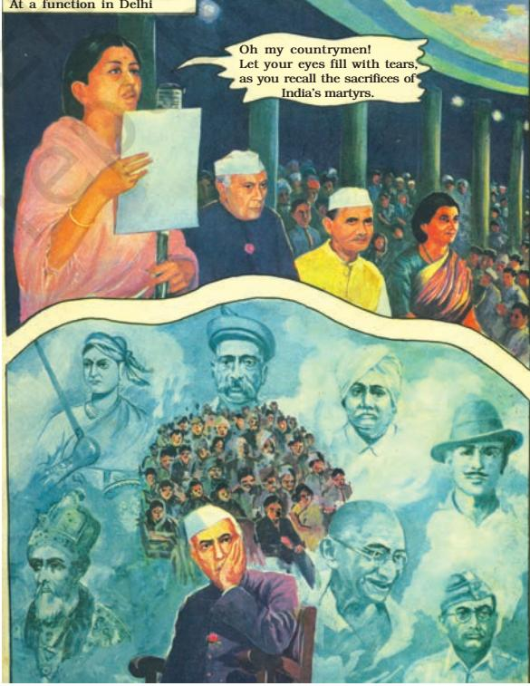

### 2. The Company's conquests (1757-1849)

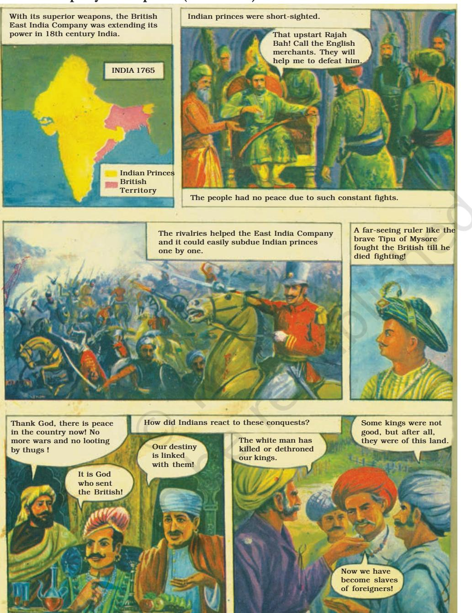

# 3. British Rule (1765-1836)

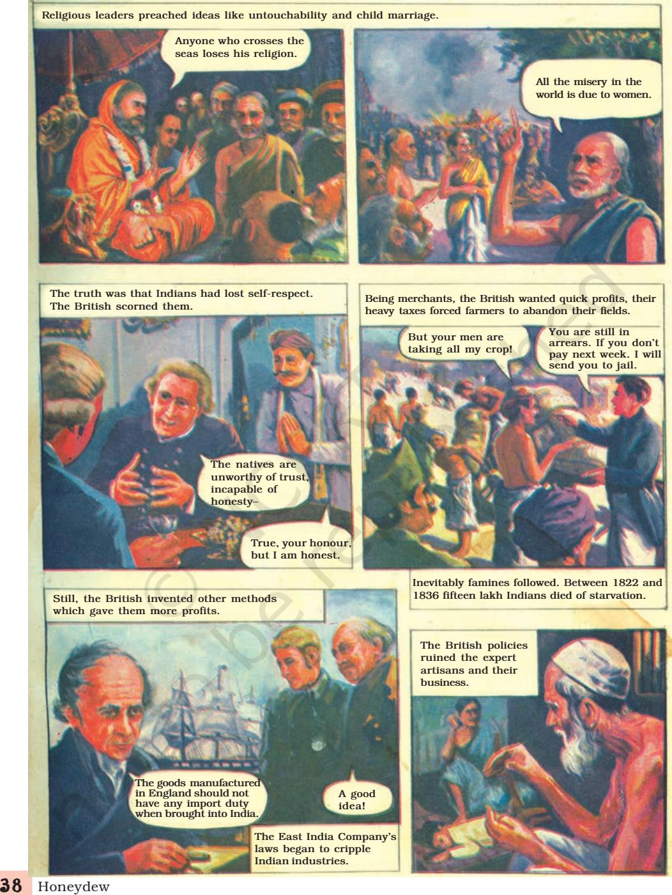

### 4. Ram Mohan Roy (1772-1833)

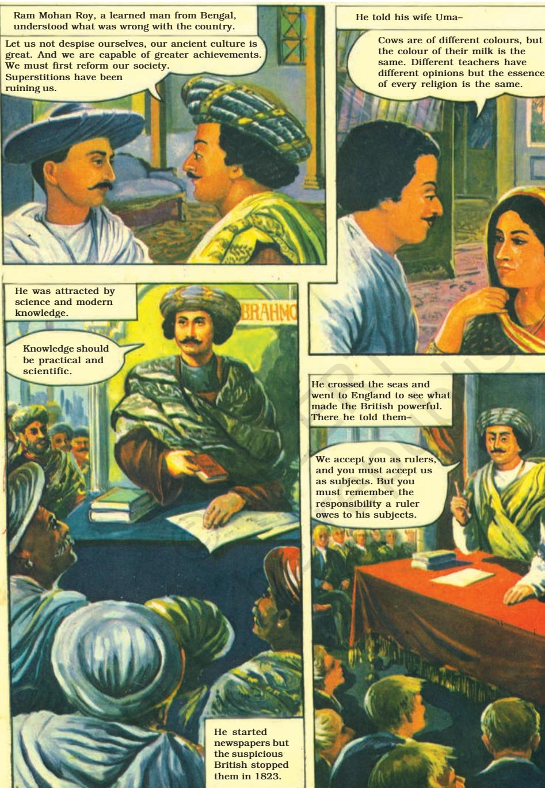

Glimpses of the Past 3 9

### 5. Oppression (1765-1835)

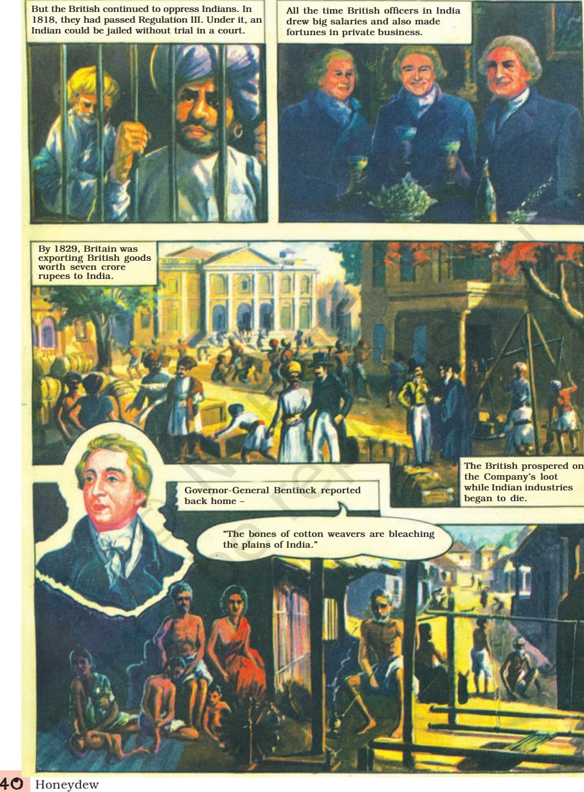

# 6. Dissatisfaction (1835-56)

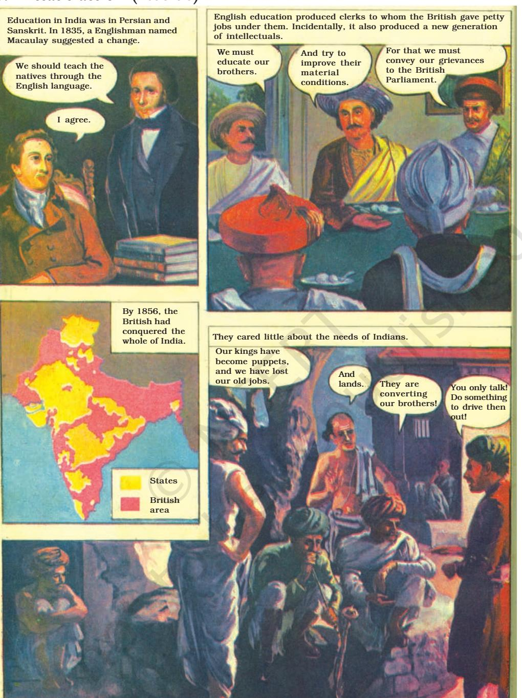

Glimpses of the Past 41

### 7. The Sparks (1855-57)

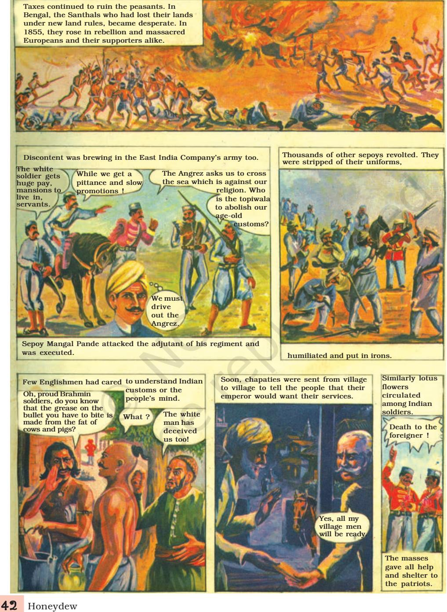

# 8. Revolt (1857)

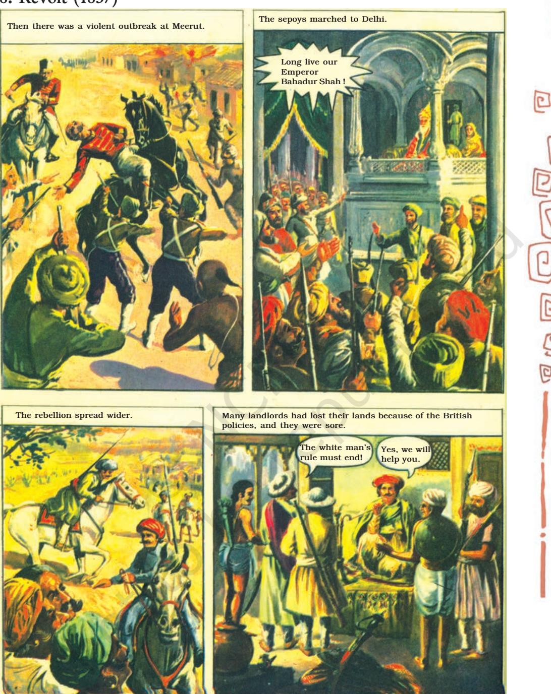

Glimpses of the Past 4 3

## 9. The Fight for Freedom (1857)

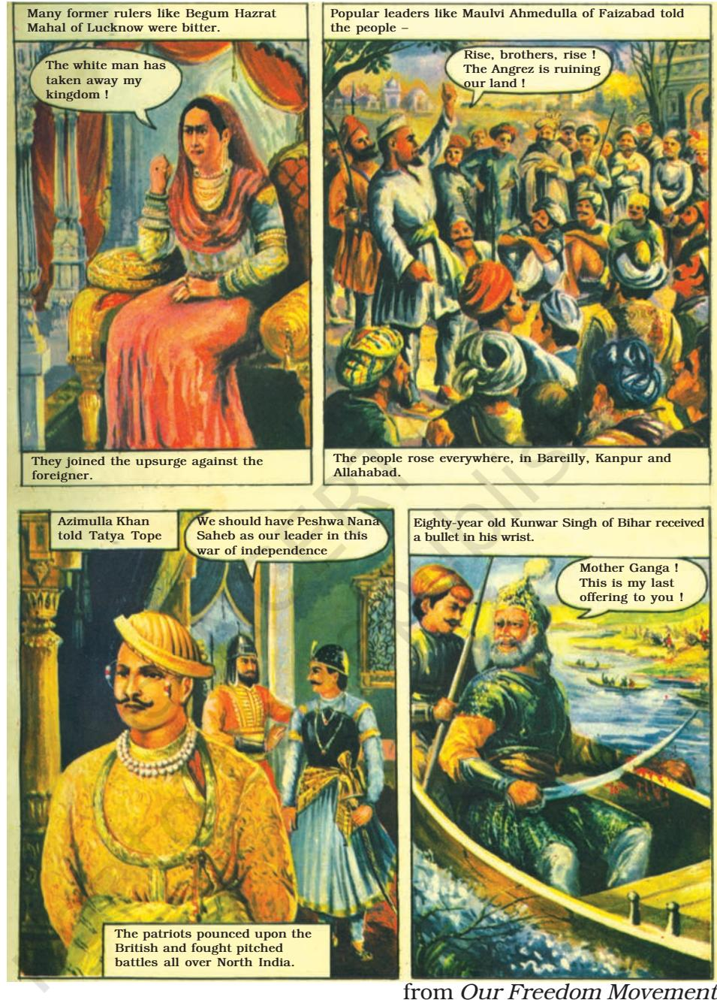

S.D. SAWANT

4 4 Honeydew

#### Comprehension Check

- 1. Look at picture 1 and recall the opening lines of the original song in Hindi. Who is the singer? Who else do you see in this picture?
- 2. In picture 2 what do you understand by the Company's "superior weapons"?
- 3. Who is an artisan? Why do you think the artisans suffered? (picture 3)
- 4. Which picture, according to you, reveals the first sparks of the fire of revolt?

Answer the following questions.

- 1. Do you think the Indian princes were short-sighted in their approach to the events of 1757?
- 2. How did the East India Company subdue the Indian princes?
- 3. Quote the words used by Ram Mohan Roy to say that every religion teaches the same principles.
- 4. In what ways did the British officers exploit Indians?
- 5. Name these people.
	- (i) The ruler who fought pitched battles against the British and died fighting.
	- (ii) The person who wanted to reform the society.
	- (iii) The person who recommended the introduction of English education in India.
	- (iv) Two popular leaders who led the revolt (Choices may vary.)
- 6. Mention the following.
	- (i) Two examples of social practices prevailing then.
	- (ii) Two oppressive policies of the British.
	- (iii) Two ways in which common people suffered.
	- (iv) Four reasons for the discontent that led to the 1857 War of Independence.

In comics what the characters speak is put in bubbles. This is direct narration. When we report what the characters speak, we use the method of indirect narration.

Glimpses of the Past 4 5

Study these examples.

First farmer: Why are your men taking away the entire crop?

Second farmer: Your men have taken away everything.

Officer: You are still in arrears. If you don't pay tax next week, I'll send you to jail.

- l The first farmer asked the officer why his men were taking away the entire crop.
- l The second farmer said that their men had taken away everything.
- l The officer replied that they were still in arrears and warned them that if they did not pay tax the following week, he (the officer) would send them (the farmers) to jail.
- 1. Change the following sentences into indirect speech.
	- (i) First man: We must educate our brothers. Second man: And try to improve their material conditions. Third man: For that we must convey our grievances to the British Parliament.

___________________________________________________________________

___________________________________________________________________

___________________________________________________________________

___________________________________________________________________

__________________________________________________________________

_________________________________________________________________

The first man said that ______________________________________________

The second man added that _______________________________________

The third man suggested that ________________________________________

- (ii) First soldier: The white soldier gets huge pay, mansions and servants. Second soldier: We get a pittance and slow promotions. Third soldier: Who are the British to abolish our customs?
The first soldier said that ___________________________________________

The second soldier remarked that __________________________________

The third soldier asked __________________________________________

- 1. Playact the role of farmers who have grievances against the policies of the government. Rewrite their 'speech bubbles' in dialogue form first.
4 6 Honeydew

- 2. Look at the pictures.
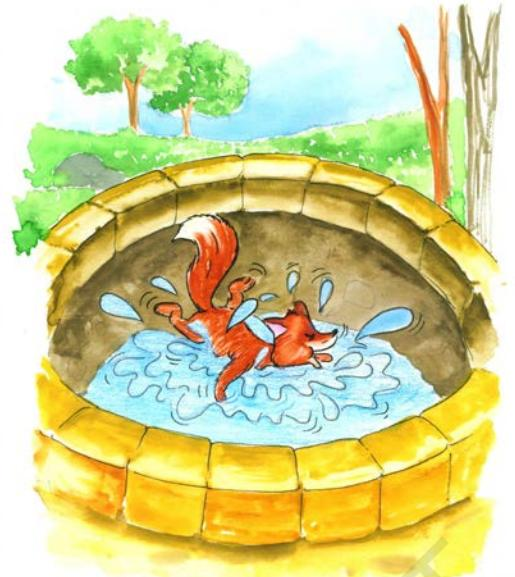

Fox accidentally falls into a well

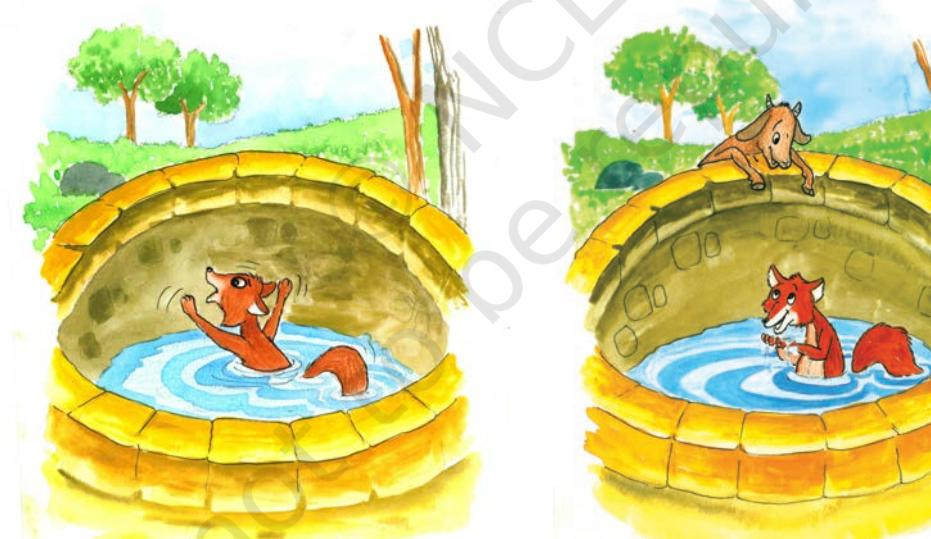

"How do I get out of here?" "Hello! Is this water sweet?"

Glimpses of the Past 4 7

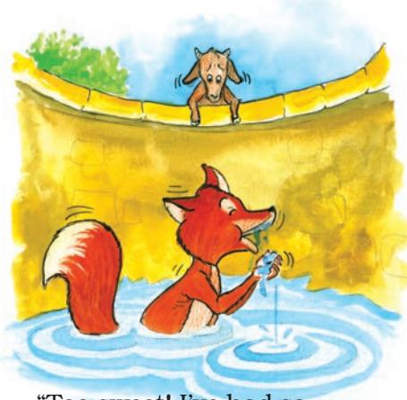

"Too sweet! I've had so much, I might faint."

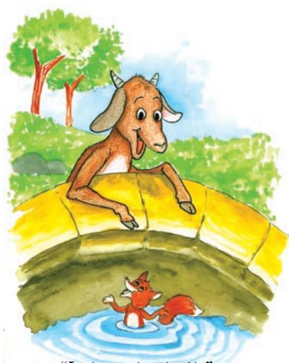

"Let me taste it."

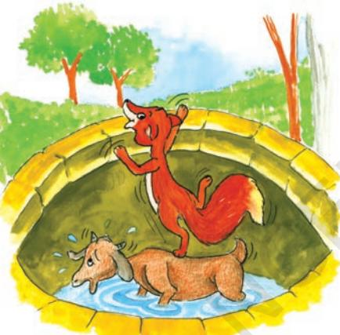

"Thanks for the help. Come out when you can."

"My mother used to say: Be careful how you take the advice of people you don't know."

- (i) Ask one another questions about the pictures.
	-
	- l What is the fox thinking? l Who is the visitor?
	- l What does she want to know? l What is the fox's reply?
	- l What happens next? l Where is the goat?
	-
	- l Where is the fox? l How did it happen?
		-
		-
		-
	- l Where is the fox now? l What is the goat thinking?
- (ii) Write the story in your own words. Give it a title.

______________________________________________________________ ______________________________________________________________

- 3. Read the following news item.
#### History becomes fun at this school

Mumbai: Students in the sixth grade of a certain school in Navi Mumbai love their history lessons thanks to a novel teaching aid. It is not surprising given the fact that their study material includes comic books and they use their textbooks for reference to put things into perspective. Besides, students are encouraged to tap other sources of information as well. During history classes, students pore over comic strips of historical periods, enact characters of emperors and tyrants, and have animated discussions on the subject. History has become fun.

In the class students are asked to read the comic strip aloud, after which they break up into groups of four, discuss what they have heard and write a summary. Each group leader reads his group's summary aloud and the whole class jumps into discussion and debate, adding points, disagreeing and qualifying points of view. A sixth grade student says, "It's a lot of fun because everyone gets a chance to express themselves and the summary takes everyone's ideas into account."

According to the school principal the comic strip format and visuals appeal to students. A historian feels that using comics in schools is a great idea. Comics and acting help students understand what characters in the story are actually thinking.

(adapted from The Times of India, New Delhi, October 2007)

Based on this news item, write a paragraph on what you think about this new method of teaching history.

- 4. Find the chapters in your history book that correspond to the episodes and events described in this comic. Note how the information contained in a few chapters of history has been condensed to a few pages with the help of pictures and 'speech bubbles'.
- 5. Create a comic of your own using this story.

Once the Sun and the Wind began to quarrel, each one saying that he was stronger than the other. At last they decided to test each other's strength. A man with a cloak around his shoulders was passing by. The Wind boasted, "Using my strength I can make that man take off the cloak." The Sun agreed. The Wind blew hard. The man felt so cold that he clasped his cloak round his body as tightly as possible.

Now it was the turn of the Sun which shone very hot indeed. The man felt so hot that he at once removed the cloak from his body. Seeing the man taking off the cloak, the Wind conceded defeat.

Glimpses of the Past 4 9

