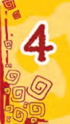
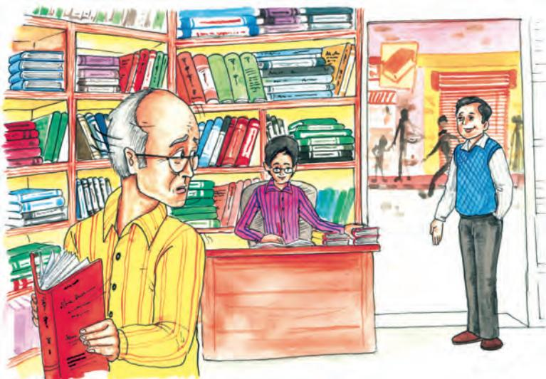
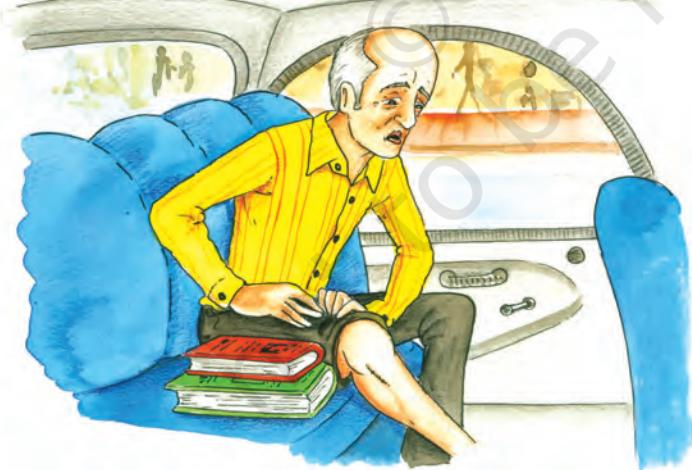
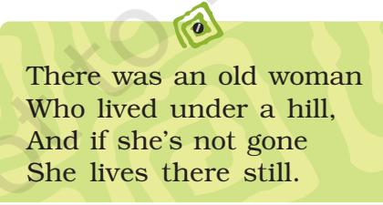
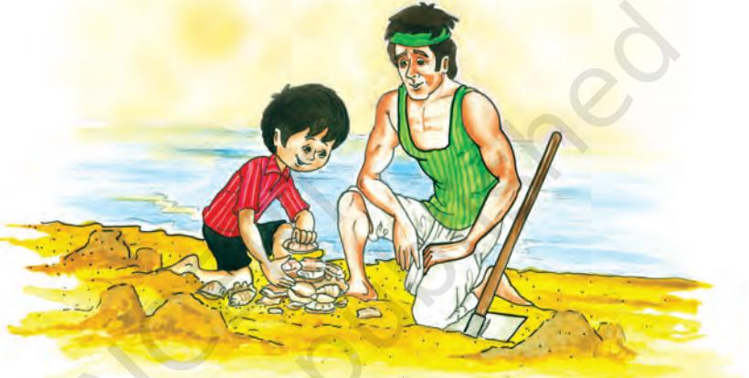

## UNITS 4-7

# Bepin Choudhury's Lapse of Memory

- A Satyajit Ray story with a surprise ending that brings in its wake the much needed psychological relief to the sophisticated executive beleagured by a conspiracy, which is a humorous take after all.
- Before asking children to read the text, tell the story part by part, each part ending where the listener wonders what comes next.
- Activity 3 under working with language is about two tense forms — simple past and present perfect. Notice how both have been used in conjunction with each other. The following explanatory notes may be useful.
	- The present perfect tense is used to refer to an action initiated and completed in the past and is associated with the present. It has its effect on the present situation.

I have seen the Taj. (I know what it looks like.)

He has arrived. (He is here.)

- I have finished my work. (I am free now.)
- Present perfect tense is usual with already, so far,not yet, ever, never etc.

It is not used with ago, yesterday, last week/month/year, etc.

# The Last Bargain

- Here is a method of teaching that may be tried.
	- (a) Let children read the first stanza silently.
		- Ask the following questions.
			- (i) How many persons/characters are there?
			- (ii) Who are they?
			- (iii) Who is big and who is small?
			- (iv) What does the person in the first line say?
			- (v) What does the other one in the fourth line say?
			- (vi) Do they stay together or part company? Why?

- (b) Now reconstruct the episode. Begin like this.
I was walking on the road looking for work. I saw the king in his chariot. He had a sword in his hand. He was very kind to me. He shook my hand and offered to hire me. I did not accept his offer. To me, power is not a valuable thing. It is not permanent. It won't make me happy. I was looking for something else as a reward for my work.

What is he looking for?

Let us read the next stanza.

- (c) Do the other stanzas in the same way.
- The clue to what the person is looking for lies in the last line. The operative phrases are 'the child's play' and 'a free man'.
- The child and her/his play is a metaphor for innocence and inward happiness, which gives this person a sense of fulfilment and freedom from stress and strife. He feels genuinely free and happy in the company of the child.
- Recite each stanza with feeling, pausing at the right places.
- The method suggested may work better for a poem with a story.

# The Summit Within

- Adventure and the world of nature the arduous task of reaching the highest summit in the world makes the climber reflect on the 'internal summits' which are, perhaps, higher than the Everest. The text underscores the physical, emotional and spiritual aspects of the adventure in a single perspective.
- Divide the text into three parts. A convenient division is suggested here.
	- '...............that mountains are a means of communion with God'. (end of Part-I)
	- 'It is emotional. It is spiritual'. (end of Part-II)
	- The remaining is Part-III.
- Design while-reading comprehension questions for each part. The multiple choice items are given at the end of the lesson. You may try the following as additional questions.
	- What is the author's personal answer to the question as to why people climb mountains?
	- How is the same question answered in Part-II in a different way?

Notes for the Teacher 51

- Famous climbers have recorded how they needed just that help? Explain the italicised phrase.
Looking round from the summit, you tell yourself that

- (a) Complete this sentence using the same words as in the text without referring to the book.
- (b) Now complete it using a clause/phrase of your own without changing meaning.
- Activities 2 and 3 under working with language provide ample opportunities for vocabulary development. Extend Activity 2 by choosing new words from the text to cover their adjective and/or adverb forms.

remark – remarkable – remarkably

_____________________________.

type – typical – typically

Use each item in a meaningful context, involving more than one sentence.

'What you say is not appropriate, though it's a good remark.'

'Isn't that remarkable?'

'It may be so, but it doesn't mean you are remarkably objective.'

- You may not find the dialogue above remarkable enough, but it meets the immediate requirement appropriately.
- Re-read and discuss passages where the author's admiration for the mountains and passion for adventure comes through.

## The School Boy

- A school is a place where children and teachers assemble every morning to learn from one another. Find out if any child would like to describe school in a different way.
- An interesting discussion on different types of schools, supported by pictures from magazines/newspapers, may ensue — a village school where children are sitting on the floor; another school where they are sitting at long desks; an outdoor lesson under a tree, etc.
	- Ask children how they reach school. Do they walk or take a bus, etc.? What problems others in remote areas may face in reaching school on time?
- Any suggestions as to how to make school an interesting and enjoyable place!

52 Honeydew

# This is Jody's Fawn

- A story about a child's emotional preoccupation with the fawn whose mother had to be killed to save his father's life. The story highlights values such as compassion and justice, care and concern for human and animal life.
- Spend some time on a discussion about 'home remedies' for commonplace health problems/ailments. Should we see a doctor about every little thing, or should we talk to the grandmother first?
- The growing concern about preservation of environment and protection of animal life has gone a long way in persuading schools to refrain from dissecting animals for experiment. Elicit children's comments on the issue and on the law that punishes humans for hurting animals.
- Activity 1 under working with language is about reporting questions – yes/no and wh-questions. The use of 'if/whether' in the case of yes/no type questions should be explicitly explained. Devise separate exercises for teaching the use of 'if/whether', the appropriate reporting verb, the changes in pronominals in the reported speech and the sequence of tenses.

Here is a simple exercise to exemplify some of these points. Choose the correct word to complete statements in indirect speech given below. Write words in the blanks given.

| (a) | "Where do you come from?" |
| --- | --- |
|  | I ___________(said/asked) him where ______________ (he/ |
|  | you) come from. |
| (b) | "What is your name?" |
|  | He asked me what ____________ (my/his) name. (is/was) |
| (c) | "Are you happy?" |
|  | I asked him ______________ (if/whether) he _____________ |
|  | (is/was) happy. |
| (d) | "Do you live here?" |
|  | He asked me ___________ (whether/if) I ____________ (live/ |
|  | lived) ___________ (here/there). |
| (e) | "Why are you crying?" |
|  | The teacher asked the child ______________ (if/why) she |
|  | _____ (is/was/were) crying. |

Notes for the Teacher 53

Here is another exercise.

Read the following dialogue between Jody and his father. Rewrite their conversation in indirect speech.

Penny lay quiet, staring at the ceiling.

"Boy, you've got me hemmed in."

"It won't take much to raise the fawn.

It will soon start eating leaves."

"You are smarter than boys of your age."

"We took its mother, and it wasn't to blame."

"It seems ungrateful to leave it to starve."

Begin like this:

Penny lay quiet staring at the ceiling. He said to Jody that ______________________________________________. Jody replied

that it wouldn't _________________________

- Activity 2 under working with language deals with transitive and intransitive verbs.
Ask children to underline the direct object in the following sentences.

He brought me a colourful umbrella.

I will write a letter to him.

You should give yourself a chance.

- Activity 3 under writing may be linked with the first task covering home remedies under 'Before you read,' It will be useful to take it up separately also.
# A Visit to Cambridge

- Excerpt from a travelogue highlighting exchange of views between two extraordinary persons on what it means to be 'differently abled'. A tour through Cambridge had a surprise, both pleasant and poignant, for the author. He met the brilliant and completely paralysed author of A Brief History of Time, and talked to him for a full half-hour.
- Activity 2 under working with language is about the present participle (dancing/walking) used as adjective.
- Running on the road, he saw __________. (participle)
- The train is running. __________ (verb)

54 Honeydew

- The running train __________ (adjective)
- The use of past participle as adjective may also be illustrated here.
- He has broken the window. (verb)
- The window was broken when the almirah was taken out (verb — in passive)
- See the broken window. (adjective)
- Activity 3 under speaking and writing may be done as a project. Lot of oral work to precede the writing task. The final draft should be edited and improved before it is put up on the board.
- Activities 1 and 2 under speaking and writing are about word stress. Stressed syllables to be pronounced clearly and loudly. Some words of more than one syllable from the text may also be listed according to whether the stress falls on the first or the second syllable.

Notes for the Teacher 55

### Before you read

Do you have a good memory? Has your memory ever played any tricks on you?

Forgetfulness often puts you in a tight spot. But forgetting a part of your life completely may drive you crazy. In this story, Bepin Babu goes nearly crazy because he cannot recollect his stay at Ranchi. He has never been to Ranchi, he insists, though there are many witnesses to the contrary. What is the suspense all about?

I

Every Monday, on his way back from work, Bepin Choudhury would drop in at Kalicharan's in New Market to buy books. Crime stories, ghost stories and thrillers. He had to buy at least five at a time to last him through the week. He lived alone, was not a good mixer, had few friends, and didn't like spending time in idle chat. Today, at Kalicharan's, Bepin Babu had the feeling that someone was observing him from close quarters. He turned round and found himself looking at a round faced, meek looking man who now broke into a smile.

"I don't suppose you recognise me."

"Have we met before?" asked Bepin Babu.

The man looked greatly surprised. "We met every day for a whole week. I arranged for a car to take you to the Hudroo falls.

## idle chat:

unnecessary, routine conversation

meek: quiet; humble

5 6 Honeydew

In 1958. In Ranchi. My name is Parimal Ghose." "Ranchi?"

Now Bepin Babu realised that it was not he but this man who was making a mistake. Bepin Babu had never been to Ranchi. He had been at the point of going several times, but never made it. He smiled and said, "Do you know who I am?"

The man raised his eyebrows, bit his tongue and said, "Do I know you? Who doesn't know Bepin Choudhury?"

Bepin Babu now turned towards the bookshelves and said, "Still you're making a mistake. One often does. I've never been to Ranchi."

The man now laughed aloud.

"What are you saying, Mr Choudhury? You had a fall in Hudroo and cut your right knee. I brought you iodine. I had fixed up a car for you to go to Netarhat the next day, but you couldn't because of the pain in the knee. Can't you recall anything? Someone else you know was also in Ranchi at that time. Mr Dinesh Mukerji. You stayed in a bungalow. You said you didn't like hotel food and would prefer to have your meals cooked by a

Bepin Choudhury's Lapse of Memory 5 7

bawarchi. Mr Mukerji stayed with his sister. You had a big argument about the moon landing, remember? I'll tell you more: you always carried a bag with your books in it on your sight-seeing trips. Am I right or not?"

Bepin Babu spoke quietly, his eyes still on the books. "Which month in '58 are you talking about?" The man said, "October."

"No, sir," said Bepin Babu. "I spent Puja in '58 with a friend in Kanpur. You're making a mistake. Good day." But the man didn't go, nor did he stop talking.

"Very strange. One evening I had tea with you in a veranda of your bungalow. You spoke about your family. You said you had no children, and that you had lost your wife ten years ago. Your only brother had died insane, which is why you didn't want to visit the mental hospital in Ranchi..."

When Bepin Babu had paid for the books and was leaving the shop, the man was still looking at him in utter disbelief.

### Comprehension Check

- 1. Why did the man stare at Bepin Babu in disbelief?
- 2. Where did Bepin Babu say he went in October '58?
- 3. Mention any three (or more) things that Parimal Ghose knew about Bepin Babu.

## II

Bepin Babu's car was safely parked in Bertram Street by the Lighthouse Cinema. He told the driver as he got into the car, "Just drive by the Ganga, will you, Sitaram." Driving up the Strand Road, Bepin Babu regretted having paid so much attention to the intruder. He had never been to Ranchi — no question about it. It was inconceivable that he should forget such an incident which took place only six or seven years ago. He had an excellent memory. Unless — Bepin Babu's head reeled.

utter disbelief: complete surprise

(his) head

reeled: he was shocked and confused

5 8 Honeydew

Was he losing his mind? But how could that be? He was working daily in his office. It was a big firm, and he was doing a responsible job. He wasn't aware of anything ever going seriously wrong. Only today he spoke for half an hour at an important meeting. And yet...

And yet the man knew a great deal about him. How? He even seemed to know some intimate details. The bag of books, wife's death, brother's insanity... The only mistake was about his having gone to Ranchi. Not a mistake; a deliberate lie. In '58, during the Pujas, he was in Kanpur at his friend Haridas Bagchi's place. All Bepin Babu had to do was write to — no, there was no way of writing to Haridas. Bepin Babu suddenly remembered that Haridas had left with his wife for Japan some weeks ago, and he didn't have his address.

But where was the need for proof? He himself was fully aware that he hadn't been to Ranchi — and that was that.

The river breeze was bracing, and yet a slight discomfort lingered in Bepin Babu's mind.

Around Hastings, Bepin Babu decided to roll up his trousers and take a look at his right knee.

There was the mark of an old inch-long cut. It was impossible to tell when the injury had occurred.

losing his mind: becoming mad

intimate: very personal and private

bracing: stimulating

Bepin Choudhury's Lapse of Memory 5 9

going nuts: going mad/ crazy getting into people's hair: interfering with and annoying people.

Had he never had a fall as a boy and cut his knee? He tried to recall such an incident, but couldn't.

Then Bepin Babu suddenly thought of Dinesh Mukerji. The man had said that Dinesh was in Ranchi at the same time. The best thing surely would be to ask him. He lived quite near — in Beninandan Street. What about going right now? But then, if he had really never been to Ranchi, what would Dinesh think if Bepin Babu asked for a confirmation? He would probably conclude Bepin Babu was going nuts. No; it would be ridiculous to ask him.

And he knew how ruthless Dinesh's sarcasm could be.

Sipping a cold drink in his air-conditioned living room, Bepin Babu felt at ease again. Such a nuisance! Just because they have nothing else to do, they go about getting into other people's hair.

After dinner, snuggling in bed with one of the new thrillers, Bepin Babu forgot all about the man in New Market.

Next day, in the office, Bepin Babu noticed that with every passing hour, the previous day's encounter was occupying more and more of his mind. If the man knew so much about Bepin Babu, how could he make such a mistake about the Ranchi trip?

Just before lunch Bepin Babu decided to ring up Dinesh Mukerji. It was better to settle the question over the phone; at least the embarrassment on his face wouldn't show.

Two-Three-Five-Six-One-Six. Bepin Babu dialled the number.

"Hallo."

"Is that Dinesh? This is Bepin here."

"Well, well — what's the news?"

"I just wanted to find out if you recalled an incident which took place in' 58."

6 0 Honeydew

"'58? What incident?"

"Were you in Calcutta right through that year? That's the first thing I've got to know."

"Wait just a minute... '58... just let me check in my diary."

For a minute there was silence. Bepin Babu could feel that his heartbeat had gone up. He was sweating a little.

"Hallo."

"Yes."

"I've got it. I'd been out twice."

"Where?"

"Once in February — nearby — to Krishnanagar to a nephew's wedding. And then... but you'd know about this one. The trip to Ranchi. You were there too. That's all. But what's all this sleuthing about?"

"No. I just wanted to — anyway, thanks."

Bepin Babu slammed the receiver down and gripped his head with his hands. He felt his head swimming. A chill seemed to spread over his body. There were sandwiches in his tiffin box, but he didn't eat them. He had lost his appetite.

## Comprehension Check

- 1. Why did Bepin Babu worry about what Parimal Ghose had said?
- 2. How did he try to decide who was right—his memory or Parimal Ghose?
- 3. Why did Bepin Babu hesitate to visit Mr Mukerji? Why did he finally decide to phone him?
- 4. What did Mr Mukerji say? Did it comfort Bepin Babu, or add to his worries?

## III

After lunch-time, Bepin Babu realised that he couldn't possibly carry on sitting at his desk and working. This had never happened in the twenty-five years he had been with the firm. He had a reputation for being a

Bepin Choudhury's Lapse of Memory 6 1

carry on: continue

sleuthing: investigating (an event)

conscientious: careful and correct head was in a whirl: (here) confused and unable to think clearly gather his wits together:

make an effort to become calm and think clearly

having a rough time: having a lot of problems turning up like a bad penny: appearing at a place where one is not welcome

### didn't beat about the bush: came straight to the point off and on: now and then throw your mind back: think back and recall a past event

6 2 Honeydew

tireless, conscientious worker. But today his head was in a whirl.

Back home at two-thirty, Bepin Babu lay down in bed and tried to gather his wits together. He knew that it was possible to lose one's memory through an injury in the head, but he didn't know of a single instance of someone remembering everything except one particular incident — and a fairly recent and significant one at that. He had always wanted to go to Ranchi; to have gone there, done things, and not to remember was something utterly impossible.

At seven thirty, Bepin Babu's servant came and announced, "Chuni Babu, sir. Says it's very important."

Bepin Babu knew what Chuni had come for. Chunilal had been at school with him. He'd been having a rough time lately and had been coming to see him about a job. Bepin Babu knew it was not possible to do anything for him and, in fact, told him so. But Chuni kept turning up like a bad penny.

Bepin Babu sent word that not only was it not possible for him to see Chuni now, but not in several weeks.

But as soon as the servant stepped out of the room, it struck Bepin Babu that Chuni might remember something about the '58 trip. There was no harm in asking him.

Bepin Babu hurried down the stairs and into the living room. Chuni was about to leave, but seeing Bepin Babu appear, he turned round hopefully.

Bepin Babu didn't beat about the bush.

"Listen, Chuni - I want to ask you something. You have a good memory, and you've been seeing me off and on for a long time. Just throw your mind back and tell me - did I go to Ranchi in '58?"

Chuni said, "'58? It must have been '58. Or was it '59?"

"You're sure that I did go to Ranchi?"

Chuni's look of amazement was not unmixed with worry.

"D' you mean you have doubts about having gone at all?"

"Did I go? Do you remember clearly?"

Chuni sat down on the sofa, fixed Bepin Babu with a long, hard stare and said, "Bepin, have you taken to drugs or something? As far as I know, you had a clean record where such things were concerned. I know that old friendships don't mean much to you, but at least you had a good memory. You can't really mean that you've forgotten about the Ranchi trip?"

Bepin Babu had to turn away from Chuni's incredulous stare.

"Do you remember what my last job was?" asked Chunilal.

"Of course. You worked in a travel agency."

"You remember that and you don't remember that it was I who fixed up your railway booking for Ranchi? I went to the station to see you off; one of the fans in your compartment was not working — I got an electrician to fix it. Have you forgotten everything? Whatever is the matter with you? You don't look too well, you know."

Bepin Babu sighed and shook his head.

"I've been working too hard," he said at last. "That must be the reason. Must see about consulting a specialist."

Doubtless it was Bepin's condition which made Chunilal leave without mentioning anything about a job.

Paresh Chanda was a young physician with a pair of bright eyes and a sharp nose. He became thoughtful when he heard about Bepin Babu's symptoms. "Look, Dr Chanda," said Bepin Babu desperately, "You must cure me of this horrible illness. I can't tell you how it's affecting my work."

must see about consulting: (here) may have to consult

Dr Chanda shook his head.

"You know what, Mr Choudhury," he said. "I've never had to deal with a case such as yours. Frankly, this is quite outside my field of experience. But I have one suggestion. I don't know if it'll work, but it's worth a try. It can do no harm."

Bepin Babu leaned forward anxiously.

"As far as I can make out," said Dr Chanda, "And I think you're of the same opinion — you must have been to Ranchi, but due to some unknown reason, the entire episode has slipped out of your mind. What I suggest is that you go to Ranchi once again. The sight of the place may remind you of your trip. This is not impossible. More than that I cannot do at the moment. I'm prescribing a nerve tonic and a tranquilliser. Sleep is essential, or the symptoms will get more pronounced."

Bepin Babu felt somewhat better the next morning. After breakfast, he rang up his office, gave some instructions and then procured a first class ticket for Ranchi for the same evening.

### Comprehension Check

- 1. Who was Chunilal? What did he want from Bepin Babu?
- 2. Why was Dr Chanda puzzled? What was unusual about Bepin Babu's loss of memory?

## IV

Getting off the train at Ranchi next morning, he realised at once that he had never been there before.

He came out of the station, took a taxi and drove around the town for a while. He realised that the streets, the buildings, the hotels, the bazaars, the Morabadi Hill — with none of these had he the slightest acquaintance. Would a trip to the Hudroo Falls help? He didn't believe so, but, at the same time, he didn't wish to leave with the feeling that he hadn't tried enough. So he arranged for a car and left for Hudroo in the afternoon.

tranquilliser: a medicine to reduce stress and anxiety

procured: got (with a little difficulty)

At five o'clock the same afternoon in Hudroo, two Gujarati gentlemen from a group of picnickers discovered Bepin Babu lying unconscious beside a boulder. When he came round, the first thing Bepin Babu said was, "I'm finished. There's no hope left."

Next morning, Bepin Babu was back in Calcutta. He realised that there was truly no hope for him. Soon he would lose everything: his will to work, his confidence, his ability, his balance of mind. Was he going to end up in the asylum at...? Bepin Babu couldn't think any more.

Back home, he rang up Dr Chanda and asked him to come over. Then, after a shower, he got into bed with an ice bag clamped on his head. Just then the servant brought him a letter which someone had left in the letter box. A greenish envelope with his name in red ink on it.

Above the name it said 'Urgent and Confidential'. In spite of his condition, Bepin Babu had a feeling that he ought to go through the letter. He tore open the envelope and took out the letter. This is what he read —

Bepin Choudhury's Lapse of Memory 6 5

came round: regained consciousness Dear Bepin,

I had no idea that affluence would bring about the kind of change in you that it has done. Was it so difficult for you to help out an old friend down on his luck? I have no money, so my resources are limited. What I have is imagination, a part of which I used in retribution of your unfeeling behaviour.

Well, you'll be all right again now. A novel I've written is being considered by a publisher. If he likes it enough, it'll see me through the next few months.

Yours, Chunilal

When Dr Chanda came, Bepin Babu said, "I'm fine. It all came back as soon as I got off the train at Ranchi."

"A unique case," said Dr Chanda. "I shall certainly write about it in a medical journal."

"The reason why I sent for you," said Bepin Babu, "is that I have a pain in the hip from a fall I had in Ranchi. If you could prescribe a pain killer…"

SATYAJIT RAY

### Comprehension Check

- 1. Had Bepin Babu really lost his memory and forgotten all about a trip to Ranchi?
- 2. Why do you think Chunilal did what he did? Chunilal says he has no money; what is it that he does have?

- 1. The author describes Bepin Babu as a serious and hardworking man. What evidence can you find in the story to support this?
- 2. Why did Bepin Babu change his mind about meeting Chunilal? What was the result of this meeting?
- 3. Bepin Babu lost consciousness at Hudroo Falls. What do you think was the reason for this?
- 4. How do you think Bepin Babu reacted when he found out that Chunilal had tricked him?

6 6 Honeydew

in retribution of: as a punishment for

- 1. Look at these two sentences.
	- He had to buy at least five books to last him through the week.
	- Bepin had to ask Chuni to leave.

Had to is used to show that it was very important or necessary for Bepin Babu to do something. He had no choice. We can also use 'have to'/ 'has to' in the same way.

Fill in the blanks below using 'had to'/ 'have to'/ 'has to'.

- (i) I ________________ cut my hair every month.
- (ii) We ________________ go for swimming lessons last year.
- (iii) She ________________ tell the principal the truth.
- (iv) They ________________ take the baby to the doctor.
- (v) We ________________ complain to the police about the noise.
- (vi) Romit ________________ finish his homework before he could come out to play.
- (vii) I ________________ repair my cycle yesterday.
- 2. Here are a few idioms that you will find in the story. Look for them in the dictionary in the following way.

First, arrange them in the order in which you would find them in a dictionary.

(Clue: An idiom is usually listed under the first noun, verb, adjective or adverb in it. Ignore articles or prepositions in the idiom).

To help you, we have put in bold the word under which you must look for the idiom in the dictionary.)

- (i) at/from close quarters (close: adjective)
- 

(ii) break into a smile (break: verb; look under 'break into something')

- (iii) carry on (carry: verb)
- 

(iv) have a clean record (you may find related meanings under both these words)

- (v) beat about the bush (verb)
Now refer to your dictionary and find out what they mean.

Bepin Choudhury's Lapse of Memory 6 7

- 3. Study the sentences in the columns below.

| A | B |
| --- | --- |
| I saw this movie yesterday. | I have seen this movie already. |
| Bepin Babu worked here for a week | Bepin Babu has worked here since |
| last year. | 2003. |
| Chunilal wrote to a publisher last | Chunilal has written to a publisher. |
| week. |  |
| I visited Ranchi once, long ago. | I have visited Ranchi once before. |

Compare the sentences in the two columns, especially the verb forms. Answer the following questions about each pair of sentences.

- (i) Which column tells us that Bepin Babu is still working at the same place?
- (ii) Which column suggests that Chunilal is now waiting for a reply from the publisher?
- (iii) Which column suggests that the person still remembers the movie he saw?
- (iv) Which column suggests that the experience of visiting Ranchi is still fresh in the speaker's mind?
- 4. Given below are jumbled sentences. Working in groups, rearrange the words in each sentence to form correct sentences.

You will find that each sentence contains an idiomatic expression that you have come across in the lesson. Underline the idiom and write down its meaning. Then use your dictionary to check the meaning.

One sentence has been worked out for you as an example.

Jumbled sentence: vanished/ The car/ seemed to/ into thin/ have/ air.

Ans: The car seemed to have vanished into thin air.

Idiom: vanished into thin air: disappeared or vanished in a mysterious way

- (i) Stop/and tell me/beating about/what you want/the bush

| Ans: _______________________________________________________ |
| --- |
| Idiom: _____________________________________________________ |

6 8 Honeydew

- (ii) don't pay/If you/ attention/you might/the wrong train/to the announcement/board

|  | Ans: _______________________________________________________ |
| --- | --- |
|  | Idiom: _____________________________________________________ |
| (iii) | The villagers/tried/the crime/on the young woman/to pin |
|  | Ans: _______________________________________________________ |
|  | Idiom: _____________________________________________________ |
| (iv) | Bepin Babu/orders to/telling people/under/loved/doctor's/eat |
|  | early/that he was |
|  | Ans: _______________________________________________________ |
|  | Idiom: _____________________________________________________ |
| (v) | the students/The teacher/his eyebrows/when/said that/all their |
|  | lessons/raised/they had revised |
|  | Ans: _______________________________________________________ |
|  | Idiom: _____________________________________________________ |

- 1. What do you think happened after Bepin Babu came to know the truth? Was he angry with this friend for playing such a trick on him? Or do you think he decided to help a friend in need?
- 2. Imagine you are Bepin Choudhury. You have received Chunilal's letter and feel ashamed that you did not bother to help an old friend down on his luck. Now you want to do something for him. Write a letter to Chunilal promising to help him soon.

Or

A prank is a childish trick. Do you remember any incident when someone played a prank on you or your friends? Describe the prank in a paragraph.

Bepin Choudhury's Lapse of Memory 6 9

A bargain is an agreement in which both parties promise to do something for each other. Someone is looking for work, waiting to be hired. He strikes a bargain but thinks it worthless. He tries twice again but doesn't like either. Finally, in the last bargain, when he is hired for nothing whatever, he is happy as never before. What is the bargain, and why is it the best?

"Come and hire me," I cried, while in the morning I was walking on the stone-paved road.

Sword in hand the King came in his chariot.

- He held my hand and said, "I will hire you with my power,"
- But his power counted for naught, and he went away in his chariot.

In the heat of the mid-day the houses stood with shut doors.

I wandered along the crooked lane.

An old man came out with his bag of gold.

He pondered and said, "I will hire you with my money." He weighed his coins one by one, but I turned away.

7 0 Honeydew

It was evening. The garden hedge was all aflower.

- The fair maid came out and said, "I will hire you with a smile."
- Her smile paled and melted into tears, and she went back alone into the dark.
- The sun glistened on the sand, and the sea waves broke waywardly.
- A child sat playing with shells.
- He raised his head and seemed to know me and said, "I hire you with nothing."
- From henceforward that bargain struck in child's play made me a free man.

RABINDRANATH TAGORE

- 1. Who is the speaker in the poem?
- 2. "The king, sword in hand" suggests
	- (i) wealth
	- (ii) power
	- (iii) more power than wealth.

Mark the appropriate item in the context of stanza 1.

- 3. The old man offered the speaker a lot of money. Why did he turn down the offer?
- 4. Find in the poem, lines that match the following. Read both one after another.
	- (i) I have nothing to give you except goodwill and cheer.
	- (ii) Her happiness was no more than sorrow in disguise.
	- (iii) The king's might was not worth much.
- 5. How did the speaker feel after talking to the child on the beach?

Bepin Choudhury's Lapse of Memory 71

