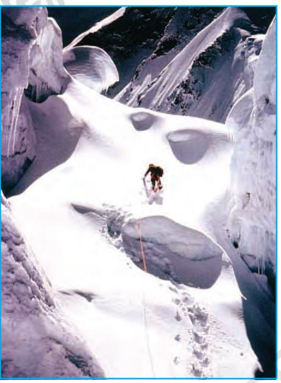
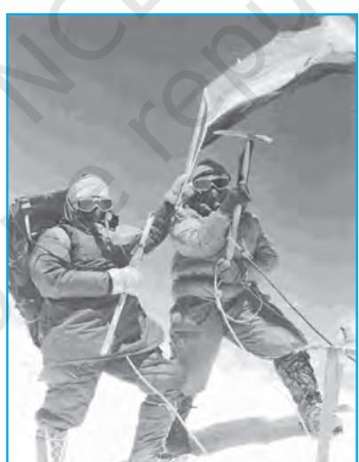

# Before you read

Major H.P.S. Ahluwalia was a member of the first successful Indian expedition to Mount Everest in 1965. How did he feel when he stood on the highest point in the world? Let us hear his story in his words climbing the summit and, then, the more difficult task of climbing the summit within.

Of all the emotions which surged through me as I stood on the summit of Everest, looking over miles of panorama below us, the dominant one I think was humility. The physical in me seemed to say, 'Thank God, it's all over!" However, instead of being jubilant, there was a tinge of sadness. Was it because I had already done the 'ultimate' in climbing and there would be nothing higher to climb and all roads hereafter would lead down?

By climbing the summit of Everest you are overwhelmed by a deep sense of joy and thankfulness. It is a joy which lasts a lifetime. The experience changes you completely. The man who has been to the mountains is never the same again.

As I look back at life after climbing Everest I cannot help remarking about the other summit — the summit of the mind — no less formidable and no easier to climb.

### surged:

arose suddenly and intensely

panorama: view of a wide area

## jubilant:

very happy because of success

tinge: trace/shade

72 Honeydew

Even when getting down from the summit, once the physical exhaustion had gone, I began asking myself the question why I had climbed Everest. Why did the act of reaching the summit have such a hold on my imagination? It was already a thing of the past, something done yesterday. With every passing day, it would become more remote. And then what would remain? Would my memories fade slowly away?

All these thoughts led me to question myself as to why people climb mountains. It is not easy to answer the question. The simplest answer would be, as others have said, "Because it is there." It presents great difficulties. Man takes delight in overcoming obstacles. The obstacles in climbing a mountain are physical. A climb to a summit means endurance, persistence and will power. The demonstration of these physical qualities is no doubt exhilarating, as it was for me also.

I have a more personal answer to the question. From my childhood I have been attracted by mountains. I had been miserable, lost, when away from mountains, in the plains. Mountains are nature at its best. Their beauty and majesty pose a great challenge, and like many, I believe that mountains are a means of communion with God.

Once having granted this, the question remains: Why Everest? Because it is the highest, the mightiest and has defied many previous attempts. It takes the last ounce of one's energy. It is a brutal struggle with rock and ice. Once taken up, it cannot be given up halfway even when one's life is at stake. The passage back is as difficult as the passage onwards. And then, when the summit is climbed, there is the exhilaration, the joy of having done something, the sense of a battle fought and won. There is a feeling of victory and of happiness.

Glimpsing a peak in the distance, I get transported to another world. I experience a change within myself exhaustion: fatigue; tiredness

exhilarating: very exciting communion: state or feeling

of close relationship defied: frustrated; resisted

The Summit Within 73

### mystical: spiritual

which can only be called mystical. By its beauty, aloofness, might, ruggedness, and the difficulties encountered on the way, the peak draws me to it — as Everest did. It is a challenge that is difficult to resist.

Looking back I find that I have not yet fully explained why I climbed Everest. It is like answering a question why you breathe. Why do you help your neighbour? Why do you want to do good acts? There is no final answer possible.

And then there is the fact that Everest is not just a physical climb. The man who has been to the mountain-top becomes conscious in a special manner of his own smallness in this large universe.

The physical conquest of a mountain is only one part of the achievement. There is more to it than that. It is followed by a sense of fulfilment. There is the satisfaction of a deep urge to rise above one's surroundings. It is the

eternal love for adventure in man. The experience is not merely physical. It is emotional. It is spiritual.

Consider a typical climb, towards the summit on the last heights. You are sharing a rope with another climber. You firm in. He cuts the steps in the hard ice. Then he belays and you inch your way up. The climb is grim. You strain every nerve as you take every step. Famous climbers have left records of the help given by others. They have also recorded how they needed just that help. Else they might have given up. Breathing is difficult. You curse yourself for having let yourself in for this. You wonder why you ever undertook the ascent. There are moments when you feel like going back. It would be sheer relief to go down, instead of up. But almost at once you snap out of that mood. There is something in you that does not let you give up the

ascent: climb

74 Honeydew

struggle. And you go on. Your companion keeps up with you. Just another fifty feet. Or a hundred, maybe. You ask yourself: Is there no end? You look at your companion and he looks at you. You draw inspiration from each other. And then, without first being aware of it, you are at the summit.

Looking round from the summit you tell yourself that it was worthwhile. Other silvery peaks appear through the clouds. If you are lucky the sun may be on them. The surrounding peaks look like a jewelled necklace around the neck of your summit. Below, you see vast valleys sloping into the distance. It is an ennobling, enriching experience to just look down from the summit of a mountain. You bow down and make your obeisance to whichever God you worship.

I left on Everest a picture of Guru Nanak. Rawat left a picture of Goddess Durga. Phu Dorji left a relic of the Buddha. Edmund Hillary had buried a cross under a cairn (a heap of rocks and stones) in the snow. These are not symbols of conquest but of reverence.

The experience of having climbed to the summit changes you completely.

There is another summit. It is within yourself. It is in your own mind. Each man carries within himself his own mountain peak. He must climb it to reach to a fuller knowledge of himself. It is fearful, and unscalable. It cannot be climbed by anyone else. You yourself have to do it. The physical act of climbing to the summit of a mountain

The author and Phu-Dorji on the summit of Mount Everest

make your obeisance: show your obedience or submission

outside is akin to the act of climbing the mountain within. The effects of both the climbs are the same. Whether the mountain you climb is physical or emotional and spiritual, the climb will certainly change you. It teaches you much about the world and about yourself.

I venture to think that my experience as an Everester has provided me with the inspiration to face life's ordeals resolutely. Climbing the mountain was a worthwhile experience. The conquest of the internal summit is equally worthwhile. The internal summits are, perhaps, higher than Everest.

H.P.S. AHLUWALIA

# Comprehension Check

- 1. Standing on Everest, the writer was
	- (i) overjoyed.
	- (ii) very sad.
	- (iii) jubilant and sad.
	- Choose the right item.
- 2. The emotion that gripped him was one of
	- (i) victory over hurdles.
	- (ii) humility and a sense of smallness.
	- (iii) greatness and self importance.
	- (iv) joy of discovery.

Choose the right item.

- 3. "The summit of the mind" refers to
	- (i) great intellectual achievements.
	- (ii) the process of maturing mentally and spiritually.
	- (iii) overcoming personal ambition for common welfare.
	- (iv) living in the world of thought and imagination.
	- (v) the triumph of mind over worldly pleasures for a noble cause.
	- (vi) a fuller knowledge of oneself.

Mark the item(s) not relevant.

76 Honeydew

ordeals: painful experiences resolutely: with

determination or firmness

- 1. Answer the following questions.
	- (i) What are the three qualities that played a major role in the author's climb?
	- (ii) Why is adventure, which is risky, also pleasurable?
	- (iii) What was it about Mount Everest that the author found irresistible?
	- (iv) One does not do it (climb a high peak) for fame alone. What does one do it for, really?
	- (v) "He becomes conscious in a special manner of his own smallness in this large universe." This awareness defines an emotion mentioned in the first paragraph. Which is the emotion?
	- (vi) What were the "symbols of reverence" left by members of the team on Everest?
	- (vii) What, according to the writer, did his experience as an Everester teach him?
- 2. Write a sentence against each of the following statements. Your sentence should explain the statement. You can pick out sentences from the text and rewrite them. The first one has been done for you.
	- (i) The experience changes you completely. One who has been to the mountains is never the same again.
	- (ii) Man takes delight in overcoming obstacles.

_________________________________________

_________________________________________

_________________________________________

_________________________________________

- (iii) Mountains are nature at its best.
- (iv) The going was difficult but the after-effects were satisfying.
- (v) The physical conquest of a mountain is really a spiritual experience.

The Summit Within 77

- 1. Look at the italicised phrases and their meanings given in brackets.

| Mountains are nature | (nature's best form and appearance) |
| --- | --- |
| at its best. |  |
| Your life is at risk. | (in danger; you run the risk of losing |
|  | your life.) |
| He was at his | (it was his best/worst performance.) |
| best/worst in the |  |
| last meeting. |  |

Fill in the blanks in the following dialogues choosing suitable phrases from those given in the box.

at hand at once at all at a low ebb at first sight

- (i) Teacher: You were away from school without permission. Go to the principal ________________ and submit your explanation.
- Pupil: Yes, Madam. But would you help me write it first? (ii) Arun: Are you unwell? Ila: No, not ________________ Why do you ask?

Arun: If you were unwell, I would send you to my uncle. He is a doctor.

- (iii) Mary: Almost every Indian film has an episode of love ________________. David: Is that what makes them so popular in foreign countries?
- (iv) Asif: You look depressed. Why are your spirits ________________ today? (Use such in the phrase) Ashok: I have to write ten sentences using words that I never heard before.
- (v) Shieba: Your big moment is close ________________. Jyoti: How should I welcome it? Shieba: Get up and receive the trophy.
- 2. Write the noun forms of the following words adding -ance or -ence to each.
	- (i) endure ________________ (ii) persist ________________
	- (iii) signify ________________ (iv) confide ________________
	- (v) maintain ________________ (vi) abhor ________________

78 Honeydew

- 3. (i) Match words under A with their meanings under B.

| A | B |
| --- | --- |
| remote | difficult to overcome |
| means | most prominent |
| dominant | be overcome/overpowered |
| formidable | method(s) |
| overwhelmed | far away from |

- (ii) Fill in the blanks in the sentences below with appropriate words from under A.
	- (a) There were ________________ obstacles on the way, but we reached our destination safely.
	- (b) We have no ________________ of finding out what happened there.
	- (c) Why he lives in a house ________________ from any town or village is more than I can tell.
	- (d) ________________ by gratitude, we bowed to the speaker for his valuable advice.
	- (e) The old castle stands in a ___________ position above the sleepy town.

Write a composition describing a visit to the hills, or any place which you found beautiful and inspiring.

Before writing, work in small groups. Discuss the points given below and decide if you want to use some of these points in your composition.

- Consider this sentence
Mountains are a means of communion with God.

- Think of the act of worship or prayer. You believe yourself to be in the presence of the divine power. In a way, you are in communion with that power.
- Imagine the climber on top of the summit—the height attained; limitless sky above; the climber's last ounce of energy spent; feelings of gratitude, humility and peace.
- The majesty of the mountains does bring you close to nature and the spirit and joy that lives there, if you have the ability to feel it.

Some composition may be read aloud to the entire class afterwards.

The Summit Within 79

The school boy in the poem is not a happy child. What makes him unhappy? Why does he compare himself to a bird that lives in a cage, or a plant that withers when it should blossom.

> I love to rise in a summer morn, When the birds sing on every tree; The distant huntsman winds his horn, And the skylark sings with me. O! what sweet company.

> But to go to school in a summer morn, O! it drives all joy away; Under a cruel eye outworn, The little ones spend the day, In sighing and dismay.

Ah! then at times I drooping sit, And spend many an anxious hour. Nor in my book can I take delight, Nor sit in learning's bower, Worn thro' with the dreary shower.

How can the bird that is born for joy, Sit in a cage and sing. How can a child when fears annoy, But droop his tender wing, And forget his youthful spring.

80 Honeydew

O! Father and Mother, if buds are nip'd, And blossoms blown away, And if the tender plants are strip'd Of their joy in the springing day, By sorrow and cares dismay,

> How shall the summer arise in joy, Or the summer fruits appear?

> > WILLIAM BLAKE

nip'd: (nipped) 'to nip something in the bud' is to stop or

destroy it at an early stage of its development

strip'd: stripped

plants strip'd of joy: if joy is taken away from plants

- 1. Find three or four words/phrases in stanza 1 that reflect the child's happiness and joy.
- 2. In stanza 2, the mood changes. Which words/phrases reflect the changed mood?
- 3. 'A cruel eye outworn' (stanza 2) refers to
	- (i) the classroom which is shabby/noisy.
	- (ii) the lessons which are difficult/uninteresting.
	- (iii) the dull/uninspiring life at school with lots of work and no play.
	- Mark the answer that you consider right.
- 4. 'Nor sit in learning's bower

worn thro' with the dreary shower'

Which of the following is a close paraphrase of the lines above?

- (i) Nor can I sit in a roofless classroom when it is raining.
- (ii) Nor can I learn anything at school though teachers go on lecturing and explaining.
- (iii) Nor can I sit in the school garden for fear of getting wet in the rain.

The One Furrow When I was young, I went to school With pencil and footrule Sponge and slate, And sat on a tall stool At learning's gate.

When I was older, the gate swung wide; Clever and keen-eyed In I pressed, But found in the mind's pride No peace, no rest.

Then who was it taught me back to go To cattle and barrow, Field and plough: To keep to the one furrow, As I do now?

R.S. THOMAS

# The Other he Other he Other Way Round ay Rounday Round

- Quicksand works slowly.
- There is no egg in eggplant, no ham in hamburger and neither apple nor pine in pineapple.
- Boxing rings are square.
- There are noses that run and feet that smell.

82 Honeydew

