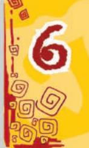
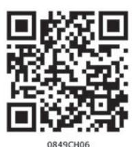
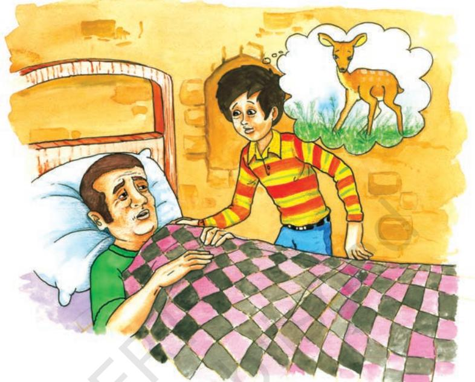
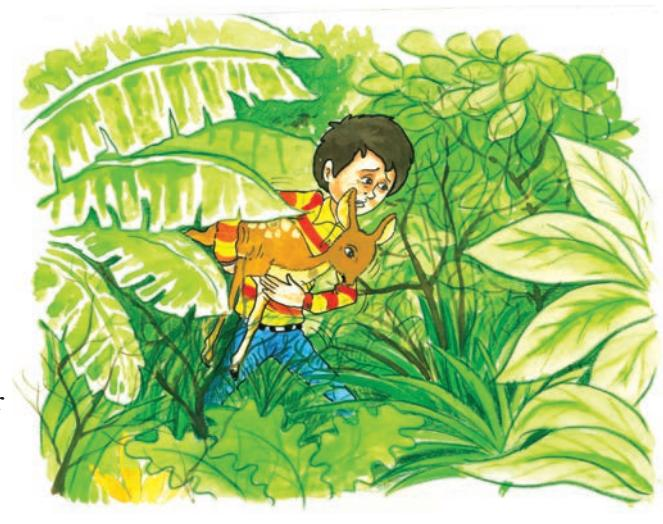

## Before you read

Often, instead of rushing to the doctor to treat a small cut or burn, we find quick and effective cures using things available at home. Can you think of some such 'home remedies' for

- a cut on your knee?
- a burn on your arm?
- a bee sting?

In this story, Jody's father has been bitten by a rattlesnake. He quickly kills a doe and uses its heart and liver to draw out the poison. Jody wonders what will happen to the little fawn left without a mother.

I

Jody allowed his thoughts to drift back to the fawn. He could not keep it out of his mind. He had held it, in his dreams, in his arms. He slipped from the table and went to his father's bedside. Penny lay at rest. His eyes were open and clear, but the pupils were still dark and dilated.

Jody said, "How are you feeling, Pa?"

"Just fine, son. O1d Death has gone thieving elsewhere. But wasn't it a close shave!"

"I agree."

Penny said, "I'm proud of you, boy, the way you kept your head and did what was needed."

drift back to: go back to dilated: enlarged

a close shave: a narrow escape

kept your head:

This is Jody's Fawn 8 3

stayed calm in a difficult situation

"Pa-"

"Yes, son."

"Pa, do you recollect the doe and the fawn?"

"I can never forget them. The poor doe saved me, that's certain."

"Pa, the fawn may be out there yet. It might be hungry and very scared."

"I suppose so."

"Pa, I'm a big boy now and don't need to drink milk. Why don't I go and see if I can find the fawn?"

"And bring it here?"

"And raise it."

Penny lay quiet, staring at the ceiling.

"Boy, you've got me hemmed in."

"It won't take much to raise it, Pa. It'll soon start eating leaves and acorns."

"You are smarter than boys of your age."

"We took its mother, and it wasn't to blame."

 "Surely it seems ungrateful to leave it to starve. Son, I can't say 'No' to you. I never thought I'd live to see another day."

hemmed in:

(here) caught in a situation where one can't say 'no'

### acorns:

small brown nuts

8 4 Honeydew

"Can I ride back with Mill-wheel and see if I can find it?"

"Tell your Ma I said you can go."

He sidled back to the table and sat down. His mother was pouring coffee for everyone.

He said, "Ma, Pa says I can go bring back the fawn." She held the coffee pot in mid-air.

"What fawn?"

"The fawn belonging to the doe we killed. We used the doe's liver to draw out the poison and save Pa."

She gasped.

"Well, for pity sake—"

"Pa says it would be ungrateful to leave it to starve." Doc Wilson said, "That's right, Ma'am. Nothing in the world comes quite free. The boy's right and his daddy's right."

Mill-wheel said, "He can ride back with me. I'll help him find it."

She set down the pot helplessly.

"Well, if you'll give it your milk—we've got nothing else to feed it."

Mill-wheel said, "Come on, boy. We've got to get riding."

Ma Baxter asked anxiously, "You'll not be gone long?"

Jody said, "I'll be back before dinner for sure. "

Mill-wheel mounted his horse and pulled Jody up behind him.

He said to Mill-wheel, "Do you think the fawn's still there? Will you help me find him?"

sidled back: walked back quietly, trying not to be noticed

#### every which

way: in different directions

"We'll find him if he's alive. How you know it's a he?" "The spots were all in a line. On a doe-fawn, Pa says the spots are every which way…"

## Comprehension Check

- 1. What had happened to Jody's father?
- 2. How did the doe save Penny's life?
- 3. Why does Jody want to bring the fawn home?
- 4. How does Jody know that the fawn is a male?

# II

Jody gave himself over to thoughts of the fawn. They passed the abandoned clearing.

He said, "Cut to the north, Mill-wheel. It was up here that Pa got bitten by the snake and killed the doe and I saw the fawn."

Suddenly Jody was unwilling to have Mill-wheel with him. If the fawn was dead, or could not be found, he could not have his disappointment seen. And if the fawn was there, the meeting would be so lovely and so secret that he could not endure to share it.

He said, "It's not far now, but the scrub is very thick for a horse. I can make it on foot."

"But I'm afraid to leave you, boy. Suppose you got lost or got bitten by the snake, too?"

"I'll take care. It might take me a long time to find the fawn, if he's wandered. Leave me off right here."

"All right, but you take it easy now. You know north here, and east?"

"There, and there. That tall pine makes a bearing." "So long."

"So long, Mill-wheel. I'm obliged."

He waited for the sound of the hooves to end, then cut to the right. The scrub was still. Only his own crackling of twigs sounded across the silence. He wondered for an instant if he had mistaken his direction.

makes a bearing: acts as a compass and helps to identify directions

8 6 Honeydew

Then a buzzard rose in front of him and flapped into the air. He came into the clearing under the oaks. Buzzards sat in a circle around the carcass of the doe. They turned their heads on their long scrawny necks and hissed at him. He threw his bough at them and they flew into an adjacent tree. The sand showed large cat prints but the big cats killed fresh, and they had left the doe to the carrion birds.

He parted the grass at the place where he had seen the fawn. It did not seem possible that it was only yesterday. The fawn was not there. He circled the clearing. There was no sound, no sign. The buzzards clacked their wings, impatient to return to their business. He returned to the spot where the fawn had emerged and dropped on all fours, studying the sand for the small hoof prints. The night's rain had washed away all tracks except those of cat and buzzards.

### Comprehension Check

- 1. Jody didn't want Mill-wheel with him for two reasons. What were they?
- 2. Why was Mill-wheel afraid to leave Jody alone?

# III

Movement directly in front of him startled him so that he tumbled backward. The fawn lifted its face to his. It turned its head with a wide, wondering motion and shook him through with the stare of its liquid eyes. It was quivering. It made no effort to rise or run. Jody could not trust himself to move.

He whispered, "It's me."

The fawn lifted its nose, scenting him. He reached out one hand and laid it on the soft neck. The touch made him delirious. He moved forward on all fours until he was close beside it. He put his arms around its body. A light convulsion passed over it but it did not stir.

#### buzzard:

a large bird like the vulture that eats the flesh of dead animals adjacent: nearby

parted: moved or pushed aside

quivering: shaking slightly delirious: (here) extremely excited convulsion: shiver

This is Jody's Fawn 8 7

### a china deer:

a clay deer that is easily broken

#### sleek:

smooth and shiny

hoist: pull up higher

He stroked its sides as gently as though the fawn were a china deer and he might break it. Its skin was very soft. It was sleek and clean and had a sweet scent of grass. He rose slowly and lifted the fawn

from the ground. Its legs hung limply. They were surprisingly long and he had to hoist the fawn as high as possible under his arm.

He was afraid that it might kick and bleat at sight and smell of its mother. He skirted the clearing and pushed his way into the thicket. It was difficult to fight through with his burden. The fawn's legs caught in the bushes and he could not lift his own with freedom. He tried to shield its face from prickling vines. Its head bobbed with his stride. His heart thumped with the marvel of its acceptance of him. He reached the trail and walked as fast as he could until he came to the intersection with the road home. He stopped to rest and set the fawn down on its dangling legs. It wavered on them. It looked at him and bleated.

He said, enchanted, "I'll carry you after I get my breath." He remembered his father saying that a fawn would follow if it had first been carried. He started away slowly. The fawn stared after him. He came back to it and stroked it and walked away again. It took a few wobbling steps toward him and cried piteously. It was willing to follow him. It belonged to him. It was his own. He was light-headed with his joy. He wanted to fondle it, to run

light-headed: unable to think clearly

8 8 Honeydew

and romp with it, to call to it to come to him. He dared not alarm it. He picked it up and carried it in front of him over his two arms. It seemed to him that he walked without effort.

His arms began to ache and he was forced to stop again. When he walked on, the fawn followed him at once. He allowed it to walk a little distance, then picked it up again. The distance home was nothing. He could have walked all day and into the night, carrying it and watching it follow. He was wet with sweat but a light breeze blew through the June morning, cooling him. The sky was as clear as spring water in a blue china cup. He came to the clearing. It was fresh and green after the night's rain. He fumbled with the latch and was finally obliged to set down the fawn to manage it. Then, he had an idea — he would walk into the house, into Penny's bedroom, with the fawn walking behind him. But at the steps, the fawn balked and refused to climb them. He picked it up and went to his father. Penny lay with closed eyes.

Jody called, "Pa! Look!"

Penny turned his head. Jody stood beside him, the fawn clutched hard against him. It seemed to Penny that the boy's eyes were as bright as the fawn's. He said, "I'm glad you found him."

Jody then went to the kitchen. The fawn wobbled after him. A pan of morning's milk stood in the kitchen safe. The cream had risen on it. He skimmed the cream into a jug. He poured milk into a small gourd. He held it out to the fawn. It butted it suddenly, smelling the milk. He saved it precariously from spilling over the floor. It could make nothing of the milk in the gourd.

He dipped his fingers in the milk and thrust them into the fawn's soft wet mouth. It sucked greedily. When he withdrew them, it bleated frantically and butted him. He dipped his fingers again and as the fawn sucked, he lowered them slowly into the milk. The fawn blew and romp: play alarm: frighten

balked: (also baulked) was unwilling (to do something)

sucked and snorted. It stamped its small hoofs impatiently. As long as he held his fingers below the level of the milk, the fawn was content. It closed its eyes dreamily. It was ecstasy to feel its tongue against his hand. Its small tail flicked back and forth. The last of the milk vanished in a swirl of foam and gurgling.

MARJORIE KINNAN RAWLINGS

### Comprehension Check

- 1. How did Jody bring the fawn back home?
- 2. Jody was filled with emotion after he found the fawn. Can you find at least three words or phrases which show how he felt?
- 3. How did the deer drink milk from the gourd?
- 4. Why didn't the fawn follow Jody up the steps as he had thought it would?

- 1. Why did Penny Baxter allow Jody to go find the fawn and raise it?
- 2. What did Doc Wilson mean when he said, "Nothing in the world ever comes quite free"?
- 3. How did Jody look after the fawn, after he accepted the responsibility for doing this?
- 4. How does Jody's mother react when she hears that he is going to bring the fawn home? Why does she react in this way?

- 1. Look at these pairs of sentences.
Penny said to Jody, "Will you be back before dinner?" Penny asked Jody if he would be back before dinner. "How are you feeling, Pa?" asked Jody. Jody asked his father how he was feeling.

9 0 Honeydew

Here are some questions in direct speech. Put them into reported speech.

- (i) Penny said, "Do you really want it son?"
- (ii) Mill-wheel said, "Will he ride back with me?"
- (iii) He said to Mill-wheel, "Do you think the fawn is still there?"
- (iv) He asked Mill-wheel, "Will you help me find him?"
- (v) He said, "Was it up here that Pa got bitten by the snake?"
- 2. Look at these two sentences.

He tumbled backward.

It turned its head.

The first sentence has an intransitive verb, a verb without an object.

The second sentence has a transitive verb. It has a direct object. We can ask: "What did it turn?" You can answer: "Its head. It turned its head."

Say whether the verb in each sentence below transitive or intransitive. Ask yourself a 'what' question about the verb, as in the example above. (For some verbs, the object is a person, so ask the question 'who' instead of 'what').

- (i) Jody then went to the kitchen.
- (ii) The fawn wobbled after him.
- (iii) You found him.
- (iv) He picked it up.
- (v) He dipped his fingers in the milk.
- (vi) It bleated frantically and butted him.
- (vii) The fawn sucked his fingers.
- (viii) He lowered his fingers slowly into the milk.
- (ix) It stamped its small hoofs impatiently.
- (x) He held his fingers below the level of the milk.
- (xi) The fawn followed him.
- (xii) He walked all day.
- (xiii) He stroked its sides.
- (xiv) The fawn lifted its nose.
- (xv) Its legs hung limply.

- 3. Here are some words from the lesson. Working in groups, arrange them in the order in which they would appear in the dictionary. Write down some idioms and phrasal verbs connected to these words. Use the dictionary for more idioms and phrasal verbs.

| close | draw | make | wonder | scrawny |
| --- | --- | --- | --- | --- |
| parted | clearing | sweet | light | pick |

- 1. Do you think it is right to kill an animal to save a human life? Give reasons for your answer.
- 2. Imagine you wake up one morning and find a tiny animal on your doorstep. You want to keep it as a pet but your parents are not too happy about it. How would you persuade them to let you keep it? Discuss it in groups and present your arguments to the class.

- 1. Imagine you have a new pet that keeps you busy. Write a paragraph describing your pet, the things it does, and the way it makes you feel. Here are some words and phrases that you could use.
frisky, smart, disobedient, loyal, happy, enthusiastic, companion, sharing, friend, rolls in mud, dirties the bed, naughty, lively, playful, eats up food, hides the newspaper, drinks up milk, runs away when called, floats on the water as if dead

- 2. Human life is dependent on nature (that's why we call her Mother Nature). We take everything from nature to live our lives. Do we give back anything to nature?
	- (i) Write down some examples of the natural resources that we use.
	- (ii) Write a paragraph expressing your point of view regarding our relationship with nature.
- 3. In This is Jody's Fawn, Jody's father uses a 'home remedy' for a snake bite. What should a person now do if he or she is bitten by a snake? Are all snakes poisonous? With the help of your teacher and others, find out answers to such questions. Then write a short paragraph on — What to do if a snake chooses to bite you.

9 2 Honeydew

