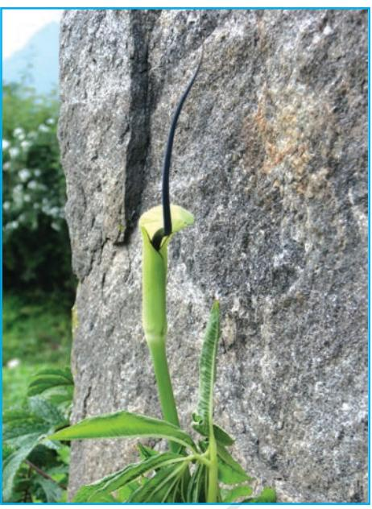
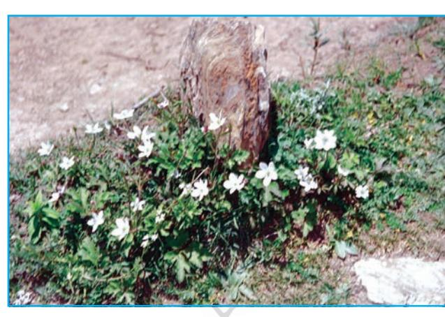
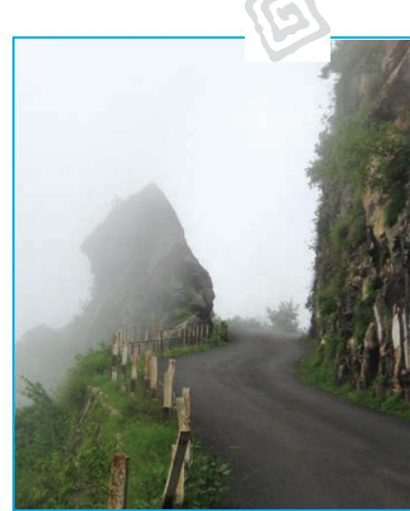
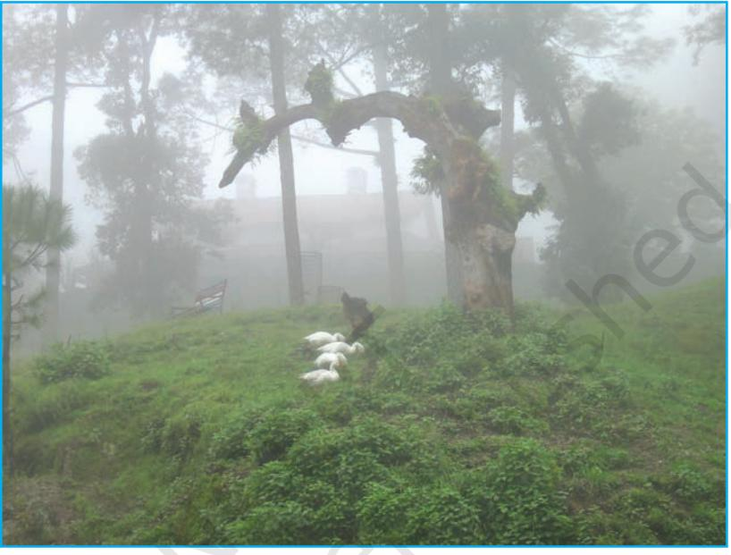
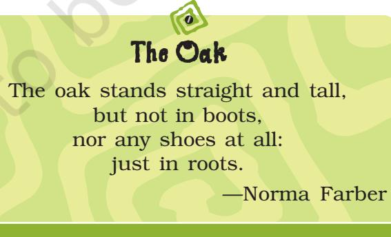

UNIT 8

# A Short Monsoon Diary

- Some extracts from the diary of a nature lover who enjoys the monsoon in the hills and observes the accompanying changes in the world of flora and fauna.
- Activities under working with language are numerous and of different types. Spend sufficient time on each activity and devise, wherever necessary, new but related exercises for further practice.
- The following project may be tried under writing.
	- Do you notice the changes that occur in nature as the seasons change? Write five or six sentences about what you see in nature in your part of the country during the months of May, August and December.
	- Record the daily temperature for a fortnight and note down the maximum and minimum temperatures.
	- Comment on the rise and fall in temperature.
	- Record the time of sunrise and sunset for a fortnight and check if there is any appreciable change in the time.

# On the Grasshopper and Cricket

- This poem is relatively difficult. The difficulty lies in its brevity of expression and complexity of thought.
- The introductory note and activities under working with the poem should be done elaborately adding additional explanatory notes/tasks, wherever necessary.
- Compare it with The Ant and the Cricket to bring out differences of style and theme clearly with examples.
- To concretise 'the poetry of earth' or 'the sounds of nature', use the poem given below, which is all about animal cries.

102 Honeydew

Ask children to rearrange the lines taking note of the words that rhyme. The last line of each stanza begins with 'But'.

> Cows moo. Lions roar. But I speak. Bears snore. Doves coo. Crickets creak. Dogs growl. Horses neigh. But I talk. Wolves howl.

> > Donkeys bray. Parrots squawk.

> > > Honeydew 103

### Before you read

Do you know what a diary is? It is a record of personal experiences written day after day over a long period of time. You can also use a diary to note down things you plan to do immediately or in future.

One of the most famous diaries published as a book is The Diary of Anne Frank.

Here are a few extracts from Ruskin Bond's diary in which he portrays the silent miracles of nature and life's little joys and regrets. Read on.

I

melancholy: very sad (the mist is called melancholy because it makes people feel melancholy) blankets: covers

104 Honeydew

### June 24

The first day of monsoon mist. And it's strange how all the birds fall silent as the mist comes climbing up the hill. Perhaps that's what makes the mist so melancholy; not only does it conceal the hills, it blankets them in silence too. Only an hour ago the trees were ringing with birdsong. And now the forest is deathly still as though it were midnight.

Through the mist Bijju is calling to his sister. I can hear him running about on the hillside but I cannot see him.

#### June 25

Some genuine earlymonsoon rain, warm and humid, and not that cold high-altitude stuff we've been having all year. The plants seem to know it too, and the first cobra lily rears its head from the ferns as I walk up to the bank and post office.

The mist affords a certain privacy.

A school boy asked me to describe the hill station and valley in

one sentence, and all I could say was: "A paradise that might have been."

#### June 27

The rains have heralded the arrival of some seasonal visitors—a leopard, and several thousand leeches.

Yesterday afternoon the leopard lifted a dog from near the servants' quarter below the school. In the evening it attacked one of Bijju's cows but fled at the approach of Bijju's mother, who came screaming imprecations.

As for the leeches, I shall soon get used to a little bloodletting every day.

Other new arrivals are the scarlet minivets (the females are yellow), flitting silently among the leaves like brilliant jewels. No matter how leafy the trees, these brightly coloured birds cannot conceal themselves, although, by remaining absolutely silent, they sometimes contrive to go unnoticed. Along come a pair of drongos, unnecessarily aggressive, chasing the minivets away.

fern: a flowerless plant with feathery green leaves

> heralded: announced or brought the news of

imprecations: curses

bloodletting: losing blood (Decades ago, leeches were used to remove blood from a patient's body)

scarlet minivet: bright red bird like a cuckoo

drongo: a song-bird with a stout

bill

A Short Monsoon Diary 105

A tree creeper moves rapidly up the trunk of the oak tree, snapping up insects all the way. Now that the rains are here, there is no dearth of food for the insectivorous birds.

### Comprehension Check

- 1. Why is the author not able to see Bijju?
- 2. What are the two ways in which the hills appear to change when the mist comes up?

## II

#### August 2

All night the rain has been drumming on the corrugated tin roof. There has been no storm, no thunder, just the steady swish of a tropical downpour. It helps me to lie awake; at the same time, it doesn't keep me from sleeping.

It is a good sound to read by — the rain outside, the quiet within — and, although tin roofs are given to springing unaccountable leaks, there is a feeling of being untouched by, and yet in touch with, the rain.

### August 3

The rain stops. The clouds begin to break up, the sun strikes the hill on my left. A woman is chopping up sticks. I hear the tinkle of cowbells. In the oak tree, a crow shakes the raindrops from his feathers and caws disconsolately. Water drips from a leaking drainpipe. And suddenly, clean and pure, the song of the whistling thrush emerges like a dark sweet secret from the depths of the ravine.

### August 12

Endless rain, and a permanent mist. We haven't seen the sun for eight or nine days. Everything damp and soggy. Nowhere to go. Pace the room, look out of the window at a few bobbing umbrellas. At least it isn't cold

drumming: falling noisily

disconsolately: unhappily

ravine: valley

rain. The hillsides are lush as late-monsoon flowers begin to appear — wild balsam, dahlias, begonias and ground orchids.

#### August 31

It is the last day of August, and the lush monsoon growth has reached its peak. The seeds of the cobra lily are turning red,

signifying that the rains are coming to an end. In a few days the ferns will start turning yellow, but right now they are still firm, green and upright. Ground orchids, mauve lady's slipper and the white butterfly orchids put on a fashion display on the grassy slopes of Landour. Wild dahlias, red, yellow and magenta, rear their heads from the rocky crevices where they have taken hold.

Snakes and rodents, flooded out of their holes and burrows, take shelter in roofs, attics and godowns. A shrew, weak of eyesight, blunders about the rooms, much to the amusement of the children.

"Don't kill it," admonishes their grandmother. "Chuchundars are lucky — they bring money!"

And sure enough, I receive a cheque in the mail. Not a very large one, but welcome all the same.

#### October 3

We have gone straight from monsoon into winter rain. Snow at higher altitudes.

After an evening hailstorm, the sky and hills are suffused with a beautiful golden light.

crevices: narrow openings or cracks in rock or wall

#### shrew:

(find its Hindi equivalent in the next sentence)

A Short Monsoon Diary 107

### January 26

Winter Rains in the Hills

In the hushed silence of the house when I am quite alone, and my friend, who was here

has gone, it is very lonely, very quiet, as I sit in a liquid silence, a silence within,

surrounded by the rhythm of rain, the steady drift

of water on leaves, on lemons, on roof, drumming on drenched dahlias and window panes,

while the mist holds the house in a dark caress.

As I pause near a window, the rain stops.

And starts again.

And the trees, no longer green but grey, menace me with their loneliness.

### March 23

Late March. End of winter.

The blackest cloud I've ever seen squatted over Mussoorie, and then it hailed marbles for half an hour. Nothing like a hailstorm to clear the sky. Even as I write, I see a rainbow forming.

RUSKIN BOND

### Comprehension Check

- 1. When does the monsoon season begin and when does it end? How do you prepare to face the monsoon?
- 2. Which hill-station does the author describe in this diary entry?
- 3. For how many days does it rain without stopping? What does the author do on these days?
- 4. Where do the snakes and rodents take shelter? Why?
- 5. What did the author receive in the mail?

### 108 Honeydew

caress: touching or holding lovingly menace: threaten

- 1. Look carefully at the diary entries for June 24-25, August 2 and March 23. Now write down the changes that happen as the rains progress from June to March.
- 2. Why did the grandmother ask the children not to kill the Chuchundar?
- 3. What signs do we find in Nature which show that the monsoons are about to end?
- 4. Complete the following sentences.
	- (i) Bijju is not seen but his voice is heard because __________________.
	- (ii) The writer describes the hill station and valley as __________________.

______________________________________________________.

- (iii) The leopard was successful in __________________ but had to flee when
- (iv) The minivets are easily noticed because __________________.
- (v) It looks like a fashion display on the slopes when __________________.
- (vi) During the monsoon season, snakes and rodents are found in roofs and attics because __________________________.
- 5. 'Although tin roofs are given to springing unaccountable leaks, there is a feeling of being untouched by, and yet in touch with, the rain.'
	- (i) Why has the writer used the word, 'springing'?
	- (ii) How is the writer untouched by the rain?
	- (iii) How is the writer in touch with the rain at the same time?
- 6. Mention a few things that can happen when there is endless rain for days together.
- 7. What is the significance of cobra lily in relation to the monsoon season, its beginning and end?

- 1. Here are some words that are associated with the monsoon. Add as many words as you can to this list. Can you find words for these in your languages?
downpour floods mist cloudy powercuts cold umbrella

- 2. Look at the sentences below.
	- (i) Bijju wandered into the garden in the evening.
	- (ii) The trees were ringing with birdsong.

A Short Monsoon Diary 109

Notice the highlighted verbs.

The verb wandered tells us what Bijju did that evening. But the verb was ringing tells us what was happening continually at same time in the past (the birds were chirping in the trees).

Now look at the sentences below. They tell us about something that happened in the past. They also tell us about other things that happened continually, at the same time in the past.

Put the verbs in the brackets into their proper forms. The first one is done for you.

- (i) We (get out) of the school bus. The bell (ring) and everyone (rush) to class.
We got out of the school bus. The bell was ringing and everyone was rushing to class.

- (ii) The traffic (stop). Some people (sit) on the road and they (shout) slogans.
- (iii) I (wear) my raincoat. It (rain) and people (get) wet.
- (iv) She (see) a film. She (narrate) it to her friends who (listen) carefully.
- (v) We (go) to the exhibition. Some people (buy) clothes while others (play) games.
- (vi) The class (is) quiet. Some children (read) books and the rest (draw).
- 3. Here are some words from the lesson which describe different kinds of sounds.

- (i) Match these words with their correct meanings.
	- (a) to fall in small drops
	- (b) to make a sound by hitting a surface repeatedly
	- (c) to move quickly through the air, making a soft sound
	- (d) harsh sound made by birds
	- (e) ringing sound (of a bell or breaking glass, etc.)
- (ii) Now fill in the blanks using the correct form of the words given above.
	- (a) Ramesh ____________ on his desk in impatience.
	- (b) Rain water ____________ from the umbrella all over the carpet.
	- (c) The pony ____________ its tail.

110 Honeydew

- (d) The _________________ of breaking glass woke me up.
- (e) The ____________ of the raven disturbed the child's sleep.
- 4. And sure enough, I received a cheque in the mail.

Complete each sentence below by using appropriate phrase from the ones given below.

| sure enough |  | colourful enough | serious enough |
| --- | --- | --- | --- |
| kind enough |  | big enough | fair enough |
| brave enough |  | foolish enough | anxious enough |
| (i) | I saw thick black clouds in the sky. And ___________ ___________ it |  |  |
| soon started raining heavily. |  |  |  |
| (ii) | The blue umbrella was ___________ ___________ for the brother and |  |  |
| sister. |  |  |  |
| (iii) | The butterflies are ___________ ___________ to get noticed. |  |  |
| (iv) | The lady was ___________ ___________ to chase the leopard. |  |  |
| (v) | The boy was ___________ ___________ to call out to his sister. |  |  |
| (vi) | The man was ___________ ___________ to offer help. |  |  |
| (vii) | The victim's injury was | ___________ | ___________ for him to get |
| admitted in hospital. |  |  |  |
| (viii) | That person was ___________ ___________ to repeat the same mistake |  |  |
| again. |  |  |  |
| (ix) | He told me he was sorry and he would compensate for the loss. |  |  |
| I said, '___________ ___________.' |  |  |  |

- 1. Do you believe in superstitions? Why, or why not? Working with your partner, write down three superstitious beliefs that you are familiar with.
- 2. How many different kinds of birds do you come across in the lesson? How many varieties do you see in your neighbourhood? Are there any birds that you used to see earlier in your neighbourhood but not now? In groups discuss why you think this is happening.

- 1. The monsoons are a time of great fun and even a few adventures: playing in the rain and getting wet, wading through knee-deep water on your way to school, water flooding the house or the classroom, powercuts and so on.
Write a paragraph describing an incident that occurred during the rains which you can never forget.

or

Write a poem of your own about the season of spring when trees are in full bloom.

Unlike The Ant and the Cricket (page 21), which tells a story, this is a nature poem. In it, the grasshopper and cricket do not appear as characters in a story. Rather, they act as symbols, each suggesting something else. Read the poem and notice how 'the poetry of earth' keeps on through summer and winter in a neverending song. Who sings the song?

> The poetry of earth is never dead: When all the birds are faint with the hot sun, And hide in cooling trees, a voice will run From hedge to hedge about the new-mown mead, That is the grasshopper's — he takes the lead In summer luxury — he has never done With his delights, for when tired out with fun He rests at ease beneath some pleasant weed.

The poetry of earth is ceasing never: On a lone winter evening when the frost Has wrought a silence, from the stone there shrills The cricket's song, in warmth increasing ever, And seems to one in drowsiness half lost; The grasshopper's among some grassy hills.

JOHN KEATS

A Short Monsoon Diary 113

wrought: brought about shrills: comes through loud and clear

- 1. Discuss with your partner the following definition of a poem.
A poem is made of words arranged in a beautiful order. These words, when read aloud with feeling, have a music and meaning of their own.

- 2. 'The poetry of earth' is not made of words. What is it made of, as suggested in the poem?
- 3. Find in the poem lines that match the following.
	- (i) The grasshopper's happiness never comes to an end.
	- (ii) The cricket's song has a warmth that never decreases.
- 4. Which word in stanza 2 is opposite in meaning to 'the frost'?
- 5. The poetry of earth continues round the year through a cycle of two seasons. Mention each with its representative voice.

# Same is different

The bandage was wound around the wound.

The dump was so full that it had to refuse more refuse.

The soldier decided to desert his dessert in the desert.

When shot at, the dove dove into the bushes.

The insurance was invalid for the invalid.

They were too close to the door to close it.

There is no time like the present to present the present.

114 Honeydew

