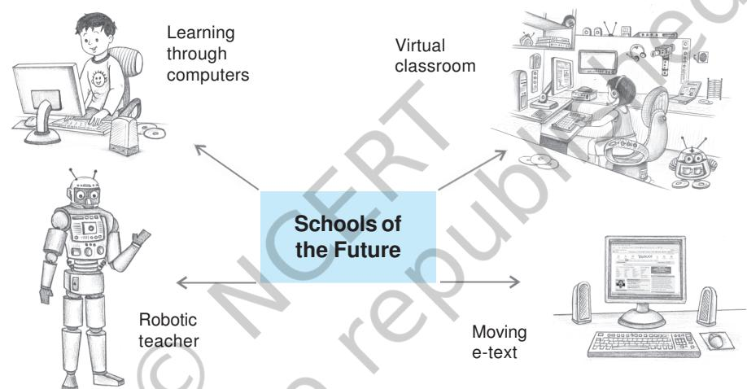
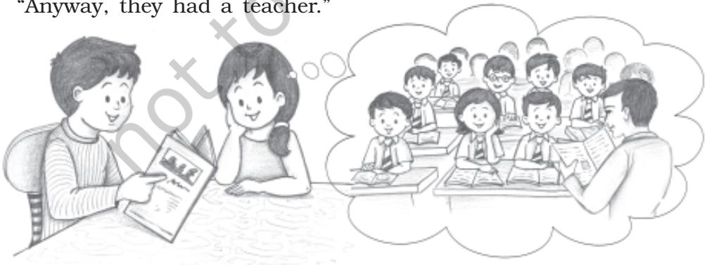
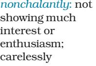
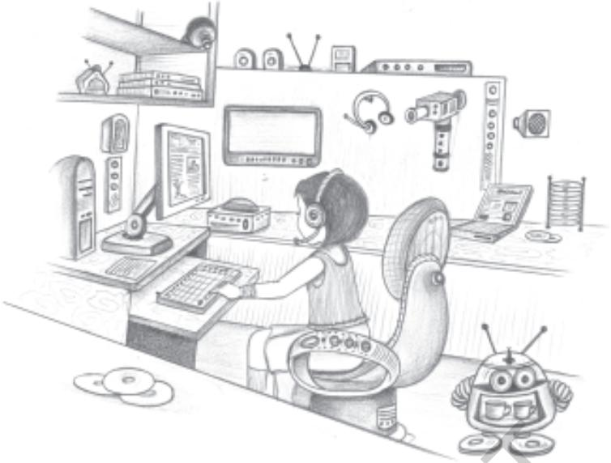

*Beehive*, a textbook in English for Class IX, is based on the new syllabus in English which was prepared as a follow-up to the National Curriculum Framework, 2005. The curriculum calls for an approach that is rich in comprehensible input and adopts a language-across-the-curriculum, multilingual perspective. This reader aims at helping the child to read for meaning, and to learn to communicate in English with confidence and accuracy.

- Care has been taken to give a central place to the learner in the process of teaching and learning. Learner-friendly language has been used in the instructions, and the exercises and activities are addressed to the child. In this process the teacher is a facilitator or a co-learner.
- A rich variety of reading material has been provided to include the literary, cultural and sociological dimensions of texts. The themes range from childhood and adolescence, to disability, talent and achievement, to music, science, and contemporary social and environmental concerns. The range is as inclusive as possible, keeping in view the interest and cognitive development of the learners. The book draws on different genres such as story, biography and autobiography; science fiction; humour; travelogue; and the one-act play.
- The number of poems has been increased to help learners explore this great source of language, derive the joy of learning through poetry, and understand the music of words. An attempt has been made to include different types of poems such as the lyric, the ballad and the humorous poem.
- The poems have been chosen for their simplicity and suitability in terms of language and thought. We need not talk about the poet or the background to the poem, unless the poem seems to demand it. Nor should we attempt to exhaust all the possibilities of a poem; we should encourage the students to begin to see some of the possibilities. They should be guided to apprehend the poem through the visual, the auditory, the tactile, the intellectual, or the emotional channels, and to understand the suggestiveness of the images.
- An attempt has been made to help the learner develop the skill of predicting and anticipating what follows. Every good reader should guess what is coming next. The task 'Before You Read' given at the beginning

of each unit is designed for this purpose. Learners should be encouraged to participate in this activity.

- The section 'Thinking about the Text' attempts to move from surface level understanding of the text to critical thinking. The comprehension exercises given here try to help the learners infer meaning. There are a few questions which ask for the readers' judgment; they aim to bring out the learners' deeper understanding of the text.
- In the section 'Thinking about Language':
	- Vocabulary enrichment has been attempted through a variety of tasks on the usage of words closely related in meaning, matching words to meanings, word building (including phrasal verbs), and reference to the dictionary. An activity on the use of the index has been included.
	- Attention has been drawn to grammar-in-context that emerges out of the reading text, e.g. the use of the tenses and voice, reported speech, conditional and subordinate clauses or phrases, and adverbs.
- The communicative skills have been exercised by tasks on Speaking and Writing. The Speaking tasks call for learners to work in pairs or groups, (for example) to present an argument, express a viewpoint, express contrasts, seek or give an opinion, introduce a speaker, tell a story, enact or read out a play in parts, etc.
- There are a variety of writing tasks: help writing newspaper report, an article for a school magazine, argumentative writing, narration, description, and picture interpretation.
- A small attempt has been made to relate speech and writing by pointing out similarities and differences. Opportunities for writing in groups and pairs are provided to get into the task.
- We have introduced the old exercise of dictation again but from a completely different perspective. Dictation has been introduced in its current, updated form as a variety of activities designed to integrate the language skills of listening, prior reading, language processing and recall, and writing, including the appropriate use of punctuation in meaningful contexts.
- Some exercises also allow scope for the learners' languages to support one another's by asking for reflection on relevant words, or poems or stories in other languages; and attempt (preliminary as they may be) to attend to the process of translation. Activities have been suggested to bring out the relatedness of the learners' school subjects.

# Units 1–3Units 1–3 Units 1–3

# 1. THE FUN THEY HAD

- This story takes us to the world of the future where computers will play a major role. Let the children talk freely about how they imagine the schools of the future that their own children might go to. You might want to explain the ideas of 'virtual reality' and 'virtual classroom'. The term 'virtual reality' refers to a reality created by computer software, and a 'virtual classroom' is not a real classroom but one where learning is through computer software or the Internet. The children may know what a robot is, and be able to guess what a robotic teacher would be.
- In this unit students are required to present their arguments in a debate. The following points could be explained before the task.
	- A debate is a contest between two speakers or two groups of speakers to show skill and ability in arguing.
	- A proposition, a question or a problem is required for this purpose, which can be spoken for or against.
	- To participate in a debate, one must prepare for it. So, one must prepare an outline of the main points in the order in which one is going to argue.
	- The time limit is about four to five minutes.
	- The speaker addresses the audience.
	- Every topic/subject has its own vocabulary. These must be learnt.
	- The speaker addresses the chair (Mr President/Madam), 'submits' an argument, 'appeals' for sympathetic understanding and support, 'questions' the opponent's views, and 'concludes' an argument.

### 2. THE SOUND OF MUSIC

- These biographical pieces tell us of people who have achieved success and recognition through determination, hard work and courage. The children may be asked to think of potential barriers to success, and of people who have overcome them. The second part of the unit encourages students to think about the rich heritage of Indian music, and our musical instruments. The portraits of musicians given in the beginning may be supplemented by others that the children can be asked to bring to class.
- A comprehension exercise in Part II encourages children to find words in the text that express attitudes (positive, negative or neutral) to events, places, etc. Encourage the children to compare and discuss their answers.
- Dictionary entries give us different kinds of information about words. Children need help in using the dictionary to find specific kinds of information.

*Notes for the Teacher* / 3

- This unit has an exercise that asks students to consult a dictionary and find out which adjective can be used before a noun, which can be used after a verb, and which can be used in both ways. You may add some adjectives to those suggested. Encourage the children also to find more adjectives of the kinds mentioned. Students may wish to consult (in addition to the *Oxford Advanced Learner's Dictionary*), the *Longman Dictionary of Contemporary English*, the *Collins Cobuild Advanced Learner's English Dictionary*, and the *Word Master* (Orient Longman), or any good dictionary of their choice.
- The Speaking exercise asks the students to imagine introducing a celebrity guest to an audience. It can be made an authentic activity if students are given a couple of minutes during the morning assembly to speak to their fellow-pupils about such a person. This would give them practice in facing an audience, and encourage them to prepare seriously, by: (i) noting down the important points about the person to be introduced, (ii) using appropriate phrases to introduce the person (students should be allowed to think what phrases they want to use).
- The Writing Task is an exercise in comparison. Hard work is a trait common to Evelyn Glennie (Part I, para 5) and Bismillah Khan (Part II, para 5). Help children identify the paragraphs that tell us about the two musicians' goals. After they read and understand these parts of the text, they can organise the ideas in two paragraphs, one on each musician.

## 3. THE LITTLE GIRL

- The aim in this unit is to first read through the story at one go, not worrying about difficult words or difficult language. Students can read the story for homework and come to class; or the teacher can read out the story in class; or the students can read out parts of the story in the class, one after the other. Let them retell the story again, if necessary, in parts.
- The dictionary exercise in this unit shows how a very small common word can be used in different ways. Students might be interested in thinking about how they use words in their own language to express these meanings. They may also think of other words like *same*, *small*, *give* and *take* to convey different kids of meaning. Encourage them to consult a dictionary.
- This is a story about the changing attitude of a girl child towards her father. The Speaking and Writing exercises encourage the students to think about the relationship between children and parents. The students should be encouraged to say or write what they think, and not what the teacher thinks they should say or write. The aim is not to arrive at a 'correct' answer, but to let every child voice an opinion and express her/his ideas. It is hoped that children will find the topic of personal relevance. This will help their ideas and language to flow freely.

# BEFORE YOU READ

- *• The story we shall read is set in the future, when books and schools as we now know them will perhaps not exist. How will children study then? The diagram below may give you some ideas.*

- *• In pairs, discuss three things that you like best about your school and three things about your school that you would like to change. Write them down.*
- *• Have you ever read words on a television (or computer) screen? Can you imagine a time when all books will be on computers, and there will be no books printed on paper? Would you like such books better?*
- 1. MARGIE even wrote about it that night in her diary. On the page headed 17 May 2157, she wrote, "Today Tommy found a real book!"

It was a very old book. Margie's grandfather once said that when he was a little boy his grandfather told him that there was a time when all stories were printed on paper.

They turned the pages, which were yellow and crinkly, and it was awfully funny to read words that stood still instead of moving the way they were supposed to — on a screen, you know. And then when they turned back to the page before, it had the same words on it that it had had when they read it the first time.

2. "Gee," said Tommy, "what a waste. When you're through with the book, you just throw it away, I guess. Our television screen must have had a million books on it and it's good for plenty more. I wouldn't throw it away."

> "Same with mine," said Margie. She was eleven and hadn't seen as many telebooks as Tommy had. He was thirteen.

> > She said, "Where did you find it?"

"In my house." He pointed without looking, because he was busy reading. "In the attic."

"What's it about?" "School."

- 3. Margie was scornful. "School? What's there to write about school? I hate school."
Margie always hated school, but now she hated it more than ever. The mechanical teacher had been giving her test after test in geography and she had been doing worse and worse until her mother had shaken her head sorrowfully and sent for the County Inspector.

- 4. He was a round little man with a red face and a whole box of tools with dials and wires. He smiled at Margie and gave her an apple, then took the teacher apart. Margie had hoped he wouldn't know how to put it together again, but he knew how all right, and, after an hour or so, there it was again, large and black and ugly, with a big screen on which all the lessons were shown and the questions were asked. That wasn't so bad. The part Margie hated
*crinkly*: with many folds or lines

*attic*: a space just below the roof, used as a storeroom

#### *scornful*:

contemptuous; showing you think something is worthless

most was the slot where she had to put homework and test papers. She always had to write them out in a punch code they made her learn when she was six years old, and the mechanical teacher calculated the marks in no time.

- 5. The Inspector had smiled after he was finished and patted Margie's head. He said to her mother, "It's not the little girl's fault, Mrs Jones. I think the geography sector was geared a little too quick. Those things happen sometimes. I've slowed it up to an average ten-year level. Actually, the overall pattern of her progress is quite satisfactory." And he patted Margie's head again.
Margie was disappointed. She had been hoping they would take the teacher away altogether. They had once taken Tommy's teacher away for nearly a month because the history sector had blanked out completely.

So she said to Tommy, "Why would anyone write about school?"

- 6. Tommy looked at her with very superior eyes. "Because it's not our kind of school, stupid. This is the old kind of school that they had hundreds and hundreds of years ago." He added loftily, pronouncing the word carefully, "Centuries ago."
Margie was hurt. "Well, I don't know what kind of school they had all that time ago." She read the book over his shoulder for a while, then said, "Anyway, they had a teacher."

*slot*: a given space, time or position

*geared (to)*: adjusted to a particular standard or level

*loftily*: in a superior way

*They had a teacher... It was a man.*

*The Fun They Had* / 7

"Sure they had a teacher, but it wasn't a regular teacher. It was a man."

"A man? How could a man be a teacher?"

"Well, he just told the boys and girls things and gave them homework and asked them questions."

7. "A man isn't smart enough."

"Sure he is. My father knows as much as my teacher."

"He knows almost as much, I betcha."

Margie wasn't prepared to dispute that. She said, "I wouldn't want a strange man in my house to teach me."

Tommy screamed with laughter. "You don't know much, Margie. The teachers didn't live in the house. They had a special building and all the kids went there."

> "And all the kids learned the same thing?" "Sure, if they were the same age."

- 8. "But my mother says a teacher has to be adjusted to fit the mind of each boy and girl it teaches and that each kid has to be taught differently."
"Just the same they didn't do it that way then. If you don't like it, you don't have to read the book."

"I didn't say I didn't like it," Margie said quickly. She wanted to read about those funny schools.

They weren't even half finished when Margie's mother called, "Margie! School!"

Margie looked up. "Not yet, Mamma."

"Now!" said Mrs Jones. "And it's probably time for Tommy, too."

Margie said to Tommy, "Can I read the book some more with you after school?"

9. "May be," he said nonchalantly. He walked away whistling, the dusty old book tucked beneath his arm.

> Margie went into the schoolroom. It was right next to her bedroom, and the mechanical teacher was on and waiting for her. It was always on at the same time every day except Saturday and Sunday,

*regular*: here, normal; of the usual kind

*betcha* (informal): (I) bet you (in fast speech): I' m sure

*dispute*: disagree with

*The mechanical teacher was flashing on the screen...*

because her mother said little girls learned better if they learned at regular hours.

The screen was lit up, and it said: "Today's arithmetic lesson is on the addition of proper fractions. Please insert yesterday's homework in the proper slot."

- 10. Margie did so with a sigh. She was thinking about the old schools they had when her grandfather's grandfather was a little boy. All the kids from the whole neighborhood came, laughing and shouting in the schoolyard, sitting together in the schoolroom, going home together at the end of the day. They learned the same things, so they could help one another with the homework and talk about it.
And the teachers were people…

The mechanical teacher was flashing on the screen: "When we add fractions ½ and ¼..."

Margie was thinking about how the kids must have loved it in the old days. She was thinking about the fun they had.

ISAAC ASIMOV

*The Fun They Had* / 9

## Thinking about the Text

#### *Activity*

Calculate how many years and months ahead from now Margie's diary entry is.

- I. Answer these questions in a few words or a couple of sentences each.
	- 1. How old are Margie and Tommy?
	- 2. What did Margie write in her diary?
	- 3. Had Margie ever seen a book before?
	- 4. What things about the book did she find strange?
	- 5. What do you think a telebook is?
	- 6. Where was Margie's school? Did she have any classmates?
	- 7. What subjects did Margie and Tommy learn?

II. Answer the following with reference to the story.

- 1. "I wouldn't throw *it* away."
	- (i) Who says these words?
	- (ii) What does 'it' refer to?
	- (iii) What is it being compared with by the speaker?
- 2. "Sure *they* had a teacher, but it wasn't a *regular* teacher. It was a man."
	- (i) Who does 'they' refer to?
	- (ii) What does 'regular' mean here?
	- (iii) What is it contrasted with?

III. Answer each of these questions in a short paragraph (about 30 words).

- 1. What kind of teachers did Margie and Tommy have?
- 2. Why did Margie's mother send for the County Inspector?
- 3. What did he do?
- 4. Why was Margie doing badly in geography? What did the County Inspector do to help her?
- 5. What had once happened to Tommy's teacher?
- 6. Did Margie have regular days and hours for school? If so, why?
- 7. How does Tommy describe the old kind of school?
- 8. How does he describe the old kind of teachers?

IV. Answer each of these questions in two or three paragraphs (100 –150 words).

- 1. What are the main features of the mechanical teachers and the schoolrooms that Margie and Tommy have in the story?
- 2. Why did Margie hate school? Why did she think the old kind of school must have been fun?

10 / *Beehive*

- 3. Do you agree with Margie that schools today are more fun than the school in the story? Give reasons for your answer.

#### I. Adverbs

Read this sentence taken from the story:

They had once taken Tommy's teacher away for nearly a month because the history sector had blanked out *completely*.

The word *complete* is an adjective. When you add –ly to it, it becomes an adverb.

- 1. Find the sentences in the lesson which have the adverbs given in the box below.
awfully sorrowfully completely loftily carefully differently quickly nonchalantly

- 2. Now use these adverbs to fill in the blanks in the sentences below.
	- (i) The report must be read so that performance can be improved.
	- (ii) At the interview, Sameer answered our questions , shrugging his shoulders.
	- (iii) We all behave when we are tired or hungry.
	- (iv) The teacher shook her head when Ravi lied to her.
	- (v) I forgot about it.
	- (vi) When I complimented Revathi on her success, she just smiled and turned away.
	- (vii) The President of the Company is busy and will not be able to meet you.
	- (viii) I finished my work so that I could go out to play.

#### *Remember:*

An adverb describes action. You can form adverbs by adding –ly to adjectives.

*Spelling Note:* When an adjective ends in –y, the y changes to i when you add –ly to form an adverb.

*For example*: angr-y → angr-i-ly

*The Fun They Had* / 11

3. Make adverbs from these adjectives.

### II. If Not and Unless

- Imagine that Margie's mother told her, "You'll feel awful *if* you *don't* finish your history lesson."
- She could also say: "You'll feel awful *unless* you finish your history lesson."

*Unless* means *if not*. Sentences with *unless* or *if not* are negative conditional sentences.

Notice that these sentences have two parts. The part that begins with *if not* or *unless* tells us the condition. This part has a verb in the present tense (look at the verbs *don't finish, finish* in the sentences above).

The other part of the sentence tells us about a possible result. It tells us what will happen (if something else doesn't happen). The verb in this part of the sentence is in the future tense (you*'ll feel*/you *will feel*).

Notice these two tenses again in the following examples.

#### *Future Tense Present Tense*

- There won't be any books left *unless* we preserve them.
- You won't learn your lessons *if* you don't study regularly.
- Tommy will have an accident *unless* he drives more slowly.

Complete the following conditional sentences. Use the correct form of the verb.

- 1. If I don't go to Anu's party tonight,
- 2. If you don't telephone the hotel to order food,
- 3. Unless you promise to write back, I
- 4. If she doesn't play any games,
- 5. Unless that little bird flies away quickly, the cat

# Writing

A new revised volume of Issac Asimov's short stories has just been released. Order one set. Write a letter to the publisher, Mindfame Private Limited, 1632 Asaf Ali Road, New Delhi, requesting that a set be sent to you by Value Payable Post (VPP), and giving your address. Your letter will have the following parts.

12 / *Beehive*

|
|  |

- The salutation
- The body of the letter
- The closing phrases and signature

Your letter might look like this:

| Your address |  |
| --- | --- |
| Date | (DD/MM/YY) |
| The addressee's address |  |
| Dear Sir/Madam, |  |
| Yours sincerely, |  |
| Your signature |  |
| Remember that the language of a formal letter is different from the | colloquial style of personal letters. For example, contracted forms |
| such as 'I've' or 'can't' are not used. |  |

*The Fun They Had* / 13

SpeakingSpeaking Speaking

In groups of four discuss the following topic.

'The Schools of the Future Will Have No Books and No Teachers!'

Your group can decide to speak *for* or *against* the motion. After this, each group will select a speaker to present its views to the entire class.

You may find the following phrases useful to present your argument in the debate.

- In my opinion . . .
- I/we fail to understand why . . .
- I wholeheartedly support/oppose the view that . . .
- At the outset let me say . . .
- I'd/we'd like to raise the issue of/argue against . . .
- I should like to draw attention to . . .
- My/our worthy opponent has submitted that . . .
- On the contrary . . .
- I firmly reject . . .

### Do a Project

Nowadays use of digital devices has increased and digital services have made our cash transactions easier and smoother. Government of India has taken initiatives to digitalise cash transactions to buy things and pay bills. Following are some of the digital initiatives to make people use digital services.

Take up a project in groups of four to collect opinions of people on the use of digital services in their daily life. Develop an opionnaire to collect opinions of about forty people in your neighbourhood. Divide the work among four to collect the opinions, tabulate the ideas and write a report about the use of digital devices. Once the project is completed, each group may present it to the whole class. Charts may be created and displayed on the notice board.

# The Road Not Taken

*This well-known poem is about making choices, and the choices that shape us. Robert Frost is an American poet who writes simply, but insightfully, about common, ordinary experiences.*

Two roads diverged in a yellow wood, And sorry I could not travel both And be one traveller, long I stood And looked down one as far as I could To where it bent in the undergrowth;

Then took the other, just as fair, And having perhaps the better claim, Because it was grassy and wanted wear; Though as for that the passing there Had worn them really about the same.

And both that morning equally lay In leaves no step had trodden black. Oh, I kept the first for another day! Yet knowing how way leads on to way, I doubted if I should ever come back.

I shall be telling this with a sigh Somewhere ages and ages hence; Two roads diverged in a wood, and I — I took the one less travelled by, And that has made all the difference.

ROBERT FROST

### GLOSSARY

diverged: separated and took a different direction undergrowth: dense growth of plants and bushes wanted wear: had not been used hence: here, in the future

# Thinking about the Poem

- I. 1. Where does the traveller find himself? What problem does he face?
	- 2. Discuss what these phrases mean to you.
		- (i) a yellow wood
		- (ii) it was grassy and wanted wear
		- (iii) the passing there
		- (iv) leaves no step had trodden black
		- (v) how way leads on to way
	- 3. Is there any difference between the two roads as the poet describes them
		- (i) in stanzas two and three?
		- (ii) in the last two lines of the poem?
	- 4. What do you think the last two lines of the poem mean? (Looking back, does the poet regret his choice or accept it?)
- II. 1. Have you ever had to make a difficult choice (or do you think you will have difficult choices to make)? How will you make the choice (for what reasons)?
	- 2. After you have made a choice do you always think about what might have been, or do you accept the reality?

*Time is not measured by the passing of years but by what one does, what one feels, and what one achieves.*

