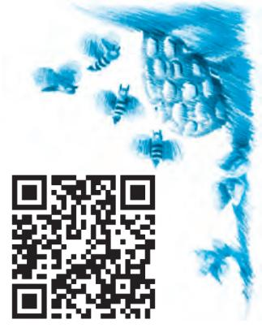
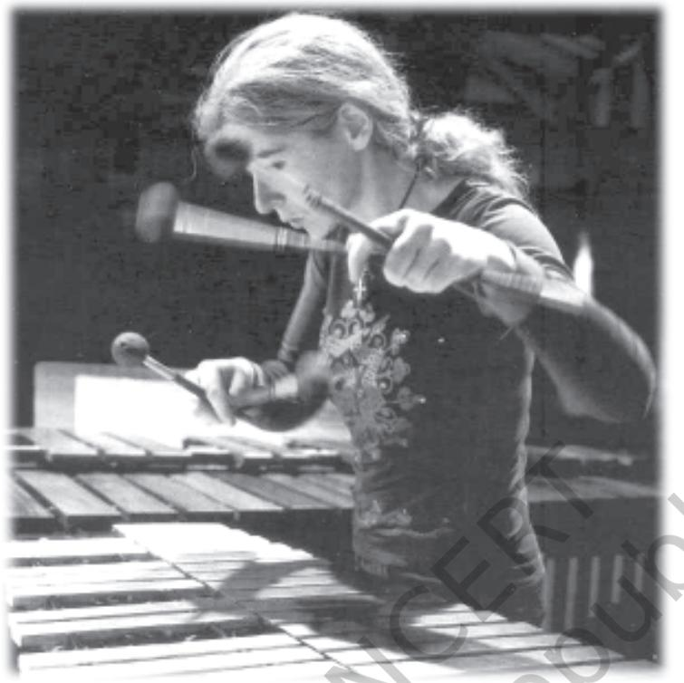
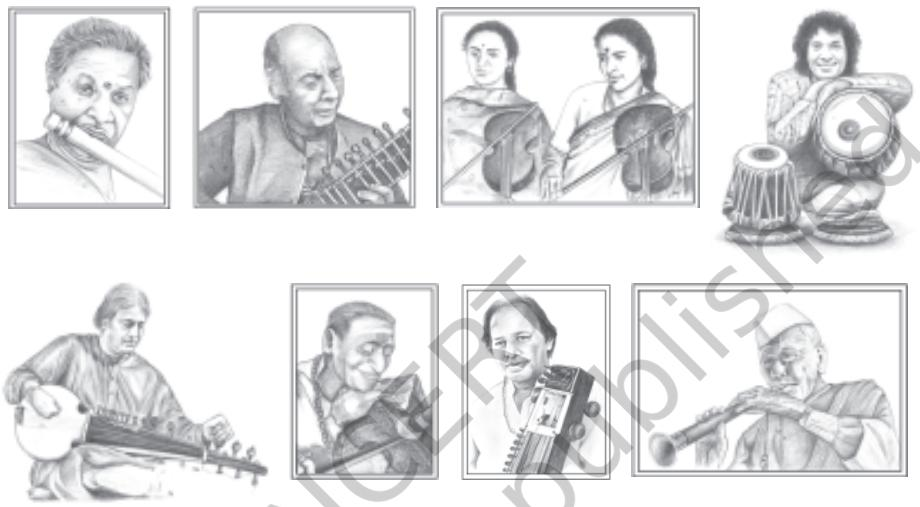
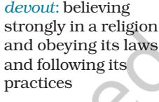

### Part I

### Evelyn Glennie Listens to Sound without Hearing It

### BEFORE YOU READ

- *• "God may have taken her hearing but he has given her back something extraordinary. What we hear, she feels — far more deeply than any of us. That is why she expresses music so beautifully."*
- *• Read the following account of a person who fought against a physical disability and made her life a success story.*
- 1. RUSH hour crowds jostle for position on the underground train platform. A slight girl, looking younger than her seventeen years, was nervous yet excited as she felt the vibrations of the approaching train. It was her first day at the prestigious Royal Academy of Music in London and daunting enough for any teenager fresh from a Scottish farm. But this aspiring musician faced a bigger challenge than most: she was profoundly deaf.
- 2. Evelyn Glennie's loss of hearing had been gradual. Her mother remembers noticing something was wrong when the eight-year-old Evelyn was waiting to play the piano. "They called her name and she didn't move. I suddenly realised she hadn't heard," says Isabel Glennie. For quite a while Evelyn managed to conceal her growing deafness from friends and teachers. But by the time she was eleven her marks had deteriorated and her headmistress urged her parents to take her to a

*jostle*: push roughly *slight*: small and thin

*daunting*: frightening

*aspiring musician*: a person who wants to be a musician

specialist. It was then discovered that her hearing was severely impaired as a result of gradual nerve damage. They were advised that she should be fitted with hearing aids and sent to a school for the deaf. "Everything suddenly looked black," says Evelyn.

- 3. But Evelyn was not going to give up. She was determined to lead a normal life and pursue her interest in music. One day she noticed a girl playing a xylophone and decided that she wanted to play it too. Most of the teachers discouraged her but percussionist Ron Forbes spotted her potential. He began by tuning two large drums to different notes. "Don't listen through your ears," he would say, "try to sense it some other way." Says Evelyn, "Suddenly I realised I could feel the higher drum from the waist up and the lower one from the waist down." Forbes repeated the exercise, and soon Evelyn discovered that she could sense certain notes in different parts of her body. "I had learnt to open my mind and body to sounds and vibrations." The rest was sheer determination and hard work.
- 4. She never looked back from that point onwards. She toured the United Kingdom with a youth orchestra and by the time she was sixteen, she had decided to make music her life. She auditioned for the Royal Academy of Music and scored one of the highest marks in the history of the academy. She gradually moved from orchestral work to solo performances. At the end of her three-year course, she had captured most of the top awards.
- 5. And for all this, Evelyn won't accept any hint of heroic achievement. "If you work hard and know where you are going, you'll get there." And she got right to the top, the world's most sought-after multipercussionist with a mastery of some thousand instruments, and hectic international schedule.
- 6. It is intriguing to watch Evelyn function so effortlessly without hearing. In our two-hour discussion she never missed a word. "Men with bushy beards give me trouble," she laughed. "It is

*impaired*: weakened

*xylophone*: a musical instrument with a row of wooden bars of different lengths

*percussionist*: a person who plays the drum, the *tabla*, etc.

*potential*: quality or ability that can be developed

*auditioned*: gave a short performance so that the director could decide whether she was good enough

*intriguing*: fascinating and curious

18 / *Beehive*

*It is* intriguing *to watch Evelyn function so effortlessly without hearing*

not just watching the lips, it's the whole face, especially the eyes." She speaks flawlessly with a Scottish lilt. "My speech is clear because I could hear till I was eleven," she says. But that doesn't explain how she managed to learn French and master basic Japanese.

- 7. As for music, she explains, "It pours in through every part of my body. It tingles in the skin, my cheekbones and even in my hair." When she plays the xylophone, she can sense the sound passing up the stick into her fingertips. By leaning against the drums, she can feel the resonances flowing into her body. On a wooden platform she removes her shoes so that the vibrations pass through her bare feet and up her legs.
*flawlessly*: without a fault or mistake *lilt*: a way of

speaking

*tingles*: causes a slight pricking or stinging sensation

*resonances*: echoes of sounds

- 8. Not surprisingly, Evelyn delights her audiences. In 1991 she was presented with the Royal Philharmonic Society's prestigious Soloist of the Year Award. Says master percussionist James Blades, "God may have taken her hearing but he has given her back something extraordinary. What we hear, she feels — far more deeply than any of us. That is why she expresses music so beautifully."
- 9. Evelyn confesses that she is something of a workaholic. "I've just got to work ... often harder than classical musicians. But the rewards are enormous." Apart from the regular concerts, Evelyn also gives free concerts in prisons and hospitals. She also gives high priority to classes for young musicians. Ann Richlin of the Beethoven Fund for Deaf Children says, "She is a shining inspiration for deaf children. They see that there is nowhere that they cannot go."
- 10. Evelyn Glennie has already accomplished more than most people twice her age. She has brought percussion to the front of the orchestra, and demonstrated that it can be very moving. She has given inspiration to those who are handicapped, people who look to her and say, 'If she can do it, I can.' And, not the least, she has given enormous pleasure to millions.

DEBORAH COWLEY

# Thinking about the Text

- I. Answer these questions in a few words or a couple of sentences each.
	- 1. How old was Evelyn when she went to the Royal Academy of Music?
	- 2. When was her deafness first noticed? When was it confirmed?
- II. Answer each of these questions in a short paragraph (30–40 words).
	- 1. Who helped her to continue with music? What did he do and say?
	- 2. Name the various places and causes for which Evelyn performs.
- III. Answer the question in two or three paragraphs (100–150 words).
	- 1. How does Evelyn hear music?

20 / *Beehive*

*workaholic* (informal): a person who finds it difficult to stop working

*priority*: great importance

# Part II

## The Shehnai of Bismillah Khan

# BEFORE YOU READ

- *• Do you know these people? What instruments do they play?*

- *• Think of the shehnai and the first thing you'll probably imagine is a wedding or a similar occasion or function. The next would probably be Ustad Bismillah Khan, the shehnai maestro, playing this instrument.*
- 1. EMPEROR Aurangzeb banned the playing of a musical instrument called *pungi* in the royal residence for it had a shrill unpleasant sound. *Pungi* became the generic name for reeded noisemakers. Few had thought that it would one day be revived. A barber of a family of professional musicians, who had access to the royal palace, decided to improve the tonal quality of the *pungi*. He chose a pipe with a natural hollow stem that was longer and broader than the *pungi*, and made seven holes on the body of the pipe. When he played on it, closing and opening some of these holes, soft and melodious sounds were

*generic name*: a name given to a class or group as a whole

*reeded*: wind instruments which have reeds like the flute, the clarinet, etc. produced. He played the instrument before royalty and everyone was impressed. The instrument so different from the *pungi* had to be given a new name. As the story goes, since it was first played in the Shah's chambers and was played by a *nai* (barber), the instrument was named the 'shehnai*'*.

- 2. The sound of the shehnai began to be considered auspicious. And for this reason it is still played in temples and is an indispensable component of any North Indian wedding. In the past, the shehnai was part of the *naubat* or traditional ensemble of nine instruments found at royal courts. Till recently it was used only in temples and weddings. The credit for bringing this instrument onto the classical stage goes to Ustad Bismillah Khan.
- 3. As a five-year old, Bismillah Khan played *gilli-danda* near a pond in the ancient estate of Dumraon in Bihar. He would regularly go to the nearby Bihariji temple to sing the Bhojpuri '*Chaita'*, at the end of which he would earn a big laddu weighing 1.25 kg, a prize given by the local Maharaja. This happened 80 years ago, and the little boy has travelled far to earn the highest civilian award in India — the Bharat Ratna.
- 4. Born on 21 March 1916, Bismillah belongs to a well-known family of musicians from Bihar. His grandfather, Rasool Bux Khan, was the *shehnainawaz* of the Bhojpur king's court. His father, Paigambar Bux, and other paternal ancestors were also great shehnai players.

*auspicious*: promising to bring good fortune

*indispensable*:

without which a piece of work cannot be done

#### *ensembles*

(pronounced 'onsomble'): things (here, instruments) considered as a group

*paternal ancestors*: ancestors of the father

- 5. The young boy took to music early in life. At the age of three when his mother took him to his maternal uncle's house in Benaras (now Varanasi), Bismillah was fascinated watching his uncles practise the shehnai. Soon Bismillah started accompanying his uncle, Ali Bux, to the Vishnu temple of Benaras where Bux was employed to play the shehnai. Ali Bux would play the shehnai and Bismillah would sit captivated for hours on end. Slowly, he started getting lessons in playing the instrument and would sit practising throughout the day. For years to come the temple of Balaji and Mangala Maiya and the banks of the Ganga became the young apprentice's favourite haunts where he could practise in solitude. The flowing waters of the Ganga inspired him to improvise and invent raagas that were earlier considered to be beyond the range of the shehnai.
- 6. At the age of 14, Bismillah accompanied his uncle to the Allahabad Music Conference. At the end of his recital, Ustad Faiyaz Khan patted the young boy's back and said, "Work hard and you shall make it." With the opening of the All India Radio in Lucknow in 1938 came Bismillah's big break. He soon became an often-heard shehnai player on radio.
- 7. When India gained independence on 15 August 1947, Bismillah Khan became the first Indian to greet the nation with his shehnai. He poured his heart out into Raag Kafi from the Red Fort to an audience which included Pandit Jawaharlal Nehru, who later gave his famous 'Tryst with Destiny' speech.
- 8. Bismillah Khan has given many memorable performances both in India and abroad. His first trip abroad was to Afghanistan where King Zahir Shah was so taken in by the maestro that he gifted him priceless Persian carpets and other souvenirs. The King of Afghanistan was not the only one to be fascinated with Bismillah's music. Film director Vijay Bhatt was so impressed after hearing Bismillah play at a festival that he named a film after the instrument called *Gunj Uthi Shehnai*. The

*on end*: for a very long time without stopping

*taken in by*: attracted or charmed by

*souvenirs*: things given in memory of a place, person or event

*The Sound of Music* / 23

film was a hit, and one of Bismillah Khan's compositions, "*Dil ka khilona hai toot gaya ...,*" turned out to be a nationwide chartbuster! Despite this huge success in the celluloid world, Bismillah Khan's ventures in film music were limited to two: Vijay Bhatt's *Gunj Uthi Shehnai* and Vikram Srinivas's Kannada venture, *Sanadhi Apanna.* "I just can't come to terms with the artificiality and glamour of the film world," he says with emphasis.

- 9. Awards and recognition came thick and fast. Bismillah Khan became the first Indian to be invited to perform at the prestigious Lincoln Centre Hall in the United States of America. He also took part in the World Exposition in Montreal, in the Cannes Art Festival and in the Osaka Trade Fair. So well known did he become internationally that an auditorium in Teheran was named after him — Tahar Mosiquee Ustaad Bismillah Khan.
- 10. National awards like the Padmashri, the Padma Bhushan and the Padma Vibhushan were conferred on him.
- 11. In 2001, Ustad Bismillah Khan was awarded India's highest civilian award, the Bharat Ratna. With the coveted award resting on his chest and his eyes glinting with rare happiness he said, "All I would like to say is: Teach your children music, this is Hindustan's richest tradition; even the West is now coming to learn our music.''
- 12. In spite of having travelled all over the world Khansaab as he is fondly called — is exceedingly fond of Benaras and Dumraon and they remain for him the most wonderful towns of the world. A student of his once wanted him to head a shehnai school in the U.S.A., and the student promised to recreate the atmosphere of Benaras by replicating the temples there. But Khansaab asked him if he would be able to transport River Ganga as well. Later he is remembered to have said, "That is why whenever I am in a foreign country, I keep yearning to see Hindustan. While in Mumbai, I think of only Benaras and the holy Ganga. And while in Benaras, I miss the unique *mattha* of Dumraon."

*chartbuster*: recordbreaker *celluloid*: oldfashioned way of referring to films *venture*: project that often involves risk

*conferred*: given, usually an award or a degree

*coveted*: much desired

SHEKHAR GUPTA: When Partition happened, didn't you and your family think of moving to Pakistan?

BISMILLAH KHAN: God forbid! Me, leave Benaras? Never! I went to Pakistan once—I crossed the border just to say I have been to Pakistan. I was there for about an hour. I said *namaskar* to the Pakistanis and *salaam alaikum* to the Indians! I had a good laugh. (*Readers' Digest*, October 2005)

- 13. Ustad Bismillah Khan's life is a perfect example of the rich, cultural heritage of India, one that effortlessly accepts that a devout Muslim like him can very naturally play the shehnai every morning at the Kashi Vishwanath temple.
[Ustad Bismillah Khan passed away on 21 August 2006 at the age of ninety after a prolonged illness. He was given a state funeral and the Government of India declared one day of national mourning.]

# Thinking about the Text

- I. Tick the right answer.
	- 1. The (shehnai, *pungi*) was a 'reeded noisemaker.'
	- 2. (Bismillah Khan, A barber, Ali Bux) transformed the *pungi* into a shehnai.
	- 3. Bismillah Khan's paternal ancestors were (barbers, professional musicians).
	- 4. Bismillah Khan learnt to play the shehnai from (Ali Bux, Paigambar Bux, Ustad Faiyaaz Khan).
	- 5. Bismillah Khan's first trip abroad was to (Afghanistan, U.S.A., Canada).
- II. Find the words in the text which show Ustad Bismillah Khan's feelings about the items listed below. Then mark a tick (✔) in the correct column. Discuss your answers in class.

|  | Bismillah Khan's feelings about | Positive | Negative | Neutral |
| --- | --- | --- | --- | --- |
| 1. | teaching children music |  |  |  |
| 2. | the film world |  |  |  |
| 3. | migrating to the U.S.A. |  |  |  |
| 4. | playing at temples |  |  |  |
| 5. | getting the Bharat Ratna |  |  |  |
| 6. | the banks of the Ganga |  |  |  |
| 7. | leaving Benaras and Dumraon |  |  |  |

*The Sound of Music* / 25

III. Answer these questions in 30–40 words.

- 1. Why did Aurangzeb ban the playing of the *pungi*?
- 2. How is a shehnai different from a *pungi*?
- 3. Where was the shehnai played traditionally? How did Bismillah Khan change this?
- 4. When and how did Bismillah Khan get his big break?
- 5. Where did Bismillah Khan play the shehnai on 15 August 1947? Why was the event historic?
- 6. Why did Bismillah Khan refuse to start a shehnai school in the U.S.A.?
- 7. Find at least two instances in the text which tell you that Bismillah Khan loves India and Benaras.

# Thinking about Language

I. Look at these sentences.

- Evelyn was determined *to live a normal life*.
- Evelyn managed *to conceal her growing deafness from friends and teachers.*

The italicised parts answer the questions: "What was Evelyn determined to do?" and "What did Evelyn manage to do?" They begin with a to-verb (*to live, to conceal*).

Complete the following sentences. Beginning with a to-verb, try to answer the questions in brackets.

- 1. The school sports team hopes (What does it hope to do?)
- 2. We all want (What do we all want to do?)
- 3. They advised the hearing-impaired child's mother (What did they advise her to do?)
- 4. The authorities permitted us to (What did the authorities permit us to do?)
- 5. A musician decided to (What did the musician decide to do?)
- II. From the text on Bismillah Khan, find the words and phrases that match these definitions and write them down. The number of the paragraph where you will find the words/phrases has been given for you in brackets.
	- 1. the home of royal people (1)
	- 2. the state of being alone (5)
	- 3. a part which is absolutely necessary (2)

26 / *Beehive*

- 4. to do something not done before (5)
- 5. without much effort (13)
- 6. quickly and in large quantities (9) and
- III. Tick the right answer.
	- 1. When something is *revived*, it (remains dead/lives again).
	- 2. When a government *bans* something, it wants it (stopped/started).
	- 3. When something is considered *auspicious*, (welcome it/avoid it).
	- 4. When we *take to* something, we find it (boring/interesting).
	- 5. When you *appreciate* something, you (find it good and useful/find it of no use).
	- 6. When you *replicate* something, you do it (for the first time/for the second time).
	- 7. When we *come to terms with* something, it is (still upsetting/no longer upsetting).

IV. Dictionary work

- The sound of the shehnai is *auspicious*.
- The *auspicious* sound of the shehnai is usually heard at marriages.

The adjective *auspicious* can occur after the verb *be* as in the first sentence, or before a noun as in the second. But there are some adjectives which can be used after the verb *be* and not before a noun. For example:

- Ustad Faiyaz Khan was *overjoyed*.
We cannot say: *the *overjoyed man*.

Look at these entries from the *Oxford Advanced Learner's Dictionary* (2005).

### elder *adi.*, *noun*

adjective 1 [*only before noun*] *(of people, especially two members of the same family) older:* my elder brother • his elder sister 2 *(the elder) used without a noun immediately after it to show who is the older of two people:* the elder of their two sons 3 *(the elder) (*formal*) used before or after sb's name to show that they are the older of two people who have the same name:* the elder Pitt • Pitt, the elder.

#### awake *adj.*, *verb*

*adjective* [*not before noun*] *not asleep* (*especially immediately before or after sleeping*): *to be half/fully awake; to be wide awake.* I was still awake when he came to bed.

Consult your dictionary and complete the following table. The first one has been done for you.

| adjective | only before noun | not before noun | both before and after the verb be |
| --- | --- | --- | --- |
|  |  |  | ✔ |
| indispensable |  |  |  |
| impressed |  |  |  |
| afraid |  |  |  |
| outdoor |  |  |  |
| paternal |  |  |  |
| countless |  |  |  |
| priceless |  |  |  |

Use these words in phrases or sentences of your own.

- I. Imagine the famous singer Kishori Amonkar is going to visit your school. You have been asked to introduce her to the audience before her performance. How would you introduce her?
Here is some information about Kishori Amonkar you can find on the Internet. Read the passage and make notes of the main points about:

- her parentage
- the school of music she belongs to
- her achievements
- her inspiration
- awards

Padma Bhushan Kishori Amonkar, widely considered the finest female vocalist of her generation, was born in 1931, daughter of another great artist, Smt. Mogubai Kurdikar. In her early years she absorbed the approach and repertoire of her distinguished mother's teacher Ustad Alladiya Khan. As her own style developed, however, she moved away from Alladiya Khan's 'Jaipur-Atrauli gharana' style in some respects, and as a mature artist her approach is usually regarded as an individual, if not unique, variant of the Jaipur model.

Kishori Amonkar is a thinker, besotted by what she calls the mysterious world of her *raagas*. She dissects them with the precision of a perfectionist, almost like a scientist, until the most subtle of shades and emotions emerge and re-emerge.

She is very much inspired by the teachings of the ancient Vedic sages, written at a time when vocal music was highly devotional in character. This soul searching quality of her music, coupled with a very intellectual approach to *raaga* performance has gained her quite a following in India and has helped to revive the study of *khayal*.

Significant awards bestowed on this artist include the Sangeet Natak Akademi Award (1985), the Padma Bhushan (1987), and the highly coveted Sangeet Samradhini Award (considered one of the most prestigious awards in Indian Classical Music) in 1997.

- II. Use your notes on Kishori Amonkar to introduce her to an imaginary audience. You may use one of the following phrases to introduce a guest:
I am honoured to introduce.../I feel privileged to introduce.../We welcome you...

"If you work hard and know where you're going, you'll get there," says Evelyn Glennie.

You have now read about two musicians, Evelyn Glennie and Ustad Bismillah Khan. Do you think that they both worked hard? Where did they want to 'go' ? Answer these questions in two paragraphs, one on each of the two musicians.

> *Whenever you see darkness, there is extraordinary opportunity for the light to burn brighter.*

> > BONO

*The Sound of Music* / 29

# Wind

*The wind blows strongly and causes a lot of destruction. How can we make friends with it?*

Wind, come softly. Don't break the shutters of the windows. Don't scatter the papers. Don't throw down the books on the shelf. There, look what you did — you threw them all down. You tore the pages of the books. You brought rain again. You're very clever at poking fun at weaklings. Frail crumbling houses, crumbling doors, crumbling rafters, crumbling wood, crumbling bodies, crumbling lives, crumbling hearts the wind god winnows and crushes them all. He won't do what you tell him. So, come, let's build strong homes, Let's joint the doors firmly. Practise to firm the body. Make the heart steadfast. Do this, and the wind will be friends with us. The wind blows out weak fires. He makes strong fires roar and flourish. His friendship is good. We praise him every day.

SUBRAMANIA BHARATI

[translated from the Tamil by A.K. Ramanujan]

*Subramania Bharati (1882–1921) is a great Tamil poet, famous for his patriotism in the pre-Independence era.*

*A.K. Ramanujan is a Kannada and English poet, well known for his translation of classical and modern poetry.*

GLOSSARY poking fun: making fun of rafters: sloping beams supporting a roof winnow: blow grain free of chaff; separate grain from husk by blowing on it

# Thinking about the Poem

- I. 1. What are the things the wind does in the first stanza?
	- 2. Have you seen anybody winnow grain at home or in a paddy field? What is the word in your language for winnowing? What do people use for winnowing? (Give the words in your language, if you know them.)
	- 3. What does the poet say the wind god winnows?
	- 4. What should we do to make friends with the wind?
	- 5. What do the last four lines of the poem mean to you?
	- 6. How does the poet speak to the wind in anger or with humour? You must also have seen or heard of the wind "crumbling lives". What is your response to this? Is it like the poet's?
- II. The poem you have just read is originally in the Tamil. Do you know any such poems in your language?

*The tree on the mountain takes whatever the weather brings. If it has any choice at all, it is in putting down roots as deeply as possible.*

CORRIE TEN BOOM

