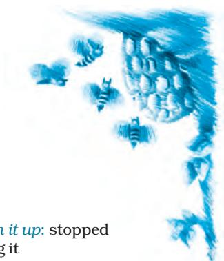
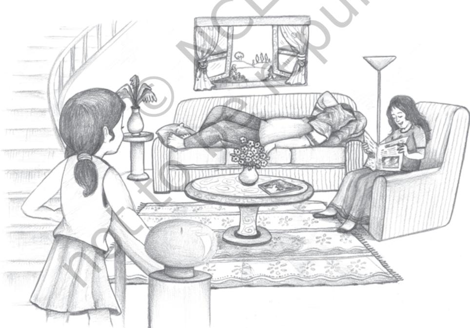

#### BEFORE YOU READ

- *• Do you feel you know your parents better now, than when you were much younger? Perhaps you now understand the reasons for some of their actions that used to upset you earlier.*
- *• This story about a little girl whose feelings for her father change from fear to understanding will probably find an echo in every home.*
- 1. TO the little girl he was a figure to be feared and avoided. Every morning before going to work he came into her room and gave her a casual kiss, to which she responded with "Goodbye, Father". And oh, there was a glad sense of relief when she heard the noise of the carriage growing fainter and fainter down the long road!

In the evening when he came home she stood near the staircase and heard his loud voice in the hall. "Bring my tea into the drawing-room... Hasn't the paper come yet? Mother, go and see if my paper's out there — and bring me my slippers."

2. "Kezia," Mother would call to her, "if you're a good girl you can come down and take off father's boots." Slowly the girl would slip down the stairs, more slowly still across the hall, and push open the drawing-room door.

> By that time he had his spectacles on and looked at her over them in a way that was terrifying to the little girl.

> "Well, Kezia, hurry up and pull off these boots and take them outside. Have you been a good girl today?"

> > "I d-d-don't know, Father."

*a figure to be feared*: a person to be feared

*slip down*: come down quietly and unwillingly

"You d-d-don't know? If you stutter like that Mother will have to take you to the doctor."

3. She never stuttered with other people — had quite given it up — but only with Father, because then she was trying so hard to say the words properly.

> "What's the matter? What are you looking so wretched about? Mother, I wish you taught this child not to appear on the brink of suicide... Here, Kezia, carry my teacup back to the table carefully."

> He was so big — his hands and his neck, especially his mouth when he yawned. Thinking about him alone was like thinking about a giant.

- 4. On Sunday afternoons Grandmother sent her down to the drawing-room to have a "nice talk with Father and Mother". But the little girl always found Mother reading and Father stretched out on the sofa, his handkerchief on his face, his feet on one of the best cushions, sleeping soundly and snoring.
*given it up*: stopped doing it

#### *wretched*: unhappy

*on the brink of suicide*: about to commit suicide

*The little girl always found Mother reading and Father stretched out on the sofa.*

*The Little Girl* / 33

She sat on a stool, gravely watched him until he woke and stretched, and asked the time — then looked at her.

"Don't stare so, Kezia. You look like a little brown owl."

One day, when she was kept indoors with a cold, her grandmother told her that father's birthday was next week, and suggested she should make him a pin-cushion for a gift out of a beautiful piece of yellow silk.

5. Laboriously, with a double cotton, the little girl stitched three sides. But what to fill it with? That was the question. The grandmother was out in the garden, and she wandered into Mother's bedroom to look for scraps. On the bed-table she discovered a great many sheets of fine paper, gathered them up, tore them into tiny pieces, and stuffed her case, then sewed up the fourth side.

> That night there was a hue and cry in the house. Father's great speech for the Port Authority had been lost. Rooms were searched; servants questioned. Finally Mother came into Kezia's room.

"Kezia, I suppose you didn't see some papers on a table in our room?"

"Oh yes," she said, "I tore them up for my surprise."

"What!" screamed Mother. "Come straight down to the dining-room this instant."

6. And she was dragged down to where Father was pacing to and fro, hands behind his back.

"Well?" he said sharply.

Mother explained.

He stopped and stared at the child.

"Did you do that?"

"N-n-no", she whispered.

"Mother, go up to her room and fetch down the damned thing — see that the child's put to bed this instant."

*laboriously*: with a lot of effort or difficulty

*wandered into*: went into, by chance

*scraps*: small pieces of cloth or paper, etc. that are not needed

*hue and cry*: angry protest

34 / *Beehive*

- 7. Crying too much to explain, she lay in the shadowed room watching the evening light make a sad little pattern on the floor.
Then Father came into the room with a ruler in his hands.

"I am going to beat you for this," he said.

"Oh, no, no", she screamed, hiding under the bedclothes.

He pulled them aside.

"Sit up," he ordered, "and hold out your hands. You must be taught once and for all not to touch what does not belong to you."

"But it was for your b-b-birthday."

Down came the ruler on her little, pink palms. 8. Hours later, when Grandmother had wrapped her in a shawl and rocked her in the rocking-chair, the child clung to her soft body.

"What did God make fathers for?" she sobbed.

"Here's a clean hanky, darling. Blow your nose. Go to sleep, pet; you'll forget all about it in the morning. I tried to explain to Father but he was too upset to listen tonight."

But the child never forgot. Next time she saw him she quickly put both hands behind her back and a red colour flew into her cheeks.

9. The Macdonalds lived next door. They had five children. Looking through a gap in the fence the little girl saw them playing 'tag' in the evening. The father with the baby, Mao, on his shoulders, two little girls hanging on to his coat pockets ran round and round the flower-beds, shaking with laughter. Once she saw the boys turn the hose on him—and he tried to catch them laughing all the time.

Then it was she decided there were different sorts of fathers.

Suddenly, one day, Mother became ill, and she and Grandmother went to hospital.

The little girl was left alone in the house with Alice, the cook. That was all right in the daytime,

*tag*: a children's game of catching one another

*The Little Girl* / 35

*The little girl saw through a gap the Macdonalds playing 'tag' in the evening.*

but while Alice was putting her to bed she grew suddenly afraid.

- 10. "What'll I do if I have a nightmare?" she asked. "I often have nightmares and then Grannie takes me into her bed—I can't stay in the dark—it all gets 'whispery'…"
*nightmare*: a bad dream

"You just go to sleep, child," said Alice, pulling off her socks, "and don't you scream and wake your poor Pa."

36 / *Beehive*

"What's the matter?" he said.

- 11. "Oh, a butcher a knife I want Grannie." He blew out the candle, bent down and caught up the child in his arms, carrying her along the passage to the big bedroom. A newspaper was on the bed. He put away the paper, then carefully tucked up the child. He lay down beside her. Half asleep still, still with the butcher's smile all about her it seemed, she crept close to him, snuggled her head under his arm, held tightly to his shirt.
Then the dark did not matter; she lay still.

"Here, rub your feet against my legs and get them warm," said Father.

- 12. Tired out, he slept before the little girl. A funny feeling came over her. Poor Father, not so big, after all and with no one to look after him. He was harder than Grandmother, but it was a nice hardness. And every day he had to work and was too tired to be a Mr Macdonald… She had torn up all his beautiful writing… She stirred suddenly, and sighed.
"What's the matter?" asked her father. "Another dream?"

"Oh," said the little girl, "my head's on your heart. I can hear it going. What a big heart you've got, Father dear."

KATHERINE MANSFIELD

up nicely in bed *snuggled*: moved into

*tucked up*: covered

a warm, comfortable position, close to another person

### Thinking about the Text

- I. Given below are some emotions that Kezia felt. Match the emotions in Column A with the items in Column B.

|  | A |  | B |
| --- | --- | --- | --- |
| 1. | fear or terror | (i) | father comes into her room to give |
|  |  |  | her a goodbye kiss |
| 2. | glad sense of relief | (ii) | noise of the carriage grows fainter |
| 3. | a "funny" feeling, perhaps | (iii) | father comes home |
|  | of understanding | (iv) | speaking to father |
|  |  | (v) | going to bed when alone at home |
|  |  | (vi) | father comforts her and falls asleep |
|  |  | (vii) | father stretched out on the sofa, |
|  |  | snoring |  |

II. Answer the following questions in one or two sentences.

- 1. Why was Kezia afraid of her father?
- 2. Who were the people in Kezia's family?
- 3. What was Kezia's father's routine
	- (i) before going to his office?
	- (ii) after coming back from his office?
	- (iii) on Sundays?
- 4. In what ways did Kezia's grandmother encourage her to get to know her father better?
- III. Discuss these questions in class with your teacher and then write down your answers in two or three paragraphs each.
	- 1. Kezia's efforts to please her father resulted in displeasing him very much. How did this happen?
	- 2. Kezia decides that there are "different kinds of fathers". What kind of father was Mr Macdonald, and how was he different from Kezia's father?
	- 3. How does Kezia begin to see her father as a human being who needs her sympathy?

## Thinking about Language

- I. Look at the following sentence.
There was a *glad* sense of relief when she heard the noise of the carriage growing fainter...

Here, *glad* means happy about something.

*Glad, happy, pleased, delighted, thrilled* and *overjoyed* are synonyms (words or

38 / *Beehive*

expressions that have the same or nearly the same meaning.) However, they express happiness in certain ways.

Read the sentences below.

- She was *glad* when the meeting was over.
- The chief guest was *pleased* to announce the name of the winner.
- 1. Use an appropriate word from the synonyms given above in the following sentences. Clues are given in brackets.
	- (i) She was by the news of her brother's wedding. (very pleased)
	- (ii) I was to be invited to the party. (extremely pleased and excited about)
	- (iii) She was at the birth of her granddaughter. (extremely happy)
	- (iv) The coach was with his performance. (satisfied about)
	- (v) She was very with her results. (happy about something that has happened)
- 2. Study the use of the word *big* in the following sentence.

He was so *big* — his hands and his neck, especially his mouth… Here, *big* means *large in size*.

Now, consult a dictionary and find out the meaning of *big* in the following sentences. The first one has been done for you.

- (i) You are a big girl now. *older*
- (ii) Today you are going to take the biggest decision of your career.
- (iii) Their project is full of big ideas.
- (iv) Cricket is a big game in our country.
- (v) I am a big fan of Lata Mangeskar.
- (vi) You have to cook a bit more as my friend is a big eater.
- (vii) What a big heart you've got, Father dear.

#### II. Verbs of Reporting

Study the following sentences.

- "What!" *screamed* Mother.
- "N-n-no", she *whispered*.
- "Sit up," he *ordered*.

The italicised words are verbs of reporting. We quote or report what someone has said or thought by using a reporting verb. Every reporting clause contains a reporting verb. For example:

- He *promised* to help in my project.
- "How are you doing?" Seema *asked*.

*The Little Girl* / 39

We use verbs of reporting to advise, order, report statements, thoughts, intentions, questions, requests, apologies, manner of speaking and so on.

- 1. Underline the verbs of reporting in the following sentences.
	- (i) He says he will enjoy the ride.
	- (ii) Father mentioned that he was going on a holiday.
	- (iii) No one told us that the shop was closed.
	- (iv) He answered that the price would go up.
	- (v) I wondered why he was screaming.
	- (vi) Ben told her to wake him up.
	- (vii) Ratan apologised for coming late to the party.
- 2. Some verbs of reporting are given in the box. Choose the appropriate verbs and fill in the blanks in the following sentences.

were complaining shouted replied remarked ordered suggested

- (i) "I am not afraid," the woman.
- (ii) "Leave me alone," my mother .
- (iii) The children that the roads were crowded and noisy.
- (iv) "Perhaps he isn't a bad sort of a chap after all," the master.
- (v) "Let's go and look at the school ground," the sports teacher.
- (vi) The traffic police all the passers-by to keep off the road.

Form pairs or groups and discuss the following questions.

- 1. This story is not an Indian story. But do you think there are fathers, mothers and grandmothers like the ones portrayed in the story in our own country?
- 2. Was Kezia's father right to punish her? What kind of a person was he? You might find some of these words useful in describing him:

undemonstrative loving strict hard-working responsible unkind disciplinarian short-tempered affectionate caring indifferent

Has your life been different from or similar to that of Kezia when you were a child? Has your perception about your parents changed now? Do you find any change in your parents' behaviour vis-à-vis yours? Who has become more understanding? What steps would you like to take to build a relationship based on understanding? Write three or four paragraphs (150–200 words) discussing these issues from your own experience.

40 / *Beehive*

## Rain on the Roof

*When the sky is covered with dark clouds and it starts raining, have you ever listened to the patter of soft rain on the roof ? What thoughts flashed through your mind as you heard this melody of nature? Read the poem to find out what the poet dreamed of while listening to the rain.*

> When the humid shadows hover Over all the starry spheres And the melancholy darkness Gently weeps in rainy tears, What a bliss to press the pillow Of a cottage-chamber bed And lie listening to the patter Of the soft rain overhead!

Every tinkle on the shingles Has an echo in the heart; And a thousand dreamy fancies Into busy being start, And a thousand recollections Weave their air-threads into woof, As I listen to the patter Of the rain upon the roof.

Now in memory comes my mother, As she used in years agone, To regard the darling dreamers Ere she left them till the dawn: O! I feel her fond look on me As I list to this refrain Which is played upon the shingles By the patter of the rain.

COATES KINNEY

GLOSSARY

tinkle: short, light ringing sounds shingles: rectangular wooden tiles used on roofs woof: weft, i.e. the threads woven across the loom ere: old poetic word for 'before' refrain: a repeated part of a song or a poem; here, the sound of the rain list: old poetic word for 'listen'

# Thinking about the Poem

- I. 1. What do the following phrases mean to you? Discuss in class.
	- (i) humid shadows
	- (ii) starry spheres
	- (iii) what a bliss
	- (iv) a thousand dreamy fancies into busy being start
	- (v) a thousand recollections weave their air-threads into woof
	- 2. What does the poet like to do when it rains?
	- 3. What is the single major memory that comes to the poet? Who are the "darling dreamers" he refers to?
	- 4. Is the poet now a child? Is his mother still alive?
- II. 1. When you were a young child, did your mother tuck you in, as the poet's did?
	- 2. Do you like rain? What do you do when it rains steadily or heavily as described in the poem?
	- 3. Does everybody have a cosy bed to lie in when it rains? Look around you and describe how different kinds of people or animals spend time, seek shelter etc. during rain.

All that I am or ever hope to be, I owe to my angel Mother.

