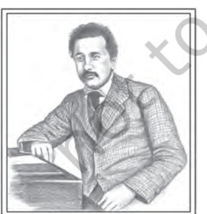
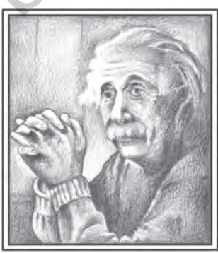
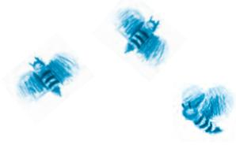

#### 4. A TRULY BEAUTIFUL MIND

- The story of Einstein tries to show him as a human being, a fairly ordinary person who had his likes and dislikes, his streaks of rebellion, and his problems. The class can think about how a 'great person' was perceived before being recognised as 'great': it is not as though great people are born with a special sign that allows us to recognise them instantly! What qualities in a person, then, make them a genius or a great person?
- You can take the help of a science teacher to explain Einstein's Theory of Relativity, to talk about Einstein, and build inter-subject cooperation.
- The exercise of matching headings to paragraphs in the lesson is useful for finding the topic sentence or to scan a paragraph for specific information. Students may be asked to provide a different heading if they feel some other point is equally important.
- Students should be guided to write a newspaper report. Note the points given below. Illustrate them by bringing examples from newspapers into the class, and ask students to bring their own examples.
	- A report should have:
		- 1. A headline
		- 2. Name of the reporter e.g. 'By a Staff Reporter', etc.
		- 3. Place, date, source (the source may also be given at the end of the report).
	- The beginning is usually an expansion of the headline. The middle paragraph gives the details. It is followed by the conclusion or the summing up.
	- The report should be brief, but the headline and the style should be eye-catching.
	- Sometimes important points are given in a box in the centre of the report.
	- Regarding the language of the reports:
		- 1. passives for past action (for example: It is found ..., ... has been unearthed.)
- 2. present tense for statements (The document contains…, The manuscript describes…)
- This unit has a passage for dictation, an anecdote. Dictation is an exercise that requires the individual participation of each student. It fosters unconscious thinking, and draws attention to language form. Students can also be given opportunities for self or peer correction after the dictation.
	- Students should first read the passage silently, noticing the use of punctuation marks.
	- The passage to be dictated should be read aloud twice in the class with proper intonation, and pauses between meaningful phrases.
	- The passage is read a third time for students to check through.

#### 5. THE SNAKE AND THE MIRROR

- 'The Snake and the Mirror' is a complex story of self-discovery that is humorously told. The narrator is a vain and foolish young man who in a moment of crisis realises that he is "poor, foolish and stupid". The questions are designed to help the students notice the humour in the narration.
- This unit has a formal, expository passage for dictation. Students should be encouraged to learn the spellings of unfamiliar words beforehand. The dictation of such passages also encourages the development of grammar in the students' minds, as they recall complex language.
- The Writing task is based on a sketch from a photograph that tells a story. Encourage the students to read the words given alongside the sketch. Let the students form pairs or groups to talk freely about the sketch before they start writing.
- A new kind of activity introduced in this lesson is to compare two translations of the beginning of a story. This activity suggests to the students that language is not 'fixed'; there are different ways of experiencing an idea, which also lead to small changes in the idea that is expressed. This activity should be done as a fun activity.

### 6. MY CHILDHOOD

- The autobiographical account of childhood embodies the themes of harmony and prejudice, tradition and change. The questions guide the children to identify the instances of the themes.
- A map reading activity is given in this unit. Students will find out the geographical location of Dhanushkodi and Rameswaram, and the languages spoken at that time by different communities. This

will develop a critical understanding of how life and society in the deep south changed and developed over the years. Dhanuskodi and Rameswaram are on an island, the Pamban Island, off the Tamil Nadu coast.

- The dictionary work encourages children to identify the contexts, literal and metaphorical, in which the given words occur. You may find other such words to add to the exercise.
- The dictation exercise in this unit requires the rearrangement of jumbled paragraphs. Ideally this kind of dictation should be carried out with passages that the students have not seen before.

The teacher dictates the three parts of the given passage, in random order, one to each group in class, for example part two first, then part three, and finally part one. The class has to share information in order to put the text together in the right order. This can be a class activity directed by the teacher.

- The Speaking exercise includes an activity requiring students to ask other people for their opinion on the topic.

# 4. A Truly Beautiful Mind

### BEFORE YOU READ

- Who do you think of, when you hear the word 'genius'? Who is a genius — what qualities do you think a genius has?
- We shall now read about a young German civil servant who took the world by storm about a hundred years ago. In the summer of 1905, the 26-year-old published in quick succession four ground-breaking papers: about light, the motion of particles, the electrodynamics of moving bodies, and energy. His work took up only a few pages in scientific journals, but changed forever our understanding of space, time and the entire cosmos — and transformed the name 'Einstein' into a synonym for genius.
- Fifty years after his death, Albert Einstein's genius still reigns.
- 1. ALBERT Einstein was born on 14 March 1879 in the German city of Ulm, without any indication that he was destined for greatness. On the contrary, his mother thought Albert was a freak. To her, his head seemed much too large.
- 2. At the age of two-and-a-half, Einstein still wasn't talking. When he finally did learn to speak, he uttered everything twice. Einstein did not know what to do with other children, and his playmates called him "Brother Boring." So the youngster played by himself

Otto Neugebauer, the historian of ancient mathematics, told a story about the boy Einstein that he characterises as a "legend", but that seems fairly authentic. As he was a late talker, his parents were worried. At last, at the supper table one night, he broke his silence to say, "The soup is too hot." Greatly relieved, his parents asked why he had never said a word before. Albert replied, "Because up to now everything was in order."

freak: a word used disapprovingly to talk about a person who is unusual and doesn't behave, look or think like others

much of the time. He especially loved mechanical toys. Looking at his newborn sister, Maja, he is said to have said: "Fine, but where are her wheels?"

- 3. A headmaster once told his father that what Einstein chose as a profession wouldn't matter, because "he'll never make a success at anything." Einstein began learning to play the violin at the age of six, because his mother wanted him to; he later became a gifted amateur violinist, maintaining this skill throughout his life.
- 4. But Albert Einstein was not a bad pupil. He went to high school in Munich, where Einstein's family had moved when he was 15 months old, and scored good marks in almost every subject. Einstein hated the school's regimentation, and often clashed with his teachers. At the age of 15, Einstein felt so stifled there that he left the school for good.
- 5. The previous year, Albert's parents had moved to Milan, and left their son with relatives. After prolonged discussion, Einstein got his wish to continue his education in German-speaking Switzerland, in a city which was more liberal than Munich.
- 6. Einstein was highly gifted in mathematics and interested in physics, and after finishing school, he decided to study at a university in Zurich. But science wasn't the only thing that appealed to the dashing young man with the walrus moustache.

amateur: doing something for personal enjoyment rather than as a profession

regimentation: order or discipline taken to an extreme stifled: unable to breathe; suffocated

liberal: willing to understand and respect others' opinions

Einstein in 1900 at the age of 21.

Einstein in 1955 as we remember him now

A Truly Beautiful Mind / 47

- 7. He also felt a special interest in a fellow student, Mileva Maric, whom he found to be a "clever creature." This young Serb had come to Switzerland because the University in Zurich was one of the few in Europe where women could get degrees. Einstein saw in her an ally against the "philistines" those people in his family and at the university with whom he was constantly at odds. The couple fell in love. Letters survive in which they put their affection into words, mixing science with tenderness. Wrote Einstein: "How happy and proud I shall be when we both have brought our work on relativity to a victorious conclusion."
- 8. In 1900, at the age of 21, Albert Einstein was a university graduate and unemployed. He worked as a teaching assistant, gave private lessons and finally secured a job in 1902 as a technical expert in the patent office in Bern. While he was supposed to be assessing other people's inventions, Einstein was actually developing his own ideas in secret. He is said to have jokingly called his desk drawer at work the "bureau of theoretical physics."
- 9. One of the famous papers of 1905 was Einstein's Special Theory of Relativity, according to which time and distance are not absolute. Indeed, two perfectly accurate clocks will not continue to show the same time if they come together again after a journey if one of them has been moving very fast relative to the other. From this followed the world's most famous formula which describes the relationship between mass and energy:

#### E = mc2

(In this mathematical equation, E stands for energy, m for mass and c for the speed of the light in a vacuum (about 300,000 km/s).

> When you sit with a nice girl for two hours, it seems like two minutes. When you sit on a hot stove for two minutes, it seems like two hours—that's relativity. – ALBERT EINSTEIN

> > * * *

associate

philistines: a word used disapprovingly to talk about people who do not like art, literature or music

ally: a friend or an

patent: a document which gives the rights of an invention to an inventor

absolute: measured in itself, not in relation to anything else

48 / Beehive

- 10. While Einstein was solving the most difficult problems in physics, his private life was unravelling. Albert had wanted to marry Mileva right after finishing his studies, but his mother was against it. She thought Mileva, who was three years older than her son, was too old for him. She was also bothered by Mileva's intelligence. "She is a book like you," his mother said. Einstein put the wedding off.
- 11. The pair finally married in January 1903, and had two sons. But a few years later, the marriage faltered. Mileva, meanwhile, was losing her intellectual ambition and becoming an unhappy housewife. After years of constant fighting, the couple finally divorced in 1919. Einstein married his cousin Elsa the same year.

* * *

- 12.Einstein's new personal chapter coincided with his rise to world fame. In 1915, he had published his General Theory of Relativity, which provided a new interpretation of gravity. An eclipse of the sun in 1919 brought proof that it was accurate. Einstein had correctly calculated in advance the extent to which the light from fixed stars would be deflected through the sun's gravitational field. The newspapers proclaimed his work as "a scientific revolution."
- 13. Einstein received the Nobel Prize for Physics in 1921. He was showered with honours and invitations from all over the world, and lauded by the press.

* * *

- 14. When the Nazis came to power in Germany in 1933, Einstein emigrated to the United States. Five years later, the discovery of nuclear fission in Berlin had American physicists in an uproar. Many of them had fled from Fascism, just as Einstein had, and now they were afraid the Nazis could build and use an atomic bomb.
unravelling: starting to fail

faltered: became weak

deflected: changed direction because it hit something

in an uproar: very upset

A Truly Beautiful Mind / 49

- 15. At the urging of a colleague, Einstein wrote a letter to the American President, Franklin D. Roosevelt, on 2 August 1939, in which he warned: "A single bomb of this type . . . exploded in a port, might very well destroy the whole port together with some of the surrounding territory." His words did not fail to have an effect. The Americans developed the atomic bomb in a secret project of their own, and dropped it on the Japanese cities of Hiroshima and Nagasaki in August 1945.
- 16. Einstein was deeply shaken by the extent of the destruction. This time he wrote a public missive to the United Nations. In it he proposed the formation of a world government. Unlike the letter to Roosevelt, this one made no impact. But over the next decade, Einstein got ever more involved in politics agitating for an end to the arms buildup and using his popularity to campaign for peace and democracy.
- 17. When Einstein died in 1955 at the age of 76, he was celebrated as a visionary and world citizen as much as a scientific genius.

missive: letter, especially long and official

visionary: a person who can think about the future in an original and intelligent way

# Thinking about the Text

- 1.Here are some headings for paragraphs in the text. Write the number(s) of the paragraph(s) for each title against the heading. The first one is done for you.

| (i) | Einstein's equation |
| --- | --- |
| (ii) | Einstein meets his future wife |
| (iii) | The making of a violinist |
| (iv) | Mileva and Einstein's mother |
| (v) | A letter that launched the arms race |

(vi) A desk drawer full of ideas

- (vii) Marriage and divorce
9

50 / Beehive

- 2. Who had these opinions about Einstein?
	- (i) He was boring.
	- (ii) He was stupid and would never succeed in life.
	- (iii) He was a freak.
- 3. Explain what the reasons for the following are.
	- (i) Einstein leaving the school in Munich for good.
	- (ii) Einstein wanting to study in Switzerland rather than in Munich.
	- (iii) Einstein seeing in Mileva an ally.
	- (iv) What do these tell you about Einstein?
- 4. What did Einstein call his desk drawer at the patent office? Why?
- 5. Why did Einstein write a letter to Franklin Roosevelt?
- 6. How did Einstein react to the bombing of Hiroshima and Nagasaki?
- 7. Why does the world remember Einstein as a "world citizen"?
- 8. Here are some facts from Einstein's life. Arrange them in chronological order.
	- [ ] Einstein publishes his special theory of relativity.
	- [ ] He is awarded the Nobel Prize in Physics.
	- [ ] Einstein writes a letter to U.S. President, Franklin D. Roosevelt, and warns against Germany's building of an atomic bomb.
	- [ ] Einstein attends a high school in Munich.
	- [ ] Einstein's family moves to Milan.
	- [ ] Einstein is born in the German city of Ulm.
	- [ ] Einstein joins a university in Zurich, where he meets Mileva.
	- [ ] Einstein dies.
	- [ ] He provides a new interpretation of gravity.
	- [ ] Tired of the school's regimentation, Einstein withdraws from school.
	- [ ] He works in a patent office as a technical expert.
	- [ ] When Hitler comes to power, Einstein leaves Germany for the United States.

## Thinking about Language

- I. Here are some sentences from the story. Choose the word from the brackets which can be substituted for the italicised words in the sentences.
	- 1. A few years later, the marriage faltered. (failed, broke, became weak).
	- 2. Einstein was constantly at odds with people at the university. (on bad terms, in disagreement, unhappy)
	- 3. The newspapers proclaimed his work as "a scientific revolution." (declared, praised, showed)

A Truly Beautiful Mind / 51

- 4. Einstein got ever more involved in politics, agitating for an end to the arms buildup. (campaigning, fighting, supporting)
- 5. At the age of 15, Einstein felt so stifled that he left the school for good. (permanently, for his benefit, for a short time)
- 6. Five years later, the discovery of nuclear fission in Berlin had American physicists in an uproar. (in a state of commotion, full of criticism, in a desperate state)
- 7. Science wasn't the only thing that appealed to the dashing young man with the walrus moustache. (interested, challenged, worried)

II. Study the following sentences.

- Einstein became a gifted amateur violinist, maintaining this skill throughout his life.
- Letters survive in which they put their affection into words, mixing science with tenderness.

The parts in italics in the above sentences begin with –ing verbs, and are called participial phrases. Participial phrases say something more about the person or thing talked about or the idea expressed by the sentence as a whole. For example:

- Einstein became a gifted amateur violinist. He maintained this skill throughout his life.
Complete the sentences below by filling in the blanks with suitable participial clauses. The information that has to be used in the phrases is provided as a sentence in brackets.

- 1. , the firefighters finally put out the fire. (They worked round the clock.)
- 2. She watched the sunset above the mountain, (She noticed the colours blending softly into one another.)
- 3. The excited horse pawed the ground rapidly, (While it neighed continually.)
- 4. , I found myself in Bangalore, instead of Benaras. (I had taken the wrong train.)
- 5. , I was desperate to get to the bathroom. (I had not bathed for two days)
- 6. The stone steps, needed to be replaced. (They were worn down).
- 7. The actor received hundreds of letters from his fans, (They asked him to send them his photograph.)

52 / Beehive

## Writing Newspaper Reports

Here are some notes which you could use to write a report.

21 August 2005 — original handwritten manuscript of Albert Einstein unearthed — by student Rowdy Boeynik in the University of the Netherlands — Boeynik researching papers — papers belonging to an old friend of Einstein — fingerprints of Einstein on these papers — 16-page document dated 1924 — Einstein's work on this last theory behaviour of atoms at low temperature — now known as the Bose-Einstein condensation — the manuscript to be kept at Leyden University where Einstein got the Nobel Prize.

Write a report which has four paragraphs, one each on:

- What was unearthed.
- Who unearthed it and when.
- What the document contained.
- Where it will be kept.

Your report could begin like this:

#### Student Unearths Einstein Manuscript

21 AUGUST 2005. An original handwritten Albert Einstein manuscript has been unearthed at a university in the Netherlands ...

Your teacher will dictate these paragraphs to you. Write down the paragraphs with correct punctuation marks.

In 1931 Charlie Chaplin invited Albert Einstein, who was visiting Hollywood, to a private screening of his new film, City Lights. As the two men drove into town together, passersby waved and cheered. Chaplin turned to his guest and explained: "The people are applauding you because none of them understands you and applauding me because everybody understands me."

One of Einstein's colleagues asked him for his telephone number one day. Einstein reached for a telephone directory and looked it up. "You don't remember your own number?" the man asked, startled.

"No," Einstein answered. "Why should I memorise something I can so easily get from a book?" (In fact, Einstein claimed never to memorise anything which could be looked up in less than two minutes.)

# The Lake Isle of Innisfree

This well known poem explores the poet's longing for the peace and tranquillity of Innisfree, a place where he spent a lot of time as a boy. This poem is a lyric.

I will arise and go now, and go to Innisfree, And a small cabin build there, of clay and wattles made: Nine bean-rows will I have there, a hive for the honeybee, And live alone in the bee-loud glade.

And I shall have some peace there, for peace comes dropping slow Dropping from the veils of the morning to where the cricket sings; There midnight's all a glimmer, and noon a purple glow, And evenings full of the linnet's wings.

I will arise and go now, for always night and day I hear the lake water lapping with low sounds by the shore; While I stand on the roadway, or on the pavements grey, I hear it in the deep heart's core.

WILLIAM BUTLER YEATS

#### GLOSSARY

wattles: twisted sticks for making fences, walls glade: clearing; open space linnet: a small brown and grey bird with a short beak

# Thinking about the Poem

I. 1.What kind of place is Innisfree? Think about:

- (i) the three things the poet wants to do when he goes back there (stanza I);
- (ii) what he hears and sees there and its effect on him (stanza II);
- (iii) what he hears in his "heart's core" even when he is far away from Innisfree (stanza III).
- 2. By now you may have concluded that Innisfree is a simple, natural place, full of beauty and peace. How does the poet contrast it with where he now stands? (Read stanza III.)
- 3. Do you think Innisfree is only a place, or a state of mind? Does the poet actually miss the place of his boyhood days?
- II. 1. Look at the words the poet uses to describe what he sees and hears at Innisfree
	- (i) bee-loud glade
	- (ii) evenings full of the linnet's wings
	- (iii) lake water lapping with low sounds

What pictures do these words create in your mind?

- 2. Look at these words;
... peace comes dropping slow

Dropping from the veils of the morning to where the cricket sings

What do these words mean to you? What do you think "comes dropping slow...from the veils of the morning"? What does "to where the cricket sings" mean?

> Health is the greatest gift, contentment the greatest wealth, faithfulness the best relationship.

> > GAUTAMA BUDDHA

The Lake Isle of Innisfree / 55

