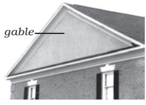
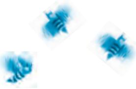
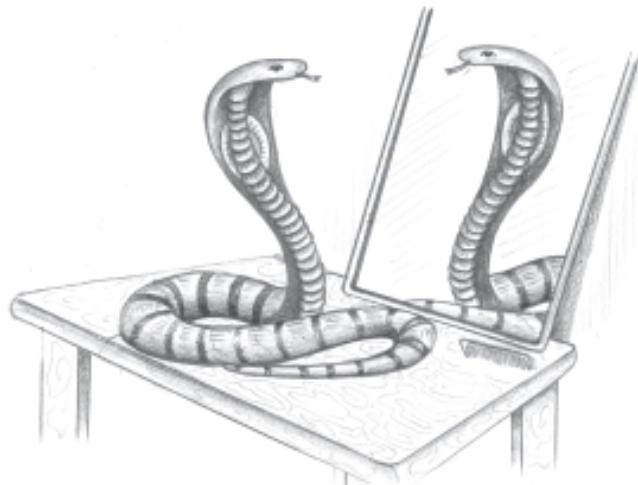
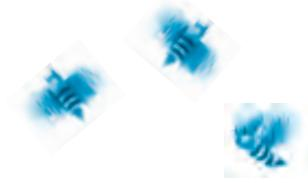
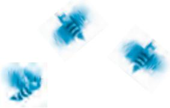
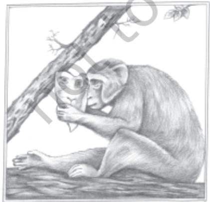
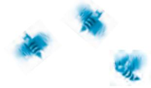
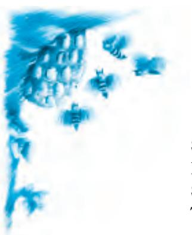

56 / *Beehive*

# 5. The Snak 5. The Snak5. The Snake and the Mirror

### BEFORE YOU READ

- *• Do you like to look at yourself in the mirror? What do you think about at such times? Have you ever seen a dog, a cat or a bird look into a mirror? What do you think it sees?*
- *• Now read this humorous story about a doctor, a snake, and a mirror.*
- 1. "HAS a snake ever coiled itself round any part of your body? A full-blooded cobra?" All of us fell silent. The question came from the homeopath. The topic came up when we were discussing snakes. We listened attentively as the doctor continued with his tale.

It was a hot summer night; about ten o'clock. I had my meal at the restaurant and returned to my room. I heard a noise from above as I opened the door. The sound was a familiar one. One could say that the rats and I shared the room. I took out my box of matches and lighted the kerosene lamp on the table.

- 2. The house was not electrified; it was a small rented room. I had just set up medical practice and my earnings were meagre. I had about sixty rupees in my suitcase. Along with some shirts and *dhotis*, I also possessed one solitary black coat which I was then wearing.
- 3. I took off my black coat, white shirt and not-sowhite vest and hung them up. I opened the two windows in the room. It was an outer room with one wall facing the open yard. It had a tiled roof with long supporting gables that rested on the beam over the wall. There was no ceiling. There was a

*meagre*: small in quantity.

*gable*: upper part of a wall below a sloping roof

regular traffic of rats to and from the beam. I made my bed and pulled it close to the wall. I lay down but I could not sleep. I got up and went out to the veranda for a little air, but the wind god seemed to have taken time off.

4. I went back into the room and sat down on the chair. I opened the box beneath the table and took out a book, the *Materia Medica*. I opened it at the table on which stood the lamp and a large mirror; a small comb lay beside the mirror.

> One feels tempted to look into a mirror when it is near one. I took a look. In those days I was a great admirer of beauty and I believed in making myself look handsome. I was unmarried and I was a doctor. I felt I had to make my presence felt. I picked up the comb and ran it through my hair and adjusted the parting so that it looked straight and neat. Again I heard that sound from above.

- 5. I took a close look at my face in the mirror. I made an important decision — I would shave daily and grow a thin moustache to look more handsome. I was after all a bachelor, and a doctor!
I looked into the mirror and smiled. It was an attractive smile. I made another earth-shaking decision. I would always keep that attractive smile on my face ... to look more handsome. I was after all a bachelor, and a doctor too on top of it! Again came that noise from above.

- 6. I got up, paced up and down the room. Then another lovely thought struck me. I would marry. I would get married to a woman doctor who had plenty of money and a good medical practice. She had to be fat; for a valid reason. If I made some silly mistake and needed to run away she should not be able to run after me and catch me!
With such thoughts in my mind I resumed my seat in the chair in front of the table. There were no more sounds from above. Suddenly there came a dull thud as if a rubber tube had fallen to the

*The Snake and the Mirror* / 57

ground ... surely nothing to worry about. Even so I thought I would turn around and take a look. No sooner had I turned than a fat snake wriggled over the back of the chair and landed on my shoulder. The snake's landing on me and my turning were simultaneous.

- 7. I didn't jump. I didn't tremble. I didn't cry out. There was no time to do any such thing. The snake slithered along my shoulder and coiled around my left arm above the elbow. The hood was spread out and its head was hardly three or four inches from my face!
It would not be correct to say merely that I sat there holding my breath. I was turned to stone. But my mind was very active. The door opened into darkness. The room was surrounded by darkness. In the light of the lamp I sat there like a stone image in the flesh.

- 8. I felt then the great presence of the creator of this world and this universe. God was there. Suppose I said something and he did not like it . . . I tried in my imagination to write in bright letters outside my little heart the words, 'O God'.
There was some pain in my left arm. It was as if a thick leaden rod — no, a rod made of molten fire was slowly but powerfully crushing my arm. The arm was beginning to be drained of all strength. What could I do?

- 9. At my slightest movement the snake would strike me! Death lurked four inches away. Suppose it struck, what was the medicine I had to take? There were no medicines in the room. I was but a poor, foolish and stupid doctor. I forgot my danger and smiled feebly at myself.
It seemed as if God appreciated that. The snake turned its head. It looked into the mirror and saw its reflection. I do not claim that it was the first snake that had ever looked into a mirror. But it was certain that the snake was looking into the mirror. Was it admiring its own beauty? Was it trying

*Perhaps it wanted to enjoy its reflection at closer quarters.*

to make an important decision about growing a moustache or using eye shadow and mascara or wearing a vermilion spot on its forehead?

- 10. I did not know anything for certain. What sex was this snake, was it male or female? I will never know; for the snake unwound itself from my arm and slowly slithered into my lap. From there it crept onto the table and moved towards the mirror. Perhaps it wanted to enjoy its reflection at closer quarters. I was no mere image cut in granite. I was suddenly a man of flesh and blood. Still holding my breath I got up from the chair. I quietly went out through the door into the veranda. From there I leapt into the yard and ran for all I was worth.
"Phew !" Each of us heaved a sigh of relief. Somebody asked, "Doctor, is your wife very fat?"

- 11. "No," the doctor said. "God willed otherwise. My life companion is a thin reedy person with the gift of a sprinter."
Someone else asked, "Doctor, when you ran did the snake follow you?"

*The Snake and the Mirror* / 59

The doctor replied, "I ran and ran till I reached a friend's house. Immediately I smeared oil all over myself and took a bath. I changed into fresh clothes. The next morning at about eight-thirty I took my friend and one or two others to my room to move my things from there. But we found we had little to carry. Some thief had removed most of my things. The room had been cleaned out! But not really, the thief had left behind one thing as a final insult!'

- 12. "What was that?" I asked.
The doctor said, "My vest, the dirty one. The fellow had such a sense of cleanliness...! The rascal could have taken it and used it after washing it with soap and water."

"Did you see the snake the next day, doctor?"

The doctor laughed, "I've never seen it since. It was a snake which was taken with its own beauty!"

*taken with*: attracted by

VAIKOM MUHAMMAD BASHEER [translated from the Malayalam by V. Abdulla]

### Thinking about the Text

- I. Discuss in pairs and answer each question below in a short paragraph (30–40 words).
	- 1. "The sound was a familiar one." What sound did the doctor hear? What did he think it was? How many times did he hear it? (Find the places in the text.) When and why did the sounds stop?
	- 2. What two "important" and "earth-shaking" decisions did the doctor take while he was looking into the mirror?
	- 3. "I looked into the mirror and smiled," says the doctor. A little later he says, "I forgot my danger and smiled feebly at myself." What is the doctor's opinion about himself when: (i) he first smiles, and (ii) he smiles again? In what way do his thoughts change in between, and why?
- II. This story about a frightening incident is narrated in a humorous way. What makes it humorous? (Think of the contrasts it presents between dreams and reality. Some of them are listed below.)
	- 1. (i) The kind of person the doctor is (money, possessions)
		- (ii) The kind of person he wants to be (appearance, ambition)

60 / *Beehive*

- 2. (i) The person he wants to marry
	- (ii) The person he actually marries
- 3. (i) His thoughts when he looks into the mirror
	- (ii) His thoughts when the snake is coiled around his arm

Write short paragraphs on each of these to get your answer.

### Thinking about Language

- I. Here are some sentences from the text. Say which of them tell you, that the author: (a) was afraid of the snake, (b) was proud of his appearance, (c) had a sense of humour, (d) was no longer afraid of the snake.
	- 1. I was turned to stone.
	- 2. I was no mere image cut in granite.
	- 3. The arm was beginning to be drained of strength.
	- 4. I tried in my imagination to write in bright letters outside my little heart the words, 'O God'.
	- 5. I didn't tremble. I didn't cry out.
	- 6. I looked into the mirror and smiled. It was an attractive smile.
	- 7. I was suddenly a man of flesh and blood.
	- 8. I was after all a bachelor, and a doctor too on top of it!
	- 9. The fellow had such a sense of cleanliness...! The rascal could have taken it and used it after washing it with soap and water.
	- 10. Was it trying to make an important decision about growing a moustache or using eye shadow and mascara or wearing a vermilion spot on its forehead.
- II. Expressions used to show fear

Can you find the expressions in the story that tell you that the author was frightened? Read the story and complete the following sentences.

- 1. I was turned .
	- 2. I sat there holding .
	- 3. In the light of the lamp I sat there like .
- III. In the sentences given below some words and expressions are italicised. They are variously mean that one
	- is very frightened.
	- is too scared to move.
	- is frightened by something that happens suddenly.
	- makes another feel frightened.

Match the meanings with the words/expressions in italics, and write the appropriate meaning next to the sentence. The first one has been done for you.

- 1. I knew a man was following me, I was *scared out of my wits*. (very frightened)
*The Snake and the Mirror* / 61

- 2. I *got a fright* when I realised how close I was to the cliff edge.
- 3. He *nearly jumped out of his skin* when he saw the bull coming towards him.
- 4. You really *gave me a fright* when you crept up behind me like that.
- 5. Wait until I tell his story it will *make your hair stand on end*.
- 6. *Paralysed with fear*, the boy faced his abductors.
- 7. The boy hid behind the door, *not moving a muscle*.

#### IV. Reported questions

Study these sentences:

- His friend *asked*, "Did you see the snake the next day, doctor?" His friend *asked* the doctor *whether/if* he had seen the snake the next day.
- The little girl *wondered*, "Will I be home before the TV show begins?" The little girl *wondered if/whether* she would be home before the TV show began.
- Someone *asked*, "Why has the thief left the vest behind?" Someone *asked why* the thief had left the vest behind.

The words *if/whether* are used to report questions which begin with: *do, will*, *can*, *have, are* etc. These questions can be answered 'yes' or 'no'.

Questions beginning with *why/when/where/how/which/what* are reported using these same words.

The reporting verbs we use in questions with *if/whether/why/when* etc. are: *ask, inquire* and *wonder*.

#### *Remember that in reported speech,*

- the present tense changes to past tense
- *here*, *today*, *tomorrow*, *yesterday* etc. change to *there*, *that day*, *the next day*, *the day before*, etc.
- *I*/*you* change to *me*/*him*/*he*, etc., as necessary.
	- *Example*: He said to me, "*I* don't believe *you*."
		- He said *he* did not believe *me*.
		- She said to him, '*I* don't believe *you*.'
		- She told him that *she* did not believe *him*.

Report these questions using *if*/*whether* or *why*/*when*/*where*/*how*/*which*/*what.* Remember the italicised verbs change into the past tense.

- 1. Meena asked her friend, "*Do* you *think* your teacher will come today?"
- 2. David asked his colleague, "Where *will* you go this summer?"
- 3. He asked the little boy, "Why *are* you studying English?"
- 4. She asked me, "When *are* we going to leave?"
- 5. Pran asked me, "*Have* you finished reading the newspaper?"

62 / *Beehive*

- 6. Seema asked her, "How long *have* you lived here?"
- 7. Sheila asked the children, "*Are* you ready to do the work?"

# Speaking

Using some of the expressions given above in exercise III, talk about an incident when you were very scared. You may have a competition to decide whose story was the most frightening.

## Dictation

The following paragraph is about the Indian cobra. Read it twice and close your book. Your teacher will then dictate the paragraph to you. Write it down with appropriate punctuation marks.

The Indian cobra is the common name for members of the family of venomous snakes, known for their intimidating looks and deadly bite. Cobras are recognised by the hoods that they flare when angry or disturbed; the hoods are created by the extension of the ribs behind the cobras' heads. Obviously the best prevention is to avoid getting bitten. This is facilitated by the fact that humans are not the natural prey of any venomous snake. We are a bit large for them to swallow whole and they have no means of chopping us up into bite-size pieces. Nearly all snakebites in humans are the result of a snake defending itself when it feels threatened. In general snakes are shy and will simply leave if you give them a chance.

### Writing

- 1. Try to rewrite the story without its humour, merely as a frightening incident. What details or parts of the story would you leave out?
- 2. Read the description given alongside this sketch from a photograph in a newspaper (*Times of India*, 4 September 1999). Make up a story about what the monkey is thinking, or why it is looking into a mirror. Write a paragraph about it.

#### *THE FAIREST OF THEM ALL A monkey preens itself using a piece of mirror, in the Delhi ridge.*

('To preen oneself' means to spend a lot of time making oneself look attractive, and then admiring one's appearance. The word is used in disapproval.)

### Translation

The text you read is a translation of a story by a well-known Malayalam writer, Vaikom Muhammad Basheer.

In translating a story from one language to another, a translator must keep the content intact. However, the language and the style differ in different translations of the same text.

Here are two translations of the opening paragraphs of a novel by the Japanese writer, Haruki Murakami. Read them and answer the questions given below.

*A*

When the phone rang I was in the kitchen, boiling a potful of spaghetti and whistling along with an FM broadcast of the overture to Rossini's *The Thieving Magpie*, which has to be the perfect music for cooking pasta.

I wanted to ignore the phone, not only because the spaghetti was nearly done, but because Claudio Abbado was bringing the London Symphony to its musical climax.

I'm in the kitchen cooking spaghetti when the woman calls. Another moment until the spaghetti is done; there I am, whistling the prelude to Rossini's *La Gazza Ladra* along with the FM radio. Perfect spaghetti-cooking music!

*B*

I hear the telephone ring but tell myself, Ignore it. Let the spaghetti finish cooking. It's almost done, and besides, Claudio Abbado and the London Symphony Orchestra are coming to a crescendo.

Compare the two translations on the basis of the following points.

- the tense of narration (past and present tense)
- short, incomplete sentences
- sentence length

Which of these translations do you like? Give reasons for your choice.

## A Legend of the Northland

*This poem narrates the legend of an old lady who angered Saint Peter because of her greed.*

> Away, away in the Northland, Where the hours of the day are few, And the nights are so long in winter That they cannot sleep them through;

Where they harness the swift reindeer To the sledges, when it snows; And the children look like bear's cubs In their funny, furry clothes:

They tell them a curious story — I don't believe 'tis true; And yet you may learn a lesson If I tell the tale to you.

Once, when the good Saint Peter Lived in the world below, And walked about it, preaching, Just as he did, you know,

He came to the door of a cottage, In travelling round the earth, Where a little woman was making cakes, And baking them on the hearth;

And being faint with fasting, For the day was almost done, He asked her, from her store of cakes, To give him a single one.

So she made a very little cake, But as it baking lay, She looked at it, and thought it seemed Too large to give away.

Therefore she kneaded another, And still a smaller one; But it looked, when she turned it over, As large as the first had done.

Then she took a tiny scrap of dough, And rolled and rolled it flat; And baked it thin as a wafer — But she couldn't part with that.

For she said, "My cakes that seem too small When I eat of them myself Are yet too large to give away." So she put them on the shelf.

Then good Saint Peter grew angry, For he was hungry and faint; And surely such a woman Was enough to provoke a saint.

And he said, "You are far too selfish To dwell in a human form, To have both food and shelter, And fire to keep you warm.

Now, you shall build as the birds do, And shall get your scanty food By boring, and boring, and boring, All day in the hard, dry wood."

Then up she went through the chimney, Never speaking a word, And out of the top flew a woodpecker, For she was changed to a bird.

She had a scarlet cap on her head, And that was left the same; But all the rest of her clothes were burned Black as a coal in the flame.

And every country schoolboy Has seen her in the wood, Where she lives in the trees till this very day, Boring and boring for food.

PHOEBE CARY

*A ballad is a song narrating a story in short stanzas. Ballads are a part of folk culture or popular culture and are passed on orally from one generation to the next. 'A Legend of the Northland' is a ballad.*

#### GLOSSARY

legend: old traditional story Saint Peter: an apostle of Christ provoke: make angry

## Thinking about the Poem

- I. 1.Which country or countries do you think "the Northland" refers to?
	- 2. What did Saint Peter ask the old lady for? What was the lady's reaction?
	- 3. How did he punish her?
	- 4. How does the woodpecker get her food?
	- 5. Do you think that the old lady would have been so ungenerous if she had known who Saint Peter really was? What would she have done then?
	- 6. Is this a true story? Which part of this poem do you feel is the most important?
	- 7. What is a legend? Why is this poem called a legend?
	- 8. Write the story of 'A Legend of the Northland' in about ten sentences.
- II. 1. Let's look at the words at the end of the second and fourth lines, viz., 'snows' and 'clothes', 'true' and 'you', 'below' and 'know.' We find that 'snows' rhymes with 'clothes', 'true' rhymes with 'you' and 'below' rhymes with 'know'. Find more such rhyming words.
	- 2. Go to the local library or talk to older persons in your locality and find legends in your own language. Tell the class these legends.

*A Legend of the Northland* / 67

