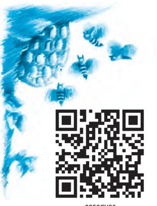
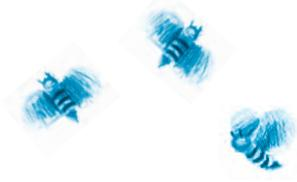
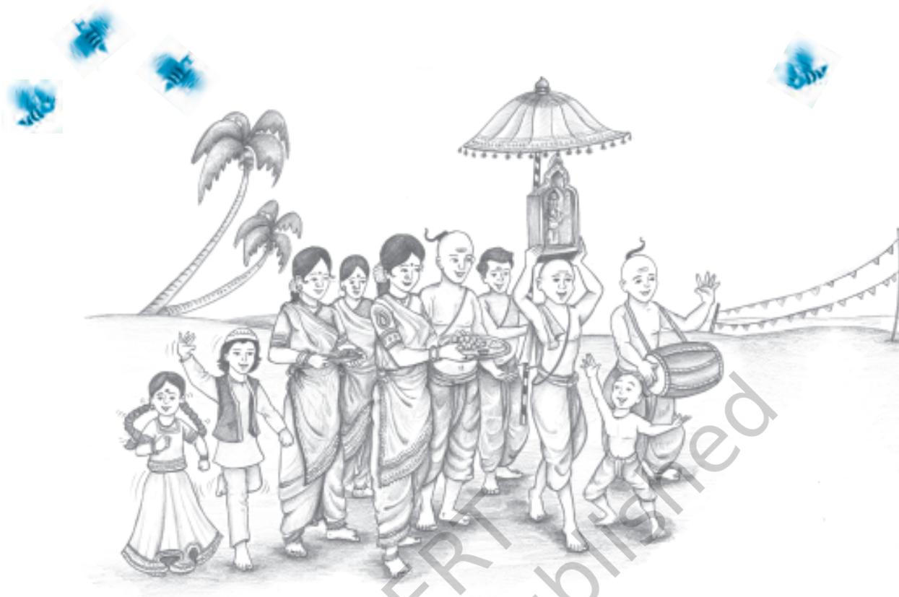
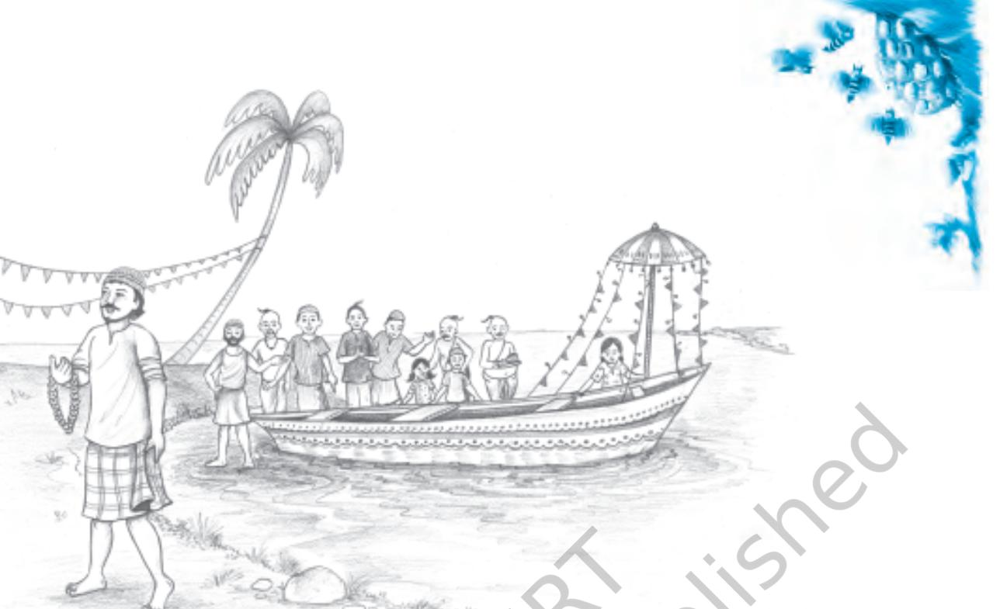
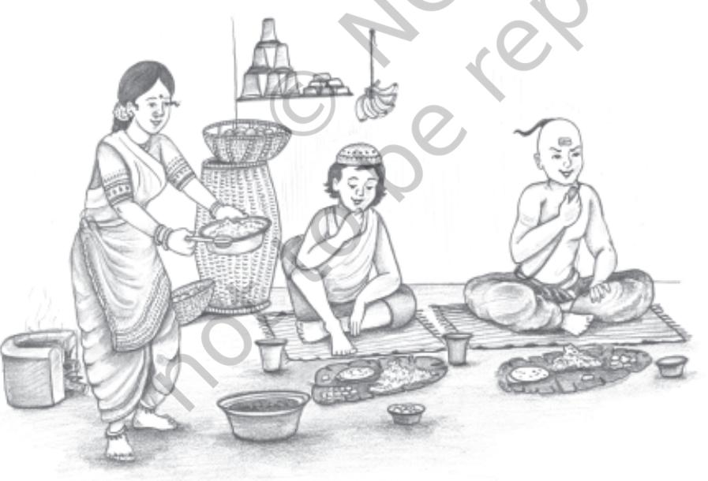
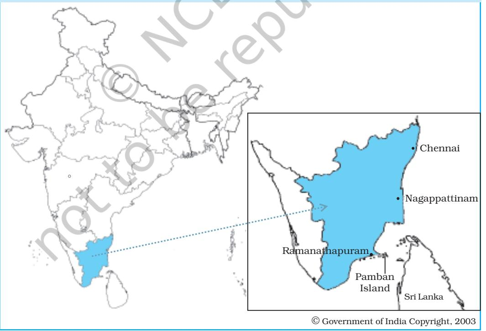
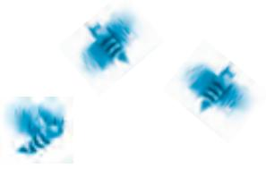
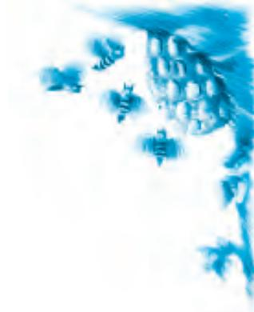

# 6. My Childhood

#### BEFORE YOU READ

- *• Can you think of any scientists, who have also been statesmen?*
- *• A.P.J. Abdul Kalam, whose projects in space, defence and nuclear technology guided India into the twenty-first century, became our eleventh President in 2002.*
- *• In his autobiography,* Wings of Fire*, he speaks of his childhood.*
- 1. I WAS born into a middle-class Tamil family in the island town of Rameswaram in the erstwhile Madras State. My father, Jainulabdeen, had neither much formal education nor much wealth; despite these disadvantages, he possessed great innate wisdom and a true generosity of spirit. He had an ideal helpmate in my mother, Ashiamma. I do not recall the exact number of people she fed every day, but I am quite certain that far more outsiders ate with us than all the members of our own family put together.
- 2. I was one of many children a short boy with rather undistinguished looks, born to tall and handsome parents. We lived in our ancestral house, which was built in the middle of the nineteenth century. It was a fairly large *pucca* house, made of limestone and brick, on the Mosque Street in Rameswaram. My austere father used to avoid all inessential comforts and luxuries. However, all necessities were provided for, in terms of food, medicine or clothes. In fact, I would say mine was a very secure childhood, both materially and emotionally.

*erstwhile*: former

*innate*: inborn; (a quality or feeling) in one's nature

*austere*: simple, strict and severe

- 3. The Second World War broke out in 1939, when I was eight years old. For reasons I have never been able to understand, a sudden demand for tamarind seeds erupted in the market. I used to collect the seeds and sell them to a provision shop on Mosque Street. A day's collection would fetch me the princely sum of one anna. My brother-in-law Jallaluddin would tell me stories about the War which I would later attempt to trace in the headlines in Dinamani. Our area, being isolated, was completely unaffected by the War. But soon India was forced to join the Allied Forces and something like a state of emergency was declared. The first casualty came in the form of the suspension of the train halt at Rameswaram station. The newspapers now had to be bundled and thrown out from the moving train on the Rameswaram Road between Rameswaram and Dhanuskodi. That forced my cousin Samsuddin, who distributed newspapers in Rameswaram , to look for a helping hand to catch the bundles and, as if naturally, I filled the slot. Samsuddin helped me earn my first wages. Half a century later, I can still feel the surge of pride in earning my own money for the first time.
- 4. Every child is born, with some inherited characteristics, into a specific socio-economic and emotional environment, and trained in certain ways by figures of authority. I inherited honesty and selfdiscipline from my father; from my mother, I inherited faith in goodness and deep kindness and so did my three brothers and sister. I had three close friends in my childhood — Ramanadha Sastry, Aravindan and Sivaprakasan. All these boys were from orthodox Hindu Brahmin families. As children, none of us ever felt any difference amongst ourselves because of our religious differences and upbringing. In fact, Ramanadha Sastry was the son of Pakshi Lakshmana Sastry, the high priest of the Rameswaram temple. Later, he took over the priesthood of the Rameswaram temple from his

princely sum: generous amount (here, ironic)

anna: an old Indian coin, worth about six paise

Allied Forces: the armies of U.K., U.S.A. and Russia during the Second World War

*Our family used to arrange boats for carrying idols of the Lord from the temple to the marriage site.*

father; Aravindan went into the business of arranging transport for visiting pilgrims; and Sivaprakasan became a catering contractor for the Southern Railways.

- 5. During the annual Shri Sita Rama Kalyanam ceremony, our family used to arrange boats with a special platform for carrying idols of the Lord from the temple to the marriage site, situated in the middle of the pond called Rama Tirtha which was near our house. Events from the *Ramayana* and from the life of the Prophet were the bedtime stories my mother and grandmother would tell the children in our family.
- 6. One day when I was in the fifth standard at the Rameswaram Elementary School, a new teacher came to our class. I used to wear a cap which marked me as a Muslim, and I always sat in the front row next to Ramanadha Sastry, who wore the

sacred thread. The new teacher could not stomach a Hindu priest's son sitting with a Muslim boy. In accordance with our social ranking as the new teacher saw it, I was asked to go and sit on the back bench. I felt very sad, and so did Ramanadha Sastry. He looked utterly downcast as I shifted to my seat in the last row. The image of him weeping when I shifted to the last row left a lasting impression on me.

- 7. After school, we went home and told our respective parents about the incident. Lakshmana Sastry summoned the teacher, and in our presence, told the teacher that he should not spread the poison of social inequality and communal intolerance in the minds of innocent children. He bluntly asked the teacher to either apologise or quit the school and the island. Not only did the teacher regret his behaviour, but the strong sense of conviction Lakshmana Sastry conveyed ultimately reformed this young teacher.
*could not stomach*: could not tolerate

*downcast*: sad or depressed

*conviction*: a strong opinion or belief

*I always sat in the front row next to Ramanadha Sastry.*

- 8. On the whole, the small society of Rameswaram was very rigid in terms of the segregation of different social groups. However, my science teacher Sivasubramania Iyer, though an orthodox Brahmin with a very conservative wife, was something of a rebel. He did his best to break social barriers so that people from varying backgrounds could mingle easily. He used to spend hours with me and would say, "Kalam, I want you to develop so that you are on par with the highly educated people of the big cities."
- 9. One day, he invited me to his home for a meal. His wife was horrified at the idea of a Muslim boy being invited to dine in her ritually pure kitchen. She refused to serve me in her kitchen. Sivasubramania Iyer was not perturbed, nor did he get angry with his wife, but instead, served me with

*ritually pure*: kept protected from all outside influences for the observances of religion

his own hands and sat down beside me to eat his meal. His wife watched us from behind the kitchen door. I wondered whether she had observed any difference in the way I ate rice, drank water or cleaned the floor after the meal. When I was leaving his house, Sivasubramania Iyer invited me to join him for dinner again the next weekend. Observing my hesitation, he told me not to get upset, saying, "Once you decide to change the system, such problems have to be confronted." When I visited his house the next week, Sivasubramania Iyer's wife took me inside her kitchen and served me food with her own hands.

- 10. Then the Second World War was over and India's freedom was imminent. "Indians will build their own India," declared Gandhiji. The whole country was filled with an unprecedented optimism. I asked my father for permission to leave Rameswaram and study at the district headquarters in Ramanathapuram.

*Sivasubramania Iyer's wife took me inside her kitchen and served me food.*

- 11. He told me as if thinking aloud, "Abul ! I know you have to go away to grow. Does the seagull not fly across the sun, alone and without a nest?" He quoted Khalil Gibran to my hesitant mother, "Your children are not your children. They are the sons and daughters of Life's longing for itself. They come through you but not from you. You may give them your love but not your thoughts. For they have their own thoughts."
A.P.J. ABDUL KALAM [an extract from *Wings of Fire*]

# Thinking about the Text

#### *Activity*

Find Dhanuskodi and Rameswaram on the map. What language(s) do you think are spoken there? What languages do you think the author, his family, his friends and his teachers spoke with one another?

74 / *Beehive*

I. Answer these questions in one or two sentences each.

- 1. Where was Abdul Kalam's house?
- 2. What do you think *Dinamani* is the name of? Give a reason for your answer.
- 3. Who were Abdul Kalam's school friends? What did they later become?
- 4. How did Abdul Kalam earn his first wages?
- 5. Had he earned any money before that? In what way?
- II. Answer each of these questions in a short paragraph (about 30 words)
	- 1. How does the author describe: (i) his father, (ii) his mother, (iii) himself?
	- 2. What characteristics does he say he inherited from his parents?
- III. Discuss these questions in class with your teacher and then write down your answers in two or three paragraphs each.
	- 1. "On the whole, the small society of Rameswaram was very rigid in terms of the segregation of different social groups," says the author.
		- (i) Which social groups does he mention? Were these groups easily identifiable (for example, by the way they dressed)?
		- (ii) Were they aware only of their differences or did they also naturally share friendships and experiences? (Think of the bedtime stories in Kalam's house; of who his friends were; and of what used to take place in the pond near his house.)
		- (iii) The author speaks both of people who were very aware of the differences among them and those who tried to bridge these differences. Can you identify such people in the text?
		- (iv) Narrate two incidents that show how differences can be created, and also how they can be resolved. How can people change their attitudes?
	- 2. (i) Why did Abdul Kalam want to leave Rameswaram?
		- (ii) What did his father say to this?
		- (iii) What do you think his words mean? Why do you think he spoke those words?

- I. Find the sentences in the text where these words occur:
erupt surge trace undistinguished casualty

Look these words up in a dictionary which gives examples of how they are used. Now answer the following questions.

- 1. What are the things that can *erupt*? Use examples to explain the various meanings of *erupt*. Now do the same for the word *surge.* What things can *surge*?
*My Childhood* /75

- 2. What are the meanings of the word *trace* and which of the meanings is closest to the word in the text?
- 3. Can you find the word *undistinguished* in your dictionary? (If not, look up the word *distinguished* and say what *undistinguished* must mean.)
- II. 1. Match the phrases in Column A with their meanings in Column B.

|  | A |  | B |
| --- | --- | --- | --- |
| (i) | broke out | (a) | an attitude of kindness, a readiness to |
|  |  |  | give freely |
| (ii) | in accordance with | (b) | was not able to tolerate |
| (iii) | a helping hand | (c) | began suddenly in a violent way |
| (iv) | could not stomach | (d) | assistance |
| (v) | generosity of spirit | (e) | persons with power to make decisions |
| (vi) | figures of authority | (f) | according to a particular rule, principle, |
|  |  |  | or system |

- 2. Study the words in italics in the sentences below. They are formed by prefixing *un* – or *in* – to their antonyms (words opposite in meaning).
	- I was a short boy with rather *undistinguished* looks. (*un* + distinguished)
	- My austere father used to avoid all *inessential* comforts.(*in* + essential)
	- The area was completely *unaffected* by the war.(*un* + affected)
	- He should not spread the poison of social *inequality* and communal *intolerance*. (*in* + equality, *in* + tolerance)

Now form the opposites of the words below by prefixing *un*- or *in*-. The prefix *in*can also have the forms *il*-, *ir*-, or *im*- (for example: *illiterate* –*il* + literate, *impractical* – *im* + practical, *irrational* – *ir* + rational). You may consult a dictionary if you wish.

| adequate | acceptable | regular | tolerant |
| --- | --- | --- | --- |
| demanding | active | true | permanent |
| patriotic | disputed | accessible | coherent |
| logical | legal | responsible | possible |

#### III. Passive Voice

Study these sentences:

- My parents *were regarded* as an ideal couple.
- I *was asked* to go and sit on the back bench.
- Such problems have to *be confronted.*

The italicised verbs in these sentences are made up of a form of the verb *be* and a past participle. (For example: *were* + regarded, *was* + asked, *be* + confronted)

These sentences focus on *what happens*, rather than *who does what*. Notice that the doer of the action is not included in the sentences.

If necessary, we can mention the doer of the action in a *by-phrase*. For example:

- The tree was struck *by lightning*.
- The flag was unfurled *by the Chief Guest.*

IV. Rewrite the sentences below, changing the verbs in brackets into the passive form.

- 1. In yesterday's competition the prizes (give away) by the Principal.
- 2. In spite of financial difficulties, the labourers (pay) on time.
- 3. On Republic Day, vehicles (not allow) beyond this point.
- 4. Second-hand books (buy and sell) on the pavement every Saturday.
- 5. Elections to the Lok Sabha (hold) every five years.
- 6. Our National Anthem (compose) Rabindranath Tagore.
- V. Rewrite the paragraphs below, using the correct form of the verb given in brackets.
	-

#### 1. *How Helmets Came To Be Used in Cricket*

Nari Contractor was the Captain and an opening batsman for India in the 1960s. The Indian cricket team went on a tour to the West Indies in 1962. In a match against Barbados in Bridgetown, Nari Contractor (seriously injure and collapse). In those days helmets (not wear). Contractor (hit) on the head by a bouncer from Charlie Griffith. Contractor's skull (fracture). The entire team (deeply concern). The West Indies players (worry). Contractor (rush ) to hospital. He (accompany) by Frank Worrell, the Captain of the West Indies Team. Blood (donate) by the West Indies players. Thanks to the timely help, Contractor (save). Nowadays helmets (routinely use) against bowlers.

#### 2. *Oil from Seeds*

Vegetable oils (make) from seeds and fruits of many plants growing all over the world, from tiny sesame seeds to big, juicy coconuts. Oil (produce) from cotton seeds, groundnuts, soya beans and sunflower seeds. Olive oil (use) for cooking, salad dressing etc. Olives (shake) from the trees and (gather) up, usually by hand. The olives (ground) to a thick paste which is spread onto special mats. Then the mats (layer) up on the pressing machine which will gently squeeze them to produce olive oil.

Let the class divide itself into three groups. Let each group take down one passage that the teacher dictates. Then put the passages together in the right order.

*My Childhood* /77

#### *To Sir, with Love*

- 1. From Rameswaram to the Rashtrapati Bhavan, it's been a long journey. Talking to Nona Walia on the eve of Teacher's Day, President Dr A.P.J. Abdul Kalam talks about life's toughest lessons learnt and his mission — being a teacher to the Indian youth. "A proper education would help nurture a sense of dignity and self-respect among our youth," says President Kalam.
There's still a child in him though, and he's still curious about learning new things. Life's a mission for President Kalam.

- 2. Nonetheless, he remembers his first lesson in life and how it changed his destiny. "I was studying in Standard V, and must have been all of 10. My teacher, Sri Sivasubramania Iyer was telling us how birds fly. He drew a diagram of a bird on the blackboard, depicting the wings, tail and the body with the head and then explained how birds soar to the sky. At the end of the class, I said I didn't understand. Then he asked the other students if they had understood, but nobody had understood how birds fly," he recalls.
- 3. "That evening, the entire class was taken to Rameswarm shore," the President continues. "My teacher showed us sea birds. We saw marvellous formations of them flying and how their wings flapped. Then my teacher asked us, 'Where is the birds' engine and how is it powered?' I knew then that birds are powered by their own life and motivation. I understood all about birds' dynamics. This was real teaching — a theoretical lesson coupled with a live practical example. Sri Siva Subramania Iyer was a great teacher."

That day, my future was decided. My destiny was changed. I knew my future had to be about flight and flight systems.

# Speaking

Here is a topic for you to

- 1. think about;
- 2. give your opinion on.

Find out what other people think about it. Ask your friends/seniors/parents to give you their opinion.

'Career Building Is the Only Goal of Education.'

or

'Getting a Good Job Is More Important than Being a Good Human Being.'

You can use the following phrases

- (i) while giving your opinion:
	- I think that ...
	- In my opinion ...
	- It seems to me that ...

78 / *Beehive*

- I am of the view that ...
- As far as I know ...
- If you ask me ...

(ii) saying what other people think:

- According to some ...
- Quite a few think ...
- Some others favour ...
- Thirty per cent of the people disagree ...
- Fifty per cent of them strongly feel ...

(iii) asking for others' opinions:

- What do you think about ...
- What do you think of ...
- What is your opinion about ...
- Do you agree ...
- Does this make you believe ...

### Writing

Think and write a short account of what life in Rameswaram in the 1940s must have been like. (Were people rich or poor? Hard working or lazy? Hopeful of change, or resistant to it?).

ARCHBISHOP DESMOND TUTU

### No Men Are Foreign

*Have you ever thought of some people as strange, or other countries as 'foreign'? We have many ways of thinking of other people as different from 'us', as 'them.' 'They' may belong to a different country, or speak a different language. In this poem, however, the poet reminds us of the many ways in which we are all the same — for we are all human.*

Remember, no men are strange, no countries foreign Beneath all uniforms, a single body breathes Like ours: the land our brothers walk upon Is earth like this, in which we all shall lie.

They, too, aware of sun and air and water, Are fed by peaceful harvests, by war's long winter starv'd. Their hands are ours, and in their lines we read A labour not different from our own.

Remember they have eyes like ours that wake Or sleep, and strength that can be won By love. In every land is common life That all can recognise and understand.

Let us remember, whenever we are told To hate our brothers, it is ourselves That we shall dispossess, betray, condemn. Remember, we who take arms against each other

It is the human earth that we defile. Our hells of fire and dust outrage the innocence Of air that is everywhere our own, Remember, no men are foreign, and no countries strange.

JAMES KIRKUP

GLOSSARY dispossess: dislodge; deprive defile: make dirty; pollute outrage the innocence of: violate the purity of

## Thinking about the Poem

- 1. (i) "Beneath all uniforms ..." What uniforms do you think the poet is speaking about?
	- (ii) How does the poet suggest that all people on earth are the same?
- 2. In stanza 1, find five ways in which we all are alike. Pick out the words.
- 3. How many common features can you find in stanza 2? Pick out the words.
- 4. "...whenever we are told to hate our brothers ..." When do you think this happens? Why? Who 'tells' us? Should we do as we are told at such times? What does the poet say?

*I am a citizen, not of Athens or Greece, but of the world.*

*No Men Are Foreign* /81

