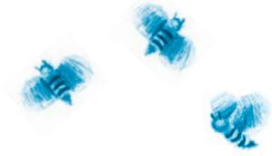
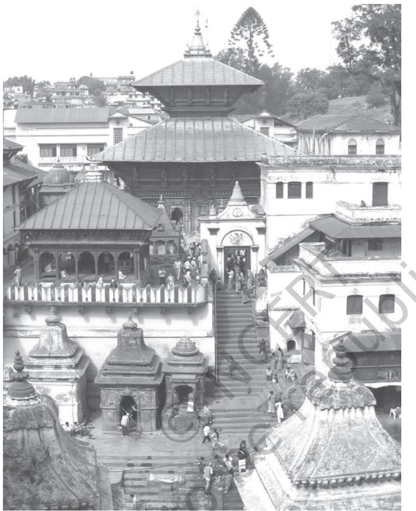
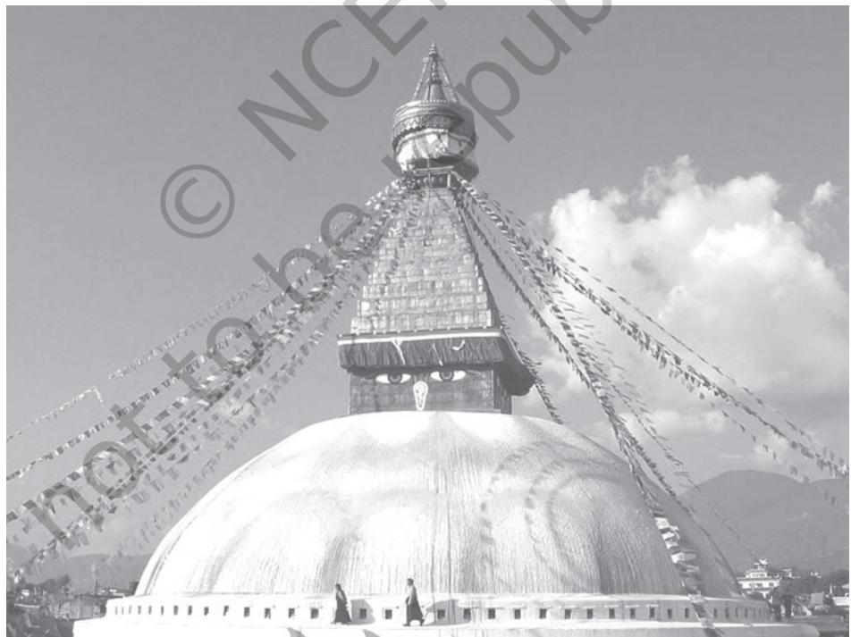
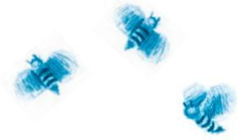
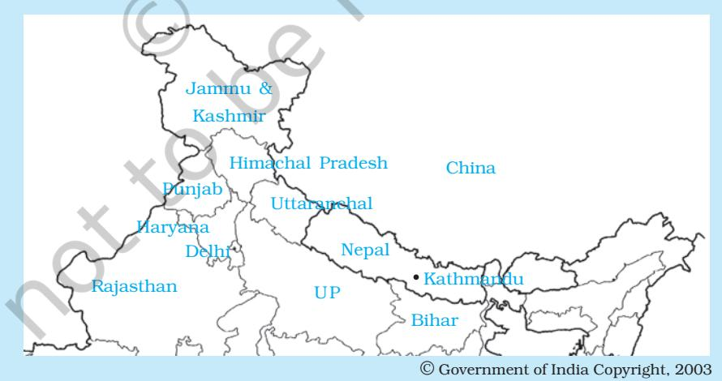
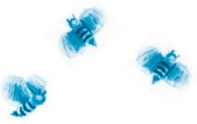
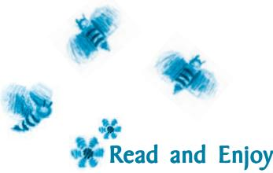

### BEFORE YOU READ

- Do you like travelling? The writer, Vikram Seth, enjoys it very much. In his book, Heaven Lake, he describes a long journey from China to India, via Tibet and Nepal.
- Have you heard of places like Ajmer Sharif, Madurai, Sanchi, Varanasi, Sarnath, or Halebid? Can you name some other places like these?
- What do the surroundings of a holy place in your city look like? Think about it as you read Vikram Seth's description of Kathmandu.
- 1. I GET a cheap room in the centre of town and sleep for hours. The next morning, with Mr Shah's son and nephew, I visit the two temples in Kathmandu that are most sacred to Hindus and Buddhists.
- 2. At Pashupatinath (outside which a sign proclaims 'Entrance for the Hindus only') there is an atmosphere of 'febrile confusion'. Priests, hawkers, devotees, tourists, cows, monkeys, pigeons and dogs roam through the grounds. We offer a few flowers. There are so many worshippers that some people trying to get the priest's attention are elbowed aside by others pushing their way to the front. A princess of the Nepalese royal house appears; everyone bows and makes way. By the main gate, a party of saffron-clad Westerners struggle for permission to enter. The policeman is not convinced that they are 'the Hindus' (only Hindus are allowed to enter the temple). A fight breaks out between two monkeys. One chases the other, who jumps onto a shivalinga, then runs screaming around the temples and down to the river, the holy Bagmati,

98 / Beehive

proclaim: make known publicly or officially

febrile confusion: hurried activity; complete chaos

Pashupatinath Temple, Kathmandu

that flows below. A corpse is being cremated on its banks; washerwomen are at their work and children bathe. From a balcony a basket of flowers and leaves, old offerings now wilted, is dropped into the river. A small shrine half protrudes from the stone platform on the river bank. When it emerges fully, the goddess inside will escape, and the evil period of the Kaliyug will end on earth.

shrine: a place of worship

3. At the Baudhnath stupa, the Buddhist shrine of Kathmandu, there is, in contrast, a sense of stillness. Its immense white dome is ringed by a road. Small shops stand on its outer edge: many of these are owned by Tibetan immigrants; felt bags, Tibetan prints and silver jewellery can be bought here. There are no crowds: this is a haven of quietness in the busy streets around.

- 4. Kathmandu is vivid, mercenary, religious, with small shrines to flower-adorned deities along the narrowest and busiest streets; with fruit sellers, flute sellers, hawkers of postcards; shops selling Western cosmetics, film rolls and chocolate; or copper utensils and Nepalese antiques. Film songs blare out from the radios, car horns sound, bicycle bells ring, stray cows low questioningly at motorcycles, vendors shout out their wares. I indulge

The Baudhnath Stupa, Kathmandu

myself mindlessly: buy a bar of marzipan, a cornon-the-cob roasted in a charcoal brazier on the pavement (rubbed with salt, chilli powder and lemon); a couple of love story comics, and even a Reader's Digest. All this I wash down with Coca Cola and a nauseating orange drink, and feel much the better for it.

- 5. I consider what route I should take back home. If I were propelled by enthusiasm for travel per se, I would go by bus and train to Patna, then sail up the Ganges past Benaras to Allahabad, then up the Yamuna, past Agra to Delhi. But I am too exhausted and homesick; today is the last day of August. Go home, I tell myself: move directly towards home. I enter a Nepal Airlines office and buy a ticket for tomorrow's flight.
- 6. I look at the flute seller standing in a corner of the square near the hotel. In his hand is a pole with an attachment at the top from which fifty or sixty bansuris protrude in all directions, like the quills of a porcupine. They are of bamboo: there are crossflutes and recorders. From time to time he stands the pole on the ground, selects a flute and plays for a few minutes. The sound rises clearly above the noise of the traffic and the hawkers' cries. He plays slowly, meditatively, without excessive display. He does not shout out his wares. Occasionally he makes a sale, but in a curiously offhanded way as if this were incidental to his enterprise. Sometimes he breaks off playing to talk to the fruit seller. I imagine that this has been the pattern of his life for years.
- 7. I find it difficult to tear myself away from the square. Flute music always does this to me: it is at once the most universal and most particular of sounds. There is no culture that does not have its flute the reed neh, the recorder, the Japanese shakuhachi, the deep bansuri of Hindustani classical music, the clear or breathy flutes of South America,

marzipan: a sweet made with grated almond brazier: open stove

nauseating: sickening

per-se: by itself

meditatively: thoughtfully

offhanded: casual; not showing much interest in something

Kathmandu / 101

the high-pitched Chinese flutes. Each has its specific fingering and compass. It weaves its own associations. Yet to hear any flute is, it seems to me, to be drawn into the commonality of all mankind, to be moved by music closest in its phrases and sentences to the human voice. Its motive force too is living breath: it too needs to pause and breathe before it can go on.

- 8. That I can be so affected by a few familiar phrases on the bansuri, surprises me at first, for on the previous occasions that I have returned home after a long absence abroad, I have hardly noticed such details, and certainly have not invested them with the significance I now do.
fingering: way of placing the fingers to play different notes compass: here, range

VIKRAM SETH [an extract from Heaven Lake]

Activity

- 1. On the following map mark out the route, which the author thought of but did not take, to Delhi.

- 2. Find out the possible routes (by rail, road or air) from Kathmandu to New Delhi/Mumbai/Kolkata/Chennai.

- I. Answer these questions in one or two words or in short phrases.
	- 1. Name the two temples the author visited in Kathmandu.
	- 2. The writer says, "All this I wash down with Coca Cola." What does 'all this' refer to?
	- 3. What does Vikram Seth compare to the quills of a porcupine?
	- 4. Name five kinds of flutes.

II. Answer each question in a short paragraph.

- 1. What difference does the author note between the flute seller and the other hawkers?
- 2. What is the belief at Pashupatinath about the end of Kaliyug?
- 3. The author has drawn powerful images and pictures. Pick out three examples each of
	- (i) the atmosphere of 'febrile confusion' outside the temple of Pashupatinath (for example: some people trying to get the priest's attention are elbowed aside...)
	- (ii) the things he sees
	- (iii) the sounds he hears

III. Answer the following questions in not more than 100–150 words each.

- 1. Compare and contrast the atmosphere in and around the Baudhnath shrine with the Pashupatinath temple.
- 2. How does the author describe Kathmandu's busiest streets?
- 3. "To hear any flute is to be drawn into the commonality of all mankind." Why does the author say this?

# Thinking about Language

- I. Read the following sentences carefully to understand the meaning of the italicised phrases. Then match the phrasal verbs in Column A with their meanings in Column B.
	- 1. A communal war broke out when the princess was abducted by the neighbouring prince.
	- 2. The cockpit broke off from the plane during the plane crash.
	- 3. The car broke down on the way and we were left stranded in the jungle.
	- 4. The dacoit broke away from the police as they took him to court.
	- 5. The brothers broke up after the death of the father.
	- 6. The thief broke into our house when we were away.

|  | A | B |
| --- | --- | --- |
| (i) | break out | (a) to come apart due to force |
| (ii) | break off | (b) end a relationship |
| (iii) | break down | (c) break and enter illegally; unlawful trespassing |
| (iv) | break away (from someone) | (d) of start suddenly, (usually a fight, a war or a disease) |
| (v) | break up | (e) to escape from someone's grip |
| (vi) | break into | (f) stop working |

- II . 1. Use the suffixes -ion or -tion to form nouns from the following verbs. Make the necessary changes in the spellings of the words.
Example: proclaim – proclamation

| cremate | act | exhaust |
| --- | --- | --- |
| invent | tempt | immigrate |
| direct | meditate | imagine |
| dislocate | associate | dedicate |

- 2. Now fill in the blanks with suitable words from the ones that you have formed.
	- (i) Mass literacy was possible only after the of the printing machine.
	- (ii) Ramesh is unable to tackle the situation as he lacks .
	- (iii) I could not resist the to open the letter.
	- (iv) Hardwork and are the main keys to success.
	- (v) The children were almost fainting with after being made to stand in the sun.

### III. Punctuation

Use capital letters, full stops, question marks, commas and inverted commas wherever necessary in the following paragraph.

an arrogant lion was wandering through the jungle one day he asked the tiger who is stronger than you you O lion replied the tiger who is more fierce than a leopard asked the lion you sir replied the leopard he marched upto an elephant and asked the same question the elephant picked him up in his trunk swung him in the air and threw him down look said the lion there is no need to get mad just because you don't know the answer

#### IV. Simple Present Tense

Study these sentences from the lesson.

- A fight breaks out between two monkeys.
- Film songs blare out from the radios.
- I wash it down with Coca-Cola.

The italicised verbs are in the simple present tense. The writer is here describing what he saw and heard but he uses the present tense instead of the past tense. A narration or a story can be made more dramatic or immediate by using the present tense in this way.

Now look at the following sentences.

- A small shrine half protrudes from the stone platform on the riverbank.
- Small shops stand on the outer edge of the Stupa.

We use the simple present tense to speak about what is usually or generally true. The sentences above describe facts. We also use the simple present tense in sentences depicting 'universal truths'. For example:

- The sun rises in the east.
- The earth revolves round the sun.

We can also refer to habitual actions using the simple present tense.

- He usually takes a train instead of a bus to work.
- We often get fine drizzles in winter.

In these sentences words like everyday, often, seldom, never, every month, generally, usually, etc. may be used.

- 1. Fill in the blanks with the correct form of the verb in brackets.
	- (i) The heart is a pump that (send) the blood circulating through our body. The pumping action (take place) when the left ventricle of the heart (contract). This (force) the blood out into the arteries, which (expand) to receive the oncoming blood.
	- (ii) The African lungfish can live without water for up to four years. During a drought it (dig) a pit and (enclose) itself in a capsule of slime and earth, leaving a tiny opening for air. The capsule (dry) and (harden), but when rain (come), the mud (dissolve) and the lungfish (swim) away.
	- (iii) MAHESH : We have to organise a class party for our teacher. (Do) anyone play an instrument?

Kathmandu / 105

|
|  |

- MAHESH : (Do) he also act?
- VIPUL : No, he (compose) music.
- MAHESH : That's wonderful!

- 1. Discuss in class the shrines you have visited or know about. Speak about one of them.
- 2. Imagine you are giving an eyewitness account or a running commentary of one of the following:
	- (i) a game of football, cricket or hockey, or some sports event
	- (ii) a parade (e.g. Republic Day) or some other national event

Speak a few sentences narrating what you see and hear. Use the simple present and the present continuous tenses. For example:

- He passes the ball but Ben gets in the way ...
- These brave soldiers guard our frontiers. They display their skills here ...

Diary entry for a travelogue

- I. The text you read is a travelogue where the author, Vikram Seth, talks about his visit to two sacred places in Kathmandu.
Imagine that you were with Vikram Seth on his visit to Pashupatinath temple, and you were noting down all that you saw and did there, so that you could write a travelogue later.

Record in point form

- what you see when you reach the Pashupatinath temple
- what you see happening inside the temple
- what you do when inside the temple
- what you see outside the temple
- what your impressions are about the place.
- II. Here is your diary entry when you visited Agra. Read the points and try to write a travelogue describing your visit to Agra and the Taj Mahal. You may add more details.

January 2003 — rise before dawn — take the Shatabdi Express at 6.15 a.m. from Delhi — meet a newly-married couple on train — talk about Himachal Pradesh — get off the train — enter the once-grand city, Agra — twisted alleys — traffic dense — rickshaws, cars, people — vendors selling religious artifacts, plastic toys, spices and sweets — go to the Taj Mahal — constructed entirely of white marble — magical quality — colour changes with varying of light and shadow — marble with gemstones inside — reflection of the Taj Mahal in the pond — school-children, tourists — tourist guides following people.

This poem is about the death of a loved one. How does the poet feel when he thinks about her death? How does he imagine her to be, after death?

> A slumber did my spirit seal— I had no human fears. She seemed a thing that could not feel The touch of earthly years. No motion has she now, no force— She neither hears nor sees, Rolled round in earth's diurnal course With rocks and stones and trees.

> > WILLIAM WORDSWORTH

#### GLOSSARY

diurnal: daily ("Earth's diurnal course" is earth's daily rotation on its axis.)

## Thinking about the Poem

- 1. "A slumber did my spirit seal," says the poet. That is, a deep sleep 'closed off' his soul (or mind). How does the poet react to his loved one's death? Does he feel bitter grief ? Or does he feel a great peace?
- 2. The passing of time will no longer affect her, says the poet. Which lines of the poem say this?
- 3. How does the poet imagine her to be, after death? Does he think of her as a person living in a very happy state (a 'heaven')? Or does he see her now as a part of nature? In which lines of the poem do you find your answer?

Kathmandu / 107

# Fear No More

Fear no more the heat o' the sun, Nor the furious winter's rages; Thou thy worldly task hast done, Home art gone, and ta'en thy wages: Golden lads and girls all must, As chimney-sweepers, come to dust.

Fear no more the frown o' the great, Thou art past the tyrant's stroke; Care no more to clothe and eat; To thee the reed is as the oak: The sceptre, learning, physic, must All follow this, and come to dust.

Fear no more the lightning-flash, Nor the all-dreaded thunder-stone; Fear not slander, censure rash; Thou hast finished joy and moan: All lovers young, all lovers must Consign to thee, and come to dust.

WILLIAM SHAKESPEARE

Theresa Kane says that she likes this poem ... because it is so exhilarating. It sweeps me along in the splendid, stormy words, then there is the quiet, peaceful lagoon of the last two lines of each verse. It is a wonderful poem, as hard, proud and fierce as a rock in a storm.

> [from I Like This Poem, ed. Kaye Webb, 1979, (International Year of the Child), Puffin Books, p. 154, 14-year-olds]

