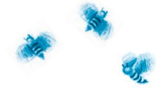
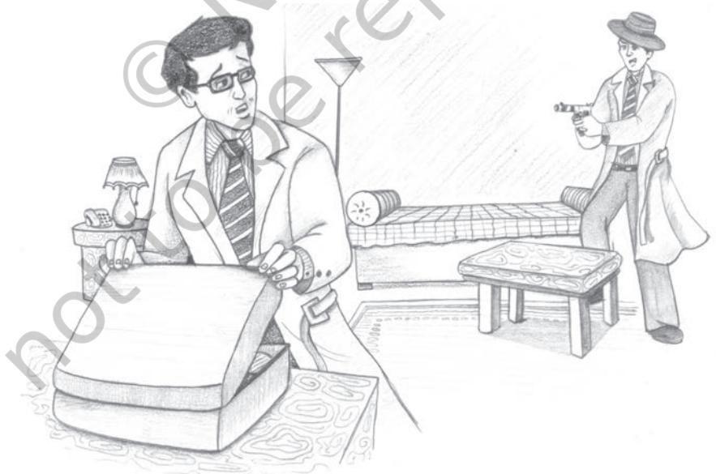
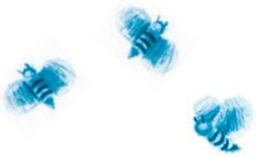
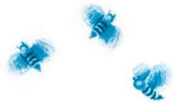
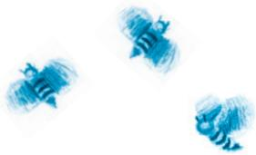

If I Were You / 109

9. If I W 9. If I W9. If I Were You

## BEFORE YOU READ

- Gerrard lives alone in a lonely cottage. An intruder, who is a criminal, enters his cottage. He intends to murder Gerrard and take on his identity. Does he succeed?
- The following words and phrases occur in the play. Do you know their meanings? Match them with the meanings given, to find out.

| cultured | an informal expression for a fashionable vehicle |
| --- | --- |
| count on | unnecessary and usually harmful |
| engaged | exaggerated |
| melodramatic | sophisticated; well mannered |
| to be smart | here, a tone of voice |
| inflection | avoid |
| wise guy | an unexpected opportunity for success |
| a dandy bus | trap |
| tradespeople | a Christian religious teacher who teaches on Sundays in Church |
| gratuitous | (American English) a person who pretends to know a lot |
| dodge | depend on; rely on |
| lucky break | (American English) an informal way of saying that one is being too clever |
| Sunday-school teacher | occupied; busy |
| frame | merchants |

SCENE: A small cottage interior. There is an entrance back right (which may be curtained). Another door to the left must be a practical door. The furniture is simple, consisting of a small table towards the left, a chair or two, and a divan rather upstage on the right. On the table is a telephone. (When the curtain rises Gerrard is standing by the table making a phone call. He is of medium height, and wearing horn-rimmed glasses ... He is dressed in a lounge suit and a great coat. His voice is cultured.)

GERRARD : ... Well, tell him to phone up directly. I must know ... Yes, I expect I'll still be here, but you mustn't count on that ... In about ten minutes' time. Right-ho. Goodbye.

(He puts down the phone and goes to the divan on the left, where there is a travelling bag, and starts packing. Whilst he is thus engaged, another man, similar in build to Gerrard enters from the right silently — revolver in hand. He is flashily dressed in an overcoat and a soft hat. He bumps accidentally against the table, and at the sound Gerrard turns quickly.)

- GERRARD : (pleasantly) Why, this is a surprise, Mr— er —
- INTRUDER : I'm glad you're pleased to see me. I don't think you'll be pleased for long. Put those paws up!
- GERRARD : This is all very melodramatic, not very original, perhaps, but…
- INTRUDER : Trying to be calm and er—
- GERRARD : 'Nonchalant' is your word, I think.
- INTRUDER : Thanks a lot. You'll soon stop being smart. I'll make you crawl. I want to know a few things, see.

You'll soon stop being smart. I'll make you crawl.

| GERRARD | : | Anything you like. I know all the answers. But before we |
| --- | --- | --- |
|  |  | begin I should like to change my position; you may be |
|  |  | comfortable, but I am not. |
| INTRUDER | : | Sit down there, and no funny business. (Motions to a |
|  |  | chair, and seats himself on the divan by the bag.) Now |
|  |  | then, we'll have a nice little talk about yourself! |
| GERRARD | : | At last a sympathetic audience! I'll tell you the story of |
|  |  | my life. How as a child I was stolen by the gypsies, and |
|  |  | why at the age of thirty-two, I find myself in my lonely |
|  |  | Essex cottage, how ... |
| INTRUDER | : | Keep it to yourself, and just answer my questions. You |
|  |  | live here alone? Well, do you? |
| GERRARD | : | I'm sorry. I thought you were telling me, not asking me. |
|  |  | A question of inflection; your voice is unfamiliar. |
| INTRUDER | : | (with emphasis) Do you live here alone? |
| GERRARD | : | And if I don't answer? |
| INTRUDER | : | You've got enough sense not to want to get hurt. |
| GERRARD | : | I think good sense is shown more in the ability to avoid |
|  |  | pain than in the mere desire to do so. What do you think, |
|  |  | Mr— er— |
| INTRUDER | : | Never mind my name. I like yours better, Mr Gerrard. |
|  |  | What are your Christian names? |
| GERRARD | : | Vincent Charles. |
| INTRUDER | : | Do you run a car? |
| GERRARD | : | No. |
| INTRUDER | : | That's a lie. You're not dealing with a fool. I'm as smart |
|  |  | as you and smarter, and I know you run a car. Better be |
|  |  | careful, wise guy! |
| GERRARD | : | Are you American, or is that merely a clever imitation? |
| INTRUDER | : | Listen, this gun's no toy. I can hurt you without killing |
|  |  | you, and still get my answers. |
| GERRARD | : | Of course, if you put it like that, I'll be glad to assist you. |
|  |  | I do possess a car, and it's in the garage round the corner. |
| INTRUDER | : | That's better. Do people often come out here? |
| GERRARD | : | Very rarely. Surprisingly few people take the trouble to |
|  |  | visit me. There's the baker and the greengrocer, of course; |
|  |  | and then there's the milkman — quite charming, but no |
|  |  | one so interesting as yourself. |
| INTRUDER | : | I happen to know that you never see tradespeople. |

If I Were You / 111

| GERRARD | : | You seem to have taken a considerable amount of trouble. |
| --- | --- | --- |
|  |  | Since you know so much about me, won't you say |
|  |  | something about yourself? You have been so modest. |
| INTRUDER | : | I could tell you plenty. You think you're smart, but I'm |
|  |  | the top of the class round here. I've got brains and I use |
|  |  | them. That's how I've got where I have. |
| GERRARD | : | And where precisely have you got? It didn't require a |
|  |  | great brain to break into my little cottage. |
| INTRUDER | : | When you know why I've broken into your little cottage, |
|  |  | you'll be surprised, and it won't be a pleasant surprise. |
| GERRARD | : | With you figuring so largely in it, that is understandable. |
|  |  | By the way, what particular line of crime do you embrace, |
|  |  | or aren't you a specialist? |
| INTRUDER | : | My speciality's jewel robbery. Your car will do me a treat. |
|  |  | It's certainly a dandy bus. |
| GERRARD | : | I'm afraid jewels are few and far between in the wilds of |
|  |  | Essex. |
| INTRUDER | : | So are the cops. I can retire here nicely for a little while. |
| GERRARD | : | You mean to live with me? A trifle sudden isn't it; you've |
|  |  | not been invited. |
| INTRUDER | : | You won't be here long; so I didn't trouble to ask. |
| GERRARD | : | What do you mean? |
| INTRUDER | : | This is your big surprise. I'm going to kill you. |
| GERRARD | : | A little harsh, isn't it? |
| INTRUDER | : | (with heavy sarcasm) Yeah, I'll be sorry to do it. I've taken |
|  |  | a fancy to you, but it's just got to be done. |
| GERRARD | : | Why add murder to your other crimes? It's a grave step |
|  |  | you're taking. |
| INTRUDER | : | I'm not taking it for fun. I've been hunted long enough. |
|  |  | I'm wanted for murder already, and they can't hang me |
|  |  | twice. |
| GERRARD | : | You're planning a gratuitous double, so to speak. Admitted |
|  |  | you've nothing to lose, but what have you to gain? |
| INTRUDER | : | I've got freedom to gain. As for myself, I'm a poor hunted |
|  |  | rat. As Vincent Charles Gerrard I'm free to go places and |
|  |  | do nothing. I can eat well and sleep and without having |
|  |  | to be ready to beat it at the sight of a cop. |
| GERRARD | : | In most melodramas the villain is foolish enough to delay |
|  |  | his killing long enough to be frustrated. You are much |
|  |  | luckier. |

112 / Beehive

| INTRUDER | : | I'm O.K. I've got a reason for everything. I'm going to be |
| --- | --- | --- |
|  |  | Vincent Charles Gerrard, see. I've got to know what he |
|  |  | talks like. Now I know. That posh stuff comes easy. This |
|  |  | is Mr V.C. Gerrard speaking. (Pantomime of phoning, in |
|  |  | imitation cultured voice.) And that's not all. (He stands |
|  |  | up.) Get up a minute (Gerrard stands.) Now take a look at |
|  |  | me. |
| GERRARD | : | You're not particularly decorative. |
| INTRUDER | : | No! Well, that goes for you, too. I've only got to wear |
|  |  | specs and I'll be enough like you to get away with it. |
| GERRARD | : | What about your clothes? They'll let you down if you're |
|  |  | not careful. |
| INTRUDER | : | That'll be all right. Yours will fit me fine. |
| GERRARD | : | That is extremely interesting, but you seem to miss the |
|  |  | point of my remark. I said, you were luckier than most |
|  |  | melodramatic villains. It was not a tribute to your |
|  |  | intelligence. You won't kill me for a very good reason. |
| INTRUDER | : | So that's what you think. |
| GERRARD | : | You'll let me go, and thank God you didn't shoot sooner. |
| INTRUDER | : | Come on. What's on your mind! Better be quick. This |
|  |  | conversation bores me. |
| GERRARD | : | Your idea is to elude the police by killing me and taking |
|  |  | on my identity? |
| INTRUDER | : | Yes, I like the idea. |
| GERRARD | : | But are you sure it's going to help you? |
| INTRUDER | : | Now listen here. I've got this all planned. I did a job in |
|  |  | town. Things went wrong and I killed a cop. Since then |
|  |  | I've done nothing but dodge. |
| GERRARD | : | And this is where dodging has brought you? |
| INTRUDER | : | It brought me to Aylesbury. That's where I saw you in the |
|  |  | car. Two other people saw you and started to talk. I |
|  |  | listened. It looks like you're a bit queer — kind of a mystery |
|  |  | man. |
| GERRARD | : | A mystery which I propose to explain. |
| INTRUDER | : | (disregarding him) You phone your orders and sometimes |
|  |  | you go away suddenly and come back just the same. |
|  |  | Those are just the things I want to do. Hearing about you |
|  |  | was one of my luckiest breaks. |
| GERRARD | : | Apparently you haven't the intelligence to ask why I am |
|  |  | invested in this cloak of mystery. |

If I Were You / 113

INTRUDER : (preparing to shoot) As I said before, this conversation bores me.

GERRARD : Don't be a fool. If you shoot, you'll hang for sure. If not as yourself, then as Vincent Charles Gerrard.

INTRUDER : What is this?

GERRARD : This is your big surprise. I said you wouldn't kill me and I was right. Why do you think I am here today and gone tomorrow, never see tradespeople? You say my habits would suit you. You are a crook. Do you think I am a Sunday-school teacher?

> The game's up as far as I'm concerned. Things went wrong with me. I said it with bullets and got away. Unfortunately they got one of my men, and found things the fool should have burnt. Tonight I'm expecting trouble. My bag's packed ready to clear off. There it is.

|  |  | this is a gun all right. |
| --- | --- | --- |
| INTRUDER | : | It's a bag all right and What's all this? |

GERRARD : That's a disguise outfit; false moustaches and what not. Now do you believe me?

INTRUDER : (musingly) I don't know.

GERRARD : For God's sake clear that muddled head of yours and let's go. Come with me in the car. I can use you. If you find it's a frame, you've got me in the car, and you've still got your gun.

INTRUDER : May be you're right.

GERRARD : Then don't waste time. (Goes and picks up hat and bag.)

INTRUDER : Careful, boss, I'm watching you.

GERRARD : I have got a man posted on the main road. He'll ring up if he sees the

Gerrard gives him a push into the cupboard ...

114 / Beehive

police, but I don't want to leave ... (telephone bell rings) Come on! They're after us. Through here straight to the garage.

INTRUDER : How do I know that you are telling the truth?

- GERRARD : Oh, don't be a fool. Look for yourself. (Gerrard opens door and steps away. Intruder leans forward to inspect it, with his side towards Gerrard, but with the revolver ready. As he turns his head, Gerrard gives him a push into the cupboard, knocking the revolver out of his hand. He slams the door and locks it, picks up the revolver and goes to the phone, where he stands with the gun pointed at the cupboard door.)
- INTRUDER : (rattles door and shouts) Let me out of here!
- GERRARD : Hello. Yes, speaking. Sorry I can't let you have the props in time for rehearsal, I've had a spot of bother — quite amusing. I think I'll put it in my next play. Listen, can you tell our friend the Sergeant to come up here at once? You'll probably find him in the Public Bar.

DOUGLAS JAMES

- I. Answer these questions.
	- 1. "At last a sympathetic audience."
		- (i) Who says this?
		- (ii) Why does he say it?
		- (iii) Is he sarcastic or serious?
	- 2. Why does the intruder choose Gerrard as the man whose identity he wants to take on?
	- 3. "I said it with bullets."
		- (i) Who says this?
		- (ii) What does it mean?
		- (iii) Is it the truth? What is the speaker's reason for saying this?
	- 4. What is Gerrard's profession? Quote the parts of the play that support your answer.
	- 5. "You'll soon stop being smart." (i) Who says this?
- (ii) Why does the speaker say it?
- (iii) What according to the speaker will stop Gerrard from being smart?
- 6. "They can't hang me twice."
	- (i) Who says this?
	- (ii) Why does the speaker say it?
- 7. "A mystery I propose to explain." What is the mystery the speaker proposes to explain?
- 8. "This is your big surprise."
	- (i) Where has this been said in the play?
	- (ii) What is the surprise?

## Thinking about Language

- I. Consult your dictionary and choose the correct word from the pairs given in brackets.
	- 1. The (site, cite) of the accident was (ghastly/ghostly).
	- 2. Our college (principle/principal) is very strict.
	- 3. I studied (continuously/continually) for eight hours.
	- 4. The fog had an adverse (affect/effect) on the traffic.
	- 5. Cezanne, the famous French painter, was a brilliant (artist/artiste).
	- 6. The book that you gave me yesterday is an extraordinary (collage/college) of science fiction and mystery.
	- 7. Our school will (host/hoist) an exhibition on cruelty to animals and wildlife conservation.
	- 8. Screw the lid tightly onto the top of the bottle and (shake/shape) well before using the contents.
- II. Irony is when we say one thing but mean another, usually the opposite of what we say. When someone makes a mistake and you say, "Oh! that was clever!", that is irony. You're saying 'clever' to mean 'not clever'.
	- Expressions we often use in an ironic fashion are:
	- Oh, wasn't that clever!/Oh that was clever!
	- You have been a great help, I must say!
	- You've got yourself into a lovely mess, haven't you?
	- Oh, very funny!/ How funny!

We use a slightly different tone of voice when we use these words ironically.

Read the play carefully and find the words and expressions Gerrard uses in an ironic way. Then say what these expressions really mean. Two examples have

been given below. Write down three more such expressions along with what they really mean.

| What the author says | What he means |
| --- | --- |
| Why, this is a surprise, Mr —er— | He pretends that the intruder is a |
|  | social visitor whom he is welcoming. |
|  | In this way he hides his fear. |
| At last a sympathetic audience! | He pretends that the intruder wants |
|  | to listen to him, whereas actually |
|  | the intruder wants to find out |
|  | information for his own use. |

## Dictionary Use

A word can mean different things in different contexts. Look at these three sentences:

- The students are taught to respect different cultures.
- The school is organising a cultural show.
- His voice is cultured.

In the first sentence, 'culture' (noun) means way of life; in the second, 'cultural' (adjective) means connected with art, literature and music; and in the third, 'cultured' (verb) means sophisticated, well mannered. Usually a dictionary helps you identify the right meaning by giving you signposts.

Look at the dictionary entry on 'culture' from Oxford Advanced Learner's Dictionary, 2005.

| Cul·tural 0 = /ˈkʌltʃərəl/ adj. [usually before noun] |
| --- |
| 1 connected with the culture of a particular society or |
| group, its customs, beliefs, etc .: cultural differences be- |
| tween the two communities o economic, social and cultural |
| factors 2 connected with art, literature, music, etc .: a |
| cultural event o Europe's cultural heritage > The orchestra |
| is very important for the cultural life of the city. ▶ cul·tur- |
| al·ly / rəli/ adv. |

- 
- 
- 
- 
- 
- 
- 
- 
- 

(Noun, verb, adjective, adverb, synonyms, etc. are signposts which help you locate the right meaning and usage, and give information about the part of speech that the word is.)

Look up the dictionary entries for the words sympathy, familiarity, comfort, care, and surprise. Use the information given in the dictionary and complete the table.

| Noun | Adjective | Adverb | Verb | Meaning |
| --- | --- | --- | --- | --- |
| sympathy |  |  |  |  |
| familiarity |  |  |  |  |
| comfort |  |  |  |  |
| care |  |  |  |  |
| surprise |  |  |  |  |

- 1. Imagine you are Gerrard. Tell your friend what happened when the Intruder broke into your house.
[Clues : Describe (i) the intruder — his appearance, the way he spoke, his plan, his movements, etc., (ii) how you outwitted him.]

- 2. Enact the play in the class. Pay special attention to words given in italics before a dialogue. These words will tell you whether the dialogue has to be said in a happy, sarcastic or ironic tone and how the characters move and what they do as they speak. Read these carefully before you enact the play.

I. Which of the words below describe Gerrard and which describe the Intruder?

| smart | humorous | clever |
| --- | --- | --- |
| beautiful | cool | confident |
| flashy | witty | nonchalant |

Write a paragraph each about Gerrard and the Intruder to show what qualities they have. (You can use some of the words given above.)

- II. Convert the play into a story (150 –200 words). Your story should be as exciting and as witty as the play. Provide a suitable title to it.

