## Chapter 1

*Introduction to Maps*

1

# Introduction to Maps

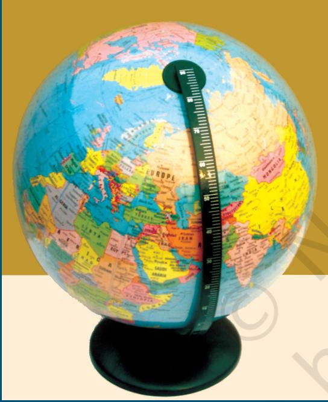

*Figure 1.1 India as it is seen on the globe*

You may be familiar with maps that you have seen in most of your books of social sciences representing the earth or any of its parts. You may also know that the shape of the earth is geoid (three-dimensional) and a globe can best represent it (Fig. 1.1). A map, on the other hand, is a simplified depiction of whole or part of the earth on a piece of paper. In other words, it is a two-dimensional form of the three-dimensional earth. Hence, a map can be drawn using a system of map projections (see

Chapter 4). As it is impossible to represent all features of the earth's surface in their true size and form, a map is drawn at a reduced scale. Imagine your school campus. If a plan/map of your school is to be drawn in its actual size, it will be as large as the campus itself. Hence, maps are drawn at a scale and projection so that each point on the paper corresponds to the actual ground position. Besides, the representation of different features is also simplified using symbols, colours and shades. A map is, therefore, defined as selective, symbolised and generalised representation of whole or a

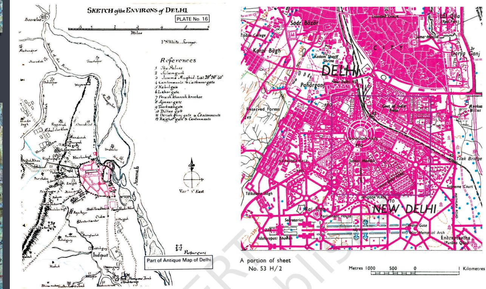

*Figure 1.2 Sketch of the Environs of Delhi (Left) and a Map of Delhi (Right)*

#### Glossary

2

*Cadastral Map :* A large-scale map drawn at a scale of 1 : 500 to 1 : 4000 to show property boundaries, designating each parcel of land with a number.

*Cardinal Points :* North (N), South (S), East (E) and West (W).

*Cartography :* Art, science and technology of making maps, charts, plans and other modes of graphical expression as well as their study and use.

*Generalisation-Map :* A simplified representation of the features on the map, appropriate to its scale or purpose, without affecting their visual form.

*Geoid :* An oblate spheroid whose shape resembles the actual shape of the Earth.

*Map :* A selective, symbolised and generalised representation of the whole or part of the earth at a reduced scale.

*Map series :* A group of maps produced at same scale, style and specifications for a country or a region.

*Projection-Map :* The system of the transformation of the spherical surface onto a plane surface.

*Scale :* The ratio between the distances of two points on the map, plan or photograph and the actual distance between the same two points on the ground.

*Sketch Map :* A simplified map drawn freehand which fails to preserve the true scale or orientation.

part of the earth's surface on a plane surface at a reduced scale. It may also be understood that a simple network of lines and polygons without a scale shall not be called a map. It is only referred to as "the sketch" (Fig. 1.2). In the present chapter, we will study the essential requirements of maps, their types and the uses.

#### ESSENTIALS OF MAP MAKING

In view of the variety of maps, we may find it difficult to summarise what they all have in common. Cartography, being an art and science of mapmaking, does include a series of processes that are common to all the maps. These processes that may also be referred to as essentials of maps are :

- ± Scale
- ± Map Projection
- ± Map Generalisation
- ± Map Design
- ± Map Construction and Production

*Scale:* We know that all maps are reductions. The first decision that a map-maker has to take is about the scale of the map. The choice of scale is of utmost importance. The scale of a map sets limits of information contents and the degree of reality with which it can be delineated on the map. For example, figure 1.3 provides a comparison between maps having different scales and the improvements made thereupon with the change in scale.

*Projection:* We also know that maps are a simplified representation of the three-dimensional surface of the earth on a plane sheet of paper. The transformation of all-side-curved-geoidal surface into a plane surface is another important aspect of the cartographic process. We should know that such a radical transformation introduces some unavoidable changes in directions, distances, areas and shapes from the way they appear on a geoid. A system of transformation of the spherical surface to the plane surface is called a map projection. Hence, the choice, utilisation and construction of projections is of prime importance in map-making.

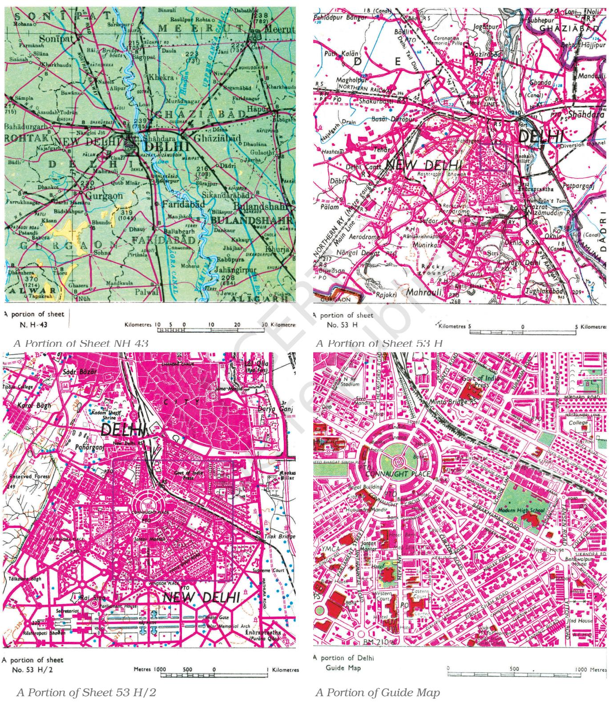

*Figure 1.3 Effect of Scale on Mapped Information*

*Generalisation:* Every map is drawn with a definite objective. For example, a general purpose map is drawn to show information of a general nature such as relief, drainage, vegetation, settlements, means of transportation, etc. Similarly, a special purpose map exhibits information pertaining to one or more selected themes like population density, soil types or location of industries. It is, therefore, necessary to carefully plan the map contents while the purpose of the map must be kept in the forefront. As maps are drawn at a reduced scale to serve a definite purpose, the third task of a cartographer is to generalise the map contents. In doing so, a cartographer must select the information (data) relevant to the selected theme and simplify it as per the needs.

*Map Design:* The fourth important task of a cartographer is the map design. It involves the planning of graphic characteristics of maps including the selection of appropriate symbols, their size and form, style of lettering, specifying the width of lines, selection of colours and shades, arrangement of various elements of map design within a map and design for map legend. The map design is, therefore, a complex aspect of mapmaking and requires thorough understanding of the principles that govern the effectiveness of graphic communication.

*Map Construction and Production:* The drawing of maps and their reproduction is the fifth major task in the cartographic process. In earlier times, much of the map construction and reproduction work used to be carried out manually. Maps were drawn with pen and ink and printed mechanically. However, the map construction and reproduction has been revolutionalised with the addition of computer assisted mapping and photo-printing techniques in the recent past.

### HISTORY OF MAP MAKING

The history of map making is as old as the history of mankind itself. The oldest map was found in Mesopotamia drawn on a clay tablet that belongs to 2,500 B.C. Figure 1.4 shows Ptolemy's Map of the World. Greek and the Arab geographers laid the foundation of modern cartography. The measurement of the circumference of the Earth and the use of the system of geographical coordinates in map-making are some of the significant contributions of the Greeks and the Arabs. The art and science of map

5

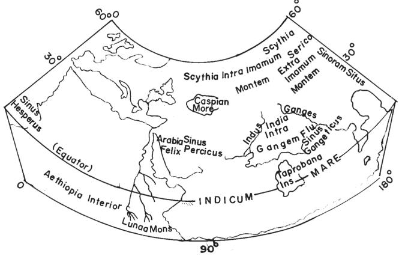

6

*Figure 1.4 Ptolemy's Map of the World*

making was revitalised in early modern period, with extensive efforts made to minimise the effects of the transformation of the geoid onto a plane surface. The maps were drawn on different projections to obtain true directions, correct distances and to measure area accurately. The aerial photography supplemented the ground method of survey and the uses of aerial photographs stimulated map-making in the nineteenth and twentieth centuries.

The foundation of map-making in India was laid during the Vedic period when the expressions of astronomical truths and cosmological revelations were made. The expressions were crystallised into 'sidhantas' or laws in classical treaties of Arya Bhatta, Varahamihira and Bhaskara, and others. Ancient Indian scholars divided the known world into seven 'dwipas' (Fig. 1.5). Mahabharata conceived a round world surrounded by water (Fig. 1.6).

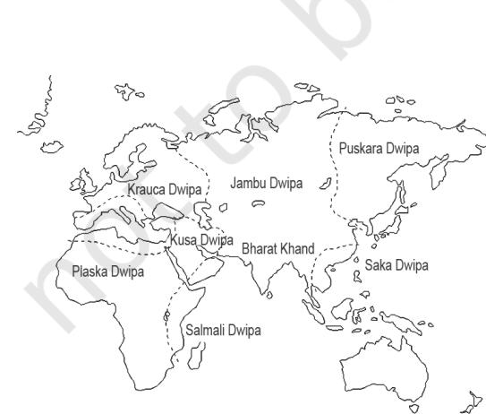

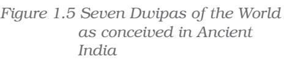

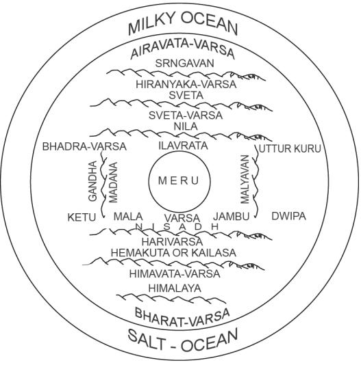

*Figure 1.6 Round World surrounded by water as conceived in Mahabharata*

Todarmal pioneered land surveying and map-making as an integral part of the revenue collection procedure. Besides, Sher Shah Suri's revenue maps further enriched the mapping techniques during the medieval period. The intensive topographical surveys for the preparation of up–to–date maps of the entire country, were taken up with the setting up of the Survey of India in 1767, which culminated with the map of Hindustan in 1785. Today, the Survey of India produces maps at different scales for the entire country.

*Types of Maps Based on Scale:* On the basis of scale, maps may be classified into large-scale and small-scale. Large scale maps are drawn to show small areas at a relatively large-scale. For example, the topographical maps drawn at a scale of 1: 250,000, 1:50,000 or 1:25,000 and the village maps, the zonal plans of the cities and house plans prepared on a scale of 1:4,000, 1:2,000 and 1:500 are large scale maps. On the other hand, small-scale maps are drawn to show large areas. For example, atlas maps, wall maps, etc.

(i) Large-scale Maps: Large-scale maps are further divided into the following types :

- (a) Cadastral maps
- (b) Topographical maps

*(a) Cadastral Maps :* The term 'cadastral' is derived from the French word 'cadastre' meaning 'register of territorial property'. These maps are drawn to show the ownership of landed property by demarcating field boundaries of agricultural land and the plan of individual houses in urban areas. The cadastral maps are prepared by the government agencies to realise revenue and taxes, along with keeping a record of ownership. These maps are drawn on a very large scale, such as the cadastral maps of villages at 1 : 4,000 scale and the city plans at a scale of 1 : 2,000 and larger.

*(b) Topographical Maps :* These maps are also prepared on a fairly large scale. The topographical maps are based on precise surveys and are prepared in the form of series of maps made by the national mapping agencies of almost all countries of the world (Chapter 5). For example, the Survey of India undertakes the topographical mapping of the entire country at 1 : 250,000, 1 : 50,000 and 1 : 25,000 scale (Fig. 1.3). These maps follow uniform colours and symbols to show topographic details such as relief, drainage, agricultural land, forest, settlements, means of

8

communication, location of schools, post offices and other services and facilities.

(ii) Small-scale Maps: Small-scale maps are further divided into the following types :

- (a) Wall Maps
- (b) Atlas Maps

*(a) Wall Maps :* These maps are generally drawn on large size paper or on plastic base for use in classrooms or lecture halls. The scale of wall maps is generally smaller than the scale of topographical maps but larger than atlas maps.

*(b) Atlas Maps :* Atlas maps are very small-scale maps. These maps represent fairly large areas and present highly generalised picture of the physical or cultural features. Even so, an atlas map serves as a graphic encyclopaedia of the geographical information about the world, continents, countries or regions. When consulted properly, these maps provide a wealth of generalised information regarding location, relief, drainage, climate, vegetation, distribution of cities and towns, population, location of industries, transport-network system, tourism and heritage sites, etc.

*Types of Maps Based on Function:* The maps may also be classified on the basis of their functions. For example, a political map serves the function of providing administrative divisions of a continent or a country and a soil map shows the distribution of different types of soils. Broadly, maps based on their functions may be classified into physical maps and cultural maps.

(i) Physical Maps: Physical maps show natural features such as relief, geology, soils, drainage, elements of weather, climate and vegetation, etc.

*(a) Relief Maps:* Relief maps show general topography of an area like mountains and valleys, plains, plateaus and drainage. Figure 1.7 shows the relief and slope map of Nagpur district.

*(b) Geological Maps:* These maps are drawn to show geological structures, rock types, etc. Figure 1.8 shows the distribution of rocks and minerals in Nagpur district.

*(c) Climatic Maps :* These maps depict climatic regions of an area. Besides, maps are also drawn to show the distribution of temperature,

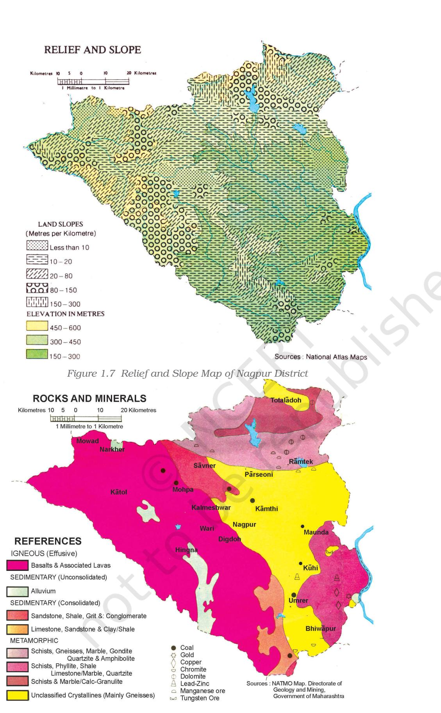

*Figure 1.8 Distribution of Rocks and Minerals in Nagpur District*

9

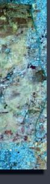

10

10

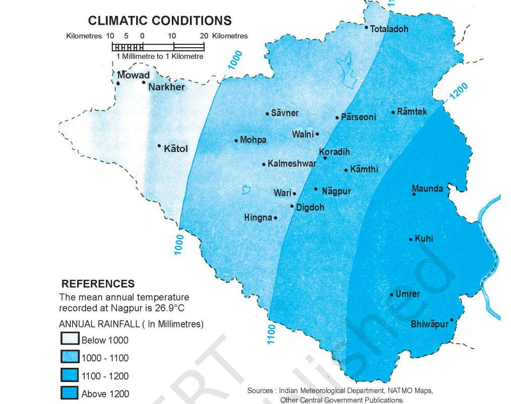

*Figure 1.9 Map showing Climatic Conditions of Nagpur District*

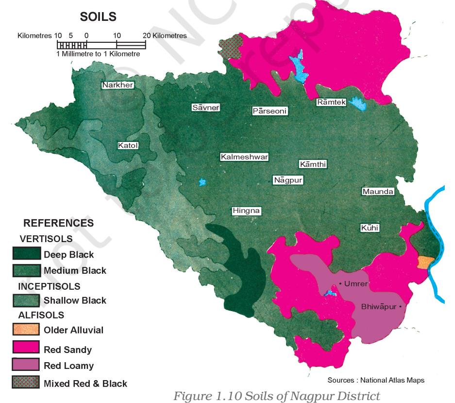

rainfall, cloudiness, relative humidity, direction and velocity of winds and other elements of weather (Fig 1.9).

*(d) Soil Maps :* Maps are also drawn to show the distribution of different types of soil(s) and their properties (Fig. 1.10).

(ii) Cultural Maps: Cultural maps show man-made features. These include a variety of maps showing population distribution and growth, sex and age, social and religious composition, literacy, levels of educational attainment, occupational structure, location of settlements, facilities and services, transportation lines and production, distribution and flow of different commodities.

*(a) Political Maps :* These maps show the administrative divisions of an area such as country, state or district. These maps facilitate the administrative machinery in planning and management of the concerned administrative unit.

*(b) Population Maps:* The population maps are drawn to show the distribution, density and growth of population, age and sex composition,

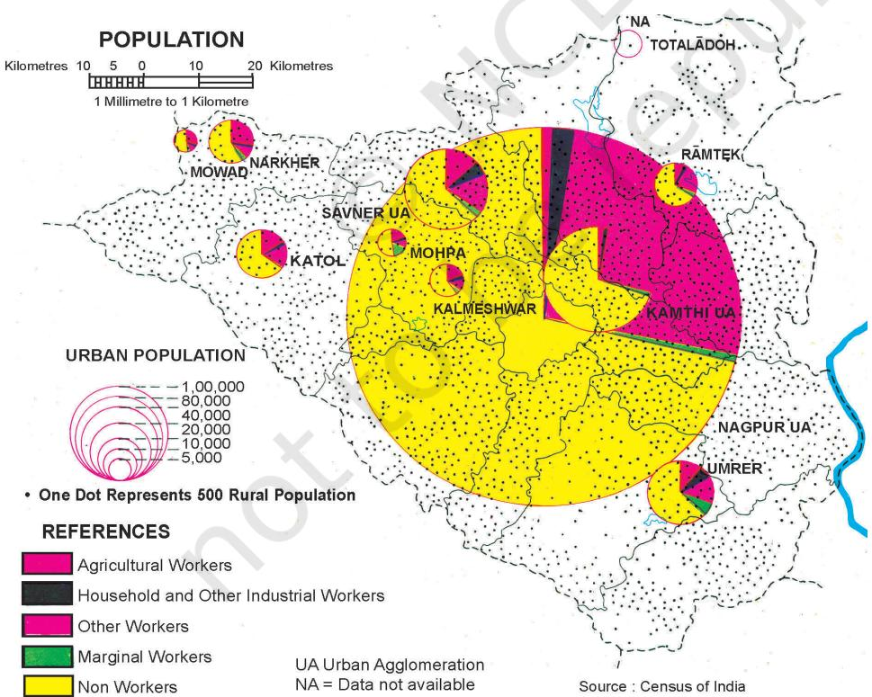

*Figure 1.11 Nagpur District : Distribution of Population*

11

11

distribution of religious, linguistic and social groups, occupational structure of the population, etc. (Fig 1.11 on previous page). Population maps serve the most significant role in the planning and development of an area.

*(c) Economic Maps:* Economic maps depict production and distribution of different types of crops and minerals, location of industries and markets, routes for trade and flow of commodities. Figures 1.12 and 1.13 show the land use and cropping patterns and the location of industries in Nagpur district respectively.

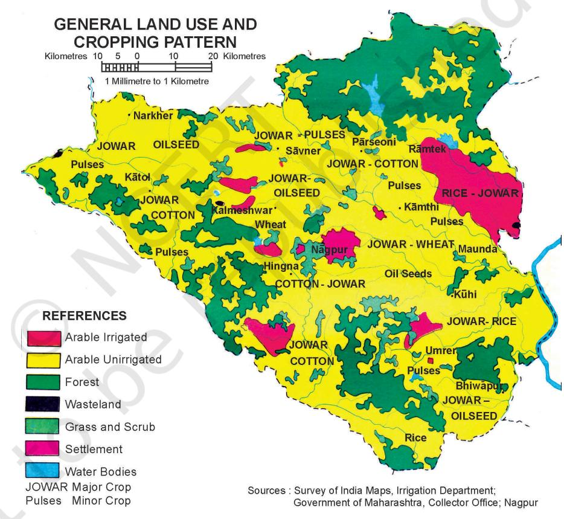

*Figure 1.12 Land use and Cropping Patterns in Nagpur District*

*(d) Transportation Maps:* These maps show roads, railway lines and the location of railway stations and airports.

2024-25

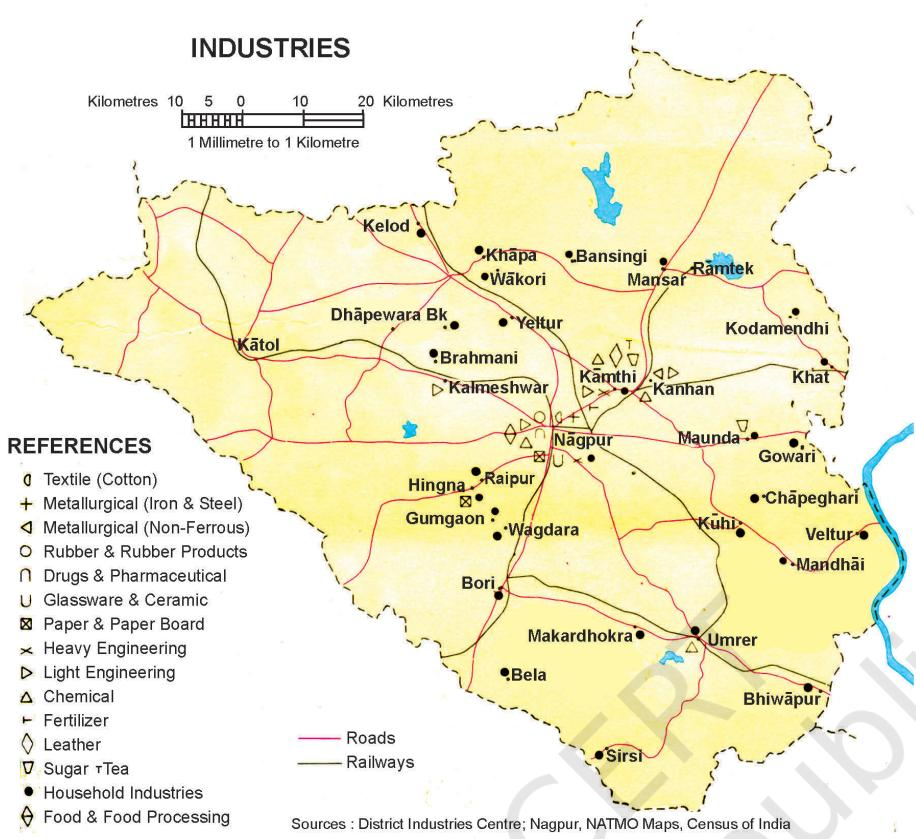

*Figure 1.13 Location of Industries in Nagpur District*

## USES OF MAPS

Geographers, planners and other resource scientists use maps. In doing so, they make various types of measurements to determine distances, directions and area.

*Measurement of Distance:* The linear features shown on the maps fall into two broad categories, i.e. straight lines and erratic or zigzag lines. The measurement of straight line features like roads, railway lines and canals is simple. It can be taken directly with a pair of dividers or a scale placed on the map surface. However, distances are required, more often, along erratic paths, i.e. the coastlines, rivers and streams. The distances along all such features can be measured by placing a thread at the starting point and carrying it along the line up to the end point. The thread is then stretched and measured to determine the distance. It can also be measured by using a simple instrument called *Rotameter*.

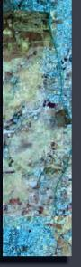

14

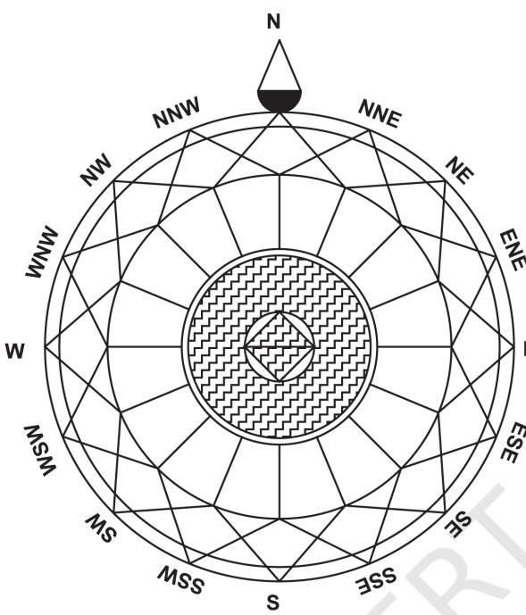

<i>Figure 1.14 Cardinal and Intermediate Directions

The wheel of the 'rotameter' is moved along the route to measure the distance.

*Measurement of Direction:* Direction is defined as an imaginary straight line on the map showing the angular position to a common base direction. The line pointing to the north is zero direction or the base direction line. A map always shows the north direction. All other directions are determined in to this relation. The north direction enables the mapuser to locate different features with respect to each other. The four commonly known directions are North, South, East and West. These are also called the cardinal points. In between the cardinal points, one may have several intermediate directions (Fig. 1.14).

*Measurement of Area:* The measurement of area of features like that of administrative and geographic units is also carried out over the surface of the map by map-users. There are different methods in which areas can be determined. One of the simplest but not very accurate method to determine the area is by means of regular pattern of squares. In this method, the area to be measured is covered by squares by placing a sheet of graph paper beneath the map on an illuminated tracing table or by tracing the area onto the square sheet. The total number of 'whole squares' are summed up, together with 'partial squares'. The area is then determined by a simple equation :

Area = Sum of whole squares + Sum of partial squares × Map Scale 2 ( )

The area can also be calculated by using a fixed area *polar planimeter* (Box 1.1).

#### Box 1.1 Measurement of Area using Polar Planimeter

The area calculation is also carried out using Polar Planimeter. In this instrument, a measure is made of the movement of a rod whose locus is constrained by having one end fixed to a radial arc. The area to be measured is traced along its perimeter in a clockwise direction with an index mark, starting from one convenient point to which the index of the tracing arm must exactly return.

Reading on the dial, before and after the tracing of area's perimeter, will give a value in instrumental units. These readings are multiplied by the same constant for the particular instrument to convert into areas in square inches or centimetres.

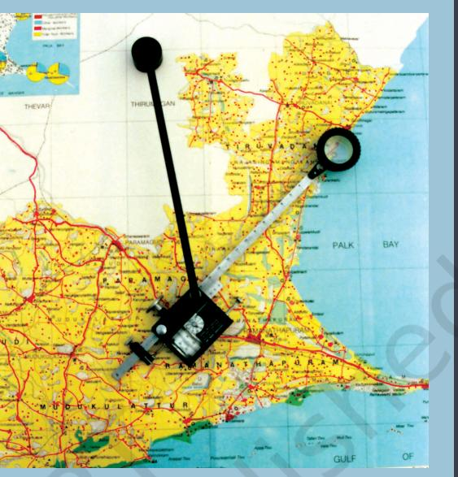

15

15

You may explore more on bhuvan.nrsc.gov.in

#### *EXERCISE*

- 1. Choose the right answer from the four alternatives given below:
	- i) Which one of the following is essential for the network of lines and polygons to be called a map ?
		- (a) Map Legend
		- (b) Symbols
		- (c) North Direction
		- (d) Map Scale
	- ii) A map bearing a scale of 1 : 4000 and larger is called :
		- (a) Cadastral map
		- (b) Topographical map
		- (c) Wall map
		- (d) Atlas map
	- iii) Which one of the following is NOT an essential element of maps ?
		- (a) Map Projection
		- (b) Map Generalisation
		- (c) Map Design
		- (d) History of Maps
- 2. Answer the following questions in about 30 words:
	- What is map generalisation ? (i)

16

- Why is map design important ? (ii)
- What are different types of small-scale maps ? (iii)
- List out two major types of large-scale maps ? (iv)
- How is a map different from a sketch ? (v)
- 3. Write an explanatory account of types of maps.

