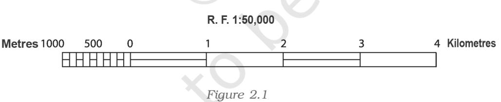
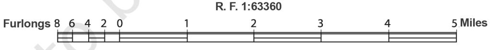
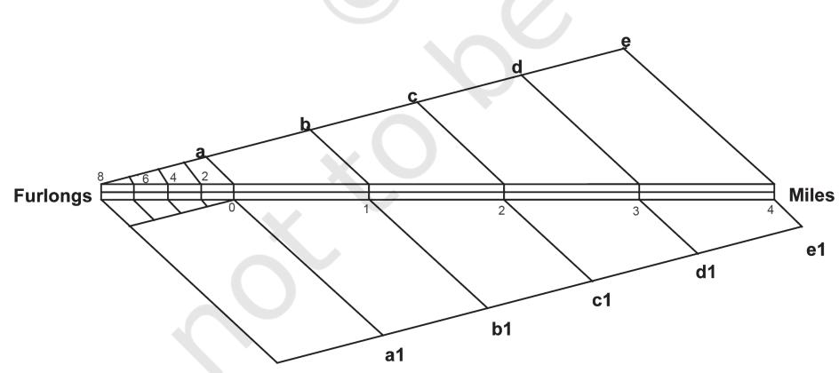

## Chapter 2

*Map Scale*

# Map Scale

You have read in Chapter 1 that the scale is an essential element of all types of maps. It is so important that if a network of lines and polygons does not carry a scale, we call it a "sketch". Why is the scale so important ? What does it mean ? What are the different methods of showing the scale on a map? How useful is the scale in measuring the distances and the area? These are some of the questions which will be taken up in the present chapter.

#### Glossary

*Denominator:* The number below the line in a fraction. For example, in a fraction of 1 : 50,000, 50,000 is the denominator.

*Numerator:* The number above the line in a fraction. For example, in a fraction of 1 : 50,000, 1 is the numerator.

*Representative Fraction:* A method of scale of a map or plan expressed as a fraction showing the ratio between a unit distance on the map or plan, and the distance measured in the same units on the ground.

#### *What is Scale ?*

You must have seen maps with a scale bar indicating equal divisions, each marked with readings in kilometres or miles. These divisions are used to find out the ground distance on the map. In other words, a map scale provides the relationship between the map and the whole or a part of the earth's surface shown on it. We can also express this relationship as a ratio of distances between two points on the map and the corresponding distance between the same two points on the ground.

17

There are at least three ways in which this relationship can be expressed. These are:

- 1. Statement of Scale
- 2. Representative Fraction (R. F.)
- 3. Graphical Scale

Each of these methods of scale has advantages and limitations. But before taking up these issues, let us understand that the scale is normally expressed in one or the other system of measurement. You must have read and/or used kilometre, metre, centimetre etc. to measure the linear distances between two points on the ground. You might have also heard of miles, furlongs, yards, feet, etc. These are two different systems of measurement of the distances used in different countries of the world. Whereas the former system is referred to as the Metric System of Measurement and presently used in India and many other countries of the world, the latter system is known as the English System of Measurement and is prevalent in both the United States and the United Kingdom. India also used this system for measuring/showing linear distances before 1957. The units of measurement of these systems are given in Box 2.1.

#### METHODS OF SCALE

As mentioned above, the scale of the map may be expressed using one or a combination of more than one methods of scale. Let us see how these methods are used and what are their advantages and limitations.

| Box 2.1 Systems of Measurements |  |  |
| --- | --- | --- |
| Metric System of Measurement |  |  |
| 1 km | = | 1000 Metres |
| 1 Metre | = | 100 Centimetres |
| 1 Centimetre | = | 10 Millimetres |
| English System of Measurement |  |  |
| 1 Mile | = | 8 Furlongs |
| 1 Furlong | = | 220 Yards |
| 1 Yard | = | 3 feet |
| 1 Foot | = | 12 Inches |

*1. Statement of Scale:* The scale of a map may be indicated in the form of a written statement. For example, if on a map a written statement appears stating 1 cm represents 10 km, it means that on that map a distance of 1 cm is representing 10 km of the corresponding ground distance. It may also be expressed in any other system of measurement, i.e. 1 inch represents 10 miles. It is the simplest of the three methods. However, it may be noted that the people who are familiar with one system may not understand the statement of scale given in another system of measurement. Another limitation of this method is that if the map is reduced or enlarged, the scale will become redundant and a new scale is to be worked out.

*2. Graphical or Bar Scale:* The second type of scale shows map distances and the corresponding ground distances using a line bar with primary and secondary divisions marked on it. This is referred to as the graphical scale or bar scale (Fig. 2.1). It may be noted that the scale readings as shown on the bar scale in Figure 2.1 reads only in kilometres and metres. In yet another bar scale the readings may be shown in miles and furlongs. Hence, like the statement of scale method, this method also finds restricted use for only those who can understand it. However, unlike the statement of the scale method, the graphical scale stands valid even when the map is reduced or enlarged. This is the unique advantage of the graphical method of the map scale.

*3. Representative Fraction ( R. F. ):* The third type of scale is R. F. It shows the relationship between the map distance and the corresponding ground distance in units of length. The use of units to express the scale makes it the most versatile method.

R. F. is generally shown in fraction because it shows how much the real world is reduced to fit on the map. For example, a fraction of 1 : 24,000 shows that one unit of length on the map represents 24,000 of the same units on the ground i.e. one mm, one cm or one inch on the map representing 24,000 mm, 24,000 cm and 24,000 inches, respectively of the ground. It may, however, be noted that while converting the fraction of units into Metric or English systems, units in centimetre or inch are normally used by convention. This quality of expressing scale in units in R. F. makes it a universally acceptable and usable method. Let us take R. F. of 1 : 36,000 to elaborate the universal nature of R. F.

If the given scale is 1: 36,000, a person acquainted with the Metric System will read the given units by converting them into cm, i.e. the distance of 1 unit on the map as 1 cm and the distance of 36,000 units on the ground distance as 36,000 cm. These values may subsequently be converted into a statement of scale, i.e. 1 cm represents 360 metres. (by dividing values in denominator by the number of centimetres in a metre, i.e. 100). Yet another user of the map familiar with the English system of measurement will understand the map scale by converting it into a statement of scale convenient to him/her and read the map scale as 1 inch represents 1,000 yards. The said statement of scale will be obtained by dividing 36,000 units in the denominator by 36 (number of inches in a yard).

#### CONVERSION OF SCALE

If you have carefully read the advantages and limitations of the different methods of scale, then it will not be difficult for you to convert the Statement of Scale into Representative Fraction and vice-versa.

#### *Statement of Scale into R. F.*

| Problem | Convert the given Statement of Scale of 1 inch represents |
| --- | --- |
|  | 4 miles into R. F. |
| Solution | The given Statement of Scale may be converted into R. F. |
|  | using the following steps. |
|  | 1 inch represents 4 miles |
| or | 1 inch represents 4 × 63,360 inches (1 mile = 63,360 |
|  | inches) |
| or | 1 inch represents 253,440 inches |
| NOTE : | We can now replace the character "inches" into "units" |
|  | and read it as : |
|  | 1 unit represents 253,440 Units |
| Answer | R. F. 1 : 253, 440 |

#### *R. F. into Statement of Scale*

| Problem | Convert R. F. 1 : 253, 440 into Statement of Scale (In | Metric | System) |
| --- | --- | --- | --- |
| Solution | The given R. F. of 1 : 253, 440 may be converted into | Statement | of Scale using the following steps : |
| 1 : 253, 440 means that | 1 unit on the map represents 253, 440 units on the ground. |  |  |
| or | 1 cm represents 253, 440/100,000 (1 km = 100,000 | cm) |  |
| or | 1 cm represents 2.5344 km | After rounding of up to 2 decimals, the answer will be : |  |

Answer 1 cm represents 2.53 km

### *Construction of the Graphical/Bar Scale*

| Problem 1 | Construct a graphical scale for a map drawn at a scale of |
| --- | --- |
|  | 1 : 50,000 and read the distances in kilometre and metre. |
| NOTE: | By convention, a length of nearly 15 cm is taken to draw |
|  | a graphical scale. |
|  | Calculations To get the length of line for the graphical scale, these |

steps may be followed:

- 1 : 50,000 means that
- 1 unit of the map represents 50,000 units on the ground
- or 1 cm represents 50,000 cm
- or 15 cm represents 50,000 × 15/100,000 km
- or 15 cm represents 7.5 km

Since the value of 7.5 (km) is not a round number, we can choose 5 or 10 (km) as the round number. In the present case, we choose 5 as the round number.

To determine the length of the line to show 5 km, the following calculations are to be carried out:

7.5 km is represented by a line of 15 cm

5 km will be represented by a line of 15 × 5/7.5

- or 5 km will be represented by a line of 10 cm
Construction The graphical scale may be constructed by following these steps:

Draw a straight line of 10 cm and divide it into 5 equal parts and assign a value of 1 km each for 4 right side divisions from the 0 mark. Also divide the extreme left side division into 10 equal parts and mark each division by a value of 100 metres, beginning from 0. (You may also divide it into 2, 4, or 5 parts and assign a value of 500, 250, or 200 metres to

|
|  |

each of the subdivisions respectively from 0.

*Figure 2.2*

| Problem 2 | Construct a graphical scale when the given Statement |
| --- | --- |
|  | of Scale is 1 inch representing 1 mile and read the |
|  | distances in miles and furlongs. |
| NOTE: | By convention, a length of nearly 6 inches is taken to |
|  | draw a graphical scale. |
| Calculations | To get the length of line for the graphical scale, these |
|  | steps may be followed: |
|  | 1 inch represents 1 mile |
|  | or 6 inches represents 6 miles |
| Construction | The graphical scale may be constructed in the |

following steps:

Draw a straight line of 6 inches and divide it into 6 equal parts and assign a value of 1 mile each for 5 right side divisions. Also divide the extreme left side division into 4 equal parts and mark each division by a value of 2 miles each, beginning from 0.

|  | Figure 2.3 |
| --- | --- |
| Problem 3 | Construct a graphical scale when the given R. F. is 1 : |
|  | 50,000 and read the distances in miles and furlongs. |
| Calculations | To get the length of the line for the graphical scale, |
|  | these steps may be followed: |
|  | 1 : 50,000 means that |
|  | 1 unit represents 50,000 units |
|  | or 1 inch represents 50,000 inches. |
|  | or 6" represents 50,000 × 6/63,360 miles |
| = | 6' represents 4.73 miles |

22

Since a figure of 4.73 (miles) is not a round number, we take 5 as the round number.

To determine the length of the line to show 5 km, the following calculations are to be carried out :

> 4.73 miles are represented by a line of 6 inches 5 miles will be represented by a line of 6 × 5/4.73 = 5 miles will be represented by a line of 6.34 inches

Construction The graphical scale may be constructed in the following steps:

To construct a graphical scale to show 5 miles we need to draw a line of 6.34 inches and divide it into 5 equal parts. The question is how can an unequal line of 6.3 inches be divided into 5 equal parts. To do so we can use the following procedure:

- ° Draw a straight line of 6.3 inches.
- ° Draw lines at an angle of 400 or 450 from the start and end nodes of the lines and divide them into 5 equal parts of 1 or 1.5 incheseach.
- ° Draw dotted lines joining the divisions marked on the two lines.
- ° Mark the intersections of these lines at the primary scale.

By doing so, you will divide the unequal line of 6.3 inches into 5 equal parts. You can repeat the same way to divide the extreme left part on the primary scale into 4 or 8 parts to show the number of furlongs that are equivalent to 1 mile.

*Figure 2.4 Drawing of equal divisions in a graphical scale*

23

#### *EXERCISE*

24

- 1. Choose the right answer from the four alternatives given below:
	- Which one of the following methods of scale is a universal method? (i)
		- (a) Simple Statement
		- (b) Representative Fraction
		- (c) Graphical Scale
		- (d) None of the above
	- Map distance in a scale is also known as: (ii)
		- (a) Numerator
		- (b) Denominator
		- (c) Statement of Scale
		- (d) Representative Fraction
	- 'Numerator' in scale represents: (iii)
		- (a) Ground distance
		- (b) Map distance
		- (c) Both the distances
		- (d) None of the above
- 2. Answer the following questions in about 30 words:
	- What are the two different systems of measurement? (i)
	- Give one example each of statement of scale in Metric and English (ii)
	- system.
	- Why is the Representative Fraction method called a Universal method? (iii)
	- What are the major advantages of the graphical method? (iv)
- 3. Convert the given Statement of Scale into Representative Fraction (R. F.).
	- 5 cm represents 10 km (i)
	- 2 inches represents 4 miles (ii)
	- 1 inch represents 1 yard (iii)
	- 1 cm represents 100 metres (iv)
- 4. Convert the given Representative Fraction (R. F.) into Statement of Scale in the System of Measurement shown in parentheses:
	- 1 : 100,000 (into km) (i)
	- 1 : 31680 (into furlongs) (ii)

- 1 : 126,720 (into miles) (iii)
- 1 : 50,000 (into metres) (iv)
- 5. Construct a graphical scale when the given R. F. is 1 : 50,000 and read the distances in kilometre and metre.

