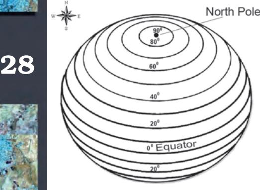
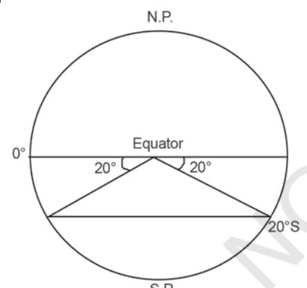
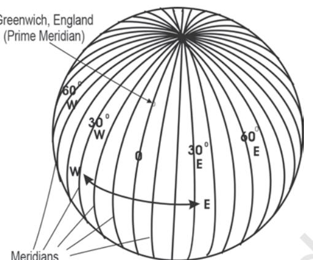
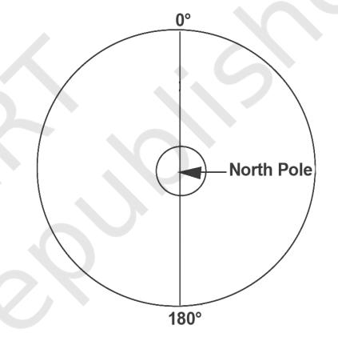
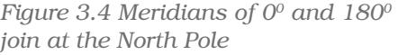
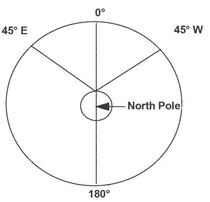
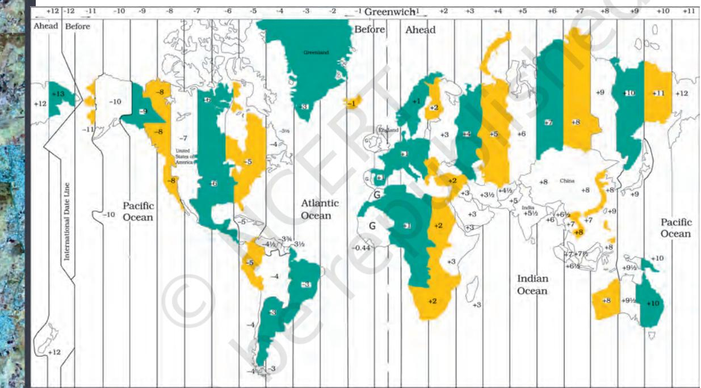

26

*Practical Work in Geography*

# Chapter 3

# Latitude, Longitude and Time

THE EARTH is nearly a sphere. It is because of the fact that the equatorial radius and the polar radius of the earth is not the same. The rotation of the earth over its axis produces bulging at the equator. Hence, the actual shape resembles that of an oblate spheroid. The shape of the earth presents some difficulties in positioning its surface features, as there is no point of reference from which to measure the relative positions of other points. Hence, a network of imaginary lines is drawn on a globe or a map to locate various places. Let us find out what are these lines and how are they drawn.

The spinning of the earth on its axis from west to east provides two natural points of reference, i.e. North and South Poles. They form the basis for the *geographical grid.* A network of intersecting lines is drawn for the purpose of fixing the locations of different features. The grid consists of two sets of horizontal and vertical lines, which are called parallels of latitudes and the meridians of longitudes.

Horizontal lines are drawn parallel to each other in east-west direction. The line drawn midway between the North Pole and the South Pole is called the equator. It is the largest circle and divides the globe into two equal halves. It is also called a great circle*.* All the other parallels get smaller in size, in proportion to their distance from the equator towards the poles and divide the earth into two unequal halves, also referred to as the small circles. These imaginary lines running east-west are commonly known as the *parallels of latitude.*

The vertical lines running north-south, join the two poles. They are called the *meridians of longitude.* They are spaced farthest apart at the equator and converge at a point at each pole.

The latitudes and longitudes are commonly referred to as geographical coordinates as they provide systematic network of lines upon which the position of various surface features of the earth, can be represented. With the help of these coordinates, location, distance and direction of various points can be easily determined.

Although an infinite number of parallels and meridians may be drawn on a globe, only a selected number of them are usually drawn on a map. Latitudes and longitudes are measured in degrees (°) because they represent angular distances. Each degree is further divided into 60 minutes ( ' ) and each minute into 60 seconds ( " ).

#### Glossary

*Parallels of Latitude :* The parallels of latitude refer to the angular distance, in degrees, minutes and seconds of a point north or south of the Equator. Lines of latitude are often referred to as parallels.

*Meridians of Longitude :* The meridians of longitude refer to the angular distance, in degrees, minutes, and seconds, of a point east or west of the Prime (*Greenwich*) Meridian. Lines of longitude are often referred to as meridians.

#### PARALLELS OF LATITUDES

The latitude of a place on the earth's surface is its distance north or south of the equator, measured along the meridian of that place as an angle from the centre of the earth. Lines joining places with the same latitudes are called *parallels.* The value of equator is 0° and the latitude of the poles are 90°N and 90°S (Fig. 3.1 on the next page). If parallels of latitude are drawn at an interval of one degree, there will be 89 parallels in the northern and the southern hemispheres each. The total number of parallels thus drawn, including the equator, will be 179. Depending upon the location of a feature or a place north or south of the equator, the letter N or S is written along with the value of the latitude.

If the earth were a perfect sphere, the length of 10 of latitude (a one degree arc of a meridian) would be a constant value, i.e. 111 km everywhere on the earth. This length is almost the same as that of a

*Figure 3.1 Parallels of Latitudes*

degree of longitude at the equator. But to be precise, a degree of latitude changes slightly in length from the equator to the poles. While at the equator, it is 110.6 km at the poles, it is 111.7 km. Latitude of a place may be determined with the help of the altitude of the sun or the Pole Star.

# DRAWING THE PARALLELS OF LATITUDES

How to draw the parallels of latitudes? Draw a circle and divide it into two equal halves by drawing a horizontal line in the centre. This represents the equator. Place a protractor on this circle in a way that 0° and 180° line on the protractor coincide with the equator on the paper. Now to draw 20°S, mark two points at an angle of 20° from the equator, east and west in the lower half of the circle, as shown in Fig. 3.2. The arms of the angle cut the circle at two points. Join these two points by a line parallel to the equator. It will be 200S.

## MERIDIANS OF LONGITUDE

Unlike the parallels of latitude which are circles, the meridians of longitude are semi-circles that converge at the poles. If opposite meridians are taken together, they complete a circle, but, they are valued separately as two meridians.

The meridians intersect the equator at right angles. Unlike the parallels of latitude, they are all equal in length. For convenience of numbering, the meridian of longitude passing through the Greenwich observatory (near London) has been adopted as the *Prime Meridian* by an international agreement and has been given the value of 0°.

The *longitude* of a place is its angular distance east or west of the Prime Meridian. It is also measured in degrees. The longitudes vary from 0° to 180° eastward and westward of the Prime Meridian (Fig. 3.3). The part of the earth east of the Prime Meridian is called the eastern hemisphere and in its west referred to as the western hemisphere.

#### *Drawing the Meridians of Longitude*

How to draw the lines of longitude? Draw a circle whose centre represents the North Pole. The circumference will represent the equator. Draw a vertical line through the centre of the circle, i.e. crossing the North Pole. This represents the 0°and 180°meridians, which meet at the North Pole (Fig. 3.4).

When you look at a map, the east is towards your right and the west is towards your left. However, to draw a longitude, imagine that you are on the North Pole, i.e. at the centre of the circle as shown in Fig. 3.4. Observe now that the relative directions of east and west would reverse in this case and east would be towards your left while west would be towards your right. Now, draw 45° E and W as shown in Fig. 3.5 For this, place your protractor along the vertical line, coinciding with the 0° and 180° meridians and then measure 45° on both the sides, which will denote 45° E meridian and 45° W meridian on your left and right, respectively. The diagram will represent the appearance of the earth if we look at it from directly above the North Pole.

#### LONGITUDE AND TIME

We all know that the earth rotates from west to east over its axis. It makes the sun rise in the east and set in the west. The rotation of the earth over its axis takes 24 hours to complete one circle or 360° of longitudes. As 180° of longitudes fall both east and west of the Prime Meridian, the sun, thus takes 12 hours' time to traverse the

*Figure 3.3 Meridians of Longitude*

29

*Figure 3.5 Drawing of Meridians of Longitude*

| S. No. | Parallels of Latitude | Meridians of Longitude |
| --- | --- | --- |
| 1. | Latitude is the angular | Longitude is the angular |
|  | distance of a point north or | distance along the |
|  | south of the equator as | equator measured in |
|  | measured in degrees. | degrees. It is measured |
|  |  | east or west of |
|  |  | Greenwich (0°), from 0° |
|  |  | to 180°. |
| 2. | All latitudes are parallel | All meridians of |
|  | to the equator. | longitude converge at |
|  |  | the poles. |
| 3. | On a globe, parallels of | All meridians of |
|  | latitudes appear as circles. | longitude appear as |
|  |  | circles running through |
|  |  | the poles. |
| 4. | The distance between two | The distance between |
|  | latitudes is approximately | two longitudes is |
|  | 111 km. | maximum at the |
|  |  | equator (111.3 km) and |
|  |  | minimum at the poles (0 |
|  |  | km). Midway, at 450 of |
|  |  | latitude, it is 79 km. |
| 5. | The 00 latitude is referred to | There are 360° of |
|  | as the equator and the 90° | longitude, 180° each in |
|  | as the poles. | the east and west of the |
|  |  | Prime Meridian. |
| 6. | The latitudes from the | The longitudes are used |
|  | equator to the poles are | to determine the local |
|  | used to demarcate | time with reference to |
|  | temperature zones, i.e. 0° to | the time at Prime |
|  | 23 ½° north and south as the | Meridian. |
|  | torrid zone, 23 ½° to 66 ½° |  |
|  | as the temperate zone and |  |
|  | 66 ½° to 90° as the frigid |  |

*Table 3.1 A Comparison between the Parallels of Latitudes and t he Meridians of Longitudes*

30

eastern and western hemispheres. In other words, the sun traverses 150 of longitudes per hour or one degree of longitude in every four minutes of time. It may further be noted that the time decreases when we move from west to east and increases with our westward movement.

The rate of the time at which the sun traverses over certain degrees of longitudes is used to determine the local time of an area with respect to the time at the Prime Meridian (0°Longitude). Let us try to understand the question of the determination of time with respect to the Prime Meridian with the following set of examples :

Example 1 : Determine the local time of Thimpu (Bhutan) located at 90° east longitude when the time at Greenwich (0°) is 12.00 noon.

Statement : The time increases at a rate of 4 minutes per one degree of longitude, east of the Prime Meridian.

#### Solution :

Difference between Greenwich and Thimpu = 90° of longitudes Total Time difference = 90 × 4 = 360 minutes = 360/60 hours

= 6 hours\Local time of Thimpu is 6 hours more than that at Greenwich, i.e. 6.00 p.m.

Example 2 : Determine the local time of New Orleans (the place, which was worst affected by Katrina Hurricane in October 2005), located at 900 West longitude when the time at Greenwich (00 ) is 12.00 noon.

Statement : The time decrease, at a rate of 4 minutes per one degree of longitude, west of the prime meridian.

#### Solution :

| Difference between Greenwich and New Orleans | = 90° of longitudes |
| --- | --- |
| Total Time difference | = 90 × 4 = 360 minutes |
|  | = 360/60 hours |

= 6 hours\Local time of New Orleans is 6 hours less than that at Greenwich, i.e. 6.00 a. m.

In the same way, the time may be determined for any place in the world. However, in order to maintain uniformity of time as far as possible within the territorial limits of a country, the time at the central meridian of the country is taken as the Standard Meridian and its local time is taken as the *standard time* for the whole country. The Standard Meridian is selected in a manner that it is divisible by 150° or 7° 30' so that the difference

31

between its *standard time* and the *Greenwich Mean Time* may be expressed as multiples of an hour or half an hour.

The Indian Standard Time is calculated from 82°30'E meridian passing through Mirzapur. Therefore, IST is plus 5.30 hours from the GMT ((82°30' x 4) (60 minutes=5 hours 30 minutes). Similarly, all countries of the world choose the standard meridian within their territory to determine the time within their administrative boundaries. The countries with large eastwest span may choose more than one standard meridian to get more than one time zone such as Russia, Canada and the United States of America. The world is divided into 24 major time zones (Fig. 3.6).

*Figure 3.6 Major Time Zones of the World*

### INTERNATIONAL DATE LINE

32

While the world is divided into 24 time zones, there has to be a place where there is a difference in days, somewhere the day truly "starts" on the planet. The 180° line of longitude is approximately where the International Date Line passes. The time at this longitude is exactly 12 hours from the 00 longitude, irrespective of one travels westward or eastward from the Prime Meridian. We know that time increases east of

the Prime Meridian and decreases to its west. Hence, for a person moving east of the Prime Meridian, the time would be 12 hours less than the time at 0° longitude. For another person moving westward, the time would be 12 hours more than the Prime Meridian. For example, a person moving eastward on Tuesday will count the day as Wednesday once the International Date Line is crossed. Similarly, another person starting his journey on the same day, but moving westward will count the day as Monday after crossing the line.

#### *EXERCISE*

- 1. Answer the following questions in about 30 words:
	- Which are the two natural points of references on the earth? (i)
	- What is a great circle? (ii)
	- What are coordinates? (iii)
	- Why does the sun appear to be moving from east to west? (iv)
	- What is meant by local time? (v)
- 2. Distinguish between latitudes and longitudes.

### *ACTIVITY*

- 1. Find out the locations of the following places with the help of your atlas and write their latitudes and longitudes.
	- Mumbai (i)
	- Vladivostok (ii)
	- Cairo (iii)
	- New York (iv)
	- Ottawa (v)
	- Geneva (vi)
	- Johannesburg (vii)
	- Sydney (viii)

Place Latitude Longitude

33

- 2. What would be the time of the following cities if the time at Prime Meridian is 10 a.m.
	- Delhi (i)

34

- London (ii)
- Tokyo (iii)
- Paris (iv)
- Cairo (v)
- Moscow (vi)

