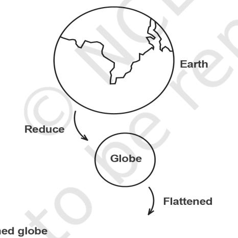
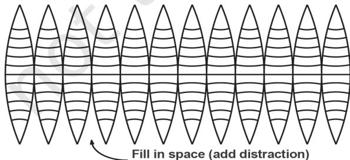
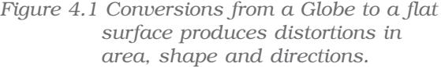
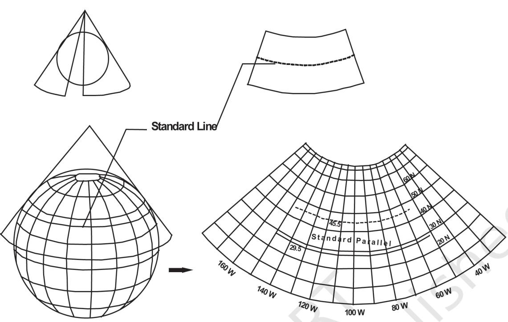
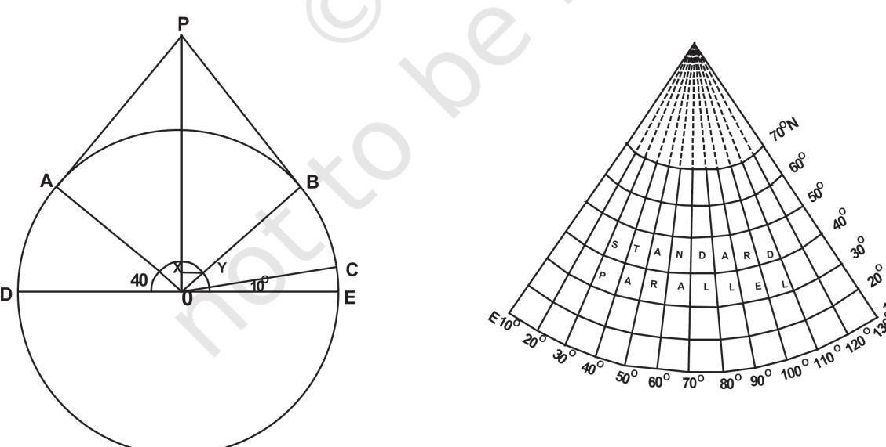
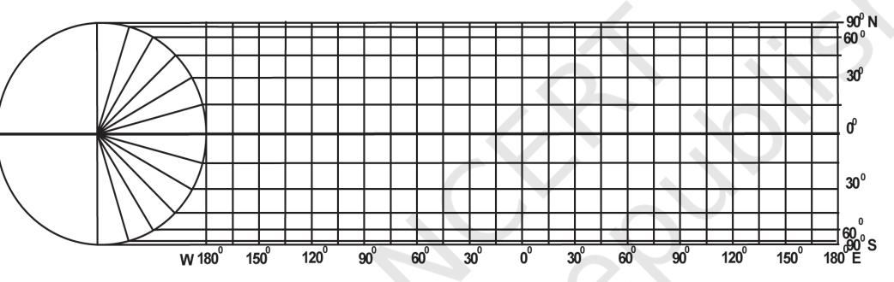
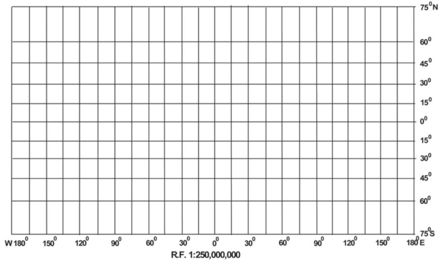
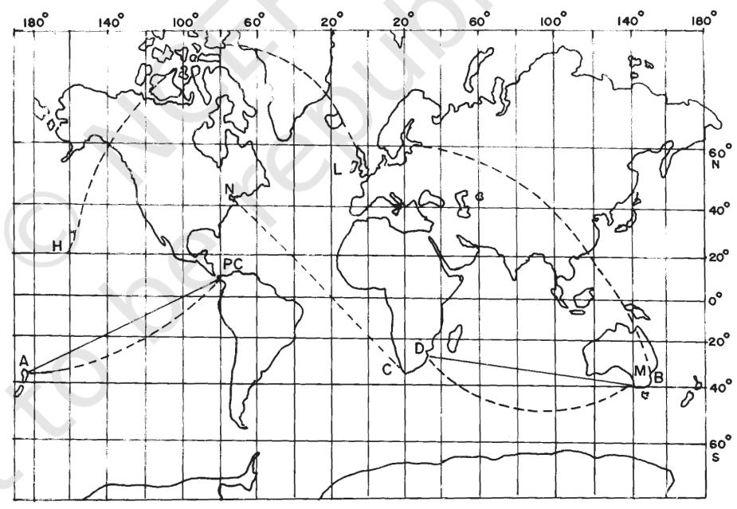

# Chapter 4

*Map Projections*

# Map Projections

What is map projection? Why are map projections drawn? What are the different types of projections? Which projection is most suitably used for which area? In this chapter, we will seek the answers of such essential questions.

# MAP PROJECTION

Map projection is the method of transferring the graticule of latitude and longitude on a plane surface. It can also be defined as the transformation of spherical network of parallels and meridians on a plane surface. As you know that, the earth on which we live in is not flat. It is geoid in shape like a sphere. A globe is the best model of the earth. Due to this property of the globe, the shape and sizes of the continents and oceans are accurately shown on it. It also shows the directions and distances very accurately. The globe is divided into various segments by the lines of latitude and longitude. The horizontal lines represent the parallels of latitude and the vertical lines represent the meridians of the longitude. The network of parallels and meridians is called *graticule*. This network facilitates drawing of maps. Drawing of the *graticule* on a flat surface is called projection.

But a globe has many limitations. It is expensive. It can neither be carried everywhere easily nor can a minor detail be shown on it. Besides, on the globe the meridians are semi-circles and the parallels are circles. When they are transferred on a plane surface, they become intersecting straight lines or curved lines.

35

# NEED FOR MAP PROJECTION

The need for a map projection mainly arises to have a detailed study of a region, which is not possible to do from a globe. Similarly, it is not easy to compare two natural regions on a globe. Therefore, drawing accurate large-scale maps on a flat paper is required. Now, the problem is how to transfer these lines of latitude and longitude on a flat sheet. If we stick a flat paper over the globe, it will not coincide with it over a large surface without being distorted. If we throw light from the centre of the globe, we get a distorted picture of the globe in those parts of paper away from the line or point over which it touches the globe. The distortion increases with increase in distance from the tangential point. So, tracing all the properties like shape, size and directions, etc. from a globe is nearly impossible because the globe is not a developable surface.

In map projection we try to represent a good model of any part of the earth in its true shape and dimension. But distortion in some form or the other is inevitable. To avoid this distortion, various methods have been devised and many types of projections are drawn. Due to this reason, map projection is also defined as the study of different methods which have been tried for transferring the lines of *graticule* from the globe to a flat sheet of paper.

#### Glossary

*Map projection:* It is the system of transformation of the spherical surface onto a plane surface. It is carried out by an orderly and systematic representation of the parallels of latitude and the meridians of longitude of the spherical earth or part of it on a plane surface on a conveniently chosen scale.

*Lexodrome or Rhumb Line:* It is a straight line drawn on Mercator's projection joining any two points having a constant bearing. It is very useful in determining the directions during navigation.

*The Great Circle:* It represents the shortest route between two points, which is often used both in air and ocean navigation.

*Homolograhic Projection:* A projection in which the network of latitudes and longitudes is developed in such a way that every *graticule* on the map is equal in area to the corresponding *graticule* on the globe. It is also known as the equal-area projection.

*Orthomorphic Projection:* A projection in which the correct shape of a given area of the earth's surface is preserved.

# ELEMENTS OF MAP PROJECTION

*a. Reduced Earth:* A model of the earth is represented by the help of a reduced scale on a flat sheet of paper. This model is called the "reduced earth". This model should be more or less spheroid having the length of polar diameter lesser than equatorial and on this model the network of *graticule* can be transferred.

*b. Parallels of Latitude:* These are the circles running round the globe parallel to the equator and maintaining uniform distance from the poles. Each parallel lies wholly in its plane which is at right angle to the axis of the earth. They are not of equal length. They range from a point at each pole to the circumference of the globe at the equator. They are demarcated as 0º to 90º North and South latitudes.

*c. Meridians of Longitude:* These are semi-circles drawn in northsouth direction from one pole to the other, and the two opposite meridians make a complete circle, i.e. circumference of the globe. Each meridian lies wholly in its plane, but all intersect at right angle along the axis of the globe. There is no obvious central meridian but for convenience, an arbitrary choice is made, namely the meridian of Greenwich, which is demarcated as 0° longitudes. It is used as reference longitudes to draw all other longitudes

*d. Global Property:* In preparing a map projection the following basic properties of the global surface are to be preserved by using one or the other methods:

- (i) Distance between any given points of a region;
- (ii) Shape of the region;
- (iii) Size or area of the region in accuracy;
- (iv) Direction of any one point of the region bearing to another point.

# CLASSIFICATION OF MAP PROJECTIONS

Map Projections may be classified on the following bases:

*a. Drawing Techniques:* On the basis of method of construction, projections are generally classified into perspective, non-perspective and 37

conventional or mathematical. *Perspective projections* can be drawn taking the help of a source of light by projecting the image of a network of parallels and meridians of a globe on developable surface. *Non–perspective* projections are developed without the help of a source of light or casting shadow on surfaces, which can be flattened. *Mathematical or conventional* projections are those, which are derived by mathematical computation, and formulae and have little relations with the projected image.

*b. Developable Surface:* A developable surface is one, which can be flattened, and on which, a network of latitude and longitude can be projected. A non-developable surface is one, which cannot be flattened without shrinking, breaking or creasing. A globe or spherical surface has the property of non-developable surface whereas a cylinder, a cone and a plane have the property of developable surface. On the basis of nature of developable surface, the projections are classified as cylindrical, conical and zenithal projections. *Cylindrical projections* are made through the use of cylindrical developable surface. A paper-made cylinder covers the

globe, and the parallels and meridians are projected on it. When the cylinder is cut open, it provides a cylindrical projection on the plane sheet. A *Conical projection* is drawn by wrapping a cone round the globe and the shadow of *graticule* network is projected on it. When the cone is cut open, a projection is obtained on a flat sheet. *Zenithal projection* is directly obtained on a plane surface when plane touches the globe at a point and the *graticule* is projected on it. Generally, the plane is so placed on the globe that it touches the globe at one of the poles. These projections are further subdivided into normal, oblique or polar as per the position of the plane touching the globe. If the developable surface touches the globe at the equator, it is called the

*Figure 4.2 A conical projection from a Globe to a Flat Map*

*equatorial or normal projection*. If it is tangential to a point between the pole and the equator, it is called the *oblique projection;* and if it is tangential to the pole, it is called the *polar projection*.

*c. Global Properties:* As mentioned above, the correctness of area, shape, direction and distances are the four major global properties to be preserved in a map. But none of the projections can maintain all these properties simultaneously. Therefore, according to specific need, a projection can be drawn so that the desired quality may be retained. Thus, on the basis of global properties, projections are classified into equal area, orthomorphic, azimuthal and equi-distant projections. *Equal Area Projection* is also called *homolographic* projection. It is that projection in which areas of various parts of the earth are represented correctly. *Orthomorphic or True-Shape* projection is one in which shapes of various areas are portrayed correctly. The shape is generally maintained at the cost of the correctness of area. *Azimuthal or True-Bearing* projection is one on which the direction of all points from the centre is correctly represented. *Equi-distant or True Scale* projection is that where the distance or scale is correctly maintained. However, there is no such projection, which maintains the scale correctly throughout. It can be

39

maintained correctly only along some selected parallels and meridians as per the requirement.

*d. Source of Light:* On the basis of location of source of light, projections may be classified as gnomonic, stereographic and orthographic. *Gnomonic projection* is obtained by putting the light at the centre of the globe. *Stereographic projection* is drawn when the source of light is placed at the periphery of the globe at a point diametrically opposite to the point at which the plane surface touches the globe. *Orthographic projection* is drawn when the source of light is placed at infinity from the globe, opposite to the point at which the plane surface touches the globe.

# CONSTRUCTING SOME SELECTED PROJECTIONS

### *a. Conical Projection with one Standard Parallel*

A conical projection is one, which is drawn by projecting the image of the *graticule* of a globe on a developable cone, which touches the globe along a parallel of latitude called the *standard parallel*. As the cone touches the globe located along AB, the position of this parallel on the globe coinciding with that on the cone is taken as the *standard parallel*. The length of other parallels on either side of this parallel are distorted. (Fig. 4.3)

#### Example

40

Construct a conical projection with one standard parallel for an area bounded by 10º N to 70º N latitude and 10º E to 130º E longitudes when the scale is 1:250,000,000 and latitudinal and longitudinal interval is 10º. Calculation

Radius of reduced earth 56.2 000,000,250 000,000,640 *R* = = cm

Standard parallel is 40º N (10, 20, 30, 40, 50, 60, 70) Central meridian is 70º E (10, 20, 30, 40, 50, 60, 70, 80, 90, 100, 110, 120, 130)

#### Construction

- (i) Draw a circle or a quadrant of 2.56 cm radius marked with angles COE as 10º interval and BOE and AOD as 40º *standard parallel.*
- (ii) A tangent is extended from B to P and similarly from A to P, so that AP and BP are the two sides of the cone touching the globe and forming Standard Parallel at 40° N.
- (iii) The arc distance CE represents the interval between parallels. A semi-circle is drawn by taking this arc distance.
- (iv) X-Y is the perpendicular drawn from OP to OB.
- (v) A separate line N-S is taken on which BP distance is drawn representing standard parallel. The line NS becomes the central meridian.
- (vi) Other parallels are drawn by taking arc distance CE on the central meridian.
- (vii) The distance XY is marked on the standard parallel at 40° for drawing other meridians.
- (viii) Straight lines are drawn by joining them with the pole.

# Properties

- 1. All the parallels are arcs of concentric circle and are equally spaced.
- 2. All meridians are straight lines merging at the pole. The meridians intersect the parallels at right angles.
- 3. The scale along all meridians is true, i.e. distances along the meridians are accurate.
- 4. An arc of a circle represents the pole.
- 5. The scale is true along the standard parallel but exaggerated away from the standard parallel.
- 6. Meridians become closer to each other towards the pole.
- 7. This projection is neither equal area nor orthomorphic.

#### Limitations

42

1. It is not suitable for a world map due to extreme distortions in the hemisphere opposite the one in which the standard parallel is selected.

2. Even within the hemisphere, it is not suitable for representing larger areas as the distortion along the pole and near the equator is larger. Uses

1. This projection is commonly used for showing areas of mid-latitudes with limited latitudinal and larger longitudinal extent.

2. A long narrow strip of land running parallel to the standard parallel and having east-west stretch is correctly shown on this projection.

3. Direction along standard parallel is used to show railways, roads, narrow river valleys and international boundaries.

4. This projection is suitable for showing the Canadian Pacific Railways, Trans-Siberian Railways, international boundaries between USA and Canada and the Narmada Valley.

#### *b. Cylindrical Equal Area Projection*

The cylindrical equal area projection, also known as the *Lambert's projection*, has been derived by projecting the surface of the globe with parallel rays on a cylinder touching it at the equator. Both the parallels and meridians are projected as straight lines intersecting one another at right angles. The pole is shown with a parallel equal to the equator; hence, the shape of the area gets highly distorted at the higher latitude.

#### Example

Construct a cylindrical equal area projection for the world when the R.F. of the map is 1:300,000,000 taking latitudinal and longitudinal interval as 15º.

#### Calculation

Radius of the reduced earth $R=\frac{640,000,000}{300,000,000}=2.1$ cm.  
  

Length of the equator 2πR or 2 22 2 1 13 2 7 . . *cm* × × =

Interval along the equator = 13 2 15 0 55 360 . ° . ° *cm* × =

#### Construction

- Draw a circle of 2.1 cm radius; (i)
- Mark the angles of 15º, 30º, 45º, 60º, 75º and 90º for both, northern and southern hemispheres; (ii)
- Draw a line of 13.2 cm and divide it into 24 equal parts at a distance of 0.55cm apart. This line represents the equator; (iii)
- Draw a line perpendicular to the equator at the point where 0° is meeting the circumference of the circle; (iv)
- Extend all the parallels equal to the length of the equator from the perpendicular line; and (v)
- Complete the projection as shown in fig 4.4 below: (vi)

*Figure 4.4 Cylindrical Equal Area Projection*

### Properties

- 1. All parallels and meridians are straight lines intersecting each other at right angle.
- 2. Polar parallel is also equal to the equator.
- 3. Scale is true only along the equator.

#### Limitations

- 1. Distortion increases as we move towards the pole.
- 2. The projection is non-orthomorphic.
- 3. Equality of area is maintained at the cost of distortion in shape.

#### Uses

- 1. The projection is most suitable for the area lying between 45º N and S latitudes.
- 2. It is suitable to show the distribution of tropical crops like rice, tea, coffee, rubber and sugarcane.

43

#### *c. Mercator's Projection*

A Dutch cartographer Mercator Gerardus Karmer developed this projection in 1569. The projection is based on mathematical formulae. So, it is an orthomorphic projection in which the correct shape is maintained. The distance between parallels increases towards the pole. Like cylindrical projection, the parallels and meridians intersect each other at right angle. It has the characteristics of showing correct directions. A straight line joining any two points on this projection gives a constant bearing, which is called a *Laxodrome* or *Rhumb line*.

#### *Example*

Draw a Mercator's projection for the world map on the scale of 1:250,000,000 at 15º interval.

#### Calculation

Radius of the reduced earth is *R* "1 *inch* 000,000,250 000,000,250 = =

Length of the equator 2πR or 1 22 2 6 28 7 . "*inches* × × =

Interval along the equator = 6.28 15° 0 26 360° . "*inches* × =

#### Construction

- (i) Draw a line of 6.28" inches representing the equator as EQ:
- (ii) Divide it into 24 equal parts. Determine the length of each division using the following formula:

| Length of Equator | × | interval |
| --- | --- | --- |
| 360 |  |  |

- (iii) Calculate the distance for latitude with the help of the table given below:-
Latitude Distance

| 15º | 0.265 × 1 = 0.265" inch | 30º | 0.549 × 1 = 0.549" inch |
| --- | --- | --- | --- |
| 45º | 0.881 × 1 = 0.881" inch | 60º | 1.317 × 1 = 1.317" inches |
| 75º | 2.027 × 1 = 2.027" inches | (iv) | Complete the projection as shown in Fig. 4.5 |

*Figure 4.5 Mercator's Projection*

## Properties

- 1. All parallels and meridians are straight lines and they intersect each other at right angles.
- 2. All parallels have the same length which is equal to the length of equator.
- 3. All meridians have the same length and equal spacing. But they are longer than the corresponding meridian on the globe.
- 4. Spacing between parallels increases towards the pole.
- 5. Scale along the equator is correct as it is equal to the length of the equator on the globe; but other parallels are longer than the corresponding parallel on the globe; hence the scale is not correct along them. For example, the 30º parallel is 1.154 times longer than the corresponding parallel on the globe.
- 6. Shape of the area is maintained, but at the higher latitudes distortion takes place.
- 7. The shape of small countries near the equator is truly preserved while it increases towards poles.
- 8. It is an azimuthal projection.
- 9. This is an orthomorphic projection as scale along the meridian is equal to the scale along the parallel.

#### Limitations

- 1. There is greater exaggeration of scale along the parallels and meridians in high latitudes. As a result, size of the countries near
45

the pole is highly exaggerated. For example, the size of Greenland equals to the size of USA, whereas it is 1/10th of USA.

- 2. Poles in this projection cannot be shown as 90º parallel and meridian touching them are infinite.
#### Uses

- 1. More suitable for a world map and widely used in preparing atlas maps.
- 2. Very useful for navigation purposes showing sea routes and air routes.
- 3. Drainage pattern, ocean currents, temperature, winds and their directions, distribution of worldwide rainfall and other weather elements are appropriately shown on this map

*Figure 4.6 Straight lines are Laxodromes or Rhumb lines and Dotted lines are great circles*

46

# *EXERCISE*

- 1. Choose the right answer from the four alternatives given below:
	- A map projection least suitable for the world map: (i)
		- (a) Mercator
		- (b) Simple Cylindrical
		- (c) Conical
		- (d) All the above
	- A map projection that is neither the equal area nor the correct shape and even the directions are also incorrect (ii)
		- (a) Simple Conical
		- (b) Polar zenithal
		- (c) Mercator
		- (d) Cylindrical
	- A map projection having correct direction and correct shape but area greatly exaggerated polewards is (iii)
		- (a) Cylindrical Equal Area
		- (b) Mercator
		- (c) Conical
		- (d) All the above
	- When the source of light is placed at the centre of the globe, the resultant projection is called (iv)
		- (a) Orthographic
		- (b) Stereographic
		- (c) Gnomonic
		- (d) All the above
- 2. Answer the following questions in about 30 words:
	- Describe the elements of map projection. (i)
	- What do you mean by global property? (ii)
	- Not a single map projection represents the globe truly. Why? (iii)
	- How is the area kept equal in cylindrical equal area projection? (iv)
- 3. Differentiate between—
	- Developable and non-developable surfaces (i)
	- Homolographic and orthographic projections (ii)
	- Normal and oblique projections (iii)
	- Parallels of latitude and meridians of longitude (iv)

47

- 4. Answer the following questions in not more than 125 words:
	- Discuss the criteria used for classifying map projection and state the major characteristics of each type of projection. (i)
	- Which map projection is very useful for navigational purposes? Explain the properties and limitations of this projection. (ii)
	- Discuss the main properties of conical projection with one standard parallel and describe its major limitations. (iii)

# *ACTIVITY*

48

Construct *graticule* for an area stretching between 30º N to 70º N and 40º E to 30º W on a simple conical projection with one standard parallel with a scale of 1:200,000,000 and interval at an 10º apart.

Prepare *graticule* for a Cylindrical Equal Area Projection for the world when R.F. is1: 150,000,000 and the interval is 15º apart.

Draw a Mercator Projection for the world map when the R.F. is 1:400,000,000 and the interval between the latitude and longitude is 20º.

