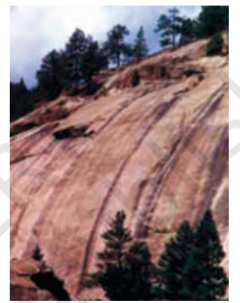

# Chapter 5

*Topographical Maps*

# Topographical Maps

You know that the map is an important geographic tool. You also know that maps are classified on the basis of scale and functions. The topographical maps, which have been referred to in Chapter 1 are of utmost importance to geographers. They serve the purpose of base maps and are used to draw all the other maps.

Topographical maps, also known as general purpose maps, are drawn at relatively large scales. These maps show important natural and cultural features such as relief, vegetation, water bodies, cultivated land, settlements, and transportation networks, etc. These maps are prepared and published by the National Mapping Organisation of each country. For example, the Survey of India prepares the topographical maps in India for the entire country. The topographical maps are drawn in the form of series of maps at different scales. Hence, in the given series, all maps employ the same reference point, scale, projection, conventional signs, symbols and colours.

The topographical maps in India are prepared in two series, i.e. India and Adjacent Countries Series and The International Map Series of the World.

India and Adjacent Countries Series: Topographical maps under India and Adjacent Countries Series were prepared by the Survey of India till the coming into existence of Delhi Survey Conference in 1937. Henceforth, the preparation of maps for the adjoining countries was abandoned and the Survey of India confined itself to prepare and publish the topographical maps for India as per the specifications laid down for the International Map Series of the World. However, the Survey of India for the topographical maps

#### Glossary

50

*Contours:* Imaginary lines joining all the points of equal elevation or altitude above mean sea level. They are also called "level lines".

*Contour Interval:* Interval between two successive contours. It is also known as vertical interval, usually written as V. I. Generally, it is constant for a given map.

*Cross-section:* A side view of the ground cut vertically along a straight line. It is also known as a section or profile.

*Hachures:* Small straight lines drawn on the map along the direction of maximum slope, running across the contours. They given an idea about the differences in the slope of the ground.

*Topographic Map:* A map of a small area drawn on a large scale depicting detailed surface features both natural and man made. Relief in this map is shown by contours.

under the new series retained the numbering system and the layout plan of the abandoned India and Adjacent Countries Series.

The topographical maps of India are prepared on 1 : 10,00,000, 1 : 250,000, 1 : 1,25,000, 1 : 50,000 and 1: 25,000 scale providing a latitudinal and longitudinal coverage of 4° × 4°, 1° × 1°, 30' × 30', 15' × 15' and 5' × 7' 30", respectively. The numbering system of each one of these topographical maps is shown in Fig. 5.1 (on page 51).

*International Map Series of the World:* Topographical Maps under International Map Series of the World are designed to produce standardised maps for the entire World on a scale of 1: 10,00,000 and 1:250,000.

*Reading of Topographical Maps:* The study of topographical maps is simple. It requires the reader to get acquainted with the legend, conventional sign and the colours shown on the sheets. The conventional sign and symbols depicted on the topographical sheets are shown in Fig. 5.2 (on page 52).

## METHODS OF RELIEF REPRESENTATION

The earth's surface is not uniform and it varies from mountains to hills to plateaus and plains. The elevation and depressions of the earth's surface are known as physical features or relief features of the earth. The map showing these features is called a relief map.

*Topographical Maps*

*Figure 5.1 Reference Map of Topographical Sheets Published by Survey of India*

52

#### *Practical Work in Geography*

*Figure 5.2 Conventional Signs and Symbols*

A number of methods have been used to show the relief features of the Earth's surface on maps, over the years. These methods include hachure, hill shading, layer tints, benchmarks and spot heights and contours. However, contours and spot heights are predominantly used to depict the relief of an area on all topographical maps.

# CONTOURS

Contours are imaginary lines joining places having the same elevation above mean sea level. A map showing the landform of an area by contours is called a *contour map*. The method of showing relief features through contour is very useful and versatile. The contour lines on a map provide a useful insight into the topography of an area.

Earlier, ground surveys and levelling methods were used to draw contours on topographical maps. However, the invention of photography and subsequent use of aerial photography have replaced the conventional methods of surveying, levelling and mapping. Henceforth, these photographs are used in topographical mapping.

Contours are drawn at different vertical intervals (VI), like 20, 50, 100 metres above the mean sea level. It is known as *contour interval*. It is usually constant on a given map. It is generally expressed in metres. While the vertical interval between the two successive contour lines remains constant, the horizontal distance varies from place to place depending upon the nature of slope. The horizontal distance, also known as the *horizontal equivalent* (HE), is large when the slope is gentler and decreases with increasing slope gradient.

### *Some basic features of contour lines are*

- ° A contour line is drawn to show places of equal heights.
- ° Contour lines and their shapes represent the height and slope or gradient of the landform.
- ° Closely spaced contours represent steep slopes while widely spaced contours represent gentle slope.
- ° When two or more contour lines merge with each other, they represent features of vertical slopes such as cliffs or waterfalls.
- ° Two contours of different elevation usually do not cross each other.

# *Drawing of Contours and Their Cross Sections*

We know that all the topographical features show varying degrees of slopes. For example, a flat plain exhibits gentler slopes and the cliffs and gorges are associated with the steep slopes. Similarly, valleys and mountain ranges are also characterised by the varying degree of slopes, i.e. steep to gentle. Hence, the spacing of contours is significant since it indicates the slope.

# *Types of slope*

The slopes can broadly be classified into gentle, steep, concave, convex and irregular or undulating. The contours of different types of slopes show a distinct spacing pattern.

# 54

#### Gentle Slope

When the degree or angle of slope of a feature is very low, the slope will be gentle. The contours representing this type of slope are far apart.

#### Steep Slope

When the degree or angle of slope of a feature is high and the contours are closely spaced, they indicate steep slope.

*Gentle Slope Steep Slope*

#### Concave Slope

A slope with a gentle gradient in the lower parts of a relief feature and steep in its upper parts is called the *concave slope*. Contours in this type of slope are widely spaced in the lower parts and are closely spaced in the upper parts.

#### Convex Slope

Unlike concave slope, the *convex slope* is fairly gentle in the upper part and steep in the lower part. As a result, the contours are widely spaced in the upper parts and are closely spaced in the lower parts.

*Concave Slope Convex Slope*

# *Types of Landform*

#### Conical Hill

It rises almost uniformly from the surrounding land. A conical hill with uniform slope and narrow top is represented by concentric contours spaced almost at regular intervals.

#### Plateau

A widely stretched flat–topped high land, with relatively steeper slopes, rising above the adjoining plain or sea is called a *plateau*. The contour lines representing a plateau are normally close spaced at the margins with the innermost contour showing wide gap between its two sides.

*Conical Slope Plateau*

### *VALLEY*

A geomorphic feature lying between two hills or ridges and formed as a result of the lateral erosion by a river or a glacier is called a *valley*.

#### 'V'-shaped Valley

 It resembles the letter V. A V-shaped valley occurs in mountainous areas. The lowermost part of the V–shaped valley is shown by the innermost contour line with very small gap between its two sides and the lowest value of the contour is assigned to it. The contour value increases with uniform intervals for all other contour lines outward.

### 'U' – shaped Valley

A U–shaped valley is formed by strong lateral erosion of glaciers at high altitudes. The flat wide bottom and steep sides makes it resemble the letter 'U'. The lowermost part of the U–shaped valley is shown by the innermost contour line with a wide gap between its two sides. The contour value increases with uniform intervals for all other contour lines outward.

# 58

#### Gorge

In high altitudes, gorges form in the areas where the vertical erosion by river is more prominent than the lateral erosion. They are deep and narrow river valleys with very steep sides. A gorge is represented by very closely-spaced contour lines on a map with the innermost contour showing small gap between its two sides.

### Spur

A tongue of land, projecting from higher ground into the lower is called a *spur*. It is also represented by Vshaped contours but in the reverse manner. The arms of the V point to the higher ground and the apex of 'V' to the lower ones.

#### CLIFF

It is a very steep or almost perpendicular face of landform. On a map, a cliff may be identified by the way the contours run very close to one another, ultimately merging into one.

Waterfall and Rapids

contour lines on a map.

A sudden and more or less perpendicular descent of water from a considerable height in the bed of a river is called a *waterfall*. Sometimes, a waterfall succeeds or precedes with a cascading stream forming *rapids* upstream or downstream of a waterfall. The contours representing a waterfall merge into one another while crossing a river stream and the rapids are shown by relatively distant

*Cliff Waterfall*

# *Steps for Drawing a Cross-section*

The following steps may be followed to draw cross-sections of various relief features from their contours :

- 1. Draw a straight line cutting across the contours on the map and mark it as AB.
- 2. Take a strip of white paper or graph and place its edge along the AB line.
- 3. Mark the position and value of every contour that cuts the line AB.
- 4. Choose a suitable vertical scale, eg ½ cm =100 metres, to draw horizontal lines parallel to each other and equal to the length of AB. The number of such lines should be equal or more than the total contour lines.
- 5. Mark the appropriate values corresponding to the contour values along the vertical of the cross-section. The numbering may be started with the lowest value represented by the contours.
- 6. Now place the edge of the marked paper along the horizontal line at the bottom line of the cross-section in such a way that AB of the paper corresponds to the AB of the map and mark the contour points.
- 7. Draw perpendiculars from AB line, intersecting contour lines, to the corresponding line at the cross-section base.
- 8. Smoothly join all the points marked on different lines at the crosssection base.

# IDENTIFICATION OF CULTURAL FEATURES FROM TOPOGRAPHICAL SHEETS

Settlements, buildings, roads and railways are important cultural features shown on topographical sheets through conventional signs, symbols and colours. The location and pattern of distribution of different features help in understanding the area shown on the map.

# *Distribution Of Settlements*

It can be seen in the map through its site, location pattern, alignment and density. The nature and causes of various settlement patterns may be clearly understood by comparing the settlement map with the contour map.

60

Four types of rural settlements may be identified on the map

- (a) Compact
- (b) Scattered
- (c) Linear
- (d) Circular

Similarly, urban centres may also be distinguished as

- (a) Cross-road town
- (b) Nodal point
- (c) Market centre
- (d) Hill station
- (e) Coastal resort centre
- (f) Port
- (g) Manufacturing centre with suburban villages or satellite towns
- (h) Capital town
- (i) Religious centre

Various factors determine the *site* of settlements like

- (a) Source of water
- (b) Provision of food
- (c) Nature of relief
- (d) Nature and character of occupation
- (e) Defence

Site of settlements should be closely examined with reference to the contour and drainage map. Density of settlement is directly related to food supply. Sometimes, village settlements form alignments, i.e. they are spread along a river valley, road, embankment, coastline – these are called *linear settlements*.

In the case of an urban settlement, a cross-road town assumes a fan-shaped pattern, the houses being arranged along the roadside and the crossing being at the heart of the town and the main market place. In a nodal town, the roads radiate in all directions.

# *Transport And Communication Pattern*

Relief, population, size and resource development pattern of an area directly influence the means of transport and communication and their density. These are depicted through conventional signs and symbols. Means of transport and communication provide useful information about the area shown on the map.

# INTERPRETATION OF TOPOGRAPHICAL MAPS

Knowledge of map language and sense of direction are essential in reading and interpreting topo-sheets .You must first look for the northline and the scale of the map and orient yourself accordingly. You must have a thorough knowledge of the legends / key given in the map depicting various features. All topo-sheets contain a table showing conventional signs and symbols used in the map (Figure 5.2). Conventional signs and symbols are internationally accepted; so, anyone can read any map anywhere in the world without knowing the language of that particular country.

A topographic sheet is usually interpreted under the following heads:

- (a) Marginal Information
- (b) Relief and Drainage
- (c) Land Use

62

- (d) Means of Transport and Communication
- (e) Human Settlement

*Marginal Information:* It includes the topographical sheet number, its location, grid references, its extent in degrees and minutes, scale, the districts covered, etc.

*Relief of the Area:* The general topography of the area is studied to identify the plains, plateaus, hills or mountains along with peaks, ridges, *spur* and the general direction of the slope. These features are studied under the following heads :

- ° *Hill* : With concave, convex, steep or gentle slope and shape.
- ° *Plateau* : Whether it is broad , narrow, flat, undulating or dissected.
- ° *Plain* : Its types, i.e. alluvial, glacial, karst, coastal, marshy, etc.
- ° *Mountain* : General elevation, peak, passes, etc.

*Drainage of the Area:* The important rivers and their tributaries and the type and extent of valleys formed by them, the types of drainage pattern, i.e. dendritic, radial, ring, trellis, internal, etc.

*Land Use:* It includes the use of land under different categories like :

- ° Natural vegetation and forest (which part of the area is forested, whether it is dense forest or thin, and the categories of forest found there like Reserved, Protected, Classified / Unclassified).
- ° Agricultural, orchard, wasteland, industrial, etc.
- ° Facilities and Services such as schools, colleges, hospitals, parks, airports, electric substations, etc.

*Transport and Communication*: The means of transportation include national or state highways, district roads, cart tracks, camel tracks, footpaths, railways, waterways, major communication lines, post offices, etc.

*Settlement:* Settlements are studied under the following heads :

- ° Rural Settlements: The types and patterns of rural settlements, i.e. compact, semi-compact, dispersed, linear, etc.
- ° Urban Settlements: Type of urban settlements and their functions, i.e. capital cities, administrative towns, religious towns, port towns, hill stations, etc.

*Occupation*: The general occupation of the people of the area may be identified with the help of land use and the type of settlement. For example, in rural areas the main occupation of majority of the people is agriculture; in tribal regions, lumbering and primitive agriculture dominates and in coastal areas, fishing is practised. Similarly, in cities and towns, services and business appear to be the major occupations of the people.

# MAP INTERPRETATION PROCEDURE

Map interpretation involves the study of factors that explain the causal relationship among several features shown on the map. For example, the distribution of natural vegetation and cultivated land can be better understood against the background of landform and drainage. Likewise, the distribution of settlements can be examined in association with the levels of transport network system and the nature of topography.

The following steps will help in map interpretation:

- ° Find out from the index number of the topographical sheet, the location of the area in India. This would give an idea of the general characteristics of the major and minor physiographic divisions of the area. Note the scale of the map and the contour interval, which will give the extent and general landform of the area.
- ° Trace out the following features on tracing sheets.
	- (a) Major landforms as shown by contours and other graphical features.
	- (b) Drainage and water features the main river and its important tributaries.
	- (c) Land use i.e. forest, agricultural land, wastes, sanctuary, park, school, etc.
	- (d) Settlement and Transport pattern.
- ° Describe the distributional pattern of each of the features separately drawing attention to the most important aspect.
- ° Superimpose pairs of these maps and note down the relationship, if any, between the two patterns. For example, if a contour map is superimposed over a land use map, it provides the relationship between the degree of slope and the type of the land used.

Aerial photographs and satellite imageries of the same area and of the same scale can also be compared with the topographical map to update the information.

## *EXERCISE*

64

- 1. Answer the following questions in about 30 words:
	- (i) What are topographical maps?
	- (ii) Name the organisation which prepares the topographical maps of India.
	- (iii) Which are the commonly used scales for mapping our country used by the Survey of India?
	- (iv) What are contours?
	- (v) What does the spacing of contours indicate?
	- (vi) What are conventional signs?
- 2. Write short notes on—
	- (i) Contours
	- (ii) 'Marginal Information' in Topographical sheets
	- (iii) The Survey of India
- 3. Explain what is meant by 'map interpretation' and what procedure is followed for its interpretation.

- 4. If you are interpreting the cultural features from a topographical sheet, what information would you like to seek and how would you derive this information? Discuss with the help of suitable examples.
- 5. Draw the conventional signs and symbols for the following features—
	- (i) International Boundary
	- (ii) Bench Mark
	- (iii) Villages
	- (iv) Metalled Road
	- (v) Footpath with bridges
	- (vi) Places of Worship
	- (vii)Railwayline

# *Exercise A*

Study the contour pattern and answer the following questions.

- 1. Name the geographical feature formed by contours.
- 2. Find out the contour interval in the map.
- 3. Find out the map distance between E and F and convert it into ground distance.
- 4. Name the type of slope between A and B; C and D and E and F.
- 5. Find out the direction of E, D and F from G.

# *Exercise B*

Study the extract from the topographical sheet No. 63K/12, as shown in the figure below and answer the following questions—

65

- 1. Convert 1:50,000 into a statement of scale.
- 2. Name the major settlements of the area.

66

- 3. What is the direction of flow of the river Ganga?
82 45' 40' o 25o 82o 45' 25o 40' 82o 25o 82o 10' 10' 15' 15' 25o Uttar Pradesh Mirzapur and Varanasi District Part of 63K/12

R. F. 1: 50,000 *Part of the Topographical Sheet No 63K/12*

- 4. At which one of the banks of river Ganga, Bhatauli is located ?
- 5. What is the pattern of rural settlements along the right bank of river Ganga?
- 6. Name the villages/settlements where Post Office is located ?
- 7. What does the yellow colour in the area refer to?
- 8. What means of transportation is used to cross the river by the people of Bhatauli village ?

# *Exercise C*

Study the extract for topographical sheet 63K/12 shown in the figure on page 68 and answer the following questions.

- 1. Give the height of the highest point on the map.
- 2. River Jamtihwa Nadi is flowing through which quarter of the map ?
- 3. Which is the major settlement located in the east of the Kuardari Nala ?
- 4. What type of settlement does the area have ?
- 5. Name the geographical feature represented by white patches in the middle of Sipu Nadi.
- 6. Name the two types of vegetation shown on part of the topographical sheet.
- 7. What is the direction of the flow of the Kuardari ?
- 8. In which part of the sheet area is Lower Khajuri Dam located?

67

#### Uttar Pradesh

