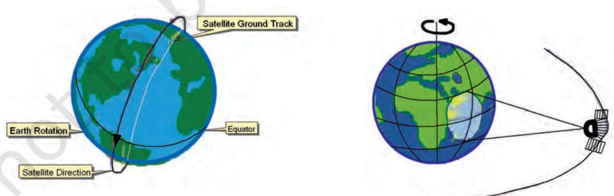

## Chapter 6

Introduction To Remote Sensing

# Introduction To Remote Sensing

Both the human eyes and the photographic systems respond to light in a minute portion of the total energy received and responded by the objects' surface. The present day remote sensing devices, on the other hand, react to much wider range of radiations reflected/ emitted, absorbed and transmitted by all object surfaces at a temperature above 0 Kelvin (-273°C).

The term remote sensing was first used in the early 1960s. Later, it was defined as the total processes used to acquire and measure the information of some property of objects and phenomena by a recording device (sensor) that is not in physical contact with the objects and phenomena in study. It can be noted from the above definition of remote sensing that it primarily involves an object surface, the recording device and the information carrying energy waves (Fig 6.1).

NATURAL SENSOR OBJECT SURFACE Energy Waves Figure 6.1 Conceptual Frame of Remote Sensing

69

#### Glossary

Absorptance : The ratio of the radiant energy absorbed by a substance to the energy it receives.

Band : The specific wavelength interval in the electromagnetic spectrum.

Digital image : An array of digital numbers (DN) arranged in rows and columns, having the property of an intensity value and their locations.

Digital Number : An intensity value of a pixel in a digital image.

Digital Image Processing : The numerical manipulation of DN values for the purpose of extracting information about the phenomena of the surface they represent.

Electromagnetic Radiation (EMR) : The Energy propagated through a space or a medium at a speed of light.

Electromagnetic Spectrum : The continuum of EMR that ranges from short wave high frequency cosmic radiations to long wavelength low frequency radio waves.

False Colour Composite (FCC) : An artificially generated colour image in which blue, green and red colours are assigned to the wavelength regions to which they do not belong in nature. For example, in standard a False Colour Composite blue is assigned to green radiations (0.5 to 0.6 µm), green is assigned to red radiations (0.6 to 0.7 µm and red is assigned to Near Infrared radiation (0.7 to 0.8 µm).

Gray scale : A medium to calibrate the variations in the brightness of an image that ranges from black to white with intermediate grey values.

Image : The permanent record of a scene comprising of natural and man-made features and activities, produced by photographic and non–photographic means.

Scene : The ground area covered by an image or a photograph.

Sensor : Any imaging or non–imaging device that receives EMR and converts it into a signal that can be recorded and displayed as photographic or digital image.

Reflectance : The ratio of the radiant energy reflected by a substance to the energy it receives.

Spectral Band : The range of the wavelengths in the continuous spectrum such as the green band ranges from 0.5 to .6 µ and the range of NIR band 0.7 to 1.1 µ.

70

## STAGES IN REMOTE SENSING

Figure 6.2 illustrates the processes used in remote sensing data acquisition. These basic processes that help in the collection of information about the properties of the objects and phenomena of the earth surface are as follows :

- (a) Source of Energy (sun/self-emission);
- (b) Transmission of energy from the source to the surface of the earth;
- (c) Interaction of energy with the earth's surface;
- (d) Propagation of reflected/emitted energy through atmosphere;
- (e) Detection of the reflected/emitted energy by the sensor;
- (f) Conversion of energy received into photographic/digital form of data;
- (g) Extraction of the information contents from the data products; and
- (h) Conversion of information into Map/Tabular forms.

Figure 6.2 Stages in Remote Sensing Data Acquisition

a. Source of Energy: Sun is the most important source of energy used in remote sensing. The energy may also be artificially generated and used to collect information about the objects and phenomena such as flashguns or energy beams used in radar (radio detection and ranging).

b. Transmission of Energy from the Source to the Surface of the Earth: The energy that emanates from a source propagates between the source and the object surface in the form of the waves of

energy at a speed of light (300,000 km per second). Such energy propagation is called the Electromagnetic Radiation (EMR). The energy waves vary in size and frequency. The plotting of such variations is known as the Electromagnetic Spectrum (Fig. 6.3). On the basis of the size of the waves and frequency, the energy waves are grouped into Gamma, X– rays, Ultraviolet rays, Visible rays, Infrared rays , Microwaves and Radio waves. Each one of these broad regions of spectrum is used in different applications. However, the visible, infrared and microwave regions of energy are used in remote sensing.

Figure 6.3 Electromagnetic Spectrum

c. Interaction of Energy with the Earth's Surface: The propagating energy finally interacts with the objects of the surface of the earth. This leads to absorption, transmission, reflection or emission of energy from the objects. We all know that all objects vary in their composition, appearance forms and other properties. Hence, the objects' responses to the energy they receive are also not uniform. Besides, one particular object also responds differently to the energy it receives in different regions of the spectrum (Fig. 6.5). For example, a fresh water body absorbs more energy in the red and infrared regions of the spectrum and appears dark/black in a satellite image whereas turbid water body reflects more in blue and green regions of spectrum and appears in light tone (Fig. 6.4).

72

Figure 6.4 Spectral Signature of Soil, Vegetation and Water

Figure 6.5 IRS 1 C Band 1 Green (Left) and Band 4 IR Images of Sambhar Lake, Rajasthan

d. Propagation of Reflected/Emitted Energy through

Atmosphere: When energy is reflected from objects of the earth's surface, it re–enters into the atmosphere. You may be aware of the fact that atmosphere comprises of gases, water molecules and dust particles. The energy reflected from the objects comes in contact with the atmospheric constituents and the properties of the original energy get modified. Whereas the Carbon dioxide (CO2 ) , the Hydrogen (H), and the water molecules absorb energy in the middle infrared region, the dust particles scatter the blue energy. Hence, the energy that is either absorbed or scattered by the atmospheric constituents never reaches to sensor placed onboard a satellite and the properties of the objects carried by such energy waves are left unrecorded.

#### e. Detection of Reflected/Emitted Energy by the Sensor:

The sensors recording the energy that they receive are placed in a near– polar sun synchronous orbit at an altitude of 700 – 900 km. These satellites are known as remote sensing satellites (e.g. Indian Remote Sensing Series). As against these satellites, the weather monitoring and telecommunication satellites are placed in a Geostationary position (the satellite is always positioned over its orbit that synchronises with the direction of the rotation of the earth) and revolves around the earth (coinciding with the direction of the movement of the earth over its axis) at an altitude of nearly 36,000 km (e.g. INSAT series of satellites). A comparison between the remote sensing and weather monitoring satellites is given in Box (6.1). Figure 6.6 shows the orbits of Sun Synchronous and Geostationary satellites respectively.

#### Box. 6.1 Comparison between Sun-Synchronous and Geostationary Satellites

- Orbital Sun Synchronous Geostationary Characteristics Satellites Satellites Altitude 700 – 900 km @ 36,000 km Coverage 810 N to 810 S 1/3rd of the Globe Orbital period @ 14 orbits per day 24 hours Resolution Fine Coarse (182 metre to 1 metre) (1 km x 1 km) Uses Earth Resources Telecommunication Applications and Weather monitoring
- 

Figure 6.6 Orbit of Sun Synchronous (Left) and Geostationary (Right) Satellites

Remote sensing satellites are deployed with sensors which are capable of collecting the EMR reflected by the objects. Photographic camera obtains photographs at an instance of exposure. However, the sensors used in remote sensing satellites possess a mechanism that is different from photographic camera in collecting and recording the information. The images so acquired by space-borne sensors are in digital format as against the photographic format obtained through a camera-based system.

f. Conversion of Energy Received into Photographic/ Digital Form of Data: The radiations received by the sensor are electronically converted into a digital image. It comprises digital numbers that are arranged in rows and columns. These numbers may also be converted into an analogue (picture) form of data product. The sensor onboard an earth-orbiting satellite electronically transmits the collected image data to an Earth Receiving Station located in different parts of the world. In India, one such station is located at Shadnagar near Hyderabad.

g. Extraction of Information Contents from Data Products: After the image data is received at the earth station, it is processed for elimination of errors caused during image data collection. Once the image is corrected, information extraction is carried out from digital images using digital image processing techniques and from analogue form of data products by applying visual interpretation methods.

h. Conversion of Information into Map/Tabular Forms: The interpreted information is finally delineated and converted into different layers of thematic maps. Besides, quantitative measures are also taken to generate a tabular data.

## SENSORS

Figure 6.6 Orbit of Sun Synchronous (Left) and Geostationary (Right) Satellites

A sensor is a device that gathers electromagnetic radiations, converts it into a signal and presents it in a form suitable for obtaining information about the objects under investigation. Based upon the form of the data output, the sensors are classified into photographic (analogue) and non–photographic (digital) sensors.

A photographic sensor (camera) records the images of the objects at an instance of exposure. On the other hand, a non–photographic sensor obtains the images of the objects in bit-by-bit form. These sensors are known as scanners. In the present chapter, we will confine ourselves to describe the non–photographic sensors that are used in satellite remote sensing.

Multispectral Scanners: In satellite remote sensing, the Multi Spectral Scanners (MSS) are used as sensors. These sensors are designed to obtain images of the objects while sweeping across the field of view. A scanner is usually made up of a reception system consisting of a mirror and detectors. A scanning sensor constructs the scene by recording a series of scan lines. While doing so, the motor device oscillates the scanning mirror through the angular field of view of the sensor, which determines the length of scan lines and is called swath. It is because of such reasons that the mode of collection of images by scanners is referred bit–by–bit. Each scene is composed of cells that determine the spatial resolution of an image. The oscillation of the scanning mirror across the scene directs the received energy to the detectors, where it is converted into electrical signals. These signals are further converted into numerical values called Digital Number (DN Values) for recording on a magnetic tape.

The Multi-Spectral Scanners are divided into the following types:

- (i) Whiskbroom Scanners
- (ii) Pushbroom Scanners

(i) Whiskbroom Scanners : The whiskbroom scanners are made up of a rotating mirror and a single detector. The mirror is so oriented that when it completes a rotation, the detector sweeps across the field of view

between 90° and 120° to obtain images in a large number of narrow spectral bands ranging from visible to middle infrared regions of the spectrum. The total extent of the oscillating sensor is known as the Total Field of View (TFOV) of the scanner. While scanning the entire field, the sensor's optical head is always placed at a particular dimension called the Instantaneous Field of View (IFOV). Figure 6.7 depicts the scanning mechanism of whiskbroom scanners.

(i) Pushbroom Scanners: The pushbroom scanners consist of a number of detectors which are equivalent to the number obtained by dividing the swath of the sensor by the size of the spatial resolution (Fig. 6.8). For example, the swath of High Resolution Visible Radiometer – 1 (HRVR – 1) of the French remote sensing satellite SPOT is 60 km and the spatial resolution is 20 metres. If we divide 60 km x 1000 metres/20 metres, we get a number of 3000 detectors that are deployed in SPOT HRV – 1 sensor. In pushbroom scanner, all detectors are linearly arrayed and each detector collects the energy reflected by the ground cell (pixel) dimensions of 20 metres at a nadir's view.

## RESOLVING POWERS OF THE SATELLITES

In satellite remote sensing, the sun-synchronous polar orbit enables the collection of images after a pre-determined periodical interval referred to as the temporal resolution or the revisit time of the satellite over the same area of the earth surface. Fig. 6.9 illustrates the two images acquired over two different periods in time for the same area enabling to study and record the changes that take place with respect to the types of vegetation in Himalayas. In another example, Fig. 6.10 (a and b) shows the images acquired before and after the tsunami in the Indian Ocean. The image acquired in June 2004 clearly shows the undisturbed topography of Banda Aceh in Indonesia, whereas the post tsunami image acquired immediately after tsunami reveals the damages that were caused by the tsunami.

Practical Work in Geography

Figure 6. 9 Images of Himalayas and Northern Indian Plain by IRS Satellite taken in May (Left) and November (Right) show differences in the types of vegetation. The red patches in May image refer to Coniferous vegetation. In November image the additional red patches refer to Deciduous plants and the light red colour is related to the crops.

Figure 6.10 (a) Pre-tsunami Image acquired in June 2004

Figure 6.10 (b) Post-tsunami image acquired in December, 2004

## SENSOR RESOLUTIONS

Remote sensors are characterised by spatial, spectral and radiometric resolutions that enable the extraction of useful information pertaining to different terrain conditions.

(i) Spatial Resolution: You must have seen some people using spectacles while reading a book or newspaper. Have you ever thought as to why they do so. It is simply because of the fact that resolving power of their eyes to differentiate two closed spaced letters in a word is unable to identify them as two different letters. By using positive spectacles they try to improve their vision as well as the resolving power. In remote sensing, the spatial resolution of the sensors refers to the same phenomena. It is the capability of the sensor to distinguish two closed spaced object surfaces as two different object surfaces. As a rule, with an increasing resolution the identification of even smaller object surfaces become possible.

(ii) Spectral Resolution: It refers to the sensing and recording power of the sensor in different bands of EMR (Electromagnetic radiation). Multispectral images are acquired by using a device that disperses the radiation received by the sensor and recording it by deploying detectors sensitive to specific spectral ranges. The principles in obtaining such images is the extension of the dispersion of light in nature resulting in the appearance of the 'rainbow" and the use of prism in the lab (Box 6.2).

The images obtained in different bands show objects response differently as discussed in Para 3 of the stages in remote sensing data acquisition. Fig. 6.11 illustrates images acquired in different spectral regions by IRS P - 6 (Resource sat - 1) showing strong absorption properties of fresh water in band 4 (Infrared) and mixed strong reflectance in band 2 (green) by dry surfaces (Fig. 6.11).

(iii) Radiometric Resolution: It is the capability of the sensor to discriminate between two targets. Higher the radiometric resolution, smaller the radiance differences that can be detected between two targets.

The spatial, spectral, and radiometric resolutions of some of the remote sensing satellites of the world are shown in Table 6.1.

| Table 6.1 Spatial, Spectral and Radiometric Resolution of Landsat, IRS |  |  |  |
| --- | --- | --- | --- |
| and SPOT Sensors |  |  |  |
| Satellite/Sensor | Spatial Resolution | Number of | Radiometric Range |
|  | (in metres) | Bands | (Number of Grey |
|  |  |  | Level Variations) |
| Landsat MSS (USA) | 80.0 × 80.0 | 4 | 0 - 64 |
| IRS LISS – I (India) | 72.5 × 72.5 | 4 | 0 - 127 |
| IRS LISS – II (India) | 36.25 × 36.25 | 4 | 0 - 127 |
| Landsat TM (USA) | 30.00 × 30.00 | 4 | 0 - 255 |
| IRS LISS III (India) | 23.00 × 23.00 | 4 | 0 - 127 |
| SPOT HRV - I (France) | 20.00 × 20.00 | 3 | 0 - 255 |
| SPOT HRV – II (France) | 10.00 × 10.00 | 1 | 0 - 255 |
| IRS PAN (India) | 5.80 × 5.80 | 1 | 0 - 127 |

Box : 6.2

#### RAINBOW (Natural Dispersion of Light)

#### PRISM (Artificial Dispersion of Light)

#### Dispersion of Light

(The principle that is utilised in obtaining Multispectral Images) The overall mechanism of obtaining images in a number of bands derives strength from the principle of the dispersion of light. You must have seen the rainbow. It is formed through a natural process of dispersion of light rays through water molecules present in the atmosphere. The same phenomena may be experimented by putting a beam of light at one side of a prism. At the other side of the prism you may notice the dispersion of energy into seven colours that form white light.

## 81

82

## DATA PRODUCTS

We have seen that the electromagnetic energy may be detected either photographically or electronically. The photographic process uses light sensitive film to detect and record energy variations. On the other hand, a scanning device obtains images in digital mode. It is important to distinguish between the terms – images and photographs. An image refers to pictorial representation, regardless of what regions of energy have been used to detect and record it. A photograph refers specifically to images that have been recorded on photographic film. Hence, it can be said that all photographs are images, but all images are not photographs.

Based upon the mechanism used in detecting and recording, the remotely sensed data products may be broadly classified into two types :

- ° Photographic Images
- ° Digital Images

Photographic Images: Photographs are acquired in the optical regions of electromagnetic spectrum, i.e. 0.3 – 0.9 µm. Four different types of light sensitive film emulsion bases are used to obtain photographs. These are black and white, colour, black and white infrared and colour infrared. However, in aerial photography black and white film is normally used. Photographs may be enlarged to any extent without loosing information contents or the contrast.

Digital Images: A digital image consists of discrete picture elements called pixels. Each one of the pixels in an image has an intensity value and an address in two-dimensional image space. A digital number (DN) represents the average intensity value of a pixel. It is dependent upon the electromagnetic energy received by the sensor and the intensity levels used to describe its range.

In a digital image, the reproduction of the details pertaining to the images of the objects is affected by the size of the pixel. A smaller size pixel is generally useful in the preservation of the scene details and digital representation. However, zooming of the digital image beyond certain extent produces loss of information and the appearance of pixels only. Using a digital image processing algorithms, the digital numbers representing their intensity level in an image may be displayed (Fig. 6.12).

84

Figure 6.12 Digital Image (top) and Part of it zoomed showing Pixel's brightness (left) and the associated Digital Numbers (right)

## INTERPRETATION OF SATELLITE IMAGERIES

The data obtained from the sensors is used for information extraction related to the forms, and patterns of the objects and phenomena of the earth's surface. We have seen that different sensors obtain photographic and digital data products. Hence, the extraction of both qualitative and quantitative properties of such features could be carried out using either visual interpretation methods or digital image processing techniques.

The visual interpretation is a manual exercise. It involves reading of the images of objects for the purpose of their identification. On the other hand, digital images require a combination of hardware and software to extract the desired information. It would not be possible to deliberate upon the digital image processing techniques under the constraints of time, equipments and accessories. Hence, only visual interpretation methods would be discussed.

#### Elements of Visual Interpretation

Whether we are conscious of it or not we use the form, size, location of the objects and their relationships with the surrounding objects to identify them in our day-to-day life. These characteristics of objects are termed as elements of visual interpretation. We can further group the characteristics of the objects into two broad categories, i.e. image characteristics and terrain characteristics. The image characteristics include tone or colour in which objects appear, their shape, size, pattern, texture and the shadow they cast. On the other hand, location and the association of different objects with their surrounding objects constitute the terrain characteristics.

1. Tone or Colour: We know that all objects receive energy in all regions of spectrum. The interaction of EMR with the object surface leads to the absorption, transmittance and reflection of energy. It is the reflected amount of the energy that is received and recorded by the sensor in tones of grey, or hues of colour in black and white, and colour images respectively. The variations in the tone or the colour depend upon the orientation of incoming radiations, surface properties and the composition of the objects. In other words, smooth and dry object surfaces reflect more energy in comparison to the rough and moist surfaces. Besides, the response of the objects also varies in different regions of the spectrum (Refer para 'C – Stages in remote sensing data acquisition'). For example, healthy vegetation reflects strongly in the infrared region because of the multiple-layered leaf structure and appears in a light tone or bright red

6.13 (a) Turbid river 6.13 (b) River with fresh water

colour in standard false colour composite and the scrubs appear in greyish red colour). Similarly, a fresh water body absorbs much of the radiations received by it and appears in dark tone or black colour, whereas the turbid water body appears in light tone or light bluish colour in FCC due to mixed response shown by the water molecules as well as suspended sand particles (Figures 6.13 a and b).

The colours in which different features of the earth's surfaces are recorded in remote sensing images are given in Table 6.2.

#### Table 6.2: Colour Signatures on Standard False Colour Composite of Earth Surface Features

| S. No. | Earth Surface Feature | Colour(In Standard FCC) |
| --- | --- | --- |
| 1. | Healthy Vegetation and |  |
|  | Cultivated Areas |  |
|  | Evergreen | Red to magenta |
|  | Deciduous | Brown to red |
|  | Scrubs | Light brown with red |
|  |  | patches |
|  | Cropped land | Bright red |
|  | Fallow land | Light blue to white |
| 2. | Waterbody |  |
|  | Clear water | Dark blue to black |
|  | Turbid waterbody | Light blue |
| 3. | Built – up area |  |
|  | High density | Dark blue to bluish green |
|  | Low density | Light blue |
| 4. | Waste lands/Rock outcrops |  |
|  | Rock outcrops | Light brown |
|  | Sandy deserts/River sand/ | Light blue to white |
|  | Salt affected |  |
|  | Deep ravines | Dark green |
|  | Shallow ravines | Light green |
|  | Water logged/Wet lands | Motelled black |

2. Texture: The texture refers to the minor variations in tones of grey or hues of colour. These variations are primarily caused by an aggregation of smaller unit features that fail to be discerned individually such as high density and low density residential areas; slums and squatter settlements; garbage and other forms of solid waste; and different types of crops and plants. The textural differences in the images of certain objects vary from smooth to coarse textures (Fig. 6.14 a and b). For example, dense residential areas in a large city form fine texture due to the concentration of the houses in a smaller area and the low-density residential areas produce a coarse texture. Similarly, in high resolution images the sugarcane or millet plants produce coarse texture in comparison to the fine texture of rice or wheat plants. One can also notice the coarse texture in the images of scrubbed lands if compared with the fine texture of lush green evergreen forests.

Figure 6.14 (a) Coarse texture Figure 6.14 (b) Fine texture image of of cropped land mangroves

3. Size: The size of an object as discerned from the resolution or scale of an image is another important characteristic of individual objects. It helps in distinctively identifying the industrial and industrial complexes with residential dwellings (Fig. 6.15), stadium in the heart of the city with the brick kilns at an urban fringe, size and hierarchy of the settlements, etc.

4. Shape: The general form and configuration or an outline of an individual object provides important clues in the interpretation of remote sensing images. The shape of some of the objects is so distinctive that make them easy to identify. For example, the shape of the Sansad Bhawan is typically distinct from many other built-up features. Similarly, a railway line can be readily distinguished from a road due to its long continuous linearity in shape with gradual change in its course (Figure 6.16). The

88

(a) Parts of Kolkata (b) Parts of Varanasi

Figure 6.15 Variations in size between institutional buildings and residential areas may be distinctly identified in the images of parts of Kolkata (a) and Varanasi (b)

Figure 6.16 Curvilinear shape of the Railway Tract is Distinctly different from Sharp Bending Roads.

shape also plays a deciding role in the identity of religious places such as mosques and temples as distinct features.

5. Shadow: Shadow of an object is a function of the sun's illumination angle and the height of the object itself. The shape of some of the objects is so typical that they could not be identified without finding out the length of the shadow they cast. For example, the Qutub Minar located in Delhi, minarets of mosques, overhead water tanks, electric or telephone lines, and similar features can only be identified using their shadow. Shadow also adversely affects the identifiability of the objects in city centres as it produces a dark tone, which dominates the original tone or colour of the features lying under the shadow of tall buildings. It may , however, be noted that the shadow as an element of image interpretation is of less use in satellite images. However, it serves a useful purpose in large-scale aerial photography.

6. Pattern: The spatial arrangements of many natural and man–made features show repetitive

appearance of forms and relationships. The arrangements can easily be identified from the images through the utilisation of the pattern they form. For example, planned residential areas with the same size and layout plan of the dwelling units in an urban area can easily be identified if their pattern is followed (Figure 6.17). Similarly, orchards and plantations produce arrangements of the same type of plants with uniform inter – plant distances. A distinction can also be made between various types of drainage or settlements if their pattern is properly studied and recognised.

Figure 6.17 Planned residential areas are easily identifiable using the pattern they form

7. Association: The association refers to the relationship between the objects and their surroundings along with their geographical location. For example, an educational institution always finds its association with its location in or near a residential area as well as the location of a playground within the same premises. Similarly, stadium, race course and golf course holds good for a large city, industrial sites along highway at the periphery of a growing city, and slums along drains and railway lines.

Internet sources for more information:

- www.isro.gov.in
- www.nrsc.gov.in
- www.iirs.gov.in

### EXERCISE

90

- 1. Choose the right answer from the four alternatives given below
	- (i) Remote sensing of objects can be done through various means such as A. remote sensors, B. human eyes and C. photographic system. Which of the following represents the true order of their evolution.
		- (a) ABC
		- (b) BCA
		- (c) CAB
		- (d) None of the above
	- (ii) Which of the following regions of Electromagnetic spectrum is not used in satellite remote sensing.
		- (a) Microwave region
		- (b) Infrared region
		- (c) X rays
		- (d) Visible region
	- (iii) Which of the following is not used in visual interpretation technique ?
		- (a) Spatial arrangements of objects
		- (b) Frequency of tonal change on the image
		- (c) Location of objects with respect to other objects
		- (d) Digital image processing
- 2. Answer the following questions in about 30 words.
	- (i) Why is remote sensing a better technique than other traditional methods?
	- (ii) Differentiate between IRS and INSAT series of satellites.
	- (iii) Describe in brief the functioning of pushbroom scanner.
- 3. Answer the following questions in about 125 words.
	- (i) Describe the operation of a whiskbroom scanner with the help of a diagram. Explain how it is different from pushbroom scanner.
	- (ii) Identify and list the changes that can be observed in the vegetation of Himalayas (Fig.6.9).

## ACTIVITY

Identify various features marked on IRS IC LISS III imagery shown below. Draw clues from the description of the elements of image interpretation discussed and the colours in which various objects appear on a Standard False Colour Composite.

