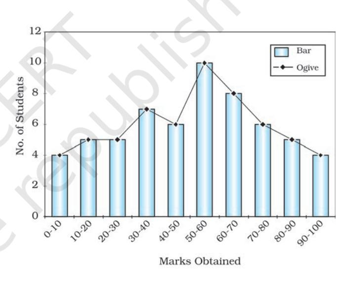

You must have seen and used various forms of data. For example, at the end of almost every news bulletin on Television, the temperatures recorded on that day in major cities are displayed. Similarly, the books on the Geography of India show data relating to the growth and distribution of population, and the production, distribution and trade of various crops, minerals and industrial products in tabular form. Have you ever thought what they mean? From where these data are obtained? How are they tabulated and processed to extract meaningful information from them ? In this chapter, we will deliberate on these aspects of the data and try to answer these many questions.

# What is Data? What is Data?What is Data?

The data are defined as numbers that represent measurements from the real world. Datum is a single measurement. We often read the news like 20 centimetres of continuous rain in Barmer or 35 centimetres of rain at a stretch in Banswara in 24 hours or information such as New Delhi – Mumbai distance via Kota – Vadodara is 1385 kilometres and via Itarsi - Manmad is 1542 kilometres by train. This numerical information is called data. It may be easily realised that there are large volume of data available around the world today. However, at times, it becomes difficult to derive logical conclusions from these data if they are in raw form. Hence, it is important to ensure that the measured information is algorithmically derived and/or logically deduced and/or statistically calculated from multiple data. Information is defined as either a meaningful answer to a query or a meaningful stimulus that can cascade into further queries.

# Need of Data Need of DataNeed of Data

Maps are important tools in studying geography. Besides, the distribution and growth of phenomena are also explained through the data in tabular form. We know that an interelationship exists between many phenomena over the surface of the earth. These interactions are influenced by many variables which can be explained best in quantitative terms. Statistical analysis of those variables has become a necessity today. For example, to study cropping pattern of an area, it is necessary to have statistical information about the cropped area, crop yield and production, irrigated area, amount of rainfall and inputs like use of fertiliser, insecticides, pesticides, etc. Similarly, data related to the total population, density, number of migrants, occupation of people, their salaries, industries, means of transportation and communication is needed to study the growth of a city. Thus, data plays an important role in geographical analysis.

# Presentation of the Data

You might have heard the story of a person who was travelling with his wife and a five-year old child. On his way, he had to cross a river. Firstly, he fathomed the depth of the river at four points as 0.6, 0.8, 0.9 and 1.5 metres. He calculated the average depth as 0.95 metres. His child's height was 1 metre. So, he led them to cross the river and his child drowned in the river. On the other bank, he sat pondering: "*Lekha Jokha Thahe, to Bachha Dooba Kahe*?" (Why did the child drown when average depth was within the reach of each one?). This is called statistical fallacy, which may deviate you from the real situation. So, it is important to collect the data to know the facts and figures, but equally important is the presentation of data. Today, the use of statistical methods in the analysis, presentation and in drawing conclusions plays a significant role in almost all disciplines, including geography, which use the data. It may, therefore, be inferred that the concentration of a phenomenon, e.g., population, forest or network of transportation or communication not only vary over space and time but may also be conveniently explained using the data. In other words, you may say that there is a shift from qualitative description to quantitative analysis in explaining the relationship among variables. Hence, analytical tools and techniques have become more important these days to make the study more logical and derive precise conclusion. Precise quantitative techniques are used right from the beginning of collecting and compiling data to its tabulation, organisation, ordering and analysis till the derivation of conclusions.

# Sources of Data Sources of DataSources of Data

The data are collected through the following ways. These are : 1. Primary Sources, and 2. Secondary Sources.

The data which are collected for the first time by an individual or the group of individuals, institution/organisations are called Primary sources of the data. On the other hand, data collected from any published or unpublished sources are called Secondary sources. *Fig. 1.1* shows the different methods of data collection.

# Sources of Primary Data

### 1. Personal Observations

It refers to the collection of information by an individual or group of individuals through direct observations in the field. Through a field survey, information about the relief features, drainage patterns, types of soil and natural vegetation, as well as, population structure, sex ratio, literacy, means of transport and communication, urban and rural settlements, etc., is collected. However, in

2

*Fig. 1.1 : Methods of Data Collection*

carrying out personal observations, the person(s) involved must have theoretical knowledge of the subject and scientific attitude for unbiased evaluation.

- 2. Interview
In this method, the researcher gets direct information from the respondent through dialogues and conversations. However, the interviewer must take the following precautions while conducting an interview with people of the area:

- (i) A precise list of items about which information is to be gathered from the persons interviewed be prepared.
3

Data–Its Source and Compilation

- (ii) The person(s) involved in conducting the interview should be clear about the objective of the survey.
- (iii) The respondents should be taken into confidence before asking any sensitive question and he/she be assured that the secrecy will be maintained.
- (iv) A congenial atmosphere should be created so that the respondent may explain the facts without any hesitation.
- (v) The language of the questions should be simple and polite so that the respondents feel motivated and readily agree to give the information asked for.
- (vi) Avoid asking any such question that may hurt the self-respect or the religious feelings of the respondent.
- (vii) At the end of the interview, ask the respondent what additional information he/she may provide, other than what has already been provided by him/her.
- (viii) Pay your thanks and gratefulness for sparing his/her valuable time for you.

#### 3. Questionnaire/Schedule

In this method, simple questions and their possible answers are written on a plain paper and the respondents have to tick-mark the possible answers from the given choices. At times, a set of structured questions are written and sufficient space is provided in the questionnaire where the respondent write their opinion. The objectives of the survey should be clearly mentioned in the questionnaire. This method is useful in carrying out the survey of a larger area. Even questionnaire can be mailed to far-flung places. The limitation of the method is that only the literate and educated people can be approached to provide the required information. Similar to the questionnaire that contains the questions pertaining to the matter of investigation is the schedule. The only difference between the questionnaire and the schedule is that the respondent himself/ herself fills up the questionnaires, whereas, a properly trained enumerator himself fills up schedules by asking question addressed to the respondents. The main advantage of schedule over the questionnaire is that the information from both literate and illiterate respondents can be collected.

#### 4. Other Methods

The data about the properties of soil and water are collected directly in the field

by measuring their characteristics using soil kit and water quality kit. Similarly, field scientists collect data about the health of the crops and vegetation using transducers (*Fig. 1.2*).

# Secondary Source of Data

Secondary sources of data consist of published and unpublished records which include government publications, documents and reports.

Published Sources

#### *1. Government Publications*

The publications of the various ministries and the departments of the Government of India, state governments and the District Bulletins are one of the most important sources of secondary information. These include the Census of India published by the Office of the Registrar General of India, reports of the National Sample Survey, Weather Reports of Indian Meteorological Department and Statistical Abstracts published by state governments, and the periodical reports published by different Commissions. Some of the government publications are shown in *Fig. 1.3*.

*Fig. 1.2 : Field Scientist taking Measures of Crop Health*

*Fig. 1.3 : Some of the Government Publications*

4

### *2. Semi/Quasi-government Publications*

The publications and reports of Urban Development Authorities and Municipal Corporations of various cities and towns, Zila Parishads (District Councils), etc. fall under this category.

### *3. International Publications*

The international publications comprise yearbooks, reports and monographs published by different agencies of the United Nations, such as United Nations Educational, Scientific and Cultural Organisation (UNESCO), United Nations Development Programme (UNDP), World Health Organisation (WHO), Food and Agricultural Organisation (FAO), etc. Some of the important publications of the United Nations that are periodically published are Demographic Year Book, Statistical Year Book and the Human Development Report (*Fig. 1.4*).

*Fig. 1.4 : Some of the United Nations Publications*

5

Data–Its Source and Compilation

The yearbooks, surveys, research reports and monographs published by newspapers and private organisations fall under this category.

### *5. Newspapers and Magazines*

The daily newspapers and the weekly, fortnightly and monthly magazines serve as easily accessible sources of secondary data.

### *6. Electronic Media*

*4. Private Publications*

The electronic media, specially the internet, has emerged as a major source of secondary data in recent times.

Unpublished Sources

### *1. Government Documents*

The unpublished reports, monographs and documents are yet another source of secondary data. These documents are prepared and maintained as unpublished record at different levels of governance. For example, the village level revenue records maintained by the *patwari* of respective villages serve as an important source of village-level information.

### *2. Quasi-government Records*

The periodical reports and the development plans prepared and maintained by different Municipal Corporations, District Councils and Civil Services departments are included in Quasi-government records.

#### *3. Private Documents*

These include unpublished reports and records of companies, trade unions, different political and apolitical organisations and residents' welfare associations.

# Tabulation and Classification of Data

The data collected from primary or secondary sources initially appear as a big jumble of information with the least of comprehension. This is known as raw data. To draw meaningful inferences and to make them usable the raw data requires tabulation and classification.

One of the simplest devices to summarise and present the data is the Statistical Table. It is a systematic arrangement of data in columns and rows. The purpose of table is to simplify the presentation and to facilitate comparisons. This table enables the reader to locate the desired information quickly. Thus, the tables make it possible for the analyst to present a huge mass of data in an orderly manner within a minimum of space.

# Data Compilation and Presentation

Data are collected, tabulated and presented in a tabular form either in absolute terms, percentages or indices.

#### Absolute Data

When data are presented in their original form as integers, they are called absolute data or raw data. For example, the total population of a country or a state, the total production of a crop or a manufacturing industry, etc. *Table 1.1* shows the absolute data of population of India and some of the selected states.

| State/ | India/State/ |  | Total Population |  |
| --- | --- | --- | --- | --- |
| UT Code | Union Territory |  |  |  |
|  |  | Persons | Males | Females |
| 1 | 2 | 3 | 4 | 5 |
|  | INDIA1 | 1,21,05,69,573 | 62,31,21,843 | 58,74,47,730 |
| 1. | Jammu and Kashmir2 | 1,25,41,302 | 66,40,662 | 59,00,640 |
| 2. | Himachal Pradesh | 68,64,602 | 34,81,873 | 33,82,729 |
| 3. | Punjab | 2,77,43,338 | 1,46,39,465 | 1,31,03,873 |
| 4. | Chandigarh3 | 10,55,450 | 5,80,663 | 4,74,787 |
| 5. | Uttarakhand | 1,00,86,292 | 51,37,773 | 49,48,519 |
| 6. | Haryana | 2,53,51,462 | 1,34,94,734 | 1,18,56,728 |
| 7. | National Capital | 1,67,87,941 | 89,87,326 | 78,00,615 |
|  | Territory of Delhi |  |  |  |
| 8. | Rajasthan | 6,85,48,437 | 3,55,50,997 | 3,29,97,440 |
| 9. | Uttar Pradesh | 19,98,12,341 | 10,44,80,510 | 9,53,31,831 |
| 10. | Bihar | 10,40,99,452 | 5,42,78,157 | 4,98,21,295 |

Table 1.1 : Population of India and Selected States/Union Territories, 2011

1 inclusive of all territorial boundary of India

2 excluding PoK

3 Union Territory

*Source : Census, 2011*

#### Percentage/Ratio

Some time data are tabulated in a ratio or percentage form that are computed from a common parameter, such as literacy rate or growth rate of population, percentage of agricultural products or industrial products, etc. *Table 1.2* presents

literacy rates of India over the decades in a percentage form. Literacy rate is calculated as :

|
|  |

#### Index Number

An index number is a statistical measure designed to show changes in variable or a group of related variables with respect to time, geographic Table 1.2 : Literacy Rate : 1951 – 2011

| Year | Person | Male | Female |
| --- | --- | --- | --- |
| 1951 | 18.33 | 27.16 | 8.86 |
| 1961 | 28.3 | 40.4 | 15.35 |
| 1971 | 34.45 | 45.96 | 21.97 |
| 1981 | 43.57 | 56.38 | 29.76 |
| 1991 | 52.21 | 64.13 | 39.29 |
| 2001 | 64.84 | 75.85 | 54.16 |
| 2011 | 73.0 | 80.9 | 64.6 |

7

Data–Its Source and Compilation

*Source: Census, 2011*

location or other characteristics. It is to be noted that index numbers not only measure changes over a period of time but also compare economic conditions of different locations, industries, cities or countries. Index number is widely used in economics and business to see changes in price and quantity. There are various methods for the calculation of index number. However, the simple aggregate method is most commonly used. It is obtained using the following formula:

$$\frac{\sum q_{\mathrm{l}}}{\sum q_{\mathrm{0}}}\times100$$

∑*q*1 = Total of the current year production

∑*q*0 = Total of the base year production

Generally, base year values are taken as 100 and index number is calculated thereupon. For example, *Table 1.3* shows the production of iron ore in India and the changes in index number from 1970–71 to 2000–01 taking 1970–71 as the base year. Table 1.3 : Production of Iron Ore in India

|  | Production | Calculation | Index Number |
| --- | --- | --- | --- |
|  | (in million tonnes) |  |  |
|  |  | 32 5 . |  |
| 1970-71 | 32.5 | × 100 32 5 . | 100 |
| 1980-81 | 42.2 | 42 2 . × 100 | 130 |
|  |  | 32 5 . |  |
|  |  | 53 7 . × 100 |  |
| 1990-91 | 53.7 | 32 5 . | 165 |
| 2000-01 | 67.4 | 67 4 . × 100 | 207 |
|  |  | 32 5 . |  |

*Source – India: Economic Year Book, 2005*

# Processing of Data

The processing of raw data requires their tabulation and classification in selected classes. For example, the data given in *Table 1.4* can be used to understand how they are processed.

We can see that the given data are ungrouped. Hence, the first step is to group data in order to reduce its volume and make it easy to understand.

|  |  |  |  |  | Table 1.4 : Score of 60 Students in Geography Paper |  |  |  |  |
| --- | --- | --- | --- | --- | --- | --- | --- | --- | --- |
| 47 | 02 | 39 | 64 | 22 | 46 | 28 | 02 | 09 | 10 |
| 89 | 96 | 74 | 06 | 26 | 15 | 92 | 84 | 84 | 90 |
| 32 | 22 | 53 | 62 | 73 | 57 | 37 | 44 | 67 | 50 |
| 18 | 51 | 36 | 58 | 28 | 65 | 63 | 59 | 75 | 70 |
| 56 | 58 | 43 | 74 | 64 | 12 | 35 | 42 | 68 | 80 |
| 64 | 37 | 17 | 31 | 41 | 71 | 56 | 83 | 59 | 90 |

# Grouping of Data Grouping of DataGrouping of Data

The grouping of the raw data requires determining of the number of classes in which the raw data are to be grouped and what will be the class intervals. The selection of the class interval and the number of classes, however, depends upon the range of raw data. The raw data given in *Table 1.4* ranges from 02 to 96. We can, therefore, conveniently choose to group the data into ten classes with an interval of ten units in each group, e.g. 0–10, 10–20, 20–30, etc. (*Table 1.5*).

| Group | Numerical of Raw Data | Tally Marks | Number of Individual |
| --- | --- | --- | --- |
| 0-10 | 02,02,09,06 |  | 4 |
| 10-20 | 10,15,18,12,17 |  | 5 |
| 20-30 | 22,28,26,22,28 |  | 5 |
| 30-40 | 39,32,37,36,35,37,31 |  | 7 |
| 40-50 | 47,46,44,43,42,41 |  | 6 |
| 50-60 | 53,57,50,51,58, |  | 10 |
|  | 59,56,58,56,59 |  |  |
| 60-70 | 64,62,67,65, |  | 8 |
|  | 63,64,68,64 |  |  |
| 70-80 | 74,73,75,70,74,71 |  | 6 |
| 80-90 | 89,84,84,80,83 |  | 5 |
| 90-100 | 96,92,90,90 |  | 4 |
|  |  |  | ∑ f = N = 60 |

Table 1.5 : Making Tally Marks to Obtain Frequency

# Process of Classification

Once the number of groups and the class interval of each group are determined, the raw data are classified as shown in *Table 1.5*. It is done by a method popularly known as Four and Cross Method or tally marks.

First of all, one tally mark is assigned to each individual in the group in which it is falling. For example, the first numerical in the raw data is 47. Since, it falls in the group of 40–50, one tally mark is recorded in the column 3 of *Table 1.5*.

### Frequency Distribution

In *Table 1.5* we have classified the raw data of a quantitative variable and have grouped them class-wise. The number of individuals (places in the fourth column of *Table 1.5*) is known as frequency and the column represents the frequency

distribution. It illustrates how the different values of a variable are distributed in different classes. Frequencies are classified as Simple and Cumulative frequencies.

### *Simple Frequencies*

It is expressed by *'f'* and represent the number of individuals falling in each group *(Table 1.6)*. The sum of all the frequencies, assigned to all classes, represents the total number of individual observations in the given series. In statistics, it is expressed by the symbol N that is equal to ∑ *f* . It is expressed as ∑ *f* = *N =* 60 (*Table 1.5* and *1.6*).

#### Table 1.6 : Frequency Distribution

| Group | f | Cf |
| --- | --- | --- |
| 00-10 | 4 | 4 |
| 10-20 | 5 | 9 |
| 20-30 | 5 | 14 |
| 30-40 | 7 | 21 |
| 40-50 | 6 | 27 |
| 50-60 | 10 | 37 |
| 60-70 | 8 | 45 |
| 70-80 | 6 | 51 |
| 80-90 | 5 | 56 |
| 90-100 | 4 | 60 |
|  | ∑ f = N = 60 |  |

9

Data–Its Source and Compilation

#### *Cumulative Frequencies*

It is expressed by '*Cf'* and can be obtained by adding successive simple frequencies in each group with the previous sum, as shown in the column 3 of *Table 1.6*. For example, the first simple frequency in *Table 1.6* is 4. Next frequency of 5 is added to 4 which gives a total of 9 as the next cumulative frequency. Likewise, add every next number until the last cumulative frequency of 60 is obtained. Note that it is equal to N or ∑ *f* .

Advantage of cumulative frequency is that one can easily make out that there are 27 individuals scoring less than 50 or that 45 out of 60 individuals lie below the score of 70.

Each simple frequency is associated with its group or class. The exclusive or inclusive methods are used for forming the groups or classes.

#### *Exclusive Method*

As shown in *Table 1.6*, two numbers are shown in its first column . Notice that the upper limit of one group is the same as the lower limit of the next group. For example, the upper limit of the one group (20 – 30) is 30, which is the lower limit of the next group (30 – 40), making 30 to appear in both groups. But any observation having the value of 30 is included in the group where it is at its lower limit and it is excluded from the group where it is the upper limit as (in 20-30 groups). That is why the method is known as exclusive method, i.e. a group is excluded of its upper limits. You may now make out where all the marginal values of *Table 1.4* will go.

The groups in *Table 1.6*, are interpreted in the following manner –

| 0 and under 10 | 10 and under 20 |
| --- | --- |
| 20 and under 30 | 30 and under 40 |
| 40 and under 50 | 50 and under 60 |
| 60 and under 70 | 70 and under 80 |
| 80 and under 90 | 90 and under100 |

Hence, in this type of grouping the class extends over ten units. For example, 20, 21, 22, 23, 24, 25, 26, 27, 28 and 29 are included in the third group.

#### *Inclusive Method*

In this method, a value equal to the upper limit of a group is included in the same group. Therefore, it is known as inclusive method. Classes are mentioned in a different form in this method, as shown in the first column of *Table 1.7*. Normally, the upper limit of a group differs by 1 with the lower limits of the next group. It is important to note that each group spreads over ten units in this method also. For example, the group of 50–59 includes the ten values i.e. 50, 51, 52, 53, 54, 55, 56, 57, 58 and 59 (*Table 1.7*). In this method, both the upper and

#### Table 1.7 : Frequency Distribution

| Group | f | Cf |
| --- | --- | --- |
| 0 – 9 | 4 | 4 |
| 10 – 19 | 5 | 9 |
| 20 – 29 | 5 | 14 |
| 30 – 39 | 7 | 21 |
| 40 – 49 | 6 | 27 |
| 50 – 59 | 10 | 37 |
| 60 – 69 | 8 | 45 |
| 70 – 79 | 6 | 51 |
| 80 – 89 | 5 | 56 |
| 90 – 99 | 4 | 60 |
|  | ∑ f = N = 60 |  |

lower limit are included to find the frequency distribution.

#### *Frequency Polygon*

A graph of frequency distribution is known as the frequency polygon. It helps in comparing two or more than two frequency distributions (*Fig.1.5*). The two frequencies are shown using a bar diagram and a line graph respectively.

#### *Ogive*

When the frequencies are added they are called cumulative frequencies and are listed in a table called

*Fig. 1.5 : Frequency Distribution Polygon*

cumulative frequency table. The curve obtained by plotting cumulative frequencies is called an Ogive (pronounced as ojive). It is constructed either by the less than method or the more than method*.*

In the less than method, we start with the upper limit of the classes and go on adding the frequencies. When these frequencies are plotted, we get a rising curve as shown in *Table 1.8* and *Fig. 1.6*.

In the more than method, we start with the lower limits of the classes and from the cumulative frequency, we substract frequency of each class. When these frequencies are plotted, we get a declining curve as shown in *Table 1.9* and *Fig 1.7*.

Both the *Figs. 1.5* and *1.6* may be combined to get a comparative picture of less than and more than Ogive as shown in *Table 1.10* and *Fig. 1.7*.

| less than Method |  |  |
| --- | --- | --- |
| Less than Method | Cf |  |
| Less than 10 | 4 |  |
| Less than 20 | 9 |  |
| Less than 30 | 14 |  |
| Less than 40 | 21 |  |
| Less than 50 | 27 |  |
| Less than 60 | 37 |  |
| Less than 70 | 45 |  |
| Less than 80 | 51 |  |
| Less than 90 | 56 |  |
| Less than 100 | 60 | Fig. 1.6 : Less than Ogive |

Table 1.8 : Frequency Distribution

Table 1.9 : Frequency Distribution more than Method

| More than Method | Cf |
| --- | --- |
| More than 0 | 60 |
| More than 10 | 56 |
| More than 20 | 51 |
| More than 30 | 44 |
| More than 40 | 38 |
| More than 50 | 28 |
| More than 60 | 20 |
| More than 70 | 14 |
| More than 80 | 9 |
| More than 90 | 4 |

| Marks | Less | More |
| --- | --- | --- |
| obtained than |  | than |
| 0 - 10 | 4 | 60 |
| 10 - 20 | 9 | 56 |
| 20 - 30 | 14 | 51 |
| 30 - 40 | 21 | 44 |
| 30 - 40 | 27 | 38 |
| 50 - 60 | 37 | 28 |
| 60 - 70 | 45 | 20 |
| 70 - 80 | 51 | 14 |
| 80 - 90 | 56 | 9 |
| 90 - 100 | 60 | 4 |

### Excercises E x c e r c i s e sE x c e r c i s e s

- 1. Choose the right answer from the four alternatives given below:
	- (i) A number or character which represents measurement is called (a) Digit (b) Data (c) Number (d) Character
	- (ii) A single datum is a single measurement from the (a) Table (b) Frequency (c) Real world (d) Information
	- (iii) In a tally mark grouping by four and crossing fifth is called
		- (a) Four and Cross Method (b) Tally Marking Method
		- (c) Frequency plotting Method (d) Inclusive Method
	- (iv) An Ogive is a method in which
		- (a) Simple frequency is measured
		- (b) Cumulative frequency is measured
		- (c) Simple frequency is plotted
		- (d) Cumulative frequency is plotted
	- (v) If both ends of a group are taken in frequency grouping, it is called
		- (a) Exclusive Method (b) Inclusive Method
		- (c) Marking Method (d) Statistical Method
- 2. Answer the following questions in about 30 words:
	- (i) Differentiate between data and information.
	- (ii) What do you mean by data processing?
	- (iii) What is the advantage of foot note in a table?
	- (iv) What do you mean by primary sources of data?
	- (v) Enumerate five sources of secondary data.
- 3. Answer the following questions in about 125 words:
	- (i) Discuss the national and international agencies where from secondary data may be collected.
	- (ii) What is the importance of an index number? Taking an example examine the process of calculating an index number and show the changes.

### Activity ctivity

- 1. In a class of 35 students of Geography, following marks were obtained out of 10 marks in unit test – 1, 0, 2, 3, 4, 5, 6, 7, 2, 3, 4, 0, 2, 5, 8, 4, 5, 3, 6, 3, 2, 7, 6, 5, 4, 3, 7, 8, 9, 7, 9, 4, 5, 4, 3. Represent the data in the form of a group frequency distribution.
- 2. Collect the last test result of Geography of your class and represent the marks in the form of a group frequency distribution.

