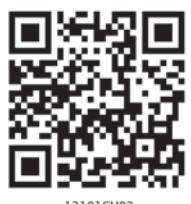
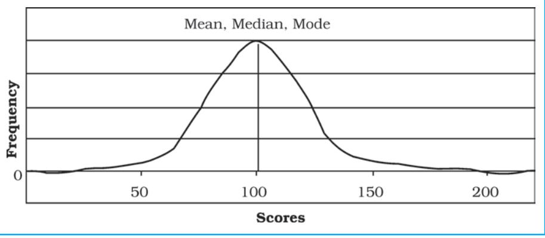
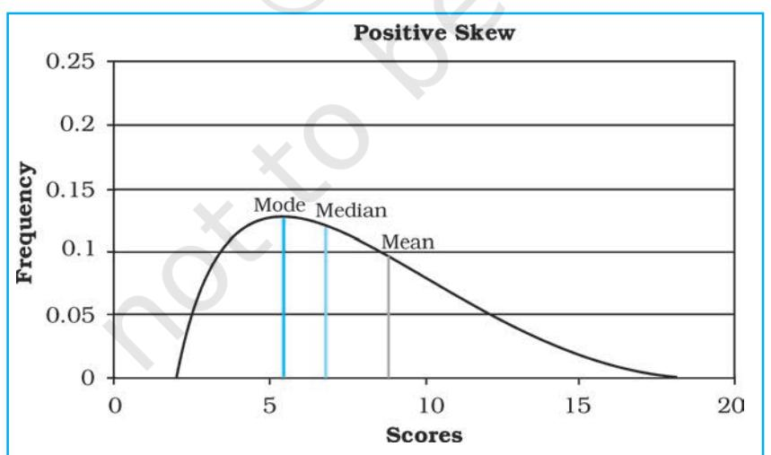
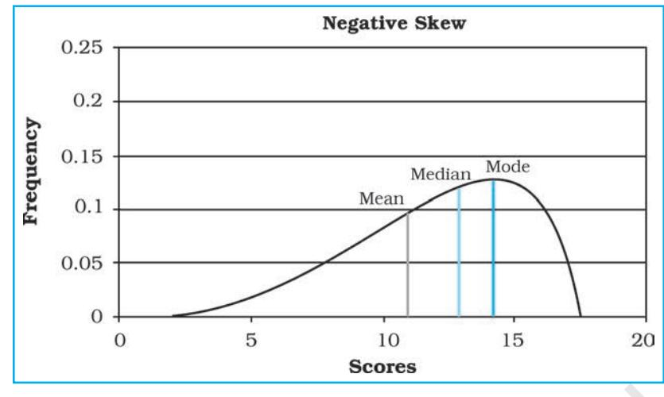

You have learnt in previous chapter that organising and presenting data makes them comprehensible. It facilitates data processing. A number of statistical techniques are used to analyse the data e.g.

- 1. Measures of Central Tendency
- 2. Measures of Dispersion
- 3. Measures of Relationship

While measures of central tendency provide the value that is an ideal representative of a set of observations, the measures of dispersion take into account the internal variations of the data, often around a measure of central tendency. The measures of relationship, on the other hand, provide the degree of association between any two or more related phenomena, like rainfall and incidence of flood or fertiliser consumption and yield of crops. In this chapter, you will learn the measures of central tendency.

# Measures of Central Tendency

The measurable characteristics such as rainfall, elevation, density of population, levels of educational attainment or age groups vary. If we want to understand them, how would we do ? We may, perhaps, require a single value or number that best represents all the observations. This single value usually lies near the centre of a distribution rather than at either extreme. The statistical techniques used to find out the centre of distributions are referred as measures of central tendency. The number denoting the central tendency is the representative figure for the entire data set because it is the point about which items have a tendency to cluster.

Measures of central tendency are also known as statistical averages. There are a number of the measures of central tendency, such as the mean, median and the mode.

### Mean

The mean is the value which is derived by summing all the values and dividing it by the number of observations.

#### Median

The median is the value of the rank, which divides the arranged series into two equal numbers. It is independent of the actual value. Arranging the data in ascending or descending order and then finding the value of the middle ranking number is the most significant in calculating the median. In case of the even numbers the average of the two middle ranking values will be the median.

### Mode

Mode is the maximum occurrence or frequency at a particular point or value. You may notice that each one of these measures is a different method of determining a single representative number suited to different types of the data sets.

### Mean

Mean is the simple arithmetic average of the different values of a variable. For ungrouped and grouped data, the methods for calculating mean are necessarily different. Mean can be calculated by direct or indirect methods, for both grouped and ungrouped data.

#### Computing Mean from Ungrouped Data

#### *Direct Method*

While calculating mean from ungrouped data using the direct method, the values for each observation are added and the total number of occurrences are divided by the sum of all observations. The mean is calculated using the following formula:

$${\overline{{\mathbf{X}}}}\ =\ \ {\frac{\sum x}{\mathrm{N}}}$$

Where,

X = Mean

  
  
## 1 Introduction  
  
The _quantum_ quantum mechanics is a quantum field theory of quantum mechanics. It is a quantum field theory of quantum mechanics.  
  

measures *x* = A raw score in a series of measures

- ∑ x = The sum of all the measures
- N = Number of
	- measures

*Example 2.1 :* Calculate the mean rainfall for Malwa Plateau in Madhya Pradesh from the rainfall of the districts of the region given in *Table 2.1:*

#### Table 2.1 : Calculation of Mean Rainfall

| Districts in |  | Normal Rainfall |  |
| --- | --- | --- | --- |
| Malwa Plateau |  | in mms | Indirect Method |
|  |  | x Direct Method | d= x-800* |
| Indore |  | 979 | 179 |
| Dewas |  | 1083 | 283 |
| Dhar |  | 833 | 33 |
| Ratlam |  | 896 | 96 |
| Ujjain |  | 891 | 91 |
| Mandsaur |  | 825 | 25 |
| Shajapur |  | 977 | 177 |
| ∑ x and ∑ d |  | 6484 | 884 |
| x d ∑ and | ∑ | 926.29 | 126.29 |
| N N |  |  |  |

* Where 800 is assumed mean.

d is deviation from the assumed mean.

The mean for the data given in *Table 2.1* is computed as under:

$${\overline{{{X}}}}=\ {\frac{{\sum{x}}}{{{N}}}}$$
  

$$=\ {\frac{{{6},{484}}}{{{7}}}}$$
  

$$=\ {926.29}$$

It could be noted from the computation of the mean that the raw rainfall data have been added directly and the sum is divided by the number of observations i. e., districts. Therefore, it is known as direct method.

# *Indirect Method*

For a large number of observations, the indirect method is normally used to compute the mean. It helps in reducing the values of the observations to smaller numbers by subtracting a constant value from them. For example, as shown in *Table 2.1*, the rainfall values lie between 800 and 1100 mm. We can reduce these values by selecting 'assumed mean' and subtracting the chosen number from each value. In the present case, we have taken 800 as assumed mean. Such an operation is known as coding. The mean is then worked out from these reduced numbers (Column 3 of *Table 2.1*).

The following formula is used in computing the mean using indirect method:

$${\overline{{\mathbf{X}}}}=\mathbf{\nabla}A+{\frac{\sum d}{N}}$$

Where,

*A* = Subtracted constant

∑ *d* = Sum of the coded scores

*N* = Number of individual observations in a series

Mean for the data as shown in *Table 2.1* can be computed using the indirect method in the following manner :

1 5

Data Processingrocessing

 rocessing

$${\overline{{\mathbf{X}}}}\ =\ {\mathbf{800}}\ +\ {\frac{\mathbf{884}}{7}}$$
  

$$={\mathbf{800}}{\mathbf{+}}{\frac{\mathbf{884}}{7}}$$

X mm = 926 29 .

Note that the mean value comes the same when computed either of the two methods.

## Computing Mean from Grouped Data

The mean is also computed for the grouped data using either direct or indirect method.

## *Direct Method*

When scores are grouped into a frequency distribution, the individual values lose their identity. These values are represented by the midpoints of the class intervals in which they are located. While computing the mean from grouped data using direct method, the midpoint of each class interval is multiplied with its corresponding frequency ( *f* ); all values of *fx* (the X are the midpoints) are added to obtain∑ *fx* that is finally divided by the number of observations i. e., N. Hence, mean is calculated using the following formula :

$$\begin{array}{r c l}{{\overline{{\mathbf{X}}}}}&{{=}}&{{\frac{\sum f x}{N}}}\end{array}$$

Where :

X = Mean

*f* = Frequencies

*x* = Midpoints of class intervals

*N* = Number of observations (it may also be defined as ∑ *f* )

*Example 2.2 :* Compute the average wage rate of factory workers using data given in *Table 2.2*:

| Table 2.2 : Wage Rate of Factory Workers |  |
| --- | --- |
| Wage Rate (Rs./day) | Number of workers (f) |
| Classes | f |
| 50 - 70 | 10 |
| 70 - 90 | 20 |
| 90 - 110 | 25 |
| 110 - 130 | 35 |
| 130 - 150 | 9 |

| Classes | f |
| --- | --- |
| 50 - 70 | 10 |
| 70 - 90 | 20 |
| 90 - 110 | 25 |
| 110 - 130 | 35 |
| 130 - 150 | 9 |

| Classes | Frequency | Mid- | fx | d=x-100 | fd | U = | fu |
| --- | --- | --- | --- | --- | --- | --- | --- |
|  | (f) | points |  |  |  | (x-100)/ |  |
|  |  | (x) |  |  |  | 20 |  |
| 50-70 | 10 | 60 | 600 | -40 | -400 | -2 | -20 |
| 70-90 | 20 | 80 | 1,600 | -20 | -400 | -1 | -20 |
| 90-110 | 25 | 100 | 2,500 | 0 | 0 | 0 | 0 |
| 110-130 | 35 | 120 | 4,200 | 20 | 700 | 1 | 35 |
| 130-150 | 9 | 140 | 1,260 | 40 | 360 | 2 | 18 |
| ∑ fx |  |  |  |  |  |  |  |
| and | ∑ f =99 |  | ∑ fx = |  | ∑ f d = |  | ∑ fu = |
| fx ∑ |  |  | 10,160 |  | 260 |  | 13 |

#### Table 2.3 : Computation of Mean

Where N = ∑ *f* = 99

*Table 2.3* provides the procedure for calculating the mean for grouped data. In the given frequency distribution, ninety-nine workers have been grouped into five classes of wage rates. The midpoints of these groups are listed in the third column. To find the mean, each midpoint (X) has been multiplied by the frequency ( *f* ) and their sum (∑ *fx* ) divided by N.

The mean may be computed as under using the given formula :

$$\overline{\mathrm{X}}=\sum{\frac{f x}{N}}$$
  

$$={\frac{10,160}{99}}$$
  

$$={102.6}$$

# *Indirect Method*

The following formula can be used for the indirect method for grouped data. The principles of this formula are similar to that of the indirect method given for ungrouped data. It is expressed as under

$$\begin{array}{r c l}{{\overline{{{x}}}}}&{{=}}&{{A\,\pm\,\,\,\,\sum{\mathit{f d}}}}\\ {{}}&{{}}&{{}}\end{array}$$

Where,

- *A* = Midpoint of the assumed mean group (The assumed mean group in *Table 2.3* is 90 – 110 with 100 as midpoint.)
*f* = Frequency

- *d* = Deviation from the assumed mean group (A)
*N* = Sum of cases or ∑ *f*

- *i* = Interval width (in this case, it is 20)
From *Table 2.3* the following steps involved in computing mean using the direct method can be deduced :

- (i) Mean has been assumed in the group of 90 110. It is preferably assumed from the class as near to the middle of the series as possible. This procedure minimises the magnitude of computation. In *Table 2.3*, A (assumed mean) is 100, the midpoint of the class 90 – 110.
1 7

Data Processingrocessing

 rocessing

- (ii) The fifth column (*u*) lists the deviations of midpoint of each class from the midpoint of the assumed mean group (90 – 110).
- (iii) The sixth column shows the multiplied values of each *f* by its corresponding *d* to give *fd*. Then, positive and negative values of *fd* are added separately and their absolute difference is found ( ∑ *f d* ). Note that the sign attached to ∑ *f d* is replaced in the formula following A, where ± is given.

The mean using indirect method is computed as under :

 *x A fd N* = ± ∑ = 100 + 260 99 = 100 + 2.6 = 102.6

*Note :* The Indirect mean method will work for both equal and unequal class intervals.

# Median

Median is a positional average*.* It may be defined "as the point in a distribution with an equal number of cases on each side of it"*.* The Median is expressed using symbol M.

#### Computing Median for Ungrouped Data

When the scores are ungrouped, these are arranged in ascending or descending order. Median can be found by locating the central observation or value in the arranged series. The central value may be located from either end of the series arranged in ascending or descending order. The following equation is used to compute the median :

# Value of $\rm\left(\dfrac{N+1}{2}\right)th$ item.  

*Example 2.3:* Calculate median height of mountain peaks in parts of the Himalayas using the following:

8,126 m, 8,611m, 7,817 m, 8,172 m, 8,076 m, 8,848 m, 8,598 m.

*Computation :* Median (M) may be calculated in the following steps :

- (i) Arrange the given data in ascending or descending order.
- (ii) Apply the formula for locating the central value in the series. Thus :

Value of (N + 1) th item 

$$=\left({\frac{7+1}{2}}\right)\mathrm{th}\ \mathrm{item}\ 1$$

$$z=\left({\frac{8}{2}}\right)\mathrm{th}\;\mathrm{item}$$

## 4th item in the arranged series will be the Median.

Arrangement of data in ascending order –

7,817; 8,076; 8,126; 8,172; 8,598; 8,611; 8,848

4th item

Hence,

M = 8,172 m

Computing Median for Grouped Data

When the scores are grouped, we have to find the value of the point where an individual or observation is centrally located in the group. It can be computed using the following formula :

$$\mathbf{M}=\mathbf{\mu}\mathbf{l}+\mathbf{\mu}\frac{i}{f}\left(\frac{\mathbf{N}}{2}-\mathbf{\mu}\mathbf{c}\right)$$

Where,

- M = Median for grouped data
- *l* = Lower limit of the median class
- *i* = Interval
- *f* = Frequency of the median class
- *N* = Total number of frequencies or number of observations
- *c* = Cumulative frequency of the pre-median class.

*Example 2.4 :* Calculate the median for the following distribution :

| class | 50-60 | 60-70 | 70-80 | 80-90 | 90-100 | 100-110 |
| --- | --- | --- | --- | --- | --- | --- |
| f | 3 | 7 | 11 | 16 | 8 | 5 |

## Table 2.4 : Computation of Median

| Class | Frequency | Cumulative | Calculation |
| --- | --- | --- | --- |
|  | (f) | Frequency (F) | of Median Class |
| 50-60 | 3 | 3 |  |
| 60-70 | 7 | 10 |  |
| 70-80 | 11 | 21c |  |
| 80-90 | 16 f | 37 | N DM= |
| (median group) |  |  | 2 |
| 90-100 | 8 | 45 |  |
|  |  |  | 50 = |
| 100-110 | 5 | 50 |  |
|  |  |  | 2 |
|  | f or ∑ |  | = 25 |
|  | N= 50 |  |  |

The median is computed in the steps given below :

- (i) The frequency table is set up as in *Table 2.4*.
- (ii) Cumulative frequencies (F) are obtained by adding each normal frequency of the successive interval groups, as given in column 3 of *Table 2.4*.

1 9

Data Processingrocessing

 rocessing

- (iii) Median number is obtained by *N* 2 i.e. 50 2 = 25 in this case, as shown in column 4 of *Table 2.4*.
- (iv) Count into the cumulative frequency distribution (F) from the top towards bottom until the value next greater than *N* 2 is reached. In this example, *N* 2 is 25, which falls in the Class interval of 40-44 with cumulative frequency of 37, thus the cumulative frequency of the premedian class is 21 and actual frequency of the median class is 16.
- (v) The median is then computed by substituting all the values determined in the step 4 in the following equation :

$$M=l+\frac{i}{f}(m-c)$$

  
= 80 + $\bf\frac{10}{16}$ (25 - 21)  
  
= 80 + $\bf\frac{5}{8}$× 4  
  
= 80 + $\bf\frac{5}{2}$  
  
= 80 + 2.5  
  
M = 82.5

# M o d e Mode

The value that occurs most frequently in a distribution is referred to as mode. It is symbolised as Z or M0 . Mode is a measure that is less widely used compared to mean and median. There can be more than one type mode in a given data set.

Computing Mode for Ungrouped Data

While computing mode from the given data sets all measures are first arranged in ascending or descending order. It helps in identifying the most frequently occurring measure easily.

*Example 2.5 :* Calculate mode for the following test scores in geography for ten students :

61, 10, 88, 37, 61, 72, 55, 61, 46, 22

*Computation :* To find the mode the measures are arranged in ascending order as given below:

10, 22, 37, 46, 55, 61, 61, 61, 72, 88.

The measure 61 occurring three times in the series is the mode in the given dataset. As no other number is in the similar way in the dataset, it possesses the property of being unimodal.

*Example 2.6 :* Calculate the mode using a different sample of ten other students, who scored:

82, 11, 57, 82, 08, 11, 82, 95, 41, 11.

*Computation :* Arrange the given measures in an ascending order as shown below :

08, 11, 11, 11, 41, 57, 82, 82, 82, 95

It can easily be observed that measures of 11 and 82 both are occurring three times in the distribution. The dataset, therefore, is bimodal in appearance. If three values have equal and highest frequency, the series is trimodal. Similarly, a recurrence of many measures in a series makes it multimodal. However, when there is no measure being repeated in a series it is designated as without mode*.*

# Comparison of Mean, Median and Mode

The three measures of the central tendency could easily be compared with the help of normal distribution curve. The normal curve refers to a frequency distribution in which the graph of scores often called a bell-shaped curve. Many

Practical W

human traits such as intelligence, personality scores and student achievements have normal distributions. The bell-shaped curve looks the way it does, as it is symmetrical. In other words, most of the observations lie on and around the middle value. As one approaches the extreme values, the number of observations reduces in a symmetrical manner. A normal curve can have high or low data variability. An example of a normal distribution curve is given in *Fig. 2.3*.

*Fig. 2.3 : Normal Distribution Curve*

The normal distribution has an important characteristic. The mean, median and mode are the same score (a score of 100 in *Fig. 2.3*) because a normal distribution is symmetrical. The score with the highest frequency occurs in the middle of the distribution and exactly half of the scores occur above the middle and half of the scores occur below. Most of the scores occur around the middle of the distribution or the mean. Very high and very low scores do not occur frequently and are, therefore, considered rare.

If the data are skewed or distorted in some way, the mean, median and mode will not coincide and the effect of the skewed data needs to be considered (*Fig. 2.4 and 2.5*).

2 1

Data Processingrocessing

 rocessing

*Fig. 2.4 : Positive Skew*

#### *Fig. 2.5 : Negative Skew*

# Excercises E x c e r c i s e sE x c e r c i s e s

1. Choose the correct answer from the four alternatives given below:

- (i) The measure of central tendency that does not get affected by extreme values:
	- (a) Mean (b) Mean and Mode
	-
	- (c) Mode (d) Median
- (ii) The measure of central tendency always coinciding with the hump of any distribution is:
	-
	- (a) Median (b) Median and Mode
	- (c) Mean (d) Mode
- 2. Answer the following questions in about 30 words:
	- (i) Define the mean.
	- (ii) What are the advantages of using mode ?
- 3. Answer the following questions in about 125 words:
	- (i) Explain relative positions of mean, median and mode in a normal distribution and skewed distribution with the help of diagrams.
	- (ii) Comment on the applicability of mean, median and mode (*hint: from their merits and demerits)*.

# Activity ctivity

- 1. Take an imaginary example applicable to geographical analysis and explain direct and indirect methods of calculating mean from ungrouped data.
