You must have seen graphs, diagrams and maps showing different types of data. For example, the thematic maps shown in Chapter 1 of book for Class XI entitled *Practical Work in Geography, Part-I (NCERT, 2006)* depict relief and slope, climatic conditions, distribution of rocks and minerals, soils, population, industries, general land use and cropping pattern in the Nagpur district, Maharashtra. These maps have been drawn using large volume of related data collected, compiled and processed. Have you ever thought what would have happened if the same information would have been either in tabular form or in a descriptive transcript? Perhaps, it would not have been possible from such a medium of communication to draw visual impressions which we get through these maps. Besides, it would also have been a time consuming task to draw inferences about whatever is being presented in non–graphical form. Hence, the graphs, diagrams and maps enhance our capabilities to make meaningful comparisons between the phenomena represented, save our time and present a simplified view of the characteristics represented. In the present chapter, we will discuss methods of constructing different types of graphs, diagrams and maps.

# Representation of Data

The data describe the properties of the phenomena they represent. They are collected from a variety of sources (Chapter 1). The geographers, economists, resource scientists and the decision makers use a lot of data these days. Besides the tabular form, the data may also be presented in some graphic or diagrammatic form. The transformation of data through visual methods like graphs, diagrams, maps and charts is called representation of data. Such a form of the presentation of data makes it easy to understand the patterns of population growth, distribution and the density, sex ratio, age–sex composition, occupational structure, etc. within a geographical territory. There is a Chinese proverb that *'a picture is equivalent to thousands of words'*. Hence, the graphic method of the representation of data enhances our understanding, and makes the comparisons easy. Besides, such methods create an imprint on mind for a longer time.

# General Rules for Drawing Graphs, Diagrams and Maps

### 1. Selection of a Suitable Method

Data represent various themes such as temperature, rainfall, growth and distribution of the population, production, distribution and trade of different commodities, etc. These characteristics of the data need to be suitably represented by an appropriate graphical method. For example, data related to the temperature or growth of population between different periods in time and for different countries/states may best be represented using line graphs. Similarly, bar diagrams are suited best for showing rainfall or the production of commodities. The population distribution, both human and livestock, or the distribution of the crop producing areas may suitably be represented on dot maps and the population density using choropleth maps.

#### 2. Selection of Suitable Scale

The scale is used as measure of the data for representation over diagrams and maps. Hence, the selection of suitable scale for the given data sets should be carefully made and must take into consideration entire data that is to be represented. The scale should neither be too large nor too small.

#### 3. Design

We know that the design is an important cartographic task (Refer 'Essentials of Map Making' as discussed in Chapter 1 of the *Practical Work in Geography, Part-I (NCERT, 2006),* a textbook of Class XI). The following components of the cartographic designs are important. Hence, these should be carefully shown on the final diagram/map.

#### *Title*

The title of the diagram/map indicates the name of the area, reference year of the data used and the caption of the diagram. These components are represented using letters and numbers of different font sizes and thickness. Besides, their placing also matters. Normally, title, subtitle and the corresponding year are shown in the centre at the top of the map/diagram.

#### *Legend*

A legend or index is an important component of any diagram/map. It explains the colours, shades, symbols and signs used in the map and diagram. It should also be carefully drawn and must correspond to the contents of the map/diagram. Besides, it also needs to be properly positioned. Normally, a legend is shown either at the lower left or lower right side of the map sheet.

#### *Direction*

The maps, being a representation of the part of the earth's surface, need be oriented to the directions. Hence, the direction symbol, i. e. North, should also be drawn and properly placed on the final map.

# Construction of Diagrams

The data possess measurable characteristics such as length, width and volume. The diagrams and the maps that are drawn to represent these data related characteristics may be grouped into the following types:

- (i) One-dimensional diagrams, such as line graph, poly graph, bar diagram, histogram, age, sex, pyramid, etc.;
- (ii) Two-dimensional diagram, such as pie diagram and rectangular diagram;

(iii) Three-dimensional diagrams, such as cube and spherical diagrams. It would not be possible to discuss the methods of construction of these many types of diagrams and maps primarily due to the time constraint. We will, therefore, describe the most commonly drawn diagrams and maps and the way they are constructed. These are :

- -
- Line graphs Bar diagrams
- Pie diagram Wind rose and star diagram

2 5

Graphical Representation of Data

- Flow Charts
# Line Graph

The line graphs are usually drawn to represent the time series data related to the temperature, rainfall, population growth, birth rates and the death rates. *Table 3.1* provides the data used for the construction of Fig 3.2.

# *Construction of a Line Graph*

- (a) Simplify the data by converting it into round numbers, such as the growth rate of population as shown in *Table 3.1* for the years 1961 and 1981 may be rounded to 2.0 and 2.2, respectively.
- (b) Draw X and Y-axis. Mark the time series variables (years/months) on the X axis and the data quantity/value to be plotted (growth of population in per cent or the temperature in 0C) on Y axis.
- (c) Choose an appropriate scale and label it on Y-axis. If the data involve a negative figure, then the selected scale should also show it as shown in *Fig. 3.1*.

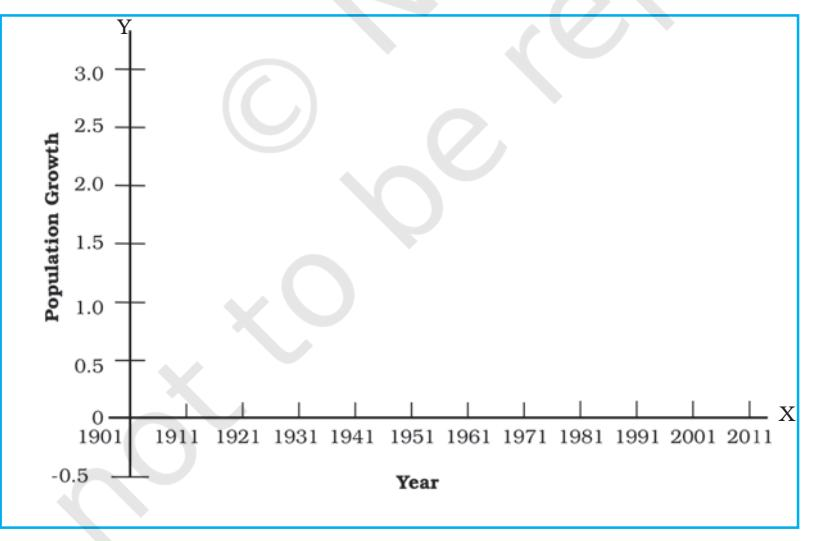

*Fig. 3.1 : Construction of a Line Graph*

- (d) Plot the data to depict year/month-wise values according to the selected scale on Y-axis, mark the location of the plotted values by a dot and join these dots by a free hand drawn line.
*Example 3.1 :* Construct a line graph to represent the data as given in *Table 3.1*:

| Year | Growth rate |
| --- | --- |
|  | in percentage |
| 1901 | - |
| 1911 | 0.56 |
| 1921 | -0.30 |
| 1931 | 1.04 |
| 1941 | 1.33 |
| 1951 | 1.25 |
| 1961 | 1.96 |
| 1971 | 2.20 |
| 1981 | 2.22 |
| 1991 | 2.14 |
| 2001 | 1.93 |
| 2011 | 1.79 |

Table 3.1 : Growth rate of Population in India – 1901 to 2011

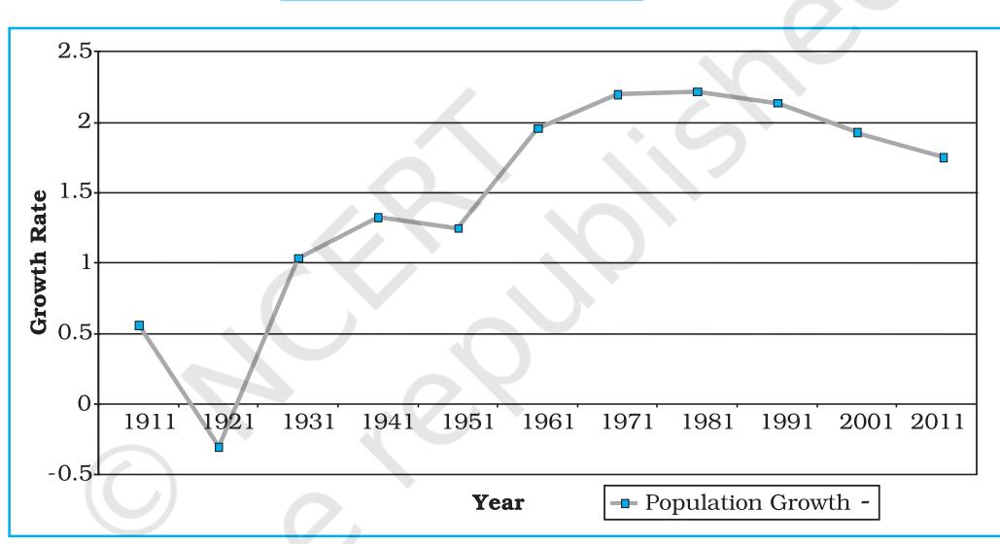

*Fig. 3.2 : Annual Growth of Population in India 1901-2011*

# Activity ctivity

Find out the reasons for sudden change in population between 1911 and 1921as shown in *Fig. 3.2*.

# *Polygraph*

Polygraph is a line graph in which two or more than two variables are shown by an equal number of lines for an immediate comparison, such as the growth rate of different crops like rice, wheat, pulses or the birth rates, death rates and life expectancy or sex ratio in different states or countries. A different line pattern such as straight line ( ____ ), broken line (- - - ), dotted line (……) or a combination of dotted and broken line (-.-.-) or line of different colours may be used to indicate the value of different variables (*Fig 3.3*).

*Example 3.2 :* Construct a polygraph to compare the growth of sex-ratio in different states as given in the *Table 3.2* :

|  |  |  | Selected Sates – 1961-2011 |  |  |  |
| --- | --- | --- | --- | --- | --- | --- |
| States/UT | 1961 | 1971 | 1981 | 1991 | 2001 | 2011 |
| Delhi | 785 | 801 | 808 | 827 | 821 | 866 |
| Haryana | 868 | 867 | 870 | 860 | 846 | 877 |
| Uttar Pradesh | 907 | 876 | 882 | 876 | 898 | 908 |

Table 3.2 : Sex-Ratio (Female per 1000 male) of Selected Sates – 1961-2011

*Source : Census, 2011*

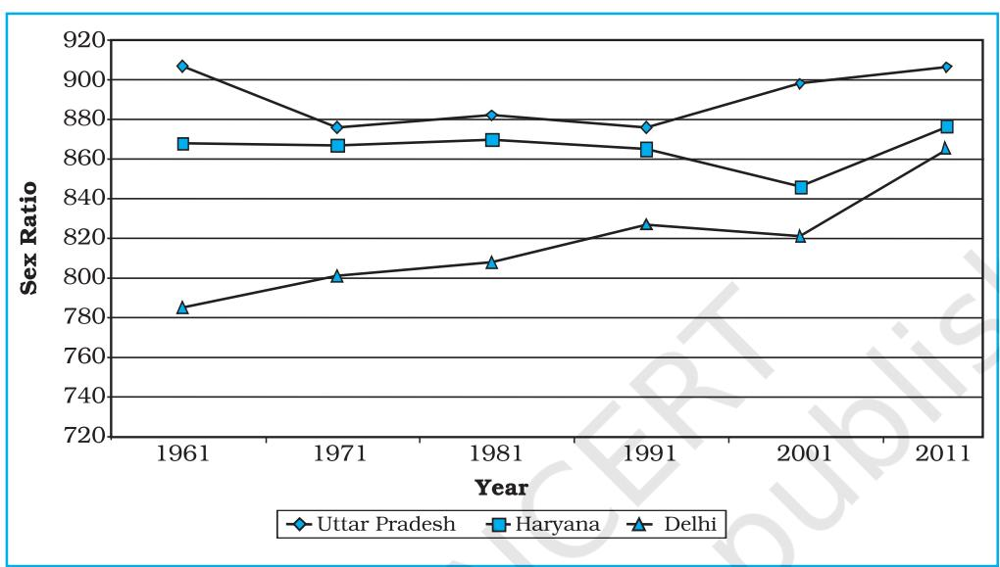

*Fig. 3.3 : Sex-Ratio of Selected States 1961-2011*

2 7

Graphical Representation of Data

# Bar Diagram

The bar diagrams are drawn through columns of equal width. It is also called a columnar diagram. Following rules should be observed while constructing a bar diagram:

- (a) The width of all the bars or columns should be similar.
- (b) All the bars should be placed on equal intervals/distance.
- (c) Bars may be shaded with colours or patterns to make them distinct and attractive.

The simple, compound or polybar diagram may be constructed to suit the data characteristics.

# *Simple Bar Diagram*

A simple bar diagram is constructed for an immediate comparison. It is advisable to arrange the given data set in an ascending or descending order and plot the data variables accordingly. However, time series data are represented according to the sequencing of the time period.

*Example 3.3 :* Construct a simple bar diagram to represent the rainfall data of Thiruvananthapuram as given in *Table 3.3* :

Table 3.3 : Average Monthly Rainfall of Thiruvananthapuram

| Months | J | F | M | A | M | J | J | A | S | O | N | D |
| --- | --- | --- | --- | --- | --- | --- | --- | --- | --- | --- | --- | --- |
| Rainfall in cm | 2.3 2.1 |  | 3.7 | 10.6 20.8 |  | 35.6 22.3 |  | 14.6 13.8 |  | 27.3 20.6 |  | 7.5 |

#### *Construction*

Draw X and Y-axes on a graph paper. Take an interval of 5 cm and mark it on Yaxis to plot rainfall data in cm. Divide X-axis into 12 equal parts to represent 12 months. The actual rainfall values for each month will be plotted according to the selected scale as shown in *Fig. 3.4*.

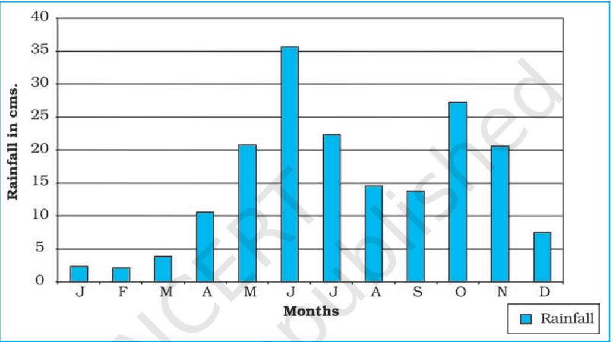

*Fig. 3.4 : Average Monthly Rainfall of Thiruvananthapuram*

#### *Line and Bar Graph*

The line and bar graphs as drawn separately may also be combined to depict the data related to some of the closely associated characteristics such as the climatic

data of mean monthly temperatures and rainfall. In doing so, a single diagram is drawn in which months are represented on X-axis while temperature and rainfall data are shown on Y-axis at both sides of the diagram.

*Example 3.4 :* Construct a line graph and bar diagram to represent the average monthly rainfall and temperature data of Delhi as given in *Table 3.4* :

| Table 3.4 : Average monthly Temperature |
| --- |
| and Rainfall in Delhi |

| Months | Temp. in °C | Rainfall in cm. |
| --- | --- | --- |
| Jan. | 14.4 | 2.5 |
| Feb. | 16.7 | 1.5 |
| Mar. | 23.30 | 1.3 |
| Apr. | 30.0 | 1.0 |
| May | 33.3 | 1.8 |
| June | 33.3 | 7.4 |
| Jul. | 30.0 | 19.3 |
| Aug. | 29.4 | 17.8 |
| Sep. | 28.9 | 11.9 |
| Oct. | 25.6 | 1.3 |
| Nov. | 19.4 | 0.2 |
| Dec. | 15.6 | 1.0 |

*Construction*

- (a) Draw X and Y-axes of a suitable length and divide X-axis into 12 parts to show months in a year.
- (b) Select a suitable scale with equal intervals of 5° C or 10° C for temperature data on the Y-axis and label it at its right side.
- (c) Similarly, select a suitable scale with equal intervals of 5 cm or 10 cm for rainfall data on the Y-axis and label at its left side.
- (d) Plot temperature data using line graph and the rainfall by bar diagram as shown in *Fig. 3.5*.

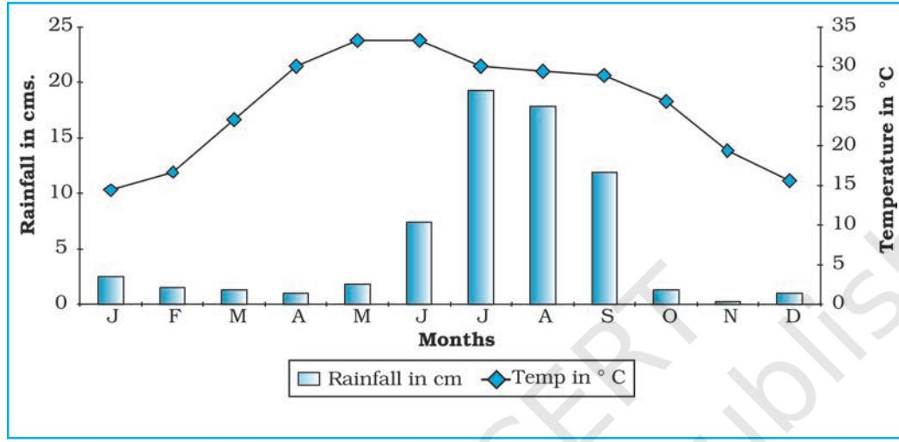

*Fig. 3.5 : Temperature and Rainfall in Delhi*

#### Multiple Bar Diagram

Multiple bar diagrams are constructed to represent two or more than two variables for the purpose of comparison. For example, a multiple bar diagram may be constructed to show proportion of males and females in the total, rural and urban population or the share of canal, tube well and well irrigation in the total irrigated area in different states.

*Example 3.5 :* Construct a suitable bar diagram to show decadal literacy rate in India during 1951–2011 as given in *Table 3.5* :

| Table 3.5 : Literacy Rate in India, |
| --- |
| 1951–2011 (in %) |

2 9

Graphical Representation of Data

| Year |  | Literacy Rate |  |
| --- | --- | --- | --- |
|  | Total population | Male | Female |
| 1951 | 18.33 | 27.16 | 8.86 |
| 1961 | 28.3 | 40.4 | 15.35 |
| 1971 | 34.45 | 45.96 | 21.97 |
| 1981 | 43.57 | 56.38 | 29.76 |
| 1991 | 52.21 | 64.13 | 39.29 |
| 2001 | 64.84 | 75.85 | 54.16 |
| 2011 | 73.0 | 80.9 | 64.6 |
| Source : Census, 2011 |  |  |  |

#### *Construction*

- (a) Multiple bar diagram may be chosen to represent the above data.
- (b) Mark time series data on X-axis and literacy rates on Y-axis as per the selected scale.

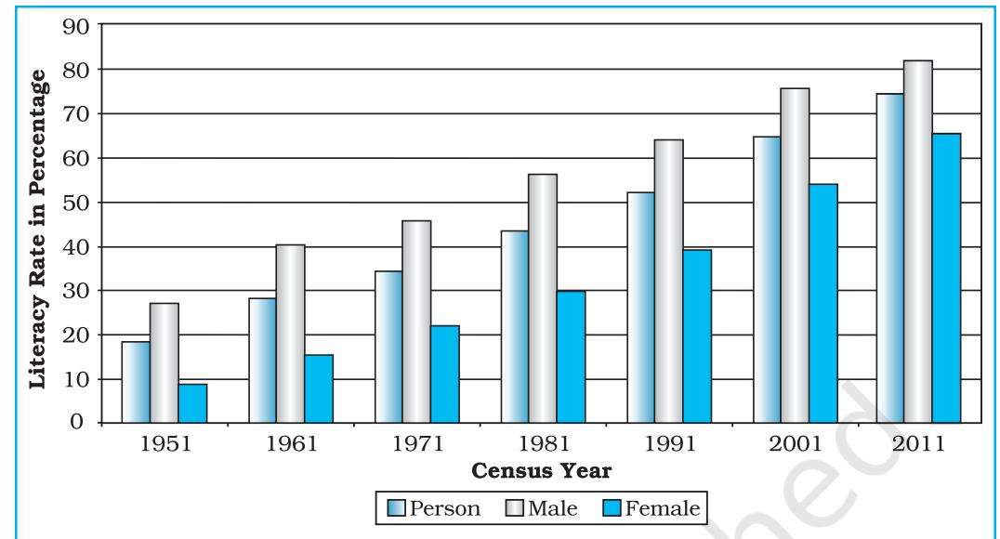

(c) Plot the per cent of total population, male and female in closed columns (*Fig 3.6*).

*Fig. 3.6 : Literacy Rate in India, 1951-2011*

### *Compound Bar Diagram*

When different components are grouped in one set of variable or different variables of one component are put together, their representation is made by a compound bar diagram. In this method, different variables are shown in a single bar with different rectangles.

*Example 3.6 :* Construct a compound bar diagram to depict the data as shown in *Table 3.6* :

| Table 3.6 : Gross Generation of Electricity in India (in Billion KWh) |
| --- |

| Year | Thermal | Hydro | Nuclear | Total |
| --- | --- | --- | --- | --- |
| 2008-09 | 616.2 | 110.1 | 14.9 | 741.2 |
| 2009-10 | 677.1 | 104.1 | 18.6 | 799.8 |
| 2010-11 | 704.3 | 114.2 | 26.3 | 844.8 |

*Source: Economic Survey, 2011-12*

### *Construction*

- (a) Arrange the data in ascending or descending order.
- (b) A single bar will depict the gross electricity generation in the given year and the generation of thermal, hydro and nuclear electricity be shown by dividing the total length of the bar as shown in *Fig 3.7*.

Practical W

30

# Pie Diagram

Pie diagram is another graphical method of the representation of data. It is drawn to depict the total value of the given attribute using a circle. Dividing the circle into corresponding degrees of angle then represent the sub-sets of the data. Hence, it is also called Divided Circle Diagram.

The angle of each variable is calculated using the following formulae.

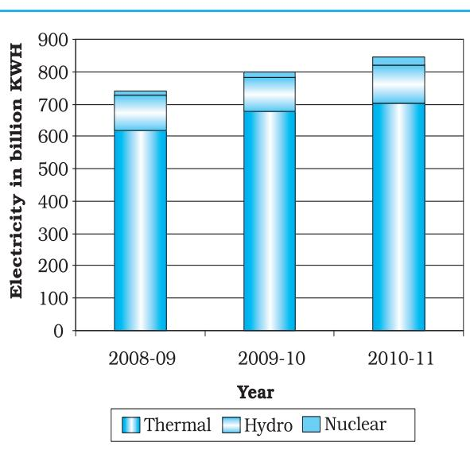

*Fig. 3.7 : Gross Electricity Generation in India*

### Value of given State/Region X 360

Total Value of All States/Regions

If data are given in percentage form, the angles are calculated using the given formulae.

# Percentage of x X 360 100

For example, a pie diagram may be drawn to show the total population of India along with the proportion of the rural and urban population. In this case, the circle of an appropriate radius is drawn to represent the total population and its sub-divisions into rural and urban population are shown by corresponding degrees of angle.

*Example 3.7:* Represent the data as given in *Table 3.7 (a)* with a suitable diagram.

*Calculation of Angles*

- (a) Arrange the data on percentages of Indian exports in an ascending order.
- (b) Calculate the degrees of angles for showing the given values of India's export to major regions/ countries of the world,

Table 3.7 (a) : India's Export to Major Regions of the World in 2010–11

3 1

Graphical Representation of Data

| Unit/Region | % of Indian Export |
| --- | --- |
| Europe | 20.2 |
| Africa | 6.5 |
| America | 14.8 |
| Asia and ASEAN | 56.2 |
| Others | 2.3 |
| Total | 100 |

*Source : Economic Survey 2011-12*

*Table 3.7* (b). It could be done by multiplying percentage with a constant of 3.6 as derived by dividing the total number of degrees in a circle by 100, i. e. 360/100.

- (c) Plot the data by dividing the circle into the required number of divisions to show the share of India's export to different regions/countries (*Fig. 3.8*).

| Countries | % | Calculation | Degree |
| --- | --- | --- | --- |
| Europe | 20.2 | 20.2 × 3.6 = 72.72 | 73° |
| Africa | 6.5 | 6.5 × 3.6 = 23.4 | 23° |
| America | 14.8 | 14.8 × 3.6 = 53.28 | 53° |
| Asia and ASEAN | 56.2 | 56.2 × 3.6 = 202.32 | 203° |
| Others | 2.3 | 2.3 × 3.6 = 8.28 | 8° |
| Total | 100 |  | 360° |

Table 3.7 (b) : India's Export to Major Regions of the World in 2010-11

#### *Construction*

- (a) Select a suitable radius for the circle to be drawn. A radius of 3, 4 or 5 cm may be chosen for the given data set.
- (b) Draw a line from the centre of the circle to the arc as a radius.
- (c) Measure the angles from the arc of the circle for each category of vehicles in an ascending order clock-wise, starting with smaller angle.
- (d) Complete the diagram by adding the title, sub-title, and the legend. The legend mark be chosen for each variable/category and highlighted by distinct shades/colours.

#### *Precautions*

- (a) The circle should neither be too big to fit in the space nor too small to be illegible.
- (b) Starting with bigger angle will lead to accumulation of error leading to the plot of the smaller angle difficult.

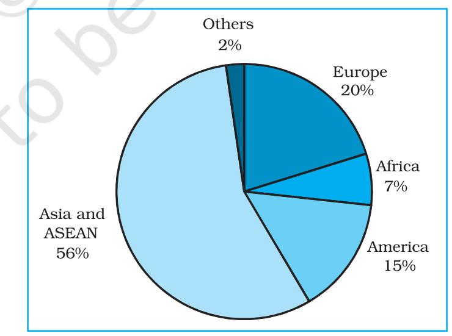

*Fig. 3.8 : Direction of Indian Exports 2010–11*

# Flow Maps/Chart

Flow chart is a combination of graph and map. It is drawn to show the flow of commodities or people between the places of origin and destination. It is also called Dynamic Map. Transport map, which shows the number of passengers, vehicles, etc., is the best example of a flow chart. These charts are drawn using lines of proportional width. Many government agencies prepare flow maps to show density of the means of transportation on different routes. The flow maps/ charts are generally drawn to represent two the types of data as given below:

- 1. The number and frequency of the vehicles as per the direction of their movement
- 2. The number of the passengers and/or the quantity of goods transported.

## *Requirements for the Preparation of a Flow Map*

- (a) A route map depicting the desired transport routes along with the connecting stations.
- (b) The data pertaining to the flow of goods, services, number of vehicles, etc., along with the point of origin and destination of the movements.
- (c) The selection of a scale through which the data related to the quantity of passengers and goods or the number of vehicles is to be represented.

*Example 3.10 :* Construct a flow map to represent the number of trains running in Delhi and the adjoining areas as given in the *Table 3.8*.

### *Construction*

- (a) Take an outline map of Delhi and adjoining areas, in which railway line and the nodal stations are depicted (*Fig.3.9*).
- (b) Select a scale to represent the number of trains. Here, the maximum number is 50 and the minimum is 6. If we select a scale of 1cm = 50 trains, the maximum and minimum numbers will be represented by a strip of 10 mm and 1.2 mm thick lines, respectively, on the map.
- (c) Plot the thickness of each strip of route between the given rail route (*Fig. 3.10*).

| Table 3.8 : No. of trains of selected routes of |
| --- |
| Delhi and adjoining areas |

| S. | Railway | No. of |
| --- | --- | --- |
| No. | Routes | Trains |
| 1. | Old Delhi – New Delhi | 50 |
| 2. | New Delhi-Nizamuddin | 40 |
| 3. | Nizamuddin-Badarpur | 30 |
| 4. | Nizamuddin-Sarojini Nagar | 12 |
| 5. | Sarojini Nagar – Pusa Road | 8 |
| 6. | Old Delhi – Sadar Bazar | 32 |
| 7. | Udyog Nagar-Tikri Kalan | 6 |
| 8. | Pusa Road – Pehladpur | 15 |
| 9. | Sahibabad-Mohan Nagar | 18 |
| 10. | Old Delhi – Silampur | 33 |
| 11. | Silampur – Nand Nagari | 12 |
| 12. | Silampur-Mohan Nagar | 21 |
| 13. | Old Delhi-Shalimar Bagh | 16 |
| 14. | Sadar Bazar-Udyog Nagar | 18 |
| 15. | Old Delhi – Pusa Road | 22 |
| 16. | Pehladpur – Palam Vihar | 12 |

3 3

Graphical Representation of Data

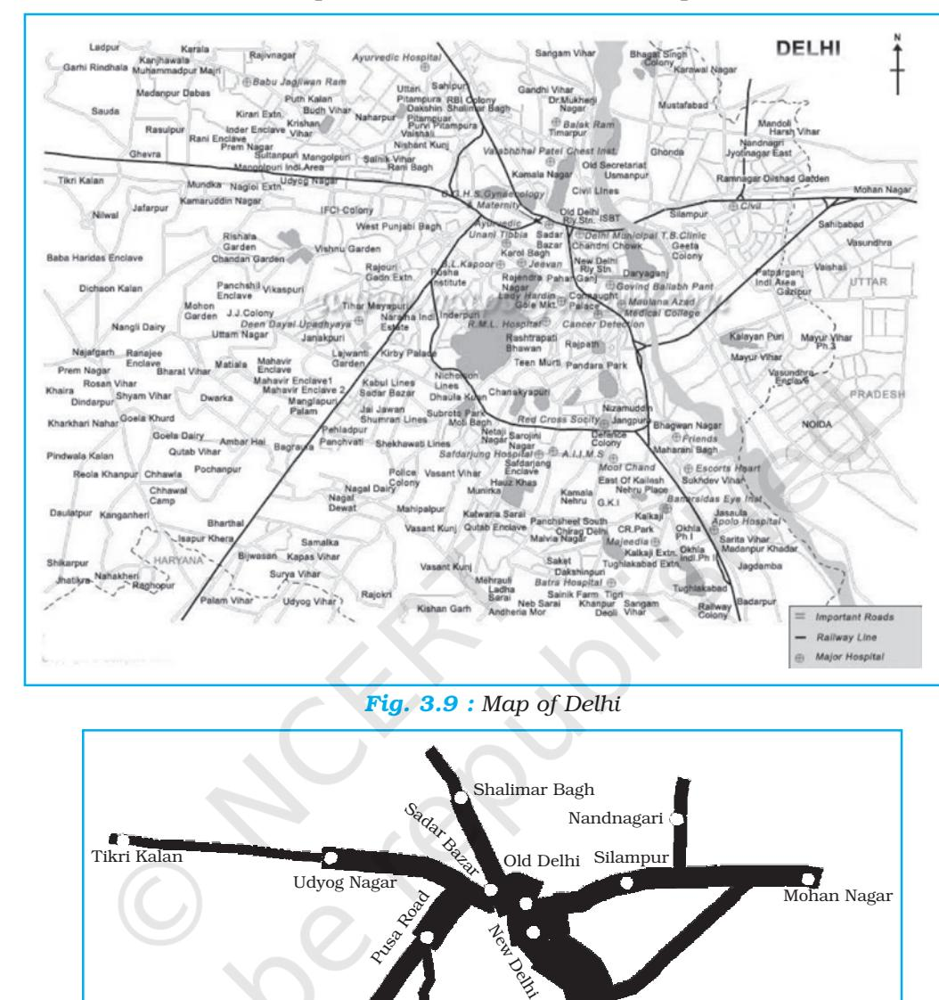

- (d) Draw a terraced scale as legend and choose distinct sign or symbol to show the nodal points (stations) within the strip.
*Fig. 3.10 : Traffic (Railway) Flow Map of Delhi*

10 5 No. Of Trains

Palam Vihar Badarpur

Nizamuddin

Practical Wractical Wractical Work in Geography, Part-II

50

40 30

20

34

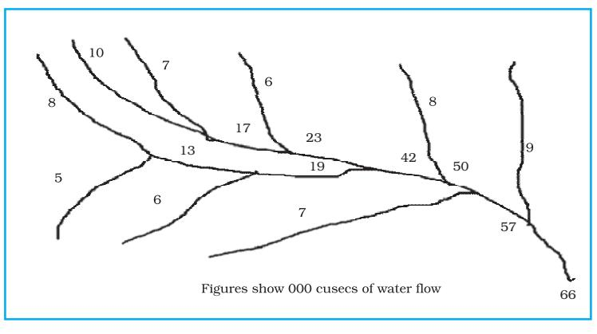

*Example 3.11 :* Construct a water flow map of Ganga Basin as shown in *Fig. 3.11.*

*Fig. 3.11 : Ganga Basin*

# *Construction*

- (a) Take a scale as a strip of 1cm width = 50,000 cusecs of water.
- (b) Make the diagram as shown in *Fig. 3.12*.

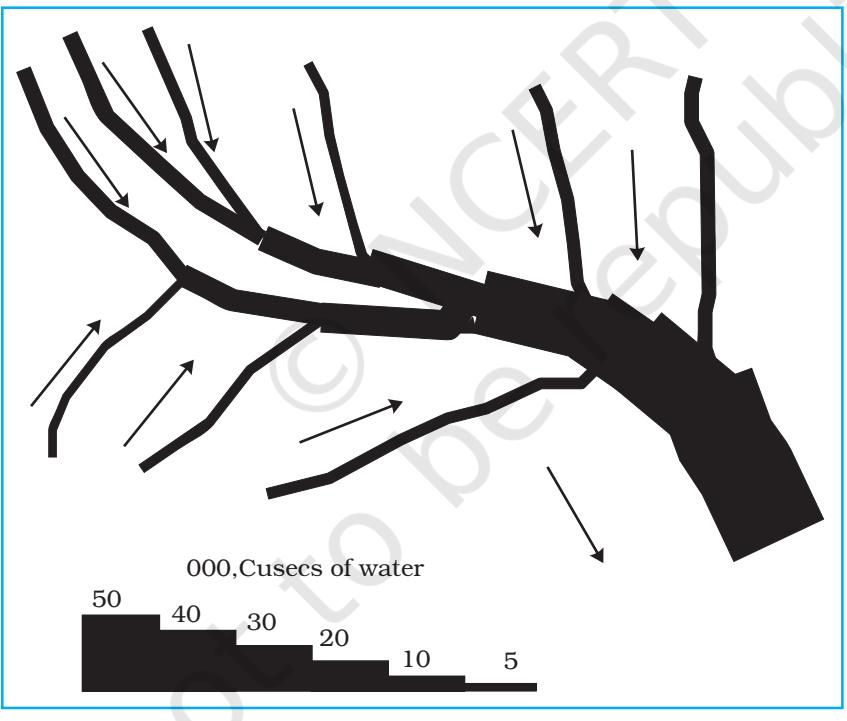

*3 5* 

*Graphical Representation of Data*

*Fig. 3.12 : Construction of a Flow Map*

# Thematic Maps

Graphs and diagrams serve a useful purpose in providing a comparison between the internal variations within the data of different characteristics represented. However, the use of graphs and diagrams, at times, fails to produce a regional perspective. Hence, variety of maps may also be drawn to understand the patterns of the regional distributions or the characteristics of variations over space. These maps are also known as the distribution maps.

*Requirements for Making a Thematic Map*

- (a) State/District level data about the selected theme.
- (b) Outline map of the study area alongwith administrative boundaries.
- (c) Physical map of the region. For example, physiographic map for population distribution and relief and drainage map for constructing transportation map.

*Rules for Making Thematic Maps*

- (i) The drawing of the thematic maps must be carefully planned. The final map should properly reflect the following components:
	- a. Name of the area
	- b. Title of the subject-matter
	- c. Source of the data and year
	- d. Indication of symbols, signs, colours, shades, etc.
	- e. Scale

(ii) The selection of a suitable method to be used for thematic mapping.

# Classification of Thematic Maps based on Method of Construction

The thematic maps are, generally, classified into quantitative and non-quantitative maps. The quantitative maps are drawn to show the variations within the data. For example, maps depicting areas receiving more than 200 cm, 100 to 200 cm, 50 to 100 cm and less than 50 cm of rainfall are referred as quantitative maps. These maps are also called statistical maps. The non-quantitative maps, on the other hand, depict the non-measurable characteristics in the distribution ofgiven information, such as a map showing high and low rainfall-receiving areas. These maps are also called qualitative maps. It would not be possible to discuss drawing these different types of thematic maps under the constraint of time. We will, therefore, confine to discuss the methods of the construction of the following types of quantitative maps :

- (a) Dot maps
- (b) Choropleth maps
- (c) Isopleth maps

#### Dot Maps

The dot maps are drawn to show the distribution of phenomena such as population, cattle, types of crops, etc. The dots of same size as per the chosen scale are marked over the given administrative units to highlight the patterns of distributions.

#### *Requirement*

- (a) An administrative map of the given area showing state/district/block boundaries.
36

- (b) Statistical data on selected theme for the chosen administrative units, i.e., total population, cattle, etc.
- (c) Selection of a scale to determine the value of a dot.
- (d) Physiographic map of the region, especially relief and drainage maps.

# *Precaution*

- (a) The lines, demarcating the boundaries of various administrative units, should not be very thick and bold.
- (b) All dots should be of same size.

*Example 3.12 :* Construct a dot map to represent population data of 2001 as given in *Table 3.9*.

| Sl. | States/Union | Total Population | No. |
| --- | --- | --- | --- |
| No. | Territories |  | of dots |
| 1. | Jammu & Kashmir | 10,069,917 | 100 |
| 2. | Himachal Pradesh | 6,077,248 | 60 |
| 3. | Punjab | 24,289,296 | 243 |
| 5. | Uttarakhand | 8,479,562 | 85 |
| 6. | Haryana | 21,082,989 | 211 |
| 7. | Delhi | 13,782,976 | 138 |
| 8. | Rajasthan | 56,473,122 | 565 |
| 9. | Uttar Pradesh | 166,052,859 | 1,660 |
| 10. | Bihar | 82,878,796 | 829 |
| 11. | Sikkim | 540,493 | 5 |
| 12. | Arunachal Pradesh | 1,091,117 | 11 |
| 13. | Nagaland | 1,988,636 | 20 |
| 14. | Manipur | 2,388,634 | 24 |
| 15. | Mizoram | 891,058 | 89 |
| 16. | Tripura | 3,191,168 | 32 |
| 17. | Meghalaya | 2,306,069 | 23 |
| 18. | Assam | 26,638,407 | 266 |
| 19. | West Bengal | 80,221,171 | 802 |
| 20. | Jharkhand | 26,909,428 | 269 |
| 21. | Odisha | 36,706,920 | 367 |
| 22. | Chhattisgarh | 20,795,956 | 208 |
| 23. | Madhya Pradesh | 60,385,118 | 604 |
| 24. | Gujarat | 50,596,992 | 506 |
| 25. | Maharashtra | 96,752,247 | 968 |
| 26. | Andhra Pradesh | 75,727,541 | 757 |
| 27. | Karnataka | 52,733,958 | 527 |
| 28. | Goa | 1,343,998 | 13 |
| 29. | Kerala | 31,838,619 | 318 |
| 30. | Tamil Nadu | 62,110,839 | 621 |

# Table 3.9 : Population of India, 2001

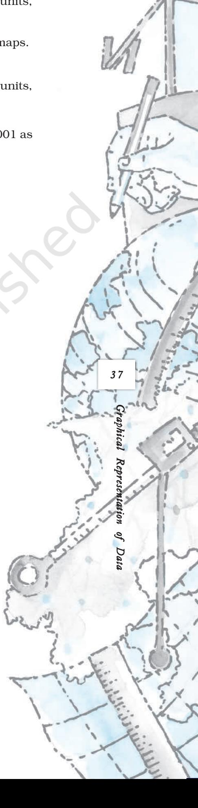

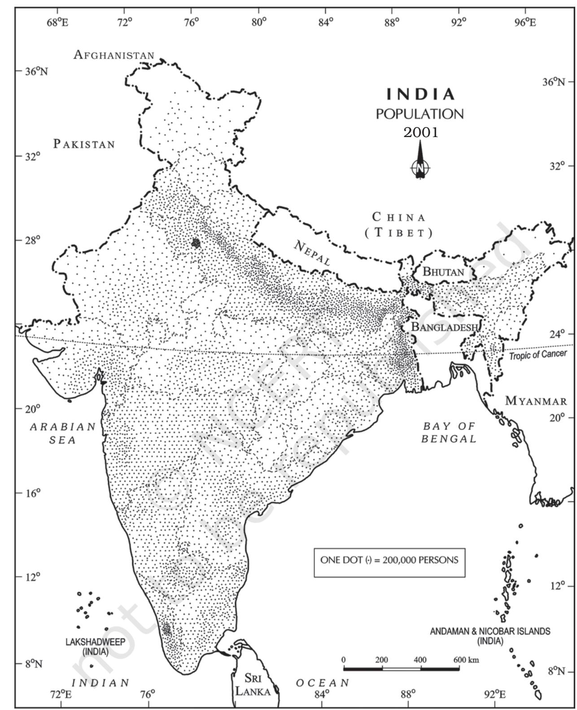

**Fig. 3.13 :** *Population of India, 2001*

# *Construction*

- (a) Select the size and value of a dot.
- (b) Determine the number of dots in each state using the given scale. For example, number of dots in Maharashtra will be 9,67,52,247/100,000 = 967.52. It may be rounded to 968, as the fraction is more than 0.5.
- (c) Place the dots in each state as per the determined number in all states.
- (d) Consult the physiographic/relief map of India to identify mountainous, desert, and/or snow covered areas and mark lesser number of dots in such areas.

# Choropleth Map

The choropleth maps are also drawn to depict the data characteristics as they are related to the administrative units. These maps are used to represent the density of population, literacy/growth rates, sex ratio, etc.

# *Requirement for drawing Choropleth Map*

- (a) A map of the area depicting different administrative units.
- (b) Appropriate statistical data according to administrative units.

# *Steps to be followed*

- (a) Arrange the data in ascending or descending order.
- (b) Group the data into 5 categories to represent very high, high, medium, low and very low concentrations.
- (c) The interval between the categories may be identified on the following formulae i.e., Range/5 and Range = maximum value – minimum value.

3 9

Graphical Representation of Data

- (d) Patterns, shades or colour to be used to depict the chosen categories should be marked in an increasing or decreasing order.
*Example 3.13:* Construct a Choropleth map to represent the literacy rates in India in 2001 as given in *Table 3.10*.

# *Construction*

- (a) Arrange the data in ascending order as shown above.
- (b) Identify the range within the data. In the present case, the states recording the lowest and highest literacy rates are Bihar (47%) and Kerala (90.9%), respectively. Hence, the range would be 91.0 – 47.0 = 44.0
- (c) Divide the range by 5 to get categories from very low to very high. (44.0/ 5 = 8.80. We can convert this value to a round number, i. e., t 9.0
- (d) Determine the number of the categories alongwith the range of each category. Add 9.0 to the lowest value of 47.0 as so on. We will finally get following categories :
	- 47 56 Very low (Bihar, Jharkhand, Arunachal Pradesh, Jammu and Kashmir)
	- 56 65 Low (Uttar Pradesh, Rajasthan, Andhra Pradesh, Meghalaya, Odisha, Assam, Madhya Pradesh, Chhattisgarh)

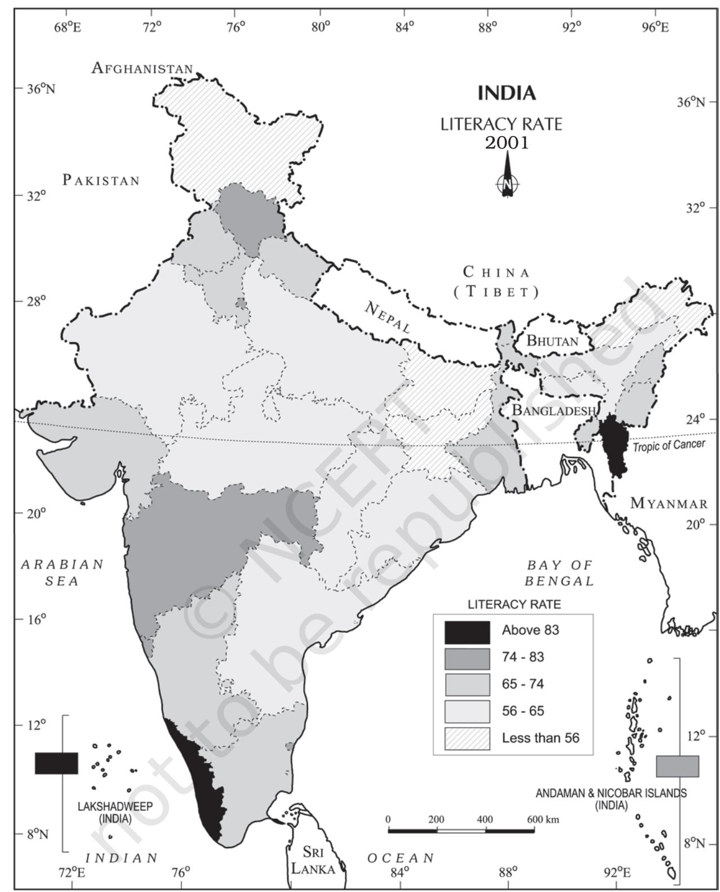

**Fig. 3.14 :** *Literacy Rate, 2001*

| Table 3.10 : Literacy Rate in India, 2001 |
| --- |

|  | Original Data on Literacy in India |  |  | Data on Literacy in India as arranged in Ascending order |  |
| --- | --- | --- | --- | --- | --- |
| S. | States / Union | Literacy |  |  |  |
| No. | Territories | Rate | S. | States / Union | Literacy |
|  |  |  | No. | Territories | Rate |
| 1. | Jammu & Kashmir | 55.5 |  |  |  |
| 2. | Himachal Pradesh | 76.5 | 10. | Bihar | 47.0 |
|  |  |  | 20. | Jharkhand | 53.6 |
| 3. | Punjab | 69.7 | 12. | Arunachal Pradesh | 54.3 |
| 4. | Chandigarh | 81.9 |  |  |  |
| 5. | Uttarakhand | 71.6 | 01. | Jammu & Kashmir | 55.5 |
| 6. | Haryana | 67.9 | 9. | Uttar Pradesh | 56.3 |
|  |  |  | 26. | Dadra & Nagar Haveli | 57.6 |
| 7. | Delhi | 81.7 | 08. | Rajasthan | 60.4 |
| 8. | Rajasthan | 60.4 | 28. | Andhra Pradesh | 60.5 |
| 9. | Uttar Pradesh | 56.3 |  |  |  |
| 10. | Bihar | 47.0 | 17. | Meghalaya | 62.6 |
|  |  |  | 21. | Odisha | 63.1 |
| 11. | Sikkim | 68.8 | 18. | Assam | 63.3 |
| 12. | Arunachal Pradesh | 54.3 | 23. | Madhya Pradesh | 63.7 |
| 13. | Nagaland | 66.6 |  |  |  |
|  |  |  | 22. | Chhattisgarh | 64.7 |
| 14. | Manipur | 70.5 | 13. | Nagaland | 66.6 |
| 15. | Mizoram | 88.8 | 29. | Karnataka | 66.6 |
| 16. | Tripura | 73.2 | 06. | Haryana | 67.9 |
| 17. | Meghalaya | 62.6 | 19. | West Bengal | 68.6 |
| 18. | Assam | 63.3 | 11. | Sikkim | 68.8 |
| 19. | West Bengal | 68.6 | 24. | Gujarat | 69.1 |
| 20. | Jharkhand | 53.6 | 03. | Punjab | 69.7 |
| 21. | Odisha | 63.1 | 14. | Manipur | 70.5 |
| 22. | Chhattisgarh | 64.7 | 05. | Uttarakhand | 71.6 |
| 23. | Madhya Pradesh | 63.7 | 16. | Tripura | 73.2 |
| 24. | Gujarat | 69.1 | 33. | Tamil Nadu | 73.5 |
| 25. | Daman & Diu | 78.2 | 02. | Himachal Pradesh | 76.5 |
| 26. | Dadra & Nagar Haveli | 57.6 | 27. | Maharashtra | 76.9 |
| 27. | Maharashtra | 76.9 | 25. | Daman & Diu | 78.2 |
| 28. | Andhra Pradesh | 60.5 | 34. | Puducherry | 81.2 |
| 29. | Karnataka | 66.6 | 35. | Andaman & Nicobar | 81.3 |
| 30. | Goa | 82.0 |  | Islands |  |
| 31. | Lakshadweep | 86.7 | 07. | Delhi | 81.7 |
| 32. | Kerala | 90.9 | 04. | Chandigarh | 81.9 |
| 33. | Tamil Nadu | 73.5 | 30. | Goa | 82.0 |
| 34. | Puducherry | 81.2 | 31. | Lakshadweep | 86.7 |
| 35. | Andaman & Nicobar | 81.3 | 15. | Mizoram | 88.8 |
|  | Islands |  | 32. | Kerala | 90.9 |

4 1

Graphical Representation of Data

| 65 – 74 | Medium (Nagaland, Karnataka, Haryana, West Bengal, |
| --- | --- |
|  | Sikkim, Gujarat, Punjab, Manipur, Uttarakhand, Tripura, |
|  | Tamil Nadu) |

- 74 83 High (Himachal Pradesh, Maharashtra, Delhi, Goa) 83 – 92 Very high (Mizoram, Kerala)
(e) Assign shades/pattern to each category ranging from lower to higher hues.

- (f) Prepare the map as shown in *Fig. 3.14*.
- (g) Complete the map with respect to the attributes of map design.

### Isopleth Map

We have seen that the data related to the administrative units are represented using choropleth maps. However, the variations within the data, in many cases, may also be observed on the basis of natural boundaries. For example, variations in the degrees of slope, temperature, occurrence of rainfall, etc. possess characteristics of the continuity in the data. These geographical facts may be represented by drawing the lines of equal values on a map. All such maps are termed as Isopleth Map. The word Isopleth is derived from Iso meaning equal and pleth means lines. Thus, an imaginary line, which joins the places of equal values, is referred as Isopleth. The more frequently drawn isopleths include Isotherm (equal temperature), Isobar (equal pressure), Isohyets (equal rainfall), Isonephs (equal cloudiness), Isohels (equal sunshine), contours (equal heights), Isobaths (equal depths), Isohaline (equal salinity), etc.

#### *Requirement*

- (a) Base line map depicting point location of different places.
- (b) Appropriate data of temperature, pressure, rainfall, etc. over a definite period of time.
- (c) Drawing instrument specially French Curve, etc.

#### *Rules to be observed*

- (a) An equal interval of values be selected.
- (b) Interval of 5, 10, or 20 is supposed to be ideal.
- (c) The value of Isopleth should be written along the line on either side or in the middle by breaking the line.

#### *Interpolation*

Interpolation is used to insert the intermediate values between the observed values of at two stations/locations, such as temperature recorded at Chennai and Hyderabad or the spot heights of two points. Generally, drawing of isopleths joining the places of same value is also termed as interpolation.

#### *Method of Interpolation*

For interpolation, follow the following steps:

- (a) Firstly, determine the minimum and maximum values given on the map.
- (b) Calculate the range of value i.e. Range = maximum value minimum value.
- (c) Based on range, determine the interval in a whole number like 5, 10, 15, etc.

The exact point of drawing an Isopleth is determined by using the following formulae.

Point of Isopleth Distance between two points in cm Differ = ence between the two values of corresponding points × Interval

42

The interval is the difference between the actual value on the map and interpolated value. For example, in an Isotherm map of two places show 28 oC and 33 oC and you want to draw 30 oC isotherm, measure the distance between the two points. Suppose, the distance is 1cm or 10 mm and the difference between 28 and 33 is 5, whereas, 30 is 2 points away from 28 and 3 points behind 33, thus, exact point of 30 will be

Thus, isotherm of 30 oC will be plotted 4mm away from 28 oC or 6mm ahead of 33 oC.

- (d) Draw the isopleths of minimum value first; other isopleths may be drawn accordingly.
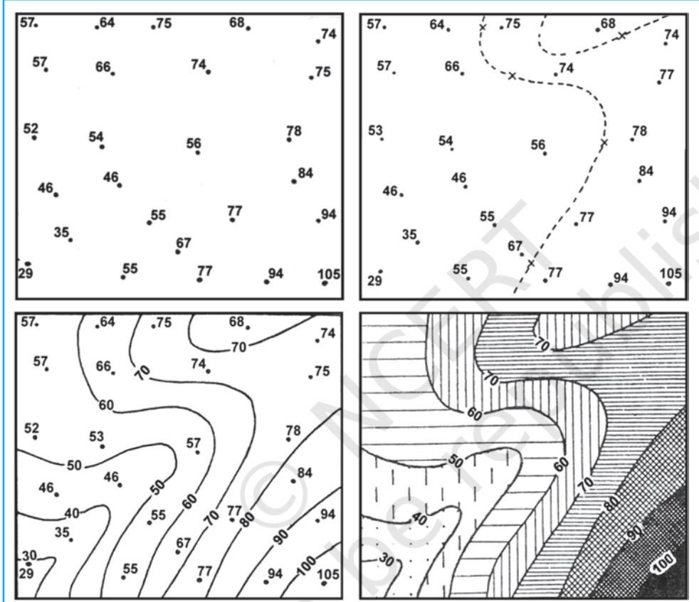

*Fig. 3.15 : Drawing of Isopleths*

# E x c e r c i s e sE x c e r c i s e s Excercises

- 1 . Choose the right answer from the four alternatives given below:
	- (i) Which one of the following map shows the population distribution:
		- (a) Choropleth maps (b) Isopleth maps
			-

4 3

Graphical Representation of Data

- (c) Dot maps (d) Square root maps
- 
- (ii) Which one of the following is best suited to represent the decadal growth of population?
	-
	- (a) Line graph (b) Bar diagram
	- (c) Circle diagram (d) Flow diagram
- 

#### (iii) Polygraph is constructed to represent:

- (a) Only one variable (b) Two variables only
	-
- (c) More than two variables (d) None of the above
- (iv) Which one of the following maps is known as "Dynamic Map"?
	- (a) Dot map (b) Choropleth
		-
	- (c) Isopleth (d) Flow map
- 2. Answer the following questions in about 30 words:
	- (i) What is a thematic map?
	- (ii) Differentiate between multiple bar diagram and compound bar diagram.
	- (iii) What are the requirements to construct a dot map?
	- (iv) Describe the method of constructing a traffic flow map.
	- (v) What is an Isopleth map ? How an interpolation is carried out?
	- (vi) Describe and illustrate important steps to be followed in preparing a choropleth map.
	- (vii) Discuss important steps to represent data with help of a pie-diagram.

# Activity ctivity

- 1. Represent the following data with the help of suitable diagram.
India : Trends of Urbanisation 1901-2001

| Year | Decennial |
| --- | --- |
|  | growth (%) |
| 1911 | 0.35 |
| 1921 | 8.27 |
| 1931 | 19.12 |
| 1941 | 31.97 |
| 1951 | 41.42 |
| 1961 | 26.41 |
| 1971 | 38.23 |
| 1981 | 46.14 |
| 1991 | 36.47 |
| 2001 | 31.13 |

2 . Represent the following data with the help of suitable diagram.

India : Literacy and Enrolment Ratio in Primary and Upper Primary Schools

| Year | Literacy Ratio |  |  | Enrolment |  |  | Enrolment Ratio |  |  |
| --- | --- | --- | --- | --- | --- | --- | --- | --- | --- |
|  |  |  |  | Ratio Primary |  |  | Upper Primary |  |  |
|  | Person | Male | Female | Boys | Girls | Total | Boys | Girls | Total |
| 1950-51 | 18.3 | 27.2 | 8.86 | 60.6 | 25 | 42.6 | 20.6 | 4.6 | 12.7 |
| 1999-2000 | 65.4 | 75.8 | 54.2 | 104 | 85 | 94.9 | 67.2 | 50 | 58.8 |

3 . Represent the following data with help of pie-diagram.

| India : Land use 1951-2001 |
| --- |

|  | 1950-51 | 1998-2001 |
| --- | --- | --- |
| Net Sown Area | 42 | 46 |
| Forest | 14 | 22 |
| Not available for cultivation | 17 | 14 |
| Fallow Land | 10 | 8 |
| Pasture and Tree | 9 | 5 |
| Cultruable Waste Land | 8 | 5 |

4 . Study the table given below and draw the given diagrams/maps.

| States | Area in | % to | Production | % to total |
| --- | --- | --- | --- | --- |
|  | 000 ha | total area | 000 tones | production |
| West Bengal | 5,435 | 12.3 | 12,428 | 14.6 |
| Uttar Pradesh | 5,839 | 13.2 | 11,540 | 13.6 |
| Andhra Pradesh | 4,028 | 9.1 | 12,428 | 13.5 |
| Punjab | 2,611 | 5.9 | 9,154 | 10.8 |
| Tamil Nadu | 2,113 | 4.8 | 7,218 | 8.5 |
| Bihar | 3,671 | 8.3 | 5,417 | 6.4 |

Area and Production of Rice in major States

(a) Construct a multiple bar diagram to show area under rice in each State.

- (b) Construct a pie-diagram to show the percentage of area under rice in each State.
- (c) Construct a dot map to show the production of rice in each State.
- (d) Construct a Choropleth map to show the percentage of production of rice in States.
- 5. Show the following data of temperature and rainfall of Kolkata with a suitable diagram.

| Months | Temperature in º C | Rainfall in cm |
| --- | --- | --- |
| Jan. | 19.6 | 1.2 |
| Feb. | 22.0 | 2.8 |
| Mar. | 27.1 | 3.4 |
| Apr. | 30.1 | 5.1 |
| May | 30.4 | 13.4 |
| June | 29.9 | 29.0 |
| Jul. | 28.9 | 33.1 |
| Aug. | 28.7 | 33.4 |
| Sep. | 28.9 | 25.3 |
| Oct. | 27.6 | 12.7 |
| Nov. | 23.4 | 2.7 |
| Dec. | 19.7 | 0.4 |

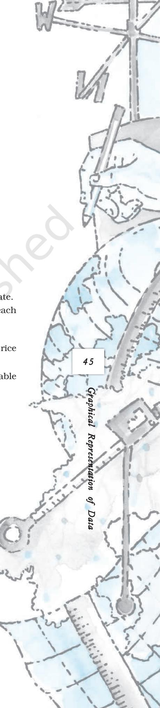

