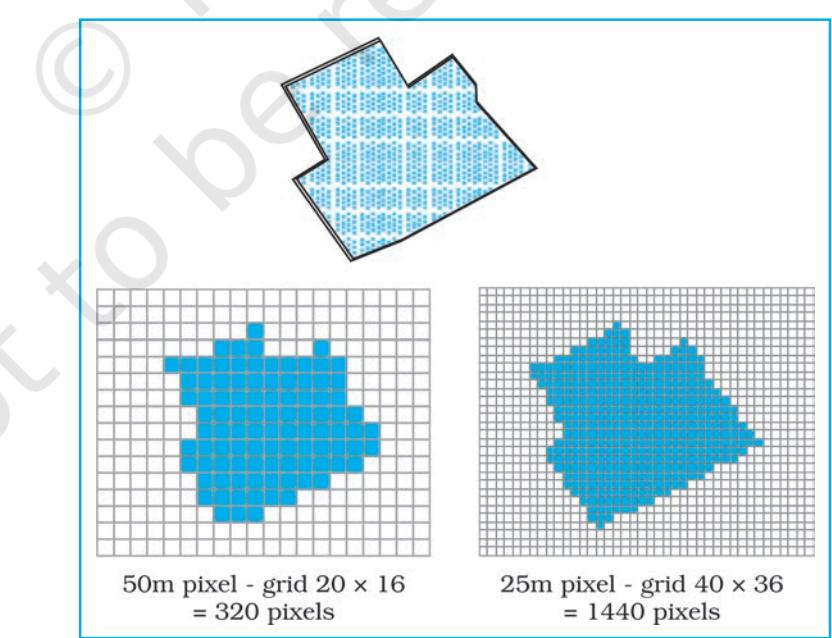

You know that the computers enhance our capabilities in data processing and in drawing graphs, diagrams and maps. The disciplines that deals with the principles and methods of data processing and mapping using a combination of computer hardware and the application software are referred as the Database Management System (DBMS) and the Computer Assisted Cartography, respectively. However, the role of such computer applications is restricted to merely processing of the data and their graphical presentation. In other words, the data so processed or the maps and diagrams so prepared could not be used to evolve a decision support system. As a matter of fact, there are several questions that we normally encounter in our day-to-day life and look for satisfactory solutions. These questions may be: What is where ? Why is it there ? What will happen if it is shifted to a new location? Who will be benefited by such a reallocation? Who are expected to loose the benefits if reallocation takes place? In order to, understand these and many other questions, we need to capture the necessary data collected from different sources and integrate them using a computer that is supported by geo-processing tools. Herein lays the concept of a Spatial Information System. In the present chapter, we will discuss basic principles of the Spatial Information Technology and its extension to the Spatial Information System, which is more commonly known as Geographical Information System.

## What is Spatial Information Technology?

46

Practical W

ractical Wractical Work in Geography, Part-II

The word spatial is derived from space. It refers to the features and the phenomena distributed over a geographically definable space, thus, having physically measurable dimensions. We know that most data that are used today have spatial components (location), such as an address of a municipal facility, or the boundaries of an agricultural holdings, etc. Hence, the Spatial Information Technology relates to the use of the technological inputs in collecting, storing, retrieving, displaying, manipulating, managing and analysing the spatial information. It is an amalgamation of Remote Sensing, GPS, GIS, Digital Cartography and Database Management Systems.

## What is GIS (Geographical Information System)?

The advance computing systems available since mid 1970's enable the processing of georeferenced information for the purpose of organising spatial and attribute data and their integration; locating specific information in individual files and executing the computations, performing analysis and evolving a decision support system. A system capable of all such functions is called Geographic Information System (GIS). It is defined as A system for capturing, storing, checking, integrating, manipulating, analysing and displaying data, which are spatially referenced to the Earth. This is normally considered to involve a spatially referenced computer database and appropriate applications software. It is an amalgamation of Computer Assisted Cartography and Database Management System and draws conceptual and methodological strength from both spatial and allied sciences such as Computer Science, Statistics, Cartography, Remote Sensing, Database Technology, Geography, Geology, Hydrology, Agriculture, Resource Management, Environmental Science, and Public Administration.

Forms of Geographical Information

Two types of the data represent the geographical information. These are spatial and non – spatial data (*Box 4.1*). The spatial data are characterised by their positional, linear and areal forms of appearances (*Fig. 4.1*).

|  |  |  | Box 4.1 : Spatial and non-spatial data |  |  |
| --- | --- | --- | --- | --- | --- |
|  | Stock Register of a Cycle shop |  |  | Literate Population in States 1981 |  |
| Part No. | Quantity | Description | State | % Male | % Female |
| 101435 | 54 | Wheel Spoke | Kerala | 75.3 | 65.7 |
| 108943 | 68 | Ball Bearing | Maharashtra | 58.8 | 34.8 |
| 105956 | 25 | Wheel Rim | Gujarat | 54.4 | 32.3 |
| 123545 | 108 | Tyre | Punjab | 47.2 | 33.7 |

Geographic Database : A database contains attributes and their value or class. The non-spatial data on the left display cycle parts, which can be located anywhere. The data record on the right is spatial because one of the attributes, the name of different states, which have a definite locations in a map. This data can be used in GIS.

Spatial Information Technologyechnology

4 7

 echnology

*Fig. 4.1 : The Point, a Line and an Area Feature*

These data forms must be geometrically registered to a generally accepted and properly defined coordinate system and coded so that they can be stored in the internal database structure of GIS. On the other hand, the data those describe the spatial data are called as Non–spatial or attribute data. The spatial data are the most important pre-requisite in a spatial or geographical information system. In a GIS core, it could be built in several ways. These are :

- Acquire data in digital form from a data supplier
- Digitise existing analogue data
- Carry out one's own surveys of geographic entities.

The choice of a source of geographical data for a GIS application is, however, largely governed by :

- The application area in itself
- The available budget, and
- The type of data structure, i.e., vector/raster.

For many users, the most common source of spatial data is topographical or thematic maps in hard copy (paper) or soft copy form (digital). All such maps are characterised by :

- A definite scale which provides relationship between the map and the surface it represents,
- Use of symbols and colours which define attributes of entities mapped, and
- An agreed coordinate system, which defines the location of entities on the Earth's surface.

## Ad v antages of GIS o antages of GIS oantages of GIS over M e r Manual M a n u a l Ma n u a l Methods e t h o d s

The maps, irrespective of a graphic medium of communication of geographic information and possessing geometric fidelity, are inherited with the following limitations :

- (i) Map information is processed and presented in a particular way.
- (ii) A map shows a single or more than one predetermined themes.
- (iii) The alteration of the information depicted on the maps require a new map to be drawn.

Contrarily, a GIS possesses inherent advantages of separate data storage and presentation. It also provides options for viewing and presenting the data in several ways. The following advantages of a GIS are worth mentioning :

- 1. Users can interrogate displayed spatial features and retrieve associated attribute information for analysis.
- 2. Maps can be drawn by querying or analysing attribute data.
- 3. Spatial operations (polygon overlay or buffering) can be applied on integrated database to generate new sets of information.
- 4. Different items of attribute data can be associated with one another through shared location code.

48

## Components of GIS

The important components of a Geographical Information System include the following:

- (a) Hardware (b) Software (c) Data
- (d) People (e) Procedures

The different components of GIS are shown in *Fig. 4.2*.

### Hardware

As discussed in Chapter 4 the GIS has three major components :

- Hardware comprising the processing, storage, display, and input and output sub-systems.
- Software modules for data entry, editing, maintenance, analysis, transformation, manipulation, data display and output.
- Database management system to take care of the data organisation.

#### Software

An application software with the following functional modules is important prerequisite of a GIS :

- Software related to data entry, editing and maintenance
- Software related to analysis/transformation/manipulation
- Software related to data display and output.

#### Data

Spatial data and related tabular data are the backbone of GIS. The existing data may be acquired from a supplier or a new data may be created/collected in-house by the user. The digital map forms the basic data input for GIS. Tabular data related to the map objects can also be attached to the digital data. A GIS will integrate spatial data with other data resources and can even use a DBMS.

### People

GIS users have a wide range from hardware and software engineers to resources and environmental scientists, policy-makers, and the monitoring and implementing agencies. These cross-section of people use GIS to evolve a decision support system and solve real time problems.

#### Procedures

Procedures include how the data will be retrieved, input into the system, stored, managed, transformed, analysed and finally presented in a final output.

Spatial Information Technologyechnology

4 9

 echnology

*Fig. 4.2 : Basic Components of GIS*

## Spatial D Spatial DSpatial Data Formats o r m a t s

The spatial data are represented in raster and vector data formats :

#### Raster Data Format

Raster data represent a graphic feature as a pattern of grids of squares, whereas vector data represent the object as a set of lines drawn between specific points.

Consider a line drawn diagonally on a piece of paper. A raster file would represent this image by sub-dividing the paper into a matrix of small rectangles, similar to a sheet of graph paper called cells. Each cell is assigned a position in the data file and given a value based on the attribute at that position. Its row and column

coordinates may identify any individual pixel (*Fig. 4.3*). This data representation allows the user to easily reconstruct or visualise the original image.

The relationship between cell size and the number of cells is expressed as the resolution of the raster. The effect of grid size on data in raster format is explained in *Fig. 4.4*.

*Fig. 4.4 : Effect of Grid Size on Data in Raster Format*

The Raster file formats are most often used for the following activities :

- For digital representations of aerial photographs, satellite images, scanned paper maps, etc.
- When costs need to be kept down.
- When the map does not require analysis of individual map features.
- When "backdrop" maps are required.

#### Vector Data Format

A vector representation of the same diagonal line would record the position of the line by simply recording the coordinates of its starting and ending points. Each point would be expressed as two or three numbers (depending on whether the representation was 2D or 3D, often referred to as X,Y or X,Y,Z coordinates) (*Fig. 4.5*). The first number, X, is the distance between the point and the left side of the paper; Y, the distance between the point and the bottom of the paper; Z, the point's elevation above or below the paper. Joining the measured points forms the vector.

*Fig. 4.5 : The Vector Data Model is based around Coordinate Pairs*

A vector data model uses points stored by their real (earth) coordinates. Here lines and areas are built from sequences of points in order. Lines have a direction to the ordering of the points. Polygons can be built from points or lines. Vectors can store information about topology. Manual digitising is the best way of vector data input.

Spatial Information Technologyechnology

5 1

 echnology

The Vector files are most often used for :

- Highly precise applications
- When file sizes are important
- When individual map features require analysis
- When descriptive information must be stored

The advantages and the disadvantages of the raster and vector data formats are explained in *Box 4.2*.

*Fig. 4.6 : Representation of Spatial Entities in Raster and Vector Data Formats*

52

## Sequence of GIS A ce of GIS Ace of GIS Activities ctivitiesctivities

The following sequence of the activities are involved in GIS-related work :

- 1. Spatial data input
- 2. Entering of the attribute data
- 3. Data verification and editing
- 4. Spatial and attribute data linkages
- 5. Spatial analysis

#### Spatial Data Input

As already mentioned, the spatial database into a GIS can be created from a variety sources. These could be summarised into the following two categories :

#### (a) *Acquiring Digital Data sets from a Data Supplies*

The present day data supplies make the digital data readily available, which range from small-scale maps to the large-scale plans. For many local governments and private organisations, such data form an essential source and keep such groups of users free from overheads of digitising or collecting their own data. Although, using such existing data sets is attractive and time saving, serious attention must be paid to data compatibility when data from different sources/ supplies are combined in one project. The differences in terms of projection, scale, base level and description in attributes may cause problems.

At a practical level, users must consider the following characteristics of the data to ensure that they are compatible with the application:

- The scale of the data
- The geo-referencing system used
- The data collection techniques and sampling strategy used
- The quality of data collected
- The data classification and interpolation methods used
- The size and shape of the individual mapping units
- The length of the record.

It must also be noted that where data are used from a number of sources, and particularly where the area of study crosses administrative boundaries, the difficulties in data integration are caused by different geographical referencing systems, data classification and sampling. Hence, the user needs to be aware of these problems, which are particularly prone when compiling inter-province, and inter-district data sets. Once, the compatibility between the data acquired from different suppliers is established, the next stage involves the transfer of data from a medium of transfer to the GIS. The use of DAT tapes, CD ROMS and floppy disks is becoming increasingly common for the purpose. At this stage, the conversion from encoding and structuring system of the source to that of GIS to be used is important.

Spatial Information Technologyechnology

5 3

 echnology

#### (b) *Creating digital data sets by manual input*

The manual input of data to a GIS involves four main stages :

- Entering the spatial data.
- Entering the attribute data.
- Spatial and attribute data verification and editing.
- Where necessary, linking the spatial to the attribute data.

The manual data input methods depend on whether the database has a vector topology or grid cell (raster) structure. The most common ways of inputting spatial data in to a GIS are through:

- Digitisation
- Scanning

With the entity model, geographical data are in the form of points, lines and/ or polygons (areas)/pixels which are defined using a series of coordinates. These are obtained by referring to the geographical referencing systems of the map or aerial photograph, or by overlaying a graticule or grid onto it. The use of digitisers and the scanners greatly reduce the time and labour involved in writing down coordinates. We shall, briefly, discuss how the spatial data are created in GIS core using a scanner.

#### *Scanners*

Scanners are the devices for converting analogue data into digital grid-based images. They are used in spatial data capture to convert a line map to high-resolution raster images which may be used directly or further processed to get vector topology. There are two basic types of scanners :

- Scanners that record data on a step-for-step basis, and
- Those that can scan whole document in one operation.

The first type of scanners incorporates a source of illumination on a movable arm (usually light emitting diodes or a stabilised fluorescent lamp) and a digital camera with high-resolution lamp. The camera is usually equipped with special sensors called Charged Coupled Devices (CCDs) arranged in an array. These are semi-conductor devices that translate the photons of light falling on their surface into counts of electrons, which are then recorded as a digital value.

The movement of either the scanner or the map builds up a digital two-dimensional image of the map. The map to be scanned can be mounted either on a flat bed, or on a rotating drum. With flatbed scanners, the light source is moved systematically up and down over the surface of the document. For large maps, scanners are used which are mounted on a stand and the illumination source and camera array are fixed in a position. The map is moved past by a feeding mechanism. Modern document scanners resemble laser printers in reverse because the scanning surface is manufactured with a given resolution of light sensitive spots that can be directly addressed by the software. There are no moving parts except a movable light source. The resolution is determined by the geometry of the sensor surface and the amount of memory rather than by a mechanical arm.

The scanned image is always far from perfect even with the best possible scanners, as it contains all the smudges and defects of the original map. The excess data, therefore, in a digital image must be removed to make it usable.

#### Entering the Attribute Data

Attribute data define the properties of a spatial entity that need to be handled in the GIS, but which are not spatial. For example, a road may be captured as a set of contiguous pixels or as a line entity and represented in the spatial part of the GIS by a certain colour, symbol or data location. Information describing the type of road may be included in the range of cartographic symbols. The attribute values associated with the road, such as road width, type of surface, estimated number of traffic and specific traffic regulation may also be stored separately

either as spatial information in the GIS in case of relational databases, or input along with spatial description with the object-oriented data bases.

The attribute data acquired from sources like published record, official censuses, primary surveys or spread sheets can be used as input into GIS database either manually or by importing the data using a standard transfer format.

#### Data Verification and Editing

The spatial data captured into a GIS require verification for the error identification and corrections so as to ensure the data accuracy. The errors caused during digitisation may include data omissions, and under/over shoots. The best way to check for errors in the spatial data is to produce a computer plot or print of the data, preferably on translucent sheet, at the same scale as the original. The two maps may then be placed over each other on a light table and compared visually, working systematically from left to right and top to bottom of the map. Missing data and locational errors should be clearly marked on the printout. The errors that may arise during the capturing of spatial and attribute data may be grouped as under :

#### *Spatial data are incomplete or double*

The incompleteness in the spatial data arises through omissions in the input of points, lines, or polygons/area of manually entered data. In scanned data the omissions are usually in the form of gaps between lines where the raster vector conversion process has failed to join up all parts of a line.

#### *Spatial data at the wrong scale*

The digitising at the wrong scale produces input spatial data at a wrong scale. In scanned data, the problems usually arise during the geo-referencing process when incorrect values are used.

#### *Spatial data are distorted*

The spatial data may also be distorted if the base maps used for digitising are not scale correct. The aerial photographs, in particular, are characterised by incorrect scale because of the lens distortions, relief and till displacements. In addition, paper maps and field documents used for scanning or digitising may contain random distortions as a result of having been exposed to rain, sunshine and frequent folding. Hence, transformation from one coordinate system to another may be needed if the coordinate system of the database is different from that used in the input document or image.

Spatial Information Technologyechnology

5 5

 echnology

These errors need corrections through various editing and updating functions as supported directly by most GIS software. The process is time-consuming and interactive that can take longer time than the data input itself. The data editing is usually undertaken by viewing the portion of map containing the errors on the computer screen and correcting them through the software using the keyboard, screen cursor controlled by a mouse or a small digitiser tablet.

Minor locational errors in a vector database may be corrected by moving the spatial entity through the screen cursor. In some GIS, computer commands may be used directly to move, rotate, erase, insert, stretch or truncate the graphical entities are required. Where excess coordinates define a line these may be removed using 'weeding' algorithms. Attribute values and spatial errors in raster data

must be corrected by changing the value of the faulty cells. Once, the spatial errors have been corrected, the topology of vector line and polygon networks can be generated.

#### *Data Conversion*

While manipulating and analysing data, the same format should be used for all data. When different layers are to be used simultaneously, they should all be in vector or all in raster format. Usually, the conversion is from vector to raster, because the biggest part of the analysis is done in the raster domain. Vector data are transformed to raster data by overlaying a grid with a user-defined cell size.

Sometimes, the data in the raster format are converted into vector format. This is the case especially if one wants to achieve data reduction because the data storage needed for raster data are much larger than for vector data.

#### Geographic Data : Linkages and Matching

The linkages of spatial and the attribute data are important in GIS. It must, therefore, carefully be undertaken. Linking of attribute data with a non-related spatial data shall lead to chaos in ultimate data analysis. Similarly, matching of one data layer with another is also significant.

#### *Linkages*

A GIS typically links different data sets. Suppose, we want to know the mortality rate due to malnutrition among children under 10 years of age in any state. If we have one file that contains the number of children in this age group, and another that contains the mortality rate from malnutrition, we must first combine or link the two data files. Once this is done, we can divide one figure by the other to obtain the desired answer.

#### *Exact Matching*

Exact matching means when we have information in one computer file about many geographic features (e.g., towns) and additional information in another file about the same set of features. The operation to bring them together may easily be achieved using a key common to both files, i. e. name of the towns. Thus, the record in each file with the same town name is extracted, and the two are joined and stored in another file.

#### *Hierarchical Matching*

Some types of information, however, are collected in more detail and less frequently than other types of information. For example, land use data covering a large area are collected quite frequently. On the other hand, land transformation data are collected in small areas but at less frequent intervals. If the smaller areas adjust within the larger ones, then the way to make the data match of the same area is to use hierarchical matching — add the data for the small areas together until the grouped areas match the bigger ones and then match them exactly.

#### *Fuzzy Matching*

On many occasions, the boundaries of the smaller areas do not match with those of the larger ones. The problem occurs more often when the environmental data are involved. For example, crop boundaries that are usually defined by field edges/boundaries rarely match with the boundaries of the soil types. If we want

to determine the most productive soil for a particular crop, we need to overlay the two sets and compute crop productivity for each soil type. This is like laying one map over another and noting the combinations of soil and productivity.

A GIS can carry out all these operations. However, the sets of spatial information are linked only when they relate to the same geographical area.

#### Spatial Analysis

The strength of the GIS lies in its analytical capabilities. What distinguish the GIS from other information systems are its spatial analysis functions. The analysis functions use the spatial and non-spatial attributes in the database to answer questions about the real world. Geographic analysis facilitates the study of realworld processes by developing and applying models. Such models provide the underlying trends in geographic data and thus, make new possibilities available. The objective of geographic analysis is to transform data into useful information to satisfy the requirements of the decision-makers. For example, GIS may effectively be used to predict future trends over space and time related to variety of phenomena. However, before undertaking any GIS based analysis, one needs to identify the problem and define purpose of the analysis. It requires step – by – step procedures to arrive at the conclusions. The following spatial analysis operation may be undertaken using GIS :

- (i) Overlay analysis (ii) Buffer analysis
- (iii) Network analysis (iv) Digital Terrain Model

However, under the constraints of time and space only the overlay and buffer analysis operations will be dealt herewith.

#### *Overlay Analysis Operations*

The hallmark of GIS is overlay operations. An integration of multiple layers of maps using overlay operations is an important analysis function. In other words, GIS makes it possible to overlay two or more thematic layers of maps of the same area to obtain a new map layer (*Fig. 4.7*). The overlay operations of a GIS are

*Fig. 4.7 : Simple Overlay Operation*

*Spatial Information Technologyechnology*

*5 7* 

 *echnology*

*Fig. 4.8 : Urban Land Use in Aligarh City, Uttar Pradesh during 1974 and 2001*

*Fig. 4.9 : Urban Land Transformations in Aligarh City during 1974-2001*

58

Practical Wractical Wractical Work in Geography, Part-II

similar to the sieve mapping, i.e., the overlaying of tracing of maps on a light table to make comparisons and obtain an output map.

Map overlay has many applications. It can be used to study the changes in land use/land cover over two different periods in time and analyse the land transformations. For example, *Fig. 4.8* depicts urban land use during 1974 and 2001. When the two maps overlaid, the changes in urban land use have been obtained (*Fig. 4.9*) and the urban sprawl is mapped during the given time period (*Fig. 4.10*). Similarly, overlay analysis is also useful in suitability analysis of the given land use for proposed land uses.

#### *Buffer Operation*

Buffer operation is another important spatial analysis function in GIS. A buffer of a certain specified distance can be created along any point, line or area feature (*Fig. 4.11*). It is useful in locating the areas/population benefitted or denied of the facilities and services, such as hospitals, medical stores, post office, asphalt roads, regional parks, etc. Similarly, it can also be used to study the impact of point sources of air, noise or water pollution on human health and the size of the population so affected. This kind of analysis is called proximity analysis. The buffer operation will generate polygon feature types irrespective of geographic features and delineates spatial proximity. For example, numbers of household living within one-kilometre buffer from a chemical industrial unit are affected by industrial waste discharged from the unit.

Arc View/ArcGIS, Geomedia Quantum GIS free opensoftware and all other GIS softwares provide modules for buffer analysis along point, line and area features. For example, by using appropriate commands of either of the available software, one can create buffers of 2, 4, 6, 8 and 10 kilometres around the cities having a major hospital located. As a case study, point location of Saharanpur, Spatial Information Technologyechnology

5 9

 echnology

*Fig. 4.11 : Buffers of Constant Width Drawn around a Point, Line and a Polygon*

Muzaffarnagar, Meerut, Ghaziabad, Gautam Budh Nagar and Aligarh has been mapped (*Fig. 4.12*) and the buffer have been created from the cities where major hospitals are found. One can observe that the areas closer to the cities are better

*Fig. 4.12 : Location Map of the Cities of Western Uttar Pradesh*

served, people living away from the cities have to travel long distances to utilise the medical services and their areas that are least benefitted (*Fig. 4.13*).

*Fig. 4.13 : Buffers of Specified Distances around Hospitals*

- schoolgis.nic.in
- bhuvan.nrsc.gov.in
- www.iirs.gov.in

## E x cercises

- 1 . Choose the right answer from the four alternatives given below :
	- (i) The spatial data are characterised by the following forms of appearance :
		- (a) Positional (b) Linear
		- (c) Areal (d) All the above forms
	- (ii) Which one of the following operations requires analysis module software?
		- (a) Data storage (b) Data display
		- (c) Data output (d) Buffering
	- (iii) Which one of the following is disadvantage of Raster data format ?
		- (a) Simple data structure
		- (b) Easy and efficient overlaying
		- (c) Compatible with remote sensing imagery
		- (d) Difficult network analysis
	- (iv) Which one of the following is an advantage of Vector data format ?
		- (a) Complex data structure
		- (b) Difficult overlay operations
		- (c) Lack of compatibility with remote sensing data
		- (d) Compact data structure
	- (v) Urban change detection is effectively undertaken in GIS core using:
		- (a) Overlay operations
		- (b) Proximity analysis
		- (c) Network analysis
		- (d) Buffering

2. Answer the following questions in about 30 words :

(i) Differentiate between raster and vector data models.

- (ii) What is an overlay analysis?
- (iii) What are the advantages of GIS over manual methods?
- (iv) What are important components of GIS?
- (v) What are different ways in which spatial data is built in GIS core?
- (vi) What is Spatial Information Technology?

3. Answer the following questions in about 125 words :

- (i) Discuss raster and vector data formats. Give example.
- (ii) Write an explanatory account of the sequence of activities involved in GIS related work.

Spatial Information Technologyechnology

6 1

 echnology

# Glossary

- Bar Graph : A series of columns or bars drawn proportional in length to the quantities they represent. They are drawn on a selected scale. They may be drawn either horizontally or vertically.
- Central Tendency : The tendency of quantitative data to cluster around some value.
- Choropleth Maps : Maps drawn on quantitative areal basis, calculated as average values per unit of area within specific administrative units, e.g. density of population and percentage of urban to total population. Distribution of a given phenomenon is shown by various shades of a colour or intensity.
- Class Intervals : The difference between the lower and upper limits of any class of a frequency distribution is known as its class interval.
- Correlation Co-efficient : A measure of the degree and direction of relationship between two variables.
- Cumulative Frequency : The measurement of distribution of values in the different class intervals expressed as a percentage of the total frequencies either above or below specified value.
- Dispersion : The degree of internal variations in the different values of a variable.
- Flow Maps : Maps in which the "flow" or movement of people or commodities is represented by riband whose thickness is proportional to the quantity of goods or the number of people moving along different routes.
- Histogram : A graphical representation of a frequency distribution, such as seasonal frequencies of rainfall.
- Mean Deviation : A measure of dispersion derives from the average of deviations from some central value. Such deviations are taken absolutely, i.e., their signs are ignored. The central value is generally mean or median.
- Median : It is the value which divides the number of observations in such a way that half the value are less than this value and half of them are more. If the values of a variable are arranged in either ascending of descending order, the median is the middle value.
- Mode : The mode is that value of a variable which occurs maximum number of times.
- Pie Diagram : A circular diagram in which a circle is divided into sectors for presenting data in percentage.
- Standard Deviation : The most commonly used measure of dispersion. The standard deviation is the positive square root of the mean of the squares of deviations from the mean.
- Tabulation : The process of putting raw data into a systematically arranged tabular form.
- Variable : Any characteristic which varies. A quantitative variable is a characteristic which has different values; the differences of which are quantitatively measurable. Rainfall, for example, is a quantitative variables, because the differences in its different values at different places or at different times are quantitatively measurable. A qualitative variable on the other hand, is the characteristic; the different values of which cannot be measured quantitatively. Sex, for example, is a qualitative variable, it can be either male or female. A qualitative variable is also known as an attribute.

## Notes

Spatial Information Technologyechnology

6 7

 echnology

## Notes

68

Practical W

ractical Wractical Work in Geography, Part-II

