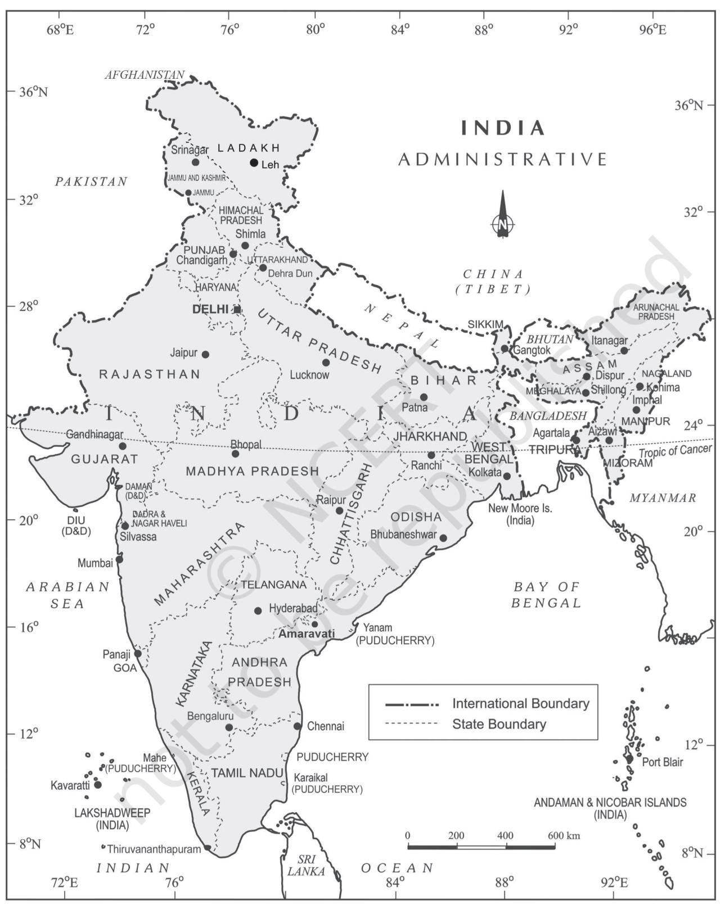
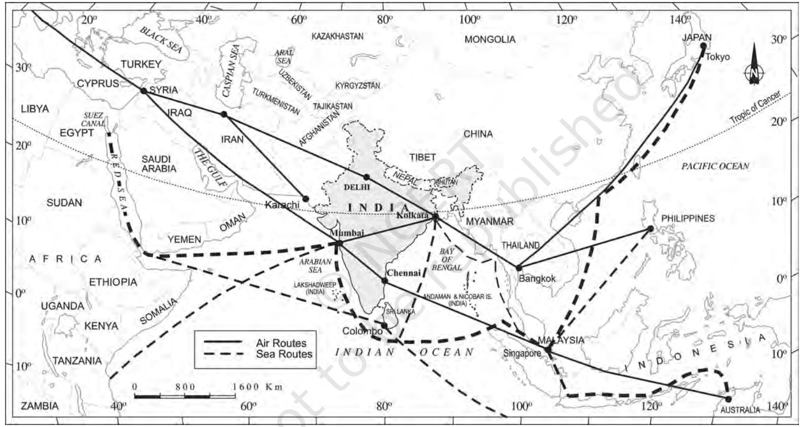

# **UNIT**

**I**

# *INTRODUCTION*

*This unit deals with*

- **•** *Location space relations and India's place in the world*
CHAPTER

Y ou have already seen the map of India in the previous classes. Now you closely examine the map of India (Figure 1.1). Mark the southernmost and northernmost latitudes and the easternmost and westernmost longitudes.

The mainland of India, extends from Kashmir in the north to Kanniyakumari in the south and Arunachal Pradesh in the east to Gujarat in the west. India's territorial limit further extends towards the sea upto 12 nautical miles (about 21.9 km) from the coast. (See the box for conversion).

| Statute mile | = | 63,360 inches |
| --- | --- | --- |
| Nautical mile | = | 72,960 inches |
| 1 Statute mile | = | about 1.6 km (1.584 km) |
| 1 Nautical mile | = | about 1.8 km (1.852 km) |

Our southern boundary extends upto 6°45' N latitude in the Bay of Bengal. Let us try to analyse the implications of having such a vast longitudinal and latitudinal extent.

If you work out the latitudinal and longitudinal extent of India, they are roughly about 30 degrees, whereas the actual distance measured from north to south extremity is 3,214 km, and that from east to west is only 2,933 km. What is the reason for this difference? Consult Chapter 3 on the topic Latitude, Longitude and Time in the book *Practical Work in Geography – Part I* (NCERT, 2006) to find out.

This difference is based on the fact that the distance between two longitudes decreases towards the poles whereas the distance between two latitudes remains the same everywhere. Find out the distance between two latitudes?

From the values of latitude, it is understood that the southern part of the country lies within the tropics and the northern part lies in the sub-tropical zone or the warm temperate zone. This location is responsible for large variations in land forms, climate, soil types and natural vegetation in the country.

Now, let us observe the longitudinal extent and its implications on the Indian people. From the values of longitude, it is quite discernible that there is a variation of nearly 30 degrees, which causes a time difference of nearly two hours between the easternmost and the westernmost parts of our country. You are familiar with the concept of Indian Standard Time (IST). What is the use of the standard meridian? While the sun rises in the northeastern states about two hours earlier as compared to Jaisalmer, the watches in Dibrugarh, Imphal in the east and Jaisalmer, Bhopal or Chennai in the other parts of India show the same time. Why does this happen?

There is a general understanding among the countries of the world to select the standard meridian in multiples of 7°30' of longitude. That is why 82°30' E has been selected as the 'standard meridian' of India. Indian Standard Time is ahead of Greenwich Mean Time by 5 hours and 30 minutes.

There are some countries where there are more than one standard meridian due to their vast east-to-west extent. For example, the USA has seven time zones.

## **INDIA – LOCATION**

**Figure 1.1 : India : Administrative Divisions**

**Figure 1.2 : Location of India in the Eastern World**

4

Name a few places in India through which the standard meridian passes?

India with its area of 3.28 million sq. km accounts for 2.4 per cent of the world's land surface area and stands as the seventh largest country in the world. Find out the names of the countries which are larger than India.

### **SIZE**

The size of India has endowed her with great physical diversity. Thus, you may appreciate the presence of lofty mountains in the north; large rivers such as Ganga, Brahmaputra, Mahanadi, Krishna, Godavari and Kaveri; green forested hills in northeast and south India; and the vast sandy expanse of *Marusthali*. You may further appreciate that bounded by the Himalayas in the north, Hindukush and Sulaiman ranges in the northwest, Purvachal hills in the north-east and by the large expanse of the Indian ocean in the south, it forms a great geographic entity known as the *Indian subcontinent.* It includes the countries — Pakistan, Nepal, Bhutan, Bangladesh and India. The Himalayas, together with other ranges, have acted as a formidable physical barrier in the past. Except for a few mountain passes such as the Khyber, the Bolan, the Shipkila, the Nathula, the Bomdila, etc. it was difficult to cross it. It has contributed towards the evolving of a unique regional identity of the Indian subcontinent.

By referring to the physical map of India you can now describe the physical variations which you would come across while travelling from Kashmir to Kanniyakumari and from Jaisalmer in Rajasthan to Imphal in Manipur.

Peninsular part of India extends towards the Indian Ocean. This has provided the country with a coastline of 6,100 km in the mainland and 7,517 km in the entire geographical coast of the mainland plus the island groups Andaman and Nicobar located in the Bay of Bengal and the Lakshadweep in the Arabian Sea. Thus India, as a country, is a physically diverse land providing occurrence of varied resources.

> **Do you Remember?** School Bhuvan NCER T is a portal providing map-based learning to bring awareness among the students about country's natural resources, environment and their role in sustainable development. It is an initiative of Bhuvan-NRSC/ISRO, based on NCER T syllabus. You can explore various maps of India on http://bhuvan-app1.nrsc.gov.in/ mhrd_ncert/

**INDIA AND ITS NEIGHBOURS**

Examine the location map of India (Figure 1.2). You will notice that India is located in the south-central part of the continent of Asia, bordering the Indian ocean and its two arms extending in the form of Bay of Bengal and the Arabian Sea. This maritime location of Peninsular India has provided links to its neighbouring regions through the sea and air routes.

Prepare a list of India's neighbouring countries by consulting the map.

Sri Lanka and Maldives are the two island countries located in the Indian Ocean, which are our neighbours. Sri Lanka is separated from India by the Gulf of Mannar and Palk Strait.

Differentiate between a Gulf and a Strait.

Do you think that physical barrier is a hindrance in interaction with our neighbouring countries in modern times? Give some examples how we have overcome these difficulties in the present day.

**Activity:** Observe the map of India on an atlas/School Bhuvan NCERT portal and collect information about states/districts/villages located near the international border of India.

### **EXERCISES**

- 1. Choose the right answer from the four alternatives given below.
	- (i) Which one of the following latitudinal extent is relevant for the extent of India's area?
		- (a) 8°41'N 35°7'N (c) 8°4'N 35°6'N
		- (b) 8°4'N 37°6'N (d) 6°45'N 37°6'N
	- (ii) Which one of the following countries shares the longest land frontier with India?
		- (a) Bangladesh (c) Pakistan
		- (b) China (d) Myanmar
	- (iii) Which one of the following countries is larger in area than India?
		- (a) China (c) France
		- (b) Egypt (d) Iran
	- (iv) Which one of the following longitudes is the standard meridian for India?
		- (a) 69°30'E (c) 75°30'E
		- (b) 82°30'E (d) 90°30'E
- 2. Answer the following questions in about 30 words.
	- (i) Does India need to have more than one standard time? If yes, why do you think so?
	- (ii) What are the implications of India having a long coastline?
	- (iii) How is the latitudinal spread of India advantageous to her?
	- (iv) While the sun rises earlier in the east, say Nagaland and also sets earlier, how do the watches at Kohima and New Delhi show the same time?

#### **Project/Activity**

*Activity based on Appendix I (Teachers may help in the exercises by explaining and getting it done by the students).*

- (i) On a graph paper, plot the number of districts in Madhya Pradesh, Karnataka, Meghalaya, Goa, Kerala, Haryana. Do the number of districts have some relationship with the area of the state?
- (ii) Which state amongst Uttar Pradesh, West Bengal, Gujarat, Arunachal Pradesh, Tamil Nadu, Tripura and Rajasthan is the most thickly populated and which one is the least densely populated?
- (iii) Find out the relationship between the area of the state and the number of districts.
- (iv) Identify the states with coastal boundaries.
- (v) Arrange the states from west to east which have only land boundary.

*Activity based on Appendix II*

- (i) List the Union Territories which have coastal location.
- (ii) How do you explain the variation in the area and population of NCT Delhi and the Andaman and Nicobar Islands?
- (iii) On a graph paper, draw a bar diagram to show the area and population of all the Union Territories.

