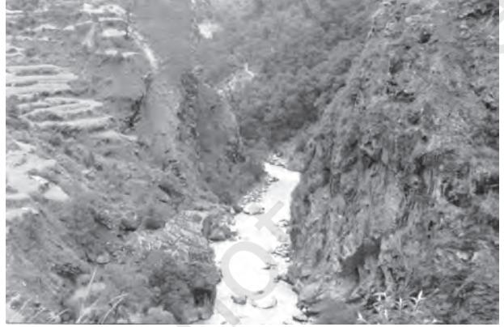
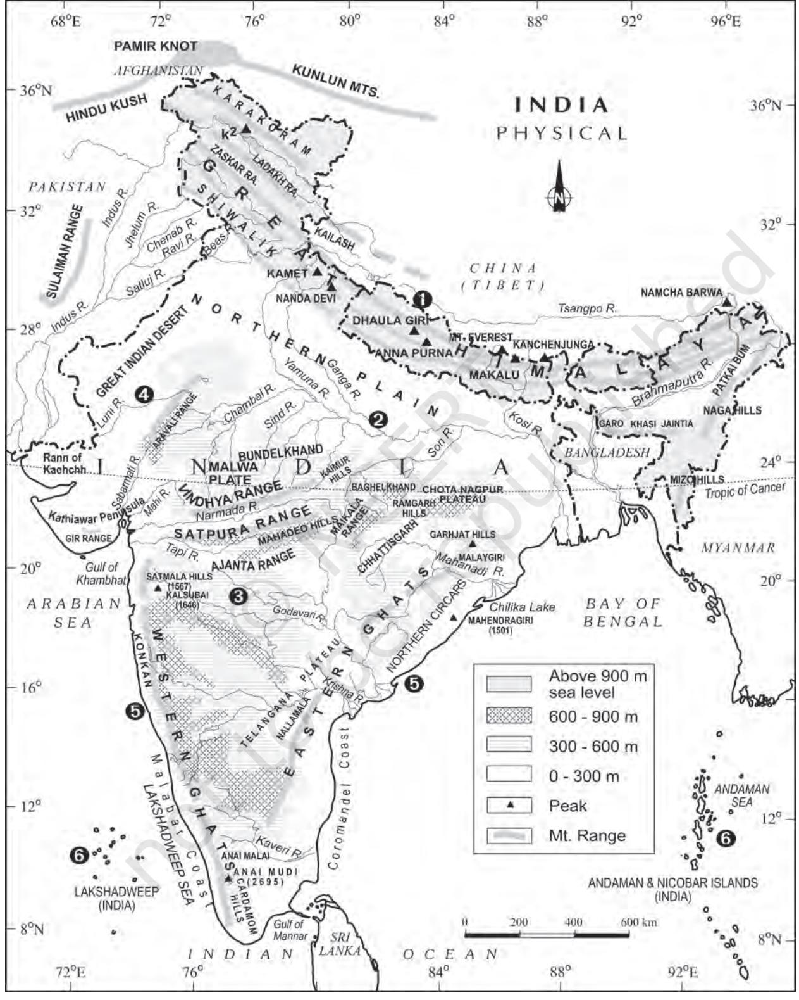
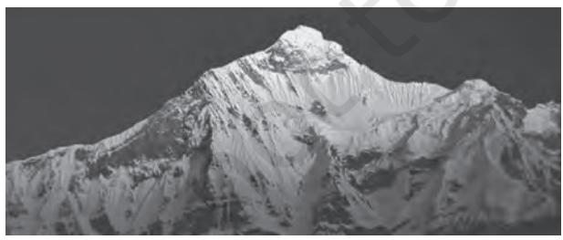
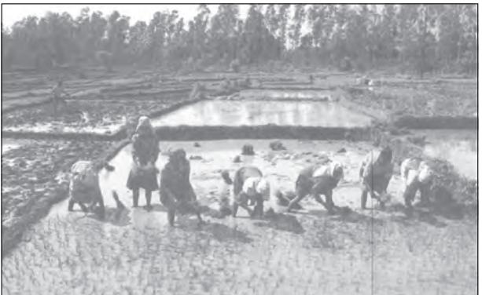
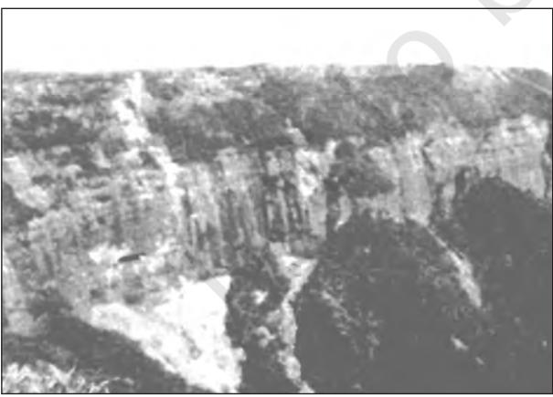
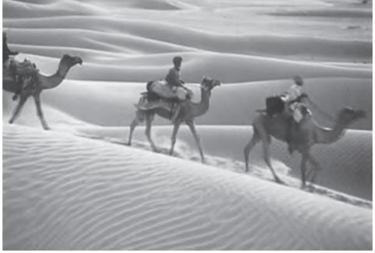
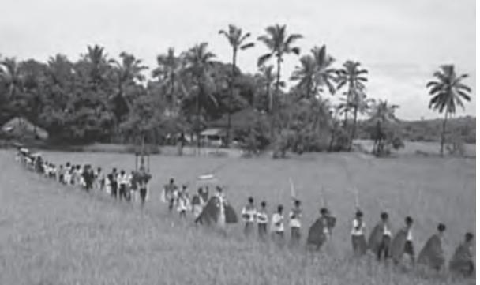
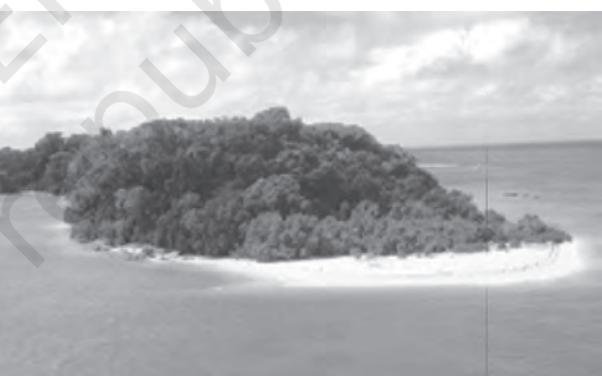

# **UNIT II**

# *PHYSIOGRAPHY*

*This unit deals with*

- **•** *Structure and Relief; physiographic divisions*
- **•** *Drainage systems: concept of water sheds the Himalayan and the Peninsular*

CHAPTER

# **STRUCTURE AND PHYSIOGRAPHY**

D o you know that our earth also has a history. The earth and its landforms that we see today have evolved over a very long time. Current estimation shows that the earth is approximately 4600 million years old. Over these long years, it has undergone many changes brought about primarily by the endogenic and exogenic forces. These forces have played a significant role in giving shape to various surface and subsurface features of the earth. You have already studied about the Plate Tectonics and the movement of the Earth's plates in the book *Fundamentals of Physical Geography* (NCERT, 2006). Do you know that the Indian plate was to the south of the equator millions of years ago? Do you also know that it was much larger in size and the Australian plate was a part of it? Over millions of years, this plate broke into many parts and the Australian plate moved towards the southeastern direction and the Indian plate to the north. Can you map different phases in the movement of the Indian plate? This northward movement of the Indian plate is still continuing and it has significant consequences on the physical environment of the Indian subcontinent. Can you name some important consequences of the northward movement of the Indian plate?

It is primarily through the interplay of these endogenic and exogenic forces and lateral movements of the plates that the present geological structure and geomorphologic processes active in the Indian subcontinent came into existence. Based on the variations in its geological structure and formations, India can be divided into three geological divisions. These geological regions broadly follow the physical features:

- (i) The Penisular Block
- (ii) The Himalayas and other Peninuslar Mountains
- (iii) Indo-Ganga-Brahmaputra Plain.

# **THE PENINSULAR BLOCK**

The northern boundary of the Peninsular Block may be taken as an irregular line running from Kachchh along the western flank of the Aravali Range near Delhi and then roughly parallel to the Yamuna and the Ganga as far as the Rajmahal Hills and the Ganga delta. Apart from these, the Karbi Anglong and the Meghalaya Plateau in the northeast and Rajasthan in the west are also extensions of this block. The northeastern parts are separated by the Malda fault in West Bengal from the Chotanagpur plateau. In Rajasthan, the desert and other desert– like features overlay this block.

The Peninsula is formed essentially by a great complex of very ancient gneisses and granites, which constitutes a major part of it. Since the Cambrian period, the Peninsula has been standing like a rigid block with the exception of some of its western coast which is submerged beneath the sea and some other parts changed due to tectonic activity without affecting the original basement. As a part of the Indo-Australian Plate, it has been subjected to various vertical movements and block faulting. The rift valleys of the Narmada, the Tapi and the Mahanadi and the Satpura block mountains are some examples of it. The Peninsula mostly consists of relict and residual mountains like the Aravali hills, the Nallamala hills, the Javadi hills, the Veliconda hills, the Palkonda range and the Mahendragiri hills, etc. The river valleys here are shallow with low gradients.

You are aware of the method of calculating the gradient as a part of your study of the book *Practical Work in Geography– Part I* (NCERT, 2006). Can you calculate the gradient of the Himalayan and the Peninsular rivers and draw the comparisons?

Most of the east flowing rivers form deltas before entering into the Bay of Bengal. The deltas formed by the Mahanadi, the Krishna, the Kaveri and the Godavari are important examples.

# **THE HIMALAYAS AND OTHER PENINSULAR MOUNTAINS**

The Himalayas along with other Peninsular mountains are young, weak and flexible in their geological structure unlike the rigid and stable Peninsular Block. Consequently, they are still subjected to the interplay of exogenic and endogenic forces, resulting in the development of faults, folds and thrust plains. These

**Figure 2.1 : A Gorge**

mountains are tectonic in origin, dissected by fast-flowing rivers which are in their youthful stage. Various landforms like gorges, V-shaped valleys, rapids, waterfalls, etc. are indicative of this stage.

## **INDO-GANGA-BRAHMAPUTRA PLAIN**

The third geological division of India comprises the plains formed by the river Indus, the Ganga and the Brahmaputra. Originally, it was a geo-synclinal depression which attained its maximum development during the third phase of the Himalayan mountain formation approximately about 64 million years ago. Since then, it has been gradually filled by the sediments brought by the Himalayan and Peninsular rivers. Average depth of alluvial deposits in these plains ranges from 1,000-2,000 m.

It is evident from the above discussion that there are significant variations among the different regions of India in terms of their geological structure, which has far-reaching impact upon other related aspects. Variations in the physiography and relief are important among these. The relief and physiography of India has been greatly influenced by the geological and geomorphological processes active in the Indian subcontinent.

#### **PHYSIOGRAPHY**

'Physiography' of an area is the outcome of structure, process and the stage of development. The land of India is characterised by great diversity in its physical features. The north has a vast expanse of rugged topography consisting of a series of mountain ranges with varied peaks, beautiful valleys and deep gorges. The south consists of stable table land with highly dissected plateaus, denuded rocks and developed series of scarps. In between these two lies the vast north Indian plain.

Based on these macro variations, India can be divided into the following physiographic divisions:

- (1) The Northern and North-eastern Mountains
- (2) The Northern Plain

**Figure 2.2 : India : Physical**

- (3) The Peninsular Plateau
- (4) The Indian Desert
- (5) The Coastal Plains
- (6) The Islands.

#### **The North and Northeastern Mountains**

The North and Northeastern Mountains consist of the Himalayas and the Northeastern hills. The Himalayas consist of a series of parallel mountain ranges. Some of the important ranges are the Greater Himalayan range, which includes the Great Himalayas and the Shiwalik. The general orientation of these ranges is from northwest to the southeast direction in the northwestern part of India. Himalayas in the Darjiling and Sikkim regions lie in an eastwest direction, while in Arunachal Pradesh they are from southwest to the northwest direction. In Nagaland, Manipur and Mizoram, they are in the northsouth direction. The approximate length of the Great Himalayan range, also known as the central axial range, is 2,500 km from east to west, and their width varies between 160-400 km from north to south. It is also evident from the map that the Himalayas stand almost like a strong and long wall between the Indian subcontinent and the Central and East Asian countries.

Himalayas are not only the physical barrier, they are also a climatic, drainage and cultural divide. Can you identify the impact of Himalayas on the geoenvironment of the countries of South Asia? Can you find some other examples of similar geoenvironmental divide in the world?

the Indus, the Ganga and the Brahmaputra. These plains extend approximately 3,200 km from the east to the west. The average width of these plains varies between 150-300 km. The maximum depth of alluvium deposits varies between 1,000-2,000 m. From the north to the south, these can be divided into three major zones: the *Bhabar*, the *Tarai* and the alluvial plains. The alluvial plains can be further divided into the *Khadar* and the

*Bhangar*. *Bhabar* is a narrow belt ranging between 8-10 km parallel to the Shiwalik foothills at the break-up of the slope. As a result of this, the streams and rivers coming from the mountains deposit heavy materials of rocks and boulders, and at times, disappear in this zone. South of the *Bhabar* is the *Tarai* belt, with an approximate width of 10-20 km where most of the streams and rivers re-emerge without having any properly demarcated channel, thereby, creating marshy and swampy conditions known as the *Tarai*. This has a luxurious growth of natural vegetation and houses a varied wildlife.

The south of *Tarai* is a belt consisting of old and new alluvial deposits known as the *Bhangar* and *Khadar* respectively. These plains have characteristic features of mature stage of fluvial erosional and depositional landforms such as sand bars, meanders, oxbow lakes and braided channels. The Brahmaputra plains are known for their riverine islands and sand bars. Most of these areas are subjected to periodic floods

**Figure 2.3 : The Himalayas**

#### **The Northern Plains**

The northern plains are formed by the alluvial deposits brought by the rivers –

**Figure 2.4 : Northern Plain**

The mouths of these mighty rivers also form some of the largest deltas of the world, for example, the famous Sunderbans delta. Otherwise, this is a featureless plain with a general elevation of 50-150 m above the mean sea level. The states of Haryana and Delhi form a water divide between the Indus and the Ganga river systems. As opposed to this, the Brahmaputra river flows from the northeast to the southwest direction before it takes an almost 90° southward turn at Dhubri before it enters into Bangladesh. These river valley plains have a fertile alluvial soil cover which supports a variety of crops like wheat, rice, sugarcane and jute, and hence, supports a large population.

#### **The Peninsular Plateau**

Rising from the height of 150 m above the river plains up to an elevation of 600-900 m is the irregular triangle known as the Peninsular plateau. Delhi ridge in the northwest, (extension of Aravalis), the Rajmahal hills in the east, Gir range in the west and the Cardamom hills in the south constitute the outer extent of the Peninsular plateau. However, an extension of this is also seen in the northeast, in the form of Shillong and Karbi-Anglong plateau. The Peninsular India is made up of a series of patland plateaus such as the Hazaribagh

**Figure 2.5 : A Part of Peninsular Plateau**

plateau, the Palamu plateau, the Ranchi plateau, the Malwa plateau, the Coimbatore plateau and the Karnataka plateau, etc. This is one of the oldest and the most stable landmass of India. The general elevation of the plateau is from the west to the east, which is also proved by the pattern of the flow of rivers. Name some rivers of the Peninsular plateau which have their confluence in the Bay of Bengal and the Arabian sea and mention some landforms which are typical to the east flowing rivers but are absent in the west flowing rivers. Some of the important physiographic features of this region are tors, block mountains, rift valleys, spurs, bare rocky structures, series of hummocky hills and wall-like quartzite dykes offering natural sites for water storage. The western and northwestern part of the plateau has an emphatic presence of black soil.

This Peninsular plateau has undergone recurrent phases of upliftment and submergence accompanied by crustal faulting and fractures. (The Bhima fault needs special mention, because of its recurrent seismic activities). These spatial variations have brought in elements of diversity in the relief of the Peninsular plateau. The northwestern part of the plateau has a complex relief of ravines and gorges. The ravines of Chambal, Bhind and Morena are some of the well-known examples.

On the basis of the prominent relief features, the Peninsular plateau can be divided into three broad groups:

- (i) The Deccan Plateau
- (ii) The Central Highlands
- (iii) The Northeastern Plateau.

#### *The Deccan Plateau*

This is bordered by the Western Ghats in the west, Eastern Ghats in the east and the Satpura, Maikal range and Mahadeo hills in the north. Western Ghats are locally known by different names such as Sahyadri in Maharashtra, Nilgiri hills in Karnataka and Tamil Nadu and Anaimalai hills and Cardamom hills in Kerala. Western Ghats are comparatively higher in elevation and more continuous than the Eastern Ghats. Their average elevation is about 1,500 m with the height increasing from north to south. 'Anaimudi' (2,695 m), the highest peak of Peninsular plateau is located on the Anaimalai hills of the Western Ghats followed by Dodabetta (2,637 m) on the Nilgiri hills. Most of the Peninsular rivers have their origin in the Western Ghats. Eastern Ghats comprising the discontinuous and low hills are highly eroded by the rivers such as the Mahanadi, the Godavari, the Krishna, the Kaveri, etc. Some of the important ranges include the Javadi hills, the Palconda range, the Nallamala hills, the Mahendragiri hills, etc. The Eastern and the Western Ghats meet each other at the Nilgiri hills.

### *The Central Highlands*

They are bounded to the west by the Aravali range. The Satpura range is formed by a series of scarped plateaus on the south, generally at an elevation varying between 600-900 m above the mean sea level. This forms the northernmost boundary of the Deccan plateau. It is a classic example of the relict mountains which are highly denuded and form discontinuous ranges. The extension of the Peninsular plateau can be seen as far as Jaisalmer in the West, where it has been covered by the longitudinal sand ridges and crescent-shaped sand dunes called *barchans*. This region has undergone metamorphic processes in its geological history, which can be corroborated by the presence of metamorphic rocks such as marble, slate, gneiss, etc.

The general elevation of the Central Highlands ranges between 700-1,000 m above the mean sea level and it slopes towards the north and northeastern directions. Most of the tributaries of the river Yamuna have their origin in the Vindhyan and Kaimur ranges. Banas is the only significant tributary of the river Chambal that originates from the Aravalli in the west. An eastern extension of the Central Highland is formed by the Rajmahal hills, to the south of

which lies a large reserve of mineral resources in the Chotanagpur plateau.

#### *The Northeastern Plateau*

In fact it is an extension of the main Peninsular plateau. It is believed that due to the force exerted by the northeastward movement of the Indian plate at the time of the Himalayan origin, a huge fault was created between the Rajmahal hills and the Meghalaya plateau. Later, this depression got filled up by the deposition activity of the numerous rivers. Today, the Meghalaya and Karbi Anglong plateau stand detached from the main Peninsular Block. The Meghalaya plateau is further sub-divided into three: (i) The Garo Hills; (ii) The Khasi Hills; (iii) The Jaintia Hills, named after the tribal groups inhabiting this region. An extension of this is also seen in the Karbi Anglong hills of Assam. Similar to the Chotanagpur plateau, the Meghalaya plateau is also rich in mineral resources like coal, iron ore, sillimanite, limestone and uranium. This area receives maximum rainfall from the south west monsoon. As a result, the Meghalaya plateau has a highly eroded surface. Cherrapunji displays a bare rocky surface devoid of any permanent vegetation cover.

#### **The Indian Desert**

To the northwest of the Aravali hills lies the Great Indian desert. It is a land of undulating topography dotted with longitudinal dunes and *barchans*. This region receives low rainfall below 150 mm per year; hence, it has arid climate with low vegetation cover. It is because of these characteristic features that this is also known as *Marusthali*. It is believed that during the Mesozoic era, this region was under the sea. This can be corroborated by the evidence available at wood fossils park at Aakal and marine deposits around Brahmsar, near Jaisalmer (The approximate age of the wood-fossils is estimated to be 180 million years). Though the underlying rock structure of the desert is an extension of the Peninsular plateau, yet, due to extreme arid conditions, its surface

**Figure 2.6 : The Indian Desert**

Can you identify the type of sand dunes shown in this picture?

features have been carved by physical weathering and wind actions. Some of the well pronounced desert land features present here are mushroom rocks, shifting dunes and oasis (mostly in its southern part). On the basis of the orientation, the desert can be divided into two parts: the northern part is sloping towards Sindh and the southern towards the Rann of Kachchh. Most of the rivers in this region are ephemeral. The Luni river flowing in the southern part of the desert is of some significance. Low precipitation and high evaporation makes it a water deficit region. There are some streams which disappear after flowing for some distance and present a typical case of inland drainage by joining a lake or playa. The lakes and the playas have brackish water which is the main source of obtaining salt.

#### **The Coastal Plains**

You have already read that India has a long coastline . On the basis of the location and active geomorphological processes, it can be broadly divided into two: (i) the western coastal plains; (ii) the eastern coastal plains.

The western coastal plains are an example of submerged coastal plain. It is believed that the city of Dwaraka which was once a part of the Indian mainland situated along the west coast is submerged under water. Because of this submergence it is a narrow belt and provides natural conditions for the development of ports and harbours. Kandla, Mazagaon, JLN port Navha Sheva, Marmagao, Mangalore, Cochin, etc. are some of the important natural ports located along the west coast. Extending from the Gujarat coast in the north to the Kerala coast in the south, the western coast may be divided into following divisions – the Kachchh and Kathiawar coast in Gujarat, Konkan coast in Maharashtra, Goan coast and Malabar coast in Karnataka and Kerala respectively. The western coastal plains are narrow in the middle and get broader towards north and south. The rivers flowing through this coastal plain do not form any delta. The Malabar coast has got certain distinguishing features in the form of *'Kayals'* (backwaters), which are used for fishing, inland navigation and also due to its special attraction for tourists. Every year the famous *Nehru Trophy Vallamkali* (boat race) is held in *Punnamada Kayal* in Kerala.

As compared to the western coastal plain, the eastern coastal plain is broader and is an example of an emergent coast. There are welldeveloped deltas here, formed by the rivers flowing eastward in to the Bay of Bengal. These include the deltas of the Mahanadi, the Godavari, the Krishna and the Kaveri. Because of its emergent nature, it has less number of ports and harbours. The continental shelf extends up to 500 km into the sea, which makes it difficult for the development of good ports and harbours. Name some ports on the eastern coast.

**Figure 2.7 : Coastal Plains**

On 26 December 2004, the Andaman and Nicobar Islands experienced one of the most devasting natural calamity. Can you name the calamity and identify some other areas which were adversely affected by the same calamity? What was its major consequence?

### **The Islands**

There are two major island groups in India – one in the Bay of Bengal and the other in the Arabian Sea. The Bay of Bengal island groups consist of about 572 islands/islets. These are situated roughly between 6°°N-14°°N and 92°°E -94°°E. The two principal groups of islets include the Ritchie's archipelago and the Labrynth island. The entire group of island is divided into two broad categories – the Andaman in the north and the Nicobar in the south. They are separated by a waterbody which is called the Ten degree channel. It is believed that these islands are an elevated portion of submarine mountains. However, some smaller islands are volcanic in origin. *Barren island,* the only active volcano in India is also situated in the Nicobar islands.

> Some important mountain peaks in Andaman and Nicobar Islands are Saddle peak (North Andaman – 738 m), Mount Diavolo (Middle Andaman – 515 m), Mount Koyob (South Andaman – 460 m) and Mount Thuiller (Great Nicobar – 642 m).

The coastal line has some coral deposits, and beautiful beaches. These islands receive convectional rainfall and have an equatorial type of vegetation.

The islands of the Arabian sea include Lakshadweep and Minicoy. These are scattered between 8°°N-12°°N and 71°°E -74°°E longitude. These islands are located at a distance of 220 km-440 km off the Kerala coast. The entire island group is built of coral deposits. There are approximately 36 islands of which 11 are inhabited. *Minicoy* is the largest island with an area of 453 sq. km. The entire group of islands is broadly divided by the Nine degree channel, north of which is the Amini Island and to the south of the Canannore Island. The Islands of this archipelago have storm beaches consisting of unconsolidated pebbles, shingles, cobbles and boulders on the eastern seaboard.

**Figure 2.8 : An Island**

#### **EXERCISES**

- 1. Choose the right answer from the four alternatives given below.
	- (i) Which one of the water bodies separates the Andaman from the Nicobar?
		- (a) 11°° Channel (c) 10°° Channel
			- (b) Gulf of Mannar (d) Andaman Sea
	- (ii) On which of the following hill range is the 'Dodabeta' peak situated?
		- (a) Nilgiri hills (c) Cardamom hills
		- (b) Anaimalai hills (d) Nallamala hills
- 2. Answer the following questions in about 30 words.
	- (i) If a person is to travel to Lakshadweep, from which coastal plain does he prefer and why?
	- (ii) Where in India will you find a cold desert? Name some important ranges of this region.
	- (iii) Why is the western coastal plain is devoid of any delta?
- 3. Answer the following questions in not more than 125 words.
	- (i) Make a comparison of the island groups of the Arabian Sea and the Bay of Bengal.
	- (ii) What are the important geomorphological features found in the river valley plains?
	- (iii) If you move from Badrinath to Sunderbans delta along the course of the river Ganga, what major geomorphological features will you come across?

#### **Project/Activity**

- (i) Make a list of major Himalayan peaks from the west to the east with the help of an atlas.
- (ii) Identify the major landforms of your state and analyse the major economic activity practised by the people in each landform.

