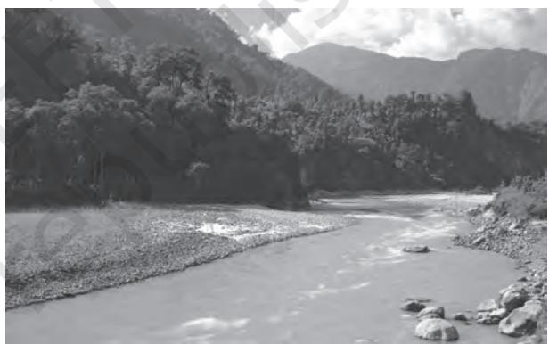
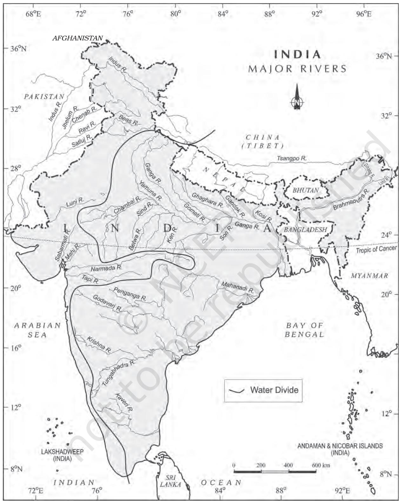
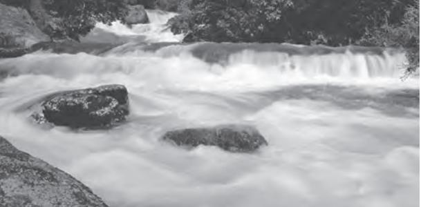

Y ou have observed water flowing through the rivers, *nalas* and even channels during rainy season which drain the excess water. Had these channels not been there, large-scale flooding would have occurred. Wherever channels are ill-defined or choked, flooding is a common phenomenon.

> The flow of water through well-defined channels is known as 'drainage' and the network of such channels is called a 'drainage system'. The drainage pattern of an area is the outcome of the geological time period, nature and structure of rocks, topography, slope, amount of water flowing and the periodicity of the flow.

Do you have a river near your village or city? Have you ever been there for boating or bathing? Is it perennial (always with water) or ephemeral (water during rainy season, and dry, otherwise)? Do you know that rivers flow in the same direction? You have studied about slopes in the other two textbooks of geography (NCERT, 2006) in this class . Can you, then, explain the reason for water flowing from one direction to the other? Why do the rivers originating from the Himalayas in the northern India and the Western Ghat in the southern India flow towards the east and discharge their waters in the Bay of Bengal?

**Figure 3.1 : A River in the Mountainous Region**

A river drains the water collected from a specific area, which is called its 'catchment area'. An area drained by a river and its tributaries is called a drainage basin. The boundary line

### **Important Drainage Patterns**

- (i) The drainage pattern resembling the branches of a tree is known as "dendritic" the examples of which are the rivers of northern plain.
- (ii) When the rivers originate from a hill and flow in all directions, the drainage pattern is known as 'radial'. The rivers originating from the Amarkantak range present a good example of it.
- (iii) When the primary tributaries of rivers flow parallel to each other and secondary tributaries join them at right angles, the pattern is known as 'trellis'.
- (iv) When the rivers discharge their waters from all directions in a lake or depression, the pattern is know as 'centripetal'.

Find out some of the patterns in the topo sheet given in Chapter 5 of *Practical Work in Geography– Part I (NCERT, 2006)*.

**Figure 3.2 : Major Rivers of India**

separating one drainage basin from the other is known as the watershed. The catchments of large rivers are called river basins while those of small rivulets and rills are often referred to as watersheds. There is, however, a slight difference between a river basin and a watershed. Watersheds are small in area while the basins cover larger areas.

River basins and watersheds are marked by unity. What happens in one part of the basin or watershed directly affects the other parts and the unit as a whole. That is why, they are accepted as the most appropriate micro, meso or macro planning regions.

Indian drainage system may be divided on various bases. On the basis of discharge of water (orientations to the sea), it may be grouped into: (i) the Arabian Sea drainage; and (ii) the Bay of Bengal drainage. They are separated from each other through the Delhi ridge, the Aravalis and the Sahyadris (water divide is shown by a line in Figure 3.1). Nearly 77 per cent of the drainage area consisting of the Ganga, the Brahmaputra, the Mahanadi, the Krishna, etc. is oriented towards the Bay of Bengal while 23 per cent comprising the Indus, the Narmada, the Tapi, the Mahi and the Periyar systems discharge their waters in the Arabian Sea.

On the basis of the size of the watershed, the drainage basins of India are grouped into three categories: (i) Major river basins with more than 20,000 sq. km of catchment area. It includes 14 drainage basins such as the Ganga, the Brahmaputra, the Krishna, the Tapi, the Narmada, the Mahi, the Pennar, the Sabarmati, the Barak, etc. (Appendix III). (ii) Medium river basins with catchment area between 2,000-20,000 sq. km incorporating 44 river basins such as the Kalindi, the Periyar, the Meghna, etc. (iii) Minor river basins with catchment area of less than 2,000 sq. km include fairly good number of rivers flowing in the area of low rainfall.

If you look at the Figure 3.1 you can see that many rivers have their sources in the Himalayas and discharge their waters either in the Bay of Bengal or in the Arabian Sea. Identify these rivers of North India. Large rivers flowing on the Peninsular plateau have their origin in the Western Ghats and discharge their waters in the Bay of Bengal. Identify these rivers of the South India.

The Narmada and Tapi are two large rivers which are exceptions. They along with many small rivers discharge their waters in the Arabian Sea.

Name these rivers of the western coastal region from the Konkan to the Malabar coast.

On the basis of the mode of origin, nature and characteristics, the Indian drainage may also be classified into the Himalayan drainage and the Peninsular drainage. Although it has the problem of including the Chambal, the Betwa, the Son, etc. which are much older in age and origin than other rivers that have their origin in the Himalayas, it is the most accepted basis of classification. Hence, this scheme has been followed in this book.

## **DRAINAGE SYSTEMS OF INDIA**

Indian drainage system consists of a large number of small and big rivers. It is the outcome of the evolutionary process of the three major physiographic units and the nature and characteristics of precipitation.

### **THE HIMALAYAN DRAINAGE**

The Himalayan drainage system has evolved through a long geological history. It mainly includes the Ganga, the Indus and the Brahmaputra river basins. Since these are fed both by melting of snow and precipitation, rivers of this system are perennial. These rivers pass through the giant gorges carved out by the erosional activity carried on simultaneously with the uplift of the Himalayas. Besides deep gorges, these rivers also form V-shaped valleys, rapids and waterfalls in their mountainous

**Figure 3.3 : Rapids**

course. While entering the plains, they form depositional features like flat valleys, ox-bow lakes, flood plains, braided channels, and deltas near the river mouth. In the Himalayan reaches, the course of these rivers is highly tortous, but over the plains they display a strong meandering tendency and shift their courses frequently. River Kosi, also know as the 'sorrow of Bihar', has been notorious for frequently changing its course. The Kosi brings huge quantity of sediments from its upper reaches and deposits it in the plains. The course gets blocked, and consequently, the river changes its course. Why does the Kosi river bring such huge quantity of sediments from the upper reaches? Do you think that the discharge of the water in the rivers in general and the Kosi in particular, remains the same, or does it fluctuate? When does the river course receive the maximum quantity of water? What are the positive and negative effects of flooding?

## **EVOLUTION OF THE HIMALAYAN DRAINAGE**

There are difference of opinion about the evolution of the Himalayan rivers. However, geologists believe that a mighty river called Shiwalik or Indo-Brahma traversed the entire longitudinal extent of the Himalaya from Assam to Punjab and onwards to Sind, and finally discharged into the Gulf of Sind near lower Punjab during the Miocene period some 5-24 million years ago The remarkable continuity of the Shiwalik and its lacustrine origin and alluvial deposits consisting of sands, silt, clay, boulders and conglomerates support this viewpoint.

It is opined that in due course of time Indo– Brahma river was dismembered into three main drainage systems: (i) the Indus and its five tributaries in the western part; (ii) the Ganga and its Himalayan tributaries in the central part; and (iii) the stretch of the Brahmaputra in Assam and its Himalayan tributaries in the eastern part. The dismemberment was probably due to the Pleistocene upheaval in the western Himalayas, including the uplift of the Potwar Plateau (Delhi Ridge), which acted as the water divide between the Indus and Ganga drainage systems. Likewise, the downthrusting of the Malda gap area between the Rajmahal hills and the Meghalaya plateau during the mid-pleistocene period, diverted the Ganga and the Brahmaputra systems to flow towards the Bay of Bengal.

# **THE RIVER SYSTEMS OF THE HIMALAYAN DRAINAGE**

The Himalayan drainage consists of several river systems but the following are the major river systems:

## **The Indus System**

It is one of the largest river basins of the world, covering an area of 11,65,000 sq. km (in India it is 321, 289 sq. km and a total length of 2,880 km (in India 1,114 km). The Indus also known as the Sindhu, is the westernmost of the Himalayan rivers in India. It originates from a glacier near Bokhar Chu (31°°15' N latitude and 81°°40' E longitude) in the Tibetan region at an altitude of 4,164 m in the Kailash Mountain range. In Tibet, it is known as *'Singi Khamban*; or Lion's mouth. After flowing in the northwest direction between the Ladakh and Zaskar ranges, it passes through Ladakh and Baltistan. It cuts across the Ladakh range, forming a spectacular gorge near Gilgit in Jammu and Kashmir. It enters into Pakistan near Chilas in the Dardistan region. Find out the area known as Dardistan.

The Indus receives a number of Himalayan tributaries such as the Shyok, the Gilgit, the Zaskar, the Hunza, the Nubra, the Shigar, the Gasting and the Dras. It finally emerges out of the hills near Attock where it receives the Kabul river on its right bank. The other important tributaries joining the right bank of the Indus are the Khurram, the Tochi, the Gomal, the Viboa and the Sangar. They all originate in the Sulaiman ranges. The river flows southward and receives 'Panjnad' a little above Mithankot. The Panjnad is the name given to the five rivers of Punjab, namely the Satluj, the Beas, the Ravi, the Chenab and the Jhelum. It finally discharges into the Arabian Sea, east of Karachi. The Indus flows in India only through Jammu and Kashmir.

The Jhelum, an important tributary of the Indus, rises from a spring at Verinag situated at the foot of the Pir Panjal in the south-eastern part of the valley of Kashmir. It flows through Srinagar and the Wular lake before entering Pakistan through a deep narrow gorge. It joins the Chenab near Jhang in Pakistan.

The Chenab is the largest tributary of the Indus. It is formed by two streams, the Chandra and the Bhaga, which join at Tandi near Keylong in Himachal Pradesh. Hence, it is also known as Chandrabhaga. The river flows for 1,180 km before entering into Pakistan.

The Ravi is another important tributary of the Indus. It rises west of the Rohtang pass in the Kullu hills of Himachal Pradesh and flows through the Chamba valley of the state. Before entering Pakistan and joining the Chenab near Sarai Sidhu, it drains the area lying between the southeastern part of the Pir Panjal and the Dhauladhar ranges.

The Beas is another important tributary of the Indus, originating from the Beas Kund near the Rohtang Pass at an elevation of 4,000 m above the mean sea level. The river flows through the Kullu valley and forms gorges at Kati and Largi in the Dhaoladhar range. It enters the Punjab plains where it meets the Satluj near Harike.

The Satluj originates in the 'Raksas tal' near Mansarovar at an altitude of 4,555 m in Tibet where it is known as Langchen Khambab. It flows almost parallel to the Indus for about 400 km before entering India, and comes out of a gorge at Rupar. It passes through the Shipki La on the Himalayan ranges and enters the Punjab plains. It is an antecedent river. It is a very important tributary as it feeds the canal system of the Bhakra Nangal project.

### **The Ganga System**

The Ganga is the most important river of India both from the point of view of its basin and cultural significance. It rises in the Gangotri glacier near Gaumukh (3,900 m) in the Uttarkashi district of Uttarakhand. Here, it is known as the Bhagirathi. It cuts through the Central and the Lesser Himalayas in narrow gorges. At Devprayag, the Bhagirathi meets the Alaknanda; hereafter, it is known as the Ganga. The Alaknanda has its source in the Satopanth glacier above Badrinath. The Alaknanda consists of the Dhauli and the Vishnu Ganga which meet at Joshimath or Vishnu Prayag. The other tributaries of Alaknanda such as the Pindar joins it at Karna Prayag while Mandakini or Kali Ganga meets it at Rudra Prayag. The Ganga enters the plains at Haridwar. From here, it flows first to the south, then to the south-east and east before splitting into two distributaries, namely the Bhagirathi and the Padma. The river has a length of 2,525 km. It is shared by Uttarakhand (110 km) and Uttar Pradesh (1,450 km), Bihar (445 km) and West Bengal (520 km). The Ganga basin covers about 8.6 lakh sq. km area in India alone. The Ganga

#### **Do you Know?**

'Namami Gange Programme', is an Integrated Conservation Mission, approved as "Flagship Programme" by the Union Government in June 2014 with the twin objectives of effective abatement of pollution, conservation and rejuvenation of the National River Ganga.

Main pillars of the Namami Gange Programme are:

- Sewerage Treatment Infrastructure
- River-Front Development
- River-Surface Cleaning
- Bio-Diversity
- Afforestation
- Public Awareness
- Industrial Effluent Monitoring
- Ganga Gram

You may explore about this project at http://nmcg.nic.in/NamamiGanga.aspx# river system is the largest in India having a number of perennial and non-perennial rivers originating in the Himalayas in the north and the Peninsula in the south, respectively. The Son is its major right bank tributary. The important left bank tributaries are the Ramganga, the Gomati, the Ghaghara, the Gandak, the Kosi and the Mahananda. The river finally discharges itself into the Bay of Bengal near the Sagar Island.

The Yamuna, the western most and the longest tributary of the Ganga, has its source in the Yamunotri glacier on the western slopes of Banderpunch range (6,316 m). It joins the Ganga at Prayag (Allahabad). It is joined by the Chambal, the Sind, the Betwa and the Ken on its right bank which originates from the Peninsular plateau while the Hindan, the Rind, the Sengar, the Varuna, etc. join it on its left bank. Much of its water feeds the western and eastern Yamuna and the Agra canals for irrigation purposes.

> Name the states which are drained by the river Yamuna.

The Chambal rises near Mhow in the Malwa plateau of Madhya Pradesh and flows northwards through a gorge up wards of Kota in Rajasthan, where the Gandhisagar dam has been constructed. From Kota, it traverses down to Bundi, Sawai Madhopur and Dholpur, and finally joins the Yamuna. The Chambal is famous for its badland topography called the Chambal ravines.

The Gandak comprises two streams, namely Kaligandak and Trishulganga. It rises in the Nepal Himalayas between the Dhaulagiri and Mount Everest and drains the central part of Nepal. It enters the Ganga plain in Champaran district of Bihar and joins the Ganga at Sonpur near Patna.

The Ghaghara originates in the glaciers of Mapchachungo. After collecting the waters of its tributaries – Tila, Seti and Beri, it comes out of the mountain, cutting a deep gorge at Shishapani. The river Sarda (Kali or Kali Ganga) joins it in the plain before it finally meets the Ganga at Chhapra.

The Kosi is an antecedent river with its source to the north of Mount Everest in Tibet, where its main stream Arun rises. After crossing the Central Himalayas in Nepal, it is joined by the Son Kosi from the West and the Tamur Kosi from the east. It forms Sapt Kosi after uniting with the river Arun.

The Ramganga is comparatively a small river rising in the Garhwal hills near Gairsain. It changes its course to the southwest direction after crossing the Shiwalik and enters into the plains of Uttar Pradesh near Najibabad. Finally, it joins the Ganga near Kannauj.

The Damodar occupies the eastern margins of the Chotanagpur Plateau where it flows through a rift valley and finally joins the Hugli. The Barakar is its main tributary. Once known as the 'sorrow of Bengal', the Damodar has been now tamed by the Damodar Valley corporation, a multipurpose project.

The Sarda or Saryu river rises in the Milam glacier in the Nepal Himalayas where it is known as the Goriganga. Along the Indo-Nepal border, it is called Kali or Chauk, where it joins the Ghaghara.

The Mahananda is another important tributary of the Ganga rising in the Darjiling hills. It joins the Ganga as its last left bank tributary in West Bengal.

The Son is a large south bank tributary of the Ganga, originating in the Amarkantak plateau. After forming a series of waterfalls at the edge of the plateau, it reaches Arrah, west of Patna, to join the Ganga.

#### **The Brahmaputra System**

The Brahmaputra, one of the largest rivers of the world, has its origin in the Chemayungdung glacier of the Kailash range near the Mansarovar lake. From here, it traverses eastward longitudinally for a distance of nearly 1,200 km in a dry and flat region of southern Tibet, where it is known as the Tsangpo, which means 'the purifier.' The Rango Tsangpo is the major right bank tributary of this river in Tibet. It emerges as a turbulent and dynamic river after carving out a deep gorge in the Central Himalayas near Namcha Barwa (7,755 m). The river emerges from the foothills under the name of Siang or Dihang. It enters India west of Sadiya town in Arunachal Pradesh. Flowing southwest, it receives its main left bank tributaries, viz., Dibang or Sikang and Lohit; thereafter, it is known as the Brahmaputra.

 The Brahmaputra receives numerous tributaries in its 750 km long journey through the Assam valley. Its major left bank tributaries are the Burhi Dihing and Dhansari (South) whereas the important right bank tributaries are the Subansiri, Kameng, Manas and Sankosh. The Subansiri which has its origin in Tibet, is an antecedent river. The Brahmaputra enters into Bangladesh near Dhubri and flows southward. In Bangladesh, the Tista joins it on its right bank from where the river is known as the Jamuna. It finally merges with the river Padma, which falls in the Bay of Bengal. The Brahmaputra is well-known for floods, channel shifting and bank erosion. This is due to the fact that most of its tributaries are large, and bring large quantity of sediments owing to heavy rainfall in its catchment area.

## **THE PENINSULAR DRAINAGE SYSTEM**

The Peninsular drainage system is older than the Himalayan one. This is evident from the broad, largely-graded shallow valleys, and the maturity of the rivers. The Western Ghats running close to the western coast act as the water divide between the major Peninsular rivers, discharging their water in the Bay of Bengal and as small rivulets joining the Arabian Sea. Most of the major Peninsular rivers except Narmada and Tapi flow from west to east. The Chambal, the Sind, the Betwa, the Ken, the Son, originating in the northern part of the Peninsula belong to the Ganga river system. The other major river systems of the Peninsular drainage are – the Mahanadi the Godavari, the Krishna and the Kaveri. Peninsular rivers are characterised by fixed course, absence of meanders and nonperennial flow of water. The Narmada and the Tapi which flow through the rift valley are, however, exceptions.

## **The Evolution of Peninsular Drainage System**

Three major geological events in the distant past have shaped the present drainage systems of Peninsular India: (i) Subsidence of the western flank of the Peninsula leading to its submergence below the sea during the early tertiary period. Generally, it has disturbed the symmetrical plan of the river on either side of the original watershed. (ii) Upheaval of the Himalayas when the northern flank of the Peninsular block was subjected to subsidence and the consequent trough faulting. The Narmada and The Tapi flow in trough faults and fill the original cracks with their detritus materials. Hence, there is a lack of alluvial and deltaic deposits in these rivers. (iii) Slight tilting of the Peninsular block from northwest to the southeastern direction gave orientation to the entire drainage system towards the Bay of Bengal during the same period.

#### **River Systems of the Peninsular Drainage**

There are a large number of river systems in the Peninsular drainage. A brief account of the major Peninsular river systems is given below:

The Mahanadi rises near Sihawa in Raipur district of Chhattisgarh and runs through Odisha to discharge its water into the Bay of Bengal. It is 851 km long and its catchment area spreads over 1.42 lakh sq. km. Some navigation is carried on in the lower course of this river. Fifty three per cent of the drainage basin of this river lies in Madhya Pradesh and Chhattisgarh, while 47 per cent lies in Odisha.

The Godavari is the largest Peninsular river system. It is also called the Dakshin Ganga. It rises in the Nasik district of Maharashtra and discharges its water into the Bay of Bengal. Its tributaries run through the states of Maharashtra, Madhya Pradesh, Chhattisgarh, Odisha and Andhra Pradesh. It is 1,465 km long with a catchment area spreading over 3.13 lakh sq. km 49 per cent of this, lies in Maharashtra, 20 per cent in Madhya Pradesh and Chhattisgarh, and the rest in Andhra Pradesh. The Penganga, the Indravati, the Pranhita, and the Manjra are its principal tributaries. The Godavari is subjected to heavy floods in its lower reaches to the south of Polavaram, where it forms a picturesque gorge. It is navigable only in the deltaic stretch. The river after Rajamundri splits into several branches forming a large delta.

The Krishna is the second largest eastflowing Peninsular river which rises near Mahabaleshwar in Sahyadri. Its total length is 1,401 km. The Koyna, the Tungbhadra and the Bhima are its major tributaries. Of the total catchment area of the Krishna, 27 per cent lies in Maharashtra, 44 per cent in Karnataka and 29 per cent in Andhra Pradesh and Telangana.

The Kaveririses in Brahmagiri hills (1,341m) of Kogadu district in Karnataka. Its length is 800 km and it drains an area of 81,155 sq. km. Since the upper catchment area receives rainfall during the southwest monsoon season (summer) and the lower part during the northeast monsoon season (winter), the river carries water throughout the year with comparatively less fluctuation than the other Peninsular rivers. About 3 per cent of the Kaveri basin falls in Kerala, 41 per cent in Karnataka and 56 per cent in Tamil Nadu. Its important tributaries are the Kabini, the Bhavani and the Amravati.

The Narmada originates on the western flank of the Amarkantak plateau at a height of about 1,057 m. Flowing in a rift valley between the Satpura in the south and the Vindhyan range in the north, it forms a picturesque gorge in marble rocks and Dhuandhar waterfall near Jabalpur. After flowing a distance of about 1,312 km, it meets the Arabian sea south of Bharuch, forming a broad 27 km long estuary. Its catchment area is about 98,796 sq. km. The Sardar Sarovar Project has been constructed on this river.

> Collect information about Narmada river conservation mission named "Namami Devi Narmade" and discuss with your peers.

The Tapi is the other important westward flowing river. It originates from Multai in the Betul district of Madhya Pradesh. It is 724 km long and drains an area of 65,145 sq. km. Nearly 79 per cent of its basin lies in Maharashtra, 15 per cent in Madhya Pradesh and the remaining 6 per cent in Gujarat.

Luni is the largest river system of Rajasthan, west of Aravali. It originates near Pushkar in two branches, i.e. the Saraswati and the Sabarmati, which join with each other at Govindgarh. From here, the river comes out of Aravali and is known as Luni. It flows towards the west till Telwara and then takes a southwest direction to join the Rann of Kuchchh. The entire river system is ephemeral.

# **EXTENT OF USABILITY OF RIVER WATER**

The rivers of India carry huge volumes of water per year but it is unevenly distributed both in time and space. There are perennial rivers carrying water throughout the year while the non-perennial rivers have very little water during the dry season. During the rainy season, much of the water is wasted in floods and flows down to the sea. Similarly, when there is a flood in one part of the country, the other area suffers from drought. Why does this happen? Is it the problem of availability of water resource or that of its management? Can you suggest some measures to mitigate the problems of floods and droughts simultaneously occuring in different parts of the country? (See Chapter 6 of the book).

Can these problems be solved or minimised by trasfering the surplus water from one basin to the water deficit basins? Do we have some schemes of inter -basin linkage?

### **Teachers may explain the following examples**

- Periyar Diversion Scheme
- Indira Gandhi Canal Project
- Kurnool-Cuddapah Canal
- Beas-Satluj Link Canal
- Ganga-Kaveri Link Canal

Have you read in the newspapers about the linking of rivers? Do you think that digging a canal is enough to transfer water from the Ganga basin to the Peninsular river? What is the major problem? Consult Chapter 2 of this book and find out the difficulties posed by the unevenness of the terrain. How can the water be lifted from the plain area to the plateau area? Is there sufficient surplus water in the north Indian rivers which can be transferred on a regular basis? Organise a debate on the whole issue and prepare a write up. How do you rank the following problems in using river water?

- (i) No availability in sufficient quantity
- (ii) River water pollution
- (iii) Load of silt in the river water
- (iv) Uneven seasonal flow of water
- (v) River water disputes between states
- (vi) Shrinking of channels due to the extension of settlements towards the thalweg.

Why are the rivers polluted? Have you seen the dirty waters of cities entering into the rivers? Where do the industrial affluents and wastes get disposed of ? Most of the cremation grounds are on the banks of rivers and the dead bodies are sometimes thrown in the rivers. On the occasion of some festivals, the flowers and statues are immersed in the rivers. Large scale bathing and washing of clothes also pollute river waters. How can the rivers be made pollution free? Have you read about Ganga Action Plan, or about a campaign for cleaning the Yamuna at Delhi? Collect materials on schemes for making rivers pollution free and organise the materials in a write up.

#### **EXERCISES**

- 1. Choose the right answer from the four alternatives given below.
	- (i) Which one of the following rivers was known as the 'Sorrow of Bengal'?
		- (a) The Gandak (c) The Kosi
		- (b) The Son (d) The Damodar
		- (ii) Which one of the following rivers has the largest river basin in India?
			- (a) The Indus (c) The Ganga
			- (b) The Brahmaputra (d) The Krishna
	- (iii) Which one of the following rivers is not included in 'Panchnad'?
		- (a) The Ravi (c) The Indus
		- (b) The Chenab (d) The Jhelum
	- (iv) Which one of the following rivers flows in a rift valley?
		- (a) The Son (c) The Yamuna
		- (b) The Narmada (d) The Luni
	- (v) Which one of the following is the place of confluence of the Alaknanda and the Bhagirathi?
		- (a) Vishnu Prayag (c) Karan Prayag
		- (b) Rudra Prayag (d) Deva Prayag
- 2. State the differences between the following.
	- (i) River Basin and Watershed
	- (ii) Dendritic and Trellis drainage pattern
	- (iii) Radial and Centripetal drainage pattern
	- (iv) Delta and Estuary
- 3. Answer the following questions in about 30 words.
	- (i) What are the socio-economic advantages of inter-linking of rivers in India?
- (ii) Write three characterstics of the Peninsular river.
- 4. Answer the following questions in not more than 125 words.
	- (i) What are the important characteristic features of north Indian rivers? How are these different from Peninsular rivers?
	- (ii) Suppose you are travelling from Haridwar to Siliguri along the foothills of the Himalayas. Name the important rivers you will come across. Describe the characteristics of any one of them.

#### **Project/Activity**

Study the Appendix III and answer the following questions.

- (i) Which river has the largest proportion of catchment area in the country?
- (ii) Make a comparative bar diagram on a graph paper to show the length of the courses of the rivers.

