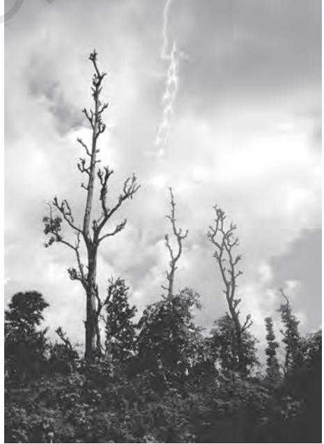
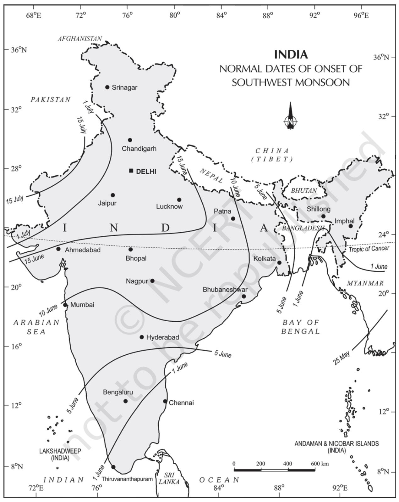
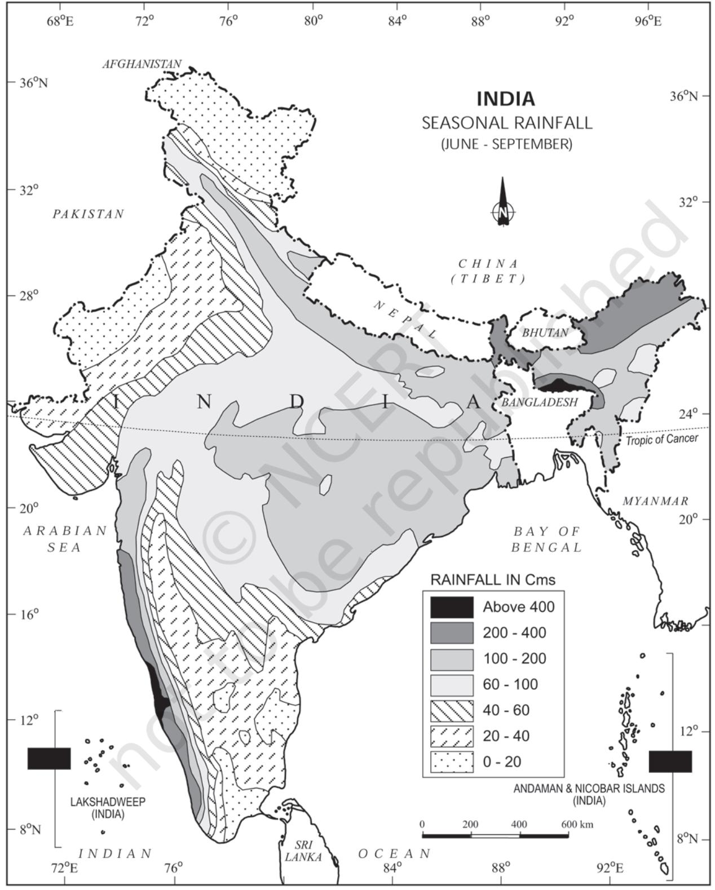
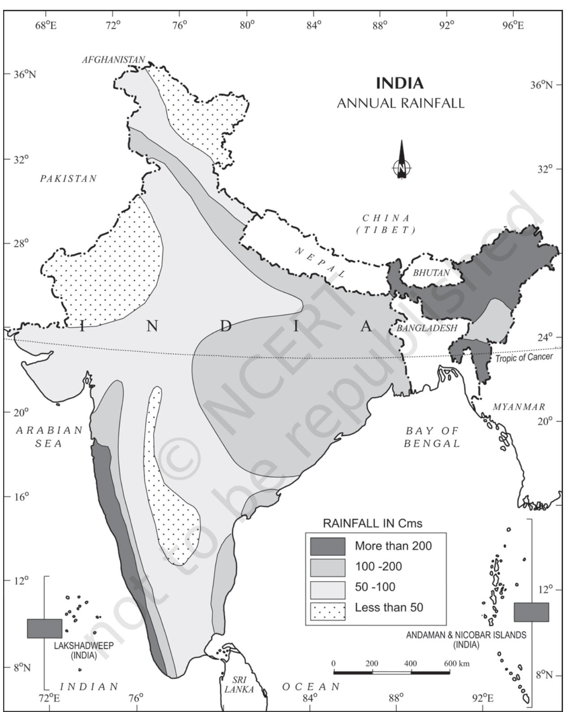

# **UNIT III**

# *CLIMATE AND VEGETATION*

*This unit deals with*

- **•** *Weather and climate spatial and temporal distribution of temperature, pressure, winds and rainfall; Indian monsoons: mechanism, onset and variability – spatial and temporal; climatic types*
- **•** *Natural vegetation forest types and distribution; wild life conservation; biosphere reserves*

W e drink more water during summers. Your uniform during the summer is different from the winters. Why do you wear lighter clothes during summers and heavy woollen clothes during winters in north India? In southern India, woollen clothes are not required. In northeastern states, winters are mild except in the hills. There are variations in weather conditions during different seasons. These changes occur due to the changes in the elements of weather (temperature, pressure, wind direction and velocity, humidity and precipitation, etc.).

> Weather is the momentary state of the atmosphere while climate refers to the average of the weather conditions over a longer period of time. Weather changes quickly, may be within a day or week but climate changes imperceptively and may be noted after 50 years or even more.

You have already studied about the monsoon in your earlier classes. You are also aware of the meaning of the word, "monsoon". Monsoon connotes the climate associated with seasonal reversal in the direction of winds. India has hot monsoonal climate which is the prevalent climate in south and southeast Asia.

# **UNITY AND DIVERSITY IN THE MONSOON CLIMATE**

The monsoon regime emphasises the unity of India with the rest of southeast Asian region. This view of broad unity of the monsoon type of climate should not, however, lead one to ignore its regional variations which differentiate the weather and climate of different regions of India. For example, the climate of Kerala and Tamil Nadu in the south are so different from that of Uttar Pradesh and Bihar in the north, and yet all of these have a monsoon type of climate. The climate of India has many regional variations expressed in the pattern of winds, temperature and rainfall, rhythm of seasons and the degree of wetness or dryness. These regional diversities may be described as sub-types of monsoon climate. Let us take a closer look at these regional variations in

temperature, winds and rainfall. While in the summer the mercury occasionally touches 55°°C in the western Rajasthan, it drops down to as low as minus 45°°C in winter around Leh. Churu in Rajasthan may record a temperature of 50°°C or more on a June day while the mercury hardly touches 19°°C in Tawang (Arunachal Pradesh) on the same day. On a December night, temperature in Drass (Ladakh) may drop down to minus 45°°C while Thiruvananthapuram or Chennai on the same night records 20°°C or 22°°C. These examples confirm that there are seasonal variations in temperature from place to place and from region to region in India. Not only this, if we take only a single place and record the temperature for just one day, variations are no less striking. In Kerala and in the Andaman Islands, the difference between day and night temperatures may be hardly seven or eight degree Celsius. But in the Thar desert, if the day temperature is around 50°°C, at night, it may drop down considerably upto 15°°-20°°C.

28 INDIA : PHYSICAL ENVIRONMENT

CHAPTER

Now, let us see the regional variations in precipitation. While snowfall occurs in the Himalayas, it only rains over the rest of the country. Similarly, variations are noticeable not only in the type of precipitation but also in its amount. While Cherrapunji and Mawsynram in the Khasi Hills of Meghalaya receive rainfall over 1,080 cm in a year, Jaisalmer in Rajasthan rarely gets more than 9 cm of rainfall during the same period.

Tura situated in the Garo Hills of Meghalaya may receive an amount of rainfall in a single day which is equal to 10 years of rainfall at Jaisalmer. While the annual precipitation is less than 10 cm in the northwest Himalayas and the western deserts, it exceeds 400 cm in Meghalaya.

The Ganga delta and the coastal plains of Odisha are hit by strong rain-bearing storms almost every third or fifth day in July and August while the Coromandal coast, a thousand km to the south, goes generally dry during these months. Most parts of the country get rainfall during June-September, but on the coastal areas of Tamil Nadu, it rains in the beginning of the winter season.

In spite of these differences and variations, the climate of India is monsoonal in rhythm and character.

# **FACTORS DETERMINING THE CLIMATE OF INDIA**

India's climate is controlled by a number of factors.

*Latitude :* You already know the latitudinal and longitudinal extent of the land of India. You also know that the Tropic of Cancer passes through the central part of India in east-west direction. Thus, northern part of the India lies in sub-tropical and temperate zone and the part lying south of the Tropic of Cancer falls in the tropical zone. The tropical zone being nearer to the equator, experiences high temperatures throughout the year with small daily and annual range. Area north of the Tropic of Cancer being away from the equator, experiences extreme climate with high daily and annual range of temperature.

*The Himalayan Mountains :* The lofty Himalayas in the north along with its extensions act as an effective climatic divide. The towering mountain chain provides an invincible shield to protect the subcontinent from the cold northern winds. These cold and chilly winds originate near the Arctic circle and blow across central and eastern Asia. The Himalayas also trap the monsoon winds, forcing them to shed their moisture within the subcontinent.

*Distribution of Land and Water :* India is flanked by the Indian Ocean on three sides in the south and girdled by a high and continuous mountain-wall in the north. As compared to the landmass, water heats up or cools down slowly. This differential heating of land and sea creates different air pressure zones in different seasons in and around the Indian subcontinent. Difference in air pressure causes reversal in the direction of monsoon winds.

*Distance from the Sea :* With a long coastline, large coastal areas have an equable climate. Areas in the interior of India are far away from the moderating influence of the sea. Such areas have extremes of climate. That is why, the people of Mumbai and the Konkan coast have hardly any idea of extremes of temperature and the seasonal rhythm of weather. On the other hand, the seasonal contrasts in weather at places in the interior of the country such as Delhi, Kanpur and Amritsar affect the entire sphere of life.

*Altitude :* Temperature decreases with height. Due to thin air, places in the mountains are cooler than places on the plains. For example, Agra and Darjiling are located on the same latitude, but temperature of January in Agra is 16°°C whereas it is only 4°°C in Darjiling.

*Relief :* The physiography or relief of India also affects the temperature, air pressure, direction and speed of wind and the amount and distribution of rainfall. The windward sides

#### **Inter Tropical Convergence Zone (ITCZ)**

**Inter Tropical Convergence Zone (ITCZ)** The Inter Tropical Convergence Zone (ITCZ) is a low pressure zone located at the equator where trade winds converge, and so, it is a zone where air tends to ascend. In July, the ITCZ is located around 20°N-25°N latitudes (over the Gangetic plain), sometimes called the monsoon trough. This monsoon trough encourages the development of thermal low over north and northwest India. Due to the shift of ITCZ, the trade winds of the southern hemisphere cross the equator between 40° and 60°E longitudes and start blowing from southwest to northeast due to the Coriolis force. It becomes southwest monsoon. In winter, the ITCZ moves southward, and so the reversal of winds from northeast to south and southwest, takes place. They are called northeast monsoons. The Inter Tropical Convergence Zone (ITCZ) is a low pressure zone located at the equator where trade winds converge, and so, it is a zone where air tends to ascend. In July, the ITCZ is located around 20°°N-25°°N latitudes (over the Gangetic plain), sometimes called the monsoon trough. This monsoon trough encourages the development of thermal low over north and northwest India. Due to the shift of ITCZ, the trade winds of the southern hemisphere cross the equator between 40°° and 60°°E longitudes and start blowing from southwest to northeast due to the Coriolis force. It becomes southwest monsoon. In winter, the ITCZ moves southward, and so the reversal of winds from northeast to south and southwest, takes place. They are called northeast monsoons.

of Western Ghats and Assam receive high rainfall during June-September whereas the southern plateau remains dry due to its leeward situation along the Western Ghats.

### **THE NATURE OF INDIAN MONSOON**

Monsoon is a familiar though a little known climatic phenomenon. Despite the observations spread over centuries, the monsoon continues to puzzle the scientists. Many attempts have been made to discover the exact nature and causation of monsoon, but so far, no single theory has been able to explain the monsoon fully. A real breakthrough has come recently when it was studied at the global rather than at regional level.

Systematic studies of the causes of rainfall in the South Asian region help to understand the causes and salient features of the monsoon, particularly some of its important aspects, such as:

- (i) The onset of the monsoon.
- (ii) Break in the monsoon.

#### **Onset of the Monsoon**

Towards the end of the nineteenth century, it

was believed that the differential heating of land and sea during the summer months is the mechanism which sets the stage for the monsoon winds to drift towards the subcontinent. During April and May when the sun shines vertically over the Tropic of Cancer, the large landmass in the north of Indian ocean gets intensely heated. This causes the formation of an intense low pressure in the northwestern part of the subcontinent. Since the pressure in the Indian Ocean in the south of the landmass is high as water gets heated slowly, the low pressure cell attracts the southeast trades across the Equator. These conditions help in the northward shift in the position of the ITCZ. The southwest monsoon may thus, be seen as a continuation of the southeast trades deflected towards the Indian subcontinent after crossing the Equator. These winds cross the Equator between 40°°E and 60°°E longitudes.

**Figure 4.1 : Onset of Monsoon**

The shift in the position of the ITCZ is also related to the phenomenon of the withdrawal of the westerly jet stream from its position over the north Indian plain, south of the Himalayas. The easterly jet stream sets in along 15°°N latitude only after the western jet stream has withdrawn itself from the region. This easterly jet stream is held responsible for the burst of the monsoon in India.

*Entry of Monsoon into India :* The southwest monsoon sets in over the Kerala coast by 1st June and moves swiftly to reach Mumbai and Kolkata between 10th and 13th June. By mid-July, southwest monsoon engulfs the entire subcontinent (Figure 4.2)

# **Break in the Monsoon**

During the south-west monsoon period after having rains for a few days, if rain fails to occur for one or more weeks, it is known as break in the monsoon. These dry spells are quite common during the rainy season. These breaks in the different regions are due to different reasons:

- (i) In northern India rains are likely to fail if the rain-bearing storms are not very frequent along the monsoon trough or the ITCZ over this region.
- (ii) Over the west coast the dry spells are associated with days when winds blow parallel to the coast.

### **THE RHYTHM OF SEASONS**

The climatic conditions of India can best be described in terms of an annual cycle of seasons. The meteorologists recognise the following four seasons :

- (i) the cold weather season
- (ii) the hot weather season
- (iii) the southwest monsoon season
- (iv) the retreating monsoon season.

#### **The Cold Weather Season**

*Temperature :* Usually, the cold weather season sets in by mid-November in northern India. December and January are the coldest months in the northern plain. The mean daily temperature remains below 21°°C over most parts of northern India. The night temperature may be quite low, sometimes going below freezing point in Punjab and Rajasthan.

There are three main reasons for the excessive cold in north India during this season :

- (i) States like Punjab, Haryana and Rajasthan being far away from the moderating influence of sea experience continental climate.
- (ii) The snowfall in the nearby Himalayan ranges creates cold wave situation; and
- (iii) Around February, the cold winds coming from the Caspian Sea and Turkmenistan

#### **EI-Nino and the Indian Monsoon**

EI-Nino is a complex weather system that appears once every three to seven years, bringing drought, floods and other weather extremes to different parts of the world.

The system involves oceanic and atmospheric phenomena with the appearance of warm currents off the coast of Peru in the Eastern Pacific and affects weather in many places including India. EI-Nino is merely an extension of the warm equatorial current which gets replaced temporarily by cold Peruvian current or Humbolt current (locate these currents in your atlas). This current increases the temperature of water on the Peruvian coast by 10°°C. This results in:

- (i) the distortion of equatorial atmospheric circulation;
- (ii) irregularities in the evaporation of sea water;
- (iii) reduction in the amount of planktons which further reduces the number of fish in the sea.

The word EI-Nino means 'Child Christ' because this current appears around Christmas in December. December is a summer month in Peru (Southern Hemisphere).

EI-Nino is used in India for forecasting long range monsoon rainfall. In 1990-91, there was a wild EI-Nino event and the onset of southwest monsoon was delayed over most parts of the country ranging from five to twelve days.

**Figure 4.2 : India : Normal Dates of Onset of the Southwest Monsoon**

bring cold wave along with frost and fog over the northwestern parts of India.

#### **Understanding the Monsoon**

Attempts have been made to understand the nature and mechanism of the monsoon on the basis of data collected on land, oceans and in the upper atmosphere. The intensity of southwest monsoon winds of southern oscillation can be measured, among others, by measuring the difference in pressure between Tahiti (roughly 20°°S and 140°°W) in French Polynesia in East Pacific and port Darwin (12°°30'S and 131°°E) in northern Australia. Indian Meteorological Department (IMD) can forecast the possible behaviour of monsoons on the basis of 16 indicators.

The Peninsular region of India, however, does not have any well-defined cold weather season. There is hardly any seasonal change in the distribution pattern of the temperature in coastal areas because of moderating influence of the sea and the proximity to equator. For example, the mean maximum temperature for January at Thiruvanantapuram is as high as 21°°C, and for June, it is 29.5°°C. Temperatures at the hills of Western Ghats remain comparatively low.

*Pressure and Winds :* By the end of December (22nd December), the sun shines vertically over the Tropic of Capricorn in the southern hemisphere. The weather in this season is characterised by feeble high pressure conditions over the northern plain. In south India, the air pressure is slightly lower. The isobars of 1019 mb and 1013 mb pass through northwest India and far south, respectively.

As a result, winds start blowing from northwestern high pressure zone to the low air pressure zone over the Indian Ocean in the south.

Due to low pressure gradient, the light winds with a low velocity of about 3-5 km per hour begin to blow outwards. By and large, the topography of the region influences the wind direction. They are westerly or northwesterly down the Ganga Valley. They become northerly in the Ganga-Brahmaputra delta. Free from the influence of topography, they are clearly northeasterly over the Bay of Bengal.

During the winters, the weather in India is pleasant. The pleasant weather conditions, however, at intervals, get disturbed by shallow cyclonic depressions originating over the east Mediterranean Sea and travelling eastwards across West Asia, Iran, Afghanistan and Pakistan before they reach the northwestern parts of India. On their way, the moisture content gets augmented from the Caspian Sea in the north and the Persian Gulf in the south. What is the role of Westerly Jet Streams in steering these depressions in India?

*Rainfall :* Winter monsoons do not cause rainfall as they move from land to the sea. It is because firstly, they have little humidity; and secondly, due to anti cyclonic circulation on land, the possibility of rainfall from them reduces. So, most parts of India do not have rainfall in the winter season. However, there are some exceptions to it:

- (i) In northwestern India, some weak temperate cyclones from the Mediterranean sea cause rainfall in Punjab, Haryana, Delhi and western Uttar Pradesh. Although the amount is meagre, it is highly beneficial for rabi crops. The precipitation is in the form of snowfall in the lower Himalayas. It is this snow that sustains the flow of water in the Himalayan rivers during the summer months. The precipitation goes on decreasing from west to east in the plains and from north to south in the mountains. The average winter rainfall in Delhi is around 53 mm. In Punjab and Bihar, rainfall remains
between 25 mm and 18 mm respectively.

- (ii) Central parts of India and northern parts of southern Peninsula also get winter rainfall occasionally.
- (iii) Arunachal Pradesh and Assam in the northeastern parts of India also have rains between 25 mm and 50 mm during these winter months.
- (iv) During October and November, northeast monsoon while crossing over the Bay of Bengal, picks up moisture and causes torrential rainfall over the Tamil Nadu coast, southern Andhra Pradesh, southeast Karnataka and southeast Kerala.

#### **The Hot Weather Season**

*Temperature:* With the apparent northward movement of the sun towards the Tropic of Cancer in March, temperatures start rising in north India. April, May and June are the months of summer in north India. In most parts of India, temperatures recorded are between 30°-32°°C. In March, the highest day temperature of about 38°°C occurs in the Deccan Plateau while in April, temperature ranging between 38°°C and 43°°C are found in Gujarat and Madhya Pradesh. In May, the heat belt moves further north, and in the north-western part of India, temperatures around 48°°C are not uncommon.

The hot weather season in south India is mild and not so intense as found in north India. The Peninsular situation of south India with moderating effect of the oceans keeps the temperatures lower than that prevailing in north India. So, temperatures remain between 26°°C and 32°°C. Due to altitude, the temperatures in the hills of Western Ghats remain below 25°°C. In the coastal regions, the north-south extent of isotherms parallel to the coast confirms that temperature does not decrease from north to south rather it increases from the coast to the interior. The mean daily minimum temperature during the summer months also remains quite high and rarely goes below 26°°C.

*Pressure and Winds :* The summer months are a period of excessive heat and falling air pressure in the northern half of the country. Because of the heating of the subcontinent, the ITCZ moves northwards occupying a position centred at 25°°N in July. Roughly, this elongated low pressure monsoon trough extends over the Thar desert in the north-west to Patna and Chotanagpur plateau in the east-southeast. The location of the ITCZ attracts a surface circulation of the winds which are southwesterly on the west coast as well as along the coast of West Bengal and Bangladesh. They are easterly or southeasterly over north Bengal and Bihar. It has been discussed earlier that these currents of southwesterly monsoon are in reality 'displaced' equatorial easterlies. The influx of these winds by mid-June brings about a change in the weather towards the rainy season.

In the heart of the ITCZ in the northwest, the dry and hot winds known as *'Loo'*, blow in the afternoon, and very often, they continue to well into midnight. Dust storms in the evening are very common during May in Punjab, Haryana, Eastern Rajasthan and Uttar Pradesh. These temporary storms bring a welcome respite from the oppressing heat since they bring with them light rains and a pleasant cool breeze. Occasionally, the moisture-laden winds are attracted towards the periphery of the trough. A sudden contact between dry and moist air masses gives rise to local storms of great intensity. These local storms are associated with violent winds, torrential rains and even hailstorms.

#### **Some Famous Local Storms of Hot Weather Season**

- *(i) Mango Shower :* Towards the end of summer, there are pre-monsoon showers which are a common phenomena in Kerala and coastal areas of Karnataka. Locally, they are known as mango showers since they help in the early ripening of mangoes.
- *(ii) Blossom Shower :* With this shower, coffee flowers blossom in Kerala and nearby areas.
- *(iii) Nor Westers :* These are dreaded evening thunderstorms in Bengal and Assam. Their notorious nature can be understood from the local nomenclature of *'Kalbaisakhi',* a calamity of the month of *Baisakh*. These showers are useful for tea, jute and rice cultivation. In Assam, these storms are known as *"Bardoisila"*.
- *(iv) Loo :* Hot, dry and oppressing winds blowing in the Northern plains from Punjab to Bihar with higher intensity between Delhi and Patna.

# **THE SOUTHWEST MONSOON SEASON**

As a result of rapid increase of temperature in May over the northwestern plains, the low pressure conditions over there get further intensified. By early June, they are powerful enough to attract the trade winds of Southern Hemisphere coming from the Indian Ocean. These southeast trade winds cross the equator and enter the Bay of Bengal and the Arabian Sea, only to be caught up in the air circulation over India. Passing over the equatorial warm currents, they bring with them moisture in abundance. After crossing the equator, they follow a southwesterly direction. That is why they are known as southwest monsoons.

The rain in the southwest monsoon season begins rather abruptly. One result of the first rain is that it brings down the temperature substantially. This sudden onset of the moisture-laden winds associated with violent thunder and lightening, is often termed as the "break" or "burst" of the monsoons. The monsoon may burst in the first week of June in the coastal areas of Kerala, Karnataka, Goa and Maharashtra while in the interior parts of the country, it may be delayed to the first week of July. The day temperature registers a decline of 5°°C to 8°°C between mid-June and mid-July.

As these winds approach the land, their southwesterly direction is modified by the relief and thermal low pressure over the northwest India. The monsoon approaches the landmass in two branches:

- (i) The Arabian Sea branch
- (ii) The Bay of Bengal branch.

# **Monsoon Winds of the Arabian Sea**

The monsoon winds originating over the Arabian Sea further split into three branches:

- (i) Its one branch is obstructed by the Western Ghats. These winds climb the slopes of the Western Ghats from 900-1200 m. Soon, they become cool, and as a result, the windward side of the Sahyadris and Western Coastal Plain receive very heavy rainfall ranging between 250 cm and 400 cm. After crossing the Western Ghats, these winds descend and get heated up. This reduces humidity in the winds. As a result, these winds cause little rainfall east of the Western Ghats. This region of low rainfall is known as the rain-shadow area. Find out the rainfall at Kozhikode, Mangalore, Pune and Bengaluru and note the difference.
- (ii) Another branch of the Arabian sea monsoon strikes the coast north of Mumbai. Moving along the Narmada and Tapi river valleys, these winds cause rainfall in extensive areas of central India. The Chotanagpur plateau gets 15 cm rainfall from this part of the branch. Thereafter, they enter the Ganga plains and mingle with the Bay of Bengal branch.
- (iii) A third branch of this monsoon wind strikes the Saurashtra Peninsula and the Kachchh. It then passes over west

**Figure 4.3 : India : Seasonal Rainfall (June-September)**

Rajasthan and along the Aravalis, causing only a scanty rainfall. In Punjab and Haryana, it too joins the Bay of Bengal branch. These two branches, reinforced by each other, cause rains in the western Himalayas,

# **Monsoon Winds of the Bay of Bengal**

The Bay of Bengal branch strikes the coast of Myanmar and part of southeast Bangladesh. But the Arakan Hills along the coast of Myanmar deflect a big portion of this branch towards the Indian subcontinent. The monsoon, therefore, enters West Bengal and Bangladesh from south and southeast instead of from the south-westerly direction. From here, this branch splits into two under the influence of the Himalayas and the thermal low is northwest India. Its one branch moves westward along the Ganga plains reaching as far as the Punjab plains. The other branch moves up the Brahmaputra valley in the north and the northeast, causing widespread rains. Its sub-branch strikes the Garo and Khasi hills of Meghalaya. Mawsynram, located on the crest of Khasi hills, receives the highest average annual rainfall in the world.

Here it is important to know why the Tamil Nadu coast remains dry during this season. There are two factors responsible for it:

- (i) The Tamil Nadu coast is situated parallel to the Bay of Bengal branch of southwest monsoon.
- (ii) It lies in the rainshadow area of the Arabian Sea branch of the south-west monsoon.

# **Season of Retreating Monsoon**

The months of October and November are known for retreating monsoons. By the end of September, the southwest monsoon becomes weak as the low pressure trough of the Ganga plain starts moving southward in response to the southward march of the sun. The monsoon retreats from the western Rajasthan by the first week of September. It withdraws from Rajasthan, Gujarat, Western Ganga plain and the Central Highlands by the end of the month. By the beginning of October, the low pressure covers northern parts of the Bay of Bengal and by early November, it moves over Karnataka and Tamil Nadu. By the middle of December, the centre of low pressure is completely removed from the Peninsula.

The retreating southwest monsoon season is marked by clear skies and rise in temperature. The land is still moist. Owing to the conditions of high temperature and humidity, the weather becomes rather oppressive. This is commonly known as the 'October heat'. In the second half of October, the mercury begins to fall rapidly, particularly in northern India. The weather in the retreating monsoon is dry in north India but it is associated with rain in the eastern part of the Peninsula. Here, October and November are the rainiest months of the year.

The widespread rain in this season is associated with the passage of cyclonic depressions which originate over the Andaman Sea and manage to cross the eastern coast of the southern Peninsula. These tropical cyclones are very destructive. The thickly populated deltas of the Godavari, Krishna and Kaveri are their preferred targets. Every year cyclones bring disaster here. A few cyclonic storms also strike the coast of West Bengal, Bangladesh and Myanmar. A bulk of the rainfall of the Coromondal coast is derived from these depressions and cyclones. Such cyclonic storms are less frequent in the Arabian Sea.

# **TRADITIONAL INDIAN SEASONS**

In the Indian tradition, a year is divided into six two-monthly seasons. This cycle of seasons, which the common people in north and central India follow is based on their practical experience and age-old perception of weather phenomena. However, this system does not match with the seasons of south India where there is little variation in the seasons.

| Seasons | Months | Months |
| --- | --- | --- |
|  | (According to the | (According to the |
|  | Indian Calendar) | Gregorian Calendar) |
| Vasanta | Chaitra-Vaisakha | March-April |
| Grishma | Jyaistha-Asadha | May-June |
| Varsha | Sravana-Bhadra | July-August |
| Sharada | Asvina-Kartika | September-October |
| Hemanta | Margashirsa-Pausa | November-December |
| Shishira | Magha-Phalguna | January-February |

# **Distribution of Rainfall**

The average annual rainfall in India is about 125 cm, but it has great spatial variations .

*Areas of High Rainfall* : The highest rainfall occurs along the west coast, on the Western Ghats, as well as in the sub-Himalayan areas is the northeast and the hills of Meghalaya. Here the rainfall exceeds 200 cm. In some parts of Khasi and Jaintia hills, the rainfall exceeds 1,000 cm. In the Brahmaputra valley and the adjoining hills, the rainfall is less then 200 cm.

*Areas of Medium Rainfall* : Rainfall between 100-200 cm is received in the southern parts of Gujarat, east Tamil Nadu, northeastern Peninsula covering Odisha, Jharkhand, Bihar, eastern Madhya Pradesh, northern Ganga plain along the sub-Himalayas and the Cachar Valley and Manipur.

*Areas of Low Rainfall* : Western Uttar Pradesh, Delhi, Haryana, Punjab, Jammu and Kashmir, eastern Rajasthan, Gujarat and Deccan Plateau receive rainfall between 50-100 cm.

*Areas of Inadequate Rainfall*: Parts of the Peninsula, especially in Andhra Pradesh, Karnataka and Maharashtra, Ladakh and most of western Rajasthan receive rainfall below 50 cm.

Snowfall is restricted to the Himalayan region.

Identify the pattern of rainfall after consulting the rainfall map.

#### **Monsoons and the Economic Life in India**

- (i) Monsoon is that axis around which revolves the entire agricultural cycle of India. It is because about 64 per cent people of India depend on agriculture for their livelihood and agriculture itself is based on southwest monsoon.
- (ii) Except Himalayas all the parts of the country have temperature above the threashold level to grow the crops or plants throughout the year..
- (iii) Regional variations in monsoon climate help in growing various types of crops.
- (iv) Variability of rainfall brings droughts or floods every year in some parts of the country.
- (v) Agricultural prosperity of India depends very much on timely and adequately distributed rainfall. If it fails, agriculture is adversely affected particularly in those regions where means of irrigation are not developed.
- (vi) Sudden monsoon burst creates problem of soil erosion over large areas in India.
- (vii) Winter rainfall by temperate cyclones in north India is highly beneficial for rabi crops.
- (viii) Regional climatic variation in India is reflected in the vast variety of food, clothes and house types.

#### **GLOBAL WARMING**

You know that change is the law of nature. Climate has also witnessed change in the past at the global as well as at local levels. It is changing even now but the change is imperceptible. A number of geological evidences suggest that once upon a time, large part of the earth was under ice cover. Now you might have read or heard the debate on global warming. Besides the natural causes, human activities such as large scale industrialisation and presence of polluting gas in the atmosphere are also important factors responsible for global warming. You might have heard about the "green house effect" while discussing global warming.

The temperature of the world is significantly increasing. Carbon dioxide produced by human activities is a major source of concern. This gas, released to the atmosphere in large quantities by burning of fossil fuel, is increasing gradually. Other gases like methane, chlorofluorocarbons, and nitrous oxide which are present in much smaller concentrations in the atmosphere, together with carbon dioxide are known as

**Figure 4.4 : India : Annual Rainfall**

green house gases. These gases are better absorbers of long wave radiations than carbon dioxide, and so, are more effective at enhancing the green house effect. These gases have been contributing to global warming. It is said that due to global warming the polar ice caps and mountain glaciers would melt and the amount of water in the oceans would increase.

The mean annual surface temperature of the earth in the past 150 years has increased. It is projected that by the year 2,100, global temperature will increase by about 2° C. This rise in temperature will cause many other changes: one of these is a rise in sea level, as a result of melting of glaciers and sea-ice due to warming. According to the current prediction, on an average, the sea level will rise 48 cm by the end of twenty first century. This would increase the incidence of annual flooding. Climatic change would promote insect-borne diseases like malaria, and lead to shift in climatic boundaries, making some regions wetter and others drier. Agricultural pattern would shift and human population as well as the ecosystem would experience change. What would happen to the Indian sea coasts if the sea level rises 50 cm above the present one?

#### **EXERCISES**

- 1. Choose the right answer from the four alternatives given below.
	- (i) What causes rainfall on the coastal areas of Tamil Nadu in the beginning of winters?
		- (a) South-West monsoon (c) North-Eastern monsoon
		- (b) Temperate cyclones (d) Local air circulation
	- (ii) What is the proportion of area of India which receives annual rainfall less than 75 cm?
		- (a) Half (c) Two-third
			-
		- (b) One-third (d) Three-fourth
	- (iii) Which one of the following is not a fact regarding South India?
		- (a) Diurnal range of temperature is less here.
		- (b) Annual range of temperature is less here.
		- (c) Temperatures here are high throughout the year.
		- (d) Extreme climatic conditions are found here.
	- (iv) Which one of the following phenomenon happens when the sun shines vertically over the Tropic of Capricorn in the southern hemisphere?
		- (a) High pressure develops over North-western India due to low temperatures.
		- (b) Low pressure develops over North-western India due to high temperatures.
		- (c) No changes in temperature and pressure occur in north-western India.
		- (d) 'Loo' blows in the North-western India.
- 2. Answer the following questions in about 30 words.
	- (i) What is the Inter-Tropical Convergene Zone?
	- (ii) What is meant by 'bursting of monsoon'? Name the place of India which gets the highest rainfall.
	- (iii) Which type(s) of cyclones cause rainfall in north-western India during winter? Where do they originate?
- 3. Answer the following questions in not more than 125 words.
	- (i) Notwithstanding the broad climatic unity, the climate of India has many regional variations. Elaborate this statement giving suitable examples.
	- (ii) How many distinct seasons are found in India as per the Indian Meteorological Department? Discuss the weather conditions associated with any one season in detail.

#### **Project/Activity**

On the outline map of India, show the following:

- (i) Areas of winter rain
- (ii) Wind direction during the summer season
- (iii) Areas having less than 15°°C temperature in January
- (iv) Isohyte of 100 cm.

