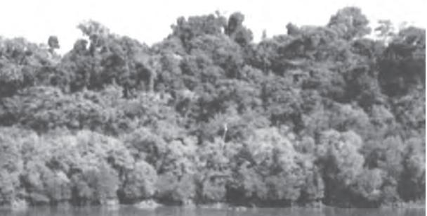
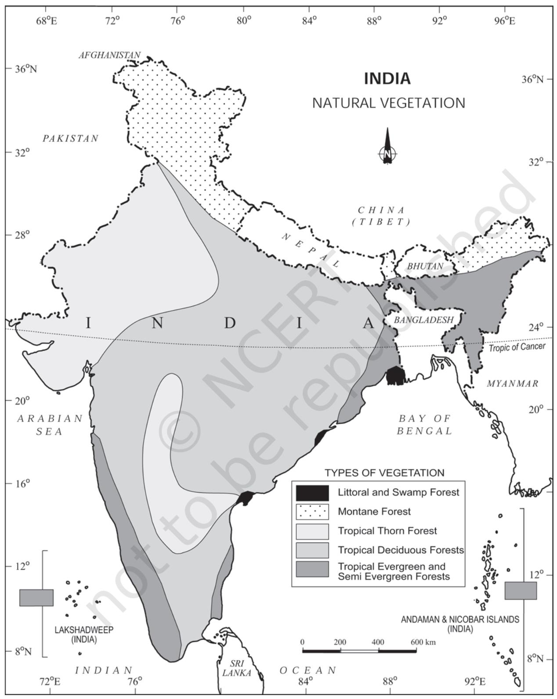
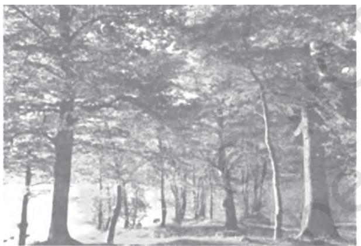
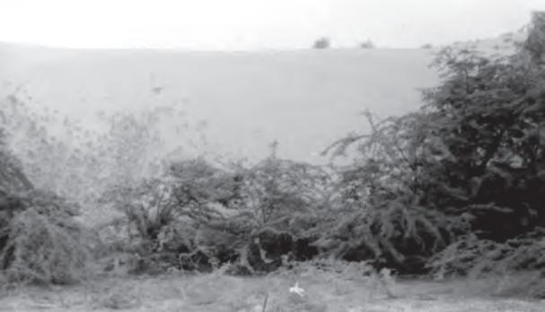
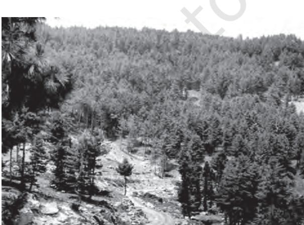
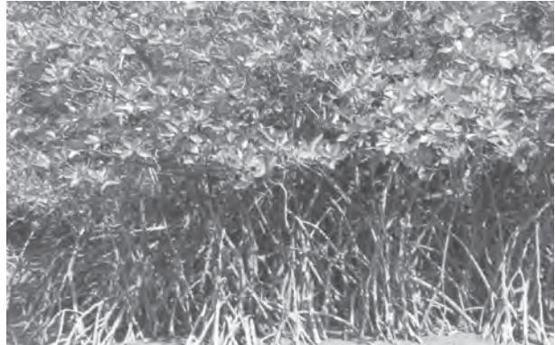
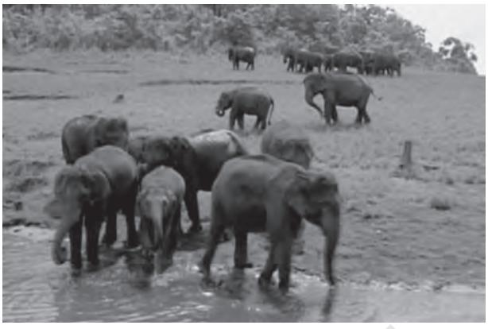
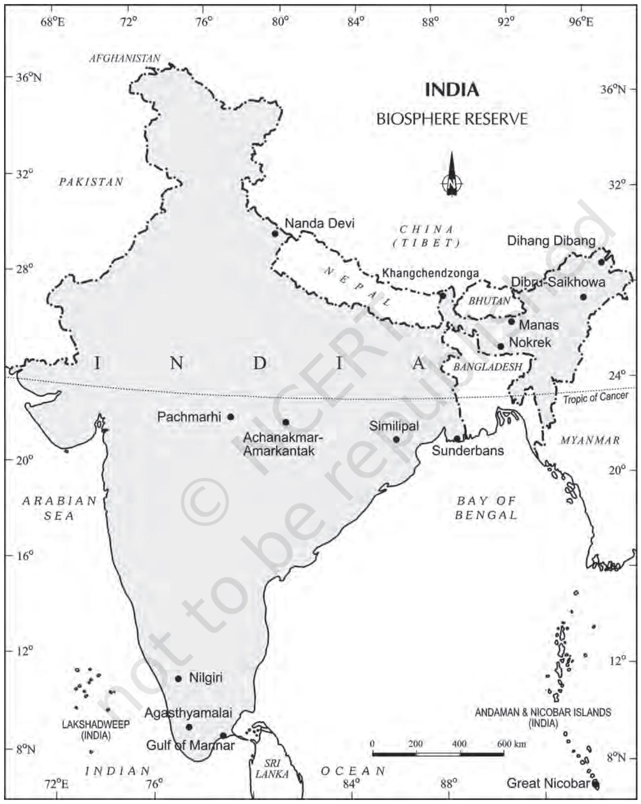
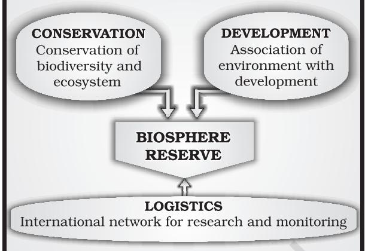

H ave you ever been to a forest for a picnic? You might have surely gone to a park if you live in a city or to a mango, guava or coconut orchard, if you live in a village. How do you differentiate between the natural vegetation and the planted vegetation? The same variety may be found growing wild in the forest under natural conditions and the same tree may be the planted one in your garden under human supervision.

Natural vegetation refers to a plant community that has been left undisturbed over a long time, so as to allow its individual species to adjust themselves to climate and soil conditions as fully as possible.

India is a land of great variety of natural vegetation. Himalayan heights are marked with temperate vegetation; the Western Ghats and the Andaman Nicobar Islands have tropical rain forests, the deltaic regions have tropical forests and mangroves; the desert and semi desert areas of Rajasthan are known for cactii, a wide variety of bushes and thorny vegetation. Depending upon the variations in the climate and the soil, the vegetation of India changes from one region to another.

On the basis of certain common features such as predominant vegetation type and climatic regions, Indian forests can be divided into the following groups:

## **TYPES OF FORESTS**

- (i) Tropical Evergreen and Semi Evergreen forests
- (ii) Tropical Deciduous forests
- (iii) Tropical Thorn forests
- (iv) Montane forests
- (v) Littoral and Swamp forests.

## **Tropical Evergreen and Semi Evergreen Forests**

These forests are found in the western slope of the Western Ghats, hills of the northeastern region and the Andaman and Nicobar Islands. They are found in warm and humid areas with an annual precipitation of over 200 cm and mean annual temperature above 22oC. Tropical evergreen forests are well stratified, with layers closer to the ground and are covered with shrubs and creepers, with short structured trees followed by tall variety of trees. In these forests, trees reach great heights up to 60 m or above. There is no definite time for trees to shed their leaves, flowering and fruition. As such these forests appear green all the year round. Species found in these forests include rosewood, mahogony, aini, ebony, etc.

The semi evergreen forests are found in the less rainy parts of these regions. Such forests have a mixture of evergreen and moist deciduous trees. The undergrowing climbers provide an evergreen character to these forests. Main species are white cedar, hollock and kail.

**Figure 5.1 : Evergreen Forest**

**Figure 5.2 : Natural Vegetation**

The British were aware of the economic value of the forests in India, hence, large scale exploitation of these forests was started. The structure of forests was also changed. The oak forests in Garhwal and Kumaon were replaced by pine (chirs) which was needed to lay railway lines. Forests were also cleared for introducing plantations of tea, rubber and coffee. The British also used timber for construction activities as it acts as an insulator of heat. The protectional use of forests was, thus, replaced by commercial use.

## **Tropical Deciduous Forests**

These are the most widespread forests in India. They are also called the monsoon forests. They spread over regions which receive rainfall between 70-200 cm. On the basis of the availability of water, these forests are further divided into moist and dry deciduous.

**Figure 5.3 : Deciduous Forests**

*The Moist deciduous forests* are more pronounced in the regions which record rainfall between 100-200 cm. These forests are found in the northeastern states along the foothills of Himalayas, eastern slopes of the Western Ghats and Odisha. Teak, *sal, shisham, hurra, mahua, amla, semul, kusum,* and sandalwood etc. are the main species of these forests.

*Dry deciduous forest* covers vast areas of the country, where rainfall ranges between 70 -100 cm. On the wetter margins, it has a transition to the moist deciduous, while on the drier margins to thorn forests. These forests are found in rainier areas of the Peninsula and the plains of Uttar Pradesh and Bihar. In the higher rainfall regions of the Peninsular plateau and the northern Indian plain, these forests have a parkland landscape with open stretches in which teak and other trees interspersed with patches of grass are common. As the dry season begins, the trees shed their leaves completely and the forest appears like a vast grassland with naked trees all around. *Tendu, palas, amaltas, bel, khair,* axlewood, etc. are the common trees of these forests. In the western and southern part of Rajasthan, vegetation cover is very scanty due to low rainfall and overgrazing.

#### **Tropical Thorn Forests**

Tropical thorn forests occur in the areas which receive rainfall less than 50 cm. These consist of a variety of grasses and shrubs. It includes semi-arid areas of south west Punjab, Haryana, Rajasthan, Gujarat, Madhya Pradesh and Uttar Pradesh. In these forests, plants remain leafless for most part of the year and give an expression of scrub vegetation. Important species found are *babool, ber*, and wild date palm, *khair, neem, khejri, palas*, etc. Tussocky grass grows upto a height of 2 m as the under growth.

**Figure 5.4 : Tropical Thorn Forests**

#### **Montane Forests**

In mountainous areas, the decrease in temperature with increasing altitude leads to a corresponding change in natural vegetation. Mountain forests can be classified into two types, the northern mountain forests and the southern mountain forests.

The Himalayan ranges show a succession of vegetation from the tropical to the tundra, which change in with the altitude. Deciduous forests are found in the foothills of the Himalayas. It is succeeded by the wet temperate type of forests between an altitude of 1,000-2,000 m. In the higher hill ranges of northeastern India, hilly areas of West Bengal and Uttaranchal, evergreen broad leaf trees such as oak and chestnut are predominant. Between 1,500-1,750 m, pine forests are also well-developed in this zone, with Chir Pine as a very useful commercial tree. Deodar, a highly valued endemic species grows mainly in the western part of the Himalayan range. Deodar is a durable wood mainly used in construction activity. Similarly, the *chinar* and the walnut, which sustain the famous Kashmir handicrafts, belong to this zone. Blue pine and spruce appear at altitudes of 2,225-3,048 m. At many places in this zone, temperate grasslands are also found. But in the higher reaches there is a transition to Alpine forests and pastures. Silver firs, junipers, pines, birch and rhododendrons, etc. occur between 3,000-4,000 m. However, these pastures are used extensively for transhumance by tribes like the Gujjars, the Bakarwals, the Bhotiyas and the Gaddis. The southern slopes of the Himalayas carry a thicker vegetation cover because of relatively higher precipitation than the drier north-facing slopes. At higher altitudes, mosses and lichens form part of the tundra vegetation.

*The southern mountain forests* include the forests found in three distinct areas of Peninsular India viz; the Western Ghats, the Vindhyas and the Nilgiris. As they are closer to the tropics, and only 1,500 m above the sea level, vegetation is temperate in the higher regions, and subtropical on the lower regions of the Western Ghats, especially in Kerala, Tamil Nadu and Karnataka. The temperate forests are called *Sholas* in the Nilgiris, Anaimalai and Palani hills. Some of the other trees of this forest of economic significance include, magnolia, laurel, cinchona and wattle. Such forests are also found in the Satpura and the Maikal ranges.

#### **Littoral and Swamp Forests**

India has a rich variety of wetland habitats. About 70 per cent of this comprises areas under paddy cultivation. The total area of wet land is 3.9 million hectares. Two sites — Chilika Lake (Odisha) and Keoladeo National Park (Bharatpur) are protected as water-fowl habitats under the Convention of Wetlands of International Importance (Ramsar Convention).

> An international convention is an agreement among member states of the United Nations.

The country's wetlands have been grouped into eight categories, viz. (i) the reservoirs of the Deccan Plateau in the south together with the lagoons and other wetlands of the southern west coast; (ii) the vast saline expanses of Rajasthan, Gujarat and the Gulf of Kachchh; (iii) freshwater lakes and reservoirs from Gujarat eastwards through Rajasthan (Keoladeo National Park) and Madhya Pradesh; (iv) the delta wetlands and lagoons of India's east coast (Chilika Lake); (v) the freshwater marshes of the Gangetic Plain; (vi) the floodplains of the Brahmaputra; the marshes and swamps in the hills of northeast India and the Himalayan foothills; (vii) the lakes and rivers of the montane region of Kashmir and Ladakh; and (viii) the mangrove forest and other wetlands of the island arcs of the Andaman and Nicobar Islands. Mangroves grow along the coasts in the salt **Figure 5.5 : Montane Forests** marshes, tidal creeks, mud flats and estuaries. They consist of a number of salt-tolerant species of plants. Crisscrossed by creeks of stagnant water and tidal flows, these forests give shelter to a wide variety of birds.

**Figure 5.6 : Mangrove Forests**

In India, the mangrove forests spread over 6,740 sq. km which is 7 per cent of the world's mangrove forests. They are highly developed in the Andaman and Nicobar Islands and the Sunderbans of West Bengal. Other areas of significance are the Mahanadi, the Godavari and the Krishna deltas. These forests too, are being encroached upon, and hence, need conservation.

# **FOREST CONSERVATION**

Forests have an intricate interrelationship with life and environment. These provide numerous direct and indirect advantages to our economy and society. Hence, conservation of forest is of vital importance to the survival and prosperity of humankind. Accordingly, the Government of India proposed to have a nation-wide forest conservation policy, and adopted a forest policy in 1952, which was further modified in 1988. According to the new forest policy, the Government will emphasise sustainable forest management in order to conserve and expand forest reserve on the one hand, and to meet the needs of local people on the other.

The forest policy aimed at : (i) bringing 33 per cent of the geographical areas under forest cover; (ii) maintaining environmental stability and to restore forests where ecological balance was disturbed; (iii) conserving the natural heritage of the country, its biological diversity and genetic pool; (iv) checks soil erosion, extension of the desert lands and reduction of floods and droughts; (v) increasing the forest cover through social forestry and afforestation on degraded land; (vi) increasing the productivity of forests to make timber, fuel, fodder and food available to rural population dependant on forests, and encourage the substitution of wood; (vii) creating of a massive peoples movement involving women to encourage planting of trees, stop felling of trees and thus, reduce pressure on the existing forest.

#### **Forests and Life**

To a vast number of tribal people, the forest is a home, a livelihood, their very existence. It provides them food, fruits of all kinds, edible leaves, honey, nourishing roots and wild game. It provides them with material to build their houses and items for practising their arts. The importance of forests in tribal economy is well-known as they are the source of sustenance and livelihood for tribal communities. It is commonly believed that the tribal communities live in harmony with nature and protect forests.

Forest and tribals are very closely related. The age-old knowledge of tribals regarding forestry can be used in the development of forests. Rather than treating tribals as minor forest produce collectors they should be made growers of minor forest produce and encouraged to participate in conservation.

Based on the forest conservation policy the following steps were initiated:

#### **Social Forestry**

Social forestry means the management and protection of forests and afforestation on barren lands with the purpose of helping in the environmental, social and rural development.

The National Commission on Agriculture (1976) has classified social forestry into three categories. These are Urban forestry, Rural forestry and Farm forestry.

Urban forestry pertains to the raising and management of trees on public and privately owned lands in and around urban centres such as green belts, parks, roadside avenues, industrial and commercial green belts, etc.

Rural forestry lays emphasis on promotion of agro-forestry and community-forestry.

Agro-forestry is the raising of trees and agriculture crops on the same land inclusive of the waste patches. It combines forestry with agriculture, thus, altering the simultaneous production of food, fodder, fuel, timber and fruit. Community forestry involves the raising of trees on public or community land such as the village pasture and temple land, roadside, canal bank, strips along railway lines, and schools etc. Community forestry programme aims at providing benefits to the community as a whole. Community forestry provides a means under which the people of landless classes can associate themselves in treeraising and thus, get those benefits which otherwise are restricted for landowners.

#### **Farm Forestry**

Farm forestry is a term applied to the process under which farmers grow trees for commercial and non-commercial purposes on their farm lands.

Forest departments of various states distribute seedlings of trees free of cost to small and medium farmers. Several lands such as the margins of agricultural fields, grasslands and pastures, land around homes and cow sheds may be used for raising trees under noncommercial farm forestry.

#### **WILDLIFE**

You would have visited a zoo and may have seen animals and birds in captivity. Wildlife of India is a great natural heritage. It is estimated that about 4-5 per cent of all known plant and animal species on the earth are found in India. The main reason for this remarkable diversity of life forms is the great diversity of the ecosystem which this country has preserved and supported through the ages. Over the years, their habitat has been disturbed by human activities and as a result, their numbers have dwindled significantly. There are certain species that are at the brink of extinction.

Some of the important reasons of the declining of wildlife are as follows:

- (i) Industrial and technological advancement brought about a rapid increase in the exploitation of forest resources.
- (ii) More and more lands were cleared for agriculture, human settlement, roads, mining, reservoirs, etc.
- (iii) Pressure on forests mounted due to lopping for fodder and fuelwood and removal of small timber by the local people.
- (iv) Grazing by domestic cattle caused an adverse effect on wildlife and its habitat.
- (v) Hunting was taken up as a sport by the elite and hundreds of wild animals were killed in a single hunt. Now commercial poaching is rampant.
- (vi) Incidence of forest fire.

It is being felt that conservation of wildlife is of great significance to the national as well as the world heritage along with the promotion of ecotourism. What steps have been initiated by the government in this direction?

#### **WILDLIFE CONSERVATION IN INDIA**

The protection of wildlife has a long tradition in India. Many stories of *Panchtantra* and *Jungle Books*, etc. have stood the test of time relating to the love for wildlife. These have a profound impact on young minds.

In 1972, a comprehensive Wildlife Act was enacted, which provides the main legal framework for conservation and protection of wildlife in India. The two main objectives of the Act are; to provide protection to the endangered species listed in the schedule of the Act and to provide legal support to the conservation areas of the country classified as National parks, sanctuaries and closed areas. This Act has been

#### 48 INDIA : PHYSICAL ENVIRONMENT

comprehensively amended in 1991, making punishments more stringent and has also made provisions for the protection of specified plant species and conservation of endangered species of wild animals.

There are 103 National parks and 563 wildlife sanctuaries in the country.

Wildlife conservation has a very large ambit with unbounded potential for the wellbeing of humankind. However, this can be achieved only when every individual understands its significance and contributes his bit.

For the purpose of effective conservation of flora and fauna, special steps have been initiated by the Government of India in

**Figure 5.7 : Elephants in their Natural Habitat**

collaboration with UNESCO's 'Man and Biosphere Programme'.

| Sl. | Name of the Biosphere | Date of | Location in the States/UT |
| --- | --- | --- | --- |
| No. | Reserve and Total | Designation |  |
|  | Geographical Area (km2 ) |  |  |
| 1. | Nilgiri (5520) | 01.08.1986 | Part of Wynad, Nagarhole, Bandipur and Madumalai, Nilambur, |
|  |  |  | Silent Valley and Siruvani Hills (Tamil Nadu, Kerala and Karnataka). |
| 2. | Nanda Devi (5860.69) | 18.01.1988 | Part of Chamoli, Pithoragarh and Almora Districts in Uttarakhand. |
| 3. | Nokrek (820) | 01.09.1988 | Part of East, West and South Garo Hill Districts in Meghalaya. |
| 4. | Manas (2837) | 14.03.1989 | Part of Kokrajhar, Bongaigaon, Barpeta, Nalbari, Kamrup and |
|  |  |  | Darang Districts in Assam |
| 5. | Sunderban (9630) | 29.03.1989 | Part of delta of Ganges and Brahamaputra river system in West |
|  |  |  | Bengal. |
| 6. | Gulf of Mannar (10500) | 18.02.1989 | Indian part of Gulf of Mannar extending from Rameswaram island |
|  |  |  | in the North to Kaniyakumari in the South of Tamil Nadu. |
| 7. | Great Nicobar (885) | 06.01.1989 | Southern most island of Andaman and Nicobar Islands. |
| 8. | Similipal (4374) | 21.06.1994 | Part of Mayurbhanj District in Odisha. |
| 9. | Dibru-Saikhowa (765) | 28.07.1997 | Part of Dibrugarh and Tinsukia Districts in Assam |
| 10 | Dehang Debang (5111.5) | 02.09.1998 | Part of Upper Siang, West Siang and Dibang Valley Districts in |
|  |  |  | Arunachal Pradesh. |
| 11. | Pachmarhi (4981.72) | 03.03.1999 | Part of Betul, Hoshangabad and Chhindwara Districts in Madhya |
|  |  |  | Pradesh. |
| 12. | Khangchendzonga (2619.92) | 07.02.2000 | Part of North and West Districts in Sikkim |
| 13. | Agasthyamalai (3500.36) | 12.11.2001 | Part of Thirunelveli and Kanyakumari Districts in Tamil Nadu |
|  |  |  | and Thiruvananthapuram, Kollam and Pathanmthitta districts |
|  |  |  | in Kerala. |
| 14. | Achanakmar-Amarkantak | 30.03.2005 | Part of Anuppur and Dindori Districts of Madhya Pradesh |
|  | (3835.51) |  | and Bilaspur district of Chhattisgarh |
| 15. | Kachchh (12,454) | 29.01.2008 | Part of Kachchh, Rajkot, Surendranagar and Patan Districts in |
|  |  |  | Gujarat. |
| 16. | Cold Desert (7770) | 28.08.2009 | Pin Valley National Park and surroundings; Chandratal and |
|  |  |  | Sarchu and Kibber Wildlife sanctuary in Himachal Pradesh. |
| 17. | Seshachalam (4755.997) | 20.09.2010 | Seshachalam hill ranges in Eastern Ghatsencompassing part of |
|  |  |  | Chittoor and Kadapa Districts in Andhra Pradesh. |
| 18. | Panna (2998.98) | 25.08.2011 | Part of Pann and Chhattarpur Districts in Madhya Pradesh. |

**Table 5.1 : List of Biosphere Reserves**

* Sites with bold letters have been included in the World Network of BRs of UNESCO. *Source : Annual Report 2018-19, Ministry of Environment and Forests, Government of India.*

**Figure 5.8 : India : Biosphere Reserves**

Special schemes like Project Tiger (1973) and Project Elephant (1992) have been launched to conserve these species and their habitat in a sustainable manner.

Project Tiger has been implemented since 1973. The main objective of the scheme is to ensure maintenance of viable population of tigers in India for scientific, aesthetic, cultural and ecological values, and to preserve areas of biological importance as natural heritage for the benefit, education and enjoyment of the people. Initially, the Project Tiger was launched in nine tiger reserves, covering an area of 16,339 sq. km, which has now increased to 50 tiger reserves, encompassing 71,027.10 sq. km of core tiger habitats distributed in 18 states. The tiger population in the country has registered an increase from 1,411 in 2006 to 2,967 in 2020 which is 70 per cent of the global tiger population.

Project Elephant was launched in 1992 to assist states having free ranging population of wild elephants. It was aimed at ensuring long-term survival of identified viable population of elephants in their natural habitat. The project is being implemented in 16 states.

Apart from this, some other projects such as Crocodile Breeding Project, Project Hangul

**Figure 5.9 : Objectives of a Biosphere Reserve**

and conservation of Himalayan Musk deer have also been launched by the Government of India.

# **BIOSPHERE RESERVES**

A Biosphere Reserve is a unique and representative ecosystem of terrestrial and coastal areas which are internationally recognised within the framework of UNESCO's Man and Biosphere (MAB) Programme. The Biosphere Reserve aims at achieving the three objectives as depicted in Figure 5.9.

There are 18 Biosphere Reserves in India (Table 5.1, Figure 5.8). Eleven Biosphere Reserves have been recognised by the UNESCO on World Network of Biosphere Reserves.

#### **EXERCISES**

- 1. Choose the right answer from the four alternatives given below.

|
|  |

- (a) Evergreen forest (c) Deltaic forest
	-
- 
- (b) Deciduous forest (d) Thorny forest
- (ii) Which one of the following was the purpose of Project Tiger?

- (a) to kill tigers (c) to protect tigers from illegal hunting
- 
- (b) to put tigers in the Zoo (d) to make films on tigers
- (iii) In which one of the following states is the Nandadevi Biosphere reserve situated?
	-
	- (b) Uttar Pradesh (d) Odisha
	- (a) Bihar (c) Uttarakhand
		-
- (iv) How many of the Biosphere reserves from India are recognised by the UNESCO?
	- (a) One (c) Eleven
	- (b) Two (d) Four
	- (v) Which one of the following proportion of area of the country was targeted to be under forest in Forest Policy of India?
		- (a) 3 3 (c) 5 5
		- (b) 4 4 (d) 2 2
- 2. Answer the following questions in about 30 words.
	- (i) What is natural vegetation? Under what climatic conditions are tropical evergreen forests develop?
	- (ii) What do you understand by social forestry?
	- (iii) Define Biosphere reserves?
	- (iv) What is the difference between forest area and forest cover?
- 3. Answer the following questions in not more than 150 words.
	- (i) What steps have been taken up to conserve forests?
	- (ii) How can people's participation be effective in conserving forests and wildlife?

#### **Project/Activity**

- 1. On the outline map of India, mark and label the following.
	- (i) Areas having Mangrove forests.
	- (ii) Biosphere reserves of Nanda Devi, Sunderbans, Gulf of Mannar and Nilgiri.
	- (iii) Mark the location of Forest Survey of India Head Quarter.
- 2. List the trees, bush and shrub species found around your school. Write their local names and their uses.

