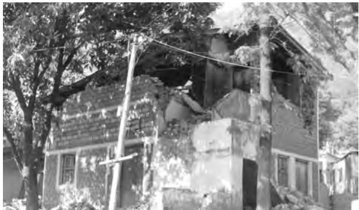
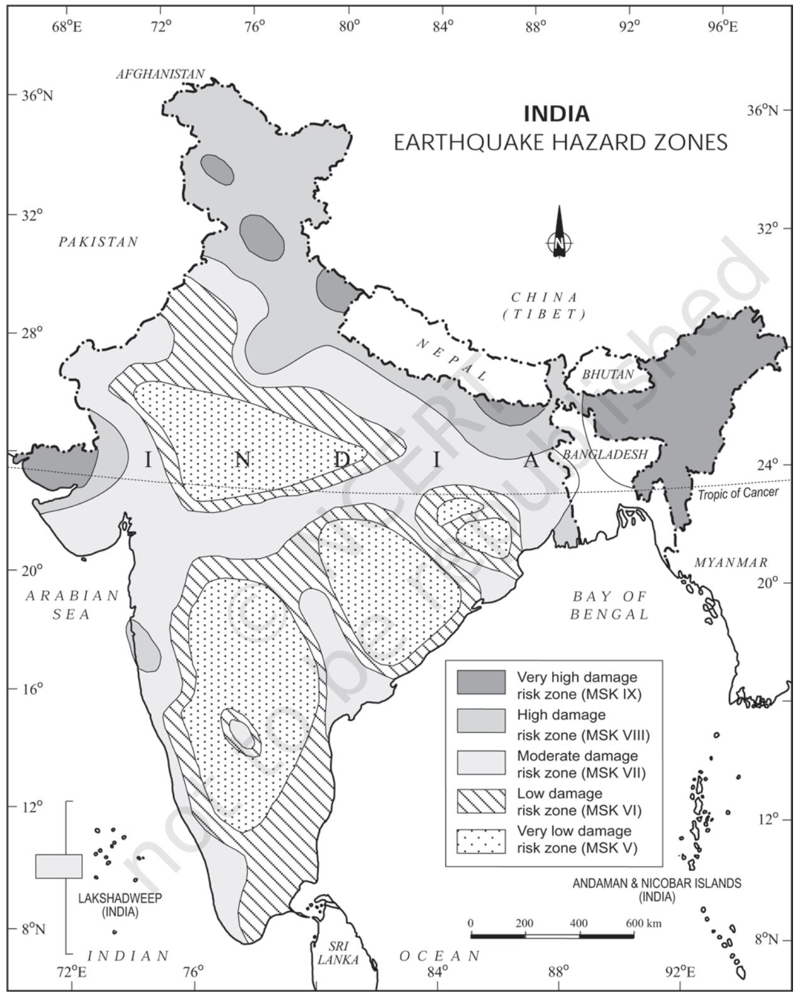
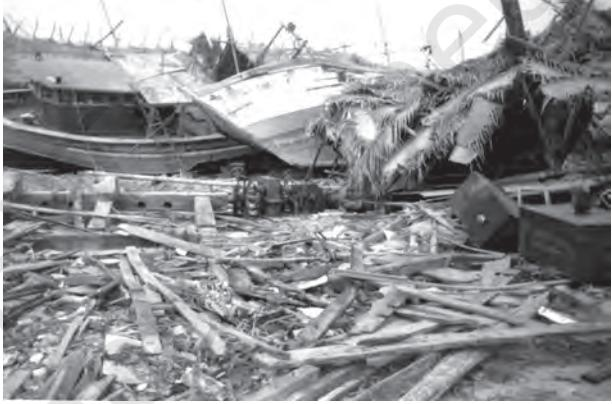
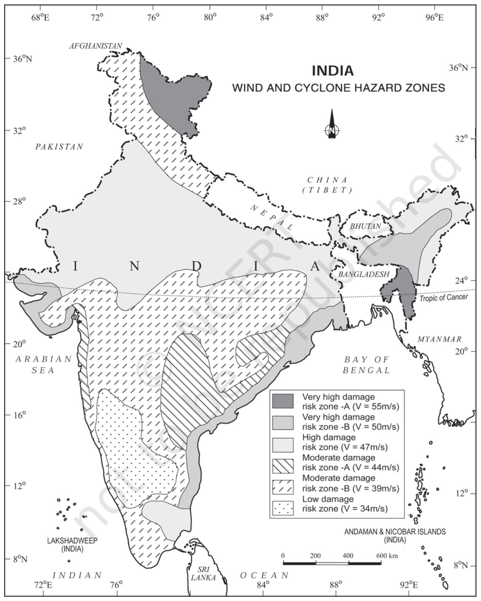
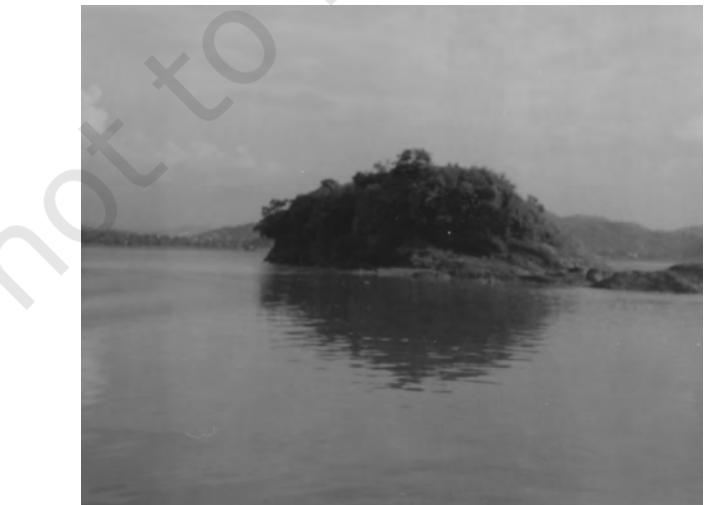
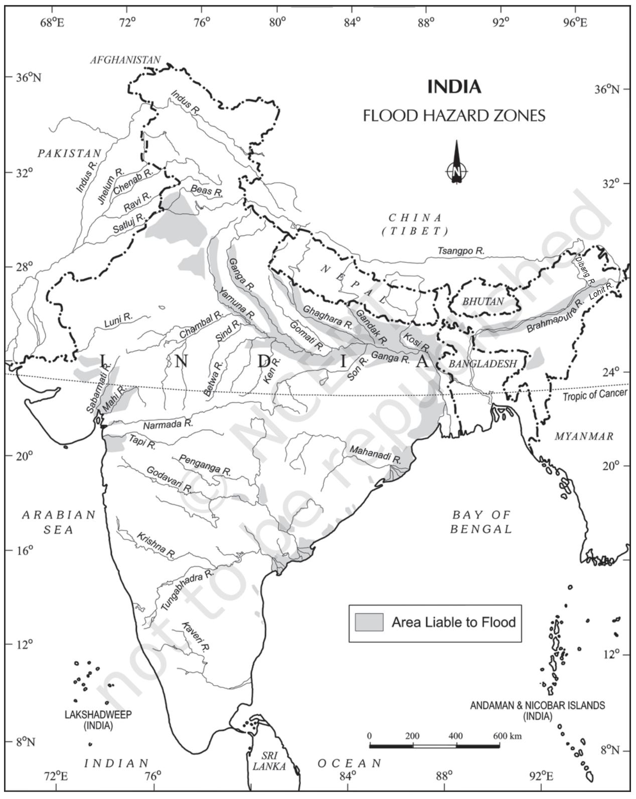
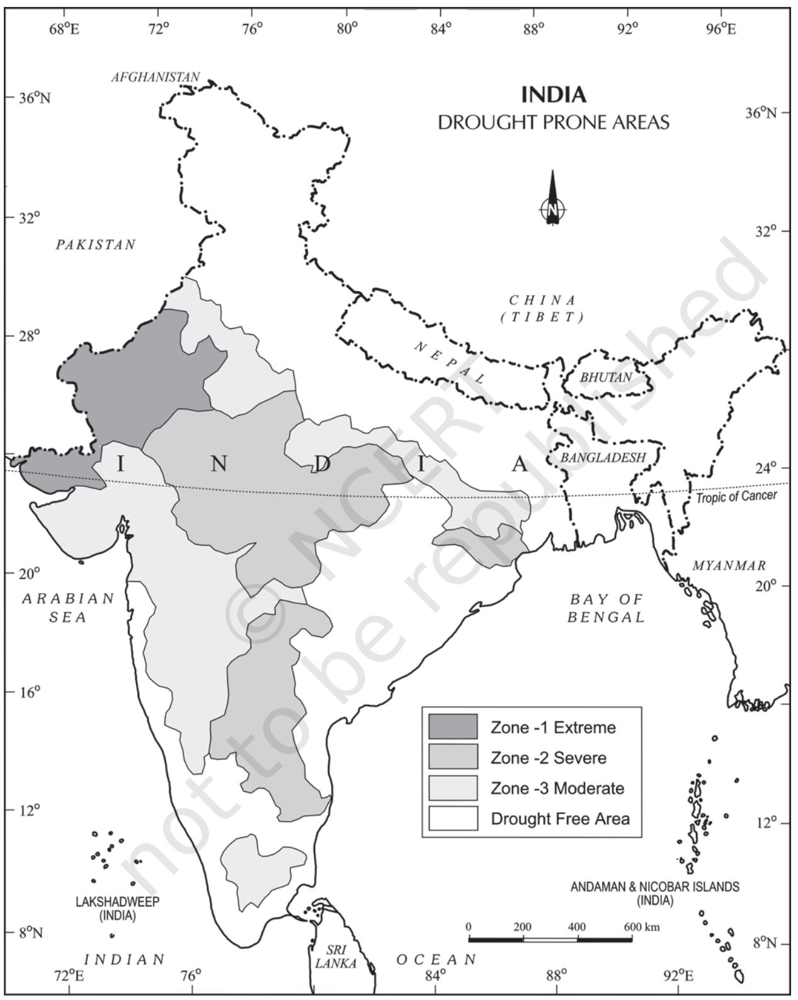
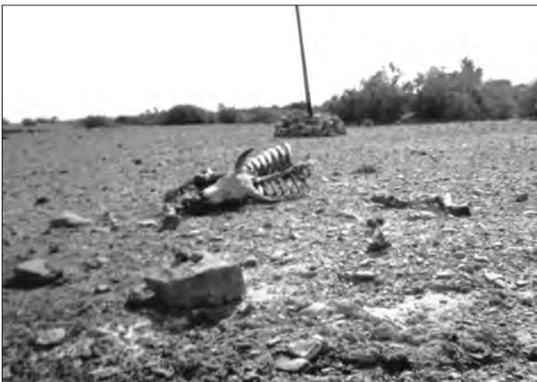
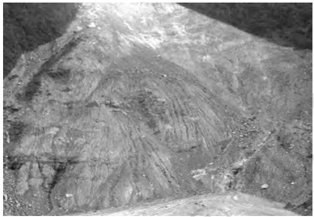

# **UNIT IV**

## *NATURAL HAZARDS AND DISASTERS: CAUSES, CONSEQUENCES AND MANAGEMENT*

*This unit deals with*

- **•** *Floods and droughts*
- *• Earthquakes and tsunami*
- *• Cyclones*
- *• Landslides*

Y ou might have read about tsunami or seen the images of horror on television set immediately after it happened. You may also be aware of the severe earthquake in Kashmir on both sides of the Line of Control (LOC). The damage caused to human life and properties during these episodes has moved us all. What are these as phenomena and how they are caused? How can we save ourselves? These are some questions which come to our minds. This chapter will attempt to analyse some of these questions.

Change is the law of nature. It is a continuous process that goes on uninterruptedly involving phenomena, big and small, material and nonmaterial that make our physical and sociocultural environment. It is a process present everywhere with variations in terms of magnitude, intensity and scale. Change can be a gradual or slow process like the evolution of landforms and organisms and it can be as sudden and swift as volcanic eruptions, tsunamis, earthquakes and lightening, etc. Similarly, it may remain confined to a smaller area occurring within a few seconds like hailstorms, tornadoes and dust storms, and it can also have global dimensions such as global warming and depletion of the ozone layer.

Besides these, changes have different meanings for different people. It depends upon the perspective one takes while trying to understand them. From the perspective of nature, changes are value-neutral (these are neither good nor bad). But from the human perspective, these are value-loaded. There are some changes that are desirable and good like the change of seasons, ripening of fruits, while there are others like earthquakes, floods and wars that are considered bad and undesirable.

Observe the environment you live in and

prepare a list of changes, which take place over a long period of time and those, which take place within a short period of time. Do you know why some changes are considered good and others bad? Prepare a list of changes, which you notice in your daily life and give reasons why some of these are considered good and others bad.

In this chapter, we will read about some of these changes, which are considered bad and have haunted humankind for a long time.

Disasters in general and natural disasters in particular, are some such changes that are always disliked and feared by humankind.

#### **What is a Disaster?**

"Disaster is an undesirable occurrence resulting from forces that are largely outside human control, strikes quickly with little or no warning, which causes or threatens serious disruption of life and property including death and injury to a large number of people, and requires therefore, mobilisation of efforts in excess of that which are normally provided by statutory emergency services".

For a long time, geographical literature viewed disasters as a consequence of natural forces; and human beings were treated as innocent and helpless victims in front of the mighty forces of nature. But natural forces are

#### CHAPTER

not the only causes of disasters. Disasters are also caused by some human activities. There are some activities carried by human beings that are directly responsible for disasters. Bhopal Gas tragedy, Chernobyl nuclear disaster, wars, release of CFCs (Chlorofluorocarbons) and increase of green house gases, environmental pollutions like noise, air, water and soil are some of the disasters which are caused directly by human actions. There are some other activities of human beings that accelerate or intensify disasters indirectly. Landslides and floods due to deforestation, unscientific land use and construction activities in fragile areas are some of the disasters that are the results of indirect human actions. Can you identify some other human activities going on in and around your neighbourhood and schools that can lead to disasters in the near future? Can you suggest some measures to prevent it? It is a common experience that human-made disasters have increased both in their numbers and magnitudes over the years and concerted efforts are on at various levels to prevent and minimise their occurrences. Though the success has been only nominal so far, it is possible to prevent some of these disasters created by human actions. As opposed to this, very little is possible to prevent natural disasters; therefore, the best way out is to emphasise on natural disaster mitigation and management. Establishment of National Institute of Disaster Management, India, Earth Summit at Rio de Janeiro, Brazil, 1993 and the World Conference on Disaster Management in May 1994 at Yokohama, Japan, etc. are some of the concrete steps towards this direction initiated at different levels.

Most often it is observed that scholars use disasters and natural hazards as interchangeable. Both are related phenomena, yet quite distinct from each other. Hence, it is necessary to distinguish between the two.

*Natural Hazards are elements of circumstances in the Natural environment that have the potential to cause harm to people or property or both.* These may be swift or permanent aspects of the respective environmental settings like currents in the oceans, steep slope and unstable structural features in the Himalayas or extreme climatic conditions in deserts or glaciated areas.

As compared to natural hazards, *natural disasters are relatively sudden and cause large scale, widespread death, loss of property and disturbance to social systems and life over which people have a little or no control*. Thus, any event can be classed as disaster when the magnitude of destruction and damage caused by it is very high.

Generally, disasters are generalised experiences of people the world over, and no two disasters are similar and comparable to each other. Every disaster is unique in terms of the local socio-environmental factors that control it, the social response it generates, and the way each social group negotiates with it. However, the opinion mentioned above is indicative of three important things. Firstly, the magnitude, intensity, frequency and damages caused by natural disasters have increased over the years. Secondly, there is a growing concern among people the world over to deal with the menace created by these so that the loss of human life and property can be minimised. And finally, significant changes have taken place in the pattern of natural disasters over the years.

There has also been a change in the perception of natural disasters and hazards. Previously, hazards and disasters were seen as two closely associated and interrelated phenomena, i.e. areas prone to natural hazards, were more vulnerable to disasters. Hence, people avoided tampering with the delicate balance that existed in a given ecosystem. People avoided intensification of their activities in such areas and that is how disasters were less damaging. Technological power has given large capacity to human intervention in nature. Consequently, now, human beings tend to intensify their activities into disaster prone areas increasing their vulnerability to disasters. Colonisation of flood plains of most of the rivers and development of large cities and port-towns like – Mumbai and Chennai along the coast, and touching the shore due to high land values, make them vulnerable to the occurrence of cyclones, hurricanes and tsunamis.

These observations can also be corroborated by the data given in Table 7.1 showing the magnitude of deaths caused by twelve serious natural disasters in the past sixty years in different countries of the world.

It is evident from the table that natural disasters have caused widespread loss of life and property. Concerted efforts are on at various levels to take appropriate measures to deal with the situation. It is also being felt that the damages caused by natural disasters have global repercussions that are beyond the means and capabilities of individual nation-states to cope up with. Hence, this issue was raised at the *U.N. General Assembly* in 1989 and it was finally formalised at the *World Conference on Disaster Management* in May 1994 at Yokohama, Japan. This was subsequently called the *Yokohama Strategy and Plan of Action for a Safer World*.

#### **CLASSIFICATION OF NATURAL DISASTERS**

Human beings the world over have experienced disasters and have faced and lived with them. Now people are becoming aware and various steps have been initiated at different levels for mitigating the effects of disasters. Identification and classification of disasters is being considered as an effective and scientific step to deal promptly and efficiently with the disasters. Broadly, natural disasters can be classified under four categories (See Table 6.2).

India is one of those countries which has experienced most of the natural disasters mentioned in Table 6.2. Every year it loses thousands of lives and property worth millions of rupees due to these natural calamities. In the following section, some of the highly devastating natural disasters have been discussed, particularly in the context of India.

#### **NATURAL DISASTERS AND HAZARDS IN INDIA**

It was discussed in one of the previous chapters that India is vast and diverse in terms of its physical and socio-cultural attributes. It is largely due to its vast geographical area, environmental diversities and cultural pluralities that scholars often described it using two meaningful adjectives like the 'Indian-subcontinent' and the 'land of unity in diversity'. Its vastness in terms of natural attributes combined with its prolonged colonial past, continuing various forms of social discriminations and also equally large population have enhanced its vulnerability to natural disasters. These observations can also be illustrated by focussing on some of the major natural disasters in India.

#### **Earthquakes**

Earthquakes are by far the most unpredictable and highly destructive of all the natural disasters. You have already learnt the causes of earthquakes in your book *Fundamentals of Physical Geography* (NCER T, 2006). Earthquakes that are of tectonic origin have proved to be the most devastating and their area of influence is also quite large. These earthquakes result from a series of earth movements brought about by a sudden release of energy during the tectonic activities in the earth's crust. As compared to these, the earthquakes associated with volcanic eruption, rock fall, landslides, subsidence, particularly in the mining areas, impounding of dams and reservoirs, etc. have limited area of influence and the scale of damage.

It was mentioned in Chapter 2 of the book that the Indian plate is moving at a speed of one centimetre per year towards the north and northeastern direction and this movement of plates is being constantly obstructed by the Eurasian plate from the north. As a result of this,

**Figure 6.1 : A Damaged Building Due to an Earthquake**

#### **Yokohama Strategy and International Decade for Natural Disaster Reduction (IDNDR) Yokohama Strategy and Plan of Action for a Safer World**

All the member states of the United Nations and other states met at the **World Conference on Natural Disaster Reduction** in the city of Yokohama from May 23rd-27th 1994. It acknowledged that the impact of natural disasters in terms of human and economic losses has risen in recent years, and society, in general, has become vulnerable to natural disasters. It also accepted that these disasters affected the poor and disadvantageous groups the worst, particularly in the developing countries, which are ill-equipped to cope with them. Hence, the conference adopted the Yokohama strategy as a guide to rest of the decade and beyond, to mitigate the losses due to these disasters.

The resolution of the World Conference on Natural Disasters Reduction is as mentioned below:

- (i) It will note that each country has the sovereign responsibility to protect its citizens from natural disasters;
- (ii) It will give priority attention to the developing countries, particularly the least developed, land-locked countries and small-island developing states;
- (iii) It will develop and strengthen national capacities and capabilities and, where appropriate, national legislation for natural and other disaster prevention, mitigation and preparedness, including the mobilisation of non-governmental organisations and participation of local communities;
- (iv) It will promote and strengthen sub-regional, regional and international cooperation in activities to prevent, reduce and mitigate natural and other disasters, with particular emphasis on:
	- (a) human and institutional capacity-building and strengthening;
	- (b) technology sharing: the collection, the dissemination and utilisation of information; and (c) mobilisation of resources.

It also declared the decade 1990-2000 as the *International Decade for Natural Disaster Reduction (IDNDR).*

both the plates are said to be locked with each other resulting in accumulation of energy at different points of time. Excessive accumulation of energy results in building up of stress, which ultimately leads to the breaking up of the lock and the sudden release of energy causes earthquakes along the Himalayan arch. Some of the most vulnerable union territories/states are Jammu and Kashmir, Ladakh, Himachal Pradesh, Uttarakhand, Sikkim, and the Darjeeling subdivision of West Bengal, and all the seven states of the northeast.

Apart from these regions, the central-western parts of India, particularly Gujarat (in 1819, 1956 and 2001) and Maharashtra (in 1967 and 1993) have also experienced some severe earthquakes. Earth scientists have found it difficult to explain the occurrence of earthquakes in one of the oldest, most stable and mature landmass of Peninsular block for a long time. Recently, some earth scientists have come up with a theory of emergence of a fault line and energy build-up along the fault line represented by the river Bhima (Krishna) near Latur and Osmanabad (Maharashtra) and the possible breaking down of the Indian plate (Figure 6.2).

*National Geophysical Laboratory, Geological Survey of India, Department of Meteorology, Government of India,* along with the recently formed *National Institute of Disaster Management*, have made an intensive analysis of more than 1,200 earthquakes that have occurred in India in different years in the past, and based on these, they divided India into the following five earthquake zones:

- (i) Very high damage risk zone
- (ii) High damage risk zone
- (iii) Moderate damage risk zone
- (iv) Low damage risk zone
- (v) Very low damage risk zone.

Out of these, the first two zones had experienced some of the most devastating earthquakes in India. As shown in the Figure 6.2, areas vulnerable to these earthquakes are the North-east states, areas to the north of Darbhanga and Araria along the Indo-Nepal border in Bihar, Uttarakhand, Western Himachal Pradesh (around Dharamshala) and Kashmir Valley in the Himalayan region and the Kuchchh (Gujarat). These are included in the Very High Damage Risk Zone. Similarly, the remaining parts of Jammu and Kashmir, Ladakh, Himachal Pradesh, Northern parts of Punjab, Eastern parts of Haryana, Delhi, Western Uttar Pradesh, and Northern Bihar fall under the High Damage Risk Zone. Remaining parts of the country fall under moderate to very Low Damage Risk Zone. Most of the areas that can be considered safe are from the stable landmass covered under the Deccan plateau.

#### *Socio-Environmental Consequences of Earthquakes*

The idea of an earthquake is often associated with fear and horror due to the scale, magnitude and suddenness at which it spreads disasters on the surface of the earth without discrimination. It becomes a calamity when it strikes the areas of high density of population. It not only damages and destroys the settlements, infrastructure, transport and communication network, industries and other developmental activities but also robs the population of their material and socio-cultural gains that they have preserved over generations. It renders them homeless, which puts an extra-pressure and stress, particularly on the weak economy of the developing countries.

#### *Effects of Earthquakes*

Earthquakes have all encompassing disastrous effects on the area of their occurrence. Some of the important ones are listed in Table 6.1.

|  | Table 6.1 : Effects of Earthquakes |  |
| --- | --- | --- |
| On Ground | On Manmade | On Water |
|  | Structures |  |
| Fissures | Cracking | Waves |
| Settlements | Slidings | Hydro-Dynamic |
|  |  | Pressure |
| Landslides | Overturning | Tsunami |
| Liquefaction | Buckling |  |
| Earth Pressure | Collapse |  |
| Possible |  |  |
| Chain-effects | Possible | Possible |
|  | Chain-effects | Chain-effects |

Apart from these, earthquakes also have some serious and far-reaching environmental consequences. Surface seismic waves produce fissures on the upper layers of the earth's crust through which water and other volatile materials gush out, inundating the neighbouring areas. Earthquakes are also responsible for landslides and often these cause obstructions in the flow of rivers and channels resulting in the formation of reservoirs. Sometimes, rivers also change their course causing floods and other calamities in the affected areas.

#### *Earthquake Hazard Mitigation*

Unlike other disasters, the damages caused by earthquakes are more devastating. Since it also destroys most of the transport and communication links, providing timely relief to the victims becomes difficult. It is not possible to prevent the occurrence of an earthquake; hence, the next best option is to emphasis on disaster preparedness and mitigation rather than curative measures such as:

- (i) Establishing earthquake monitoring centres (seismological centres) for regular monitoring and fast dissemination of information among the people in the vulnerable areas. Use of Geographical Positioning System (GPS) can be of great help in monitoring the movement of tectonic plates.
- (ii) Preparing a vulnerability map of the country and dissemination of vulnerability risk information among the people and educating them about the ways and means minimising the adverse impacts of disasters.
- (iii) Modifying the house types and building-designs in the vulnerable areas and discouraging construction of highrise buildings, large industrial establishments and big urban centres in such areas.
- (iv) Finally, making it mandatory to adopt earthquake-resistant designs and use light materials in major construction activities in the vulnerable areas.

**Figure 6.2 : India: Earthquake Hazard Zones**

#### **Tsunami**

Earthquakes and volcanic eruptions that cause the sea-floor to move abruptly resulting in sudden displacement of ocean water in the form of high vertical waves are called *tsunamis* (harbour waves) or seismic sea waves. Normally, the seismic waves cause only one instantaneous vertical wave; but, after the initial disturbance, a series of afterwaves are created in the water that oscillate between high crest and low trough in order to restore the water level.

The speed of wave in the ocean depends upon the depth of water. It is more in the shallow water than in the ocean deep. As a result of this, the impact of *tsunami* is less over the ocean and more near the coast where they cause large-scale devastations. Therefore, a ship at sea is not much affected by *tsunami* and it is difficult to detect a tsunami in the deeper parts of sea. It is so because over deep water the tsunami has very long wave-length and limited wave-height. Thus, a tsunami wave raises the ship only a metre or two and each rise and fall takes several minutes. As opposed to this, when a tsunami enters shallow water, its wave-length gets reduced and the period remains unchanged, which increases the waveheight. Sometimes, this height can be up to 15m or more, which causes large-scale destructions along the shores. Thus, these are also called *Shallow Water Waves*. Tsunamis are frequently observed along the Pacific ring of fire, particularly along the coast of Alaska, Japan, Philippines, and other islands of Southeast Asia, Indonesia, Malaysia, Myanmar, Sri Lanka, and India etc.

After reaching the coast, the tsunami waves release enormous energy stored in them and water flows turbulently onto the land destroying port-cities and towns, structures, buildings and other settlements. Since the coastal areas are densely populated the world over, and these are also centres of intense human activity, the loss of life and property is likely to be much higher by a tsunami as compared to other natural hazards in the coastal areas. The extent of devastation caused by tsunami can be assessed through the visuals on Banda Ache (Indonesia) presented in the book *Practical Work in Geography - Part I* (NCERT, 2006).

Unlike other natural hazards, the mitigation of hazards created by tsunami is difficult, mainly because of the fact that losses are on a much larger scale.

It is beyond the capacity of individual state or government to mitigate the damage. Hence, combined efforts at the international levels are the possible ways of dealing with these disasters as has been in the case of the tsunami that occurred on 26th December 2004 in which more than 300,000 people lost their lives. India

**Figure 6.3 : Tsunami Affected Area**

has volunteered to join the *International Tsunami Warning System* after the December 2004 tsunami disaster.

#### **Tropical Cyclone**

Tropical cyclones are intense low-pressure areas confined to the area lying between 30° N and 30°° S latitudes, in the atmosphere around which high velocity winds blow. Horizontally, it extends up to 500-1,000 km and vertically from surface to 12-14 km. A tropical cyclone or hurricane is like a heat engine that is energised by the release of latent heat on account of the condensation of moisture that the wind gathers after moving over the oceans and seas.

There are differences of opinion among scientists about the exact mechanism of a tropical cyclone. However, some initial conditions for the emergence of a tropical cyclone are:

- (i) Large and continuous supply of warm and moist air that can release enormous latent heat.
- (ii) Strong Coriolis force that can prevent filling of low pressure at the centre (absence of Coriolis force near the equator prohibits the formation of tropical cyclone between 0°-5° latitude).
- (iii) Unstable condition through the troposphere that creates local disturbances around which a cyclone develops.
- (iv) Finally, absence of strong vertical wind wedge, which disturbs the vertical transport of latent heat.

#### *Spatio-temporal Distribution of Tropical Cyclone in India*

Owing to its Peninsular shape surrounded by the Bay of Bengal in the east and the Arabian Sea in the west, the tropical cyclones in India also originate in these two important locations. Though most of the cyclones originate between 10°-15° north latitudes during the monsoon season, yet in case of the Bay of Bengal, cyclones mostly develop during the months of October and November. Here, they originate between 16°-2°° N latitudes and to the west of 92° E. By July the place of origin of these storms shifts to around 18° N latitude and west of 90°E near the Sunderban Delta.

#### *Consequences of Tropical Cyclones*

It was mentioned that the energy to the tropical cyclone comes from the latent heat released by the warm moist air. Hence, with the increase in distance from the sea, the force of the cyclone decreases. In India, the force of the cyclone decreases with increase in distance from the Bay of Bengal and the Arabian Sea. So, the coastal areas are often struck by severe cyclonic storms with an average velocity of 180 km/h. Often, this results in abnormal rise in the sea level known as *Storm Surge*.

A surge is generated due to interaction of air, sea and land. The cyclone provides the driving force in the form of very high horizontal pressure-gradient and very strong surface winds. The sea water flows across the coast along with strong winds and heavy downpour.

This results in inundation of human settlements, agricultural fields, damaging crops and destruction of structures created by human beings.

#### **Floods**

You read in newspapers and watch images of floods on televisions occurring in some regions during rainy seasons. Inundation of land and human settlements by the rise of water in the channels and its spill-over presents the condition of flooding. Unlike other natural disasters, the causes of floods are wellestablished. Floods are relatively slow in occurrences and often, occur in well-identified regions and within expected time in a year. Floods occur commonly when water in the form of surface run-off exceeds the carrying capacity of the river channels and streams and flows into the neighbouring low-lying flood plains. At times, this even goes beyond the capacity of lakes and other inland water bodies in which they flow. Floods can also be caused due to a storm surge (in the coastal areas), high intensity rainfall for a considerably longer time period, melting of ice and snow, reduction in the infiltration rate and presence of eroded material in the water due to higher rate of soil erosion. Though floods occur frequently over wide geographical area having disasterous ramifications in many parts of the world, floods in the South, Southeast and East Asian countries, particularly in China, India and Bangladesh, are frequent and equally disastrous.

Once again, unlike other natural disasters, human beings play an important role in the genesis as well as spread of floods. Indiscriminate deforestation, unscientific agricultural practices, disturbances along the natural drainage channels and colonisation of flood-plains and river-beds are some of the human activities that play an important role

**Figure 6.4 : Wind and Cyclone Hazard Zones**

in increasing the intensity, magnitude and gravity of floods.

Various states of India face heavy loss of lives and property due to recurrent floods. *Rashtriya Barh Ayog* (National Flood Commission) identified 40 million hectares of land as floodprone in India. The Figure 6.6 shows the floodaffected areas in India. Assam, West Bengal and Bihar are among the high flood-prone states of India. Apart from these, most of the rivers in the northern states like Punjab and Uttar Pradesh, are also vulnerable to occasional floods. It has been noticed that states like Rajasthan, Gujarat, Haryana and Punjab are also getting inundated in recent decades due to flash floods. This is partly because of the pattern of the monsoon and partly because of blocking of most of the streams and river channels by human activities. Sometimes, Tamil Nadu experiences flooding during November-January due to the retreating monsoon.

#### *Consequence and Control of Floods*

Frequent inundation of agricultural land and human settlement, particularly in Assam, West Bengal, Bihar and Eastern Uttar Pradesh (flooding rivers), coastal areas of Odisha, Andhra Pradesh, Tamil Nadu and Gujarat (cyclone) and Punjab, Rajasthan, Northern Gujarat and Haryana (flash floods) have serious consequences on the national economy and society. Floods do not only destroy valuable crops every year but these also damage physical infrastructure such as roads, rails, bridges and human settlements. Millions of people are rendered homeless and are also washed down along with their cattle in the floods. Spread of diseases like cholera, gastro-enteritis, hepatitis and other waterborne diseases spread in the flood-affected areas. However, floods also make a few positive contributions. Every year, floods deposit fertile silt over agricultural fields which is good for the crops. Majuli (Assam), the largest riverine island in the world, is the best example of good paddy crops after the annual floods in Brahmaputra. But these are insignificant benefits in comparison to the grave losses.

The Government of India as well as the state governments are well aware of the menace created by floods every year. How do these governments generally respond to the floods? Construction of flood protection embankments in the flood-prone areas, construction of dams, afforestation and discouraging major construction activities in the upper reaches of most of the flood-creating rivers, etc. are some steps that need to be taken up on urgent basis. Removal of human encroachment from the river channels and depopulating the flood plains can be the other steps. This is particularly true in western and northern parts of the country which experience *flash-floods*. Cyclone centres may provide relief in coastal areas which are hit by a storm surge.

**Figure 6.5 : Brahmaputra During Flood**

**Figure 6.6 : Flood Hazard Zones**

#### **Droughts**

The term 'drought' is applied to an extended period when there is a shortage of water availability due to inadequate precipitation, excessive rate of evaporation and over-utilisation of water from the reservoirs and other storages, including the ground water.

> Drought is a complex phenomenon as it involves elements of meteorology like precipitation, evaporation, evapotranspiration, ground water, soil moisture, storage and surface run-off, agricultural practices, particularly the types of crops grown, socio-economic practices and ecological conditions.

#### *Types of Droughts*

*Meteorological Drought* : It is a situation when there is a prolonged period of inadequate rainfall marked with mal-distribution of the same over time and space.

*Agricultural Drought :* It is also known as soil moisture drought, characterised by low soil moisture that is necessary to support the crops, thereby resulting in crop failures. Moreover, if an area has more than 30 per cent of its gross cropped area under irrigation, the area is excluded from the drought-prone category.

*Hydrological Drought :* It results when the availability of water in different storages and reservoirs like aquifers, lakes, reservoirs, etc. falls below what the precipitation can replenish.

*Ecological Drought :* When the productivity of a natural ecosystem fails due to shortage of water and as a consequence of ecological distress, damages are induced in the ecosystem.

Various parts of India experience these droughts recurrently which result in some serious socio-economic and ecological problems.

#### *Drought Prone Areas in India*

Indian agriculture has been heavily dependent on the monsoon rainfall. Droughts and floods are the two accompanying features of Indian climate. According to some estimates, nearly 19 per cent of the total geographical area of the country and 12 per cent of its total population suffer due to drought every year. About 30 per cent of the country's total area is identified as drought prone affecting around 50 million people. It is a common experience that while some parts of the country reel under floods, there are regions that face severe drought during the same period. Moreover, it is also a common sight to witness that one region suffers due to floods in one season and experiences drought in the other. This is mainly because of the large-scale variations and unpredictability in the behaviour of the monsoon in India. Thus, droughts are widespread and common phenomena in most parts of the country, but these are most recurrent and severe in some and not so in others. On the basis of severity of droughts, India can be divided into the following regions:

*Extreme Drought Affected Areas :* It is evident from the Figure 6.7 that most parts of Rajasthan, particularly areas to the west of the Aravali hills, i.e. Marusthali and Kachchh regions of Gujarat fall in this category. Included here are also the districts like Jaisalmer and Barmer from the Indian desert that receive less that 90 mm average annual rainfall.

*Severe Drought Prone Area :* Parts of eastern Rajasthan, most parts of Madhya Pradesh, eastern parts of Maharashtra, interior parts of Andhra Pradesh and Karnataka Plateau, northern parts of interior Tamil Nadu and southern parts of Jharkhand and interior Odisha are included in this category.

*Moderate Drought Affected Area :* Northern parts of Rajasthan, Haryana, southern districts of Uttar Pradesh, the remaining parts of Gujarat, Maharashtra except Konkan, Jharkhand and Coimbatore plateau of Tamil Nadu and interior Karnataka are included in this category. The remaining parts of India can be considered either free or less prone to the drought.

#### *Consequences of Drought*

Droughts have cascading effects on various other aspects of environment and society. Crop failure leading to scarcity of food grains *(akal)*,

**Figure 6.8 : Drought**

fodder *(trinkal)*, inadequate rainfall, resulting in shortage of water *(jalkal)*, and often shortage in all the three *(trikal)* is most devastating. Large-scale death of cattle and other animals, migration of humans and livestock are the most common sight to be seen in the droughtaffected areas. Scarcity of water compels people to consume contaminated water resulting in spread of many waterborne diseases like gastro-enteritis, cholera, hepatitis, etc.

Droughts have both immediate as well as long-term disastrous consequences on the social and physical environments. Consequently, planning for drought has to take both aspects into consideration. Provision for the distribution of safe drinking water, medicines for the victims and availability of fodder and water for the cattle and shifting of the people and their livestock to safer places, etc. are some steps that need to be taken immediately. Identification of ground water potential in the form of aquifers, transfer of river water from the surplus to the deficit areas, and particularly planning for inter-linking of rivers and construction of reservoirs and dams, etc. should be given a serious thought. Remote sensing and satellite imageries can be useful in identifying the possible river-basins that can be inter-linked and in identifying the ground water potential.

Dissemination of knowledge about drought-resistant crops and proper training to practise the same can be some of the long-term measures that will be helpful in drought-mitigation. Rainwater harvesting can also be an effective method in minimising the effects of drought.

> Observe the methods adopted for rooftop rainwater harvesting in your locality and suggest measures to make it more effective.

#### **Landslides**

Have you ever read about the blocking of roads to Srinagar or disruption of rail services by stones falling on the Konkan Railway track? It happens due to landslide, which is the rapid sliding of large mass of bedrocks. Disasters due to landslides, are in general, far less dramatic than due to earthquakes, volcanic eruptions, tsunamis and cyclones but their impact on the natural environment and national economy is in no way less severe. Unlike other disasters that are sudden, unpredictable and are largely controlled by macro or regional factors, landslides are largely controlled by highly localised factors. Hence, gathering information and monitoring the possibilities of landslide is not only difficult but also immensely costintensive.

It is always difficult to define in a precise statement and generalise the occurrence and behaviour of a landslide. However, on the basis of past experiences, frequency and certain causal relationships with the controlling factors like geology, geomorphic agents, slope, land-use, vegetation cover and human activities, India has been divided into a number of zones.

#### *Landslide Vulnerability Zones*

*Very High Vulnerability Zone* : Highly unstable, relatively young mountainous areas in the Himalayas and Andaman and Nicobar, high rainfall regions with steep slopes in the Western Ghats and Nilgiris, the north-eastern regions, along with areas that experience frequent ground-shaking due to earthquakes, etc. and areas of intense human activities, particularly those related to construction of roads, dams, etc. are included in this zone.

*High Vulnerability Zone :* Areas that have almost similar conditions to those included in the very high vulnerability zone are also included in this category. The only difference between these two is the combination, intensity and frequency of the controlling factors. All the Himalayan states and the states from the north-eastern regions except the plains of Assam are included in the high vulnerability zones.

*Moderate to Low Vulnerability Zone :* Areas that receive less precipitation such as Trans-Himalayan areas of Ladakh and Spiti (Himachal Pradesh), undulated yet stable relief and low precipitation areas in the Aravali, rain shadow areas in the Western and

**Figure 6.9 : Landslide**

Eastern Ghats and Deccan plateau also experience occasional landslides. Landslides due to mining and subsidence are most common in states like Jharkhand, Odisha, Chhattisgarh, Madhya Pradesh, Maharashtra, Andhra Pradesh, Karnataka, Tamil Nadu, Goa and Kerala.

*Other Areas :* The remaining parts of India, particularly states like Rajasthan, Haryana, Uttar Pradesh, Bihar, West Bengal (except district Darjiling), Assam (except district Karbi Anglong) and Coastal regions of the southern States are safe as far as landslides are concerned.

#### *Consequences of Landslides*

Landslides have relatively small and localised area of direct influence, but roadblock, destruction of railway lines and channel-blocking due to rock-falls have farreaching consequences. Diversion of river courses due to landslides can also lead to flood and loss of life and property. It also makes spatial interaction difficult, risky as well as a costly affair, which, in turn, adversely affects the developmental activities in these areas.

#### *Mitigation*

It is always advisable to adopt area-specific measures to deal with landslides. Restriction on the construction and other developmental activities such as roads and dams, limiting agriculture to valleys and areas with moderate slopes, and control on the development of large settlements in the high vulnerability zones, should be enforced. This should be supplemented by some positive actions like promoting large-scale afforestation programmes and construction of bunds to reduce the flow of water. Terrace farming should be encouraged in the northeastern hill states where *Jhumming* (Slash and Burn/Shifting Cultivation) is still prevalent.

#### **DISASTER MANAGEMENT**

Disasters due to cyclones, unlike the ones caused by earthquakes, tsunamis and volcanic eruptions are more predictable in terms of the time and place of their occurrences. Moreover, with the help of development of techniques to monitor the behaviour of cyclones, their intensity, direction and magnitude, it has become possible to manage the cyclonic hazard to some extent. Construction of cyclone-shelters, embankments, dykes, reservoirs and afforestation to reduce the speed of the winds are some of the steps that can help in minimising the damages. However, increase in the loss of life and property in countries like India, Bangladesh, Myanmar, etc. in successive storms is largely due to high vulnerability of their population residing in the coastal areas.

#### **Disaster Management Bill, 2005**

The Disaster Management Bill, 2005, defines disaster as a catastrophe, mishap, calamity or grave occurrence affecting any area, arising from natural or man-made causes, or by accident or negligence which results in substantial loss of life or human suffering or damage to, and destruction of, environment, and is of such nature or magnitude as to be beyond the coping capacity of the community of the affected area.

#### **CONCLUSION**

On the basis of the above discussion, it can be concluded that disasters can be natural or the results of human activities, and all hazards need not turn into disasters since it is difficult to eliminate disasters, particularly natural disasters. Then the next best option is mitigation and preparedness. There are three stages involved in disaster mitigation and management:

- (i) Pre-disaster management involves generating data and information about the disasters, preparing vulnerability zoning maps and spreading awareness among the people about these. Apart from these, disaster planning, preparedness and preventive measures are other steps that need to be taken in the vulnerable areas.
- (ii) During disasters, rescue and relief operations such as evacuation, construction of shelters and relief camps, supplying of water, food, clothing and medical aids etc. should be done on an emergency basis.
- (iii) Post-disaster operations should involve rehabilitation and recovery of victims. It should also concentrate on capacitybuilding in order to cope up with future disasters, if any.

These measures have special significance to a country like India, which has about twothird of its geographical area and equal proportion of its population, vulnerable to disasters. Introduction of the Disaster Management Bill, 2005 and establishment of National Institute of Disaster Management are some examples of the positive steps taken by the Government of India.

#### **EXERCISES**

1. Choose the right answer from the four alternatives given below.

- (i) Which one of the following states of India experiences floods frequently?
	- (a) Bihar (c) Assam
		- (b) West Bengal (d) Uttar Pradesh
- (ii) In which one of the following districts of Uttaranchal did Malpa Landslide disaster take place?
	- (a) Bageshwar (c) Almora
	- (b) Champawat (d) Pithoragarh

(iii) Which one of the following states receives floods in the winter months?

- (a) Assam (c) Kerala
- (b) West Bengal (d) Tamil Nadu

(iv) In which of the following rivers is the Majuli River Island situated?

- (a) Ganga (c) Godavari
- (b) Brahmaputra (d) Indus

(v) Under which type of natural hazards do blizzards come?

- (a) Atmospheric (c) Terrestrial
- (b) Aquatic (d) Biological
- 2. Answer the following questions in less than 30 words.
	- (i) When can a hazard become a disaster?
	- (ii) Why are there more earthquakes in the Himalayas and in the north-eastern region of India?
	- (iii) What are the basic requirements for the formation of a cyclone?
	- (vi) How are the floods in Eastern India different from the ones in Western India?
	- (v) Why are there more droughts in Central and Western India?
- 3. Answer the following questions in not more than 125 words.
	- (i) Identify the Landslide-prone regions of India and suggest some measures to mitigate the disasters caused by these.
	- (ii) What is vulnerability? Divide India into natural disaster vulnerability zones based on droughts and suggest some mitigation measures.
	- (iii) When can developmental activities become the cause of disasters?

#### **Project/Activity**

Prepare a project report on any one of the topics given below.

- (i) Malpa Landslide (v) Tehri Dam/Sardar Sarovar
	-
- (ii) Tsunami (vi) Bhuj/Latur Earthquakes
- (iii) Odisha and Gujarat Cyclones (vii) Life in a delta/riverine island
- 
- (iv) Inter-linking of rivers (viii) Prepare a model of rooftop rainwater harvesting

**Alluvial Plain** : A level tract of land made up of alluvium or fine rock material brought down by a river.

**Archipelago** : A group of islands that lie in fairly close proximity.

**Arid** : Denoting any climate or region in which the rainfall is insufficient or barely sufficient to support vegetation.

**Backwater** : A stretch of water that has become bypassed by the main flow of a stream, although still joined to it. It has a very low rate of flow.

**Bedrock** : The solid rock lying beneath soil and weathered material.

**Biosphere Reserve** : These are multi-purpose protected areas, where every plant and animal size is to be protected in its natural habitat. Its major objectives are : (i) to conserve and maintain diversity and integrity of the natural heritage in its full form, i.e. physical environment, the flora and the fauna; (ii) to promote research on ecological conservation and other aspects of environment at preservation; (iii) to provide facilities for education, awareness and explaining.

**Bunding** : The practice of constructing embankments of earth or stone for conserving water and soil to increase crop production.

**Calcareous** : Composed of or containing a high proportion of calcium carbonate.

**Catchment Area** : The area drained by a major river and its tributaries.

**Climate** : The average weather conditions of a sizeable area of the earth's surface over a period of time (usually spread over a span of at least 30 years).

**Coast** : The boundary between land and sea. It includes the strip of land that borders the sea shore.

**Coastal Plain** : It is a flat low lying land between the coast and higher ground inland.

**Conservation** : The protection of natural environment and natural resources for the future. It includes the management of minerals, landscape, soil and forests to prevent their destruction and over exploitation.

**Coral** : It is a small calcium secreting marine polyp that occurs in colonies, mainly in warm shallow sea water. It forms the coral reefs.

**Depression** : In meteorology; it denotes an area of relatively low atmospheric pressure, which is found mainly in temperate regions. It is also used as synonym for temperate cyclones.

**Estuary** : The tidal mouth of a river where fresh and saline water get mixed.

**Fauna** : The animal life of a given area or time.

**Fold** : A bend in rock strata resulting from compression of an area of the earth's crust.

**Glacier** : A mass of snow and ice that moves slowly away from its place of accumulation carving gradually a broad and steepsided valley on its way.

**Gneiss** : A coarse grained metamorphic rock with a banded structure. It is formed by the large scale application of heat and pressure associated with mountain building and volcanic activity.

**Gorge** : A deep valley with steep and rocky side walls.

**Gully Erosion** : It is the erosion of the soil and rock by the concentration of runoff into gullies.

**Humus** : The dead organic content of the soil.

**Island** : A mass of land that is surrounded by water and is smaller than a continent.

**Jet Stream** : A very strong and steady westerly wind blowing just below the tropopause.

**Lake** : A body of water that lives in a hollow in the earth's surface and is entirely surrounded by land.

**Landslide** : A form of mass movement in which rock and debris moves rapidly downslope under the influence of gravity as a result of failure along a shear plane. **Meander** : A pronounced curve or loop in the course of a river channel.

**Monsoon** : A complete reversal of winds over a large area leading to a change of seasons.

**National Park** : A National park is an area which is strictly reserved for the protection of the wildlife and where activities such as forestry, grazing or cultivation are not allowed.

**Pass** : A route through a mountain range which follows the line of a col or a gap.

**Peninsula** : A piece of land jutting out into the sea.

**Plain** : An extensive area of flat or gently undulating land.

**Plateau** : An extensive elevated area of relatively flat land.

**Playa** : The low flat central area of a basin of inland drainage. Playas occur in areas of low rainfall.

**Protected Forest** : An area notified under the provisions of Indian Forest Act or the State Forest Acts having limited degree of protection. In Protected Forests, all activities are permitted unless prohibited.

**Rapids** : A stretch of swift flowing water where a river bed suddenly becomes steeper due to the presence of hard rocks.

**Reserved Forest** : An area notified under the provisions of Indian Forest Act or the State Forest Acts having full degree of protection. In Reserved Forests, all activities are prohibited unless permitted.

**Sanctuary** : A sanctuary is an area, which is reserved for the conservation of animals only and operations such as harvesting of timber, collection of minor forest products are allowed so long as they do not affect the animals adversely.

**Soil Profile** : It is the vertical section of soil from the ground surface to the parent rock.

**Subcontinent** : A big geographical unit which stands out distinctly from the rest of the continent.

**Terai** : A belt of marshy ground and vegetation on the lower parts of the alluvial fans.

**Tectonic** : Forces originating within the earth and responsible for bringing widespread changes in the landform features.

**Unclassed Forest** : An area recorded as forest but not included in reserved or protected forest category. Ownership status of such forests varies from state to state.

