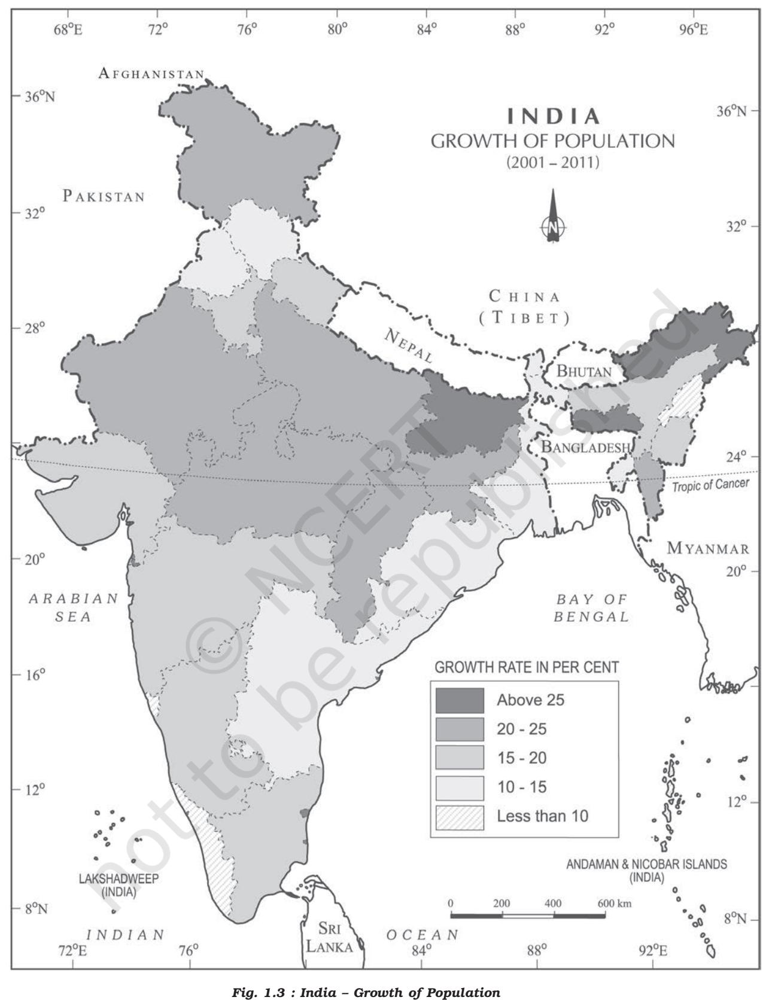

| Unit I |
| --- |
| Chapter 1 |

# POPULATION

Distribution, Density, Growth and Composition

The people are very important component of a country. India is the second most populous country after China in the world with its total population of 1,210 million (2011). India's population is larger than the total population of North America, South America and Australia put together. More often, it is argued that such a large population invariably puts pressure on its limited resources and is also responsible for many socio-economic problems in the country.

**How do you perceive the idea of India? Is it simply a territory? Does this signify an**

**amalgam of people? Is it a territory inhabited by people living under certain institutions of governance?**

In this chapter, we will discuss the patterns of distribution, density, growth and composition of India's population.

Sources of Population Data

Population data are collected through Census operation held every 10 years in our country. The first population Census in India was conducted in 1872 but its first complete Census was conducted only in 1881.

# Distrib Distribution ofution of ution of Population

Examine Fig. 1.1 and try to describe the patterns of spatial distribution of population shown on it. It is clear that India has a highly uneven pattern of population distribution. The percentage shares of population of the states and Union Territories in the country (Appendix) show that Uttar Pradesh has the highest population followed by Maharashtra, Bihar and West Bengal.

Looking at the data in Appendix i, arrange the Indian States and Union Territories according to their sizes and population and find out :

- *Fig. 1.1 : India Distribution of Population*
- **2** *India : People and Economy*

States/UTs of large size and large population

States/UTs of large size but small population

States/UTs of smaller size but larger population

Check from the table (Appendix–iA) that U.P., Maharashtra, Bihar, West Bengal, Andhra Pradesh along with Tamil Nadu, Madhya Pradesh, Rajasthan, Karnataka and Gujarat, together account for about 76 per cent of the total population of the country. On the other hand, share of population is very small in the states like Jammu & Kashmir (1.04%), Arunachal Pradesh (0.11%) and Uttarakhand (0.84%) inspite of theses states having fairly large geographical area.

Such an uneven spatial distribution of population in India suggests a close relationship between population and physical, socioeconomic and historical factors. As far as the physical factors are concerned, it is clear that climate along with terrain and availability of water largely determines the pattern of the population distribution. Consequently, we observe that the North Indian Plains, deltas and Coastal Plains have higher proportion of population than the interior districts of southern and central Indian States, Himalayas, some of the north eastern and the western states. However, development of irrigation (Rajasthan), availability of mineral and energy resources (Jharkhand) and development of transport network (Peninsular States) have resulted in moderate to high concentration of population in areas which were previously very thinly populated.

Among the socio-economic and historical factors of distribution of population, important ones are evolution of settled agriculture and agricultural development; pattern of human settlement; development of transport network, industrialisation and urbanisation. It is observed that the regions falling in the river plains and coastal areas of India have remained the regions of larger population concentration. Even though the uses of natural resources like land and water in these regions have shown the sign of degradation, the concentration of population remains high because of an early history of human settlement and development of transport network. On the other hand, the urban regions of Delhi, Mumbai, Kolkata, Bengaluru, Pune, Ahmedabad, Chennai and Jaipur have high concentration of population due to industrial development and urbanisation drawing a large numbers of rural-urban migrants.

# Density of Population

Density of population, is expressed as number of persons per unit area. It helps in getting a better understanding of the spatial distribution of population in relation to land. The density of population in India (2011) is 382 persons per sq km. There has been a steady increase of more than 200 persons per sq km over the last 50 years as the density of population increased from 117 persons/ sq km in 1951 to 382 persons/sq km in 2011.

The data shown in Appendix (i) give an idea of spatial variation of population densities in the country which ranges from as low as 17 persons per sq km in Arunachal Pradesh to 11,297 persons in the National Capital Territory of Delhi. Among the northern Indian States, Bihar (1102), West Bengal (1029) and and Uttar Pradesh (828) have higher densities, while Kerala (859) and Tamil Nadu (555) have higher densities among the peninsular Indian states. States like Assam, Gujarat, Andhra Pradesh, Haryana, Jharkhand, Odisha have moderate densities. The hill states of the Himalayan region and North eastern states of India (excluding Assam) have relatively low densities while the Union Territories (excluding Andaman and Nicobar islands) have very high densities of population (Appendix–i).

The density of population, as discussed in the earlier paragraph, is a crude measure of human and land relationship. To get a better insight into the human-land ratio in terms of pressure of population on total cultivable land, the *physiological* and the *agricultural* densities should be found out which are significant for a country like India having a large agricultural population.

**4** *India : People and Economy*

Physiological density = total population / net cultivated area

Agricultural density = total agricultural population / net cultivable area

Agricultural population includes cultivators and agricultural labourers and their family members.

With the help of data given in Appendix (ii), Calculate the Physiological and Agricultural densities of population of Indian States and Union Territories. Compare them with density of population and see how are these different?

# Growth of Population

Growth of population is the change in the number of people living in a particular area between two points of time. Its rate is expressed in percentage. Population growth has two components namely; natural and induced. While the natural growth is analysed by assessing the crude birth and death rates, the induced components are explained by the volume of inward and outward movement of people in any given area. However, in the present chapter, we will only discuss the natural growth of India's population.

The decadal and annual growth rates of population in India are both very high and steadily increasing over time. The annual growth rate of India's population is 1.64 per cent (2011).

# Population Doubling Time

Population doubling time is the time taken by any population to double itself at its current annual growth rate.

The growth rate of population in India over the last one century has been caused by annual birth rate and death rate and rate of migration and thereby shows different trends. There are four distinct phases of growth identified within this period:

| Census | Total Population | Growth Rate* |  |
| --- | --- | --- | --- |
| Years |  | Absolute Number | % of Growth |
| 1901 | 238396327 | ------------ | ------------ |
| 1911 | 252093390 | (+) 13697063 | (+) 5.75 |
| 1921 | 251321213 | (-) 772117 | (-) 0.31 |
| 1931 | 278977238 | (+) 27656025 | (+) 11.60 |
| 1941 | 318660580 | (+) 39683342 | (+) 14.22 |
| 1951 | 361088090 | (+) 42420485 | (+) 13.31 |
| 1961 | 439234771 | (+) 77682873 | (+) 21.51 |
| 1971 | 548159652 | (+) 108924881 | (+) 24.80 |
| 1981 | 683329097 | (+) 135169445 | (+) 24.66 |
| 1991 | 846302688 | (+) 162973591 | (+) 23.85 |
| 2001 | 1028610328 | (+) 182307640 | (+) 21.54 |
| 2011** | 1210193422 | (+) 181583094 | (+) 17.64 |
| * Decadal growth rate: | p -p 2 1 g = ×100 p 1 |  |  |
| where P1 | = population of the base year |  |  |
| P2 | = population of the present year ** Source : Census of India, 2011(Provisional) |  |  |

| Table 1.1 : Decadal Growth Rates in India, 1901-2011 |
| --- |

*Population: Distribution, Density, Growth and Composition* 5

- Phase I : The period from 1901-1921 is referred to as a period of stagnant or stationary phase of growth of India's population, since in this period growth rate was very low, even recording a negative growth rate during 1911-1921. Both the birth rate and death rate were high keeping the rate of increase low (Appendix–iii). Poor health and medical services, illiteracy of people at large and inefficient distribution system of food and other basic necessities were largely responsible for a high birth and death rates in this period.
- Phase II : The decades 1921-1951 are referred to as the period of steady population growth. An overall improvement in health and sanitation throughout the country brought down the mortality rate. At the same time better transport and communication system improved distribution system. The crude birth rate remained high in this period leading to higher growth rate than the previous phase. This is impressive at the backdrop of Great Economic Depression, 1920s and World War II.
- Phase III : The decades 1951-1981 are referred to as the period of population explosion in India, which was caused by a rapid fall in the mortality rate but a high fertility rate of population in the country. The average annual growth rate was as high as 2.2 per cent. It is in this period, after the Independence, that developmental activities were introduced through a centralised planning process and economy started showing up ensuring the improvement of living condition of people at large. Consequently, there was a high natural increase and higher growth rate. Besides, increased international migration bringing in

Tibetans, Bangladeshis, Nepalies and even people from Pakistan contributed to the high growth rate.

- Phase IV : In the post 1981 till present, the growth rate of country's population though remained high, has started slowing down gradually (Table 1.1). A downward trend of crude birth rate is held responsible for such a population growth. This was, in turn, affected by an increase in the mean age at marriage, improved quality of life particularly education of females in the country.
The growth rate of population is, however, still high in the country, and it has been projected by World Development Report that population of India will touch 1,350 million by 2025.

The analysis done so far shows the average growth rate, but the country also has wide variation (Appendix–iv) in growth rates from one area to another which is discussed below.

# Regional V gional Vgional Variation in tion in Population Gr tion Growth

The growth rate of population during 1991- 2001 in Indian States and Union Territories shows very obvious pattern.

The States like Kerala, Karnataka, Tamil Nadu, Andhra Pradesh, Odisha, Puducherry, and Goa show a low rate of growth not exceeding 20 per cent over the decade. Kerala registered the lowest growth rate (9.4) not only in this group of states but also in the country as a whole.

A continuous belt of states from west to east in the north-west, north, and north central parts of the country has relatively high growth rate than the southern states. It is in this belt comprising Gujarat, Maharashtra, Rajasthan, Punjab, Haryana, Uttar Pradesh, Uttarakhand, Madhya Pradesh, Sikkim, Assam, West Bengal, Bihar, Chhattisgarh, and Jharkhand, the growth rate on the average remained 20-25 per cent.

During 2001-2011, the growth rates of almost all States and Union Territories have registered a lower figure compared to the previous decade, namely, 1991-2001. The percentage decadal growth rates of the six most populous States, namely, Uttar Pradesh, Maharashtra, Bihar, West Bengal, Andhra

*Population: Distribution, Density, Growth and Composition* 7

Pradesh and Madhya Pradesh have all fallen during 2001-2011 compared to 1991-2001, the fall being the lowest for Andhra Pradesh (3.5% percentage points) and highest for Maharashtra (6.7 percentage points). Tamil Nadu (3.9 percentage points) and Puducherry (7.1 percentage points) have registered some increase during 2001-2011 over the previous decade.

With the help of data given in Appendix i and iA, compare the growth rate of population of different States/UTs between 1991-2001 and 2001-2011.

Take the population growth data of the districts/selected districts of your respective state for total male and female population and represent them with the help of Composite Bar Graph.

An important aspect of population growth in India is the growth of its adolescents. At present the share of adolescents i.e., up to the age group of 10-19 years is about 20.9 per cent (2011), among which male adolescents constitute 52.7 per cent and female adolescents constitute 47.3 per cent. The adolescent population, though, regarded as the youthful population having high potentials, but at the same time they are quite vulnerable if not guided and channelised properly. There are many challenges for the society as far as these adolescents are concerned, some of which are lower age at marriage, illiteracy – particularly female illiteracy, school dropouts, low intake of nutrients, high rate of maternal mortality of adolescent mothers, high rate of HIV and AIDS infections, physical and mental disability or retardedness, drug abuse and alcoholism, juvenile delinquency and commitence of crimes, etc.

In view of these, the Government of India has undertaken certain policies to impart proper education to the adolescent groups so that their talents are better channelised and properly utilised. The National Youth Policy is one example which has been designed to look into the overall development of our large youth and adolescent population.

The National Youth Policy (NYP–2014) launched in February 2014 proposes a holistic 'vision' for the youth of India, which is "To empower the youth of the country to achieve their full potential, and through them enable India to find its rightful place in the community of nations". The NYP–2014 has defined 'youth'as persons in the age group of 15–29 years.

The Government of India also formulated the National Policy for Skill Development and Entrepreneurship in 2015 to provide an umbrella framework to all skilling activities being carried out within the country, and to align these to common standards and link skilling with demand centres.

It appears from the above discussion that the growth rate of population is widely variant over space and time in the country and also highlights various social problems related to the growth of population. However, in order to have a better insight into the growth pattern of population it is also necessary to look into the social composition of population.

# Population Composition

Population composition is a distinct field of study within population geography with a vast coverage of analysis of age and sex, place of residence, ethnic characteristics, tribes, language, religion, marital status, literacy and education, occupational characteristics, etc. In this section, the composition of Indian population with respect to their rural-urban characteristics, language, religion and pattern of occupation will be discussed.

### Rural – Urban Composition

Composition of population by their respective places of residence is an important indicator of social and economic characteristics. This becomes even more significant for a country where about 68.8 per cent of its total population lives in village (2011).

Compare the data given in Appendix (iv) and iv A calculate the percentages of rural population of the states in India and represent them cartographically on a map of India.

Do you know that India has 640,867 villages according to the Census 2011 out of which 597,608 (93.2 per cent) are inhabited villages? However, the distribution of rural population is not uniform throughout the country. You might have noted that the states like Himachal Pradesh and Bihar have very high percentage of rural population. The states of Goa and Mizoram have only little over half of their total population residing in villages.

The Union Territories, on the other hand, have smaller proportion of rural population, except Dadra and Nagar Haveli (53.38 per cent). The size of villages also varies considerably. It is less than 200 persons in the hill states of north-eastern India, Western Rajasthan and Rann of Kuchchh and as high as 17 thousand persons in the states of Kerala and in parts of Maharashtra. A thorough examination of the pattern of distribution of rural population of India reveals that both at intra-State and inter-State levels, the relative degree of urbanisation and extent of rural-urban migration regulate the concentration of rural population.

You have noted that contrary to rural population, the proportion of urban population (31.16 per cent) in India is quite low but it is showing a much faster rate of growth over the decades. The growth rate of urban population has accelerated due to enhanced economic development and improvement in health and hygienic conditions.

The distribution of urban population too, as in the case of total population, has a wide variation throughout the country (Appendix–iv).

Compare the data of Appendix (iv) and iv A and identify the states/UTs with very high and very low proportion of urban population.

It is, however, noticed that in almost all the states and Union Territories, there has been a considerable increase of urban population. This indicates both development of urban areas in terms of socio-economic conditions and an increased rate of rural-urban migration. The rural-urban migration is conspicuous in the case of urban areas along the main road links and railroads in the North Indian Plains, the industrial areas around Kolkata, Mumbai, Bengaluru – Mysuru, Madurai – Coimbatore, Ahmedabad – Surat, Delhi – Kanpur and Ludhiana – Jalandhar. In the agriculturally stagnant parts of the middle and lower Ganga Plains, Telengana, non-irrigated Western Rajasthan, remote hilly, tribal areas of northeast, along the flood prone areas of Peninsular India and along eastern part of Madhya Pradesh, the degree of urbanisation has remained low.

### Linguistic Composition

India is a land of linguistic diversity. According to Grierson (Linguistic Survey of India, 1903 – 1928), there were 179 languages and as many as 544 dialects in the country. In the context of modern India, there are about 22 scheduled languages and a number of non-scheduled languages.

See how many languages appear on a Rs 10 note.

Among the scheduled languages, the speakers of Hindi have the highest percentage. The smallest language groups are Sanskrit, Bodo and Manipuri speakers (2011). However, it is noticed that the linguistic regions in the country do not have a sharp and distinct boundary, rather they gradually merge and overlap in their respective frontier zones.

### Linguistic Classification

The speakers of major Indian languages belong to four language families, which have their sub-families and branches or groups. This can be better understood from Table 1.2.

### Religious Composition

Religion is one of the most dominant forces affecting the cultural and political life of the majority of Indians. Since religion virtually permeates into almost all the aspects of people's family and community lives, it is important to study the religious composition in detail.

*Population: Distribution, Density, Growth and Composition* 9

| Family | Sub-Family | Branch/Group | Speech Areas |
| --- | --- | --- | --- |
| Austric | Austro-Asiatic | Mon-Khmer | Meghalaya, Nicobar Islands |
| (Nishada) |  | Munda | West Bengal, Bihar, Orissa, Assam, |
| 1.38% |  |  | Madhya Pradesh, Maharashtra |
|  | Austro- Nesian |  | Outside India |
|  |  | South-Dravidian | Tamil Nadu, Karnataka, Kerala |
| Dravidian |  | Central Dravidian | Andhra Pradesh, M.P., Orissa, |
| (Dravida) |  |  | Maharashtra |
| 20% |  | North Dravidian | Bihar, Orissa, West Bengal, |
|  |  |  | Madhya Pradesh |
|  | Tibeto - Myanmari | Tibeto-Himalayan | Jammu & Kashmir, Himachal Pradesh, |
| Sino-Tibetan |  |  | Sikkim |
| (Kirata) 0.85% |  | North Assam | Arunachal Pradesh |
|  | Siamese-Chinese | Assam- Myanmari | Assam, Nagaland, Manipur, Mizoram, |
|  |  |  | Tripura, Meghalaya |
|  | Indo-Aryan | Iranian | Outside India |
| Indo - European |  | Dardic | Jammu & Kashmir |
| (Aryan) 73% |  | Indo-Aryan | Jammu & Kashmir, Punjab, Himachal |
|  |  |  | Pradesh, U.P., Rajasthan, Haryana, M.P., |
|  |  |  | Bihar, Orissa, West Bengal, Assam, |
|  |  |  | Gujarat, Maharashtra, Goa. |

*Table 1.2 : Classification of Modern Indian Languages*

*Source : Ahmed, A. (1999) : Social Geography, Rawat Publication, New Delhi*

Look at Table 1.2 and prepare a pie diagram of linguistic composition of India showing the sectoral shares of each linguistic group.

Or

Prepare a qualitative symbol map of India showing the distribution of different linguistic groups in the country.

The spatial distribution of religious communities in the country (Appendix–v) shows that there are certain states and districts having large numerical strength of one religion, while the same may be very negligibly represented in other states.

Hindus are distributed as a major group in many states (ranging from 70-90 per cent and above) except the districts of states along Indo-Bangladesh border, Indo-Pak border, Jammu & Kashmir, Hill States of North-East and in scattered areas of Deccan Plateau and Ganga Plain.

*Table 1.3 : Religious Communities of India, 2011*

| Religious Group | 2011 |  |
| --- | --- | --- |
|  | Population | % of |
|  | (in million) | Total |
| Hindus | 966.3 | 79.8 |
| Muslims | 172.2 | 14.2 |
| Christians | 27.8 | 2.3 |
| Sikhs | 20.8 | 1.7 |
| Buddhists | 8.4 | 0.7 |
| Jains | 4.5 | 0.4 |
| Other Religions and |  |  |
| Persuasions (ORP) | 7.9 | 0.7 |
| Religion Not Stated | 2.9 | 0.2 |

*Source : Census of India, 2011*

Muslims, the largest religious minority, are concentrated in Jammu & Kashmir, certain districts of West Bengal and Kerala, many districts of Uttar Pradesh , in and around Delhi and in Lakshadweep. They form majority in Kashmir valley and Lakshadweep.

## Religion and Landscape

Formal expression of religions on landscape is manifested through sacred structures, use of cemetries and assemblages of plants and animals, groves of trees for religious purposes. Sacred structures are widely distributed throughout the country. These may range from inconspicuous village shrines to large Hindu temples, monumental masjids or ornately designed cathedrals in large metropolitan cities. These temples, masjids, gurudwaras, monastries and churches differ in size, form, space – use and density, while attributing a special dimension to the total landscape of the area.

The Christian population is distributed mostly in rural areas of the country. The main concentration is observed along the Western coast around Goa, Kerala and also in the hill states of Meghalaya, Mizoram, Nagaland, Chotanagpur area and Hills of Manipur.

Sikhs are mostly concentrated in relatively small area of the country, particularly in the states of Punjab, Haryana and Delhi.

Jains and Buddhists, the smallest religious groups in India have their concentration only in selected areas of the country. Jains have major concentration in the urban areas of Rajasthan, Gujarat and Maharashtra, while the Buddhists are concentrated mostly in Maharashtra. The other areas of Buddhist majority are Sikkim, Arunachal Pradesh, Ladakh in Jammu & Kashmir, Tripura, and Lahul and Spiti in Himachal Pradesh.

The other religions of India include Zoroastrians, tribal and other indigenous faiths and beliefs. These groups are concentrated in small pockets scattered throughout the country.

### **Composition of Working Population**

The population of India according to their economic status is divided into three groups, namely; main workers, marginal workers and non-workers.

It is observed that in India, the proportion of workers (both main and marginal) is only 39.8

# Standard Census Definition

Main Worker is a person who works for atleast 183 days ( or six months) in a year.

Marginal Worker is a person who works for less than 183 days ( or six months) in a year.

per cent (2011) leaving a vast majority of about 60 per cent as non-workers. This indicates an economic status in which there is a larger proportion of dependent population, further indicating possible existence of large number of unemployed or under employed people.

### **What is work participation rate?**

The proportion of working population, of the states and Union Territories show a variation from about 29.1 per cent in Lakshdweep to about 51.9 per cent in Himachal Pradesh. The states with larger percentages of workers are Himachal Pradesh, Sikkim, Chhattisgarh, Andhra Pradesh, Karnataka, Arunachal Pradesh, Nagaland, Manipur and Meghalaya. Among the Union Territories, Dadra and Nagar Haveli and Daman and Diu have higher participation rate. It is understood that, in the context of a country like India, the work participation rate tends to be higher in the areas of lower levels of economic development since number of manual workers are needed to perform the subsistence or near subsistence economic activities.

The occupational composition (see box) of India's population (which actually means engagement of an individual in farming, manufacturing, trade, services or any kind of professional activities) show a large proportion of primary sector workers compared to secondary and tertiary sectors. About 54.6 per cent of total working population are cultivators and agricultural labourers, whereas only 3.8% of workers are engaged in household industries and 41.6 % are other workers including nonhousehold industries, trade, commerce, construction and repair and other services. As far as the occupation of country's male and female population is concerned, male workers out-number female workers in all the three sectors (Fig.1.4 and Table 1.4).

**Population: Distribution, Density, Growth and Composition 11**

*Fig. 1.4 : India – Occupational Structure, 2011*

### **Promoting Gender Sensitivity through 'Beti Bachao–Beti Padhao' Social Campaign**

The division of the society into male, female and transgender is believed to be natural and biological. But, in reality, there are social constructs and roles assigned to individuals which are reinforced by social institutions. Consequently, these biological differences become the basis of social differentiations, discriminations and exclusions. The exclusion of over half of the population becomes a serious handicap to any developing and civilised society. It is a global challenge, which has been acknowledged by the UNDP when it mentioned that, "If development is not engendered it is endangered" (HDR UNDP 1995). Discrimination, in general, and gender discrimination, in particular, is a crime against humanity.

All efforts need to be made to address the denial of opportunities of education, employment, political representation, low wages for similar types of work, disregard to their entitlement to live a dignified life, etc. A society, which fails to acknowledge and take effective measures to remove such discriminations, cannot be treated as a civilised one. The Government of India has duly acknowleged the adverse impacts of these discriminations and launched a nationwide campaign called 'Beti Bachao – Beti Padhao'.

### Occupational Categories

The 2011 Census has divided the working population of India into four major categories:

- 1. Cultivators
- 2. Agricultural Labourers
- 3. Household Industrial Workers
- 4. Other Workers.

| Categories | Population |  |  |  |
| --- | --- | --- | --- | --- |
|  | Persons | % to total Workers | Male | Female |
| Primary | 26,30,22,473 | 54.6 | 16,54,47,075 | 9,75,75,398 |
| Secondary | 1,83,36,307 | 3.8 | 97,75,635 | 85,60,672 |
| Tertiary | 20,03,84,531 | 41.6 | 15,66,43,220 | 4,37,41,311 |

*Table 1.4 : Sectoral Composition of workforce in India, 2011*

**12** *India : People and Economy*

Prepare composite bar graphs, one for India and the other for your respective states showing the proportion of male and female workers in agriculture, household industries and other sectors, and compare.

The number of female workers is relatively high in primary sector, though in recent years there has been some improvement in work participation of women in secondary and tertiary sectors.

It is important to note that the proportion of workers in agricultural sector in India has shown a decline over the last few decades (58.2% in 2001 to 54.6% in 2011). Consequently, the participation rate in secondary and tertiary sector has registered an

increase. This indicates a shift of dependence of workers from farm-based occupations to non-farm based ones, indicating a sectoral shift in the economy of the country.

The spatial variation of work participation rate in different sectors in the country (Appendix–v and vA) is very wide. For instance, the states like Himachal Pradesh and Nagaland have very large shares of cultivators. On the other hand states like Bihar, Andhra Pradesh, Chhattisgarh, Odisha, Jharkhand, West Bengal and Madhya Pradesh have higher proportion of agricultural labourers. The highly urbanised areas like Delhi, Chandigarh and Puducherry have a very large proportion of workers being engaged in other services. This indicates not only availability of limited farming land, but also large scale urbanisation and industrialisation requiring more workers in non-farm sectors.

|  | EXERCISES |  |  |
| --- | --- | --- | --- |
| 1 . | Choose the right answers of the followings from the given options. |  |  |
| (i) | India's population as per 2011 census is : |  |  |
|  | (a) 1028 million | (c) | 3287 million |
|  | (b) 3182 million | (d) | 1210 million |
| (ii) | Which one of the following states has the highest density of population in India? |  |  |
|  | (a) West Bengal | (c) | Uttar Pradesh |
|  | (b) Kerala | (d) | Bihar |
| (iii) | Which one of the following states has the highest proportion of urban population in India according to 2011 Census? |  |  |
|  | (a) Tamil Nadu | (c) | Kerala |
|  | (b) Maharashtra | (d) | Goa |
| (iv) | Which one of the following is the largest linguistic group of India? |  |  |
|  | (a) Sino – Tibetan | (c) | Austric |
|  | (b) Indo – Aryan | (d) | Dravidian |

*Population: Distribution, Density, Growth and Composition* 13

- **2 .** Answer the following questions in about 30 words.
	- (i) Very hot and dry and very cold and wet regions of India have low density of population. In this light, explain the role of climate on the distribution of population.
	- (ii) Which states have large rural population in India? Give one reason for such large rural population.
	- (iii) Why do some states of India have higher rates of work participation than others?
	- (iv) 'The agricultural sector has the largest share of Indian workers.' Explain.
- **3.** Answer the following questions in about 150 words.
	- (i) Discuss the spatial pattern of density of population in India.
	- (ii) Give an account of the occupational structure of India's population.

