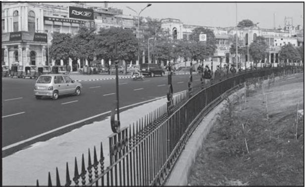

# Unit II Unit II Chapter 2

# **HUMAN SETTLEMENTS**

Human Settlement means cluster of dwellings of any type or size where human beings live. For this purpose, people may erect houses and other structures and command some area or territory as their economic support-base. Thus, the process of settlement inherently involves grouping of people and apportioning of territory as their resource base.

Settlements vary in size and type. They range from a hamlet to metropolitan cities. With size, the economic character and social structure of settlements changes and so do its ecology and technology. Settlements could be small and sparsely spaced; they may also be large and closely spaced. The sparsely located small settlements are called villages, specialising in agriculture or other primary activities. On the other hand, there are fewer but larger settlements which are termed as urban settlements specialising in secondary and tertiary activities. The basic differences between rural and urban settlements are as follows :

- The rural settlements derive their life support or basic economic needs from land based primary economic activities, whereas, urban settlements, depend on processing of raw materials and manufacturing of finished goods on the one hand and a variety of services on the other.
- Cities act as nodes of economic growth, provide goods and services not only to urban dwellers but also to the people of the rural settlements in their hinterlands in return for food and raw materials. This functional relationship between the urban and rural settlements takes place through transport and communication network.
- Rural and urban settlements differ in terms of social relationship, attitude and outlook. Rural people are less mobile and therefore, social relations among them are intimate. In urban areas, on the other hand, way of life is complex and fast, and social relations are formal.

# **Types of ypes of Rural Settlement**

Types of the settlement are determined by the extent of the built-up area and inter-house distance. In India compact or clustered village of a few hundred houses is a rather universal feature, particularly in the northern plains. However, there are several areas, which have other forms of rural settlements. There are various factors and conditions responsible for having different types of rural settlements in India. These include: (i) physical features – nature of terrain, altitude, climate and availability of water (ii) cultural and ethenic factors – social structure, caste and religion (iii) security factors – defence against thefts and robberies. Rural settlements in India can broadly be put into four types:

- Clustered, agglomerated or nucleated,
- Semi-clustered or fragmented,
- Hamleted, and
- Dispersed or isolated.

## Clustered Settlements

The clustered rural settlement is a compact or closely built up area of houses. In this type of village the general living area is distinct and separated from the surrounding farms, barns and pastures. The closely built-up area and its

*Fig. 2.1 : Clustered Settlements in the North-eastern states*

intervening streets present some recognisable pattern or geometric shape, such as rectangular, radial, linear, etc. Such settlements are generally found in fertile alluvial plains and in the northeastern states. Sometimes, people live in compact village for security or defence reasons, such as in the Bundelkhand region of central India and in Nagaland. In Rajasthan, scarcity of water has necessitated compact settlement for maximum utilisation of available water resources.

## Semi-Clustered Settlements

Semi-clustered or fragmented settlements may result from tendency of clustering in a restricted area of dispersed settlement. More often such a pattern may also result from segregation or fragmentation of a large compact village. In this case, one or more sections of the village society choose or is forced to live a little away from the main cluster or village. In such cases, generally, the land-owning and dominant community occupies the central part of the main village, whereas people of lower strata of society and menial workers settle on the outer flanks of the village. Such settlements are widespread in the Gujarat plain and some parts of Rajasthan.

*Fig. 2.2 : Semi-clustered settlements*

## Hamleted Settlements

Sometimes settlement is fragmented into several units physically separated from each other bearing a common name. These units are locally called *panna*, *para*, *palli*, *nagla*, *dhani,* etc. in various parts of the country. This segmentation of a large village is often motivated by social and ethnic factors. Such villages are more frequently found in the middle and lower Ganga plain, Chhattisgarh and lower valleys of the Himalayas.

#### Dispersed Settlements

Dispersed or isolated settlement pattern in India appears in the form of isolated huts or hamlets of few huts in remote jungles, or on small hills

**Fig. 2.3 : Dispersed settlements in Nagaland**

with farms or pasture on the slopes. Extreme dispersion of settlement is often caused by extremely fragmented nature of the terrain and land resource base of habitable areas. Many areas of Meghalaya, Uttarakhand, Himachal Pradesh and Kerala have this type of settlement.

# **Urban Settlements**

Unlike rural settlements, urban settlements are generally compact and larger in size. They are engaged in a variety of non-agricultural, economic and administrative functions. As mentioned earlier, cities are functionally linked to rural areas around them. Thus, exchange of goods and services is performed sometimes directly and sometimes through a series of market towns and cities. Thus, cities are connected directly as well as indirectly with the villages and also with each other.

> The census of India, 1991 defines urban settlements as "All places which have municipality, corporation, cantonment board or notified town area committee and have a minimum population of 5000 persons, at least 75 per cent of male workers are engaged in non-agriculture pursuits and a density of population of at least 400 persons per square kilometer are urban.

# **Evolution of Towns in India**

Towns flourished since prehistoric times in India. Even at the time of Indus valley civilisation, towns like Harappa and Mohanjodaro were in existence. The following period has witnessed evolution of towns. It continued with periodic ups and downs until the arrival of Europeans in India in the eighteenth century. On the basis of their evolution in different periods, Indian towns may be classified as:

• Ancient towns, • Medieval towns, and • Modern towns.

## *Ancient Towns*

There are number of towns in India having historical background spanning over 2000 years. Most of them developed as religious and cultural centres. Varanasi is one of the important towns among these. Prayag (Allahabad), Pataliputra (Patna), Madurai are some other examples of ancient towns in the country.

## *Medieval Towns*

About 100 of the existing towns have their roots in the medieval period. Most of them developed as headquarters of principalities and kingdoms. These are fort towns which came up on the ruins of ancient towns. Important among them are Delhi, Hyderabad, Jaipur, Lucknow, Agra and Nagpur.

## *Modern Towns*

The British and other Europeans have developed a number of towns in India. Starting their foothold on coastal locations, they first developed some trading ports such as Surat, Daman, Goa, Pondicherry, etc. The British later consolidated their hold around three principal nodes – Mumbai (Bombay), Chennai (Madras), and Kolkata (Calcutta) – and built them in the British style. Rapidly

**Fig. 2.4 : A view of the modern city**

extending their domination either directly or through control over the princely states, they established their administrative centres, hilltowns as summer resorts, and added new civil,

**Human Settlements 17**

| Year | Number of | Urban Population | % of Total | Decennial |
| --- | --- | --- | --- | --- |
|  | Towns/UAs | (in Thousands) | Population | Growth (%) |
| 1901 | 1,827 | 25,851.9 | 10.84 | —- |
| 1911 | 1,815 | 25,941.6 | 10.29 | 0.35 |
| 1921 | 1,949 | 28,086.2 | 11.18 | 8.27 |
| 1931 | 2,072 | 33,456.0 | 11.99 | 19.12 |
| 1941 | 2,250 | 44,153.3 | 13.86 | 31.97 |
| 1951 | 2,843 | 62,443.7 | 17.29 | 41.42 |
| 1961 | 2,365 | 78,936.6 | 17.97 | 26.41 |
| 1971 | 2,590 | 1,09,114 | 19.91 | 38.23 |
| 1981 | 3,378 | 1,59,463 | 23.34 | 46.14 |
| 1991 | 4,689 | 2,17,611 | 25.71 | 36.47 |
| 2001 | 5,161 | 2,85,355 | 27.78 | 31.13 |
| 2011* | 6,171 | 3,77,000 | 31.16 | 31.08 |

*Table 2.1 : India – Trends of Urbanisation 1901-2011*

**Source: Census of India, 2011 http.//www.censusindia.gov.in (Provisional)*

administrative and military areas to them. Towns based on modern industries also evolved after 1850. Jamshedpur can be cited as an example.

After independence, a large number of towns have been developed as administrative headquarters, e.g., Chandigarh, Bhubaneswar, Gandhinagar, Dispur, etc., and industrial centres, such as Durgapur, Bhilai, Sindri, Barauni. Some old towns also developed as satellite towns around metropolitan cities, such as Ghaziabad, Rohtak, Gurugram around Delhi. With increasing investment in rural areas, a large number of medium and small towns have developed all over the country.

# **Urbanisation in India**

The level of urbanisation is measured in terms of percentage of urban population to total population. The level of urbanisation in India in 2011 was 31.16 per cent, which is quite low in comparison to developed countries. Total urban population has increased eleven-fold during the twentieth century. Enlargement of urban centres and emergence of new towns have played a significant role in the growth of urban population and urbanisation in the country. (Table 2.1). But the growth rate of urbanisation has slowed down during last two decades.

## Functional Classification of Towns

Apart from their role as central or nodal places, many towns and cities perform specialised services. Some towns and cities specialise in certain functions and they are known for some specific activities, products or services. However, each town performs a number of functions. On the basis of dominant or specialised functions, Indian cities and towns can be broadly classified as follows:

## *Administrative towns and cities*

Towns supporting administrative headquarters of higher order are administrative towns, such as Chandigarh, New Delhi, Bhopal, Shillong, Guwahati, Imphal, Srinagar, Gandhinagar, Jaipur, Chennai, etc.

## *Industrial towns*

Industries constitute prime motive force of these cities, such as Mumbai, Salem, Coimbatore, Modinagar, Jamshedpur, Hugli, Bhilai, etc.

## *Transport Cities*

They may be ports primarily engaged in export and import activities such as Kandla, Kochchi, Kozhikode, Vishakhapatnam, etc., or hubs of inland transport, such as Agra, Dhulia, Mughalsarai, Itarsi, Katni, etc.

18 *India : People and Economy*

## *Commercial towns*

Towns and cities specialising in trade and commerce are kept in this class. Kolkata, Saharanpur, Satna, etc., are some examples.

## *Mining towns*

These towns have developed in mineral rich areas such as Raniganj, Jharia, Digboi, Ankaleshwar, Singrauli, etc.

## *Garrisson Cantonment towns*

These towns emerged as garrisson towns such as Ambala, Jalandhar, Mhow, Babina, Udhampur, etc.

## Smart Cities Mission

The objective of the *Smart Cities Mission* is to promote cities that provide core infrastructure, a clean and sustainable environment and give a decent quality of life to its citizens. One of the features of Smart Cities is to apply smart solutions to infrastructure and services in order to make them better. For example, making areas less vulnerable to disasters, using fewer resources and providing cheaper services. The focus is on sustainble and inclusive development and the idea is to look at compact areas, create a replicable model, which will act like a lighthouse to other aspiring cities.

**List the urban agglomerations/cities state-wise and see the state-wise population under this category of cities.**

## *Educational towns*

Starting as centres of education, some of the towns have grown into major campus towns, such as Roorki, Varanasi, Aligarh, Pilani, Allahabad, etc.

#### *Religious and cultural towns*

Varanasi, Mathura, Amritsar, Madurai, Puri, Ajmer, Pushkar, Tirupati, Kurukshetra, Haridwar, Ujjain came to prominence due to their religious/cultural significance.

#### *Tourist towns*

Nainital, Mussoorie, Shimla, Pachmarhi, Jodhpur, Jaisalmer, Udagamandalam (Ooty), Mount Abu are some of the tourist destinations.

The cities are not static in their function. The functions change due to their dynamic nature.

Even specialised cities, as they grow into metropolises become multifunctional wherein industry, business, administration, transport, etc., become important. The functions get so intertwined that the city can not be categorised in a particular functional class.

# EXERCISES

**1.** Choose the right answers of the following from the given options.

- (i) Which one of the following towns is NOT located on a river bank?
	-
	-
	- (a) Agra (c) Patna
	- (b) Bhopal (d) Kolkata

- (ii) Which one of the following is NOT the part of the definition of a town as per the census of India?
	- (a) Population density of 400 persons per sq km.
	- (b) Presence of municipality, corporation, etc.
	- (c) More than 75% of the population engaged in primary sector.
	- (d) Population size of more than 5,000 persons.
- (iii) In which one of the following environments does one expect the presence of dispersed rural settlements?
	- (a) Alluvial plains of Ganga
	- (b) Arid and semi-arid regions of Rajasthan
	- (c) Lower valleys of Himalayas
	- (d) Forests and hills in north-east
- **2.** Answer the following questions in about 30 words.
	- (i) What are garrisson towns? What is their function?
	- (ii) What are the main factors for the location of villages in desert regions?
- **3.** Answer the following questions in about 150 words.
	- (i) Discuss the features of different types of rural settlements. What are the factors responsible for the settlement patterns in different physical environments?
	- (ii) Can one imagine the presence of only one-function town? Why do the cities become multi-functional?

