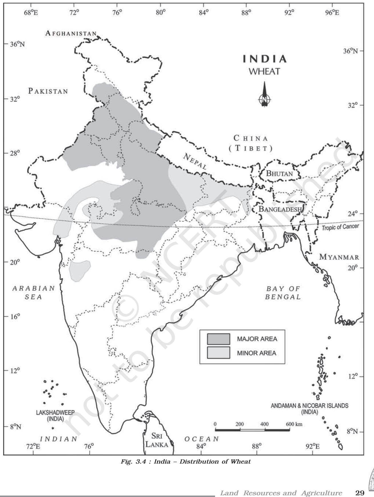
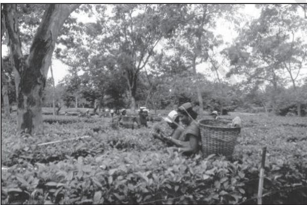

# Unit III Unit IIIUnit III Chapter 3

# LAND RESOURCES AND AGRICULTURE

You must have observed that the land around you is put to different uses. Some land is occupied by rivers, some may have trees and on some parts roads and buildings have been built. Different types of lands are suited to different uses. Human beings thus, use land as a resource for production as well as residence and recreation. Thus, the building of your school, roads on which you travel, parks in which you play, fields in which crops are grown and the pastures where animals graze represent different uses to which land is put.

# **Land Use Categories**

Land-use records are maintained by land revenue department. The land use categories add up to *reporting area,* which is somewhat different from the *geographical area.* The Survey of India is responsible for measuring *geographical area* of administrative units in India. Have you ever used a map prepared by Survey of India? The difference between the two concepts are that while the former changes somewhat depending on the estimates of the land revenue records, the latter does not change and stays fixed as per Survey of India measurements. You may be familiar with land use categories as they are also included in your Social Science textbook of Class X.

> The land-use categories as maintained in the Land Revenue Records are as follows :

- *(i) Forests* **:** It is important to note that area under actual forest cover is different from area classified as forest. The latter is the area which the Government has identified and demarcated for forest growth. The land revenue records are consistent with the latter definition. *Thus, there may be an increase in this category without any increase in the actual forest cover.*
- *(ii) Barren and Wastelands :* The land which may be classified as a wasteland such as barren hilly terrains, desert lands, ravines, etc. normally cannot be brought under cultivation with the available technology.
- *(iii) Land put to Non-agricultural Uses :* Land under settlements (rural and urban), infrastructure (roads, canals, etc.), industries, shops, etc., are included in this category. An expansion in the secondary and tertiary activities would lead to an increase in this category of land-use.
- *(iv) Area under Permanent Pastures and Grazing Lands :* Most of this type land is owned by the village '*Panchayat*' or the Government. Only a small proportion of this land is privately owned. The land owned by the village panchayat comes under 'Common Property Resources'.
- *(v) Area under Miscellaneous Tree Crops and Groves (Not included in Net sown Area) :* The land under orchards and fruit trees are included in this category. Much of this land is privately owned.
- *(vi) Culturable Wasteland :*Any land which is left fallow (uncultivated) for more than five years is included in this category. It can be brought under cultivation after improving it through reclamation practices.
- *(vii) Current Fallow* This is the land which *:* is left without cultivation for one or less than one agricultural year. Fallowing is a cultural practice adopted for giving the land rest. The land recoups the lost fertility through natural processes.
- *(viii) Fallow other than Current Fallow :* This is also a cultivable land which is left uncultivated for more than a year but less than five years. If the land is left uncultivated for more than five years, it would be categorised as culturable wasteland.
- *(ix) Net Area Sown:* The physical extent of land on which crops are sown and harvested is known as net sown area.

# **Land-use Changes in India**

Land-use in a region, to a large extent, is influenced by the nature of economic activities carried out in that region. However, while economic activities change over time, land, like many other natural resources, is fixed in terms of its area. At this stage, one needs to appreciate three types of changes that an economy undergoes, which affect land-use.

- (i) The size of the economy (measured in terms of value for all the goods and services produced in the economy) grows over time as a result of increasing population, change in income levels, available technology and associated factors. As a result, the pressure on land will increase with time and marginal lands would come under use.
- (ii) Secondly, the composition of the economy would undergo a change over time. In other words, the secondary and the tertiary sectors usually grow much faster than the primary sector, specifically the agricultural sector. This type of change is common in developing countries, like India. This process would result in a gradual shift of land from agricultural uses to non-agricultural uses. You would observe that such changes are sharp around large urban areas. The agricultural land is being used for building purposes.
- (iii) Thirdly, though the contribution of the agricultural activities reduces over time, the pressure on land for agricultural activities does not decline. The reasons for continued pressure on agricultural land are:
	- (a) In developing countries, the share of population dependent on agriculture usually declines much more slowly compared to the decline in the sector's share in GDP.
	- (b) The number of people that the agricultural sector has to feed is increasing day by day.

22 *India : People and Economy*

*Fig. 3.1*

Compare the changes of land-use between 1950–57 and 2014–15.

India has undergone major changes within the economy over the past four or five decades, and this has influenced the land-use changes in the country. These changes between 1950–51 and 2014–15 have been shown in Fig. 3.1. There are two points that you need to remember before you derive some meaning from this figure. Firstly, the percentages shown in the figure have been derived with respect to the reporting area. Secondly, since even the reporting area has been relatively constant over the years, a decline in one category usually leads to an increase in some other category.

Four categories have undergone increases, while four have registered declines. Share of area under forest, area under non-agricultural uses, current fallow lands and net area sown have shown an increase. The following observations can be made about these increases:

- (i) The *rate of increase* is the highest in case of area under non-agricultural uses. This is due to the changing structure of Indian economy, which is increasingly depending on the contribution from
industrial and services sectors and expansion of related infrastructural facilities. Also, an expansion of area under both urban and rural settlements has added to the increase. Thus, the area under non-agricultural uses is increasing at the expense of wastelands and agricultural land.

- (ii) The increase in the share under forest, as explained before, can be accounted for by increase in the demarcated area under forest rather than an actual increase in the forest cover in the country.
- (iii) The increase in the current fallow cannot be explained from information pertaining to only two points. The trend of current fallow fluctuates a great deal over years, depending on the variability of rainfall and cropping cycles.
- (iv) The increase in net area sown is a recent phenomenon due to use of culturable waste land for agricultural pupose. Before which it was registering a slow decrease. There are indications that most of the decline had occurred due to the increases in area under nonagricultural use. (Note : the expansion of building activity on agricultural land in your village and city).

The four categories that have registered a decline are barren and wasteland, culturable wasteland, area under tree crops and groves and fallow lands.

The following explanations can be given for the declining trends:

- (i) As the pressure on land increased, both from the agricultural and nonagricultural sectors, the wastelands and culturable wastelands have witnessed decline over time.
- (ii) The decline in land under tree crops and groves can be explained by pressure from agricultural land.

What is the difference between actual increase and rate of increase? Work out the actual increase and rate of increases for all the land use categories between 1950–51 and 2014–15 from the data given in the Appendix (vi). Explain the results.

#### *Note for Teacher*

For calculating actual increase, the difference of the land-use categories should be worked out over the two periods.

For deriving the rate of increase, simple growth rate i.e. (difference of values between the two time points i.e. value of terminal year minus base year / base year or 1960-61 value) should be used, e.g.

100 Net sown Area in 2014–15 – Net sown Area in 1950–51 Net sown Area in 1950–51

# **Common Property Resources**

Land, according to its ownership can broadly be classified under two broad heads – private land and common property resources (CPRs). While the former is owned by an individual or a group of individuals, the latter is owned by the state meant for the use of the community. CPRs provide fodder for the livestock and fuel for the households along with other minor forest products like fruits, nuts, fibre, medicinal plants, etc. In rural areas, such land is of

**24 India : People and Economy** particular relevance for the livelihood of the landless and marginal farmers and other weaker sections since many of them depend on income from their livestock due to the fact that they have limited access to land. CPRs also are important for women as most of the fodder and fuel collection is done by them in rural areas. They have to devote long hours in collecting fuel and fodder from a degraded area of CPR.

CPRs can be defined as community's natural resource, where every member has the right of access and usage with specified obligations, without anybody having property rights over them. Community forests, pasture lands, village water bodies and other public spaces where a group larger than a household or family unit exercises rights of use and carries responsibility of management are examples of CPRs.

# **Agricultural Land Use in India**

Land resource is more crucial to the livelihood of the people depending on agriculture:

- (i) Agriculture is a purely land based activity unlike secondary and tertiary activities. In other words, contribution of land in agricultural output is more compared to its contribution in the outputs in the other sectors. Thus, lack of access to land is directly correlated with incidence of poverty in rural areas.
- (ii) Quality of land has a direct bearing on the productivity of agriculture, which is not true for other activities.
- (iii) In rural areas, aside from its value as a productive factor, land ownership has a social value and serves as a security for credit, natural hazards or life contingencies, and also adds to the social status.

An estimation of the total stock of agricultural land resources (i.e. total cultivable land) can be arrived at by adding up net sown area, all fallow lands and culturable wasteland. It may be observed from Table 3.1 that over the years, there has been a marginal decline in the available total stock of cultivable land as a percentage to total reporting area. There has been a greater decline of cultivated land, in spite of a corresponding decline of cultivable wasteland.

| Agricultural Land-use | As a percentage of |  | As a percentage of |  |
| --- | --- | --- | --- | --- |
| Categories | Reporting Area |  | total cultivable land |  |
|  | 1950-51 | 2014-15 | 1950-51 | 2014-15 |
| Culturable Waste land | 8.0 | 4.0 | 13.4 | 6.8 |
| Fallow other than Current Fallow | 6.1 | 3.6 | 10.2 | 6.2 |
| Current Fallow | 3.7 | 4.9 | 6.2 | 8.4 |
| Net Area Sown | 41.7 | 45.5 | 70.0 | 78.4 |
| Total Cultivable Land | 59.5 | 58.0 | 100.00 | 100.00 |

*Table 3.1 : Composition of Total Cultivable Land*

It is clear from the above discussion that the scope for bringing in additional land under net sown area in India is limited. There is, thus, an urgent need to evolve and adopt land-saving technologies. Such technologies can be classified under two heads – those which raise the yield of any particular crop per unit area of land and those which increase the total output per unit area of land from all crops grown over one agricultural year by increasing land-use intensity. The advantage of the latter kind of technology is that along with increasing output from limited land, it also increases the demand for labour significantly. For a land scarce but labour abundant country like India, a high cropping intensity is desirable not only for fuller utilisation of land resource, but also for reducing unemployment in the rural economy.

The *cropping intensity (CI)* is calculated as follows :

100 GCA Cropping Intensity in percentage NSA = **×**

Cropping Seasons in India

There are three distinct crop seasons in the northern and interior parts of country, namely *kharif*, *rabi* and *zaid*. The *kharif* season largely coincides with Southwest Monsoon under which the cultivation of tropical crops, such as rice, cotton, jute, jowar, bajra and tur is possible. The *rabi* season begins with the onset of winter in October-November and ends in March-April. The low temperature conditions during this season facilitate the cultivation of temperate and subtropical crops such as wheat, gram and mustard. *Zaid* is a short duration summer cropping season beginning after harvesting of rabi crops. The cultivation of watermelons, cucumbers, vegetables and fodder crops during this season is done on irrigated lands. However, this type of distinction in the cropping season does not exist in southern parts of the country. Here, the temperature is high enough to grow tropical crops during any period in the year provided the soil moisture is available. Therefore, in this region same crops can be grown thrice in an agricultural year provided there is sufficient soil moisture.

### Types of Farming

On the basis of main source of moisture for crops, the farming can be classified as *irrigated* and *rainfed* (*barani*). There is difference in the nature of irrigated farming, as well as based on the objective of irrigation, i.e., protective or productive. The objective of protective irrigation is to protect the crops from adverse effects of soil

| Table 3.2 : Cropping Seasons in India |
| --- |

| Cropping Season | Major Crops Cultivated |  |
| --- | --- | --- |
|  | Northern States | Southern States |
| Kharif | Rice, Cotton, Bajra, | Rice, Maize, Ragi, |
| June-September | Maize, Jowar, Tur | Jowar, Groundnut |
| Rabi | Wheat, Gram, Rapeseeds | Rice, Maize, Ragi, |
| October – March | and Mustard, Barley | Groundnut, Jowar |
| Zaid | Vegetables, Fruits, | Rice, Vegetables, |
| April–June | Fodder | Fodder |

moisture deficiency which often means that irrigation acts as a supplementary source of water over and above the rainfall. The strategy of this kind of irrigation is to provide soil moisture to maximum possible area. Productive irrigation is meant to provide sufficient soil moisture in the cropping season to achieve high productivity. In such irrigation the water input per unit area of cultivated land is higher than protective irrigation. *Rainfed farming* is further classified on the basis of adequacy of soil moisture during cropping season into *dryland* and *wetland* farming. In India, the *dryland farming* is largely confined to the regions having annual rainfall less than 75 cm. These regions grow hardy and drought resistant crops such as *ragi*, *bajra*, *moong*, gram and *guar* (fodder crops) and practise various measures of soil moisture conservation and rain water harvesting. In *wetland farming*, the rainfall is in excess of soil moisture requirement of plants during rainy season. Such regions may face flood and soil erosion hazards. These areas grow various water intensive crops such as rice, jute and sugarcane and practise aquaculture in the fresh water bodies.

#### **Foodgrains**

The importance of foodgrains in Indian agricultural economy may be gauged from the fact these crops occupy about two-third of total cropped area in the country. Foodgrains are dominant crops in all parts of the country whether they have subsistence or commercial agricultural economy. On the basis of the structure of grain the foodgrains are classified as cereals and pulses.

#### *Cereals*

The cereals occupy about 54 per cent of total cropped area in India. The country produces about 11 per cent cereals of the world and ranks third in production after China and U.S.A. India produces a variety of cereals, which are classified as fine grains (rice, wheat) and coarse grains (jowar, bajra, maize, ragi), etc. Account of important cereals has been given in the following paragraphs :

#### *Rice*

Rice is a staple food for the overwhelming majority of population in India. Though, it is considered to be a crop of tropical humid areas, it has many varieties which are grown in different agro-climatic regions. These are successfully grown from sea level to about 2,000 m altitude and from humid areas in eastern India to dry but irrigated areas of Punjab, Haryana, western U.P. and northern Rajasthan. In southern states and West Bengal the climatic conditions allow the cultivation of two or three crops of rice in an agricultural year. In West Bengal farmers grow three crops of rice called '*aus*', '*aman*' and '*boro*'. But in Himalayas and northwestern parts of the country, it is grown as a *kharif* crop during southwest Monsoon season.

India contributes 22.07 per cent of rice production in the world and ranked second after China in 2018. About one-fourth of the total cropped area in the country is under rice cultivation. West Bengal, Uttar Pradesh, and Punjab are the leading rice producing states in the country. The yield level of rice is high in Punjab, Tamil Nadu, Haryana, Andhra Pradesh, Telangana, West Bengal and Kerala. In the first four of these states almost the entire land under rice cultivation is irrigated. Punjab and Haryana are not traditional rice growing areas. Rice

*Fig. 3.2 : Rice transplantation in southern parts of India*

cultivation in the irrigated areas of Punjab and Haryana was introduced in 1970s following the Green Revolution. Genetically improved varieties of seed, relatively high usage of fertilizers and pesticides and lower levels of susceptibility of the crop to pests due to dry climatic conditions

**26** *India : People and Economy*

are responsible for higher yield of rice in this region. The yield of this crop is very low in rainfed areas of Madhya Pradesh, Chhattisgarh and Odisha.

#### *Wheat*

Wheat is the second most important cereal crop in India after rice. India produces about 12.8 per cent of total wheat production of world (2017). It is primarily a crop of temperate zone. Hence, its cultivation in India is done during winter i.e. *rabi* season. About 85 per cent of total area under this crop is concentrated in north and central regions of the country i.e. Indo-Gangetic Plain, Malwa Plateau and Himalayas up to 2,700 m altitude. Being a *rabi* crop, it is mostly grown under irrigated conditions. But it is a rainfed crop in Himalayan highlands and parts of Malwa plateau in Madhya Pradesh.

About 14 per cent of the total cropped area in the country is under wheat cultivation. Uttar Pradesh, Madhya Pradesh, Punjab, Haryana and Rajasthan are leading wheat producing states. The yield level of wheat is very high (above 4,000 k.g. per ha) in Punjab and Haryana whereas, Uttar Pradesh, Rajasthan and Bihar have moderate yields. The states like Madhya Pradesh, Himachal Pradesh and Jammu and Kashmir growing wheat under rainfed conditions have low yield.

### *Jowar*

The coarse cereals together occupy about 16.50 per cent of total cropped area in the country. Among these, *jowar* or *sorghum* alone accounts for about 5.3 per cent of total cropped area. It is main food crop in semi-arid areas of central and southern India. Maharashtra alone produces more than half of the total *jowar* production of the country. Other leading producer states of *jowar* are Karnataka, Madhya Pradesh, Andhra Pradesh and Telangana. It is sown in both *kharif* and *rabi* seasons in southern states. But it is a *kharif* crop in northern India where it is mostly grown as a fodder crop. South of Vindhyachal it is a rainfed crop and its yield level is very low in this region.

28 *India : People and Economy*

#### *Bajra*

Bajra is sown in hot and dry climatic conditions in northwestern and western parts of the country. It is a hardy crop which resists frequent dry spells and drought in this region. It is cultivated alone as well as part of mixed cropping. This coarse cereal occupies about 5.2 per cent of total cropped area in the country. Leading producers of *bajra* are the states of Rajasthan, Maharashtra, Gujarat, Uttar Pradesh and Haryana. Yield of this crop has increased during recent years in Rajasthan, Haryana and Gujarat due to introduction of drought resistant varieties and expansion of irrigation under it.

#### *Maize*

Maize is a food as well as fodder crop grown under semi-arid climatic conditions and over inferior soils. This crop occupies only about 3.6 per cent of total cropped area. Maize cultivation is not concentrated in any specific region. It is sown all over India exceptPunjab and eastern and north-eastern regions. The leading producers of maize are the states of Karnataka, Madhya Pradesh, Bihar, Andhra Pradesh, Telangana, Rajasthan and Uttar Pradesh. Yield level of maize is higher than other coarse cereals. It is high in southern states and declines towards central parts.

#### *Pulses*

Pulses are a very important ingredient of vegetarian food as these are rich sources of proteins. These are legume crops which increase the natural fertility of soils through nitrogen fixation. India is a leading producer of pulses in the world. The cultivation of pulses in the country is largely concentrated in the drylands of Deccan and central plateaus and northwestern parts of the country. Pulses occupy about 11 per cent of the total cropped area in the country. Being the rainfed crops of drylands, the yields of pulses are low and fluctuate from year to year. Gram and *tur* are the main pulses cultivated in India.

#### *Gram*

Gram is cultivated in subtropical areas. It is mostly a rainfed crop cultivated during rabi season in central, western and northwestern parts of the country. Just one or two light showers or irrigations are required to grow this crop successfully. It has been displaced from the cropping pattern by wheat in Haryana, Punjab and northern Rajasthan following the green revolution. At present, gram covers only about 2.8 per cent of the total cropped area in the country. Madhya Pradesh, Uttar Pradesh, Maharashtra, Andhra Pradesh, Telangana and Rajasthan are the main producers of this pulse crop. The yield of this crop continues to be low and fluctuates from year to year even in irrigated areas.

#### *Tur (Arhar)*

Tur is the second important pulse crop in the country. It is also known as *red gram* or *pigeon pea*. It is cultivated over marginal lands and under rainfed conditions in the dry areas of central and southern states of the country. This crop occupies only about 2 per cent of total cropped area of India. Maharashtra alone contributes about one-third of the total production of tur. Other leading producer states are Uttar Pradesh, Karnataka, Gujarat and Madhya Pradesh. Per hectare output of this crop is very low and its performance is inconsistent.

Differentiate between different foodgrains. Mix grains of various kinds and separate cereals from pulses. Also, separate fine from coarse cereals.

#### Oilseeds

The oilseeds are produced for extracting edible oils. Drylands of Malwa plateau, Marathwada, Gujarat, Rajasthan, Telangana, Rayalseema region of Andhra Pradesh and Karnataka plateau are oilseeds growing regions of India. These crops together occupy about 14 per cent of total cropped area in the country. Groundnut, rapeseed and mustard, soyabean and sunflower are the main oilseed crops grown in India.

*Groundnut*

India produces about 18.8 per cent of the total groundnut production in the world (2018). It is largely a rainfed *kharif* crop of drylands. But in southern India, it is cultivated during rabi season as well. It covers about 3.6 per cent of total cropped area in the country. Gujarat, Rajasthan, Tamil Nadu, Telangana, Andhra Pradesh, Karnataka and Maharashtra are the leading producers. Yield of groundnut is comparatively high in Tamil Nadu where it is partly irrigated. But its yield is low in Telangana, Andhra Pradesh and Karnataka.

#### *Rapeseed and Mustard*

Rapeseed and mustard comprise several oilseeds as *rai, sarson, toria* and *taramira*. These are subtropical crops cultivated during rabi season in north-western and central parts of India. These are frost sensitive crops and their yields fluctuate from year to year. But with the expansion of irrigation and improvement in seed technology, their yields have improved and stabilised to some extent. About two-third of the cultivated area under these crops is irrigated. These oilseeds together occupy only about 2.5 per cent of total cropped area in the country. Rajasthan contributes about one-third production while other leading producers are Haryana and Madhya Pradesh. Yields of these crops are comparatively high in Haryana and Rajasthan.

#### *Other Oilseeds*

Soyabean and sunflower are other important oilseeds grown in India. Soyabean is mostly grown in Madhya Pradesh and Maharashtra.

*Fig. 3.5 : Farmers sowing soyabean seeds in Amravati, Maharashtra*

30 *India : People and Economy*

These two states together produce about 90 per cent of total output of soyabean in the country. Sunflower cultivation is concentrated in Karnataka, Andhra Pradesh, Telangana and adjoining areas of Maharashtra. It is a minor crop in northern parts of the country where its yield is high due to irrigation.

#### Fibre Crops

These crops provide us fibre for preparing cloth, bags, sacks and a number of other items. Cotton and jute are two main fibre crops grown in India.

### *Cotton*

Cotton is a tropical crop grown in *kharif* season in semi-arid areas of the country. India lost a large proportion of cotton growing area to Pakistan during partition. However, its acreage has increased considerably during the last 50 years. India grows both short staple (Indian) cotton as well as long staple (American) cotton called '*narma*' in north-western parts of the country. Cotton requires clear sky during flowering stage.

*Fig. 3.7 : Cotton Cultivation*

India ranks second in the world in the production of cotton after China. Cotton occupies about 4.7 per cent of total cropped area in the country. There are three cotton growing areas, i.e. parts of Punjab, Haryana and northern Rajasthan in north-west, Gujarat and Maharashtra in the west and plateaus of Andhra Pradesh, Karnataka and Tamil Nadu in south. Leading producers of this crop are Gujarat, Maharashtra and Telangana Per hectare output of cotton is high under irrigated conditions in north-western region of the country. Its yield is very low in Maharashtra where it is grown under rainfed conditions.

#### *Jute*

Jute is used for making coarse cloth, bags, sacks and decorative items. It is a cash crop in West Bengal and adjoining eastern parts of the country. India lost large jute growing areas to East Pakistan (Bangladesh) during partition. At present, India produces about three-fifth of jute production of the world. West Bengal accounts for about three-fourth of the production in the country. Bihar and Assam are other jute growing areas. Being concentrated only in a few states, this crop accounts for only about 0.5 per cent of total cropped area in the country.

### Other Crops

Sugarcane, tea and coffee are other important crops grown in India.

#### *Sugarcane*

Sugarcane is a crop of tropical areas. Under rainfed conditions, it is cultivated in sub-humid and humid climates. But it is largely an irrigated crop in India. In Indo-Gangetic plain, its cultivation is largely concentrated in Uttar Pradesh. Sugarcane growing area in western India is spread over Maharashtra and Gujarat.

*Fig. 3.8 : Sugarcane Cultivation*

In southern India, it is cultivated in irrigated tracts of Karnataka, Tamil Nadu, Telangana and Andhra Pradesh.

India was the second largest producer of sugarcane after Brazil in 2018. It accounts for about 19.7 per cent of the world production of sugarcane. But it occupies only 2.4 per cent of total cropped area in the country. Uttar Pradesh produces about two-fifth of sugarcane of the country. Maharashtra, Karnataka, Tamil Nadu, and Andhra Pradesh are other leading producers of this crop where yield level of sugarcane is high. Its yield is low in northern India.

### *Tea*

Tea is a plantation crop used as beverage. Black tea leaves are fermented whereas green tea leaves are unfermented. Tea leaves have rich content of caffeine and tannin. It is an indigenous crop of hills in northern China. It is grown over undulating topography of hilly areas and welldrained soils in humid and sub-humid tropics and sub-tropics. In India, tea plantation started in 1840s in Brahmaputra valley of Assam which still is a major tea growing area in the country. Later on, its plantation was introduced in the sub-Himalayan region of West Bengal (Darjeeling, Jalpaiguri and Cooch Behar districts). Tea is also cultivated on the lower slopes of Nilgiri and

*Fig. 3.10 : Tea Farming*

Cardamom hills in Western Ghats. India is a leading producer of tea and accounts for about 21.22 per cent of total production in the world 2018. India's share in the international market of tea has declined substantially. It ranks second among tea exporting countries in the

34 *India : People and Economy*

world after China (2018). Assam accounts for about 53.2 per cent of the total cropped area and contributes more than half of total production of tea in the country. West Bengal and Tamil Nadu are the other leading producers of tea.

#### *Coffee*

Coffee is a tropical plantation crop. Its seeds are roasted, ground and are used for preparing a beverage. There are three varieties of coffee i.e. *arabica*, *robusta* and *liberica*. India mostly grows superior quality coffee, *arabica*, which is in great demand in International market. But India produces only about 3.17 per cent coffee of the world and *ranks eighth* after Brazil, Vietnam, Indonesia, Colombia, Honduras, Ethiopia and Peru in 2018. Coffee is cultivated in the highlands of Western Ghats in Karnataka, Kerala and Tamil Nadu. Karnataka alone accounts for more than two-third of total production of coffee in the country.

## **Agricultural Development in India**

Indian agricultural economy was largely subsistence in nature before Independence. It had dismal performance in the first half of twentieth century. This period witnessed severe droughts and famines. During partition about one-third of the irrigated land in undivided India went to Pakistan. This reduced the proportion of irrigated area in Independent India. After Independence, the immediate goal of the Government was to increase foodgrains production by (i) switching over from cash crops to food crops; (ii) intensification of cropping over already cultivated land; and (iii) increasing cultivated area by bringing cultivable and fallow land under plough. Initially, this strategy helped in increasing foodgrains production. But agricultural production stagnated during late –1950s. To overcome this problem, Intensive Agricultural District Programme (IADP) and Intensive Agricultural Area Programme (IAAP) were launched. But two consecutive droughts during mid-1960s resulted in food crisis in the country. Consequently, foodgrains were imported from other countries.

New seed varieties of wheat (Mexico) and rice (Philippines) known as high yielding varieties (HYVs) were available for cultivation by mid-1960s. India took advantage of this and introduced package technology comprising HYVs, along with chemical fertilisers in irrigated areas of Punjab, Haryana, Western Uttar Pradesh, Andhra Pradesh and Gujarat. Assured supply of soil moisture through irrigation was a basic pre-requisite for the success of this new agricultural technology. This strategy of agricultural development paid dividends instantly and increased the foodgrains production at very fast rate. This spurt of agricultural growth came to be known as 'Green Revolution'. This also gave fillip to the development of a large number of agro-inputs, agro-processing industries and small-scale industries. This strategy of agricultural development made the country self-reliant in foodgrain production. But Green Revolution was initially confined to irrigated areas only. This led to regional disparities in agricultural development in the country till 1970s, after which the technology spread to the Eastern and Central parts of the country.

The Planning Commission of India focused its attention on the problems of agriculture in rainfed areas in 1980s. It initiated agro-climatic planning in 1988 to induce regionally balanced agricultural development in the country. It also emphasised on the need for diversification of agriculture and harnessing of resources for the development of dairy farming, poultry, horticulture, livestock rearing and aquaculture.

Initiation of the policy of liberalisation and free market economy in 1990s influenced the course of development of Indian agriculture.

#### National Mission for Sustainable Agriculture (NMSA)

National Mission for Sustainable Agriculture is to make agriculture more productive, sustainable, remunerative and climate resilient by promoting location specific integrated/composite farming systems and to conserve natural resources through appropriate soil and moisture conservation measures. The Government has been promoting organic farming in the country through the scheme such as Paramparagat Krishi Vikas Yojana (PKVY) and Rashtriya Vikas Yojana (RKVY).

### Growth of Agricultural Output and Technology

There has been a significant increase in agricultural output and improvement in technology during the last 50 years.

- Production and yield of many crops such as rice and wheat has increased at an impressive rate. Among the other crops, the production of sugarcane, oilseeds and cotton has also increased appreciably.
- Expansion of irrigation has played a crucial role in enhancing agricultural output in the country. It provided basis for introduction of modern agricultural technology, such as high yielding varieties of seeds, chemical fertilisers, pesticides and farm machinery. The net irrigated area in the country has also increased.
- Modern agricultural technology has diffused very fast in various areas of the country. Consumption of chemical fertilizers has increased by 15 times since mid-sixties. Since the high yielding varieties are highly susceptible to pests and diseases, the use of pesticides has increased significantly since 1960s.

#### Farmer's Portal of India

The Farmer's Portal is a platform for farmers to seek any information related to agriculture. Detailed information on farmers' insurance, agriculture storage, crops, extension activities, seeds, pesticides, farm machineries, etc. is provided. Details of fertilizers, market prices, package and practices, programmes, welfare schemes are also given. Block level details related to soil fertility, storage, insurance, training, etc. are available in an interactive map. Users can also download farm friendly handbook, scheme guidelines, etc.

(Source: https://www.india.gov.in/farmers-portalindia-department-agriculture-and-cooperation)

# **Problems of Indian Agricultur riculturriculture**

The nature of problems faced by Indian agriculture varies according to agro-ecological and historical experiences of its different regions. Hence, most of the agricultural problems in the country are region specific. Yet, there are some problems which are common and range from physical constraints to institutional hindrances. A detailed discussion on these problems follows:

*Fig. 3.12 : Roto Till Drill—A modern agricultural equipment*

#### Dependence on Erratic Monsoon

Irrigation covers only about 33 per cent of the cultivated area in India. The crop production in rest of the cultivated land directly depends on rain. Poor performance of south-west monsoon also adversely affects the supply of canal water for irrigation. On the other hand, the rainfall in Rajasthan and other droughtprone areas is too meagre and highly unreliable. Even the areas receiving high annual rainfall experience considerable fluctuations. This makes them vulnerable to both droughts and floods. Drought is a common phenomenon in the low rainfall areas, which may also experience occasional floods. The flash floods in drylands of Maharashtra, Gujarat and Rajasthan in 2006 and 2017 are examples of this phenomenon. Droughts and floods continue to be the twin menace in Indian agriculture.

#### Low productivity

The yield of the crops in the country is low in comparison to the international level. Per hectare output of most of the crops such as rice, wheat, cotton and oilseeds in India is much lower than that of the U.S.A., Russia and Japan. Because of the very high pressure on the land resources, the labour productivity in Indian agriculture is also very low in comparison to international level. The vast rainfed areas of the country, particularly drylands which mostly grow coarse cereals, pulses and oilseeds have low yields.

**Why is agricultural productivity low in dry regions?**

#### Constraints of Financial Resources and Indebtedness

The inputs of modern agriculture are very expensive. This resource intensive approach has become unmanageable for marginal and small farmers as they have very meagre or no saving to invest in agriculture. To tide over these difficulties, most of such farmers have resorted to availing credit from various institutions and moneylenders. Crop failures and low returns from agriculture have forced them to fall in the trap of indebtedness.

**What are the implications of severe indebtedness? Do you feel that the recent incidents of farmers' suicides in different states of the country are the result of indebtedness?**

### Lack of Land Reforms

Indian peasantry had been exploited for a long time as there had been unequal distribution of land. Among the three revenue systems operational during British period, i.e., Mahalwari, Ryotwari and Zamindari, the last one was most exploitative for the peasants. After Independence, land reforms were accorded priority, but these reforms were not implemented effectively due to lack of strong political will. Most of the state governments avoided taking politically tough decisions which went against strong political lobbies of landlords. Lack of implementation of land reforms has resulted in continuation of inequitous distribution of cultivable land which is detrimental to agricultural development.

### Small Farm Size and Fragmentation of Landholdings

There are a large number of marginal and small farmers in the country. The average size of land holding is shrinking under increasing

population pressure. Furthermore, in India, the land holdings are mostly fragmented. There are some states where consolidation of holding has not been carried out even once. Even the states where it has been carried out once, second consolidation is required as land holdings have fragmented again in the process of division of land among the owners of next generations. The small size fragmented landholdings are uneconomic.

#### Lack of Commercialisation

A large number of farmers produce crops for self-consumption. These farmers do not have enough land resources to produce more than their requirement. Most of the small and marginal farmers grow foodgrains, which are meant for their own family consumption. Modernisation and commercialisation of agriculture have, however, taken place in the irrigated areas.

#### Vast Underemployment

There is a massive underemployment in the agricultural sector in India, particularly in the unirrigated tracts. In these areas, there is a seasonal unemployment ranging from 4 to 8 months. Even in the cropping season, work is not available throughout as agricultural operations are not labour intensive. Hence, the people engaged in agriculture do not have the opportunity to work round the year.

#### Degradation of Cultivable Land

One of the serious problems that arises out of faulty strategy of irrigation and agricultural development is degradation of land resources. This is serious because it may lead to depletion of soil fertility. The situation is particularly alarming in irrigated areas. A large tract of agricultural land has lost its fertility due to alkalisation and salinisation of soils and waterlogging. Excessive use of chemicals such as insecticides and pesticides has led to their concentration in toxic amounts in the soil profile. Leguminous crops have been displaced from the cropping pattern in the irrigated areas and duration of fallow has substantially reduced owing to multiple cropping. This has obliterated the process of natural fertilization such as nitrogen fixation. Rainfed areas in humid and semi-arid tropics also experience degradation of several types like soil erosion by water and wind erosion which are often induced by human activities.

Prepare a list of agricultural problems in your own region. How similar or different are these problems compared to the problems mentioned in this chapter?

- **2.** Answer the following questions in about 30 words.
	- (i) Differentiate between barren and wasteland and culturable wasteland.
	- (ii) How would you distinguish between net sown area and gross cropped area?
	- (iii) Why is the strategy of increasing cropping intensity important in a country like India?
	- (iv) How do you measure total cultivable land?
	- (v) What is the difference between dryland and wetland farming?
- **3 .** Answer the following questions in about 150 words.
	- (i) What are the different types of environmental problems of land resources in India?
	- (ii) What are the important strategies for agricultural development followed in the post-independence period in India?

