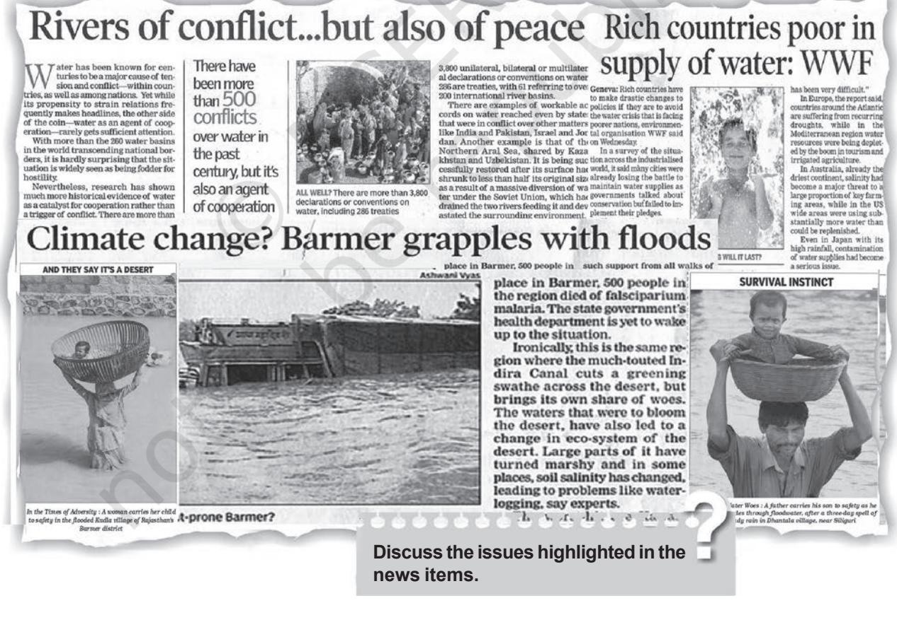

# Unit III Unit IIIUnit III Chapter 4

# **WATER RESOURCES**

Do you think that what exists today will continue to be so, or the future is going to be different in some respects? It can be said with some certainty that the societies will witness demographic transition, geographical shift of population, technological advancement, degradation of environment and water scarcity. Water scarcity is possibly to pose the greatest challenge on account of its increased demand coupled with shrinking supplies due to over utilisation and pollution. Water is a cyclic resource with abundant supplies on the globe. Approximately, 71 per cent of the earth's surface is covered with it but freshwater constitutes only about 3 per cent of the total water. In fact, a very small proportion of freshwater is effectively available for human use. The availability of freshwater varies over space and time. The tensions and disputes on sharing and control of this scarce resource are becoming contested issues among communities, regions, and states. The assessment, efficient use and conservation of water, therefore, become necessary to ensure development. In this chapter, we shall discuss water resources in India, its geographical distribution, sectoral utilisation, and methods of its conservation and management.

# **Water Resources of India**

India accounts for about 2.45 per cent of the world's surface area, 4 per cent of the world's water resources and more than 17 per cent of the world's population. The total water available from precipitation in the country in a year is about 4,000 cubic km. The availability from surface water and replenishable groundwater is 1,869 cubic km. Out of this, only 60 per cent can be put to beneficial uses. Thus, the total utilisable water resource in the country is only 1,122 cubic km.

### Surface Water Resources

There are four major sources of surface water. These are rivers, lakes, ponds and tanks. In the country, there are about 10,360 rivers and their tributaries longer than 1.6 km each. The mean annual flow in all the river basins in India is estimated to be 1,869 cubic km. However, due to topographical, hydrological and other constraints, only about 690 cubic km (32 per cent) of the available surface water can be utilised. Water flow in a river depends on size of its catchment area or river basin and rainfall within its catchment area. You have studied in your Class XI textbook *"India : Physical Environment"* that precipitation in India has very high spatial variation, and it is mainly concentrated in Monsoon season. You also have studied in the textbook that some of the rivers in the country like the Ganga, the Brahmaputra, and the Indus have huge catchment areas. Given that precipitation is relatively high in the catchment areas of the Ganga, the Brahmaputra and the Barak rivers, these rivers, although account for only about one-third of the total area in the country, have 60 per cent of the total surface water resources. Much of the annual water flow in south Indian rivers like the Godavari, the Krishna, and the Kaveri has been harnessed, but it is yet to be done in the Brahmaputra and the Ganga basins.

### Groundwater Resources

The total replenishable groundwater resources in the country are about 432 cubic km. The level of groundwater utilisation is relatively high in the river basins lying in north-western region and parts of south India.

The groundwater utilisation is very high in the states of Punjab, Haryana, Rajasthan, and Tamil Nadu. However, there are States like Chhattisgarh, Odisha, Kerala, etc., which utilise only a small proportion of their groundwater potentials. States like Gujarat, Uttar Pradesh, Bihar, Tripura and Maharashtra are utilising their groundwater resources at a moderate rate. If the present trend continues, the demands for water would need the supplies. And such situation, will be detrimental to development, and can cause social upheaval and disruptions.

### Lagoons and Backwaters

India has a vast coastline and the coast is very indented in some states. Due to this, a number of lagoons and lakes have formed. The States like Kerala, Odisha and West Bengal have vast surface water resources in these lagoons and lakes. Although, water is generally brackish in these water bodies, it is used for fishing and irrigating certain varieties of paddy crops, coconut, etc.

### Water Demand and Utilisation

India has traditionally been an agrarian economy, and about two-third of its population have been dependent on agriculture. Hence, development of irrigation to increase agricultural production has been assigned a very high priority in the Five Year Plans, and multipurpose river valleys projects, like the Bhakra-Nangal, Hirakud, Damodar Valley, Nagarjuna Sagar, Indira Gandhi Canal Project, etc., have been taken up. In fact, India's water demand at present is dominated by irrigational needs.

Agriculture accounts for most of the surface and groundwater utilisation, it accounts for 89 per cent of the surface water and 92 per cent of the groundwater utilisation. While the share of industrial sector is limited to 2 per cent of the surface water utilisation and 5 per cent of the ground-water, the share of domestic sector is higher (9 per cent) in surface water utilisation as compared to groundwater. The share of agricultural sector in total water utilisation is much higher than other sectors. However, in future, with development, the shares of industrial and domestic sectors in the country are likely to increase.

### Demand of Water for Irrigation

In agriculture, water is mainly used for irrigation. Irrigation is needed because of spatio-temporal variability in rainfall in the country. The large tracts of the country are deficient in rainfall and are drought prone. North-western India and Deccan plateau constitute such areas. Winter and summer seasons are more or less dry in most part of the country. Hence, it is difficult to practise agriculture without assured

*Water Resources* **43**

irrigation during dry seasons. Even in the areas of ample rainfall like West Bengal and Bihar, breaks in monsoon or its failure creates dry spells detrimental for agriculture. Water need of certain crops also makes irrigation necessary. For instance, water requirement of rice, sugarcane, jute, etc. is very high which can be met only through irrigation.

Provision of irrigation makes multiple cropping possible. It has also been found that irrigated lands have higher agricultural productivity than unirrigated land. Further, the high yielding varieties of crops need regular moisture supply, which is made possible only by a developed irrigation systems. In fact, this is why that green revolution strategy of agriculture development in the country has largely been successful in Punjab, Haryana and western Uttar Pradesh.

In Punjab, Haryana and western Uttar Pradesh, more than 85 per cent of their net sown area is under irrigation. Wheat and rice are grown mainly with the help of irrigation in these states. Of the total net irrigated area 76.1 per cent in Punjab and 51.3 per cent in Haryana are irrigated through wells and tubewells. This shows that these states utilise large proportion of their groundwater potential which has resulted in groundwater depletion in these states.

 The over-use of groundwater resources has led to decline in groundwater table in these states. In fact, over withdrawals in some states, like Rajasthan and Maharashtra, has increased fluoride concentration in groundwater, and this practice has led to increase in concentration of arsenic in parts of West Bengal and Bihar.

Intensive irrigation in Punjab, Haryana and western Uttar Pradesh is increasing salinity in the soil and depletion of groundwater irrigation. Discuss its likely impacts on agriculture.

### **Pradhan Mantri Krishi Sinchayee Yojana (PMKSY)**

Pradhan Mantri Krishi Sinchayee Yojana has been launched by the Central Government during 2015-16 with an overarching vision to ensure access to some means of protective irrigation for all agricultural farms in the country, thus bringing much desired rural prosperity. Some of the broad objectives of the this programmes are to:

- Enhance the physical access of water on the farm and expand cultivable area under assured irrigation (*Har khet ko pani*)
- Promote integration of water source, distribution and its efficient use, to make best use of water through appropriate technologies and practices.
- Improve on-farm water use efficiency to reduce wastage and increase availability both in duration and exent; irrigation and other water saving technologies (*Per drope more crop*)
- Introduce sustainable water conservation practices
- Ensure the integrated development of rain-fed areas using the waters held approach towards soil and water conservation, regeration of ground water, providing livelihood options, etc.

## **Emerging Water Problems**

The per capita availability of water is dwindling day-by-day due to increase in population. The available water resources are also getting polluted with industrial, agricultural and domestic effluents, and this, in turn, is further limiting the availability of usable water resources.

# **Deterioration of Water Quality**

Water quality refers to purity of water, or water without unwanted foreign substances. Water

**Fig. 4.2 : The Ganga and its Tributaries and Towns Located on them**

gets polluted by foreign matters, such as micro-organisms, chemicals, industrial and other wastes. Such matters deteriorate the quality of water and render it unfit for human use. When toxic substances enter lakes, streams, rivers, ocean and other water bodies, they get dissolved or lie suspended in water. This results in pollution of water, whereby quality of water deteriorates affecting aquatic systems. Sometimes, these pollutants also seep down and pollute groundwater.

Find out which are the major towns/cities located on the bank of the Ganga and its tributaries and major industries they have.

### **Water Conservation and Management**

Since there is a declining availability of freshwater and increasing demand, the need has arisen to conserve and effectively manage this precious life giving resource for sustainable development. Given that water availability from sea/ocean, due to high cost of desalinisation, is considered negligible, India has to take quick steps and make effective policies and laws, and adopt effective measures for its conservation. Besides developing water-saving technologies and methods, attempts are also to be made to prevent the pollution. There is need to encourage watershed development, rainwater harvesting, water recycling and reuse, and

conjunctive use of water for sustaining water supply in long run.

### **Prevention of Water Pollution**

Available water resources are degrading rapidly. The major rivers of the country generally retain better water quality in less densely populated upper stretches in hilly areas. In plains, river water is used intensively for irrigation, drinking, domestic and industrial purposes. The drains carrying agricultural (fertilizers and insecticides), domestic (solid and liquid wastes), and industrial effluents join the rivers. The concentration of pollutants in rivers, especially remains very high during the summer season when flow of water is low.

The Central Pollution Control Board (CPCB) in collaboration with State Pollution Control Boards has been monitoring water quality of national aquatic resources at 507 stations. The data obtained from these stations show that organic and bacterial contamination continues to be the main source of pollution in rivers. The Yamuna river is the most polluted river in the country between Delhi and Etawah. Other severely polluted rivers are: the Sabarmati at Ahmedabad, the Gomti at Lucknow, the Kali, the Adyar, the Cooum (entire stretches), the Vaigai at Madurai and the Musi of Hyderabad and the Ganga at Kanpur and Varanasi. Groundwater pollution has occurred due to high concentrations of heavy/toxic metals, fluoride and nitrates at different parts of the country.

The legislative provisions such as the Water (Prevention and Control of Pollution) Act 1974, and Environment Protection Act 1986 have not been implemented effectively. The result is that in 1997, 251 polluting industries were located along the rivers and lakes. The Water

**46 India : People and Economy** Cess Act, 1977, meant to reduce pollution has also made marginal impacts. There is a strong need to generate public awareness about importance of water and impacts of water pollution. The public awareness and action can be very effective in reducing the pollutants from agricultural activities, domestic and industrial discharges.

### Recycle and Reuse of Water

Another way through which we can improve fresh water availability is by recycle and reuse. Use of water of lesser quality such as reclaimed wastewater would be an attractive option for industries for cooling and fire fighting to reduce their water cost. Similarly, in urban areas water after bathing and washing utensils can be used for gardening. Water used for washing vehicle can also be used for gardening. This would conserve better quality of water for drinking purposes. Currently, recycling of water is practised on a limited scale. However, there is enormous scope for replenishing water through recycling.

Observe the quantity of water used at your home in various activities and enlist the ways in which the water can be reused and recycled in various activities.

Class teachers should organise a discussion on recycle and reuse of water.

# **Watershed Management**

Watershed management basically refers to efficient management and conservation of surface and groundwater resources. It involves prevention of runoff and storage and recharge of groundwater through various methods like percolation tanks, recharge wells, etc. However, in broad sense watershed management includes conservation, regeneration and judicious use of all resources – natural (like land, water, plants and animals) and human with in a watershed. Watershed management aims at bringing about balance between natural resources on the one hand and society on the other. The success of watershed development largely depends upon community participation.

The Central and State Governments have initiated many watershed development and management programmes in the country. Some of these are being implemented by nongovernmental organisations also. *Haryali Haryali* is a watershed development project sponsored by the Central Government which aims at enabling the rural population to conserve water for drinking, irrigation, fisheries and afforestation. The Project is being executed by Gram Panchayats with people's participation.

Atal Bhujal Yojana (Atal Jal) is being implemented in 8220 water stressed Gram Panchayats of 229 administrative blocks/ talukas in 80 districts of seven states,viz. Gujarat, Haryana, Karnataka, Madhya Pradesh, Maharashtra, Rajasthan, and Uttar Pradesh. The selected States account for about 37 per cent of the total number of water-stressed (over-exploited, critical and semi-critical) blocks in India. One of the key aspects of ATAL JAL is to bring in behavioural changes in the community, from the prevailing attitude of consumption to conservation and smart water management. (Source: *Annual Report, Ministry of Jal Shakti, Govt. of India, 2022-23*)

*Neeru-Meeru* (Water and You) programme (in Andhra Pradesh) and *Arvary Pani Sansad* (in Alwar, Rajasthan) have taken up constructions of various water-harvesting structures such as percolation tanks, dug out ponds (*Johad*), check dams, etc., through people's participation. Tamil Nadu has made water harvesting structures in the houses compulsory. No building can be constructed without making structures for water harvesting.

Watershed development projects in some areas have been successful in

# Watershed Development in Ralegan Siddhi, Ahmadnagar, Maharashtra: A Case Study

Ralegan Siddhi is a small village in the district of Ahmadnagar, Maharashtra. It has become an example for watershed development throughout the country.

In 1975, this village was caught in a web of poverty and illicit liquor trade. The transformation took place when a retired army personnel, settled down in the village and took up the task of watershed development. He convinced villagers about the importance of family planning and voluntary labour; preventing open grazing, felling trees, and liquor prohibition.

Voluntary labour was necessary to ensure minimum dependence on the government for financial aids. "It socialised the costs of the projects." explained the activist. Even those who were working outside the village contributed to the development by committing a month's salary every year.

Work began with the percolation tank constructed in the village. In 1975, the tank could not hold water. The embankment wall leaked. People voluntarily repaired the embankment. The seven wells below it swelled with water in summer for the first time in the living memory of the people. The people reposed their faith in him and his visions.

A youth group called Tarun Mandal was formed. The group worked to ban the dowry system, caste discrimination and untouchability. Liquor distilling units were removed and prohibition imposed. Open grazing was completely banned with a new emphasis on stall-feeding. The cultivation of water-intensive crops like sugarcane was banned. Crops such as pulses, oilseeds and certain cash crops with low water requirements were encouraged.

All elections to local bodies began to be held on the basis of consensus. "It made the community leaders complete representatives of the people." A system of Nyay Panchayats (informal courts) were also set up. Since then, no case has been referred to the police.

A Rs.22 lakh school building was constructed using only the resources of the village. No donations were taken. Money, if needed, was borrowed and paid back. The villagers took pride in this self-reliance. A new system of sharing labour grew out of this infusion of pride and

*Ralegan Siddhi before mitigation approach*

voluntary spirit. People volunteered to help each other in agricultural operation. Landless labourers also

*Ralegan Siddhi after mitigation approach*

gained employment. Today the village plans to buy land for them in adjoining villages.

At present, water is adequate; agriculture is flourishing, though the use of fertilisers and pesticides is very high. The prosperity also brings the question of ability of the present generation to carry on the work after the leader of the movement who declared that, "The process of Ralegan's evolution to an ideal village will not stop. With changing times, people tend to evolve new ways. In future, Ralegan might present a different model to the country."

**48** *India : People and Economy*

*What a mitigation approach can do? A success story.*

*Fig. 4.3 : Various Methods of Rainwater Harvesting*

rejuvenating environment and economy. However, there are only a few success stories. In majority of cases, the programme is still in its nascent stage. There is a need to generate awareness regarding benefits of watershed development and management among people in the country, and through this integrated water resource management approach water availability can be ensured on sustainable basis.

# **Rainwater Harvesting**

Rainwater harvesting is a method to capture and store rainwater for various uses. It is also used to recharge groundwater aquifers. It is a low cost and eco-friendly technique for preserving every drop of water by guiding the rain water to borewell, pits and wells. Rainwater harvesting increases water availability, checks the declining groundwater table, improves the quality of groundwater through dilution of contaminants, like fluoride and nitrates, prevents soil erosion, and flooding and arrests salt water intrusion in coastal areas if used to recharge aquifers.

Rainwater harvesting has been practised through various methods by different communities in the country for a long time. Traditional rainwater harvesting in rural areas is done by using surface storage bodies, like lakes, ponds, irrigation tanks, etc. In Rajasthan, rainwater harvesting structures locally known as *Kund* or *Tanka* (a covered underground tank) are constructed near or in the house or village to store harvested rainwater (see Fig. 4.3 to understand various ways of rainwater harvesting).

There is a wide scope to use rainwater harvesting technique to conserve precious water resource. It can be done by harvesting rainwater on rooftops and open spaces. Harvesting rainwater also decreases the community dependence on groundwater for domestic use. Besides bridging the demandsupply gap, it can also save energy to pump groundwater as recharge leads to rise in groundwater table. These days rainwater harvesting is being taken up on massive scale in many states in the country. Urban areas can specially benefit from rainwater harvesting as water demand has already outstripped supply in most of the cities and towns.

Apart from the above mentioned factors, the issue desalinisation of water particularly in coastal areas and brackish water in arid and semi-arid areas, transfer of water from water surplus areas to water deficit areas through inter-linking of rivers can be important remedies for solving water problem in India (read more about inter linking of rivers). However, the most important issue from the point of view of individual users, household and communities is pricing of water.

# Highlights of India's National Water Policy 2012

The objective of the National Water Policy, 2012 is to assess the existing situation and to propose a framework for a plan of action with a unified national perspective. In order to achieve the objective of the Policy, a number of recommendations have been made therein for conservation, development and improved management of water resources of the country.

Some of the salient features of national water policy 2012 are:

- Emphasis on the need for a national water framework law, comprehensive legislation for optimum development of inter-State rivers and river valleys.
- Water, after meeting the pre-emptive needs for safe drinking water and sanitation, achieving food security, supporting poor people dependent on agriculture for their livelihood and high priority allocation for minimum eco-system needs, be treated as economic good so as to promote its conservation and efficient use.
- Adaptation strategies in view of climate change for designing and management of water resources structures and review of acceptability criteria has been emphasized.
- A system to evolve benchmarks for water uses for different purposes, i.e., water footprints, and water auditing be developed to ensure efficient use of water.
- Removal of large disparity in stipulations for water supply in urban areas and in rural areas has been recommended.
- Water resources projects and services should be managed with community participation.

### *Source: Press Information Bureau, Govt. of India, Ministry of Water Resources.*

50 *India : People and Economy*

# Jal Kranti Abhiyan (2015-16)

Water is a recyclable resource but its availability is limited and the gap between supply and demand will be widening over time. Climate change at the global scale will be creating water stress conditions in many regions of the world. India has a unique situation of high population growth and rapid economic development with high water demand. The *Jal Kranti Abhiyan* launched by the Government of India in 2015–16 with an aim to ensure water security through per capita availability of water in the country. People in different regions of India had practised the traditional knowledge of water conservation and management to ensure water availability.

The *Jal Kranti Abhiyan* aims at involving local bodies, NGOs and cititzens, at large, in creating awareness regarding its objectives. The following activities have been proposed under the *Jal Kranti Abhiyan*:

- 1. Selection of one water stressed village in each 672 districts of the country to create a 'Jal Gram'.
- 2. Ídentification of model command area of about 1000 hectares in different parts of the country, for example, UP, Haryana (North), Karnataka, Telangana, Tamil Nadu (South), Rajasthan, Gujarat (West), Odisha (East), Meghalaya (North-East).
- 3. Abatement of pollution:
	- Water conservation and artificial recharge.
	- Reducing groundwater pollution.
	- Construction of Arsenic-free wells in selected areas of the country.
- 4. Creating mass awareness through social media, radio, TV, print media, poster and essay writing competitions in schools.

*Jal Kranti Abhiyan* is designed to provide livelihood and food security through water security.

# EXERCISES

- 1. Choose the right answers of the following from the given options.
	- (i) Which one of the following types describes water as a resource?
		- (a) Abiotic resource (c) Biotic Resource
			- (b) Non-renewable Resources (d) Non-cyclic Resource
	- (ii) Which one of the following south Indian states has the highest groundwater utilisation (in per cent) of its total ground water potential?
		- (a) Tamil Nadu (c) Andhra Pradesh
			-
		- (b) Karnataka (d) Kerala
- (iii The highest proportion of the total water used in the country is in which one of the following sectors?
	- (a) Irrigation (c) Domestic use
		-
	- (b) Industries (d) None of the above
- 
- 2. Answer the following questions in about 30 words.
	- (i) It is said that the water resources in India have been depleting very fast. Discuss the factors responsible for depletion of water resources?
	- (ii) What factors are responsible for the highest groundwater development in the states of Punjab, Haryana, and Tamil Nadu?
	- (iii) Why the share of agricultural sector in total water used in the country is expected to decline?
	- (iv) What can be possible impacts of consumption of contaminated/unclean water on the people?
- 3. Answer the following questions in about 150 words.
	- (i) Discuss the availability of water resources in the country and factors that determine its spatial distribution?
	- (ii) The depleting water resources may lead to social conflicts and disputes. Elaborate it with suitable examples?
	- (iii) What is watershed management? Do you think it can play an important role in sustainable development?

