# Unit III Unit IIIUnit III Chapter 5

# MINERAL AND ENERGY RESOURCES

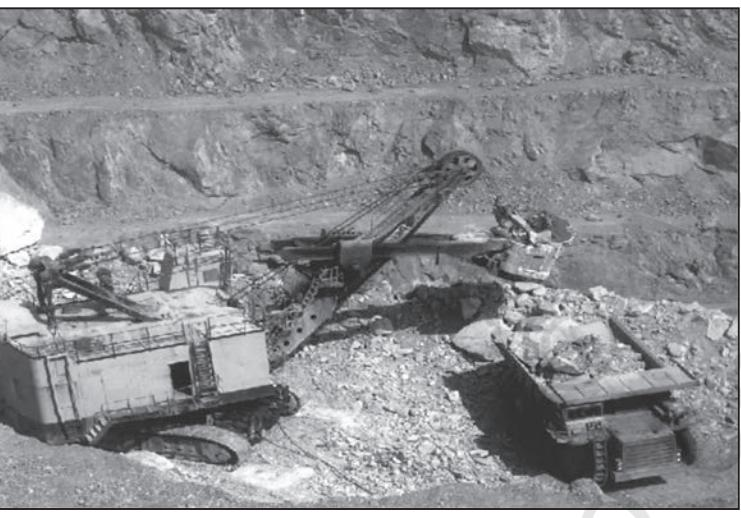

India is endowed with a rich variety of mineral resources due to its varied geological structure. Bulk of the valuable minerals are products of pre-palaezoic age (Refer: Chapter 2 of Class XI, Textbook: *"Fundamentals of Physical Geography"* and are mainly associated with metamorphic and igneous rocks of the peninsular India. The vast alluvial plain tract of north India is devoid of minerals of economic use. The mineral resources provide the country with the necessary base for industrial development. In this chapter, we shall discuss the availability of various types of mineral and energy resources in the country.

> A mineral is a natural substance of organic or inorganic origin with definite chemical and physical properties.

## **Types of ypes of Mineral Resources**

On the basis of chemical and physical properties, minerals may be grouped under two main categories of metallics and non-metallics which may further be classified as follows :

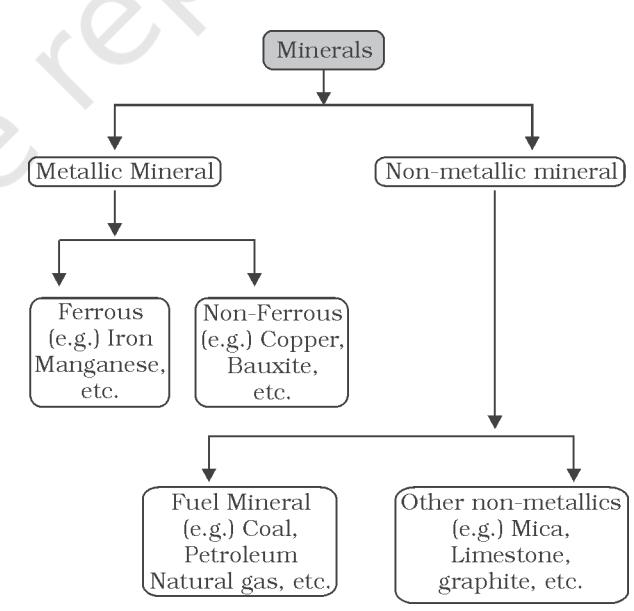

*Fig. 5.1 : Classification of Minerals*

As, it is clear from the Fig. 5.1 metallic minerals are the sources of metals. Iron ore, copper, gold produce metal and are included in this category. Metallic minerals are further divided into ferrous and non-ferrous metallic minerals. Ferrous, as you know, refers to iron. All those minerals which have iron content are ferrous such as iron ore itself and those which do not have iron content are non-ferrous such as copper, bauxite, etc.

Non-metallic minerals are either organic in origin such as fossil fuels also known as mineral fuels which are derived from the buried animal and plant life such as coal and petroleum. Other type of non-metallic minerals are inorganic in origin such as mica, limestone and graphite, etc.

Minerals have certain characteristics. These are unevenly distributed over space. There is inverse relationship in quality and quantity of minerals i.e. good quality minerals are less in quantity as compared to low quality minerals. The third main characteristic is that all minerals are exhaustible over time. These take long to develop geologically and they cannot be replenished immediately at the time of need. Thus, they have to be conserved and not misused as they do not have the second crop.

### **Distribution of Minerals in India**

Most of the metallic minerals in India occur in the peninsular plateau region in the old crystalline rocks. Over 97 per cent of coal reserves occur in the valleys of Damodar, Sone, Mahanadi and Godavari. Petroleum reserves are located in the sedimentary basins of Assam, Gujarat and Mumbai High i.e. off-shore region in the Arabian Sea. New reserves have been located in the Krishna-Godavari and Kaveri basins. Most of the major mineral resources occur to the east of a line linking Mangaluru and Kanpur.

Minerals are generally concentrated in three broad belts in India. There may be some sporadic occurrences here and there in isolated pockets. These belts are :

#### The North-Eastern Plateau Region

This belt covers Chhotanagpur (Jharkhand), Odisha Plateau, West Bengal and parts of Chhattisgarh. Have you ever thought about the reason of major iron and steel industry being located in this region? It has variety of minerals viz. iron ore coal, manganese, bauxite, mica.

**Find out the specific region where these minerals are being extracted.**

### The South-Western Plateau Region

This belt extends over Karnataka, Goa and contiguous Tamil Nadu uplands and Kerala. This belt is rich in ferrous metals and bauxite. It also contains high grade iron ore, manganese and limestone. This belt lacks in coal deposits except Neyveli lignite.

This belt does not have as diversified mineral deposits as the north-eastern belt. Kerala has deposits of monazite and thorium, bauxite clay. Goa has iron ore deposits.

#### The North-Western Region

This belt extends along Aravali in Rajasthan and part of Gujarat and minerals are associated with Dharwar system of rocks. Copper, zinc have been major minerals. Rajasthan is rich in building stones i.e. sandstone, granite, marble. Gypsum and Fuller's earth deposits are also extensive. Dolomite and limestone provide raw materials for cement industry. Gujarat is known for its petroleum deposits. You may be knowing that Gujarat and Rajasthan both have rich sources of salt.

**Why and where Dandi March was organised by Mahatma Gandhi?**

The Himalayan belt is another mineral belt where copper, lead, zinc, cobalt and tungsten are known to occur. They occur on both the eastern and western parts. Assam valley has

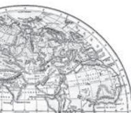

mineral oil deposits. Besides oil resources are also found in off-shore-areas near Mumbai Coast (Mumbai High).

In the following pages you will find the spatial pattern of some of the important minerals.

#### **Ferrous Mineral**

Ferrous minerals such as iron ore, manganese, chromite, etc., provide a strong base for the development of metallurgical industries. Our country is well-placed in respect of ferrous minerals both in reserves and production.

#### *Iron Ore*

India is endowed with fairly abundant resources of iron ore. It has the largest reserve of iron ore in Asia. The two main types of ore found in our country are *haematite* and *magnetite*. It has great demand in international market due to its superior quality. The iron ore mines occur in close proximity to the coal fields in the northeastern plateau region of the country which adds to their advantage.

About 95 per cent of total reserves of iron ore is located in the States of Odisha, Jharkhand, Chhattisgarh, Karnataka, Goa, Telangana, Andhra Pradesh and Tamil Nadu. In Odisha, iron ore occurs in a series of hill ranges in Sundergarh, Mayurbhanj and Jhar. The important mines are Gurumahisani, Sulaipet, Badampahar (Mayurbhaj), Kiruburu (Kendujhar) and Bonai (Sundergarh). Similar hill ranges, Jharkhand has some of the oldest iron ore mines and most of the iron and steel plants are located around them. Most of the important mines such as Noamundi and Gua are located in Poorbi and Pashchimi Singhbhum districts. This belt further extends to Durg, Dantewara and Bailadila. Dalli, and Rajhara in Durg are the important mines of iron ore in the country. In Karnataka, iron ore deposits occur in Sandur-Hospet area of Ballari district, Baba Budan hills and Kudremukh in Chikkamagaluru district and

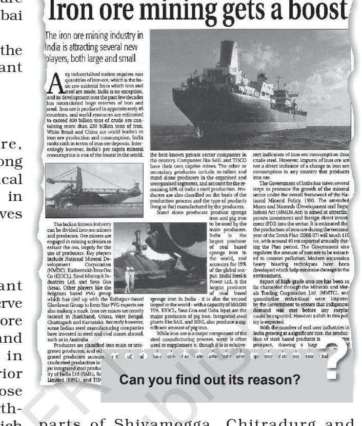

parts of Shivamogga, Chitradurg and Tumakuru districts. The districts of Chandrapur, Bhandara and Ratnagiri in Maharashtra, Karimnagar and Warangal district of Telangana, Kurnool, Cuddapah and Anantapur districts of Andhra Pradesh, Salem and Nilgiris districts of Tamil Nadu are other iron mining regions. Goa has also emerged as an important producer of iron ore.

#### *Manganese*

Manganese is an important raw material for smelting of iron ore and also used for manufacturing ferro alloys. Manganese deposits are found in almost all geological formations, however, it is mainly associated with Dharwar system.

Madhya Pradesh and Odisha are the leading producers of Manganese. Major mines in Odisha are located in the central part of the iron ore belt of India, particularly in Bonai, Kendujhar, Sundergarh, Gangpur, Koraput, Kalahandi and Bolangir.

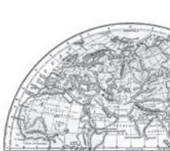

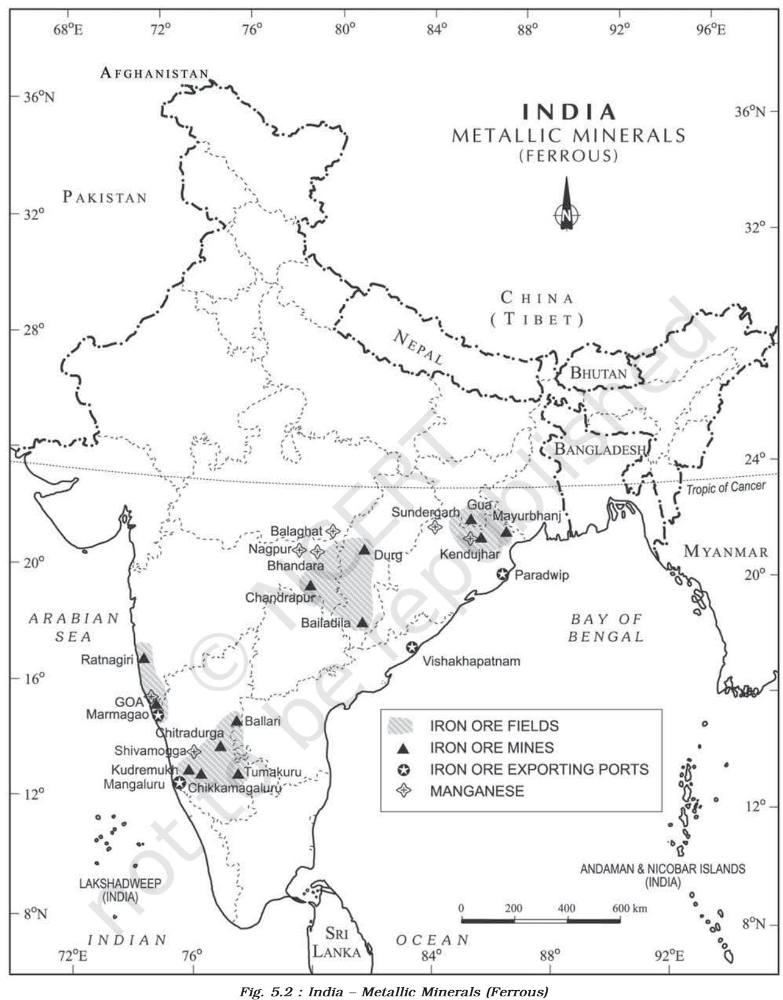

- 
- **56** *India : People and Economy*

The manganese belt of Madhya Pradesh extends in a belt in Balaghat-Chhindwara-Nimar-Mandla and Jhabua districts. Karnataka is another major producer and here the mines are located in Dharwar, Ballari, Belagavi, North Canara, Chikkmagaluru, Shivamogga, Chitradurg and Tumakuru. Maharashtra is also an important producer of manganese, which is mined in Nagpur, Bhandara and Ratnagiri districts. The disadvantage to these mines is that they are located far from steel plants.

Telangana, Goa, and Jharkhand are other minor producers of manganese.

#### **Non-Ferrous Minerals**

India is poorly endowed with non-ferrous metallic minerals except bauxite.

#### *Bauxite*

Bauxite is the ore, which is used in manufacturing of aluminium. Bauxite is found mainly in tertiary deposits and is associated with laterite rocks occurring extensively either on the plateau or hill ranges of peninsular India and also in the coastal tracts of the country.

Odisha happens to be the largest producer of Bauxite. Kalahandi and Sambalpur are the leading producers. The other two areas which have been increasing their production are Bolangir and Koraput. The patlands of Lohardaga in Jharkhand have rich deposits. Gujarat, Chhattisgarh, Madhya Pradesh and Maharashtra are other major producers. Bhavanagar, and Jamnagar in Gujarat have the major deposits. Chhattisgarh has bauxite deposits in Amarkantak plateau while Katni-Jabalpur area and Balaghat in M.P. have important deposits of bauxite. Kolaba, Thane, Ratnagiri, Satara, Pune and Kolhapur in Maharashtra are important producers. Tamil Nadu, Karnataka and Goa are minor producers of bauxite.

#### *Copper*

Copper is an indispensable metal in the electrical industry for making wires, electric motors, transformers and generators. It is alloyable, malleable and ductile. It is also mixed with gold to provide strength to jewellery.

The Copper deposits mainly occur in Singhbhum district in Jharkhand, Balaghat district in Madhya Pradesh and Jhunjhunu and Alwar districts in Rajasthan.

Minor producers of Copper are Agnigundala in Guntur District (Andhra Pradesh), Chitradurg and Hasan districts (Karnataka) and South Arcot district (Tamil Nadu).

#### **Non-metallic Minerals**

Among the non-metallic minerals produced in India, mica is the important one. The other minerals extracted for local consumption are limestone, dolomite and phosphate.

#### *Mica*

Mica is mainly used in the electrical and electronic industries. It can be split into very thin sheets which are tough and flexible. Mica in India is produced in Jharkhand, Andhra Pradesh, Telanganga and Rajasthan followed by Tamil Nadu, West Bengal and Madhya Pradesh. In Jharkhand, high quality mica is obtained in a belt extending over a distance of about 150 km, in length and about 22 km, in width in lower Hazaribagh plateau. In Andhra Pradesh, Nellore district produces the best quality mica. In Rajasthan, mica belt extends for about 320 kms from Jaipur to Bhilwara and around Udaipur. Mica deposits also occur in Mysuru and Hasan districts of Karanataka, Coimbatore, Tiruchirapalli, Madurai and Kanniyakumari in Tamil Nadu, Alleppey in Kerala, Ratnagiri in Maharashtra, Purulia and Bankura in West Bengal.

#### **Energy Resources**

Mineral fuels are essential for generation of power, required by agriculture, industry, transport and other sectors of the economy. Mineral fuels like coal, petroleum and natural gas (known as fossil fuels), nuclear energy minerals, are the conventional sources of energy. These conventional sources are exhaustible resources.

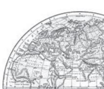

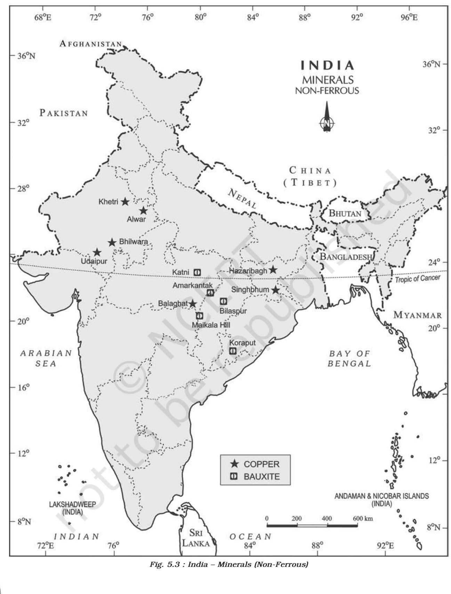

**58** *India : People and Economy*

#### *Coal*

Coal is a one of the important minerals which is mainly used in the generation of thermal power and smelting of iron ore. Coal occurs in rock sequences mainly of two geological ages, namely Gondwana and tertiary deposits.

About 80 per cent of the coal deposits in India is of bituminous type and is of non-coking grade. The most important Gondwana coal fields of India are located in Damodar Valley. They lie in Jharkhand-Bengal coal belt and the important coal fields in this region are Raniganj, Jharia, Bokaro, Giridih, Karanpura.

Jharia is the largest coal field followed by Raniganj. The other river valleys associated with coal are Godavari, Mahanadi and Sone. The most important coal mining centres are Singrauli in Madhya Pradesh (part of Singrauli coal field lies in Uttar Pradesh), Korba in Chhattisgarh, Talcher and Rampur in Odisha, Chanda–Wardha, Kamptee and Bander in Maharashtra and Singareni in Telangana and Pandur in Andhra Pradesh.

Tertiary coals occur in Assam, Arunachal Pradesh, Meghalaya and Nagaland. It is extracted from Darangiri, Cherrapunji, Mewlong and Langrin (Meghalaya); Makum, Jaipur and Nazira in upper Assam, Namchik – Namphuk (Arunachal Pradesh) and Kalakot (Jammu and Kashmir).

Besides, the brown coal or lignite occur in the coastal areas of Tamil Nadu, Puducherry, Gujarat and Jammu and Kashmir.

#### *Petroleum*

Crude petroleum consists of hydrocarbons of liquid and gaseous states varying in chemical composition, colour and specific gravity. It is an essential source of energy for all internal combustion engines in automobiles, railways and aircraft. Its numerous by-products are processed in petrochemical industries, such as fertiliser, synthetic rubber, synthetic fibre, medicines, vaseline, lubricants, wax, soap and cosmetics.

Petroleum is referred to as liquid gold because of its scarcity and diversified uses.

Crude petroleum occurs in sedimentary rocks of the tertiary period. Oil exploration and production was systematically taken up after the Oil and Natural Gas Commission was set up in 1956. Till then, Digboi in Assam was the only oil producing region but the scenario changed after 1956. In recent years, new oil deposits have been found at the extreme western and eastern parts of the country. In Assam, Digboi, Naharkatiya and Moran are important oil producing areas. The major oilfields of Gujarat are Ankaleshwar, Kalol, Mehsana, Nawagam, Kosamba and Lunej. Mumbai High which lies 160 km off Mumbai was discovered in 1973 and production commenced in 1976. Oil and natural gas have been found in exploratory wells in Krishna-Godavari and Kaveri basin on the east coast.

Oil extracted from the wells is crude oil and contains many impurities. It cannot be used directly. It needs to be refined. There are two types of refineries in India: (a) field-based and (b) market-based. Digboi is an example of fieldbased and Barauni is an example of marketbased refinery.

#### *Natural Gas*

Natural Gas is found with petroleum deposits and is released when crude oil is brought to

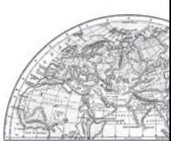

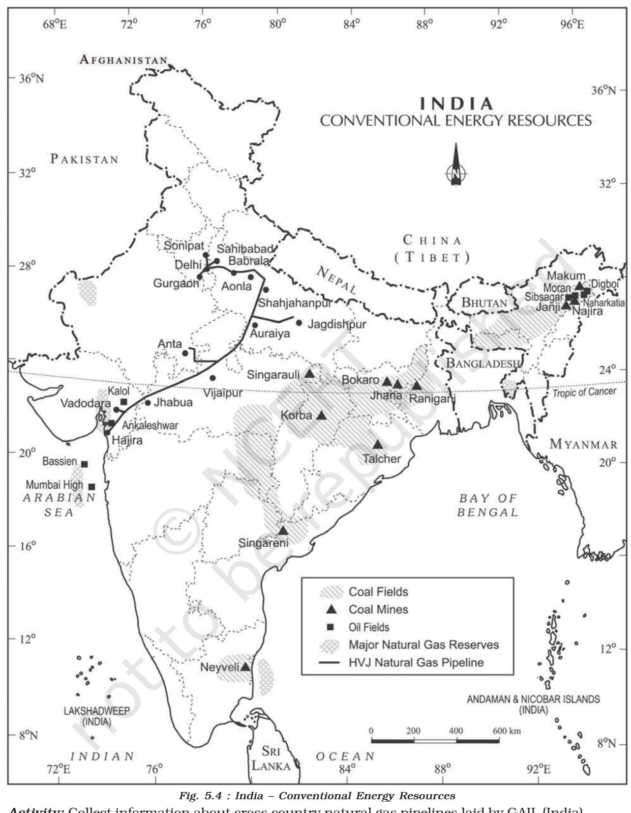

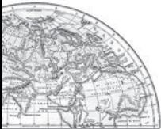

**Activity:** Collect information about cross country natural gas pipelines laid by GAIL (India) under 'One Nation One Grid'.

**60 India : People and Economy** the surface. It can be used as a domestic and industrial fuel. It is used as fuel in power sector to generate electricity, for heating purpose in industries, as raw material in chemical, petrochemical and fertiliser industries. With the expansion of gas infrastructure and local city gas distribution (COD) networks, natural gas is also emerging as a preferred transport fuel (CNG) and cooking fuel (PNG) at homes. India's major gas reserves are found in the Mumbai High and allied fields along the west coast which are supplemented by finds in the Cambay basin. Along the East Coast, new reserves of natural gas have been discovered in the Krishna-Godavari basin.

#### Non-Conventional Energy Sources

Fossil fuel sources, such as coal, petroleum, natural gas and nuclear energy use exhaustible raw materials. Sustainable energy resources are only the renewable energy sources like solar, wind, hydrogeothermal and biomass. These energy sources are more equitably distributed and environment-friendly. The non-conventional energy sources will provide more sustained, eco-friendly cheaper energy after the initial cost is taken care of.

#### *Nuclear Energy Resources*

Nuclear energy has emerged as a viable source in recent times. Important minerals used for the generation of nuclear energy are uranium and thorium. Uranium deposits occur in the Dharwar rocks. Geographically, uranium ores are known to occur in several locations along the Singbhum Copper belt. It is also found in Udaipur, Alwar and Jhunjhunu districts of Rajasthan, Durg district of Chhattisgarh, Bhandara district of Maharashtra and Kullu district of Himachal Pradesh. Thorium is mainly obtained from monazite and ilmenite in the beach sands along the coast of Kerala and Tamil Nadu. World's richest monazite deposits occur in Palakkad and Kollam districts of Kerala, near Vishakhapatnam in Andhra Pradesh and Mahanadi river delta in Odisha.

Atomic Energy Commission was established in 1948, progress could be made only after the establishment of the Atomic Energy Institute at Trombay in 1954 which was renamed as the Bhabha Atomic Research Centre in 1967. The important nuclear power projects are Tarapur (Maharashtra), Rawatbhata near Kota (Rajasthan), Kalpakkam (Tamil Nadu), Narora (Uttar Pradesh), Kaiga (Karnataka) and Kakarapara (Gujarat).

#### *Solar Energy*

Sun rays tapped in photovoltaic cells can be converted into energy, known as solar energy. The two effective processes considered to be very effective to tap solar energy are photovoltaics and solar thermal technology. Solar thermal technology has some relative advantages over all other non-renewable energy sources. It is cost competitive, environment friendly and easy to construct. Solar energy is 7 per cent more effective than coal or oil based plants and 10 per cent more effective than nuclear plants. It is generally used more in appliances like heaters, crop dryers, cookers, etc. The western part of India has greater potential for the development of solar energy in Gujarat and Rajasthan.

#### *Wind Energy*

Wind energy is absolutely pollution free, inexhaustible source of energy. The mechanism of energy conversion from blowing wind is simple. The kinetic energy of wind, through turbines is converted into electrical energy. The

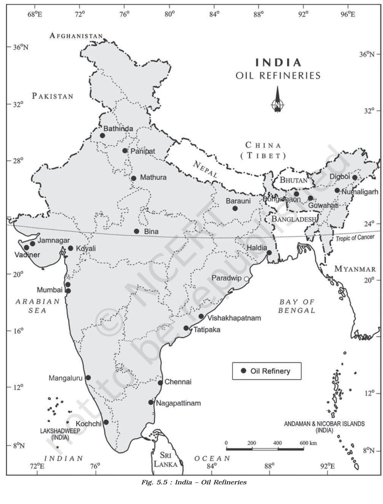

**62** *India : People and Economy*

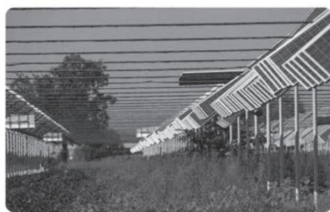

permanent wind systems such the trade winds, westerlies and seasonal wind like monsoon have been used as source of energy. Besides these, local winds, land and sea breezes can also be used to produce electricity.

India, already has started generating wind energy. In Rajasthan, Gujarat, Maharashtra and Karnataka, favourable conditions for wind energy exist.

#### Tidal and Wave Energy

Ocean currents are the store-house of infinite energy. Since the beginning of seventeenth and eighteenth century, persistent efforts were made to create a more efficient energy system from the ceaseless tidal waves and ocean current.

Large tidal waves are known to occur along the west coast of India. Hence, India has great potential for the development of tidal

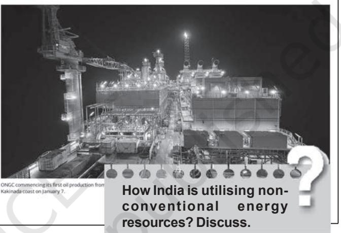

energy along the coasts but so far these have not yet been utilised.

#### Geothermal Energy

When the magma from the interior of earth, comes out on the surface, tremendous heat is released. This heat energy can successfully be tapped and converted to electrical energy. Apart from this, the hot water that gushes out through the geyser wells is also used in the generation of thermal energy. It is popularly known as Geothermal energy. This energy is now considered to be one of the key energy sources which can be developed as an alternate source. The hot springs and geysers are being used since medieval period. In India, a geothermal energy plant has been commissioned at Manikaran in Himachal Pradesh.

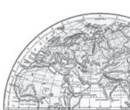

63

The first successful (1890) attempt to tap the underground heat was made in the city of Boise, Idaho (U.S.A.), where a hot water pipe network was built to give heat to the surrounding buildings. This plant is still working.

### *Bio-energy*

Bio-energy refers to energy derived from biological products which includes agricultural residues, municipal, industrial and other wastes. Bioenergy is a potential source of energy conversion. It can be converted into electrical energy, heat energy or gas for cooking. It will also process the waste and garbage and produce energy. This will improve economic life of rural areas in developing countries, reduce environmental pollution, enhance self-reliance and reduce pressure on fuel wood. One such project converting municipal waste into energy is Okhla in Delhi.

### **Conservation of Mineral Resources**

The challenge of sustainable development requires integration of quest for economic development with environmental concerns. Traditional methods of resource use result into generating enormous quantity of waste as well as create other environmental problems. Hence, for sustainable development calls for the protection of resources for the future generations. There is an urgent need to conserve the resources. The alternative energy sources like solar power, wind, wave, geothermal energy are inexhaustible resource. These should be developed to replace the exhaustible resources. In case of metallic minerals, use of scrap metals will enable recycling of metals. Use of scrap is specially significant in metals like copper, lead and zinc in which India's reserves are meagre. Use of substitutes for scarce metals may also reduce their consumption. Export of strategic and scarce minerals must be reduced, so that the existing reserve may be used for a longer period.

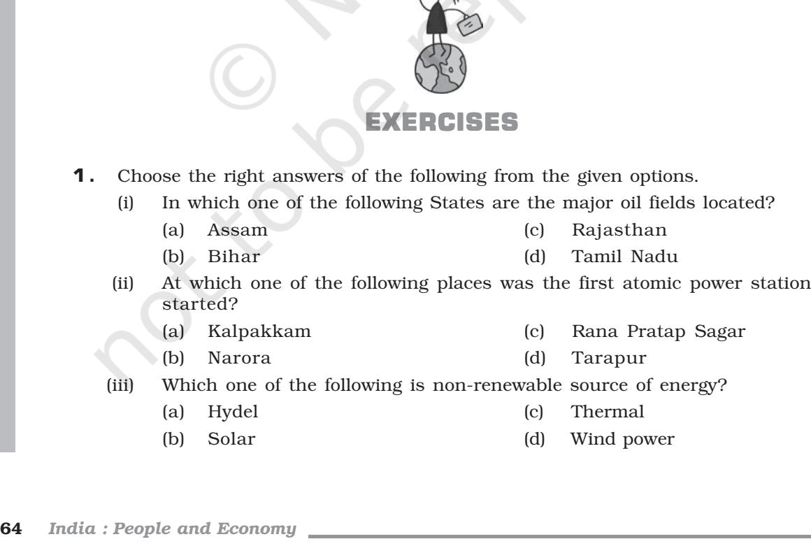

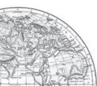

- **2 .** Answer the following questions in about 30 words.
	- (i) Give an account of the distribution of mica in India.
	- (ii) What is nuclear power? Mention the important nuclear power stations in India.
	- (iii) Name non-ferrous metal. Discuss their spatial distribution.
	- (vi) What are non-conventional sources of energy?
- **3.** Answer the following questions in about 150 words.
	- (i) Write a detailed note on the Petroleum resources of India.
	- (ii) Write an essay on hydel power in India.

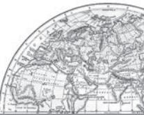

