# **PLANNING AND SUSTAINABLE DEVELOPMENT IN INDIAN CONTEXT**

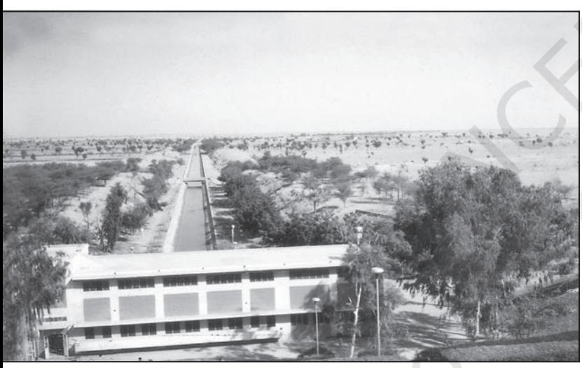

The word 'planning' is not new to you as it is a part of everyday usage. You must have used it with reference to preparation for your examination or visit to a hill station. It involves the process of thinking, formulation of a scheme or programme and implementation of a set of actions to achieve some goal. Though it is a very broad term, in this chapter, it has been used with reference to the process of economic development. It is, thus different from the traditional hit-and-miss methods by

> On 1 January 2015, the NITI Aayog was formed. India adopted centralised planning after Independence, but subsequently, it graduated into decentralised multi-level planning. The responsibility of plan formulation was with the Planning Comminssion at the Centre, State and district levels. But on 1 January 2015, the Planning Commision was replaced by the NITI Aayog.

> NITI Aayog has been set up with the objective of involving the states in economic policy making for India for providing strategic and technical advice to the Central and State governments.

which reforms and reconstruction are often undertaken. Generally, there are two approaches to planning, i.e., sectoral planning and regional planning. Sectoral planning means formulation and implementation of the sets of schemes or programmes aimed at development of various sectors of the economy, such as agriculture, irrigation, manufacturing, power, construction, transport, communication, social infrastructure and services.

There is no uniform economic development over space in any country. Some areas are more developed and some lag behind. This uneven pattern of development over space necessitates that the planners have a spatial perspective and draw the plans to reduce regional imbalance in development. This type of planning is termed as regional planning.

# Target Area Planning

The planning process has to take special care of those areas which have remained economically backward. As you know, the economic development of a region depends upon its resource base. But sometimes resource-rich region also remain backward. Economic development requires technology, as well as, investment besides resources. With the planning experience of about one-and-a-half decades, it was realised that regional imbalances in economic development were getting accentuated. In order to arrest the accentuation of regional and social disparties, the Planning Commission introduced the '*target area'* and *target group* approaches to planning. Some of the examples of programmes directed towards the development of target areas are *Command Area Development Programme, Drought Prone Area Development Programme, Desert Development Programme, Hill Area Development Programme. The Small Farmers Development Agency (SFDA) and Marginal Farmers Development Agency (MFDA)* which are the examples of target group programme.

In the 8th Five Year Plan special area programmes were designed to develop infrastructure in hill areas, north-eastern states, tribal areas and backward areas.

## Hill Area Development Programme

Hill Area Development Programmes were initiated during the Fifth Five Year Plan covering 15 districts comprising all the hilly districts of Uttar Pradesh (present Uttarakhand), Mikir Hill and North Cachar hills of Assam, Darjeeling district of West Bengal and Nilgiri district of Tamil Nadu. The National Committee on the Development of Backward Area in 1981 recommended that all the hill areas in the country having height above 600 m and not covered under tribal sub-plan be treated as backward hill areas.

The detailed plans for the development of hill areas were drawn keeping in view their topographical, ecological, social and economic conditions. These programmes aimed at harnessing the indigenous resources of the hill areas through development of horticulture, plantation, agriculture, animal husbandry, poultry, forestry and small-scale and village industry.

## Drought Prone Area Programme

This programme was initiated during the Fourth Five Year Plan with the objectives of providing employment to the people in drought-prone areas and creating productive assets. Initially, this programme laid emphasis on the construction of labour-intensive civil works. But later on, it emphasised on irrigation projects, land development programmes, afforestation, grassland development and creation of basic rural infrastructure, such as electricity, roads, market, credit and services.

The National Committee on Development of Backward Areas reviewed the performance of this programme. It has been observed that this programme is largely confined to the development of agriculture and allied sectors with major focus on restoration of ecological balance. Since growing population pressure is forcing the society to utilise the marginal lands for agriculture, and, thereby causing ecological degradation, there is a need to create alternative employment opportunities in the droughtprone areas. The other strategies of development of these areas include adoption of integrated watershed development approach at the micro-level. The restoration of ecological balance between water, soil, plants, and human and animal population should be a basic consideration in the strategy of development of drought-prone areas.

The Planning Commission of India (1967) identified 67 districts (entire or partly) of the country prone to drought. The *Irrigation Commission* (1972) introduced the criterion of 30 per cent irrigated area and demarcated the drought-prone areas. Broadly, the droughtprone area in India spread over semi-arid and arid tract of Rajasthan, Gujarat, Western Madhya Pradesh, Marathwada region of Maharashtra, Rayalseema and Telangana plateaus of Andhra Pradesh, Karnataka plateau and highlands and interior parts of Tamil Nadu. The drought-prone areas of Punjab, Haryana and north-Rajasthan are largely protected due to spread of irrigation in these regions.

*Planning and Sustainable Development in Indian Context* 67

## Case Study – Integrated Tribal Development Project in Bharmaur* Region

Bharmaur tribal area comprises Bharmaur and Holi tehsils of Chamba district of Himachal Pradesh. It is a notified tribal area since 21 November 1975. Bharmaur is inhabited by '*Gaddi*', a tribal community who have maintained a distinct identity in the Himalayan region as they practised transhumance and conversed through *Gaddiali* dialect.

Bharmaur tribal region has harsh climate conditions, low resource base and fragile environment. These factors have influenced the society and Economy of the region. According to the 2011 census, the total population of Bharmaur sub-division was 39,113 i.e., 21 persons per sq km. It is one of the most (economically and socially) backward areas of Himachal Pradesh. Historically, the *Gaddis* have experienced geographical and political isolation and socio-economic deprivation. The economy is largely based on agriculture and allied activities such as sheep and goat rearing.

The process of development of tribal area of Bharmaur started in 1970s when *Gaddis* were included among '*scheduled tribes*'. Under This region lies between 32° 11' N and 32°41' N latitudes and 76° 22' E and 76° 53'E longitudes. Spread over an area of about 1,818 sq km, the region mostly lies between 1,500 m to 3,700 m above the mean sea level. This region popularly known as the homeland of *Gaddis* is surrounded by lofty mountains on all sides. It has *Pir Panjal* in the north and *Dhaula Dhar* in the south. In the east, the extension of *Dhaula Dhar* converges with Pir Panjal near *Rohtang Pass*. The river *Ravi* and its tributaries– the *Budhil* and the *Tundahen,* drain this territory, and carve out deep gorges. These rivers divide the region into four physiographic divisions called *Holi*, *Khani*, *Kugti* and *Tundah* areas. Bharmaur experiences freezing weather conditions and snowfall in winter. Its mean monthly temperature in January remains 4°C and in July 26°C.

the Fifth Five Year Plan, the tribal sub-plan was introduced in 1974 and Bharmaur was designated as one of the five Integrated Tribal Development Projects (ITDP) in Himachal Pradesh. This area development plan was aimed at improving the quality of life of the *Gaddis*

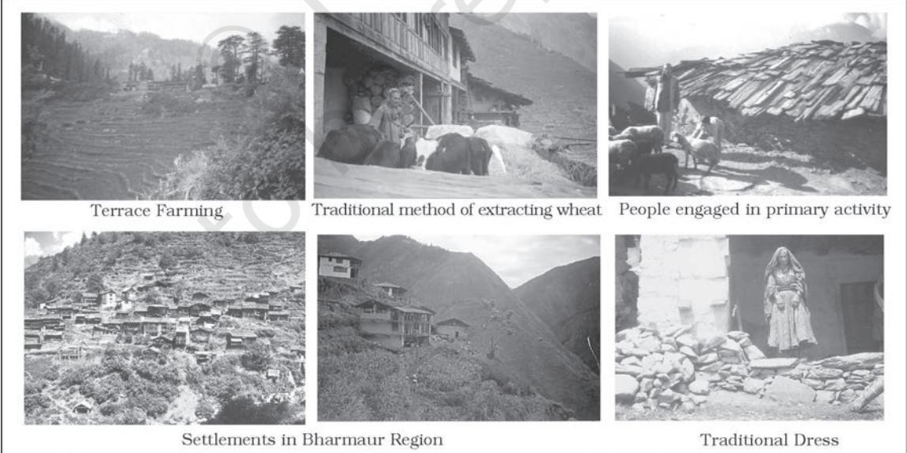

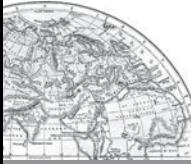

- * The name Bharmaur is derived from Sanskrit word Brahmaur. In this book Bharmaur has been used to retain the colloquial flavour.
- 68 *India : People and Economy*

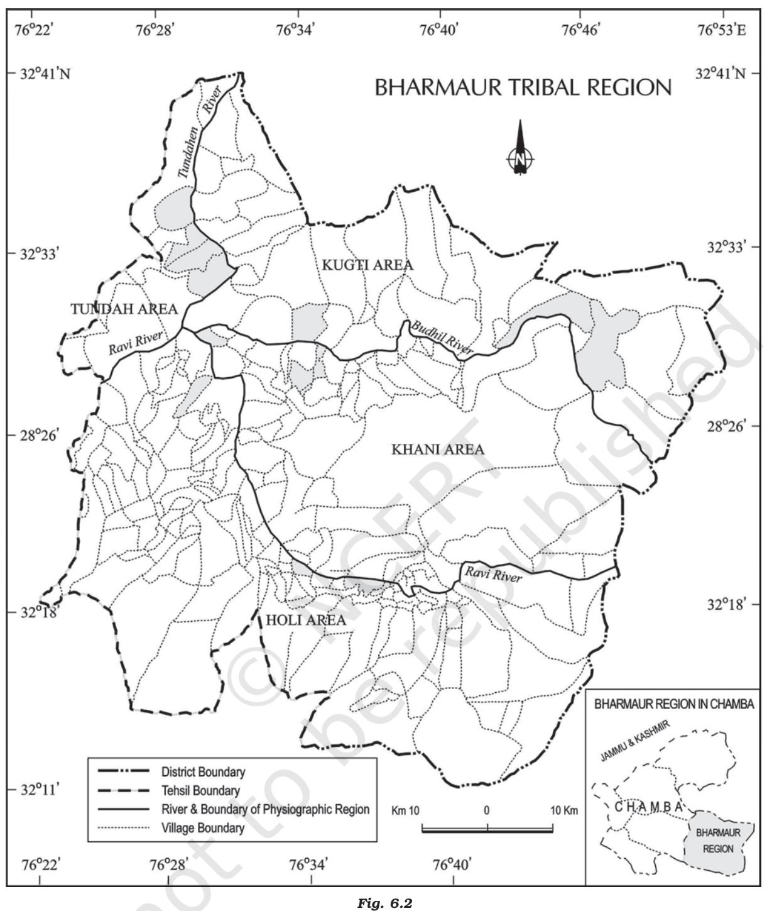

and narrowing the gap in the level of development between Bharmaur and other areas of Himachal Pradesh. This plan laid the highest priority on development of transport and communications, agriculture and allied activities, and social and community services.

The most significant contribution of tribal sub-plan in Bharmaur region is the development of infrastructure in terms of schools, healthcare facilities, potable water, roads, communications and electricity. But the villages located along the river Ravi in Holi and Khani areas are the main

*Planning and Sustainable Development in Indian Context* 69

beneficiaries of infrastructural development. The remote villages in Tundah and Kugti areas still do not have sufficient infrastructure.

The social benefits derived from ITDP include tremendous increase in literacy rate, improvement in sex ratio and decline in child marriage. The female literacy rate in the region increased from 1.88 per cent in 1971 to 65 per cent in 2011. The difference between males and females in literacy level i.e. gender inequality, has also declined. Traditionally, the *Gaddis* had subsistence agricultural-cum-pastoral economy having emphasis on foodgrains and livestock production. But during the last three decades of twentieth century, the cultivation of pulses and other cash crops has increased in Bharmaur region. But the crop cultivation is still done with traditional technology. The declining importance of pastoralism in the economy of the region can be gauged from the fact that at present only about one-tenth of the total households practise transhumance. But the *Gaddis* are still very mobile as a sizeable section of them migrate to Kangra and surrounding areas during winter to earn their livings from wage labour.

# **Sustainable Development**

The term development is generally used to describe the state of particular societies and the process of changes experienced by them. During a fairly large period of human history, the state of the societies has largely been determined by the interaction processes between human societies and their bio-physical environment. The processes of humanenvironment interaction depend upon the level of technology and institutions nurtured by a society. While the technology and institutions have helped in increasing the pace of humanenvironment interaction, the momentum thus, generated in return has accelerated technological progress and transformation and creation of institutions. Hence, development is a multi-dimensional concept and signifies the positive, irreversible transformation of the economy, society and environment.

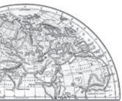

The concept of development is dynamic and has evolved during the second half of twentieth century. In the post World War II era, the concept of development was synonymous to economic growth which is measured in terms of temporal increase in gross national product (GNP) and per capita income/per capita consumption. But, even the countries having high economic growth, experienced speedy rise in poverty because of its unequal distribution. So, in 1970s, the phrases such as *redistribution with growth* and *growth and equity* were incorporated in the definition of development. While dealing with the questions related to redistribution and equity, it was realised that the concept of development cannot be restricted to the economic sphere alone. It also includes the issues such as improving the well-being and living standard of people, availing of the health, education and equality of opportunity and ensuring political and civil rights. By 1980s, development emerged as a concept encapsulating wide-spread improvement in social as well as material wellbeing of all in a society.

The notion of sustainable development emerged in the wake of general rise in the awareness of environmental issues in the late 1960s in Western World. It reflected the concern of people about undesirable effects of industrial development on the environment. The publication of '*The Population Bomb*' by *Ehrlich* in 1968 and '*The Limits to Growth*' by *Meadows* and others in 1972 further raised the level of fear among environmentalists in particular and people in general. This sets the scenario for the emergence of new models of development under a broad phrase '*sustainable development.*'

Concerned with the growing opinion of world community on the environmental issues, the United Nations established a *World Commission on Environment and Development* (WCED) headed by the Norwegian Prime Minister Gro Harlem Brundtland. The Commission gave its report (also known as *Brundtland Report*) entitled '*Our Common Future*' in 1987. The report defines sustainable development as a "*development that meets the needs of the present without compromising the ability of future generations to meet their own needs.*"

Sustainable development takes care of ecological, social and economic aspects of development during the present times and pleads

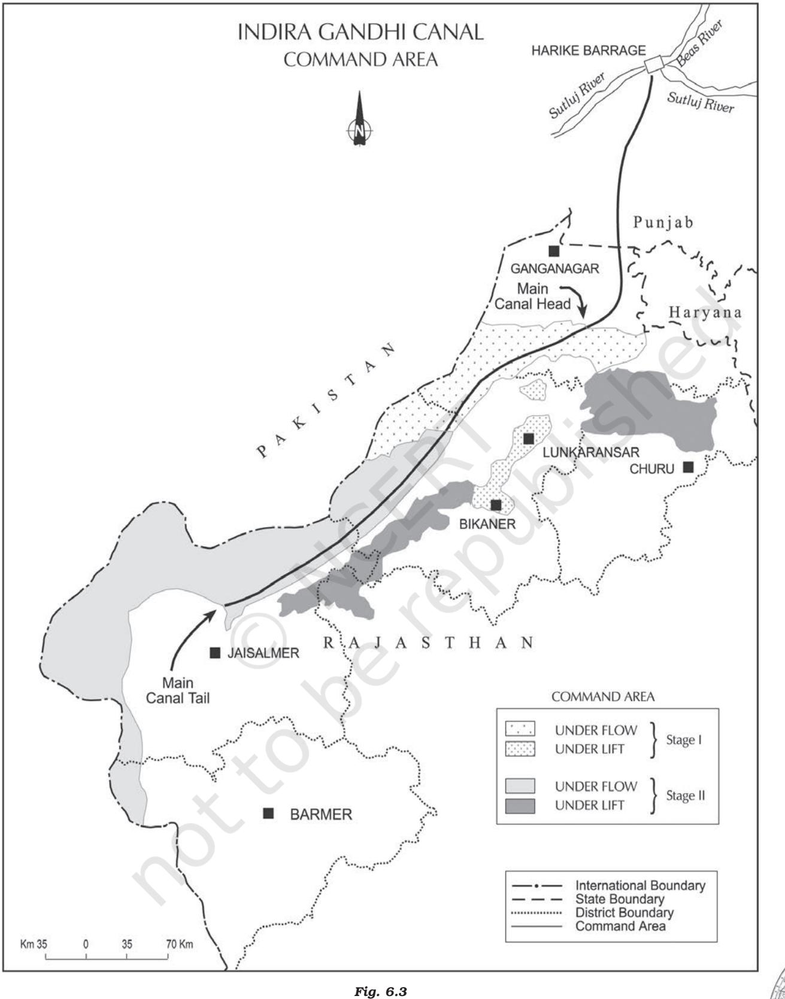

*Planning and Sustainable Development in Indian Context* 71

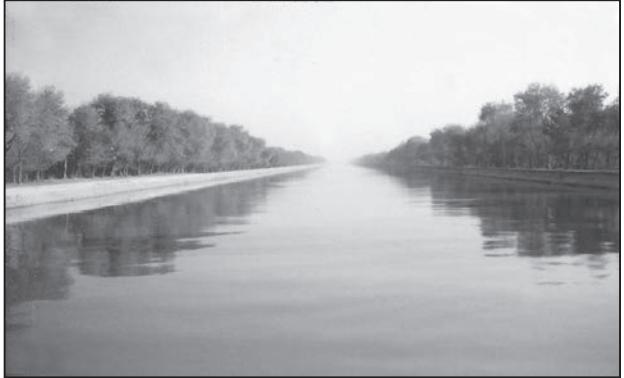

for conservation of resources to enable the future generations to use these resources. It takes into account the development of whole human kind which have common future.

### Case Study

### Indira Gandhi Canal (Nahar) Command Area

Indira Gandhi Canal, previously known as the Rajasthan Canal, is one of the largest canal systems in India. Conceived by Kanwar Sain in 1948, the canal project was launched on 31 March, 1958. The canal originates at Harike barrage in Punjab and runs parallel to Pakistan border at an average distance of 40 km in Thar Desert (Marusthali) of Rajasthan. The total planned length of the system is 9,060 km catering to the irrigation needs of a total culturable command area of 19.63 lakh hectares. Out of the total command area, about 70 per cent was envisaged to be irrigated by flow system and the rest by lift system. The construction work of the canal system has been carried out through two stages. The command area of Stage-I lies in Ganganagar, Hanumangarh and northern part of Bikaner districts. It has a gently undulating topography and its culturable command area is 5.53 lakh hectares. The command area of Stage-II is spread over Bikaner, Jaisalmer, Barmer, Jodhpur, Nagaur and Churu districts covering culturable command area of 14.10 lakh ha. It comprises desert land dotted with shifting sand dunes and temperature soaring to 50ºC in summers. In the lift canal, the water is lifted up to make it to flow

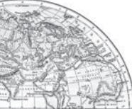

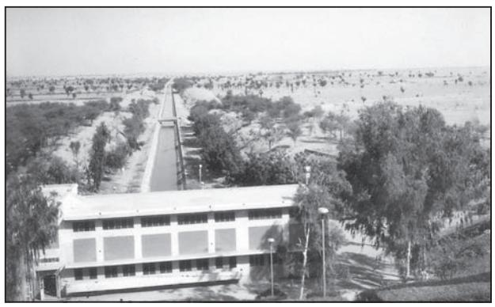

*Fig. 6.4: Indira Gandhi Canal Fig. 6.5 : Indira Gandhi Canal and its adjoining areas*

against the slope of the land. All the lift canals of Indira Gandhi Canal system originate at the left bank of main canal while all the canals on the right bank of main canal are flow channels.

Irrigation in Stage-I command area of the canal was introduced in early 1960s, whereas, the command area of Stage-II began receiving irrigation in mid-1980s. The introduction of canal irrigation in this dry land has transformed its ecology, economy and society. It has influenced the environmental conditions of the region both positively as well as negatively. The availability of soil moisture for a longer period of time and various afforestation and pasture development programmes under CAD have resulted in greening the land. This has also helped in reducing wind erosion and siltation of canal systems. But the intensive irrigation and excessive use of water has led to the emergence of twin environmental problems of waterlogging and soil salinity.

Introduction of canal irrigation has brought about a perceptible transformation in the agricultural economy of the region. Soil moisture has been a limiting factor in successful growing of crops in this area. Spread of canal irrigation has led to increase in cultivated area and intensity of cropping. The traditional crops sown in the area, gram, bajra and jowar have been replaced by wheat, cotton, groundnut and rice. This is the result of intensive irrigation. This intensive irrigation, no doubt, initially has led to tremendous increase in agricultural and livestock productivity. This has also caused waterlogging

and soil salinity, and thus, in the long run, it hampers the sustainability of agriculture.

## Measures for Promotion of Sustainable Development

The ecological sustainability of Indira Gandhi Canal Project has been questioned by various scholars. Their point of view has also largely been validated by the course of development this region has taken during the last four decades, which has resulted in degradation of physical environment. It is a hard fact that attaining sustainable development in the command area requires major thrust upon the measures to achieve ecological sustainability. Hence, five of the seven measures proposed to promote sustainable development in the command area are meant to restore ecological balance.

- (i) The first requirement is strict implementation of water management policy. The canal project envisages protective irrigation in Stage-I and extensive irrigation of crops and pasture development in Stage-II.
- (ii) In general, the cropping pattern shall not include water intensive crops. It shall be adhered to and people shall be encouraged to grow plantation crops such as citrus fruits.
- (iii) The CAD programmes such as lining of water courses, land development and levelling and *warabandi* system (equal distribution of canal water in the command area of outlet) shall be effectively implemented to reduce the conveyance loss of water.
- (iv) The areas affected by water logging and soil salinity shall be reclaimed.
- (v) The eco-development through afforestation, shelterbelt plantation and pasture development is necessary particularly in the fragile environment of Stage-II.
- (vi) The social sustainability in the region can be achieved only if the land allottees having poor economic background are provided adequate financial and institutional support for cultivation of land.
- (vii) The economic sustainability in the region cannot be attained only through development of agriculture and animal husbandry. The agricultural and allied activities have to develop alongwith other sectors of economy. This shall lead to diversification of economic base and establishment of functional linkages between basic villages, agro-service centres and market centres.

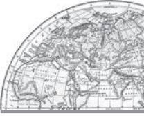

- **1.** Choose the right answers of the following from the given options.
	- (i) Regional planning relates to :
		- (a) Development of various sectors of economy.
		- (b) Area specific approach of development.
		- (c) Area differences in transportation network.
		- (d) Development of rural areas.
	- (ii) ITDP refers to which one of the following?
		- (a) Integrated Tourism Development Programme
		- (b) Integrated Travel Development Programme
		- (c) Integrated Tribal Development Programme
		- (d) Integrated Transport Development Programme
	- (iii) Which one of the following is the most crucial factor for sustainable development in Indira Gandhi Canal Command Area?
		- (a) Agricultural development
		- (b) Eco-development
		- (c) Transport development
		- (d) Colonisation of land
- **2.** Answer the following questions in about 30 words.
	- (i) What are the social benefits of ITDP in the Bharmaur tribal region?
	- (ii) Define the concept of sustainable development.
	- (iii) What are the positive impacts of irrigation on Indira Gandhi Canal Command Area?
- **3.** Answer the following questions in about 150 words.
	- (i) Write short notes on drought-prone area programme. How does this programme help in the development of dryland agriculture in India?
	- (ii) Suggest the measures of promotion of sustainability in Indira Gandhi Canal Command Area.

## **Project**

- (i) Find out the area development programmes being implemented in your region. Assess the impact of such programmes on the society and economy in your locality.
- (ii) Select your own area or identify an area facing severe environmental and socio-economic problems. Make an assessment of its resources and prepare their inventory. Suggest the measures for its sustainable development as it has been done in the case of Indira Gandhi Canal Command Area.

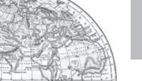

- 74 *India : People and Economy*
