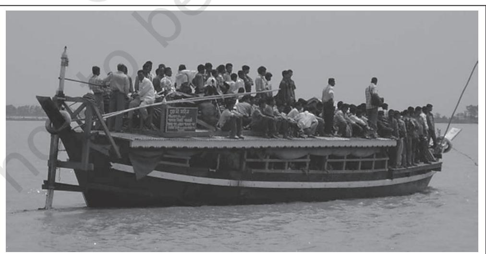
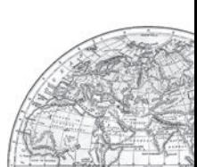

# TRANSPORT AND COMMUNICATION

We use many items in our daily life. From toothpaste to our bed tea, milk, clothes, soaps, food items, etc., are required every day. All these can be purchased from the market. Have you ever thought as to how these items are brought from the site of production? All the production is meant for consumption. From the fields and factory, the produce is brought to the place from where consumers purchase it. It is the transportation of these items from the site of their production to the market which make them available to the consumer.

We not only use material things, like fruits, vegetables, books, clothes, etc., but also use ideas, views and messages in our daily life. Do you know we exchange our views, ideas and messages from one place to another or one individual to another while communicating with the help of various means?

The use of transport and communication depends upon our need to move things from place of their availability to the place of their use. Human beings use various methods to move goods, commodities, ideas from one place to another.

The following diagram shows the major means of transportation.

# **Land Transport**

The pathways and unmetalled roads have been used for transportation in India since ancient times. With the economic and technological development, metalled roads and railways were developed to move large volume of goods and people from one place to another. Ropeways, cableways and pipelines were devised to cater to the demands of transporting specific goods under special circumstances.

### Road Transport

India has one of the second largest road networks in the world with a total length of about 62.16 lakh km (morth.nic.in, Annual Report 2020-21).

the princely states and British India. After Independence, twenty-year road plan (1961) was introduced to improve the conditions of roads in India. However, roads continue to concentrate in and around urban centres. Rural and remote areas had the least connectivity by road.

For the purpose of construction and maintenance, roads are classified as National Highways (NH), State Highways(SH), Major District Roads and Rural Roads.

*Fig. 7.1*

About 85 per cent of passenger and 70 per cent of freight traffic are carried by roads every year. Road transport is relatively suitable for shorter distance travel.

**Sher Shah Suri built the** *Shahi* **(Royal) road to strengthen and consolidate his empire from the Indus Valley to the Sonar Valley in Bengal. This road was renamed the Grand Trunk (GT) road during the British period, connecting Calcutta and Peshawar. At present, it extends from Amritsar to Kolkata.**

Collect information about National Highway number (old and new) from the website morth.nic.in/national-highway-details.

Road transport in modern sense was very limited in India before World War-II. The first serious attempt was made in 1943 when 'Nagpur Plan' was drawn. This plan could not be implemented due to lack of coordination among

# National Highways

The main roads which are constructed and maintained by the Central Government are known as the National Highways. These roads are meant for inter -state transport and movement of defence men and material in strategic areas. These also connect the state capitals, major cities, important ports, railway junctions, etc. The length of the National Highways has increased from 19,700 km in 1951 to 1,36,440 km in 2020. The National Highways constitute only about 2 per cent of the total road length but carry 40 per cent of the road traffic.

The National Highways Authority of India (NHAI) was operationalised in 1995. It is an autonomous body under the Ministry of Surface Transport. It is entrusted with the responsibility of development, maintenance and operation of National Highways. This is also the apex body to improve the quality of the roads designated as National Highways.

| Serial No. | Road Category | Length in Km |
| --- | --- | --- |
| 1. | National Highways | 136440 |
| 2. | State Highways | 176818 |
| 3. | Other Roads | 5902539 |
|  | Total | 6215797 |

*Table 7.1 : India Road Network 2020*

Source: *Ministry of Road Transport and Highways Annual Report 2020-21. For latest data see website morth.nic.in*

# National Highways Development Projects

NHAI has taken up some major projects in the country under different phases :

*Golden Quadrilateral :* It comprises construction of 5,846-km long 4/6 lane, high density traffic corridor, to connect India's four big metro cities of Delhi-Mumbai-Chennai-Kolkata. With the construction of Golden Quadrilateral, the time, distance and cost of movement among the mega cities of India will be considerably minimised.

*North-South and East-West Corridors :* North-South corridor aims at connecting Srinagar in Jammu and Kashmir with Kanniyakumari in Tamil Nadu (including Kochchi-Salem Spur) with 4,076-km long road. The East-West Corridor has been planned to connect Silchar in Assam with the port town of Porbandar in Gujarat with 3,640-km of road length.

### *Rural Roads*

These roads are vital for providing links in the rural areas. About 80 per cent of the total road length in India are categorised as rural roads. There is regional variation in the density of rural road because these are influenced by the nature of the terrain.

*Fig. 7.2 : Road constructed under the Pradhan Mantri Gram Sadak Yojna*

**Why are the rural roads' density very low in hilly, plateau and forested areas? Why does the quality of rural roads deteriorate away from the urban centres?**

### These are constructed and maintained by state

governments. They join the state capitals with district headquarters and other important towns. These roads are connected to the National Highways.

#### *District Roads*

*State Highways*

These roads are the connecting link between District Headquarters and the other important nodes in the district.

#### *Other Roads*

Other roads include Border Roads and International Highways. The Border Road Organisation (BRO) was established in May 1960 for accelerating economic development and strengthening defence preparedness through rapid and coordinated improvement of strategically important roads along the

northern and north-eastern boundary of the country. It is a premier multifaceted construction agency. It has constructed roads in high altitude mountainous terrain joining Chandigarh with Manali (Himachal Pradesh) and Leh (Ladakh). This road runs at an average altitude of 4,270 metres above the mean sea level.

Apart from the construction and maintenance of roads in strategically sensitive areas, the BRO also undertakes snow clearance in high altitude areas. The international highways are meant to promote the harmonious relationship with the neighbouring countries by providing effective links with India. (Fig. 7.4 and 7.5)

*Fig. 7.3 : Khardung La Pass in Ladakh*

The World's longest Highway tunnel — **Atal Tunnel** (9.02 Km) has been built by Border Road Organisation. This tunnel connects Manali to Lahaul-Spiti valley throughout the year. Earlier the valley was cut off for about 6 months each year owing to heavy snowfall. The Tunnel is built with ultra-modern specifications in the Pir Panjal range of Himalayas at an altitude of 3000 metres from the Mean Sea Level (MSL).

*Source: http://www.bro.gov.in/ pagefimg.asp?imid=144, And PIB Delhi 03 October 2020*

- 
**78** *India : People and Economy*

Why have Bengaluru and Hyderabad in the South and Delhi, Kanpur and Patna in north India have emerged as important nodes?

*Bharatmala is a proposed umbrella scheme for:*

- (i) Development of State roads along coastal border areas, including connectivity of nonmajor ports;
- (ii) Backward areas religious and tourist places connectivity programme;
- (iii) *Setubharatam Pariyojana*, which is for the consruction of about 1500 major bridges and 200 rail over bridges rail under bridges; District Headquarters connectivity Scheme for the development of about 9000 km newly declared National Highways.

The programme is targeted for completion by 2022. *Source: Economic Survey 2015-16 pp.146.*

## **Rail Transport**

Indian Railways, network is one of the longest in the world. It facilitates the movement of both freight and passengers and contributes to the growth of the economy. Mahatma Gandhi said, the Indian railways *"...brought people of diverse cultures together to contribute to India's freedom struggle".*

Indian Railway was introduced in 1853, when a line was constructed from Bombay to Thane covering a distance of 34 km.

Indian Railways is the largest government undertaking in the country. The length of Indian Railways network was 67,956 km (Railway yearbook 2019-20). Its very large size puts a lot of pressure on a centralised railway management system. Thus, in India, the railway system has been divided into 17 zones.

### *Table 7.2 : Indian Railways: Railway Zones and Headquarters*

| Railway Zone | Headquarters |
| --- | --- |
| Central | Mumbai CST |
| Eastern | Kolkata |
| East Central | Hajipur |
| East Coast | Bhubaneswar |
| Northern | New Delhi |
| North Central | Allahabad |
| North Eastern | Gorakhpur |
| North East Frontier | Maligaon (Guwahati) |
| North Western | Jaipur |
| Southern | Chennai |
| South Central | Secunderabad |
| South Eastern | Kolkata |
| South East Central | Bilaspur |
| South Western | Hubli |
| Western | Mumbai (Church Gate) |
| West Central | Jabalpur |
| Metro Railway | Kolkata |

On the basis of the width of track of the Indian Railways, three categories have been made:

**Broad gauge:** The distance between rails in broad gauge is 1.676 metre. The total length of broad gauge lines was 63950 km (2019-20).

**Metre gauge:** The distance between rails is one metre. Its total length was 2402 km (2019-20).

**Narrow gauge:** The distance between the rails in this case is 0.762 metre or 0.610 metre. The total length of narrow guage was 1604 km (2019-20). It is generally confined to hilly areas.

Indian Railways has launched extensive programme to convert the metre and narrow gauges to broad gauge. Moreover, steam engines have been replaced by diesel and electric engines. This step has increased the speed, as well as, the haulage capacity.

The replacement of steam engines run by coal has also improved the environment of the stations.

Metro rail has revolutionlised the urban transport system in India. Replacement of diesel buses by CNG-run vehicles along with the introduction of metro is a welcome step towards controlling the air pollution in urban centres.

Which cities of India have Metro Rail Facility? Collect information about it and discuss in the classroom.

Konkan Railway

One of the important achievements of the Indian Railways has been the construction of Konkan Railway in 1998. It is 760-km long rail route connecting Roha in Maharashtra to Mangalore in Karnataka. It is considered an engineering marvel. It crosses 146 rivers, streams, nearly 2000 bridges and 91 tunnels. Asia's largest tunnel which is nearly 6.5 km long, also lies on this route. The states of Maharashtra, Goa and Karnataka are partners in this undertaking.

Areas around towns, raw material producing areas and of plantations and other commercial crops, hill stations and cantonment towns were well-connected by railways from the British colonial era. These were mostly developed for the exploitation of resources. After the Independence of the country, railway routes have been extended to other areas too. The most significant development has been the development of Konkan Railway along the western coast providing a direct link between Mumbai and Mangaluru.

Railway continues to remain the main means of transport for the masses. Railway network is relatively less dense in the hill states, north eastern states, central parts of India and Rajasthan.

#### Water Transport

Waterways is an important mode of transport for both passenger and cargo traffic in India. It is the cheapest means of transport and is most suitable for carrying heavy and bulky material. It is a fuel-efficient and eco-friendly mode of transport. The water transport is of two types– (a) inland waterways, and (b) oceanic waterways.

### *Inland Waterways*

It was the chief mode of transport before the advent of railways. It, however, faced tough competition from road and railway transport. Moreover, diversion of river water for irrigation purposes made them non-navigable in large

*Fig. 7.6 : River navigation in the North-east*

80 *India : People and Economy*

parts of their courses. India has 14,500 km of navigable waterways, contributing about 1% to the country's transportation. It comprises rivers, canals, backwaters, creeks, etc. At present, 5,685 km of major rivers are navigable by mechanised flat bottom vessels.

For the development, maintenance and regulation of national waterways in the country, the Inland Waterways Authority was set up in 1986. The following waterways have been declared as the National Waterways by the Government (Table 7.3).

*Fig. 7.7 : Natinal Waterway No.3*

| Waterways | Stretch | Specification |
| --- | --- | --- |
| NW 1 | Allahabad-Haldia | It is one of the most important waterways in |
|  | stretch (1,620 km) | India, which is navigable by mechanical boats |
|  |  | up to Patna and by ordinary boats up to |
|  |  | Haridwar. It is divided into three parts for |
|  |  | developmental purposes– (i) Haldia-Farakka (560 |
|  |  | km), (ii) Farakka-Patna (460 km), (iii) Patna |
|  |  | Allahabad (600 km). |
| NW 2 | Sadiya-Dhubri stretch | Brahmaputra is navigable by steamers up to |
|  | (891 km) | Dibrugarh (1,384 km) which is shared by India |
|  |  | and Bangladesh |
| NW 3 | Kottapuram-Kollam | It includes 168 km of west coast canal along |
|  | stretch (205 km) | with Champakara canal (14 km) and |
|  |  | Udyogmandal canal (23 km). |
| NW 4 |  | Specified streches of Godavari and Krishna rivers along with Kakinada |
|  | Puducherry stretch of canals (1078 km) |  |
| NW 5 | Specified stretches of river Brahmani along with Matai river, delta channels |  |
|  | of Mahanadi and Brahmani rivers and East Coast canals (588km). |  |

*Table 7.3:1 National Waterways of India*

*Transport and Communication* 81

The Inland Waterways Authority has also identified 10 other inland waterways, which could be upgraded. The backwaters (Kadal) of Kerala has special significance in Inland Waterway. Apart from providing cheap means of transport, they are also attracting a large number of tourists in Kerala. The famous Nehru Trophy Boat Race (VALLAMKALI) is also held in the backwaters.

#### Oceanic Routes

India has a vast coastline of approximate 7,517 km, including islands. Twelve major and 200 minor ports provide infrastructural support to these routes. Oceanic routes play an important role in the transport sector of India's economy. Approximately 95 per cent of India's foreign trade by volume and 70 per cent by value moves through ocean routes. Apart from international trade, these are also used for the purpose of transportation between the islands and the rest of the country.

#### Air Tran Air TranAir Transportation

Air transport is the fastest means of movement from one place to the other. It has reduced distances by minimising the travel time. It is essential for a vast country like India, where distances are large and the terrain and climatic conditions are diverse.

Air transport in India made a beginning in 1911 when airmail operation commenced over a little distance of 10 km between Allahabad and Naini. But its real development took place in post-Independent period. The Airport Authority of India is responsible for providing safe, efficient air traffic and aeronautical communication services in the Indian Air Space.

UDAN (*Ude Desh ka Aam Nagrik*) is a first-of-its kind scheme globally, designed to jump- start the regional aviation market. Regional Connectivity Scheme (RCS) -UDAN was conceived by the Ministry of Aviation (MoCA) Govt. of India, to promote regional connectivity by making fly affordable for the common citizen. The central idea of the scheme is to encourage airlines to operate flights on regional and remote routes through enabling policies and extending incentives.

Pawan Hans is the helicopter service operating in hilly areas and is widely used by tourists in north-eastern sector.

In addition, Pawan Hans Limited mainly provides helicopter services to petroleum sector and for tourism.

# **Oil and Gas Pipelines**

Pipelines are the most convenient and efficient mode of transporting liquids and gases over long distances. Even solids can also be transported by pipelines after converting them into slurry. Oil India Limited (OIL) under the administrative set up of the Ministry of Petroleum and Natural Gas is engaged in the exploration, production and transportation of crude oil and natural gas. It was incorporated in 1959 as a company. Asia's first cross country pipeline covering a distance of 1,157 km was constructed by OIL from Naharkatiya oilfield in Assam to Barauni refinery in Bihar. It was further extended up to Kanpur in 1966. GAIL (India) Ltd. was set up in 1984 as a public sector undertaking to transport, process and market natural gas for its economic use. The first 1,700 km long Hazira-Vijaipur-Jagdishpur (HVJ) cross country gas pipeline, constructed by GAIL (India), linked Mumbai

High and Bassein gas fields with various fertiliser, power and industrial complexes in western and northern India. This artery provided impetus to Indian gas market development. Overall, India's gas infrastructure has expanded over ten times from 1,700 km to 18,500 km of cross-country pipelines and is expected to soon reach over 34,000 km as Gas Grid by linking all the gas sources and consuming markets across the country including North Eastern States.

# **Communication Networks**

Human beings have evolved different methods of communication over time. In earlier times, the messages were delivered by beating the drum or hollow tree trunks, giving indications through smoke or fire or with the help of fast runners. Horses, camels, dogs, birds and other animals were also used to send messages. Initially, the means of communication were also the means of transportation. Invention of postoffice, telegraph, printing press, telephone, satellite, etc has made the communication much faster and easier. Development in the field of science and technology has significantly contributed in bringing about revolution in the field of communication.

People use different modes of communication to convey the messages. On the basis of scale and quality, the mode of communication can be divided into following categories :

### Personal Communication System

Among all the personal communication system internet is the most effective and advanced one. It is widely used in urban areas. It enables the user to establish direct contact through e-mail to get access to the world of knowledge and information. It is increasingly used for ecommerce and carrying out money transactions. The internet is like a huge central warehouse of data, with detailed information on various items. The network through internet and e-mail provides an efficient access to information at a comparatively low cost. It enables us with the basic facilities of direct communication.

#### Mass Communication System

#### *Radio*

Radio broadcasting started in India in 1923 by the Radio Club of Bombay. Since then, it gained immense popularity and changed the sociocultural life of people. Within no time, it made a place in every household of the country. Government took this opportunity and brought this popular mode of communication under its control in 1930 under the Indian Broadcasting System. It was changed to All India Radio in 1936 and to Akashwani in 1957.

All India Radio broadcasts a variety of programmes related to information, education and entertainment. Special news bulletins are also broadcast at specific occasions like session of parliament and state legislatures.

#### *Television (T.V.)*

Television broadcasting has emerged as the most effective audio-visual medium for disseminating information and educating masses. Initially, the T.V. services were limited only to the National Capital where it began in 1959. After 1972, several other centres became operational. In 1976, TV was delinked from All India Radio (AIR) and got a separate identity

as Doordarshan (DD). After INSAT-IA (National Television-DD1) became operational, Common National Programmes (CNP) were started for the entire network and its services were extended to the backward and remote rural areas.

#### *Satellite Communication*

Satellites are mode of communication in themselves as well as they regulate the use of other means of communication. However, use of satellite in getting a continuous and synoptic view of larger area has made satellite communication very vital for the country due to the economic and strategic reasons. Satellite images can be used for the weather forecast, monitoring of natural calamities, surveillance of border areas, etc.

On the basis of configuration and purposes, satellite system in India can be grouped into two: Indian National Satellite System (INSAT) and Indian Remote Sensing Satellite System (IRS). The INSAT, which was established in 1983,is a multi-purpose satellite system for telecommunication, meteorological observation and for various other data and programmes.

The IRS satellite system became operational with the launching of IRS-IA in March 1988 from Vaikanour in Russia. India has also developed her own Launching Vehicle PSLV (Polar Satellite Launch Vehicle). These satellites collect data in several spectral bands and transmit them to the ground stations for various uses. The National Remote Sensing Centre (NRSC) at Hyderabad provides facilities for acquisition of data and its processing. These are very useful in the management of natural resources.

- **2 .** Answer the following questions in about 30 words.
	- (i) Which activity does transportation convey? Name three major modes of transportation.
	- (ii) Discuss advantages and disadvantages of pipeline transportation.
	- (iii) What do you mean by 'communication'?
- **3 .** Answer the following questions in about 150 words.
	- (i) Which are the chief means of transportation in India? Discuss the factors affecting their development.
	- (ii) Give a detailed account of the development of railways in India and highlight their importance.
	- (iii) Describe the role of roads in the economic development of India.

# Project Project

Find out the facilities that Indian Railways provide to the passengers.

