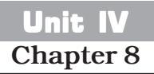

# INTERNATIONAL TRADE

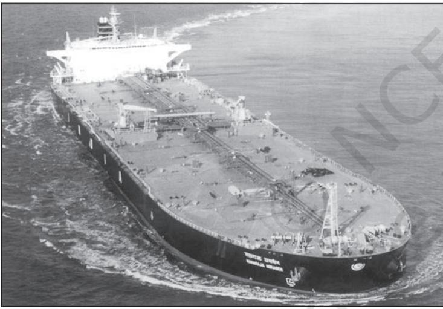

**India : People and Economy**

**86**

You have already studied about the various aspects of International trade in the book *Fundamentals of Human Geography*. International Trade is mutually beneficial as no country is self-sufficient. India's international trade has undergone a sea change in recent years in terms of volume, composition as well as direction. Although India's contribution in the world trade is as low as one per cent of the total volume, yet it plays a significant role in the world economy.

Let us examine the changing pattern of India's International trade. In 1950-51, India's external trade was worth Rs.1,214 crore, which rose to Rs. 77,19,796 crore in 2020-21. Can you calculate the percentage growth in 2020-21 over 1950-51? There are numerous reasons for this sharp rise in overseas trade, such as the momentum picked up by the manufacturing sectors, the liberal policies of the government and the diversification of markets.

The nature of India's foreign trade has changed over the years (Table 8.1). Though there has been an increase in the total volume of import and export, the value of import continued to be higher than that of exports.

### **Changing Pattern ofttern of ttern of the Composition of India's Expor s Exports**

**Extent of gap between Exports and Imports in India's foreign trade During 2013-14 to 2021-22**

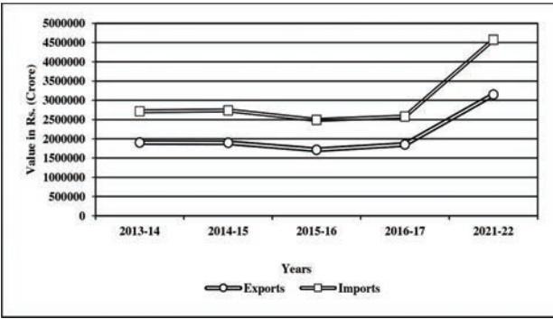

*Source: Economic Survey 2022-23*

**Fig. 8.1**

|  |  |  | (Value in Rs. Crore) |
| --- | --- | --- | --- |
| Year | Exports | Imports | Trade Balance |
| 2004-05 | 3,75,340 | 5,01,065 | -1,25,725 |
| 2009-10 | 8,45,534 | 13,63,736 | -5,18,202 |
| 2013-14 | 19,05,011 | 27,15,434 | -8,10,423 |
| 2016-17 | 18,52,340 | 25,77,422 | -7,25,082 |
| 2021-22 | 31,47,021 | 45,72775 | -14,25,753 |

**Table 8.1 India's Foreign Trade**

*Source : http://commerce.nic.in/publications/annual-report - 2010-11 and Economic Survey 2016-17, 2022-23*

Draw bar diagram to show the trends of exports of all items given in the table. Use pen/pencil of different colours.

|  |  |  | (Percentage share in Exports) |  |
| --- | --- | --- | --- | --- |
| Commodities | 2015-16 | 2016-17 | 2020-21 | 2021-22 |
| Agriculture and allied products | 12.6 | 12.3 | 14.3 | 11.9 |
| Ore and Minerals | 1.6 | 1.9 | 3.2 | 2.0 |
| Manufactured goods | 72.9 | 73.6 | 71.2 | 67.8 |
| Crude and petroleum products | 11.9 | 11.7 | 9.2 | 16.4 |
| Other commodities | 1.1 | 0.5 | 2.1 | 1.9 |

**Table 8.2 : Composition of India's Export, 2015-2022**

*Source : Economic Survey 2016-17 and 2022-23*

The composition of commodities in India's international trade has been undergoing a change over the years. In export the share of agriculture and allied products and manufactured goods have decreased, whereas, share from crude petroleum and products and other commodities have increased. The share of ore and minerals have largely remained constant over the years from 2015-16 to 2021-22.

The decline in traditional items is largely due to the tough international competition. Amongst the agriculture products, there is a decline in the export of traditional item, such as cashew, etc., though an increase has been registered in floricultural products, fresh fruits, marine products and sugar, etc.

Manufacturing sector alone accounted for 67.8 per cent of India's total value of export in 2021-22. Engineering goods have shown a significant growth in the export. China and other East Asian countries are our major competitors. Gems and jewellery contributes a larger share of India's foreign trade.

Study Table 8.3 and select major commodities exported in 2021-22 and draw bar diagram.

### **Changing Patterns of the Composition of India's Import**

India faced serious food shortage during 1950s and 1960s. The major item of import at that time was foodgrain, capital goods, machinery and equipment. The balance of payment was adverse as imports were more than export in spite of all the efforts of import substitution. After 1970s, foodgrain import was discontinued due to the success of Green

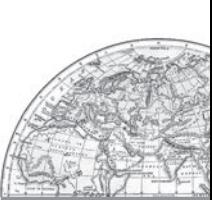

| Table 8.3 : Export of Some Principal Commodities |
| --- |
| (in crore rupees) |

| Commodities | 2021-22 |
| --- | --- |
| Agriculture and allied products | 3,75,742 |
| Ores and Minerals | 63,754 |
| Manufactured goods | 21,32,296 |
| Mineral fuels and Lubricants | 5,15,310 |

*Source : Economic Survey 2022-23.*

revolution but the energy crisis of 1973 pushed the prices of petroleum, and import budget was also pushed up. Foodgrain import was replaced by fertilisers and petroleum. Machine and equipment, special steel, edible oil and chemicals largely make the import basket. Examine the changing pattern of imports in Table 8.4 and try to comprehend the shifts.

Table 8.4 shows that there is a rise in the import of petroleum products. It is used not only as a fuel but also as an industrial raw material. It indicates the tempo of rising industrialisation and better standard of living, Sporadic price rise in the international market is another reason for the same. It is also noticed that the, import of capital goods maintained a steady decline. Import of food and allied products declined. Other major items of India's import include pearls, precious and semi-precious stones, gold and silver, non-metal ferrous metals. The detail of Indian imports of some principal commodities during 2021-22 have been given in Table 8.5.

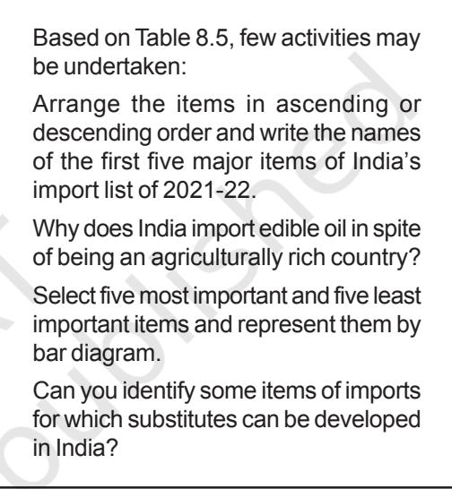

|  |  |  |  | (In percentage) |
| --- | --- | --- | --- | --- |
| Commodity Group | 2015-16 | 2016-17 | 2020-21 | 2021-22 |
| Food and allied products | 5.1 | 5.6 | 4.5 | 4.4 |
| Fuel (Coal, POL) | 25.4 | 26.7 | 25.1 | 31.6 |
| Fertilisers | 2.1 | 1.3 | 1.9 | 2.3 |
| Paper board manufacturing and news print | 0.8 | 0.9 | 0.8 | 0.7 |
| Capital goods | 13.0 | 13.6 | 12.7 | 10.1 |
| Others | 38.1 | 37.0 | 41.6 | 38.5 |

**Table 8.4 : India Composition of Import 2015-22**

*Source : Economic Survey 2022-23*

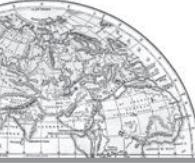

**88 India : People and Economy**

Table 8.5 : Import of Some Principal Commodities (in crore rupees)

| Commodities | 2021-22 2021-22 |
| --- | --- |
| Fertilisers and fertiliser manufacturing | 105796 |
| Edible oils | 141532 |
| Pulp and waste paper | 11934 |
| Non-ferrous metals | 499766 |
| Iron and steel | 94053 |
| Petroleum, oil and lubricants | 1207803 |
| Pearls, precious and | 231279 |
| semi-precious stones |  |
| Medicinal and Pharma products | 67545 |
| Chemical products | 308882 |

Source : Economic Survey 2022-23

### Direction of Trade

India has trade relations with most of the countries and major trading blocks of the world.

Region-wise and sub-region-wise trade during the period 2021-22 has been given in Table 8.6.

### Table 8.6 Direction of India's Import trade (in crore rupees)

| Region | Imports Imports |  |
| --- | --- | --- |
|  | 2016-17 | 2021-22 |
| Europe | 403972 | 640577 |
| Africa | 193327 | 368156 |
| North America | 195332 | 378041 |
| Latin America | 115762 | 161995 |
| Asia and ASEAN | 1544520 | 2918577 |

Source : Economic Survey 2016-17 and 2022-23

India aims to double its share in the international trade within the next five years. It has already started adopting suitable measures such as import liberalisation, reduction in import duties, delicensing and change from process to product patents.

Draw a multiple bar diagram to represent the major trading partners.

Most of India's foreign trade is carried through sea and air routes. However, a small portion is also carried through land route to neighbouring countries like Nepal, Bhutan, Bangladesh and Pakistan.

## **Sea Ports as Ga ts as Gats as Gateways of Interna International T tional Ttional Trade**

India is surrounded by sea from three sides and is bestowed with a long coastline. Water provides a smooth surface for very cheap transport provided there is no turbulence. India

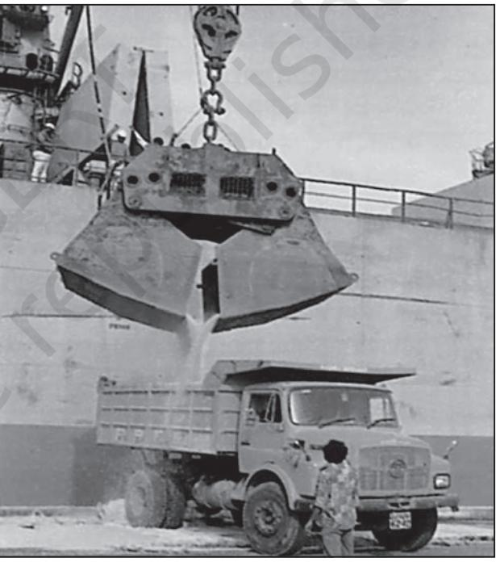

Fig. 8.3 : Unloading of goods on port

has a long tradition of sea faring and developed many ports with place name suffixed with pattan meaning port. An interesting fact about ports in India is that its west coast has more ports than its east coast.

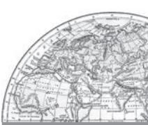

89

## **Can you find out the reasons for the variations in the location of ports along the two coasts?**

Though ports have been in use since ancient times, the emergence of ports as gateways of international trade became important after the coming of the European traders and colonisation of the country by the British. This led to the variation in the size and quality of ports. There are some ports which have very vast area of influence and some have limited area of influence. At present, India has 12 major ports and 200 minor or intermediate ports. In case of the major ports, the central government decides the policy and plays regulatory functions. The minor ports are there whose policy and functions are regulated by state governments. The major ports handle larger share of the total traffic.

The British used the ports as suction points of the resources from their hinterlands. The extension of railways towards the interior facilitated the linking of the local markets to regional markets, regional markets to national markets and national markets to the international markets. This trend continued till 1947. It was expected that the country's Independence will reverse the process, but the partition of the country snatched away two very important ports, i.e., Karachi port went to Pakistan and Chittagong port to the erstwhile east-Pakistan and now Bangladesh. To compensate the losses, many new ports, like the Kandla in the west and the Diamond Harbour near Kolkata on river Hugli in the east were developed.

Despite this major setback, Indian ports continued to grow after the Independence. Today, Indian ports are handling large volumes of domestic, as well as, overseas trade. Most of the ports are equipped with modern infrastructure. Previously, the development and modernisation was the responsibility of the government agencies, but considering the increase in function and need to bring these ports at par with the international ports, private entrepreneurs

have been invited for the modernisation of ports in India.

The capacity of Indian ports increased from 20 million tonnes of cargo handling in 1951 to more than 837 million tonnes in 2016.

Some of the Indian ports along with their hinterlands are as follows :

**Deendayal Port** (Kandla port) situated at the head of Gulf of Kuchchh has been developed as a major port to cater to the needs of western and north western parts of the country and also to reduce the pressure at Mumbai port. The port is specially designed to receive large quantities of petroleum and petroleum products and fertiliser. The offshore terminal at Vadinar has been developed to reduce the pressure at the port.

Demarcation of the boundary of the hinterland would be difficult as it is not fixed over space. In most of the cases, hinterland of one port may overlap with that of the other.

**Mumbai** is a natural harbour and the biggest port of the country. The port is situated closer to the general routes from the countries of Middle East, Mediterranean countries, North Africa, North America and Europe where the major share of country's overseas trade is carried out. The port is 20 km long and 6-10 km wide with 54 berths and has the country's largest oil terminal. M.P., Maharashtra, Gujarat, U.P. and parts of Rajasthan constitute the main hinterlands of Mumbai ports.

**Jawaharlal Nehru Port** at Nhava Sheva was developed as a satellite port to relieve the pressure at the Mumbai port. It is the largest container port in India.

**Marmagao Port,** situated at the entrance of the Zuari estuary, is a natural harbour in Goa. It gained significance after its remodelling in 1961 to handle iron-ore exports to Japan. Construction of Konkan railway has considerably extended the hinterland of this port. Karnataka, Goa, Southern Maharashtra constitute its hinterland.

**New Mangalore Port** is located in the state of Karnataka and caters to the needs of the export of iron-ore and iron-concentrates. It also handles fertilisers, petroleum products, edible

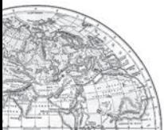

**90 India : People and Economy**

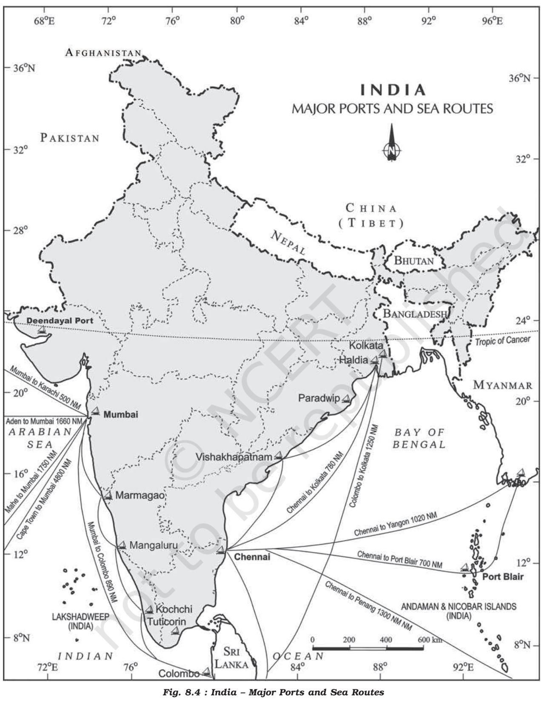

oils, coffee, tea, wood pulp, yarn, granite stone, molasses, etc. Karnataka is the major hinterland for this port.

Kochchi Port, situated at the head of Vembanad Kayal, popularly known as the *'Queen of the Arabian Sea',* is also a natural harbour. This port has an advantageous location being close to the Suez-Colombo route. It caters to the needs of Kerala, southern-Karnataka and south western Tamil Nadu.

Kolkata Port is located on the Hugli river, 128 km inland from the Bay of Bengal. Like the Mumbai port, this port was also developed by the British. Kolkata had the initial advantage of being the capital of British India. The port has lost its significance considerably on account of the diversion of exports to the other ports such as Vishakhapatnam, Paradwip and its satellite port, Haldia.

Kolkata port is also confronted with the problem of silt accumulation in the Hugli river which provides a link to the sea. Its hinterland covers U.P., Bihar, Jharkhand, West Bengal, Sikkim and the north-eastern states. Apart from this, it also extends ports facilities to our neighbouring land-locked countries such as Nepal and Bhutan.

Haldia Port is located 105 km downstream from Kolkata. It has been constructed to reduce the congestion at Kolkata port. It handles bulk cargo like iron ore, coal, petroleum, petroleum products and fertilisers, jute, jute products, cotton and cotton yarn, etc.

Paradwip Port is situated in the Mahanadi delta, about 100 km from Cuttack. It has the deepest harbour specially suited to handle very large vessels. It has been developed mainly to handle large-scale export of iron-ore. Odisha, Chhattisgarh and Jharkhand are the parts of its hinterland.

Visakhapatnam Port in Andhra Pradesh is a land-locked harbour, connected to the sea by a channel cut through solid rock and sand. An outer harbour has been developed for handling iron-ore, petroleum and general cargo. Andhra Pradesh and Telangana are the main hinterland for this port.

Chennai Port is one of the oldest ports on the eastern coast. It is an artificial harbour built in 1859. It is not much suitable for large ships because of the shallow waters near the coast. Tamil Nadu and Puducherry are its hinterland.

Ennore, a newly developed port in Tamil Nadu, has been constructed 25 km north of Chennai to relieve the pressure at Chennai port.

Tuticorin Port was also developed to relieve the pressure of Chennai port. It deals with a variety of cargo, including coal, salt, food grains, edible oils, sugar, chemicals and petroleum products.

### Airports

Air transport plays an important role in the international trade. It has the advantage of taking the least time for carriage and handling high value or perishable goods over long distances. It is very costly and unsuitable for carrying heavy and bulky commodities. This ultimately reduces the participation of this sector in the international trade as compared to the oceanic routes.

There were 25 major airports functioning in the country (Annual Report 2016-17). They are Ahmedabad, Bengaluru, Chennai, Delhi, Goa, Guwahati, Hyderabad, Kolkata, Mumbai, Thiruvananthapuram, Srinagar, Jaipur, Calicut, Nagpur, Coimbatore, Cochin, Lucknow, Pune, Chandigarh, Mangaluru, Vishakhapatnam, Indore, Patna, Bhubaneswar and Kannur. Since 2017, under the UDAN scheme, a total number of 73 unserved/underserved airports including 9 Heliports and 2 water aerodromes have been operationalized (*Source: PIB, Ministry of Civil Aviation, Govt. of India, 2023*)

You have already studied about the air transport in the previous chapter. You consult the chapter on transport to find out the main features of air transport in India.

Name the nearest domestic and international airports from your place. Identify the state with maximum number of domestic airports.

Identify four cities where maximum number of air routes converge and also give reasons for this.

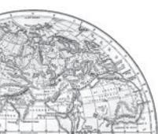

92 *India : People and Economy*

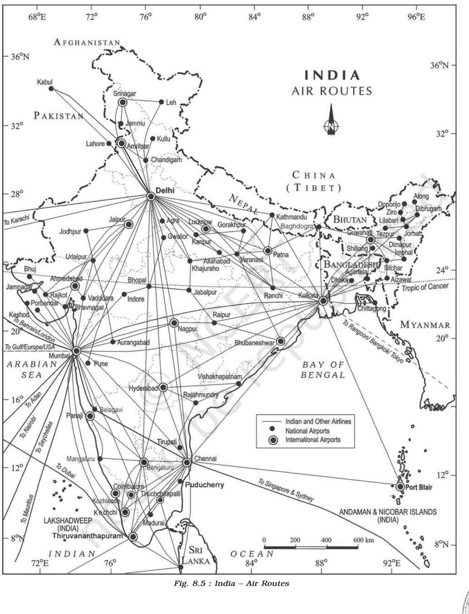

**International Trade 93**

**1.** Choose the right answers of the following from the given options.

- (i) Trade between two countries is termed as
	-
	- (a) Internal trade (c) International trade
	- (b) External trade (d) Local trade

(ii) Which one of the following is a land locked harbour?

- (a) Vishakhapatnam (c) Ennor
- (b) Mumbai (d) Haldia

(iii) Most of India's foreign trade is carried through

- (a) Land and sea (c) Sea and air
- (b) Land and air (d) Sea
- **2.** Answer the following questions in about 30 words.
	- (i) Mention the characteristics of India's foreign trade.
	- (ii) Distinguish between port and harbour.
	- (iii) Explain the meaning of hinterland.
	- (iv) Name important items which India imports from different countries.
	- (v) Name the ports of India located on the east coast.
- **3.** Answer the following questions in about 150 words.
	- (i) Describe the composition of export and import trade of India.
	- (ii) Write a note on the changing nature of the international trade of India.

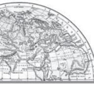

