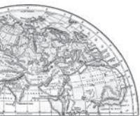

# **GEOGRAPHICAL PERSPECTIVE ON SELECTED ISSUES AND PROBLEMS**

## **Environmental Pollution ollutionollution**

Environmental pollution results from 'the release of substances and energy from waste products of human activities. There are many types of pollution. They are classified on the basis of medium through which pollutants are transported and diffused. Pollution can be classified into (i) air pollution, (ii) water pollution, (iii) land pollution and (iv) noise pollution.

### Water Pollution

Indiscriminate use of water by increasing population and industrial expansion has led degradation of the quality of water considerably. Surface water available from rivers, canals, lakes, etc. is never pure. It contains small quantities of suspended particles, organic and inorganic substances. When concentration of these substances increases, the water becomes polluted, and hence becomes unfit for use. In such a situation, the self-purifying capacity of water is unable to purify the water.

*Fig.9.1 : Cutting Through Effluent : Rowing through a pervasive layer of foam on the heavily polluted Yamuna on the outskirts of New Delhi*

Though water pollutants are also created from natural sources (erosion, landslides, decay and decomposition of plants and animals, etc.) pollutants from human activities are the real causes of concern. Human beings pollute the water through industrial, agricultural and cultural activities. Among these activities, industry is the most significant contributor.

| Pollution Types | Pollution Involved | Sources of Pollution |
| --- | --- | --- |
| Air Pollution | ), Oxides of Oxides of sulphur (SO2 , SO3 | Combustion of coal, petrol and diesel, |
|  | nitrogen, carbon monoxide, hydro-carbon, | industrial processes, solid waste disposal, |
|  | ammonia, lead, aldehydes asbestos and beryllium. | sewage disposal, etc. |
| Water Pollution | Odour, dissolved and suspended solids, | Sewage disposal, urban run-off, toxic |
|  | ammonia and urea, nitrate and nitrites, | effluents from industries, run-off over |
|  | chloride, fluoride, carbonates, oil and grease, | cultivated lands and nuclear power plants. |
|  | insecticide and pesticide residue, tannin, |  |
|  | coliform MPM (bacterial count) sulphates and |  |
|  | sulphides, heavy metals e.g. lead, aresenic, |  |
|  | mercury, manganese, etc., radioactive |  |
|  | substances. |  |
| Land Pollution | Human and animal excreta viruses and | Improper human activities, disposal of |
|  | bacteria, garbage and vectors therein, | untreated industrial waste, use of pesticides |
|  | pesticides and fertiliser-residue alkalinity, | and fertilisers. |
|  | fluorides, radio-active substances. |  |
| Noise Pollution | High level of noise above tolerance level. | Aircrafts, automobiles, trains, industrial |
|  |  | processing and advertising media. |

*Table 9.1 : Types and Sources of Pollution*

Industries produce several undesirable products including industrial wastes, polluted waste water, poisonous gases, chemical residuals, numerous heavy metals, dust, smoke, etc. Most of the industrial wastes are disposed off in running water or lakes. Consequently, poisonous elements reach the reservoirs, rivers and other water bodies, which destroy the bio-system of these waters. Major water polluting industries are leather, pulp and paper, textiles and chemicals.

Various types of chemicals used in modern agriculture such as inorganic fertilisers, pesticides and herbicides are also pollution generating components. These chemicals are washed down to rivers, lakes and tanks. These chemicals also infiltrate the soil to reach the ground water. Fertiliser induces an increase in the nitrate content of surface waters. Cultural activities such as pilgrimage, religious fairs, tourism, etc. also cause water pollution. In India, almost all

| River and State | Polluted Stretches |  | Nature of Pollution | Main Polluters |
| --- | --- | --- | --- | --- |
| Ganga | (a) Downstream of Kanpur |  | 1. Industrial pollution from | Cities of Kanpur, Allahabad, |
| (Uttar Pradesh) | (b) Downstream of Varanasi |  | towns like Kanpur | Varanasi, Patna and Kolkata |
| Bihar | (c) Farrakka Barrage |  | 2. Domestic wastes from | release domestic waste into the |
| and |  |  | urban centres | river |
| West Bengal |  |  | 3. Dumping of carcasses in |  |
|  |  |  | the river |  |
| Yamuna | (a) | Delhi to confluence with | 1. Extraction of water by | Delhi dumping its domestic |
| (Delhi) | Chambal |  | Haryana and Uttar | waste |
| and | (b) Mathura and Agra |  | Pradesh for irrigation |  |
| (Uttar Pradesh) |  |  | 2. Agricultural run off |  |
|  |  |  | resulting in high levels of |  |
|  |  |  | micro-pollutants in the |  |
|  |  |  | Yamuna |  |
|  |  |  | 3. Domestic and industrial |  |
|  |  |  | waste of Delhi flowing |  |
|  |  |  | into the river |  |

*Table 9.2 : Sources of Pollution in the Ganga and the Yamuna Rivers*

- 96 *India : People and Economy*
surface water sources are contaminated and unfit for human consumption.

Water pollution is a source of various water- borne diseases. The diseases commonly caused due to contaminated water are diarrhoea, intestinal worms, hepatitis, etc. The World Health Organization shows that about one-fourth of the communicable diseases in India are water-borne. Though river pollution is common to all rivers, yet pollution of river Ganga flowing through one of the mot populous regions of India has caused great concerns among all. To imporve the condition of the river, National Mission for Clean Ganga was initiated. The Namami Gange Programme has been launched for the same.

#### **Air Pollution**

Air pollution is taken as addition of contaminants, like dust, fumes, gas, fog, odour, smoke or vapour to the air in substantial proportion and duration that may be harmful to flora and fauna and to property. With increasing use of varieties of fuels as the source of energy, there is a marked increase in emission of toxic gases into the atmosphere resulting in the pollution of air. Combustion of fossil fuels, mining and industries are the main sources of air pollution. These processes

Namami Gange Programme

Ganga, as a river, has national importance but the river requires cleaning by effectively controlling the pollution for its water. The Union Government has launched the '*Namami Gange Programme*' with the following objectives:

- developing sewerage treatment systems in towns,
- monitoring of industrial effluents,
- development of river front,
- afforestation along the bank of increase biodiversity,
- cleaning of the river surface,
- development of 'Ganga Grams' in Uttarakhand, UP, Bihar, Jharkhand and West Bengal, and
- creating public awareness to avoid adding pollutants in to the river even in the form of rituals.

release oxides of sulphur and nitrogen, hydrocarbons, carbon dioxide, carbon monoxide, lead and asbestos.

Air pollution causes various diseases related to respiratory, nervous and circulatory systems.

**97**

**Geographical perspective on selected issues and problems** 

Smoky fog over cities called as urban *smog* is caused by atmospheric pollution. It proves very harmful to human health. Air pollution can also cause acid rains. Rainwater analysis of urban environment has indicated that pH value of the first rain after summer is always lower than the subsequent rains.

#### Noise Pollution

Noise pollution refers to the state of unbearable and uncomfortable to human beings which is caused by noise from different sources. This matter has become a serious concern only in recent years due to a variety of technological innovations.

The main sources of noise pollution are various factories, mechanised construction and demolition works, automobiles and aircraft, etc. There may be added periodical but polluting noise from sirens, loudspeakers used in various festivals, programmes

*Fig. 9.2 : Noise monitoring at Panchpatmalai Bauxite Mine*

associated with community activities. The level of steady noise is measured by sound level expressed in terms of decibels (dB).

Of all these sources, the biggest nuisance is the noise produced by traffic, because its intensity and nature depend upon factors, such as the type of aircraft, vehicle, train and the condition of road, as well as, that of vehicle (in case of automobiles). In sea traffic, the noise pollution is confined to the harbour due to loading and unloading activities being carried. Industries cause noise pollution but with varying intensity depending upon the type of industry.

Noise pollution is location specific and its intensity declines with increase in distance

from the source of pollution, i.e. industrial areas, arteries of transportation, airport, etc. Noise pollution is hazardous in many metropolitan and big cities in India.

### **Urban Waste Disposal**

Urban areas are generally marked by overcrowding, congestion, inadequate facilities to support the fast growing population and consequent poor sanitary conditions and foul air. Environmental pollution by solid wastes has now got significance because of enormous growth in the quantity of wastes generated from various sources. Solid waste refers to a variety of old and used articles, for example stained small pieces of metals, broken glassware, plastic containers, polythene bags, ash, floppies, CDs, etc., dumped at different places. These discarded materials are also termed as refuse, garbage and rubbish, etc., and are disposed of from two sources : (i) household or domestic establishments, and (ii) industrial or commercial establishments. The household wastes are disposed off either on public lands or on private contractors' sites,

whereas the solid wastes of industrial units are collected and disposed off through public (municipal) facilities at low lying public grounds (landfill areas). The huge turn out of ashes and debris from industries, thermal power houses and building constructions or demolitions have posed problems of serious consequences. Solid wastes cause health hazard through creation of obnoxious smell, and harbouring of flies and rodents, which act as carriers of diseases like typhoid, diphtheria, diarrhoea, malaria and cholera, etc. These wastes cause frequent nuisance as and when these are carelessly handled, spread by wind and splittered through rain water.

Concentration of industrial units in and around urban centres gives rise to disposal of industrial wastes. The dumping of industrial waste into rivers leads to water pollution. River pollution from city-based industries and untreated sewage leads to serious health problems downstream.

Urban waste disposal is a serious problem in India. In metropolitan cities like Mumbai, Kolkata, Chennai, Bengaluru, etc., about 90 per cent of the solid waste is collected and disposed. But in most of other cities and towns

in the country, about 30 to 50 per cent of the waste generated are left uncollected which accumulate on streets, in open spaces between houses and in wastelands leading to serious

### Case Study : A Role Model to Restore the Ecology and Safeguard Human Health in Daurala

Based on the universal law "Polluter pays", effort to restore the ecology and safeguard the human health with people's participation has taken place in Daurala near Meerut. These efforts are now bearing fruits after a span of three years when Meerut based NGO had developed a model for ecological restoration. The meeting of the Daurala Industries officials, NGOs, Government officials and other stakeholders at Meerut has brought out results. The powerful logics, authentic studies and the pressure of people have brought a new lease of life to the twelve thousand residents of this village. It was in the year 2003 that the pitiable condition of Dauralaites drew the attention of the civil society. The groundwater of this village was contaminated with heavy metals. The reason was that the untreated wastewater of Daurala industries was leaching to the groundwater table. The NGO conducted a door to door survey of the health status of the residents and came out with a report. The organisation, the village community and people's representatives sat together to find out sustainable solutions to the health problem. The industrialists showed a keen interest towards checking the deteriorating ecology. The overhead water tank's capacity in the village was enhanced and a 900m extra pipeline was laid to supply potable water to the community. The silted pond of the village was cleaned and recharged by desilting it. Large quantity of silt was removed paving way to large quantity of water so that it recharged the aquifers. Rainwater harvesting structures have been constructed at different places which has helped in diluting the contaminants of the groundwater after the monsoons. 1000 trees have also been planted which have improved the environment.

health hazards. These wastes should be treated as resource and utilised for generating energy and compost. Untreated wastes ferment slowly and release toxic biogas to the atmosphere, including methane.

What do we throw away? Why?

Where does our waste end up?

Why do ragpickers sort out rubbish dumps? Does it have some value?

Is our urban waste worth anything?

*Fig. 9.3 : A view of urban waste in Mahim, Mumbai*

# **Rural-Urban Migration**

Population flow from rural to urban areas is caused by many factors, like high demand for

labour in urban areas, low job opportunities in rural areas and unbalanced pattern of development between urban and rural areas. In India, population in cities is rapidly increasing. Due to low opportunities in smaller and medium cities, the poor people generally bypass these small cities and directly come to the mega cities for their livelihood.

A case study given below to have better understanding of the subject. Read it carefully and try to comprehend the process of rural urban migration.

# **A Case Study**

Ramesh has been working in contract as a welder on construction site in Talcher (coal region of Odisha) for the last two years. He moved with the contractor to various places like Surat, Mumbai, Gandhi Nagar, Bharuch, Jamnagar and so on. He remits Rs. 20,000 per year to his father in his native village. The remittances have been mainly used for daily consumption, healthcare, schooling of children, etc. Part of the money is also used in agriculture, purchasing of land and building of houses, etc. The standard of living of Ramesh's family improved significantly.

Fifteen years ago, the situation was not the same. The family was passing through very tough times. Three of his brothers and their families had to survive on three acres of land. The family was highly in debt. Ramesh had to discontinue his studies after ninth standard. He was further hard pressed when he got married.

At present, 55 per cent of the world's population lives in cities and more will join them in near future. This proportion is estimated to go up to 68 per cent by 2050. That will put pressure on governments to make urban areas better places to live with optimum infrastructure facilities for desirable quality of life.

Urban population grows as a result of natural increase (when birth rate exceeds death rate), net inmigration (when people move in than out), and sometimes reclassification of urban areas to encompass formerly rural population settlements. In India, it is estimated that after 1961 around 60 per cent of the urban growth has been attributed and about 29 per cent of them from rural areas to urban migration.

**100** *India : People and Economy*

Simultaneously, he was also impressed by some successful out-migrants of his village who had been working in Ludhiana and supporting their families in village by sending money and some consumer goods. Thus, due to abject poverty in the family and perceived job promises at Ludhiana, he made a move to Punjab with his friend. He worked there in a woolen factory for six months at the rate of only Rs. 20 per day in 1988. Apart from the crisis of managing his personal expenditure from this meagre income, he was also facing difficulty in assimilation to the new culture and environment. Then he decided to change his place of work from Ludhiana to Surat under the guidance of his friend. He learnt the skills of welding in Surat and after that he has been moving to different places with the same contractor. Though the economic condition of Ramesh's family at village improved, he is bearing the pain of separation of his near and dear ones. He cannot shift them with him, as the job is temporary and transferable.

#### Comments

In developing countries, poor, semi-illiterate and the unskilled like Ramesh migrating from rural areas frequently end up performing menial jobs at low wages in informal sector in urban areas. Since wages are very low to support the family at the place of destination, the spouses are left behind in rural areas to look after children and elderly people. Thus, the rural-urban migration stream is dominated by the males.

### **Problems of Slums**

The concept "Urban or Urban Centre" is defined in settlement geography to differentiate it from the "Rural" about which you have learnt in some previous chapters of this book. You have also learnt in the book entitled *"Fundamentals of Human Geography"* that this concept is defined differently in different countries.

Both urban and rural settlements are different in their functions, sometimes,

*Geographical perspective on selected issues and problems* 101

### Dharavi–Asia's Largest Slum

"…. Buses merely skirt the periphery. Autorickshaws cannot go there, Dharavi is part of central Bombay where three wheelers are banned.

Only one main road traverses the slum, the miscalled 'ninety-foot road', which has been reduced to less than half of that for most of its length. Some of the side alleys and lanes are so narrow that not

even a bicycle can pass. The whole neighbourhood consists of temporary buildings, two or three storeyed high with rusty iron stairways to the upper part, where a single room is rented by a whole family, sometimes accommodating twelve or more people; it is a kind of tropical version of the industrial dwelling of Victorian London's East End.

But Dharavi is a keeper of more sombre secrets than the revulsion it inspires in the rich; a revulsion, moreover, that is, in direct proportion to the role it serves in the creation of the wealth of Bombay. In this place of shadowless, treeless sunlight, uncollected garbage, stagnant pools of foul water, where the only non-human creatures are the shining black crows and long grey rats, some of the most beautiful, valuable and useful articles in India are made. From Dharavi come delicate ceramics and pottery, exquisite embroidery and zari work, sophisticated leather goods, high-fashion garments, finely-wrought metalwork, delicate jewellery settings, wood carvings and furniture that would find its way into the richest houses, both in India and abroad…

Dharavi was an arm of the sea, that was filled by waste, largely produced by the people who have come to live there: Scheduled Castes and poor Muslims. It comprises rambling buildings of corrugated metal, 20 metres high in places, used for the treatment of hides and tanning. There are pleasant parts, but rotting garbage is everywhere…"

(Seabrook, 1996, pp. 50, 51-52)

complementing each other. Apart from these, rural and urban areas have also emerged into two separate cultural, social, political, economic and technological divide.

India, which has a predominance of rural population (approximately 69 per cent of the total population in 2011) and where villages were considered the ideal republics by

102 *India : People and Economy*

Mahatma Gandhi, most of the rural areas are still poor performing primary activities. Here most of the villages exist as appendix to the core urban centre forming its hinterland.

This may give an impression that urban centres exist as undifferentiated homogeneous entities in opposition to the rural areas. On the contrary, urban centres in India are more differentiated in terms of the socio-economic, politico-cultural and other indicators of development than any other areas. At the top, there are farm houses and high income group localities characterised by well-developed urban infrastructures, like wide roads, streetlights, water and sanitation facilities, lawns, well-developed green belt, parks, playgrounds and provisions for individual security and right to privacy. At the other extreme of it are the *slums*, *jhuggi-jhopari* clusters and colonies of shanty structures. These are inhabited by those people who were forced to migrate from the rural areas to these urban centres in search of livelihood but could not afford proper housing due to high rent and high costs of land. They occupy environmentally incompatible and degraded areas.

Slums are residential areas of the least choice, dilapidated houses, poor hygienic conditions, poor ventilation, lack of basic amenities, like drinking water, light and toilet facilities, etc. Open defecation, unregulated drainage system and overcrowded narrow street patterns are serious health and socioenvironmental hazards.

> The *Swachh Bharat Mission* (SBM) is part of the urban renewal mission launched by the Government of India to improve the quality of life in urban slums.

Moreover, most of the slum population works in low-paid, high risk-prone, unorganised sectors of the urban economy. Consequently, they are the undernourished, prone to different types of diseases and illness

and can not afford to give proper education to their children. The poverty makes them vulnerable to drug abuse, alcoholism, crime, vandalism, escapism, apathy and ultimately social exclusion.

### **Land Degradation**

The pressure on agricultural land increases not only due to the limited availability but also by deterioration of quality of agricultural land. Soil erosion, waterlogging, salinisation and alkalinisation of land lead to land degradation. What happens if land is consistently used without managing its fertility? Land is degraded and productivity declines. Land degradation is generally understood either as a temporary or a permanent decline in productive capacity of the land.

Though all degraded land may not be wasteland, but unchecked process of degradation may lead to the conversion to wasteland.

There are two processes that induce land degradation. These are natural and created by human beings. National Remote Sensing Centre (NRSC) has classified wastelands by using remote sensing techniques and it is possible to categorise these wastelands according to the processes that have created them. There are a few types of wastelands such as gullied /ravinous land, desertic or coastal sands, barren rocky areas, steep sloping land, and glacial areas, which are primarily caused by *natural* agents. There are other types of degraded lands such as waterlogged and marshy areas, land affected by salinity and alkalinity and land with or without scrub, which have largely been caused by *natural as well as human factors.* There are some other types of wastelands such as degraded shifting cultivation area, degraded land under plantation crops, degraded forests, degraded pastures, and mining and industrial wastelands,

*Geographical perspective on selected issues and problems* 103

are caused by human action. Table 12.3 indicates that wastelands caused by man-made processes are more important than natural processes.

# **A Case Study**

Jhabua district is located in the westernmost agro-climatic zone in Madhya Pradesh. It is, in fact, one of the five most backward districts of the country. It is characterised by high concentration of tribal population (mostly *Bhils*). The people suffer due to poverty which has been accentuated by the high rate of resource degradation, both forest and land. The watershed management programmes funded by both the ministries of "Rural Development" and "Agriculture", Government of India, have been successfully implemented in Jhabua district which has gone a long way in preventing land degradation and improving soil quality. Watershed Management Programmes acknowledge the linkage between land, water and vegetation and attempts to improve livelihoods of people through natural resource management and community participation. In the past five years, the programmes funded by the Ministry of Rural Development alone *(implemented by Rajiv Gandhi Mission for Watershed Management)* has treated 20 per cent of the total area under Jhabua district.

The Petlawad block of Jhabua is located in the northernmost part of the district and represents an interesting and successful case of Government-NGO partnership and community participation in managing watershed programmes. The *Bhils* in Petlawad block, for example, (Sat Rundi hamlet of Karravat village) through their own efforts, have revitalised large parts of common property resources. Each household planted and maintained one tree on the common property. They also have planted fodder grass on the pasture land and adopted social-fencing of these lands for at least two years. Even after that, they say, there would be no open grazing on these lands, but stall feeding of cattle, and they are thus confident that the pastures they have developed would sustain their cattle in future.

An interesting aspect of this experience is that before the community embarked upon the process of management of the pasture, there was encroachment on this land by a villager from an adjoining village. The villagers called the tehsildar to ascertain the rights of the common land. The ensuing conflict was tackled by the villagers by offering to make the defaulter encroaching on the CPR a member of their user group and sharing the benefits of greening the common lands/ pastures. (See the section on CPR in chapter 'Land Resources and Agriculture').

*Fig. 9.4 : Trees planted on Common Property Resources in Jhabua*

*Source: Evaluation Report, Rajiv Gandhi Mission for Watershed Management, Government of Madhya Pradesh, 2002*

*Fig. 9.5 : Community Participation for Land Leveling in Common Property Resources in Jhabua (ASA, 2004)*

104 *India : People and Economy*

- **1.** Choose the right answers of the following from the given options.
	- (i) Which one of the following river is highly polluted?
		- (a) Brahmaputra (c) Yamuna
		- (b) Satluj (d) Godavari
	- (ii) Which one of the following deseases is caused by water pollution?
		- (a) Conjunctivitis (c) Respiratory infections
		- (b) Diarrhorea (d) Bronchitis
	- (iii) Which one of the following is the cause of acid rain?
		- (a) Water pollution (c) Noise pollution
		- (b) Land pollution (d) Air pollution
	- (iv) Push and pull factors are responsible for–
		- (a) Migration (c) Slums
		- (b) Land degradation (d) Air pollution
- **2.** Answer the following questions in about 30 words.
	- (i) What is the difference between pollution and pollutants?
	- (ii) Describe the major source of air pollution.
	- (iii) Mention major problems associated with urban waste disposal in India.
	- (iv) What are the effects of air pollution on human health.
- **3.** Answer the following questions in about 150 words.
	- (i) Describe the nature of water pollution in India.
	- (ii) Describe the problem of slums in India.
	- (iii) Suggest measures for reduction of land degradation.

*Geographical perspective on selected issues and problems* 105

