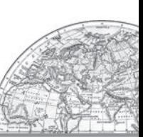
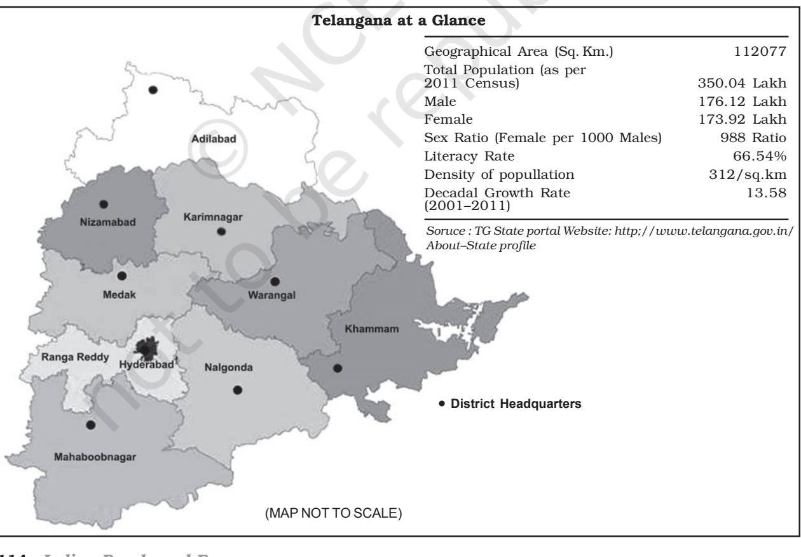

| State/UT | India/State/ | Total Population | National | Density | Decadal growth |
| --- | --- | --- | --- | --- | --- |
| Code | Union Territory # | Persons | Share (%) |  | rate 2001-11 |
|  | India | 1210193422 | 100 | 382 | 17.64 |
| 01 | Jammu & Kashmir | 12,548,926 | 1.04 | 124 | 23.71 |
| 02 | Himachal Pradesh | 6,856,509 | 0.57 | 123 | 12.81 |
| 03 | Punjab | 27,704,236 | 2.29 | 550 | 13.73 |
| 04 | Chandigarh # | 1,054,686 | 0.09 | 9,252 | 17.10 |
| 05 | Uttarakhand | 10,116,752 | 0.84 | 189 | 19.17 |
| 06 | Haryana | 25,353,081 | 2.09 | 573 | 19.90 |
| 07 | NCT of Delhi # | 16,753,235 | 1.38 | 11,297 | 20.96 |
| 08 | Rajasthan | 68,621,012 | 5.67 | 201 | 21.44 |
| 09 | Uttar Pradesh | 199,581,477 | 16.49 | 828 | 20.09 |
| 10 | Bihar | 103,804,637 | 8.58 | 1,102 | 25.07 |
| 11 | Sikkim | 607,688 | 0.05 | 86 | 12.36 |
| 12 | Arunachal Pradesh | 1,382,611 | 0.11 | 17 | 25.92 |
| 13 | Nagaland | 1,980,602 | 0.16 | 119 | -0.47 |
| 14 | Manipur | 2,721,756 | 0.22 | 122 | 18.65 |
| 15 | Mizoram | 1,091,014 | 0.09 | 52 | 22.78 |
| 16 | Tripura | 3,671,032 | 0.30 | 350 | 14.75 |
| 17 | Meghalaya | 2,964,007 | 0.24 | 132 | 27.82 |
| 18 | Assam | 31,169,272 | 2.58 | 397 | 16.93 |
| 19 | West Bengal | 91,347,736 | 7.55 | 1,029 | 13.93 |
| 20 | Jharkhand | 32,966,238 | 2.72 | 414 | 22.34 |
| 21 | Orissa | 41,947,358 | 3.47 | 269 | 13.97 |
| 22 | Chhattisgarh | 25,540,196 | 2.11 | 189 | 22.59 |
| 23 | Madhya Pradesh | 72,597,565 | 6.00 | 236 | 20.30 |
| 24 | Gujarat | 60,383,628 | 4.99 | 308 | 19.17 |
| 25 | Daman & Diu # | 242,911 | 0.02 | 2,169 | 53.54 |
| 26 | Dadra & Nagar Haveli # | 342,853 | 0.03 | 698 | 55.50 |
| 27 | Maharashtra | 112,372,972 | 9.29 | 365 | 15.99 |
| 28 | Andhra Pradesh | 84,665,533 | 7.00 | 308 | 11.10 |
| 29 | Karnataka | 61,130,704 | 5.05 | 319 | 15.67 |
| 30 | Goa | 1,457,723 | 0.12 | 394 | 8.17 |
| 31 | Lakshadweep # | 64,429 | 0.01 | 2,013 | 6.23 |
| 32 | Kerala | 33,387,677 | 2.76 | 859 | 4.86 |
| 33 | Tamil Nadu | 72,138,958 | 5.96 | 555 | 15.60 |
| 34 | Puducherry # | 1,244,464 | 0.10 | 2598 | 27.72 |
| 35 | Andaman & Nicobar Islands # | 379,944 | 0.03 | 46 | 6.68 |

Appendix (i) *India: State-wise Population Distribution, Density and Growth, 2011*

*Source : Census of India, 2011*

106 *India : People and Economy*

#### **Appendix (ii)**

| Decades | Crude Birth | Crude Death | Rate of Natural |
| --- | --- | --- | --- |
|  | Rate Per 1000 | Rate Per 1000 | Increase (Per 1000) |
| 1901 - 1911 | 49.2 | 42.6 | 6.6 |
| 1911 - 1921 | 48.1 | 47.2 | 0.9 |
| 1921 - 1931 | 46.4 | 36.2 | 10.2 |
| 1931 - 1941 | 45.9 | 37.2 | 8.7 |
| 1941 - 1951 | 39.9 | 27.4 | 12.5 |
| 1951 - 1961 | 41.7 | 22.8 | 18.9 |
| 1961 - 1971 | 41.1 | 19.0 | 22.1 |
| 1971 - 1981 | 37.2 | 15 | 22.2 |
| 1981 - 1991 | 29.5 | 9.8 | 19.7 |
| 1991 - 2001 | 25.4 | 8.4 | 17.0 |
| 2001 - 2011 | 21.8 | 7.1 | 14.7 |

| India : Decadel Birth Rate, Death Rate and Rate of Natural Increase, 1901 – 2011 |
| --- |

** Source: Sample Registration System (SRS) Bulletin, October 2012*

*Appendices* **107**

| State/UT Code | India/State/ Union Territory | Population |  | Percentage of Urban Population |
| --- | --- | --- | --- | --- |
|  |  | Rural | Urban |  |
|  | India | 833087662 | 377,105,760 | 31.16 |
| 01 | Jammu & Kashmir | 9,134,820 | 3,414,106 | 27.21 |
| 02 | Himachal Pradesh | 6,167,805 | 688,704 | 10.04 |
| 03 | Punjab | 17,316,800 | 10,387,436 | 37.49 |
| 04 | Chandigarh | 29,004 | 1,025,682 | 97.25 |
| 05 | Uttarakhand | 7,025,583 | 3,091,169 | 30.55 |
| 06 | Haryana | 16,531,493 | 8,821,588 | 34.79 |
| 07 | NCT of Delhi | 419,319 | 16,333,916 | 97.50 |
| 08 | Rajasthan | 51,540,236 | 17,080,776 | 24.89 |
| 09 | Uttar Pradesh | 155,111,022 | 44,470,455 | 22.28 |
| 10 | Bihar | 92,075,028 | 11,729,609 | 11.30 |
| 11 | Sikkim | 455,962 | 151,726 | 24.97 |
| 12 | Arunachal Pradesh | 1,069,165 | 313,446 | 22.67 |
| 13 | Nagaland | 1,406,861 | 573,741 | 28.97 |
| 14 | Manipur | 1,899,624 | 822,132 | 30.21 |
| 15 | Mizoram | 529,037 | 561,977 | 51.51 |
| 16 | Tripura | 2,710,051 | 960,981 | 26.18 |
| 17 | Meghalaya | 2,368,971 | 595,036 | 20.08 |
| 18 | Assam | 26,780,516 | 4,388,756 | 14.08 |
| 19 | West Bengal | 62,213,676 | 29,134,060 | 31.89 |
| 20 | Jharkhand | 25,036,946 | 7,929,292 | 24.05 |
| 21 | Orissa | 34,951,234 | 6,996,124 | 16.68 |
| 22 | Chhattisgarh | 19,603,658 | 5,936,538 | 23.24 |
| 23 | Madhya Pradesh | 52,537,899 | 20,059,666 | 27.63 |
| 24 | Gujarat | 34,670,817 | 25,712,811 | 42.58 |
| 25 | Daman & Diu | 60,331 | 182,580 | 75.16 |
| 26 | Dadra & Nagar Haveli | 183,024 | 159,829 | 46.62 |
| 27 | Maharashtra | 61,545,441 | 50,827,531 | 45.23 |
| 28 | Andhra Pradesh | 56,311,788 | 28,353,745 | 33.49 |
| 29 | Karnataka | 37,552,529 | 23,578,175 | 38.57 |
| 30 | Goa | 551,414 | 906,309 | 62.17 |
| 31 | Lakshadweep | 14,121 | 50,308 | 78.08 |
| 32 | Kerala | 17,455,506 | 15,932,171 | 47.72 |
| 33 | Tamil Nadu | 37,189,229 | 34,949,729 | 48.45 |
| 34 | Puducherry | 394,341 | 850,123 | 68.31 |
| 35 | Andaman & Nicobar Islands | 244,411 | 135,533 | 35.67 |

#### Appendix (iii) India: Rural and Urban Population 2011

108 *India : People and Economy*

#### Appendix (iv)

#### *India : % of Population of Religious Groups*

| States/ | Hindus | Muslims | Christians | Sikhs | Buddhists | Jains | Other | Religions |
| --- | --- | --- | --- | --- | --- | --- | --- | --- |
| Union |  |  |  |  |  |  | Relgions | not |
| Territories |  |  |  |  |  |  |  | stated |
| Jammu & Kashmir | 28.44 | 68.31 | 0.28 | 1.87 | 0.90 | 0.02 | 0.01 | 0.16 |
| Himachal Pradesh | 95.17 | 2.18 | 0.18 | 1.16 | 1.15 | 0.03 | 0.01 | 0.12 |
| Punjab | 38.49 | 1.93 | 1.26 | 57.69 | 0.12 | 1.16 | 0.04 | 0.32 |
| Chandigarh | 80.78 | 4.87 | 0.83 | 13.11 | 0.11 | 0.19 | 0.02 | 0.10 |
| Uttarakhand | 82.97 | 13.95 | 0.37 | 2.34 | 0.15 | 0.09 | 0.01 | 0.12 |
| Haryana | 87.46 | 7.03 | 0.20 | 4.91 | 0.03 | 0.21 | 0.01 | 0.17 |
| Delhi | 81.68 | 12.86 | 0.87 | 3.40 | 0.11 | 0.99 | 0.01 | 0.08 |
| Rajasthan | 88.49 | 9.07 | 0.14 | 1.27 | 0.02 | 0.91 | 0.01 | 0.10 |
| Uttar Pradesh | 79.73 | 19.26 | 0.18 | 0.32 | 0.10 | 0.11 | 0.01 | 0.29 |
| Bihar | 82.69 | 16.87 | 0.12 | 0.02 | 0.02 | 0.02 | 0.01 | 0.24 |
| Sikkim | 57.76 | 1.62 | 9.91 | 0.31 | 27.39 | 0.05 | 2.67 | 0.30 |
| Arunachal Pradesh 29.04 |  | 1.95 | 30.26 | 0.24 | 11.77 | 0.06 | 26.20 | 0.48 |
| Nagaland | 8.75 | 2.47 | 87.93 | 0.10 | 0.34 | 0.13 | 0.16 | 0.12 |
| Manipur | 41.39 | 8.40 | 41.29 | 0.05 | 0.25 | 0.06 | 8.19 | 0.38 |
| Mizoram | 2.75 | 1.35 | 87.16 | 0.03 | 8.51 | 0.03 | 0.07 | 0.09 |
| Tripura | 83.40 | 8.60 | 4.32 | 0.03 | 3.41 | 0.02 | 0.04 | 0.14 |
| Meghalaya | 11.53 | 4.40 | 74.59 | 0.10 | 0.33 | 0.02 | 8.71 | 0.32 |
| Assam | 61.47 | 34.22 | 3.74 | 0.07 | 0.18 | 0.08 | 0.09 | 0.16 |
| West Bengal | 70.54 | 27.01 | 0.72 | 0.07 | 0.31 | 0.07 | 1.03 | 0.25 |
| Jharkhand | 67.83 | 14.53 | 4.30 | 0.22 | 0.03 | 0.05 | 12.84 | 0.21 |
| Orissa | 93.63 | 2.17 | 2.77 | 0.05 | 0.03 | 0.02 | 1.14 | 0.18 |
| Chhattisgarh | 93.25 | 2.02 | 1.92 | 0.27 | 0.28 | 0.24 | 1.94 | 0.09 |
| Madhya Pradesh | 90.89 | 6.57 | 0.29 | 0.21 | 0.30 | 0.78 | 0.83 | 0.13 |
| Gujarat | 88.57 | 9.67 | 0.52 | 0.10 | 0.05 | 0.96 | 0.03 | 0.10 |
| Daman & Diu | 90.50 | 7.92 | 1.16 | 0.07 | 0.09 | 0.21 | 0.03 | 0.10 |
| Dadra & Nagar |  |  |  |  |  |  |  |  |
| Haveli | 93.93 | 3.76 | 1.49 | 0.06 | 0.18 | 0.35 | 0.09 | 0.14 |
| Maharashtra | 79.83 | 11.54 | 0.96 | 0.20 | 5.81 | 1.25 | 0.16 | 0.25 |
| Andhra Pradesh | 88.46 | 9.56 | 1.34 | 0.05 | 0.04 | 0.06 | 0.01 | 0.48 |
| Karnataka | 84.00 | 12.92 | 1.87 | 0.05 | 0.16 | 0.72 | 0.2 | 0.27 |
| Goa | 66.08 | 8.33 | 25.10 | 0.10 | 0.08 | 0.08 | 0.02 | 0.21 |
| Lakshadweep | 2.77 | 96.58 | 0.49 | 0.01 | 0.02 | 0.02 | 0.01 | 0.10 |
| Kerala | 54.73 | 26.56 | 18.38 | 0.01 | 0.01 | 0.01 | 0.02 | 0.26 |
| Tamil Nadu | 87.58 | 5.86 | 6.12 | 0.02 | 0.02 | 0.12 | 0.01 | 0.26 |
| Puducherry | 87.30 | 6.05 | 6.29 | 0.02 | 0.04 | 0.11 | 0.01 | 0.17 |
| Andaman & |  |  |  |  |  |  |  |  |
| Nicobar Islands | 69.45 | 8.52 | 21.28 | 0.34 | 0.09 | 0.01 | 0.15 | 0.18 |

*Source : Census of India, 2011*

*Appendices* 109

| States/UTs | Work | Cultivators | % to | Agricultural | % to | Household | % to | Other | % to | Participation | Total | Labourers | Total | Industries | Total | Workers | Total |  |  |
| --- | --- | --- | --- | --- | --- | --- | --- | --- | --- | --- | --- | --- | --- | --- | --- | --- | --- | --- | --- |
| Rate (%) | Workers | Workers | Workers | Workers |  |  |  |  |  |  |  |  |  |  |  |  |  |  |  |
| INDIA | 39.8 | 11,86,92,640 | 24.6 | 14,43,29,833 | 30 | 1,83,36,307 | 3.8 | 20,03,84.531 | 41.6 | Jammu & Kashmir | 34.5 | 12,45,316 | 28.8 | 5,47,705 | 12.7 | 1,72,586 | 4 | 23,57,106 | 54.5 |
| Himachal Pradesh | 51.9 | 20,62,062 | 57.9 | 1,75,038 | 4.9 | 58,719 | 1.6 | 12,63,603 | 35.5 | Punjab | 35.7 | 19,34,511 | 19.5 | 15,88,455 | 16 | 3,85,960 | 3.9 | 59,88,436 | 60.5 |
| Chandigarh | 38.3 | 2,578 | 0.6 | 1,687 | 0.4 | 4,799 | 1.2 | 3,95,072 | 97.8 | Uttarakhand | 38.4 | 15,80,423 | 40.8 | 4,03,301 | 10.4 | 1,14,312 | 3 | 17,74,239 | 45.8 |
| Haryana | 35.2 | 24,80,801 | 27.8 | 15,28,133 | 17.1 | 2,62,280 | 2.9 | 46,45,294 | 52.1 | NCT of Delhi | 33.3 | 33,398 | 0.6 | 39,475 | 0.7 | 1,81,852 | 3.3 | 53,32,324 | 95.4 |
| Rajasthan | 43.6 | 1,36,18,870 | 45.6 | 49,39,664 | 16.5 | 7,20,573 | 2.4 | 1,06,07,148 | 35.5 | Uttar Pradesh | 32.9 | 1,90,57,888 | 29 | 1,99,39,223 | 30.3 | 38,98,590 | 5.9 | 2,29,19,014 | 34.8 |
| Bihar | 33.4 | 71,96,226 | 20.7 | 1,83,45,649 | 52.8 | 14,11,208 | 4.1 | 77,71,904 | 22.4 | Sikkim | 50.5 | 1,17,401 | 38.1 | 25,986 | 8.4 | 5,143 | 1.7 | 1,59,608 | 51.8 |
| Arunachal Pradesh | 42.5 | 3,02,723 | 51.5 | 36,171 | 6.2 | 8,365 | 1.4 | 2,40,398 | 40.9 | Nagaland | 49.2 | 5,37,702 | 55.2 | 62,962 | 6.5 | 22,838 | 2.3 | 3,50,620 | 36 |
| Manipur | 45.1 | 4,57,891 | 39.5 | 1,11,061 | 9.6 | 89,495 | 7.7 | 5,00,606 | 43.2 | Mizoram | 44.4 | 2,29,603 | 47.2 | 41,787 | 8.6 | 7,852 | 1.6 | 2,07,463 | 42.6 |
| Tripura | 40 | 2,95,947 | 20.1 | 3,53,618 | 24.1 | 41,496 | 2.8 | 7,78,460 | 53 | Meghalaya | 40 | 4,94,675 | 41.7 | 1,98,364 | 16.7 | 20,488 | 1.7 | 4,72,092 | 39.8 |
| Assam | 38.4 | 40,61,627 | 33.9 | 18,45,346 | 15.4 | 4,91,321 | 4.1 | 55,71,396 | 46.5 | West Bengal | 38.1 | 51,16,668 | 14.7 | 1,01,88,842 | 29.3 | 24,64,124 | 7.1 | 1,69,86,701 | 48.9 |
| Jharkhand | 39.7 | 38,14,832 | 29.1 | 44,36,052 | 33.9 | 4,55,162 | 3.5 | 43,92,228 | 33.5 | Orissa | 41.8 | 41,03,989 | 23.4 | 67,39,993 | 38.4 | 7,83,080 | 4.5 | 59,14,527 | 33.7 |
| Chhattisgarh | 47.7 | 40,04,796 | 32.9 | 50,91,882 | 41.8 | 1,87,631 | 1.5 | 28,95,916 | 23.8 | Madhya Pradesh | 43.5 | 89,44,439 | 31.2 | 1,21,92,267 | 38.6 | 9,59,259 | 3 | 85,78,168 | 27.2 |
| Gujarat | 41 | 54,47,500 | 22 | 68,39,415 | 27.6 | 3,43,999 | 1.4 | 1,21,36,833 | 49 | Daman & Diu | 49.9 | 2,316 | 1.9 | 772 | 0.6 | 684 | 0.6 | 1,17,499 | 96.9 |
| D & N Haveli | 45.7 | 28,164 | 17.9 | 17,799 | 11.3 | 2,195 | 1.4 | 1,09,003 | 69.4 | Maharashtra | 44 | 1,25,69,373 | 25.4 | 1,34,86,140 | 27.3 | 12,25,426 | 2.5 | 2,21,46,939 | 44.8 |
| Andhra Pradesh | 46.6 | 64,91,522 | 16.5 | 1,69,67,754 | 43 | 14,39,137 | 3.7 | 1,45,24,493 | 36.8 | Karnataka | 45.6 | 65,80,649 | 23.6 | 71,55,963 | 25.7 | 9,13,227 | 3.3 | 1,32,22,758 | 47.4 |
| Goa | 39.6 | 31,354 | 5.4 | 26,760 | 4.6 | 14,708 | 2.5 | 5,04,426 | 87.4 | Lakshadweep | 29.1 | 0 | 0 | 0 | 0 | 264 | 1.4 | 18,489 | 98.6 |
| Kerala | 34.8 | 6,70,253 | 5.8 | 13,22,850 | 11.4 | 2,73,022 | 2.3 | 93,52,938 | 80.5 | Tamil Nadu | 45.6 | 42,48,457 | 12.9 | 96,06,547 | 29.2 | 13,64,893 | 4.2 | 1,76,64,784 | 53.7 |
| Puducherry | 35.7 | 12,099 | 2.7 | 68,391 | 15.4 | 7,892 | 1.8 | 3,56,586 | 80.1 | A & N Islands | 40.1 | 16,567 | 10.9 | 4,781 | 3.1 | 3,727 | 2.4 | 1,27,460 | 83.6 |

# Appendix (v) *India: Work Participation Rate and Occupation Structure, 2011*

*Source : Census of India, 2011*

110 *India : People and Economy*

#### Appendix (vi)

| Land Use Classes | 1950–51 | Per cent | 2014–15 | Per cent |
| --- | --- | --- | --- | --- |
|  | (Million Hectare) |  | (Million Hectare) |  |
| Reporting Area | 284.32 | 100 | 307.82 | 100 |
| Forests | 40.48 | 17.0 | 71.79 | 23.3 |
| Area under non-agricultural use | 9.36 | 3.2 | 26.88 | 8.7 |
| Barren and unculturable waste Land | 38.16 | 13.4 | 17.00 | 5.5 |
| Permanent Pasturer and Grazing Land | 6.68 | 2.3 | 10.26 | 3.3 |
| Area under Misc. Tree crops and Groves | 19.83 | 6.9 | 3.10 | 1.0 |
| Culturable Waste Land | 22.94 | 8.0 | 12.47 | 4.0 |
| Fallow other than Current Fallow | 17.45 | 6.1 | 11.09 | 3.6 |
| Current Fallow | 10.68 | 3.7 | 15.09 | 4.9 |
| Net Area Sown | 118.75 | 41.7 | 140.13 | 45.5 |

#### *Table 1: Land Use Categories in India 2014–15*

*Source : Land use statistics 2014–2015. Directorate of Economics & Statistics, DAC & FW.*

#### *Table 2: India's position in World Agriculture*

| S. No. | Crop | % Share in World Production and rank |
| --- | --- | --- |
|  |  | (2018) |
| 1 | Rice | 22.07 (Second) |
| 2 | Wheat | 13.58 (Second) |
| I | Total Cereals | 10.74 (Third) |
| II | All Pulses | 27.63 (First) |
| 8 | Groundnut | 18.18 (Second) |
| 9 | Rape seed | 11.24 (Third) |
| 10 | Jute | 53.72 (First) |
| 11 | Sugarcane | 19.76 (Second) |
| 12 | Tea | 21.22 (Second) |
| 13 | Coffee | 3.17 (Eight) |

*Source:* FAOSTAT (as on 23.12.2020), Pocket Book of Agriculture Statistics, 2020.

#### Table 3 : Three Largest Producing States of major crops during 2019-20

*Production - Million Tonnes*

| Group of Crops | Crops | States | Production* |
| --- | --- | --- | --- |
| (1) | (2) | (3) | (4) |
| 1 . Foodgrains |  |  |  |
|  | Rice | West Bengal | 15.57 |
|  |  | Uttar Pradesh | 15.52 |
|  |  | Punjab | 11.78 |
|  |  | All India | 118.43 |
|  | Wheat | Uttar Pradesh | 32.59 |
|  |  | Madhya Pradesh | 19.61 |
|  |  | Punjab | 17.57 |
|  |  | All India | 107.59 |
|  | Maize | Karnataka | 3.96 |
|  |  | Madhya Pradesh | 3.91 |
|  |  | Telangana | 3.00 |
|  |  | All India | 28.64 |
|  | Total Nutri/Coarse Cereals | Rajasthan | 7.29 |
|  |  | Karnataka | 6.45 |
|  |  | Madhya Pradesh | 4.82 |
|  |  | All India | 47.48 |
|  | Total Pulses | Rajasthan | 4.49 |
|  |  | Maharashtra | 4.03 |
|  |  | Madhya Pradesh | 3.80 |
|  |  | All India | 23.15 |
|  | Total Foodgrains | Uttar Pradesh | 55.03 |
|  |  | Madhya Pradesh | 33.03 |
|  |  | Punjab | 30.02 |
|  |  | All India | 296.65 |
| II. Oilseeds |  |  |  |
|  | Groundnut | Gujarat | 4.64 |
|  |  | Rajasthan | 1.62 |
|  |  | Tamilnadu | 0.98 |
|  |  | All India | 10.10 |
|  | Rapesseed & Mustard | Rajasthan | 4.22 |
|  |  | Haryana | 1.15 |
|  |  | Uttar Pradesh | 0.96 |
|  |  | All India | 9.12 |
|  | Soyabean | Madhya Pradesh | 5.15 |
|  |  | Maharashtra | 4.60 |
|  |  | Rajasthan | 0.52 |
|  |  | All India | 11.22 |
|  | Sunflower | Karnataka | 0.12 |
|  |  | Odisha | 0.03 |
|  |  | Bihar | 0.01 |
|  |  | All India | 0.22 |

112 *India : People and Economy*

Table 3 : *(Contd.)*

*Production - Million Tonnes*

| Group of Crops | Crops | States | Production |
| --- | --- | --- | --- |
| (1) | (2) | (3) | (4) |
|  | Total Oilseeds | Rajasthan | 6.79 |
|  |  | Gujarat | 6.66 |
|  |  | Madhya Pradesh | 6.57 |
|  |  | All India | 33.42 |
| III. Other Cash Crops |  |  |  |
|  | Sugarcane | Uttar Pradesh | 178.42 |
|  |  | Maharashtra | 64.67 |
|  |  | Karnataka | 31.60 |
|  |  | All India | 355.70 |
|  | Cotton@ | Gujarat | 8.28 |
|  |  | Telangana | 6.83 |
|  |  | Maharashtra | 6.782 |
|  |  | All India | 35.491 |
|  | Jute & Mesta$ | West Bengal | 8.0572 |
|  |  | Bihar | 0.86 |
|  |  | Assam | 0.77 |
|  |  | All India | 9.91 |

*Source : Directorate of Economics and Statistics, Pocket Book of Agricultural Statistics, 2020.*

** Production Estimates are as per 4th Advance Estimates.*

@ : Production in million bales of 170 kg each.

$ : Production in million bales of 180 kg each.

*Appendices* 113

- 114 *India : People and Economy*
# **GLOSSARY**

# **Agro-climatic**

The climatic and land resource conditions in totality which are crucial for the development of agriculture and allied economic conditions of a region.

# **Aquifer**

A saturated geological unit (e.g. sands, gravels, fractured rock) which can yield water to wells at a sufficient rate to support a well.

## **Artificial Recharge to Groundwater**

Artificial Recharge to Groundwater means the process by which groundwater reservoir is augmented at a rate exceeding that under natural condition of replenishment.

## **Command Area**

The area served by a canal system through supply of water for irrigation and other purposes.

#### **Culturable command area**

It refers to the culturable land irrigated by a canal system. It is different from gross command area. The later includes all the area served by a canal system including unculturatble.

## **Eco-development**

The process of development of a region by means of conservation and regeneration of degraded ecosystem and ecological sustainability.

## **Emigration**

Movement of people from one place to another usually from one country to another with a purpose of earning, living, residing and settling.

#### **Extensive irrigation**

A strategy of irrigation development where the emphasis is on providing irrigation water for a large area. Per unit area use of water is low in this case.

#### **Flow system or channel**

A channel of canal where water flows under the influence of gravity.

## **Groundwater**

Groundwater means the water which exists below the ground surface in the zone of saturation and can be extracted through wells or any other means or emerges as springs and base flows in streams and rivers.

## **Groundwater Table**

The top of the zone in which all pore spaces or fissures are totally filled with water.

#### **Immigration**

Movement of a person as a permanent resident into another area, usually into a foreign country.

## **Intrusive irrigation**

A strategy of irrigation development where per unit application of water is high.

#### **Lift system or channel**

A channel of canal where water is forced to flow against the slope of land by upliftment.

# **Migration**

Movement of the people for the specific purpose from one place to another in the country or to a foreign country.

#### **Migration stream**

Migration stream refers to a group of migrants with the common origin and destination.

# **Net migration or balance of migration**

The difference of total numbers of persons arrived in and left out the place. In other words, it is sum of in migrants and immigrants minus sum of out migrants and emigrants. In mathematical term it is defined as:

# **Net migration**

(in migrants + immigrants) - (out migrants + emigrants)

#### **Rainwater Harvesting**

Rain Water Harvesting is the technique of collection and storage of rain water at surface or in sub-surface aquifer.

# **Refugee**

People who are forced to take shelter in other country due to life threatening situation, insecurity, war or violation of human rights in their own country.

# **Remittance**

All cash or kinds sent by the migrants to their place of origin. Money order is one form of remittance.

#### **Transhuemance**

The practice of seasonal migration where the pastoral communities migrate to the pastures along with their herds during summer season. These communities return to their permanent residence in winter.

# **Warebandi system**

It is a system of equitable distribution of water in the command area of canal outlet.

## **Watershed**

A watershed is a natural geo-hydrological unit of land, which collects water and drains it through a common point by a system of streams. Such a unit can be a small area of a few hectares or it could be an area of hundreds of square kilometres like the Ganga river basin.

