Can you identify and name the various items used in making life comfortable in our villages and towns. List the items and name the material used in their making.

Everything available in our environment which can be used to satisfy our needs, provided, it is technologically accessible, economically feasible and culturally acceptable can be termed as 'Resource'.

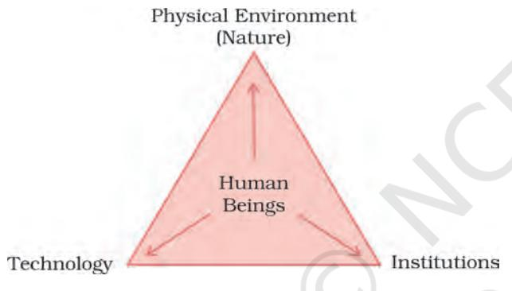

*Fig. 1.1: Interdependent relationship between nature, technology and institutions*

The process of transformation of things available in our environment involves an interactive relationship between nature, technology and institutions. Human beings interact with nature through technology and create institutions to accelerate their economic development.

Do you think that resources are free gifts of nature as is assumed by many? They are not. Resources are a function of human activities. Human beings themselves are essential components of resources. They transform material available in our environment into resources and use them. These resources can be classified in the following ways –

- (a) On the basis of origin biotic and abiotic
- (b) On the basis of exhaustibility renewable and non-renewable
- (c) On the basis of ownership individual, community, national and international
- (d) On the basis of status of development potential, developed stock and reserves.

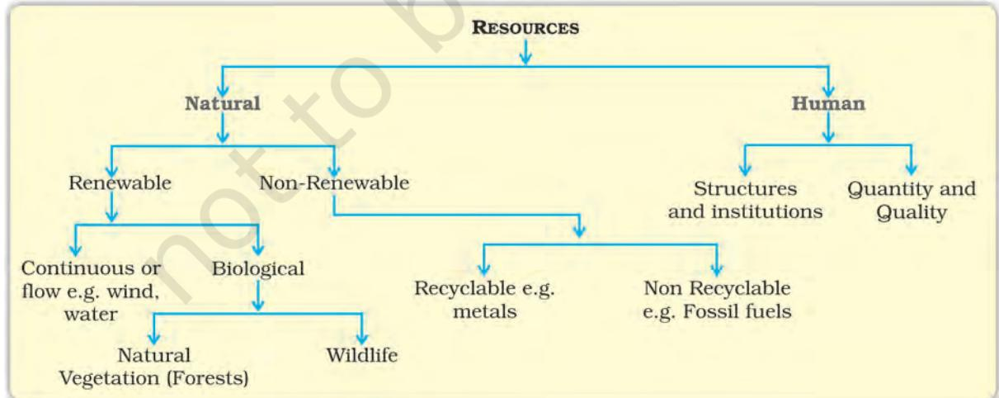

*Fig. 1.2: Classification of resources*

# DEVELOPMENT OF RESOURCES

Resources are vital for human survival as well as for maintaining the quality of life. It was believed that resources are free gifts of nature. As a result, human beings used them indiscriminately and this has led to the following major problems.

- Depletion of resources for satisfying the greed of a few individuals.
- Accumulation of resources in few hands, which, in turn, divided the society into two segments i.e. haves and have nots or rich and poor.
- Indiscriminate exploitation of resources has led to global ecological crises such as, global warming, ozone layer depletion, environmental pollution and land degradation.

- **1.** Imagine, if the oil supply gets exhausted one day, how would this affect our life style?
- **2.** Plan a survey in your colony/village to investigate people's attitude towards recycling of the domestic/agricultural wastes. Ask questions about :
	- (a) What do they think about resources they use?
	- (b) What is their opinion about the wastes, and its utilisation?

An equitable distribution of resources has become essential for a sustained quality of life and global peace. If the present trend of resource depletion by a few individuals and countries continues, the future of our planet is in danger.

Therefore, resource planning is essential for sustainable existence of all forms of life. Sustainable existence is a component of sustainable development.

### **Sustainable development**

Sustainable economic development means 'development should take place without damaging the environment, and development in the present should not compromise with the needs of the future generations.'

## **Rio de Janeiro Earth Summit, 1992**

In June 1992, more than 100 heads of states met in Rio de Janeiro in Brazil, for the first International Earth Summit. The Summit was convened for addressing urgent problems of environmental protection and socioeconomic development at the global level. The assembled leaders signed the Declaration on Global Climatic Change and Biological Diversity. The Rio Convention endorsed the global Forest Principles and adopted *Agenda 21* for achieving Sustainable Development in the 21st century.

### **Agenda 21**

It is the declaration signed by world leaders in 1992 at the United Nations Conference on Environment and Development (UNCED), which took place at Rio de Janeiro, Brazil. It aims at achieving global sustainable development. It is an agenda to combat environmental damage, poverty, disease through global co-operation on common interests, mutual needs and shared responsibilities. One major objective of the Agenda 21 is that every local government should draw its own local Agenda 21.

# RESOURCE PLANNING

Planning is the widely accepted strategy for judicious use of resources. It has importance in a country like India, which has enormous diversity in the availability of resources. There are regions which are rich in certain types of resources but are deficient in some other

resources. There are some regions which can be considered self sufficient in terms of the availability of resources and there are some regions which have acute shortage of some vital resources. For example, the states of Jharkhand, Chhattisgarh and Madhya Pradesh are rich in minerals and coal deposits. Arunachal Pradesh has abundance of water resources but lacks in infrastructural development. The state of Rajasthan is very well endowed with solar and wind energy but lacks in water resources. The cold desert of Ladakh is relatively isolated from the rest of the country. It has very rich cultural heritage but it is deficient in water, infrastructure and some vital minerals. This calls for balanced resource planning at the national, state, regional and local levels.

Prepare a list of resources found in your state and also identify the resources that are important but deficit in your state.

### Resource Planning in India

Resource planning is a complex process which involves : (i) identification and inventory of resources across the regions of the country. This involves surveying, mapping and qualitative and quantitative estimation and measurement of the resources. (ii) Evolving a planning structure endowed with appropriate technology, skill and institutional set up for implementing resource development plans. (iii) Matching the resource development plans with overall national development plans.

India has made concerted efforts for achieving the goals of resource planning right from the First Five Year Plan launched after Independence.

The availability of resources is a necessary condition for the development of any region, but mere availability of resources in the absence of corresponding changes in

What resources are being developed in your surroundings by the community/village panchayats/ward level communities with the help of community participation?

technology and institutions may hinder development. There are many regions in our country that are rich in resources but these are included in economically backward regions. On the contrary there are some regions which have a poor resource base but they are economically developed.

*Can you name some resource rich but economically backward regions and some resource poor but economically developed regions? Give reasons for such a situation.*

The history of colonisation reveals that rich resources in colonies were the main attractions for the foreign invaders. It was primarily the higher level of technological development of the colonising countries that helped them to exploit resources of other regions and establish their supremacy over the colonies. Therefore, resources can contribute to development only when they are accompanied by appropriate technological development and institutional changes. India has experienced all this in different phases of colonisation. Therefore, in India, development, in general, and resource development in particular does not only involve the availability of resources, but also the technology, quality of human resources and the historical experiences of the people.

*Conservation of Resources:* Resources are vital for any developmental activity. But irrational consumption and over-utilisation of resources may lead to socio-economic and environmental problems. To overcome these problems, resource conservation at various levels is important. This had been the main concern of the leaders and thinkers in the past. For example, Gandhiji was very apt in voicing his concern about resource conservation in these words: "There is enough

RESOURCES AND DEVELOPMENT 3

for everybody's need and not for any body's greed." He placed the greedy and selfish individuals and exploitative nature of modern technology as the root cause for resource depletion at the global level. He was against mass production and wanted to replace it with the production by the masses.

At the international level, the Club of Rome advocated resource conservation for the first time in a more systematic way in 1968. Subsequently, in 1974, Gandhian philosophy was once again presented by Schumacher in his book **Small is Beautiful**. The seminal contribution with respect to resource conservation at the global level was made by the Brundtland Commission Report, 1987. This report introduced the concept of 'Sustainable Development' and advocated it as a means for resource conservation, which was subsequently published in a book entitled **Our Common Future**. Another significant contribution was made at the Earth Summit at Rio de Janeiro, Brazil in 1992.

# LAND RESOURCES

We live on land, we perform our economic activities on land and we use it in different ways. Thus, land is a natural resource of utmost importance. It supports natural vegetation, wild life, human life, economic activities, transport and communication systems. However, land is an asset of a finite magnitude, therefore, it is important to use the

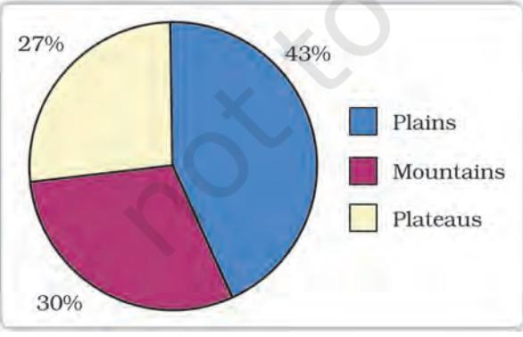

4 CONTEMPORARY INDIA – II

available land for various purposes with careful planning.

India has land under a variety of relief features, namely; mountains, plateaus, plains and islands. About 43 per cent of the land area is plain, which provides facilities for agriculture and industry. Mountains account for 30 per cent of the total surface area of the country and ensure perennial flow of some rivers, provide facilities for tourism and ecological aspects. About 27 per cent of the area of the country is the plateau region. It possesses rich reserves of minerals, fossil fuels and forests.

# LAND UTILISATION

Land resources are used for the following purposes:

- 1. Forests
- 2. Land not available for cultivation (a) Barren and waste land
	- (b) Land put to non-agricultural uses, e.g. buildings, roads, factories, etc.
- 3. Other uncultivated land (excluding fallow land)
	- (a) Permanent pastures and grazing land,
	- (b) Land under miscellaneous tree crops groves (not included in net sown area),
	- (c) Cultruable waste land (left uncultivated for more than 5 agricultural years).
- 4. Fallow lands
	- (a) Current fallow-(left without cultivation for one or less than one agricultural year),
	- (b) Other than current fallow-(left uncultivated for the past 1 to 5 agricultural years).
- 5. Net sown area the physical extent of land on which crops are sown harvested is known as net sown area.

Area sown more than once in an agricultural year plus net sown area is known as *gross cropped area*.

# LAND USE PATTERN IN INDIA

The use of land is determined both by physical factors such as topography, climate, soil types as well as human factors such as population density, technological capability and culture and traditions etc.

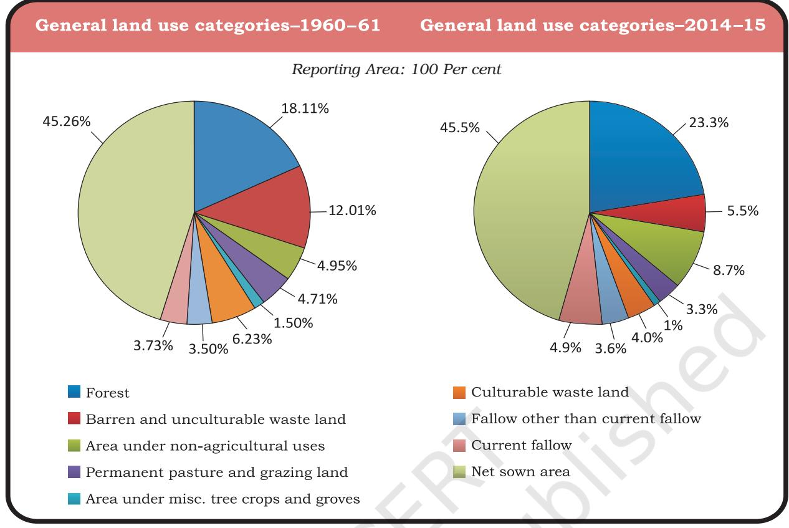

Total geographical area of India is 3.28 million sq km. Land use data, however, is available only for 93 per cent of the total geographical area because the land use reporting for most of the north-east states except Assam has not been done fully. Moreover, some areas of Jammu and Kashmir occupied by Pakistan and China have also not been surveyed.

Try to do a comparison between the two pie charts (Fig. 1.4 ) given for land use and find out why the net sown area and the land under forests have changed from 1960-61 to 2014-15 very marginally.

The land under permanent pasture has also decreased. How are we able to feed our huge cattle population on this pasture land and what are the consequences of it? Most of the other than the current fallow lands are either of poor quality or the cost of cultivation of such land is very high. Hence, these lands are cultivated once or twice in about two to three years and if these are included in the net sown area then the percentage of NSA in India comes to about 54 per cent of the total reporting area.

The pattern of net sown area varies greatly from one state to another. It is over 80 per cent of the total area in Punjab and Haryana and less than 10 per cent in Arunachal Pradesh, Mizoram, Manipur and Andaman Nicobar Islands.

Find out reasons for the low proportion of net sown area in these states.

Forest area in the country is far lower than the desired 33 per cent of geographical area, as it was outlined in the National Forest Policy (1952). It was considered essential for maintenance of the ecological balance. The livelihood of millions of people who live on the

RESOURCES AND DEVELOPMENT 5

fringes of these forests depends upon it. A part of the land is termed as waste land and land put to other non-agricultural uses. Waste land includes rocky, arid and desert areas and land put to other non-agricultural uses includes settlements, roads, railways, industry etc. Continuous use of land over a long period of time without taking appropriate measures to conserve and manage it, has resulted in land degradation. This, in turn, has serious repercussions on society and the environment.

# LAND DEGRADATION AND CONSERVATION MEASURES

We have shared our land with the past generations and will have to do so with the future generations too. Ninety-five per cent of our basic needs for food, shelter and clothing are obtained from land. Human activities have not only brought about degradation of land but have also aggravated the pace of natural forces to cause damage to land.

Some human activities such as deforestation, over grazing, mining and quarrying too have contributed significantly in land degradation.

Mining sites are abandoned after excavation work is complete leaving deep scars and traces of over-burdening. In states like Jharkhand, Chhattisgarh, Madhya Pradesh and Odisha deforestation due to mining have caused severe land degradation. In states like Gujarat, Rajasthan, Madhya Pradesh and Maharashtra overgrazing is one of the main reasons for land degradation. In the states of Punjab, Haryana, western Uttar Pradesh, over irrigation is responsible for land degradation due to water logging leading to increase in salinity and alkalinity in the soil. The mineral processing like grinding of limestone for cement industry and calcite and soapstone for ceramic industry generate huge quantity of dust in the atmosphere. It retards the process of infiltration of water into the soil after it settles down on the land. In recent years, industrial effluents as waste have become a major source of land and water pollution in many parts of the country.

There are many ways to solve the problems of land degradation. Afforestation and proper management of grazing can help to some extent. Planting of shelter belts of plants, control on over grazing, stabilisation of sand dunes by growing thorny bushes are some of the methods to check land degradation in arid areas. Proper management of waste lands, control of mining activities, proper discharge and disposal of industrial effluents and wastes after treatment can reduce land and water degradation in industrial and suburban areas.

## SOIL AS A RESOURCE

Soil is the most important renewable natural resource. It is the medium of plant growth and supports different types of living organisms on the earth. The soil is a living system. It takes millions of years to form soil upto a few cm in depth. Relief, parent rock or bed rock, climate, vegetation and other forms of life and time are important factors in the formation of soil. Various forces of nature such as change in temperature, actions of running water, wind and glaciers, activities of decomposers etc. contribute to the formation of soil. Chemical and organic changes which take place in the

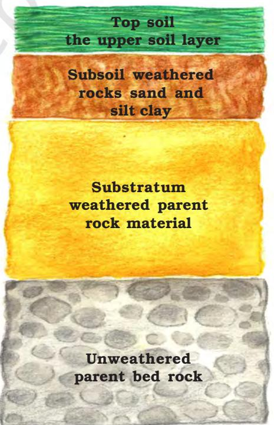

*Fig. 1.5: Soil Profile*

6 CONTEMPORARY INDIA – II

soil are equally important. Soil also consists of organic (humus) and inorganic materials (Fig. 1.5).

On the basis of the factors responsible for soil formation, colour, thickness, texture, age, chemical and physical properties, the soils of India are classified in different types.

## Classification of Soils

India has varied relief features, landforms, climatic realms and vegetation types. These have contributed in the development of various types of soils.

## *Alluvial Soils*

This is the most widely spread and important soil. In fact, the entire northern plains are made of alluvial soil. These have been deposited by three important Himalayan river systems – the Indus, the Ganga and the Brahmaputra. These soils also extend in Rajasthan and Gujarat through a narrow corridor. Alluvial soil is also found in the eastern coastal plains particularly in the deltas of the Mahanadi, the Godavari, the Krishna and the Kaveri rivers.

#### *Fig. 1.6: Alluvial Soil*

The alluvial soil consists of various proportions of sand, silt and clay. As we move inlands towards the river valleys, soil particles appear some what bigger in size. In the upper reaches of the river valley i.e. near the place of the break of slope, the soils are coarse. Such soils are more common in piedmont plains such as Duars, Chos and Terai.

Apart from the size of their grains or components, soils are also described on the basis of their age. According to their age alluvial soils can be classified as old alluvial (Bangar) and new alluvial (Khadar). The bangar soil has higher concentration of *kanker* nodules than the Khadar. It has more fine particles and is more fertile than the bangar.

Alluvial soils as a whole are very fertile. Mostly these soils contain adequate proportion of potash, phosphoric acid and lime which are ideal for the growth of sugarcane, paddy, wheat and other cereal and pulse crops. Due to its high fertility, regions of alluvial soils are intensively cultivated and densely populated. Soils in the drier areas are more alkaline and can be productive after proper treatment and irrigation.

# *Black Soil*

These soils are black in colour and are also known as *regur* soils. Black soil is ideal for growing cotton and is also known as *black cotton soil*. It is believed that climatic condition along with the parent rock material are the important factors for the formation of black soil. This type of soil is typical of the Deccan trap (*Basalt*) region spread over northwest Deccan plateau and is made up of lava flows. They cover the plateaus of Maharashtra, Saurashtra, Malwa, Madhya Pradesh and Chhattisgarh and extend in the south east direction along the Godavari and the Krishna valleys.

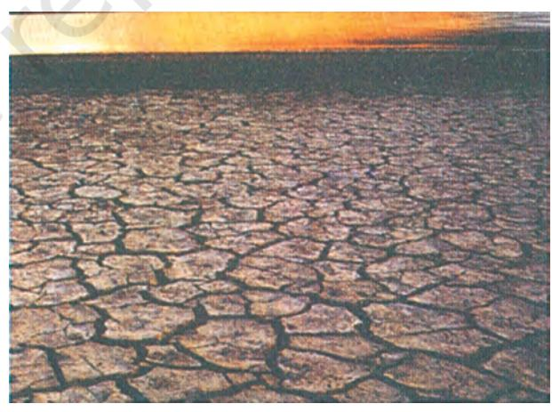

*Fig. 1.7: Black Soil*

The black soils are made up of extremely fine i.e. clayey material. They are well-known for their capacity to hold moisture. In addition, they are rich in soil nutrients, such as calcium carbonate, magnesium, potash and lime. These

RESOURCES AND DEVELOPMENT 7

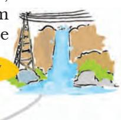

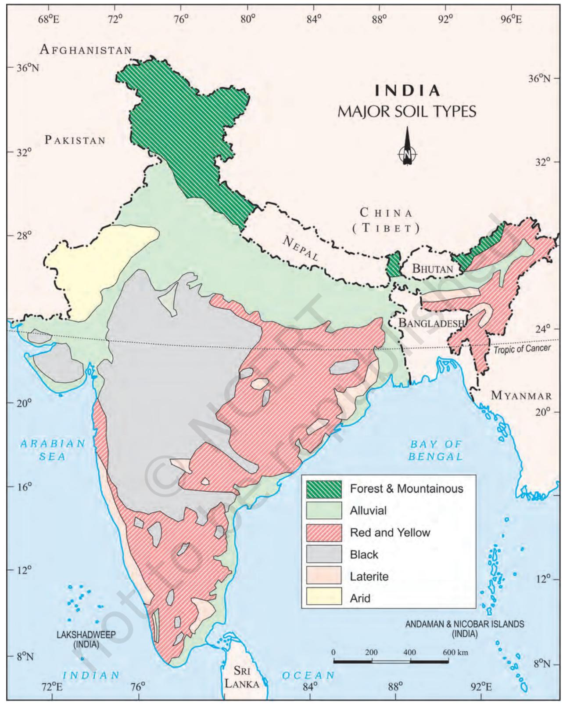

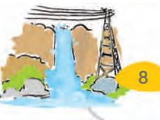

8 CONTEMPORARY INDIA – II

**India:** *Major Soil Types* soils are generally poor in phosphoric contents. They develop deep cracks during hot weather, which helps in the proper aeration of the soil. These soils are sticky when wet and difficult to work on unless tilled immediately after the first shower or during the pre-monsoon period.

#### *Red and Yellow Soils*

Red soil develops on crystalline igneous rocks in areas of low rainfall in the eastern and southern parts of the Deccan plateau. Yelllow and red soils are also found in parts of Odisha, Chhattisgarh, southern parts of the middle Ganga plain and along the piedmont zone of the Western Ghats. These soils develop a reddish colour due to diffusion of iron in crystalline and metamorphic rocks. It looks yellow when it occurs in a hydrated form.

#### *Laterite Soil*

Laterite has been derived from the Latin word 'later' which means brick. The laterite soil develops under tropical and subtropical climate with alternate wet and dry season. This soil is the result of intense leaching due to heavy rain. Lateritic soils are mostly deep to very deep, acidic (pH<6.0), generally deficient in plant nutrients and occur mostly in southern states, Western Ghats region of Maharashtra, Odisha, some parts of West Bengal and North-east regions. Where these soils support deciduous and evergreen forests, it is humus rich, but under sparse

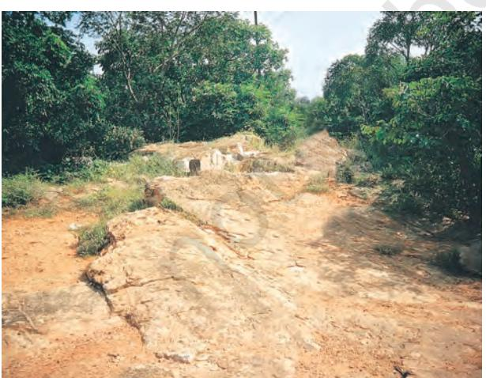

*Fig. 1.8: Laterite Soil*

vegetation and in semi-arid environment, it is generally humus poor. They are prone to erosion and degradation due to their position on the landscape. After adopting appropriate soil conservation techniques particularly in the hilly areas of Karnataka, Kerala and Tamil Nadu, this soil is very useful for growing tea and coffee. Red laterite soils in Tamil Nadu, Andhra Pradesh and Kerala are more suitable for crops like cashew nut.

#### *Arid Soils*

Arid soils range from red to brown in colour. They are generally sandy in texture and saline in nature. In some areas the salt content is very high and common salt is obtained by evaporating the water. Due to the dry climate, high temperature, evaporation is faster and the soil lacks humus and moisture. The lower horizons of the soil are occupied by *Kankar* because of the increasing calcium content downwards. The *Kankar* layer formations in the bottom horizons restrict the infiltration of water. After proper irrigation these soils become cultivable as has been in the case of western Rajasthan.

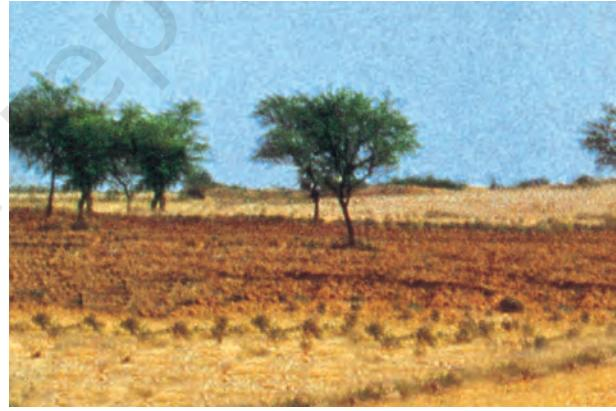

*Fig. 1.9: Arid Soil*

#### *Forest Soils*

These soils are found in the hilly and mountainous areas where sufficient rain forests are available. The soils texture varies according to the mountain environment where they are formed. They are loamy and silty in valley sides and coarse grained in the upper slopes. In the snow covered areas

RESOURCES AND DEVELOPMENT 9

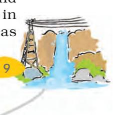

of Himalayas, these soils experience denudation and are acidic with low humus content. The soils found in the lower parts of the valleys particularly on the river terraces and alluvial fans are fertile.

# Soil Erosion and Soil Conservation

The denudation of the soil cover and subsequent washing down is described as soil erosion. The processes of soil formation and erosion, go on simultaneously and generally there is a balance between the two. Sometimes, this balance is disturbed due to human activities like deforestation, over-grazing, construction and mining etc., while natural forces like wind, glacier and water lead to soil erosion. The running water cuts through the clayey soils and makes deep channels as gullies. The land becomes unfit for cultivation and is known as bad land. In the Chambal basin such lands are called ravines. Sometimes water flows as a sheet over large areas down a slope. In such cases the top

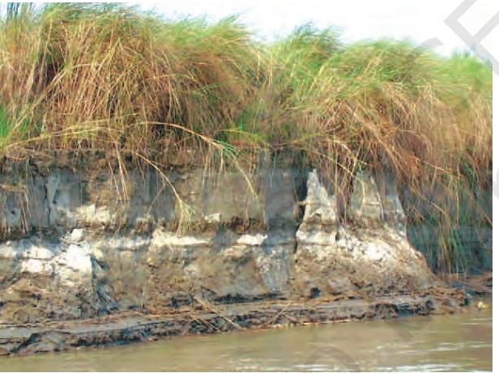

western India. *Fig. 1.10: Soil Erosion*

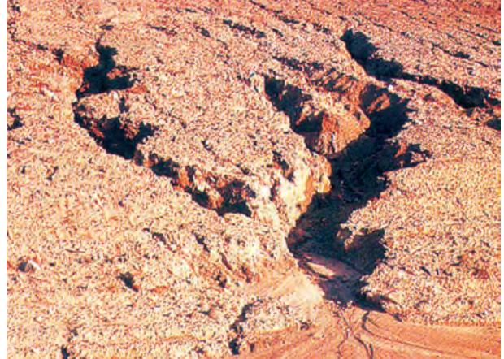

*Fig. 1.11: Gully Erosion*

soil is washed away. This is known as sheet erosion. Wind blows loose soil off flat or sloping land known as wind erosion. Soil erosion is also caused due to defective methods of farming. Ploughing in a wrong way i.e. up and down the slope form channels for the quick flow of water leading to soil erosion.

Ploughing along the contour lines can decelerate the flow of water down the slopes. This is called contour ploughing. Steps can be cut out on the slopes making terraces. Terrace cultivation restricts erosion. Western and central Himalayas have well developed terrace farming. Large fields can be divided into strips. Strips of grass are left to grow between the crops. This breaks up the force of the wind. This method is known as strip cropping. Planting lines of trees to create shelter also works in a similar way. Rows of such trees are called shelter belts. These shelter belts have contributed significantly to the stabilisation of sand dunes and in stabilising the desert in

#### **EXERCISES EXERCISES EXERCISES EXERCISES EXERCISES**

- **1 .** Multiple choice questions.
	- (i) Which one of the following is the main cause of land degradation in Punjab?
		- (a) Intensive cultivation (c) Over irrigation
		- (b) Deforestation (d) Overgrazing
	- (ii) In which one of the following states is terrace cultivation practised?
		- (a) Punjab (c) Haryana
		- (b) Plains of Uttar Pradesh (d) Uttarakhand
	- (iii) In which of the following states black soil is predominantly found?
		- (a) Uttar Pradesh (c) Rajasthan
		- (b) Maharashtra (d) Jharkhand
- **2 .** Answer the following questions in about 30 words.
	- (i) Name three states having black soil and the crop which is mainly grown in it.
	- (ii) What type of soil is found in the river deltas of the eastern coast? Give three main features of this type of soil.
	- (iii) What steps can be taken to control soil erosion in the hilly areas?
- 3. Answer the following questions in about 120 words.
	- (i) Explain land use pattern in India and why has the land under forest not increased much since 1960-61?
	- (ii) How have technical and economic development led to more consumption of resources?

#### **PROJECT/ACTIVITY**

- **1 .** Make a project showing consumption and conservation of resources in your locality.
- **2.** Have a discussion in the class how to conserve various resources used in your school.
- **3.** Imagine if oil supplies get exhausted, how will this affect our life style?
- **4.** Solve the puzzle by following your search horizontally and vertically to find the hidden answers.
	- (i) Natural endowments in the form of land, water, vegetation and minerals.
	- (ii) A type of non-renewable resource.
	- (iii) Soil with high water retaining capacity.
	- (iv) Intensively leached soils of the monsoon climate.

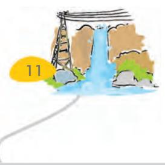

RESOURCES AND DEVELOPMENT 11

| S | F | G | S | F | O | B | R | O | M | S | U | A | P | J |
| --- | --- | --- | --- | --- | --- | --- | --- | --- | --- | --- | --- | --- | --- | --- |
| Q | G | A | F | F | O | R | E | S | T | A | T | I | O | N |
| P | N | R | E | C | P | R | S | L | D | M | I | L | N | F |
| S | N | A | T | Q | X | U | O | V | A | I | O | L | A | L |
| O | D | E | I | D | R | J | U | J | L | D | B | N | B | D |
| T | G | H | M | I | N | E | R | A | L | S | A | X | M | W |
| B | V | J | K | M | E | D | C | R | U | P | F | M | H | R |
| L | A | T | E | R | I | T | E | M | V | A | Z | T | V | L |
| A | B | Z | O | E | N | M | F | T | I | S | D | L | R | C |
| C | G | N | N | S | Z | I | O | P | A | X | T | Y | J | H |
| K | J | G | K | D | T | D | C | S | L | S | E | G | E | W |

(i) Natural endowments in the form of land, water, vegetation and minerals.

(ii) A type of non-renewable resource.

(iii) Soil with high water retaining capacity.

(iv) Intensively leached soils of the monsoon climate.

(v) Plantation of trees on a large scale to check soil erosion.

(vi) The Great Plains of India are made up of these soils.

