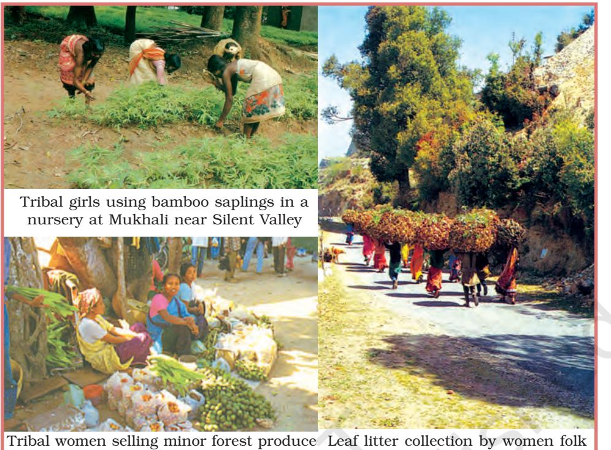

Narak! My Lord, you are the creator of music in the world of Lepchas

Oh Narak! My Lord, let me dedicate myself to you

Let me gather your music from the springs, the rivers, the mountains, the forests, the insects and the animals

Let me gather your music from the sweet breeze and offer it to you

## *Lepcha folk song*

We share this planet with millions of other living beings, starting from micro-organisms and bacteria, lichens to banyan trees, elephants and blue whales. This entire habitat that we live in has immense biodiversity. We humans along with all living organisms form a complex web of ecological system in which we are only a part and very much dependent on this system for our own existence. For example, the plants, animals and micro-organisms re-create the quality of the air we breathe, the water we drink and the soil that produces our food without which we cannot survive. Forests play a key role in the ecological system as these are also the primary producers on which all other living beings depend.

**Biodiversity or Biological Diversity** is immensely rich in wildlife and cultivated species, diverse in form and function but closely integrated in a system through multiple network of interdependencies.

# Flora and Fauna in India

If you look around, you will be able to find that there are some animals and plants which are unique in your area. In fact, India is one of the world's richest countries in terms of its vast array of biological diversity. This is possibly twice or thrice the number yet to be discovered. You have already studied in detail about the extent and variety of forest and wildlife resources in India. You may have realised the importance of these resources in our daily life. These diverse flora and fauna are so well integrated in our daily life that we take these for granted. But, lately, they are under great stress mainy due to insensitivity to our environment.

Find out stories prevalent in your region which are about the harmonious relationship between human beings and nature.

### Conservation of Forest and Wildlife in India

Conservation in the background of rapid decline in wildlife population and forestry has become essential. But why do we need to conserve our forests and wildlife? Conservation preserves the ecological diversity and our life support systems – water, air and soil. It also preserves the genetic diversity of plants and animals for better growth of species and breeding. For example, in agriculture, we are still dependent on traditional crop varieties. Fisheries too are heavily dependent on the maintenance of aquatic biodiversity.

In the 1960s and 1970s, conservationists demanded a national wildlife protection programme. The Indian Wildlife (Protection)

*Fig. 2.1*

Act was implemented in 1972, with various provisions for protecting habitats. An all-India list of protected species was also published. The thrust of the programme was towards protecting the remaining population of certain endangered species by banning hunting, giving legal protection to their habitats, and restricting trade in wildlife. Subsequently, central and many state governments established national parks and wildlife sanctuaries about which you have already studied. The central government also announced several projects for protecting specific animals, which were gravely threatened, including the tiger, the onehorned rhinoceros, the Kashmir stag or *hangul*, three types of crocodiles – fresh water crocodile, saltwater crocodile and the *Gharial*, the Asiatic lion, and others. Most recently, the Indian elephant, black buck (chinkara), the great Indian bustard (*godawan*) and the snow leopard, etc. have been given full or partial legal protection against hunting and trade throughout India.

## **Project Tiger**

Tiger is one of the key wildlife species in the faunal web. In 1973, the authorities realised that the tiger population had dwindled to 1,827 from an estimated 55,000 at the turn of the century. The major threats to tiger population are numerous, such as poaching for trade, shrinking habitat, depletion of prey base species, growing human population, etc. The trade of tiger skins and the use of their bones in traditional medicines, especially in the Asian countries left the tiger population on the verge of extinction. Since India and Nepal provide habitat to about two-thirds of the surviving tiger population in the world, these two nations became prime targets for poaching and illegal trading.

"Project Tiger", one of the wellpublicised wildlife campaigns in the world, was launched in 1973. Tiger conservation has been viewed not only as an effort to save an endangered species, but with

**Fig. 2.2:** *Rhino and deer in Kaziranga National Park*

equal importance as a means of preserving biotypes of sizeable magnitude. Corbett National Park in Uttarakhand, Sunderbans National Park in West Bengal, Bandhavgarh National Park in Madhya Pradesh, Sariska Wildlife Sanctuary in Rajasthan, Manas Tiger Reserve in Assam and Periyar Tiger Reserve in Kerala are some of the tiger reserves of India.

The conservation projects are now focusing on biodiversity rather than on a few of its components. There is now a more intensive search for different conservation measures. Increasingly, even insects are beginning to find a place in conservation planning. In the notification under Wildlife Act of 1980 and 1986, several hundred butterflies, moths, beetles, and one dragonfly have been added to the list of protected species. In 1991, for the first time plants were also added to the list, starting with six species.

Collect more information on the wildlife sanctuaries and national parks of India and cite their locations on the map of India.

**Types and Distribution of Forest and Wildlife Resources**

Even if we want to conserve our vast forest and wildlife resources, it is rather difficult to manage, control and regulate them. In India, much of its forest and wildlife resources are either owned or managed by the government through the Forest Department or other government departments. These are classified under the following categories.

- (i) **Reserved Forests:** More than half of the total forest land has been declared **reserved forests**. Reserved forests are regarded as the most valuable as far as the conservation of forest and wildlife resources are concerned.
- (ii) **Protected Forests:** Almost one-third of the total forest area is protected forest, as declared by the Forest Department. This forest land are protected from any further depletion.
- (iii) **Unclassed Forests:** These are other forests and wastelands belonging to both government and private individuals and communities.

Reserved and protected forests are also referred to as permanent forest estates maintained for the purpose of producing timber and other forest produce, and for protective reasons. Madhya Pradesh has the largest area under permanent forests, constituting 75 per cent of its total forest area. Jammu and Kashmir, Andhra Pradesh, Uttarakhand, Kerala, Tamil Nadu, West Bengal, and Maharashtra have large percentages of reserved forests of its total forest area whereas Bihar, Haryana, Punjab, Himachal Pradesh, Odisha and Rajasthan have a bulk of it under protected forests. All North-

FOREST AND WILDLIFE RESOURCES 15

*Can you find out the reasons for the above mentioned problems?*

eastern states and parts of Gujarat have a very high percentage of their forests as unclassed forests managed by local communities.

## Community and Conservation

Conservation strategies are not new in our country. We often ignore that in India, forests are also home to some of the traditional communities. In some areas of India, local communities are struggling to conserve these habitats along with government officials, recognising that only this will secure their own long-term livelihood. In Sariska Tiger Reserve, Rajasthan, villagers have fought against mining by citing the Wildlife Protection Act. In many areas, villagers themselves are protecting habitats and explicitly rejecting government involvement. The inhabitants of five villages in the Alwar district of Rajasthan have declared 1,200 hectares of forest as the Bhairodev Dakav 'Sonchuri', declaring their

own set of rules and regulations which do not allow hunting, and are protecting the wildlife against any outside encroachments.

The famous Chipko movement in the Himalayas has not only successfully resisted deforestation in several areas but has also shown that community afforestation with indigenous species can be enormously successful. Attempts to revive the traditional conservation methods or developing new methods of ecological farming are now widespread. Farmers and citizen's groups like the Beej Bachao Andolan in Tehri and Navdanya have shown that adequate levels of diversified crop production without the use of synthetic chemicals are possible and economically viable.

In India joint forest management (JFM) programme furnishes a good example for involving local communities in the management and restoration of degraded

# **Sacred groves - a wealth of diverse and rare species**

Nature worship is an age old tribal belief based on the premise that all creations of nature have to be protected. Such beliefs have preserved several virgin forests in pristine form called Sacred Groves (the forests of God and Goddesses). These patches of forest or parts of large forests have been left untouched by the local people and any interference with them is banned.

Certain societies revere a particular tree which they have preserved from time immemorial. The Mundas and the Santhal of Chota Nagpur region worship mahua (**Bassia latifolia**) and kadamba (**Anthocaphalus cadamba**) trees, and the tribals of Odisha and Bihar worship the tamarind (**Tamarindus indica**) and mango (**Mangifera indica**) trees during weddings. To many of us, peepal and banyan trees are considered sacred.

Indian society comprises several cultures, each with its own set of traditional methods of conserving nature and its creations. Sacred qualities are often ascribed to springs, mountain peaks, plants and animals which are closely protected. You will find troops of macaques and langurs around many temples. They are fed daily and treated as a part of temple devotees. In and around Bishnoi villages in Rajasthan, herds of blackbuck, (chinkara), nilgai and peacocks can be seen as an integral part of the community and nobody harms them.

forests. The programme has been in formal existence since 1988 when the state of Odisha passed the first resolution for joint forest management. JFM depends on the formation of local (village) institutions that undertake protection activities mostly on degraded forest land managed by the forest department. In return, the members of these communities are entitled to intermediary benefits like non-timber forest produces and share in the timber harvested by 'successful protection'.

The clear lesson from the dynamics of both environmental destruction and reconstruction in India is that local communities everywhere have to be involved in some kind of natural resource management. But there is still a long way to go before local communities are at the centre-stage in decision-making. Accept only those economic or developmental activities, that are people centric, environment-friendly and economically rewarding.

Write a short essay on any practices which you may have observed and practised in your everyday lives that conserve and protect the environment around you.

"The tree is a peculiar organism of unlimited kindness and benevolence and makes no demand for its sustenance, and extends generously the products of its life activity. It affords protection to all beings, offering shade even to the axemen who destroy it".

Gautama Buddha (487 B.C.)

FOREST AND WILDLIFE RESOURCES 17

## **EXERCISES EXERCISES EXERCISES EXERCISES EXERCISES**

- **1 .** Multiple choice questions
	- (i) Which of the following conservation strategies do not directly involve community participation?
		- (a) Joint forest management (c) Chipko Movement
- - (b) Beej Bachao Andolan (d) Demarcation of Wildlife sanctuaries
- 

- **2.** Match the following.

| Reserved forests | Other forests and wastelands belonging to both |
| --- | --- |
|  | government and private individuals and |
|  | communities. |
| Protected forests | Forests are regarded as most valuable as far as the |
|  | conservation of forest and wildlife resources. |
| Unclassed forests | Forest lands are protected from any further |
|  | depletion. |

- **3 .** Answer the following questions in about 30 words.
	- (i) What is biodiversity? Why is biodiversity important for human lives?
	- (ii) How have human activities affected the depletion of flora and fauna? Explain.
- **4.** Answer the following questions in about 120 words.
	- (i) Describe how communities have conserved and protected forests and wildlife in India?
	- (ii) Write a note on good practices towards conserving forest and wildlife.

