You already know that three-fourth of the earth's surface is covered with water, but only a small proportion of it accounts for freshwater that can be put to use. This freshwater is mainly obtained from surface run off and ground water that is continually being renewed and recharged through the hydrological cycle. All water moves within the hydrological cycle ensuring that water is a renewable resource.

You might wonder that if three-fourth of the world is covered with water and water is a renewable resource, then how is it that countries and regions around the globe suffer from water scarcity? Why is it predicted that by 2025, nearly two billion people will live in absolute water scarcity?

# WATER SCARCITY CARCITY AND THE NEED FOR WATER CONSERVATION AND MANAGEMENT

Given the abundance and renewability of water, it is difficult to imagine that we may suffer from water scarcity. The moment we speak of water shortages, we immediately associate it with regions having low rainfall or those that are drought prone. We instantaneously visualise the deserts of Rajasthan and women balancing many 'matkas' (earthen pots) used for collecting and storing water and travelling long distances to get water. True, the availability of water resources varies over space and time, mainly due to the variations in seasonal and annual precipitation, but water scarcity in most cases is caused by over-exploitation, excessive use and unequal access to water among different social groups.

Where is then water scarcity likely to occur? As you have read in the hydrological cycle, freshwater can be obtained directly from precipitation, surface run off and groundwater.

Is it possible that an area or region may have ample water resources but is still facing water scarcity? Many of our cities are such examples. Thus, water scarcity may be an outcome of large and growing population and consequent greater demands for water, and unequal access to it. A large population requires more water not only for domestic use but also to produce more food. Hence, to facilitate higher food-grain production, water resources are being over-exploited to expand irrigated areas for dry-season agriculture. Irrigated agriculture is the largest consumer of water. Now it is needed to revolutionise the agriculture through developing drought resistant crops and dry farming techniques. You may have seen in many television advertisements that most farmers have their

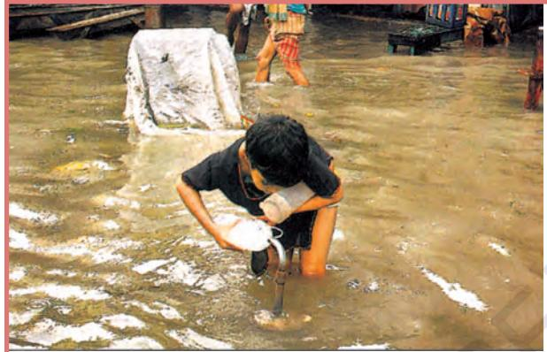

Water, Water Everywhere, Not a Drop to Drink: After a heavy downpour, a boy collects drinking water in Kolkata. Life in the city and its adjacent districts was paralysed as incessant overnight rain, meaning a record 180 mm, flooded vast area and disruted traffic.

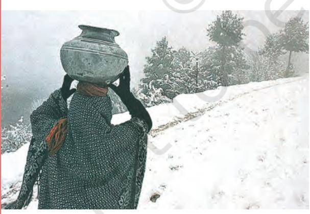

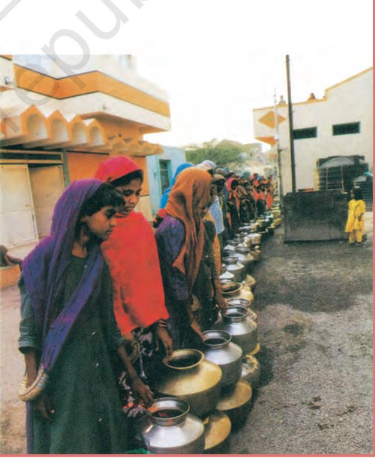

Fig. 3.1: Fig. 3.1:Fig. 3.1: Water Scarcity

20 CONTEMPORARY INDIA – II

own wells and tube-wells in their farms for irrigation to increase their produce. But have you ever wondered what this could result in? That it may lead to falling groundwater levels, adversely affecting water availability and food security of the people.

Post-independent India witnessed intensive industrialisation and urbanisation, creating vast opportunities for us. Today, large industrial houses are as commonplace as the industrial units of many MNCs (Multinational Corporations). The ever-increasing number of industries has made matters worse by exerting pressure on existing freshwater resources. Industries, apart from being heavy users of water, also require power to run them. Much of this energy comes from hydroelectric power. Moreover, multiplying urban centres with large and dense populations and urban lifestyles have not only added to water and energy requirements but have further aggravated the problem. If you look into the housing societies or colonies in the cities, you would find that most of these have their own groundwater pumping devices to meet their water needs. Not surprisingly, we find that fragile water resources are being overexploited and have caused their depletion in several of these cities.

Atal Bhujal Yojana (Atal Jal) is being implemented in 8220 water stressed Gram Panchayats of 229 administrative blocks/ talukas in 80 districts of seven states, viz. Gujarat, Haryana, Karnataka, Madhya Pradesh, Maharashtra, Rajasthan, and Uttar Pradesh. The selected States account for about 37 per cent of the total number of water— stressed (over-exploited, critical and semi-critical) blocks in India. One of the key aspects of Atal Jal is to bring in behavioural changes in the community, from the prevailing attitude of consumption to conservation and smart water management.

Source: Source: Annual Report, Ministry of Jal Shakti, Government of India 2022–23

So far we have focused on the quantitative aspects of water scarcity. Now, let us consider another situation where water is sufficiently available to meet the needs of the people, but, the area still suffers from water scarcity. This scarcity may be due to bad quality of water. Lately, there has been a growing concern that even if there is ample water to meet the needs of the people, much of it may be polluted by domestic and industrial wastes, chemicals, pesticides and fertilisers used in agriculture, thus, making it hazardous for human use. Government of India has accorded highest priority to improve the quality of life and enhance ease of living of people especially those living in rual areas by announcing the Jal Jeevan Mission (JJM). The Goal of JJM is to enable every rural household get assured supply of potable piped water at a service level of 55 litres per capita per day regularly on long-term basis by ensuring functionality of the tap water connections. (Source: Economic Survey 2020–21, p.357)

You may have already realised that the need of the hour is to conserve and manage our water resources, to safeguard ourselves from health hazards, to ensure food security, continuation of our livelihoods and productive activities and also to prevent degradation of our natural ecosystems. Over exploitation and mismanagement of water resources will impoverish this resource and cause ecological crisis that may have profound impact on our lives.

From your everyday experiences, write a short proposal on how you can conserve water.

## MULTI-PURPOSE RIVER P ROJECTS AND INTEGRATED WATER RESOURCES MANAGEMENT

But, how do we conserve and manage water? Archaeological and historical records show that from ancient times we have been constructing sophisticated hydraulic structures like dams built of stone rubble, reservoirs or lakes, embankments and canals for irrigation. Not surprisingly, we have continued this tradition in modern India by building dams in most of our river basins.

### **Hydraulic Structures in Ancient India**

- In the first century B.C., Sringaverapura near Allahabad had sophisticated water
WATER RESOURCES 21

harvesting system channelling the flood water of the river Ganga.

- During the time of Chandragupta Maurya, dams, lakes and irrigation systems were extensively built.
- Evidences of sophisticated irrigation works have also been found in Kalinga, (Odisha), Nagarjunakonda (Andhra Pradesh), Bennur (Karnataka), Kolhapur (Maharashtra), etc.
- In the 11th Century, Bhopal Lake, one of the largest artificial lakes of its time was built.
- In the 14th Century, the tank in Hauz Khas, Delhi was constructed by Iltutmish for supplying water to Siri Fort area. Source:Source: Dying Wisdom, CSE, 1997.

Fig. 3.2: Fig. 3.2:Fig. 3.2: Hirakud Dam

What are dams and how do they help us in conserving and managing water? Dams were traditionally built to impound rivers and rainwater that could be used later to irrigate agricultural fields. Today, dams are built not just for irrigation but for electricity generation, water supply for domestic and industrial uses, flood control, recreation, inland navigation and fish breeding. Hence, dams are now referred to as multi-purpose projects where the many uses of the impounded water are integrated with one another. For example, in the Sutluj-Beas river basin, the Bhakra – Nangal project water is being used both for hydel power production and irrigation. Similarly, the Hirakud project in the Mahanadi basin integrates conservation of water with flood control.

Multi-purpose projects, launched after Independence with their integrated water resources management approach, were thought of as the vehicle that would lead the nation to development and progress, overcoming the

A **dam** is a barrier across flowing water that obstructs, directs or retards the flow, often creating a reservoir, lake or impoundment. "Dam" refers to the reservoir rather than the structure. Most dams have a section called a spillway or weir over which or through which it is intended that water will flow either intermittently or continuously. Dams are classified according to structure, intended purpose or height. Based on structure and the materials used, dams are classified as timber dams, embankment dams or masonry dams, with several subtypes. According to the height, dams can be categorised as large dams and major dams or alternatively as low dams, medium height dams and high dams.

handicap of its colonial past. Jawaharlal Nehru proudly proclaimed the dams as the 'temples of modern India'; the reason being that it would integrate development of agriculture and the village economy with rapid industrialisation and growth of the urban economy.

Find out more about any one traditional method of building dams and irrigation works.

We have sown the crops in Asar We will bring Bhadu in Bhadra Floods have swollen the Damodar The sailing boats cannot sail Oh! Damodar, we fall at your feet Reduce the floods a little

Bhadu will come a year later

Let the boats sail on your surface

(This popular Bhadu song in the Damodar valley region narrates the troubles faced by people owing to the flooding of Damodar river known as the river of sorrow.)

22 CONTEMPORARY INDIA – II

In recent years, multi-purpose projects and large dams have come under great scrutiny and opposition for a variety of reasons. Regulating and damming of rivers affect their natural flow causing poor sediment flow and excessive sedimentation at the bottom of the reservoir, resulting in rockier stream beds and poorer habitats for the rivers' aquatic life. Dams also fragment rivers making it difficult for aquatic fauna to migrate, especially for spawning. The reservoirs that are created on the floodplains also submerge the existing vegetation and soil leading to its decomposition over a period of time.

Sardar Sarovar Dam has been built over the Narmada River in Gujarat. This is one of the largest water resource projects of India covering four states—Maharashtra, Madhya Pradesh, Gujarat and Rajasthan. The Sardar Sarovar project would meet the requirement of water in drought-prone and desert areas. Sardar Sarovar Project will provide irrigation facilities to 18.45 lakh hectare of land, covering 3112 villages in 15 districts of Gujarat. It will also irrigate 2,46,000 hectare of land in the strategic desert districts of Barmer and Jalore in Rajasthan and 37,500 hectare in the tribal hilly tract of Maharashtra through lift. About 75 per cent of the command area in Gujarat is drought prone while entire command in Rajasthan is drought prone. Assured water supply will soon make this area drought proof.

Source: Sardar Sarovar Narmada Nigam Ltd. *https://www.sardarsarovardam.org/*

Irrigation has also changed the cropping pattern of many regions with farmers shifting to water intensive and commercial crops. This has great ecological consequences like salinisation of the soil. Pradhan Mantri Krishi Sinchaee Yojana has been started which ensures access to some means to protective irrigation for all agricultural farms in the country, thus bringing much desired rural prosperity.

**Pradhan Mantri Krishi Sinchaee Yojana** Some of the broad objectives of this programme are to enhance the physical access of water on the farm and expand cultivable area under assured irrigation (har khet ko pani), improve on-farm water use efficiency to reduce wastage and increase availability both in duration and extent, irrigation and other water saving technologies (per drop more crop) and introduce sustainable water conservation practices, etc.

Do you know that the Krishna-Godavari dispute is due to the objections raised by Karnataka and Andhra Pradesh governments? It is regarding the diversion of more water at Koyna by the Maharashtra government for a multipurpose project. This would reduce downstream flow in their states with adverse consequences for agriculture and industry.

### Make a list of inter-state water disputes.

Ironically, the dams that were constructed to control floods have triggered floods due to sedimentation in the reservoir. Moreover, the big dams have mostly been unsuccessful in controlling floods at the time of excessive rainfall.

Collect information about floods occurred in different parts of the country due to heavy rainfall in recent times.

These floods have not only devastated life and property but also caused extensive soil erosion. Sedimentation also meant that the flood plains were deprived of silt, a natural fertiliser, further adding on to the problem of land degradation. It was also observed that the multipurpose projects induced earthquakes, caused water-borne diseases and pests and pollution resulting from excessive use of water.

WATER RESOURCES 23

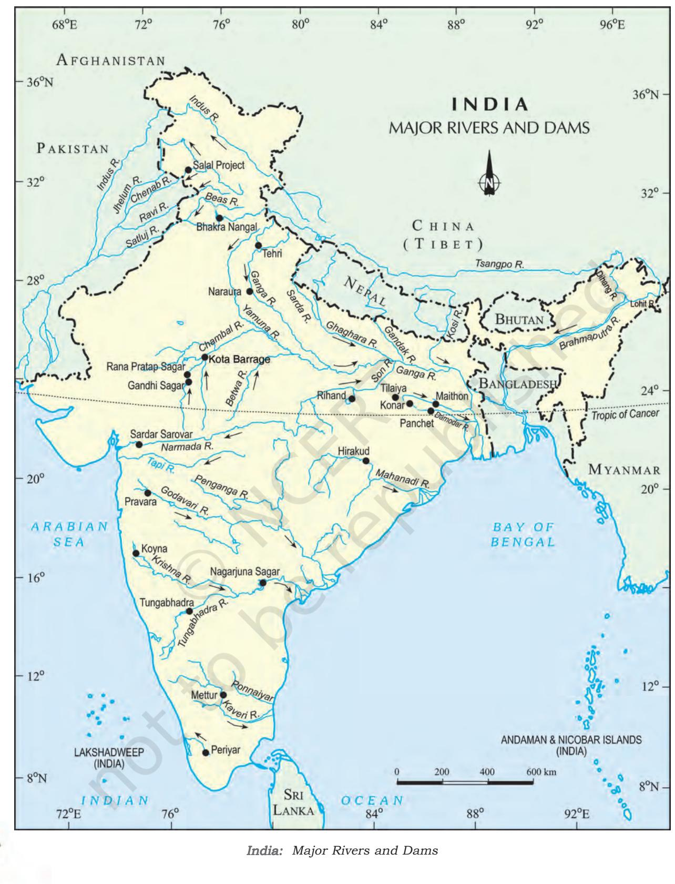

24 CONTEMPORARY INDIA – II

# RAINWATER HARVESTING

Many thought that given the disadvantages and rising resistance against the multipurpose projects, water harvesting system was a viable alternative, both socioeconomically and environmentally. In ancient India, along with the sophisticated hydraulic structures, there existed an extraordinary tradition of water-harvesting system. People had in-depth knowledge of rainfall regimes and soil types and developed wide ranging techniques to harvest rainwater, groundwater, river water and flood water in keeping with the local ecological conditions and their water needs. In hill and mountainous regions, people built diversion channels like the 'guls' or 'kuls' of the Western Himalayas for agriculture. 'Rooftop rainwater harvesting' was commonly practised to store drinking water, particularly in Rajasthan. In the flood plains of Bengal, people developed inundation channels to irrigate their fields. In arid and semi-arid regions, agricultural fields were converted into rain fed storage structures that allowed the water to stand and moisten the soil like the 'khadins' in Jaisalmer and 'Johads' in other parts of Rajasthan.

In the semi-arid and arid regions of Rajasthan, particularly in Bikaner, Phalodi and Barmer, almost all the houses traditionally had underground tanks or tankas for storing drinking water. The tanks could be as large as a big room; one household in Phalodi had a tank that was 6.1 metres deep, 4.27 metres long and 2.44 metres wide. The tankas were part of the welldeveloped rooftop rainwater harvesting

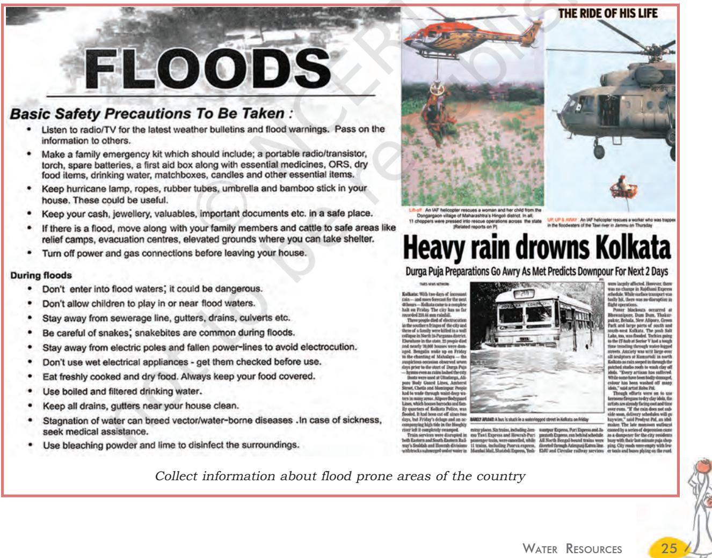

system and were built inside the main house or the courtyard. They were connected to the sloping roofs of the houses through a pipe. Rain falling on the rooftops would travel down the pipe and was stored in these underground 'tankas'. The first spell of rain was usually not collected as this would clean the roofs and the pipes. The rainwater from the subsequent showers was then collected.

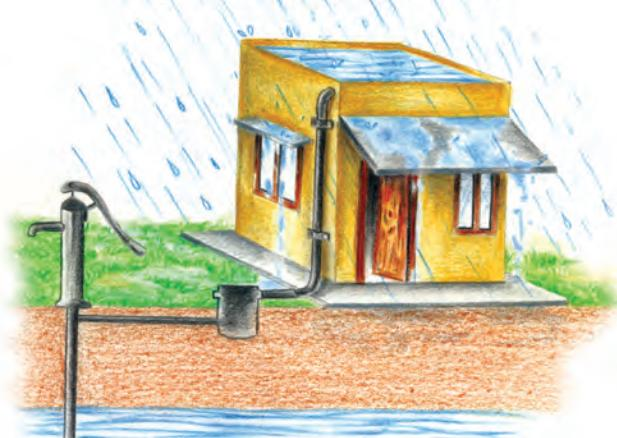

(a) Recharge through Hand Pump

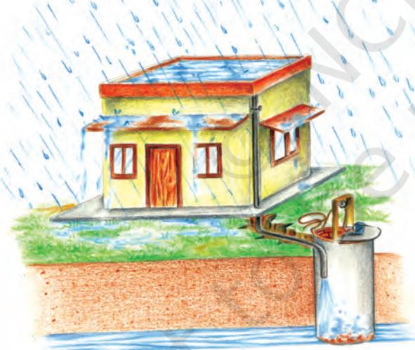

(b) Recharge through Abandoned Dugwell

- Rooftop rainwater is collected using a PVC pipe
- Filtered using sand and bricks • Underground pipe takes water to sump for immediate usage
- Excess water from the sump is taken to the well
- Water from the well recharges the underground
- Take water from the well (later)

Fig 3.3: Fig 3.3:Fig 3.3: Rooftop Rainwater Harvesting

Fig. 3.4 Fig. 3.4Fig. 3.4

The rainwater can be stored in the tankas till the next rainfall making it an extremely reliable source of drinking water when all other sources are dried up, particularly in the summers. Rainwater, or palar pani, as commonly referred to in these parts, is considered the purest form of natural water. Many houses constructed underground rooms adjoining the 'tanka' to beat the summer heat as it would keep the

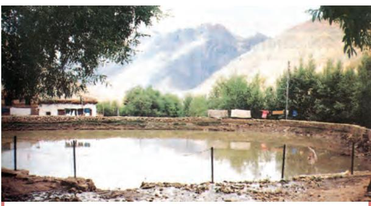

A kul leads to a circular village tank, as the above in the Kaza village, from which water is released as and when required.

Fig 3.5: Fig 3.5: Fig 3.5: Traditional method of rainwater harvesting

26 CONTEMPORARY INDIA – II

Rooftop rainwater harvesting is the most common practice in Shillong, Meghalaya. It is interesting because Cherapunjee and Mawsynram situated at a distance of 55 km. from Shillong receive the highest rainfall in the world, yet the state capital Shillong faces acute shortage of water. Nearly every household in the city has a rooftop rainwater harvesting structure. Nearly 15-25 per cent of the total water requirement of the household comes from rooftop water harvesting.

Find out other rainwater harvesting systems existing in and around your locality.

room cool.

Today, in western Rajasthan, sadly the practice of rooftop rainwater harvesting is on the decline as plenty of water is available due to the perennial Indira Gandhi Canal, though some houses still maintain the tankas since they do not like the taste of tap water. Fortunately, in many parts of rural and urban India, rooftop rainwater harvesting is being successfully adapted to store and conserve water. In Gendathur, a remote backward village in Mysuru, Karnataka, villagers have installed, in their household's rooftop, rainwater harvesting system to meet their water needs. Nearly 200 households have installed this system and the village has earned the rare distinction of being rich in rainwater. See Fig. 3.6 for a better understanding of the rooftop rainwater harvesting system which is adapted here. Gendathur receives an annual precipitation of 1,000 mm, and with 80 per cent of collection efficiency and of about 10 fillings, every house can collect and use about 50,000 litres of water annually. From the 200 houses, the net amount of rainwater harvested annually amounts to 1,00,000 litres.

Rooftop harvesting was common across the towns and villages of the Thar. Rainwater that falls on the sloping roofs of houses is taken through a pipe into an underground tanka (circular holes in the ground). built in the main house or in the courtyard. The picture above shows water being taken from a neighbour's roof through a long pipe. Here the neighbour's rooftop has been used for collection of rainwater. The picture shows a hole through which rainwater flows down into an underground tanka.

> Fig. 3.6Fig. 3.6Fig. 3.6

Tamil Nadu is the first state in India which has made rooftop rainwater harvesting structure compulsory to all the houses across the state. There are legal provisions to punish the defaulters.

WATER RESOURCES 27

# **BAMBOO DRIP IRRIGATION SYSTEM**

In Meghalaya, a 200-year-old system of tapping stream and spring water by using bamboo pipes, is prevalent. About 18-20 litres of water enters the bamboo pipe system, gets transported over hundreds of metres, and finally reduces to 20-80 drops per minute at the site of the plant.

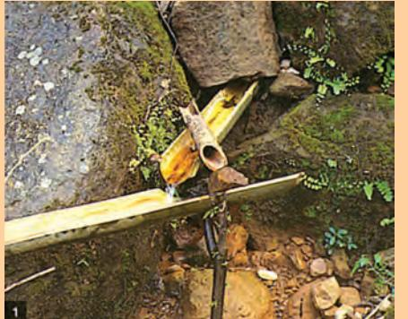

**Picture 1:** *Bamboo pipes are used to divert perennial springs on the hilltops to the lower reaches by gravity.*

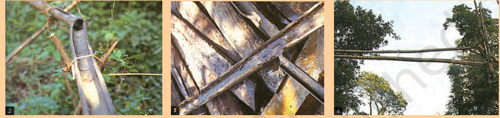

**Picture 2 and 3:** *The channel sections, made of bamboo, divert water to the plant site where it is distributed into branches, again made and laid out with different forms of bamboo pipes. The flow of water into the pipes is controlled by manipulating the pipe positions.*

**Picture 4:** *If the pipes pass a road, they are taken high above the land.*

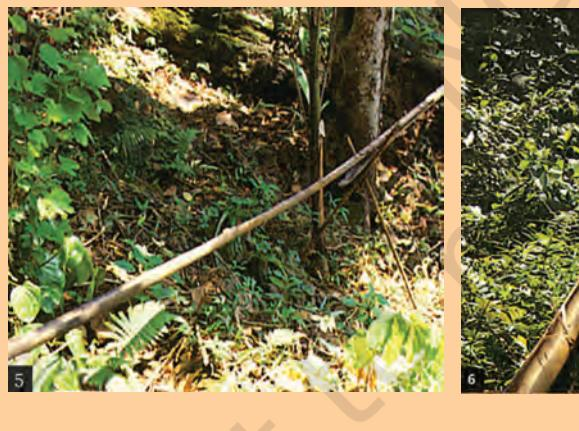

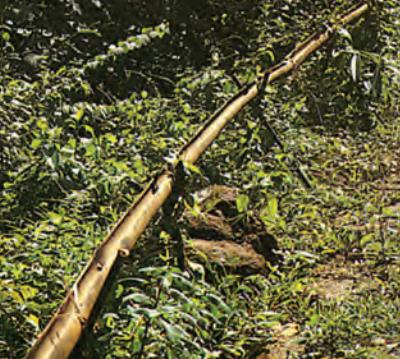

### **Picture 5 and 6**

*Reduced channel sections and diversion units are used at the last stage of water application. The last channel section enables water to be dropped near the roots of the plant.*

**Fig 3.7**

- **1.** Collect information on how industries are polluting our water resources.
- **2.** Enact with your classmates a scene of water dispute in your locality.

28 CONTEMPORARY INDIA – II

### **EXERCISES EXERCISES EXERCISES EXERCISES EXERCISES**

- 1. Multiple choice questions.
	- (i) Based on the information given below classify each of the situations as 'suffering from water scarcity' or 'not suffering from water scarcity'.
		- (a) Region with high annual rainfall.
		- (b) Region having high annual rainfall and large population.
		- (c) Region having high annual rainfall but water is highly polluted.
		- (d) Region having low rainfall and low population.
	- (ii) Which one of the following statements is not an argument in favour of multipurpose river projects?
		- (a) Multi-purpose projects bring water to those areas which suffer from water scarcity.
		- (b) Multi-purpose projects by regulating water flow helps to control floods.
		- (c) Multi-purpose projects lead to large scale displacements and loss of livelihood.
		- (d) Multi-purpose projects generate electricity for our industries and our homes.
	- (iii) Here are some false statements. Identify the mistakes and rewrite them correctly.
		- (a) Multiplying urban centres with large and dense populations and urban lifestyles have helped in proper utilisation of water resources.
		- (b) Regulating and damming of rivers does not affect the river's natural flow and its sediment flow.
		- (c) Today in Rajasthan, the practice of rooftop rainwater water harvesting has gained popularity despite high water availability due to the Indira Gandhi Canal.
- 2 . Answer the following questions in about 30 words.
	- (i) Explain how water becomes a renewable resource.
	- (ii) What is water scarcity and what are its main causes?
	- (iii) Compare the advantages and disadvantages of multi-purpose river projects.
- 3 . Answer the following questions in about 120 words.
	- (i) Discuss how rainwater harvesting in semi-arid regions of Rajasthan is carried out.
	- (ii) Describe how modern adaptations of traditional rainwater harvesting methods are being carried out to conserve and store water.

WATER RESOURCES 29

