India is an agriculturally important country. Two-thirds of its population is engaged in agricultural activities. Agriculture is a primary activity, which produces most of the food that we consume. Besides food grains, it also produces raw material for various industries.

#### **Can you name some industries based on agricultural raw material?**

Moreover, some agricultural products like tea, coffee, spices, etc. are also exported.

# **TYPES OF FARMING**

Agriculture is an age-old economic activity in our country. Over these years, cultivation methods have changed significantly depending upon the characteristics of physical environment, technological know-how and socio-cultural practices. Farming varies from subsistence to commercial type. At present, in different parts of India, the following farming systems are practised.

# **Primitive Subsistence Farming**

This type of farming is still practised in few pockets of India. Primitive subsistence agriculture is practised on small patches of land with the help of primitive tools like hoe, dao and digging sticks, and family/ community labour. This type of farming depends upon monsoon, natural fertility of the soil and suitability of other environmental conditions to the crops grown.

It is a 'slash and burn' agriculture. Farmers clear a patch of land and produce cereals and other food crops to sustain their family. When the soil fertility decreases, the farmers shift and clear a fresh patch of land for cultivation. This type of shifting allows Nature to replenish the fertility of the soil through natural processes; land productivity in this type of agriculture is low as the farmer does not use fertilisers or other modern inputs. It is known by different names in different parts of the country.

#### **Can you name some such types of farmings?**

It is *jhumming* in north-eastern states like Assam, Meghalaya, Mizoram and Nagaland; Pamlou in Manipur, Dipa in Bastar district of Chhattishgarh, and in Andaman and Nicobar Islands.

> **Jhumming:** The 'slash and burn' agriculture is known as 'Milpa' in Mexico and Central America, 'Conuco' in Venzuela, 'Roca' in Brazil, 'Masole' in Central Africa, 'Ladang' in Indonesia, 'Ray' in Vietnam.

> In India, this primitive form of cultivation is called 'Bewar' or 'Dahiya' in Madhya Pradesh, 'Podu' or 'Penda' in Andhra Pradesh, 'Pama Dabi' or 'Koman' or Bringa' in Odisha, 'Kumari' in Western Ghats, 'Valre' or 'Waltre' in South-eastern Rajasthan, 'Khil' in the Himalayan belt, 'Kuruwa' in Jharkhand, and 'Jhumming' in the North-eastern region.

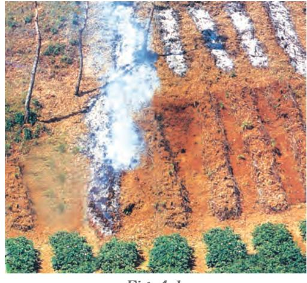

**Fig. 4.1**

Rinjha lived with her family in a small village at the outskirts of Diphu in Assam. She enjoys watching her family members clearing, slashing and burning a patch of land for cultivation. She often helps them in irrigating the fields with water running through a bamboo canal from the nearby spring. She loves the surroundings and wants to stay here as long as she can, but this little girl has no idea about the declining fertility of the soil and her family's search for fresh a patch of land in the next season.

#### *Can you name the type of farming Rinjha's family is engaged in?*

*Can you enlist some crops which are grown in such farming?*

## Intensive Subsistence Farming

This type of farming is practised in areas of high population pressure on land. It is labourintensive farming, where high doses of biochemical inputs and irrigation are used for obtaining higher production.

*Can you name some of the states of India where such farming is practised?*

Though the 'right of inheritance' leading to the division of land among successive generations has rendered land-holding size uneconomical, the farmers continue to take maximum output from the limited land in the absence of alternative source of livelihood. Thus, there is enormous pressure on agricultural land.

#### Commercial Farming

The main characteristic of this type of farming is the use of higher doses of modern inputs, e.g. high yielding variety (HYV) seeds, chemical fertilisers, insecticides and pesticides in order to obtain higher productivity. The degree of commercialisation of agriculture varies from one region to another. For example, rice is a commercial crop in Haryana and Punjab, but in Odisha, it is a subsistence crop.

*Can you give some more examples of crops which may be commercial in one region and may provide subsistence in another region?*

Plantation is also a type of commercial farming. In this type of farming, a single crop is grown on a large area. The plantation has an interface of agriculture and industry. Plantations cover large tracts of land, using capital intensive inputs, with the help of migrant labourers. All the produce is used as raw material in respective industries.

In India, tea, coffee, rubber, sugarcane, banana, etc., are important plantation crops. Tea in Assam and North Bengal coffee in Karnataka are some of the important plantation crops grown in these states. Since the production is mainly for market, a welldeveloped network of transport and communication connecting the plantation areas, processing industries and markets plays an important role in the development of plantations.

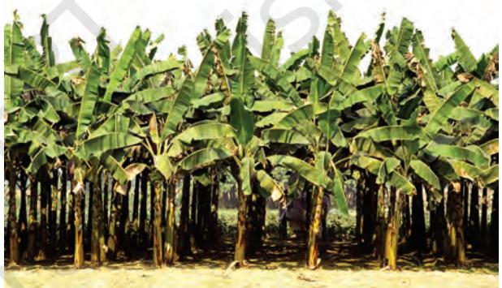

*Fig. 4.2: Banana plantation in Southern part of India*

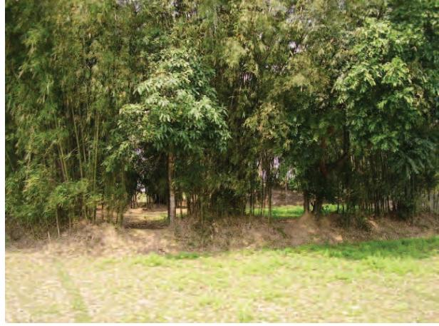

*Fig. 4.3: Bamboo plantation in North-east*

AGRICULTURE 31

# CROPPING PATTERN

You have studied the physical diversities and plurality of cultures in India. These are also reflected in agricultural practices and cropping patterns in the country. Various types of food and fibre crops, vegetables and fruits, spices and condiments, etc. constitute some of the important crops grown in the country. India has three cropping seasons — rabi, kharif and zaid.

Rabi crops are sown in winter from October to December and harvested in summer from April to June. Some of the important rabi crops are wheat, barley, peas, gram and mustard. Though, these crops are grown in large parts of India, states from the north and north-western parts such as Punjab, Haryana, Himachal Pradesh, Jammu and Kashmir, Uttarakhand and Uttar Pradesh are important for the production of wheat and other rabi crops. Availability of precipitation during winter months due to the western temperate cyclones helps in the success of these crops. However, the success of the green revolution in Punjab, Haryana, western Uttar Pradesh and parts of Rajasthan has also been an important factor in the growth of the abovementioned rabi crops.

Kharif crops are grown with the onset of monsoon in different parts of the country and these are harvested in September-October. Important crops grown during this season are paddy, maize, jowar, bajra, tur (arhar), moong, urad, cotton, jute, groundnut and soyabean. Some of the most important ricegrowing regions are Assam, West Bengal, coastal regions of Odisha, Andhra Pradesh, Telangana, Tamil Nadu, Kerala and Maharashtra, particularly the (Konkan coast) along with Uttar Pradesh and Bihar. Recently, paddy has also become an important crop of Punjab and Haryana. In states like Assam, West Bengal and Odisha, three crops of paddy are grown in a year. These are *Aus*, *Aman* and *Boro*.

In between the rabi and the kharif seasons, there is a short season during the summer months known as the Zaid season. Some of the crops produced during 'zaid' are watermelon, muskmelon, cucumber, vegetables and fodder crops. Sugarcane takes almost a year to grow.

### Major Crops

A variety of food and non food crops are grown in different parts of the country depending upon the variations in soil, climate and cultivation practices. Major crops grown in India are rice, wheat, millets, pulses, tea, coffee, sugarcane, oil seeds, cotton and jute, etc.

*Rice:* It is the staple food crop of a majority of the people in India. Our country is the second largest producer of rice in the world after China. It is a kharif crop which requires high temperature, (above 25°C) and high humidity with annual rainfall above 100 cm. In the areas of less rainfall, it grows with the help of irrigation.

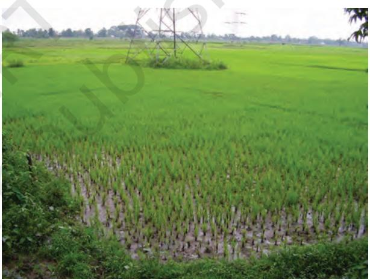

*Fig. 4.4 (a): Rice Cultivation*

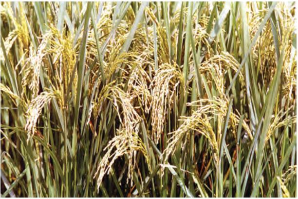

*Fig. 4.4 (b): Rice is ready to be harvested in the field*

32 CONTEMPORARY INDIA – II

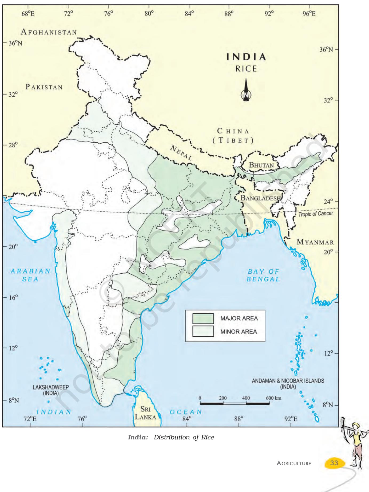

Rice is grown in the plains of north and north-eastern India, coastal areas and the deltaic regions. Development of dense network of canal irrigation and tubewells have made it possible to grow rice in areas of less rainfall such as Punjab, Haryana and western Uttar Pradesh and parts of Rajasthan.

*Wheat:* This is the second most important cereal crop. It is the main food crop, in north and north-western part of the country. This rabi crop requires a cool growing season and a bright sunshine at the time of ripening. It requires 50 to 75 cm of annual rainfall evenlydistributed over the growing season. There are two important wheat-growing zones in the country – the Ganga-Satluj plains in the north-west and black soil region of the Deccan. The major wheat-producing states are Punjab, Haryana, Uttar Pradesh, Madhya Pradesh, Bihar and Rajasthan.

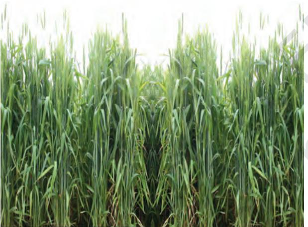

*Fig. 4.5: Wheat Cultivation*

*Millets:* Jowar, bajra and ragi are the important millets grown in India. Though, these are known as coarse grains, they have very high nutritional value. For example, ragi is very rich in iron, calcium, other micro nutrients and roughage. Jowar is the third most important food crop with respect to area and production. It is a rain-fed crop mostly grown in the moist areas which hardly needs irrigation. Major Jowar producing States are Maharashtra, Karnataka, Andhra Pradesh and Madhya Pradesh.

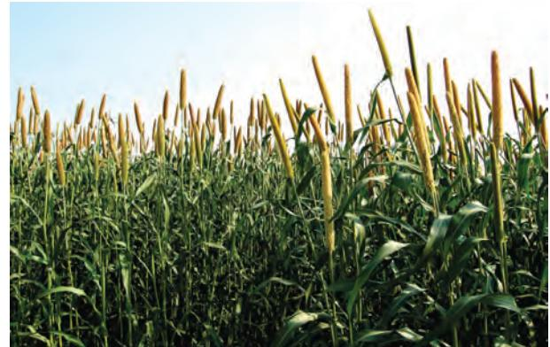

*Fig. 4.6: Bajra Cultivation*

Bajra grows well on sandy soils and shallow black soil. Major Bajra producing States are Rajasthan, Uttar Pradesh, Maharashtra, Gujarat and Haryana. Ragi is a crop of dry regions and grows well on red, black, sandy, loamy and shallow black soils. Major ragi producing states are: Karnataka, Tamil Nadu, Himachal Pradesh, Uttarakhand, Sikkim, Jharkhand and Arunachal Pradesh.

*Maize:* It is a crop which is used both as food and fodder. It is a kharif crop which requires temperature between 21°C to 27°C and grows well in old alluvial soil. In some states like Bihar maize is grown in rabi season also. Use of modern inputs such as HYV seeds, fertilisers and irrigation have contributed to the increasing production of maize. Major maize-producing states are Karnataka, Madhya Pradesh, Uttar Pradesh, Bihar, Andhra Pradesh and Telangana.

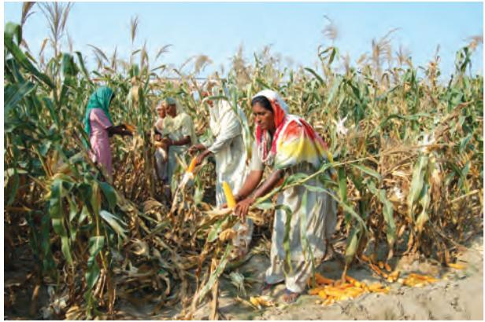

*Fig. 4.7: Maize Cultivation*

34 CONTEMPORARY INDIA – II

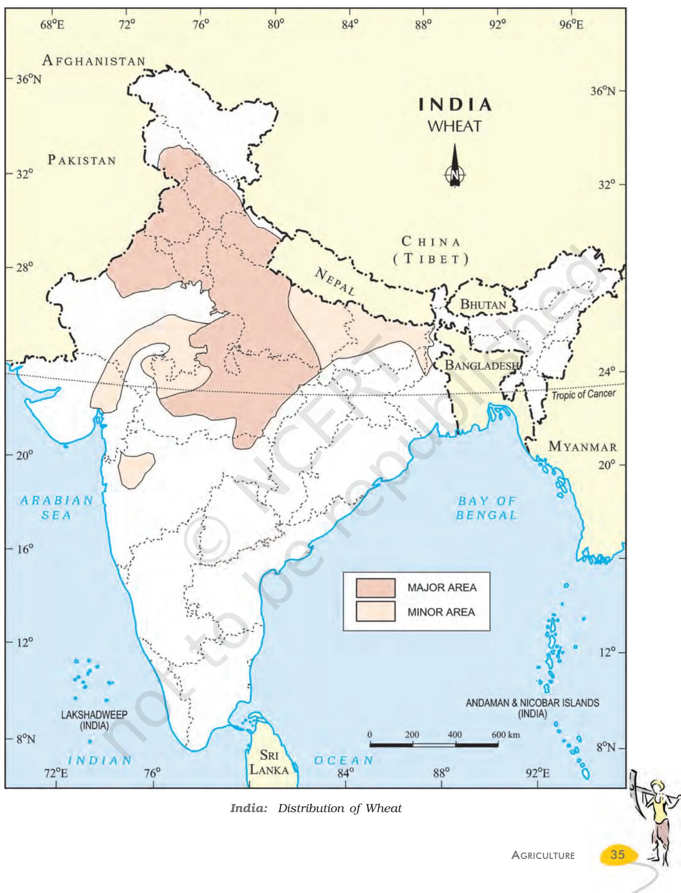

*Pulses:* India is the largest producer as well as the consumer of pulses in the world. These are the major source of protein in a vegetarian diet. Major pulses that are grown in India are tur (arhar), urad, moong, masur, peas and gram. Can you distinguish which of these pulses are grown in the kharif season and which are grown in the rabi season? Pulses need less moisture and survive even in dry conditions. Being leguminous crops, all these crops except arhar help in restoring soil fertility by fixing nitrogen from the air. Therefore, these are mostly grown in rotation with other crops. Major pulse producing states in India are Madhya Pradesh, Rajasthan, Maharashtra, Uttar Pradesh and Karnataka.

# Food Crops other than Grains

*Sugarcane:* It is a tropical as well as a subtropical crop. It grows well in hot and humid climate with a temperature of 21°C to 27°C and an annual rainfall between 75cm. and 100cm. Irrigation is required in the regions of low rainfall. It can be grown on a variety of soils and needs manual labour from

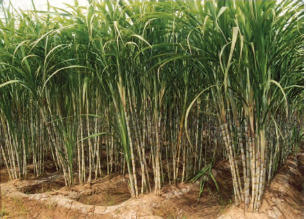

*Fig. 4.8: Sugarcane Cultivation*

sowing to harvesting. India is the second largest producer of sugarcane only after Brazil. It is the main source of sugar, gur (jaggary), khandsari and molasses. The major sugarcane-producing states are Uttar Pradesh, Maharashtra, Karnataka, Tamil Nadu, Andhra Pradesh, Telangana, Bihar, Punjab and Haryana.

*Oil Seeds:* In 2018 India was the second largest producer of groundnut in the world after China. In rapeseed production India was third largest producer in the world after Canada and China in 2018. Different oil seeds are grown covering approximately 12 per cent of the total cropped area of the country. Main oil-seeds produced in India are groundnut, mustard, coconut, sesamum (til), soyabean, castor seeds, cotton seeds, linseed and sunflower. Most of these are edible and used as cooking mediums. However, some of these are also used as raw material in the production of soap, cosmetics and ointments.

Groundnut is a kharif crop and accounts for about half of the major oilseeds produced in the country. Gujarat was the largest producer of groundnut followed by Rajasthan and Tamil Nadu in 2019–20. Linseed and mustard are rabi crops. Sesamum is a kharif crop in north and rabi crop in south India. Castor seed is grown both as rabi and kharif crop.

*Tea:* Tea cultivation is an example of plantation agriculture. It is also an important beverage crop introduced in India initially by the British. Today, most of the tea plantations are owned by Indians. The tea plant grows well in tropical and sub-tropical climates endowed with deep and fertile well-drained soil, rich in humus and organic matter. Tea bushes require warm and moist frost-free

*Fig. 4.9: Groundnut, sunflower and mustard are ready to be harvested in the field*

36 CONTEMPORARY INDIA – II

climate all through the year. Frequent showers evenly distributed over the year ensure continuous growth of tender leaves. Tea is a labour-intensive industry. It requires abundant, cheap and skilled labour. Tea is processed within the tea garden to restore its freshness. Major tea-

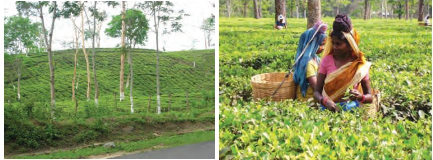

*Fig. 4.10: Tea Cultivation Fig. 4.11: Tea-leaves Harvesting*

producing states are Assam, hills of Darjeeling and Jalpaiguri districts, West Bengal, Tamil Nadu and Kerala. Apart from these, Himachal Pradesh, Uttarakhand, Meghalaya, Andhra Pradesh and Tripura are also tea-producing states in the country. In 2018 India was the second largest producer of tea after China.

*Coffee:* Indian coffee is known in the world for its good quality. The Arabica variety initially brought from Yemen is produced in the country. This variety is in great demand all over the world. Initially its cultivation was introduced on the Baba Budan Hills and even today its cultivation is confined to the Nilgiri in Karnataka, Kerala and Tamil Nadu.

*Horticulture Crops:* In 2018, India was the second largest producer of fruits and vegetables in the world after China. India is a producer of tropical as well as temperate fruits. Mangoes of Maharashtra, Andhra Pradesh, Telangana, Uttar Pradesh and West Bengal, oranges of Nagpur and Cherrapunjee (Meghalaya), bananas of Kerala, Mizoram, Maharashtra and Tamil Nadu, lichi and guava of Uttar Pradesh and Bihar, pineapples of Meghalaya, grapes of Andhra Pradesh, Telangana and Maharashtra, apples, pears, apricots and walnuts of Jammu and Kashmir and Himachal Pradesh are in great demand the world over.

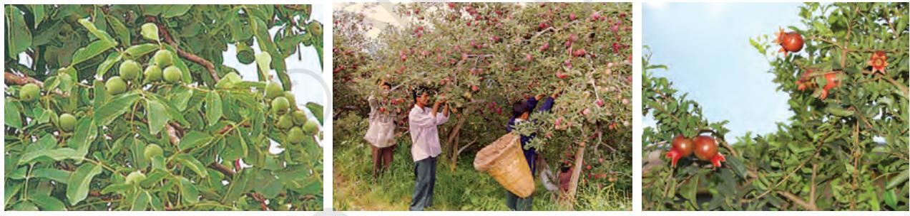

*Fig. 4.12: Apricots, apple and pomegranate*

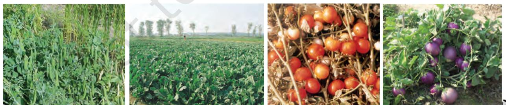

*Fig. 4.13: Cultivation of vegetables – peas, cauliflower, tomato and brinjal*

*Source: Pocket book of agricultural statistics, 2020, Govt. of India. Directorate of Economics and Statistics.*

AGRICULTURE 37

 India is an important producer of pea, cauliflower, onion, cabbage, tomato, brinjal and potato.

## Non-Food Crops

*Rubber:* It is an equatorial crop, but under special conditions, it is also grown in tropical and sub-tropical areas. It requires moist and humid climate with rainfall of more than 200 cm. and temperature above 25°C.

Rubber is an important industrial raw material. It is mainly grown in Kerala, Tamil Nadu, Karnataka and Andaman and Nicobar islands and Garo hills of Meghalaya.

List the items which are made of rubber and are used by us.

*Fibre Crops:* Cotton, jute, hemp and natural silk are the four major fibre crops grown in India. The first three are derived from the crops grown in the soil, the latter is obtained from cocoons of the silkworms fed on green leaves specially mulberry. Rearing of silk worms for the production of silk fibre is known as sericulture.

*Cotton:*India is believed to be the original home of the cotton plant. Cotton is one of the main raw materials for cotton textile industry. In 2017, India was second largest producer of cotton after China. Cotton grows well in drier parts of the black cotton soil of the Deccan plateau. It requires high temperature, light rainfall or irrigation, 210 frost-free days and bright sun-shine for its growth. It is a kharif crop and requires 6 to 8 months to mature. Major cotton-producing states are–

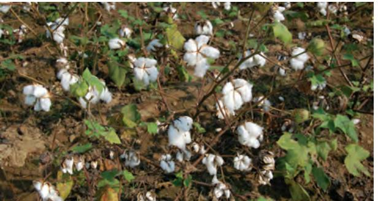

Maharashtra, Gujarat, Madhya Pradesh, Karnataka, Andhra Pradesh, Telangana, Tamil Nadu, Punjab, Haryana and Uttar Pradesh.

*Jute:*It is known as the golden fibre. Jute grows well on well-drained fertile soils in the flood plains where soils are renewed every year. High temperature is required during the time of growth. West Bengal, Bihar, Assam, Odisha and Meghalaya are the major jute producing states. It is used in making gunny bags, mats, ropes, yarn, carpets and other artefacts.

Technological and Institutional Reforms

It was mentioned in the previous pages that agriculture has been practised in India for thousands of years. Sustained uses of land without compatible techno-institutional changes have hindered the pace of agricultural development. Inspite of development of sources of irrigation most of the farmers in large parts of the country still depend upon monsoon and natural fertility in order to carry on their agriculture. For a growing population, this poses a serious challenge. Agriculture which provides livelihood for more than 60 per cent of its population, needs some serious technical and institutional reforms. Thus, collectivisation, consolidation of holdings, cooperation and abolition of zamindari, etc. were given priority to bring about institutional reforms in the country after Independence. 'Land reform' was the main focus of our First Five Year Plan. The right of inheritance had already lead to fragmentation of land holdings necessitating consolidation of holdings.

The laws of land reforms were enacted but the implementation was lacking or lukewarm. The Government of India embarked upon introducing agricultural reforms to improve Indian agriculture in the 1960s and 1970s. The Green Revolution based on the use of package technology and the White Revolution (Operation Flood) were some of the strategies initiated to improve the lot of Indian agriculture. But, this too led to the concentration of development in few selected areas. Therefore, in the 1980s and 1990s, a comprehensive land development programme was initiated, which *Fig. 4.14: Cotton Cultivation* included both institutional and technical

38 CONTEMPORARY INDIA – II

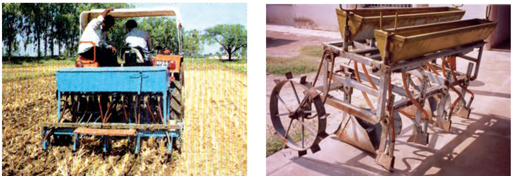

*Fig. 4.15: Modern technological equipments used in agriculture*

reforms. Provision for crop insurance against drought, flood, cyclone, fire and disease, establishment of Grameen banks, cooperative societies and banks for providing loan facilities to the farmers at lower rates of interest were some important steps in this direction.

Kissan Credit Card (KCC), Personal Accident Insurance Scheme (PAIS) are some other schemes introduced by the Government of India for the benefit of the farmers. Moreover, special weather bulletins and agricultural programmes for farmers were introduced on the radio and television. The government also announces minimum support price, remunerative and procurement prices for important crops to check the exploitation of farmers by speculators and middlemen.

Collect information about agriculture, horticulture, agricultural schemes, etc. from *Farmers' Portal* website https://farmer. gov.in/FarmerHome.aspx. Discuss about the benefits of the information available on the portal.

## **Bhoodan – Gramdan**

Mahatma Gandhi declared Vinoba Bhave as his spiritual heir. He also participated in Satyagraha as one of the foremost satyagrahis. He was one of the votaries of Gandhi's concept of **gram swarajya**. After Gandhiji's martyrdom, Vinoba Bhave undertook **padyatra** to spread Gandhiji's message covered almost the entire country. Once, when he was delivering a lecture at Pochampalli in Andhra Pradesh, some poor landless villagers demanded some land for their economic well-being. Vinoba Bhave could not promise it to them immediately but assured them to talk to the Government of India regarding provision of land for them if they undertook cooperative farming.

Suddenly, Shri Ram Chandra Reddy stood up and offered 80 acres of land to be distributed among 80 land-less villagers. This act was known as 'Bhoodan'. Later he travelled and introduced his ideas widely all over India. Some zamindars, owners of many villages offered to distribute some villages among the landless. It was known as **Gramdan**. However, many land-owners chose to provide some part of their land to the poor farmers due to the fear of land ceiling act. This Bhoodan-Gramdan movement initiated by Vinoba Bhave is also known as the **Blood-less Revolution**.

AGRICULTURE 39

# **EXERCISES EXERCISES EXERCISES EXERCISES EXERCISES**

- 1. Multiple choice questions.
	- (i) Which one of the following describes a system of agriculture where a single crop is grown on a large area?
		- (a) Shifting Agriculture
		- (b) Plantation Agriculture
		- (c) Horticulture
		- (d) Intensive Agriculture
	- (ii) Which one of the following is a rabi crop?
		- (a) Rice
		- (b) Gram
		- (c) Millets
		- (d) Cotton

#### (iii) Which one of the following is a leguminous crop?

- (a) Pulses
- (b) Jawar
- (c) Millets
- (d) Sesamum
- 2. Answer the following questions in 30 words.
	- (i) Name one important beverage crop and specify the geographical conditions required for its growth.
	- (ii) Name one staple crop of India and the regions where it is produced.
	- (iii) Enlist the various institutional reform programmes introduced by the government in the interest of farmers.
- 3. Answer the following questions in about 120 words.
	- (i) Suggest the initiative taken by the government to ensure the increase in agricultural production.
	- (ii) Describe the geographical conditions required for the growth of rice.

# **PROJECT WORK**

- 1. Group discussion on the necessity of literacy among farmers.
- 2. On an outline map of India show wheat producing areas.

# **ACTIVITY**

Solve the puzzle by following your search horizontally and vertically to find the hidden answers.

| A | Z | M | X | N | C | B | V | N | X | A | H | D | Q |
| --- | --- | --- | --- | --- | --- | --- | --- | --- | --- | --- | --- | --- | --- |
| S | D | E | W | S | R | J | D | Q | J | Z | V | R | E |
| D | K | H | A | R | I | F | G | W | F | M | R | F | W |
| F | N | L | R | G | C | H | H | R | S | B | S | V | T |
| G | B | C | W | H | E | A | T | Y | A | C | H | B | R |
| H | R | T | K | A | S | S | E | P | H | X | A | N | W |
| J | I | E | S | J | O | W | A | R | J | Z | H | D | T |
| K | C | L | A | E | G | A | C | O | F | F | E | E | Y |
| L | T | E | F | Y | M | T | A | T | S | S | R | G | I |
| P | D | E | J | O | U | Y | V | E | J | G | F | A | U |
| O | U | M | H | Q | S | U | D | I | T | S | W | S | P |
| U | O | A | C | O | T | T | O | N | E | A | H | F | O |
| Y | O | L | F | L | U | S | R | Q | Q | D | T | W | I |
| T | M | U | A | H | R | G | Y | K | T | R | A | B | F |
| E | A | K | D | G | D | Q | H | S | U | O | I | W | H |
| W | Q | Z | C | X | V | B | N | M | K | J | A | S | L |

- 1 . The two staple food crops of India.
- 2 . This is the summer cropping season of India.
- 3 . Pulses like arhar, moong, gram, urad contain…
- 4 . It is a coarse grain.
- 5 . The two important beverages in India are…
- 6 . One of the four major fibers grown on black soils.

AGRICULTURE 41

