Haban comes to Guwahati with his father from a remote village.

He sees people getting into strange house like objects which move along the road. He also sees a "kitchen" dragging a number of house along with it. He is amazed and asked his father "Why don't our houses move like the one we saw in Guwahati, Ba?"

Ba replies, "These are not houses, they are buses and trains. Unlike our houses these are not made of bricks and stones, metal like iron and alluminium are used in making these. They do not move on their own. They

are driven by an engine which needs energy to work."

We use different things in our daily life made from metal. Can you list a number of items used in your house made of metals. Where do these metals come from?

You have studied that the earth's crust is made up of different minerals embedded in the rocks. Various metals are extracted from these minerals after proper refinement.

Minerals are an indispensable part of our lives. Almost everything we use, from a tiny pin to a towering building or a big ship, all are made from minerals. The railway lines and the tarmac (paving) of the roads, our implements and machinery too are made from minerals. Cars, buses, trains, aeroplanes are manufactured from minerals and run on power resources derived from the earth. Even the food that we eat contains minerals. In all stages of development, human beings have used minerals for their livelihood, decoration, festivities, religious and ceremonial rites.

# **A bright smile from toothpaste and minerals**

Toothpaste cleans your teeth. Abrasive minerals like silica, limestone, aluminium oxide and various phosphate minerals do the cleaning. Fluoride which is used to reduce cavities, comes from a mineral fluorite. Most toothpaste are made white with titanium oxide, which comes from minerals called rutile, ilmenite and anatase. The sparkle in some toothpastes comes from mica. The toothbrush and tube containing the paste are made of plastics from petroleum. Find out where these minerals are found?

## **Dig a little deeper** and find out how many minerals are used to make a light bulb?

**All living things need minerals** Life processes cannot occur without minerals. Although our mineral intake represents only about 0.3 per cent of our total intake of nutrients, they are so potent and so important that without them we would not be able to utilise the other 99.7 per cent of foodstuffs.

## **Dig a little deeper** and collect "Nutritional Facts" printed on food labels.

#### *What is a mineral?*

Geologists define mineral as a "homogenous, natura lly occurring substance with a definable internal structure." Minerals are found in varied forms in nature, ranging from the hardest diamond to the softest talc. Why are they so varied?

You have already learnt about rocks. Rocks are combinations of homogenous substances called minerals. Some rocks, for instance limestone, consist of a single mineral only, but majority of the rock consist of several minerals in varying proportions. Although, over 2000 minerals have been identified, only a few are abundantly found in most of the rocks.

A particular mineral that will be formed from a certain combination of elements depends upon the physical and chemical conditions under which the material forms. This, in turn, results in a wide range of colours, hardness, crystal forms, lustre and density that a particular mineral possesses. Geologists use these properties to classify the minerals.

# **Study of Minerals by Geographers and Geologists**

Geographers study minerals as part of the earth's crust for a better understanding of landforms. The distribution of mineral resources and associated economic activities are of interest to geographers. A geologist, however, is interested in the formation of minerals, their age and physical and chemical composition.

However, for general and commercial purposes minerals can be classified as under.

## MODE OF OCCURRENCE OF MINERALS

#### *Where are these minerals found?*

Minerals are usually found in "ores". The term ore is used to describe an accumulation of any mineral mixed with other elements. The mineral content of the ore must be in sufficient concentration to make its extraction commercially viable. The type of formation or structure in which they are found determines the relative ease with which mineral ores may be mined. This also determines the cost of extraction. It is, therefore, important for us to understand the main types of formations in which minerals occur.

Minerals generally occur in these forms:

- (i) In igneous and metamorphic rocks minerals may occur in the cracks, crevices, faults or joints. The smaller occurrences are called veins and the larger are called lodes. In most cases, they are formed when minerals in liquid/ molten and gaseous forms are forced upward through cavities towards the earth's surface. They cool and solidify as they rise. Major metallic minerals like tin, copper, zinc and lead etc. are obtained from veins and lodes.
- (ii) In sedimentary rocks a number of minerals occur in beds or layers. They have been formed as a result of deposition, accumulation and concentration in horizontal strata. Coal and some forms of iron ore have been concentrated as a result of long periods under great heat and pressure. Another group of sedimentary minerals include gypsum, potash salt and sodium salt. These are formed as a result of evaporation especially in arid regions.

(iii) Another mode of formation involves the decomposition of surface rocks, and the removal of soluble constituents, leaving a residual mass of weathered material containing ores. Bauxite is formed this way.

MINERALS AND ENERGY RESOURCES 43

- (iv) Certain minerals may occur as alluvial deposits in sands of valley floors and the base of hills. These deposits are called 'placer deposits' and generally contain minerals, which are not corroded by water. Gold, silver, tin and platinum are most important among such minerals.
- (v) The ocean waters contain vast quantities of minerals, but most of these are too widely diffused to be of economic significance. However, common salt, magnesium and bromine are largely derived from ocean waters. The ocean beds, too, are rich in manganese nodules.

Rat-Hole Mining. Do you know that most of the minerals in India are nationalised and their extraction is possible only after obtaining due permission from the government? But in most of the tribal areas of the north-east India, minerals are owned by individuals or communities. In Meghalaya, there are large deposits of coal, iron ore, limestone and dolomite etc. Coal mining in Jowai and Cherapunjee is done by family member in the form of a long narrow tunnel, known as 'Rat hole' mining. The National Green Tribunal has declared such activities illegal and recommended that these should be stopped forthwith.

# **Dig a little deeper:** What is the difference between an open pit mine, a quarry and an underground mine with shafts?

India is fortunate to have fairly rich and varied mineral resources. However, these are unevenly distributed. Broadly speaking, peninsular rocks contain most of the reserves of coal, metallic minerals, mica and many other non-metallic minerals. Sedimentary rocks on the western and eastern flanks of the peninsula, in Gujarat and Assam have most of the petroleum deposits. Rajasthan with the rock systems of the peninsula, has reserves of many

non-ferrous minerals. The vast alluvial plains of north India are almost devoid of economic minerals. These variations exist largely because of the differences in the geological structure, processes and time involved in the formation of minerals.

Let us now study the distribution of a few major minerals in India. Always remember that the concentration of mineral in the ore, the ease of extraction and closeness to the market play an important role in affecting the economic viability of a reserve. Thus, to meet the demand, a choice has to be made between a number of possible options. When this is done a mineral 'deposit' or 'reserve' turns into a mine.

# Ferrous Minerals

Ferrous minerals account for about threefourths of the total value of the production of metallic minerals. They provide a strong base for the development of metallurgical industries. India exports substantial quantities of ferrous minerals after meeting her internal demands.

#### *Iron Ore*

Iron ore is the basic mineral and the backbone of industrial development. India is endowed with fairly abundant resources of iron ore. India is rich in good quality iron ores. Magnetite is the finest iron ore with a very high content of iron up to 70 per cent. It has excellent magnetic qualities, especially valuable in the electrical industry. Hematite ore is the most important industrial iron ore in terms of the quantity used, but has a slightly lower iron content than magnetite. (50-60 per cent). In 2018–19 almost entire production of iron ore (97%) accrued from Odisha, Chhattisgarh, Karnataka and Jharkhand. The remaining production (3%) was from other states.

Kudre in Kannada means horse. The highest peak in the western ghats of Karnataka resembles the face of a horse. The Bailadila hills look like the hump of an ox, and hence its name.

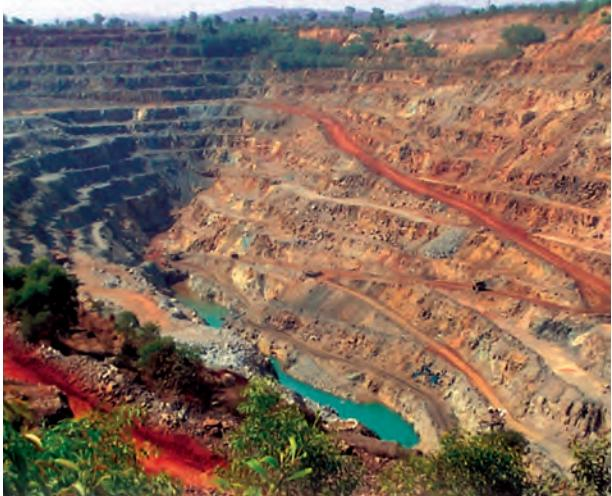

*Fig. 5.2: Iron ore mine*

The major iron ore belts in India are:

- *Odisha-Jharkhand belt*: In Odisha high grade hematite ore is found in Badampahar mines in the Mayurbhanj and Kendujhar districts. In the adjoining Singbhum district of Jharkhand haematite iron ore is mined in Gua and Noamundi.
- *Durg-Bastar-Chandrapur belt* lies in Chhattisgarh and Maharashtra. Very high grade hematites are found in the famous Bailadila range of hills in the Bastar district of Chhattisgarh. The range of hills comprise of 14 deposits of super high grade hematite iron ore. It has the best physical properties needed for steel making. Iron ore from these mines is exported to Japan and South Korea via Vishakhapatnam port.
- *Ballari-Chitradurga*-*Chikkamagaluru-Tumakuru belt* in Karnataka has large reserves of iron ore. The Kudremukh mines located in the Western Ghats of Karnataka are a 100 per cent export unit. Kudremukh deposits are known to be one of the largest in the world. The ore is transported as slurry through a pipeline to a port near Mangaluru.
- *Maharashtra-Goa belt* includes the state of Goa and Ratnagiri district of

Maharashtra. Though, the ores are not of very high quality, yet they are efficiently exploited. Iron ore is exported through Marmagao port.

### *Manganese*

Manganese is mainly used in the manufacturing of steel and ferro-manganese alloy. Nearly 10 kg of manganese is required to manufacture one tonne of steel. It is also used in manufacturing bleaching powder, insecticides and paints.

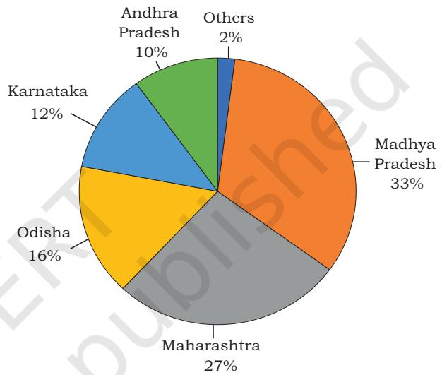

*Fig. 5.3: Production of Manganese showing state-wise share in per cent, 2018–19*

**Dig a little deeper:** Superimpose the maps showing distribution of iron ore, manganese, coal and iron and steel industry. Do you see any correlation. Why?

## Non-Ferrous Minerals

India's reserves and production of nonferrous minerals is not very satisfactory. However, these minerals, which include copper, bauxite, lead, zinc and gold play a vital role in a number of metallurgical, engineering and electrical industries. Let us study the distribution of copper and bauxite.

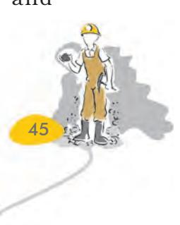

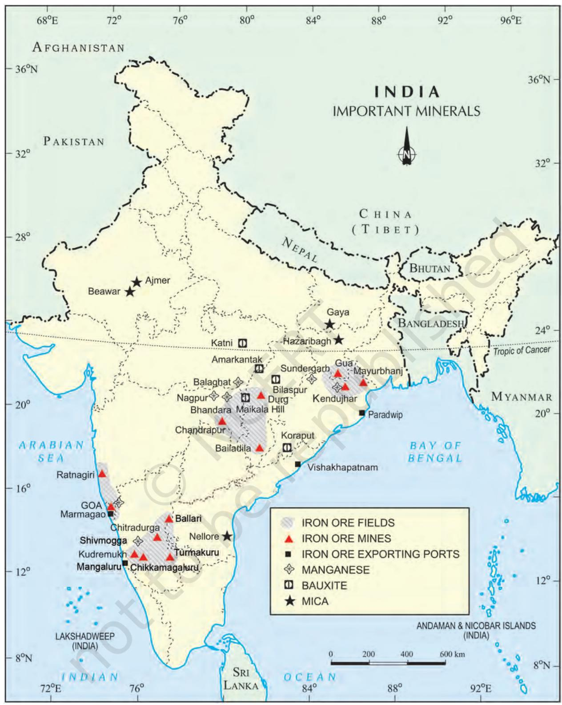

46 CONTEMPORARY INDIA – II

# *Copper*

India is critically deficient in the reserve and production of copper. Being malleable, ductile and a good conductor, copper is mainly used in electrical cables, electronics and chemical

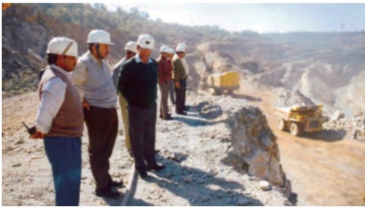

*Fig. 5.4: Copper mines at Malanjkhand*

industries. The Balaghat mines in Madhya Pradesh, Khetri mines in Rajasthan and Singhbhum district of Jharkhand are leading producers of copper.

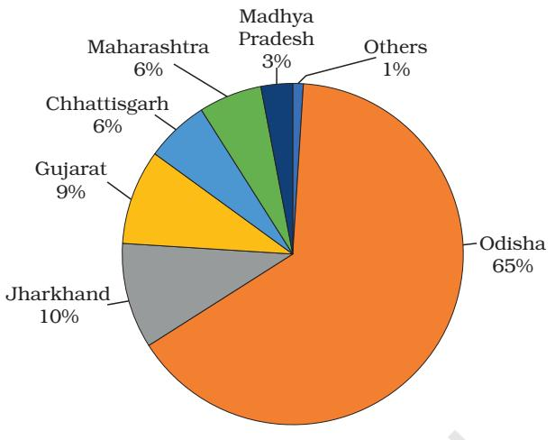

*Fig. 5.5: Production of Bauxite showing state-wise share in per cent, 2018–19*

Odisha was the largest bauxite producing state in India in 2016-17. Panchpatmali deposits in Koraput district are the most important bauxite deposits in the state.

## *Bauxite*

Though, several ores contain aluminium, it is from bauxite, a clay-like substance that alumina and later aluminium is obtained. Bauxite deposits are formed by the decomposition of a wide variety of rocks rich in aluminium silicates.

Aluminium is an important metal because it combines the strength of metals such as iron, with extreme lightness and also with good conductivity and great malleability.

India's bauxite deposits are mainly found in the

Amarkantak plateau, Maikal hills and the

plateau region of Bilaspur-Katni.

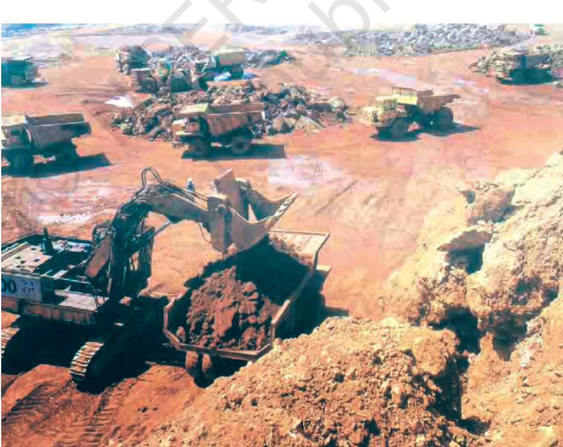

*Fig.5.6: Bauxite Mine*

**Dig a little deeper**: Locate the mines of Bauxite on the physical map of India.

MINERALS AND ENERGY RESOURCES 47

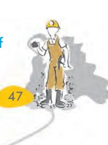

After the discovery of aluminium Emperor Napoleon III wore buttons and hooks on his clothes made of aluminium and served food to his more illustrious guests in aluminium utensils and the less honourable ones were served in gold and silver utensils. Thirty years after this incident aluminium bowls were most common with the beggars in Paris.

# Non-Metallic Minerals

*Mica* is a mineral made up of a series of plates or leaves. It splits easily into thin sheets. These sheets can be so thin that a thousand can be layered into a mica sheet of a few centimeters high. Mica can be clear, black, green, red yellow or brown. Due to its excellent di-electric strength, low power loss factor, insulating properties and resistance to high voltage, mica is one of the most indispensable minerals used in electric and electronic industries.

Mica deposits are found in the northern edge of the Chota Nagpur plateau. Koderma Gaya – Hazaribagh belt of Jharkhand is the leading producer.

In Rajasthan, the major mica producing area is around Ajmer. Nellore mica belt of Andhra Pradesh is also an important producer in the country.

# Rock Minerals

*Limestone* is found in association with rocks composed of calcium carbonates or calcium and magnesium carbonates. It is found in sedimentary rocks of most geological formations. Limestone is the basic raw material for the cement industry and essential for smelting iron ore in the blast furnace.

**Dig a little deeper**: Study the maps to explain why Chota Nagpur is a storehouse of minerals.

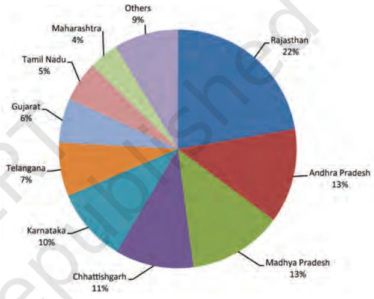

*Fig. 5.7: Production of Limestone showing state-wise share in per cent, 2018–19*

# **Hazards of Mining**

Have you ever wondered about the efforts the miners make in making life comfortable

for you? What are the impacts of mining on the health of the miners and the environment?

The dust and noxious fumes inhaled by miners make them vulnerable to pulmonary diseases. The risk of collapsing mine roofs, inundation and fires in coalmines are a constant threat to miners.

The water sources in the region get contaminated due to mining. Dumping of waste and slurry leads to degradation of land, soil, and increase in stream and river pollution.

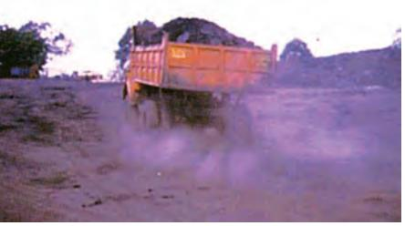

*Fig. 5.8: Air pollution due to generation of dust in mining areas*

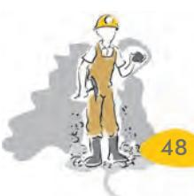

48 CONTEMPORARY INDIA – II

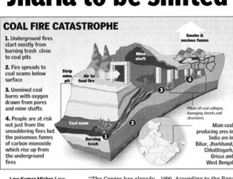

Stricter safety regulations and implementation of environmental laws are essential to prevent mining from becoming a "killer industry".

## CONSERVATION OF MINERALS

We all appreciate the strong dependence of industry and agriculture upon mineral deposits and the substances manufactured from them. The total volume of workable mineral deposits is an insignificant fraction i.e. one per cent of the earth's crust. We are rapidly consuming mineral resources that

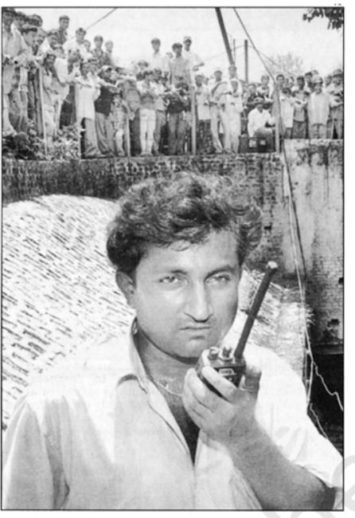

required millions of years to be created and concentrated. The geological processes of mineral formation are so slow that the rates of replenishment are infinitely small in comparison to the present rates of consumption. Mineral resources are, therefore, finite and non-renewable. Rich mineral deposits are our country's extremely valuable but short-lived possessions. Continued extraction of ores leads to increasing costs as mineral extraction comes from greater depths along with decrease in quality.

MINERALS AND ENERGY RESOURCES 49

A concerted effort has to be made in order to use our mineral resources in a planned and sustainable manner. Improved technologies need to be constantly evolved to allow use of low grade ores at low costs. Recycling of metals, using scrap metals and other substitutes are steps in conserving our mineral resources for the future.

# **Dig a little deeper:** Make a list of items where substitutes are being used instead of minerals. Where are these substitutes obtained from?

## Energy Resources

Energy is required for all activities. It is needed to cook, to provide light and heat, to propel vehicles and to drive machinery in industries.

Energy can be generated from fuel minerals like coal, petroleum, natural gas, uranium and from electricity. Energy resources can be classified as conventional and non-conventional sources. Conventional sources include: firewood, cattle dung cake, coal, petroleum, natural gas and electricity (both hydel and thermal). Non-conventional sources include solar, wind, tidal, geothermal, biogas and atomic energy. Firewood and cattle dung cake are most common in rural India. According to one estimate more than 70 per cent energy requirement in rural households is met by these two ; continuation of these is increasingly becoming difficult due to decreasing forest area. Moreover, using dung cake too is being discouraged because it consumes most valuable manure which could be used in agriculture.

### Conventional Sources of Energy

*Coal:* In India, coal is the most abundantly available fossil fuel. It provides a substantial part of the nation's energy needs. It is used for power generation, to supply energy to industry as well as for domestic needs. India is highly dependent on coal for meeting its commercial energy requirements.

As you are already aware that coal is formed due the compression of plant material over millions of years. Coal, therefore, is found in a variety of forms depending on the degrees of compression and the depth and

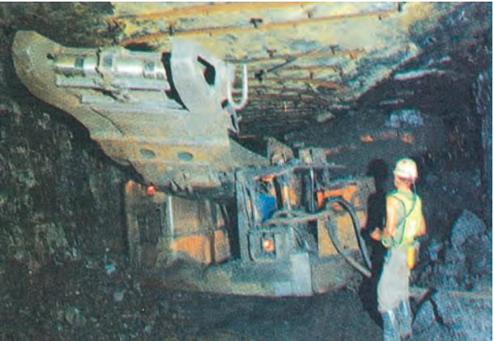

*Fig. 5.9 (a): A view from inside of a coal mine*

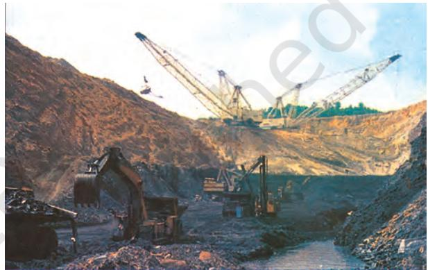

*Fig. 5.9 (b): A view from outside of a coal mine*

time of burial. Decaying plants in swamps produce peat. Which has a low carbon and high moisture contents and low heating capacity. Lignite is a low grade brown coal, which is soft with high moisture content. The principal lignite reserves are in Neyveli in Tamil Nadu and are used for generation of electricity. Coal that has been buried deep and subjected to increased temperatures is bituminous coal. It is the most popular coal in commercial use. Metallurgical coal is high grade bituminous coal which has a special value for smelting iron in blast furnaces. Anthracite is the highest quality hard coal.

In India coal occurs in rock series of two main geological ages, namely Gondwana, a little over 200 million years in age and in tertiary deposits which are only about 55 million years old. The major resources of Gondwana coal, which are metallurgical coal, are located in Damodar valley (West Bengal-

50 CONTEMPORARY INDIA – II

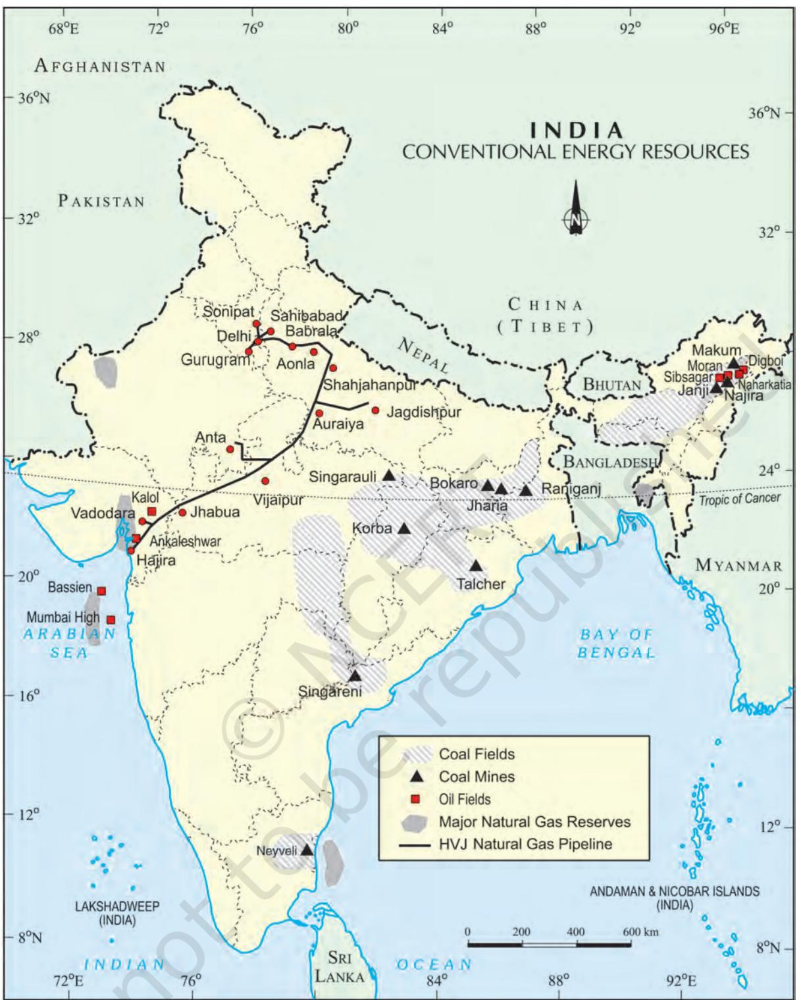

*India: Distribution of Coal, Oil and Natural Gas*

Collect information about cross country natural gas pipelines laid by GAIL (India) under "One Nation One Grid".

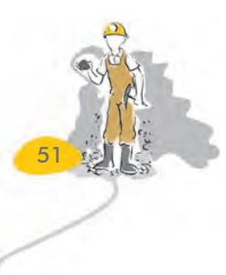

MINERALS AND ENERGY RESOURCES 51

Jharkhand). Jharia, Raniganj, Bokaro are important coalfields. The Godavari, Mahanadi, Son and Wardha valleys also contain coal deposits.

Tertiary coals occur in the north eastern states of Meghalaya, Assam, Arunachal Pradesh and Nagaland.

Remember coal is a bulky material, which loses weight on use as it is reduced to ash. Hence, heavy industries and thermal power stations are located on or near the coalfields.

### *Petroleum*

Petroleum or mineral oil is the next major energy source in India after coal. It provides fuel for heat and lighting, lubricants for machinery and raw materials for a number of manufacturing industries. Petroleum refineries act as a "nodal industry" for synthetic textile, fertiliser and numerous chemical industries.

Most of the petroleum occurrences in India are associated with anticlines and fault traps in the rock formations of the tertiary age. In regions of folding, anticlines or domes, it occurs where oil is trapped in the crest of the upfold. The oil bearing layer is a porous limestone or sandstone through which oil may flow. The oil is prevented from rising or sinking by intervening non-porous layers.

Petroleum is also found in fault traps between porous and non-porous rocks. Gas, being lighter usually occurs above the oil.

Mumbai High, Gujarat and Assam are major petroleum production areas in India. From the map locate the 3 major off shore fields of western India. Ankeleshwar is the most important field of Gujarat. Assam is the oldest oil producing state of India. Digboi, Naharkatiya and Moran-Hugrijan are the important oil fields in the state.

### *Natural Gas*

Natural Gas is found with petroleum deposits and is released when crude oil is brought to the surface. It can be used as a domestic and industrial fuel. It is used as fuel in power sector to generate electricity, for heating purpose in industries, as raw material in chemical, petrochemical and fertilizer industries, as transport fuel and as cooking fuel. With the expansion of gas infrastructure and local city

52 CONTEMPORARY INDIA – II

gas distribution (COD) networks, natural gas is also emerging as a preferred transport fuel (CNG) and cooking fuel (PNG) at homes. India's major gas reserves are found in the Mumbai High and allied fields along the west coast which are supplemented by finds in the Cambay basin. Along the East Coast, new reserves of natural gas have been discovered in the Krishna-Godavari basin.

The first 1,700 km long Hazira-Vijaipur-Jagdishpur (HVJ) cross country gas pipeline, constructed by GAIL (India), linked Mumbai High and Bassein gas fields with various fertilizer, power and industrial complexes in western and northen India. This artery provided impetus to Indian gas market development. Overall, India's gas infrastructure has expanded over ten times from 1,700 km to 18,500 km of cross-country pipelines and is expected to soon reach over 34, 000 km as Gas Grid by linking all gas sources and consuming markets across the country including North Eastern states.

#### *Electricity*

Electricity has such a wide range of applications in today's world that, its percapita consumption is considered as an index of development. Electricity is generated mainly in two ways: by running water which drives hydro turbines to generate *hydro electricity;* and by burning other fuels such as coal, petroleum and natural gas to drive turbines to produce *thermal power.* Once generated the electricity is exactly the same.

Name some river valley projects and write the names of the dams built on these rivers.

*Hydro electricity* is generated by fast flowing water, which is a renewable resource. India has a number of multi-purpose projects like the Bhakra Nangal, Damodar Valley corporation, the Kopili Hydel Project etc. producing hydroelectric power.

*Thermal electricity* is generated by using coal, petroleum and natural gas. The thermal power stations use non-renewable fossil fuels for generating electricity.

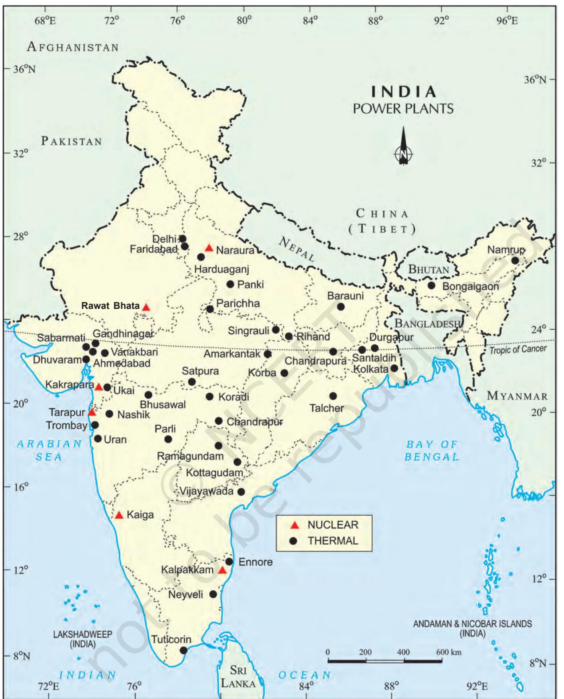

*India: Distribution of Nuclear and Thermal Power Plants*

MINERALS AND ENERGY RESOURCES 53

*Collect information about thermal/hydel power plants located in your state. Show them on the map of India.*

# Non-Conventional Sources of Energy

The growing consumption of energy has resulted in the country becoming increasingly dependent on fossil fuels such as coal, oil and gas. Rising prices of oil and gas and their potential shortages have raised uncertainties about the security of energy supply in future, which in turn has serious repercussions on the growth of the national economy. Moreover, increasing use of fossil fuels also causes serious environmental problems. Hence, there is a pressing need to use renewable energy sources like solar energy, wind, tide, biomass and energy from waste material. These are called non-conventional energy sources.

India is blessed with an abundance of sunlight, water, wind and biomass. It has the largest programmes for the development of these renewable energy resources.

### *Nuclear or Atomic Energy*

It is obtained by altering the structure of atoms. When such an alteration is made, much energy is released in the form of heat and this is used to generate electric power. Uranium and Thorium, which are available in Jharkhand and the Aravalli ranges of Rajasthan are used for generating atomic or nuclear power. The Monazite sands of Kerala is also rich in Thorium.

*Locate the 6 nuclear power stations and find out the state in which they are located.*

#### *Solar Energy*

India is a tropical country. It has enormous possibilities of tapping solar energy. Photovoltaic technology converts sunlight directly into electricity. Solar energy is fast becoming popular in rural and remote areas. Some big solar power plants are being established in different parts of India which will minimise the dependence of rural households on firewood and dung cakes, which in turn will contribute to environmental conservation and adequate supply of manure in agriculture.

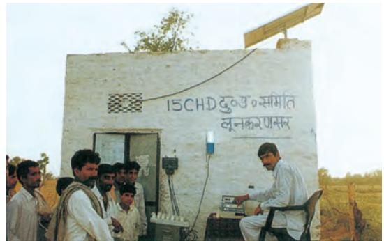

*Fig. 5.10: Solar operated electronic milk testing equipment*

Collect information about newly established solar power plants in India.

#### *Wind power*

India has great potential of wind power. The largest wind farm cluster is located in Tamil Nadu from Nagarcoil to Madurai. Apart from these, Andhra Pradesh, Karnataka, Gujarat, Kerala, Maharashtra and Lakshadweep have important wind farms. Nagarcoil and Jaisalmer are well known for effective use of wind energy in the country.

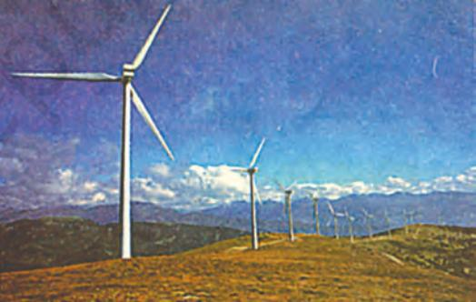

*Fig. 5.11: Wind mills – Nagarcoil*

#### *Biogas*

Shrubs, farm waste, animal and human waste are used to produce biogas for domestic consumption in rural areas. Decomposition of organic matter yields gas, which has higher thermal efficiency in comparison to kerosene, dung cake and charcoal. Biogas plants are set up at municipal, cooperative and individual levels. The plants using cattle dung are known as *'Gobar gas plants'* in rural India. These provide twin benefits to the farmer in the form of energy and improved quality of manure. Biogas is by far the most efficient use of cattle dung. It improves the quality of manure and also prevents the loss of trees and manure due to burning of fuel wood and cow dung cakes.

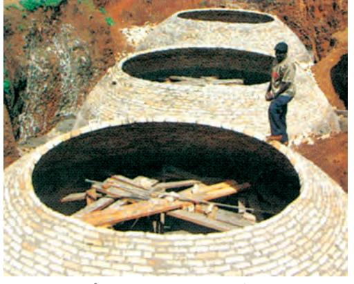

*Fig. 5.12: Biogas Plant*

#### *Tidal Energy*

Oceanic tides can be used to generate electricity. Floodgate dams are built across inlets. During high tide water flows into the inlet and gets trapped when the gate is closed. After the tide falls outside the flood gate, the water retained by the floodgate flows back to the sea via a pipe that carries it through a power-generating turbine.

In India the Gulf of Khambhat, the Gulf of Kuchchh in Gujarat on the western coast and Gangetic delta in Sunderban regions of West Bengal provide ideal conditions for utilising tidal energy.

#### *Geo Thermal Energy*

Geo thermal energy refers to the heat and electricity produced by using the heat from the interior of the Earth. Geothermal energy exists because, the Earth grows progressively hotter with increasing depth. Where the

geothermal gradient is high, high temperatures are found at shallow depths. Groundwater in such areas absorbs heat from the rocks and becomes hot. It is so hot that when it rises to the earth's surface, it turns into steam. This steam is used to drive turbines and generate electricity.

There are several hundred hot springs in India, which could be used to generate electricity. Two experimental projects have been set up in India to harness geothermal energy. One is located in the Parvati valley near Manikarn in Himachal Pradesh and the other is located in the Puga Valley, Ladakh.

#### Conservation of Energy Resources

Energy is a basic requirement for economic development. Every sector of the national economy – agriculture, industry, transport, commercial and domestic – needs inputs of energy. The economic development plans implemented since Independence necessarily required increasing amounts of energy to remain operational. As a result, consumption of energy in all forms has been steadily rising all over the country.

In this background, there is an urgent need to develop a sustainable path of energy development. Promotion of energy conservation and increased use of renewable energy sources are the twin planks of sustainable energy.

India is presently one of the least energy efficient countries in the world. We have to adopt a cautious approach for the judicious use of our limited energy resources. For example, as concerned citizens we can do our bit by using public transport systems instead of individual vehicles; switching off electricity when not in use, using power-saving devices and using non-conventional sources of energy. After all, "energy saved is energy produced".

## **EXERCISES EXERCISES EXERCISES EXERCISES EXERCISES**

1. Multiple choice questions.

- (i) Which one of the following minerals is formed by decomposition of rocks, leaving a residual mass of weathered material? (a) coal (b) bauxite (c) gold (d) zinc
- (ii) Koderma, in Jharkhand is the leading producer of which one of the following minerals?
	- (a) bauxite (b) mica (c) iron ore (d) copper

MINERALS AND ENERGY RESOURCES 55

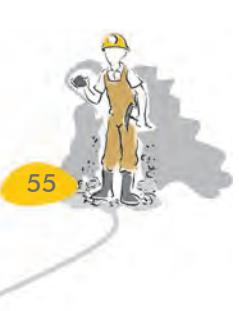

- (iii) Minerals are deposited and accumulated in the stratas of which of the following rocks?
	- (a) sedimentary rocks (c) igneous rocks
	- (b) metamorphic rocks (d) none of the above
- (iv) Which one of the following minerals is contained in the Monazite sand?
	- (a) oil (b) uranium (c) thorium (d) coal
- 2. Answer the following questions in about 30 words.
	- (i) Distinguish between the following in not more than 30 words.
		- (a) ferrous and non-ferrous minerals
	- (b) conventional and non-conventional sources of energy
	- (ii) What is a mineral?
	- (iii) How are minerals formed in igneous and metamorphic rocks?
	- (iv) Why do we need to conserve mineral resources ?
- 3. Answer the following questions in about 120 words.
	- (i) Describe the distribution of coal in India.
	- (ii) Why do you think that solar energy has a bright future in India?

## **ACTIVITY**

Fill the name of the correct mineral in the crossword below:

| 2 | 1 | M |  |
| --- | --- | --- | --- |
| 2 | M |  |  |
| 4 | 3 | M |  |
| 4 | T |  |  |
| 5 | 1 | 5 | T |
| 6 | o |  |  |
| 7 | y |  |  |

## ACROSS

- 1. A ferrous mineral (9)
- 2. Raw material for cement industry (9)
- 3. Finest iron ore with magnetic properties (9)
- 4. Highest quality hard coal (10)
- 5. Aluminium is obtained from this ore (7)
- 6. Khetri mines are famous for this mineral (6)
- 7. Formed due to evaporation (6)

#### DOWN

- 1. Found in placer deposit (4)
- 2. Iron ore mined in Bailadila (8)
- 3. Indispensable for electrical industry (4)
- 4. Geological Age of coal found in north east India (8)
- 5. Formed in veins and lodes (3)

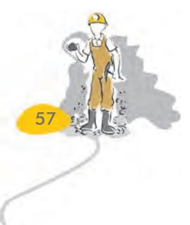

