We use different materials and services in our daily life. Some of these are available in our immediate surroundings, while other requirements are met by bringing things from other places. Goods and services do not move from supply locales to demand locales on their own. The movement of these goods and services from their supply locations to demand locations necessitates the need for transport. Some people are engaged in facilitating these movements. These are known to be traders who make the products come to the consumers by transportation. Thus, the pace of development of a country depends upon the production of goods and services as well as their movement over space. Therefore, efficient means of transport are prerequisites for fast development.

Movement of these goods and services can be over three important domains of our earth i.e. land, water and air. Based on these, transport can also be classified into land, water and air transport.

the help of equally developed communication system. Therefore, transport, communication and trade are complementary to each other.

Today, India is well-linked with the rest of the world despite its vast size, diversity and linguistic and socio-cultural plurality. Railways, airways, waterways, newspapers, radio, television, cinema and internet, etc. have been contributing to its socio-economic progress in many ways. The trades from local to international levels have added to the vitality of its economy. It has enriched our life and added substantially to growing amenities and facilities for the comforts of life.

In this chapter, you will see how modern means of transport and communication serve as lifelines of our nation and its modern economy. It is thus, evident that a dense and efficient network of transport and communication is a prerequisite for local, national and global trade of today.

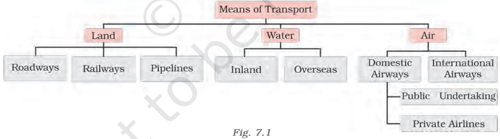

For a long time, trade and transport were restricted to a limited space. With the development in science and technology, the area of influence of trade and transport expanded far and wide. Today, the world has been converted into a large village with the help of efficient and fast moving transport. Transport has been able to achieve this with

# **TRANSPORT**

### **Roadways**

India has second largest road networks in the world, aggregating to about 62.16 lakh km (2020–21). In India, roadways have preceded railways. They still have an edge over railways in view of the ease with which they can be built and maintained. The growing importance of road transport vis-à-vis rail transport is rooted in the following reasons; (a) construction cost of roads is much lower than that of railway lines, (b) roads can traverse comparatively more dissected and undulating topography, (c) roads can negotiate higher gradients of slopes and as such can traverse mountains such as the Himalayas, (d) road transport is economical in transportation of few persons and relatively smaller amount of goods over short distances, (e) it also provides door to-door service, thus the cost of loading and unloading is much lower, (f) road transport is also used as a feeder to other modes of transport such as they provide a link between railway stations, air and sea ports.

In India, roads are classified in the following six classes according to their capacity. Look at the map of the National Highways and find out about the significant role played by these roads.

- **Golden Quadrilateral Super Highways:** The government has launched a major road development project linking Delhi-Kolkata-Chennai-Mumbai and Delhi by six-lane Super Highways. The North-South corridors linking Srinagar (Jammu & Kashmir) and Kanniyakumari (Tamil Nadu), and East-West Corridor connecting Silchar (Assam) and Porbander (Gujarat) are part of this project. The major objective of these Super Highways is to reduce the time and distance between the mega cities of India. These highway projects are being implemented by the National Highway Authority of India (NHAI).
- **National Highways:** National Highways link extreme parts of the country. These are the primary road systems. A number of major National Highways run in North-South and East-West directions.
- **State Highways:** Roads linking a state capital with different district headquarters are known as State Highways.

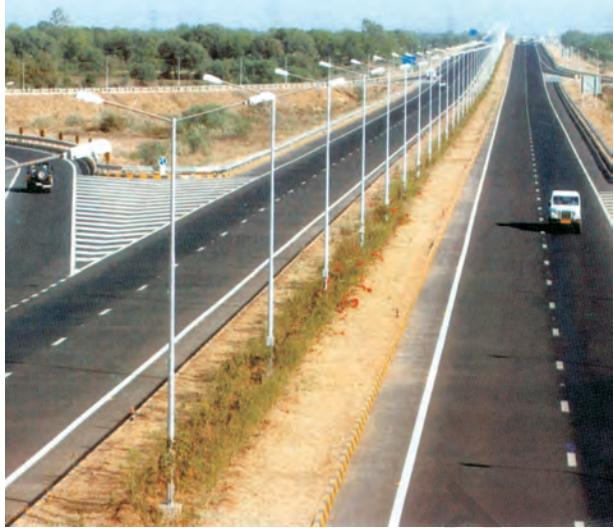

**Fig.7.2:** *Ahmedabad- Vadodara Expressway*

Collect information of National Highway numbers (old and new) from the website morth.nic.in/national-highway-details. The historical Sher-Shah Suri Marg between Delhi and Amritsar is known by which National Highway ?

- **District Roads:** These roads connect the district headquarters with other places of the district.
- **Other Roads:** Rural roads, which link rural areas and villages with towns, are classified under this category. These roads received special impetus under the *Pradhan Mantri Grameen Sadak Yojana*. Under this scheme special provisions are made so that every village in the country is linked to a major town in the country by an all season motorable road.
- **Border Roads:** Apart from these, Border Roads Organisation a Government of India undertaking constructs and maintains roads in the bordering areas of the country. This organisation was established in 1960 for the development of the roads of strategic importance in the northern and north-eastern border areas. These roads have improved accessibility in areas of difficult terrain and have helped in the economic development of these area.

72 CONTEMPORARY INDIA – II

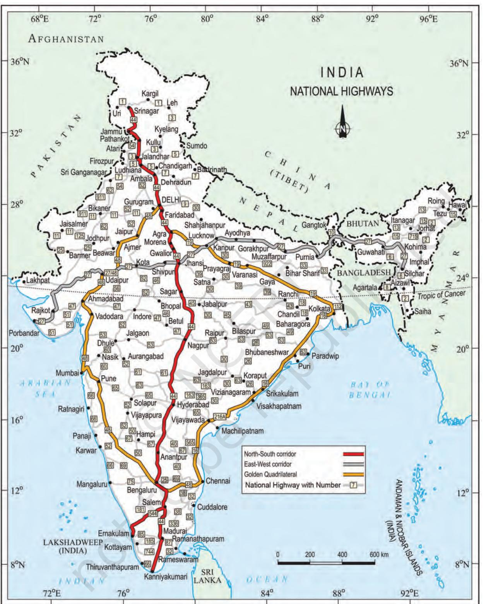

**India:** *National Highways*

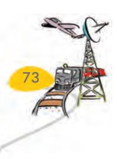

LIFELINES OF NATIONAL ECONOMY 73

The World's longest Highway tunnel-Atal Tunnel (9.02 Km) has been built by Border Road Organisation. This tunnel connects Manali to Lahul-Spiti valley throughout the year. Earlier the valley was cut off for about 6 months each year owing to heavy snowfall. The tunnel is buit with ultra-modern specifications in the Pir Panjal range of Himalayas at an altitude of 3000 metres from the Mean Sea Level (MSL).

**Source:** http://www.bro.gov.in/pagefimg. asp?imid=144,And PIBdelhi03October2020

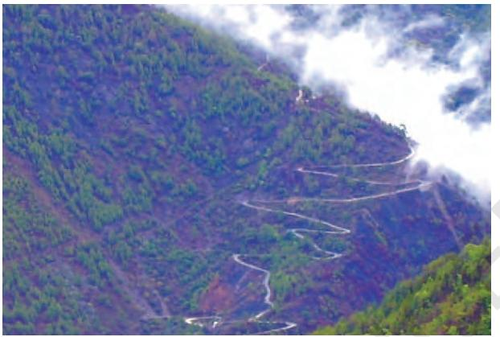

**Fig. 7.3:** *Hilly Tracts*

**Fig. 7.4:** *Traffic on north-eastern border road (Arunachal Pradesh)*

Roads can also be classified on the basis of the type of material used for their construction such as metalled and unmetalled roads. Metalled roads may be made of cement, concrete or even bitumen of coal, therefore, these are all weather roads. Unmetalled roads go out of use in the rainy season.

74 CONTEMPORARY INDIA – II

### **Railways**

Railways are the principal mode of transportation for freight and passengers in India. Railways also make it possible for people to conduct multifarious activities like business, sightseeing, pilgrimage along with transportation of goods over longer distances. Apart from an important means of transport the Indian Railways have been a great integrating force for more than 150 years. Railways in India bind the economic life of the country as well as accelerate the development of the industry and agriculture.

> The Indian Railways is the largest public sector undertaking in the country. The first train steamed off from Mumbai to Thane in 1853, covering a distance of 34 km.

The Indian Railway is now reorganised into 17 zones.

Find out the current Railway zones and their headquarters. Also locate the headquarters of Railway zones on the map of India.

The distribution pattern of the Railway network in the country has been largely influenced by physiographic, economic and administrative factors. The northern plains with their vast level land, high population density and rich agricultural resources provided the most favourable condition for their growth. However, a large number of rivers requiring construction of bridges across their wide beds posed some obstacles. In the hilly terrains of the peninsular region, railway tracts are laid through low hills, gaps or tunnels. The Himalayan mountainous regions too are unfavourable for the construction of railway lines due to high relief, sparse population and lack of economic opportunities. Likewise, it was difficult to lay railway lines on the sandy plain of western Rajasthan, swamps of Gujarat, forested tracks of Madhya Pradesh, Chhattisgarh, Odisha and Jharkhand. The contiguous stretch of Sahyadri could be crossed

### **Table 7.1: India: Railway Track**

The Indian Railway network runs on multiple gauge operations extending over 67,956 km.

| Gauge in metres | Route (Km) |
| --- | --- |
| Broad Gauge (1.676) | 63950 |
| Metre Gauge (1.000) | 2,402 |
| Narrow Gauge (0.762 and 0.610) | 1,604 |
| Total | 67,956 |

**Source:** Railway Yearbook 2019–20, Ministry of Railways, Government of India. Website: www.indianrailways.gov.in

only through gaps or passes (Ghats). In recent times, the development of the Konkan railway along the west coast has facilitated the movement of passengers and goods in this most important economic region of India. It has also faced a number of problem such as sinking of track in some stretches and landslides.

Today, the railways have become more important in our national economy than all other means of transport put together. However, rail transport suffers from certain problems as well. Many passengers travel without tickets. Thefts and damaging of railway property has not yet stopped completely. People stop the trains, pull the chain unnecessarily and this causes heavy damage to the railway. Think over it, how we can help our railway in running as per the scheduled time?

## **Pipelines**

Pipeline transport network is a new arrival on the transportation map of India. In the past, these were used to transport water to cities and industries. Now, these are used for transporting crude oil, petroleum products and natural gas from oil and natural gas fields to refineries, fertilizer factories and big thermal power plants. Solids can also be transported through a pipeline when converted into slurry. The far inland locations of refineries like Barauni, Mathura, Panipat and gas based fertilizer plants could be thought of only because of pipelines. Initial cost of laying pipelines is high but subsequent running costs are minimal. It rules out trans-shipment losses or delays.

There are three important networks of pipeline transportation in the country.

- From oil field in upper Assam to Kanpur (Uttar Pradesh), via Guwahati, Barauni and Allahabad. It has branches from Barauni to Haldia, via Rajbandh, Rajbandh to Maurigram and Guwahati to Siliguri.
- From Salaya in Gujarat to Jalandhar in Punjab, via Viramgam, Mathura, Delhi and Sonipat. It has branches to connect Koyali (near Vadodara, Gujarat) Chakshu and other places.
- The first 1,700 km long Hazira-Vijaipur-Jagdishpur (HVJ) cross country gas pipeline, linked Mumbai High and Bassein gas fields with various ferilizer, power and industrial complexes in western and northern India. Overall, India's gas pipeline infrastructure has expanded from 1,700 km to 18,500 km of cross-country pipelines.

### **Waterways**

Since the ancient period, India was one of the seafaring countries. Its seamen sailed far and near, thus, carrying and spreading Indian commerce and culture. Waterways are the cheapest means of transport. They are most suitable for carrying heavy and bulky goods. It is a fuel-efficient and environment friendly mode of transport. India has inland navigation waterways of 14,500 km in length. Out of these only 5685 km are navigable by mechanised vessels. The following waterways have been declared as the National Waterways by the Government.

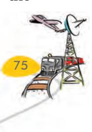

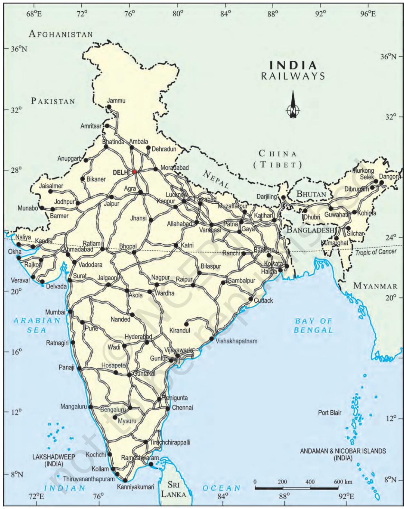

## Activity

Railway line has been extended from Banihal to Baramula in the Kashmir Valley. Locate these two towns on the map of India.

76 CONTEMPORARY INDIA – II

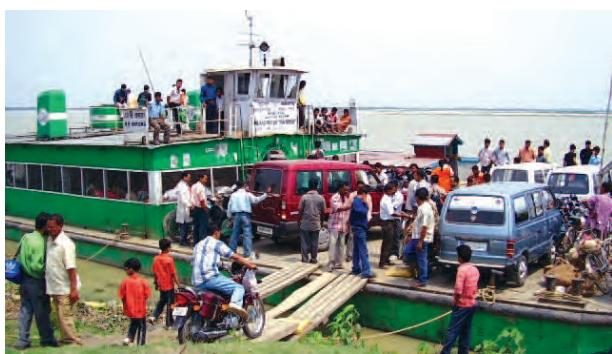

**Fig. 7.5:** *Inland waterways widely used in north-eastern states*

- The Ganga river between Allahabad and Haldia (1620 km)-N.W. No.1
- The Brahmaputra river between Sadiya and Dhubri (891 km)-N.W. No.2
- The West-Coast Canal in Kerala (Kottapurma-Kollam, Udyogamandal and Champakkara canals-205 km) – N.W. No.3
- Specified stretches of Godavari and Krishna rivers along with Kakinada Puducherry stretch of canals (1078 km) – N.W. No.4
- Specified stretches of river Brahmani along with Matai river, delta channels of Mahanadi and Brahmani rivers and East Coast Canal (588 km) – N.W. No.5

There are some other inland water ways on which substantial transportation takes place. These are Mandavi, Zuari and Cumberjua, Sunderbans, Barak and backwaters of Kerala.

Apart from these, India's trade with foreign countries is carried from the ports located along the coast. 95 per cent of the country's trade volume (68 per cent in terms of value) is moved by sea.

## **Major Sea Ports**

With a long coastline of 7,516.6 km, India is dotted with 12 major and 200 notified nonmajors (minor/intermediate) ports. These major ports handle 95 per cent of India's foreign trade.

Kandla in Kuchchh was the first port developed soon after Independence to ease the volume of trade on the Mumbai port, in the wake of loss of Karachi port to Pakistan after the Partition. Kandla also known as the Deendayal Port, is a tidal port. It caters to the convenient handling of exports and imports of highly productive granary and industrial belt stretching across UT of Jammu and Kashmir, and the states of Himachal Pradesh, Punjab, Haryana, Rajasthan and Gujarat.

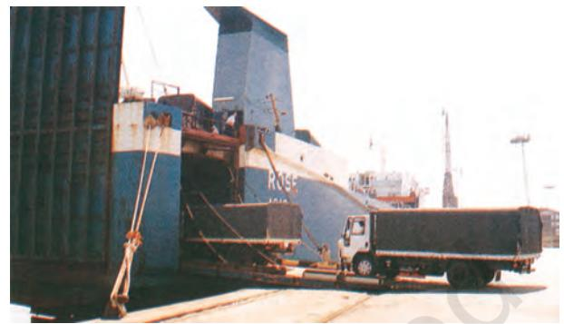

**Fig. 7.6:** *Trucks being driven into the vessel at Mumbai port*

Mumbai is the biggest port with a spacious natural and well-sheltered harbour. The Jawaharlal Nehru port was planned with a view to decongest the Mumbai port and serve as a hub port for this region. Marmagao port (Goa) is the premier iron ore exporting port of the country. This port accounts for about fifty per cent of India's iron ore export. New Mangalore port, located in Karnataka caters to the export of iron ore concentrates from Kudremukh mines. Kochchi is the extreme south-western port, located at the entrance of a lagoon with a natural harbour.

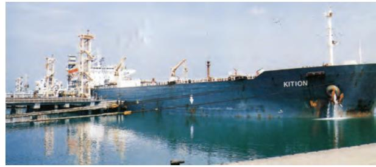

**Fig. 7.7:** *Tanker discharging crude oil at New Mangalore port*

Moving along the east coast, you would see the extreme south-eastern port of Tuticorin, in Tamil Nadu. This port has a natural harbour and rich hinterland. Thus, it has a flourishing trade handling of a large variety of cargoes to

LIFELINES OF NATIONAL ECONOMY 77

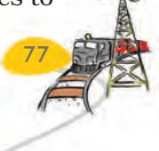

even our neighbouring countries like Sri Lanka, Maldives, etc. and the coastal regions of India. Chennai is one of the oldest artificial ports of the country. It is ranked next to Mumbai in terms of the volume of trade and cargo. Vishakhapatnam is the deepest landlocked and well-protected port. This port was, originally, conceived as an outlet for iron ore exports. Paradwip port located in Odisha, specialises in the export of iron ore. Kolkata is an inland riverine port. This port serves a very large and rich hinterland of Ganga-Brahmaputra basin. Being a tidal port, it requires constant dredging of Hoogly. Haldia port was developed as a subsidiary port, in order to relieve growing pressure on the Kolkata port.

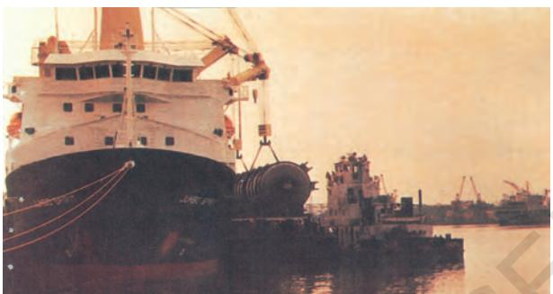

**Fig. 7.8:***Handling of oversize cargo at Tuticorin port*

## **Airways**

The air travel, today, is the fastest, most comfortable and prestigious mode of transport.

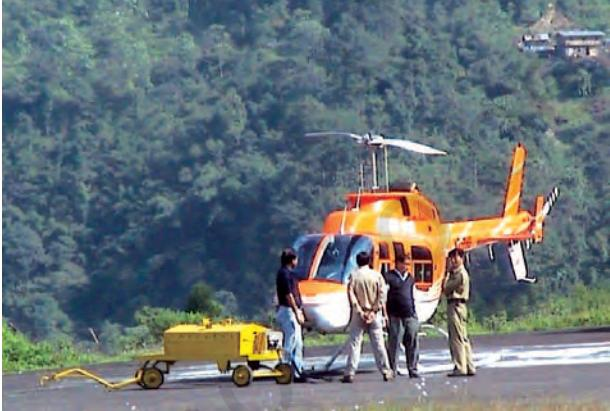

**Why is air travel prefered in the north-eastern states?**

**Fig. 7.9**

It can cover very difficult terrains like high mountains, dreary deserts, dense forests and also long oceanic stretches with great ease.

78 CONTEMPORARY INDIA – II

Think of the north-eastern part of the country, marked with the presence of big rivers, dissected relief, dense forests and frequent floods and international frontiers, etc. in the absence of air transport. Air travel has made access easier.

Pawanhans Helicopters Ltd. provides helicopter services to Oil and Natural Gas Corporation in its off-shore operations, to inaccessible areas and difficult terrains like the north-eastern states and the interior parts of Jammu and Kashmir, Himachal Pradesh and Uttarakhand.

UDAN (*Ude Desh ka Aam Nagrik*) is a firstof-its kind scheme globally, designed to jump-start the regional aviation market. Regional Connectivity Scheme (RCS) – UDAN was conceived by the Ministry of Aviation (MoCA) to promote regional connectivity by making fly affordable for the common citizen. The central idea of the scheme is to encourage airlines to operate flights on regional and remote routes through enabling policies and extending incentives.

## **Communication**

Ever since humans appeared on the earth, they have used different means of communication. But, the pace of change, has been rapid in modern times. Long distance communication is far easier without physical movement of the communicator or receiver. Personal communication and mass communication including television, radio, press, films, etc. are the major means of communication in the country. The Indian postal network is the largest in the world. It handles parcels as well as personal written communications. Cards and envelopes are considered first-class mail and are airlifted between stations covering both land and air. The second-class mail includes book packets, registered newspapers and periodicals. They are carried by surface mail, covering land and water transport. To facilitate quick delivery of mails in large towns and cities, six mail channels have been introduced recently. They are called Rajdhani Channel, Metro Channel, Green Channel, Business Channel, Bulk Mail Channel and Periodical Channel.

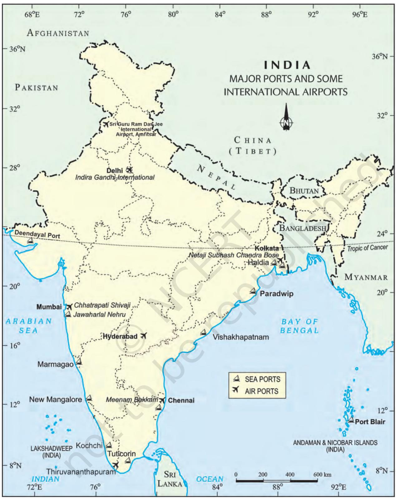

**India:** *Major Ports and Some International Airports*

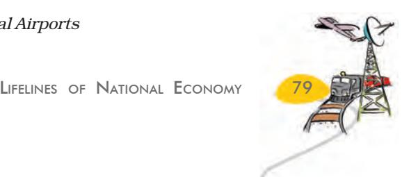

Digital India is an umbrella programme to prepare India for a knowledge based transformation. The focus of Digital India Programme is on being transformative to realise – IT (Indian Talent) + IT (Information Technology)=IT (India Tomorrow) and is on making technology central to enabling change.

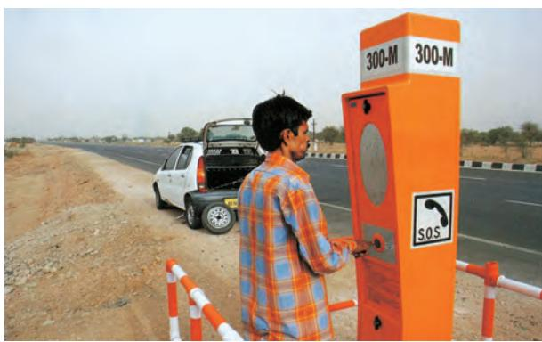

**Fig.7.10 :** *Emergency call box on NH-48*

India has one of the largest telecom networks in Asia. Excluding urban places more than two-thirds of the villages in India have already been covered with Subscriber Trunk Dialling (STD) telephone facility. In order to strengthen the flow of information from the grassroot to the higher level, the government has made special provision to extend twentyfour hours STD facility to every village in the country. There is a uniform rate of STD facilities all over India. It has been made possible by integrating the development in space technology with communication technology.

Mass communication provides entertainment and creates awareness among people about various national programmes and policies. It includes radio, television, newspapers, magazines, books and films. All India Radio (Akashwani) broadcasts a variety of programmes in national, regional and local languages for various categories of people, spread over different parts of the country. Doordarshan, the national television channel of India, is one of the largest terrestrial networks in the world. It broadcasts a variety of programmes from entertainment, educational to sports, etc. for people of different age groups.

India publishes a large number of newspapers and periodicals annually. They are of different types depending upon their periodicity. Newspapers are published in about 100 languages and dialects. Did you know that the largest number of newspapers published in the country are in Hindi, followed by English and Urdu? India is the largest producer of feature films in the world. It produces short films; video feature films and video short films. The Central Board of Film Certification is the authority to certify both Indian and foreign films.

### **International Trade**

The exchange of goods among people, states and countries is referred to as trade. The market is the place where such exchanges take place. Trade between two countries is called international trade. It may take place through sea, air or land routes. While local trade is carried in cities, towns and villages, state level trade is carried between two or more states. Advancement of international trade of a country is an index to its economic prosperity. It is, therefore, considered the economic barometer for a country.

As the resources are space bound, no country can survive without international trade. Export and import are the components of trade. The balance of trade of a country is the difference between its export and import. When the value of export exceeds the value of imports, it is called a favourable balance of trade. On the contrary, if the value of imports exceeds the value of exports, it is termed as unfavourable balance of trade.

India has trade relations with all the major trading blocks and all geographical regions of the world. The commodities exported from India to other countries include gems and jewellery, chemicals and related products, agriculture and allied products, etc.

80 CONTEMPORARY INDIA – II

The commodities imported to India include petroleum crude and products, gems and jewellery, chemicals and related products, base metals, electronic items, machinery, agriculture and allied products. India has emerged as a software giant at the international level and it is earning large foreign exchange through the export of information technology.

### **Tourism as a Trade**

Tourism in India has grown substantially over the last three decades.

More than 15 million people are directly engaged in the tourism industry*. Tourism also promotes national integration, provides support to local handicrafts and cultural pursuits. It also helps in the development of international understanding about our culture and heritage. Foreign tourists visit India for heritage tourism, eco tourism, adventure tourism, cultural tourism, medical tourism and business tourism.

There is a vast potential for development of tourism in all parts of the country. Efforts are being made to promote different types of tourism for this upcoming industry.

On the map of India show important tourist places of your State/UT and its connectivity with other parts of the country by railways/ roadways/airways.

Discuss in the class:

- What type of tourism may be developed in your state/UT and why?
- Which areas in your state/UT you find more attractive for development of tourism and why?
- How tourism may be helpful for the economic development of a region adopting sustainable development approach?

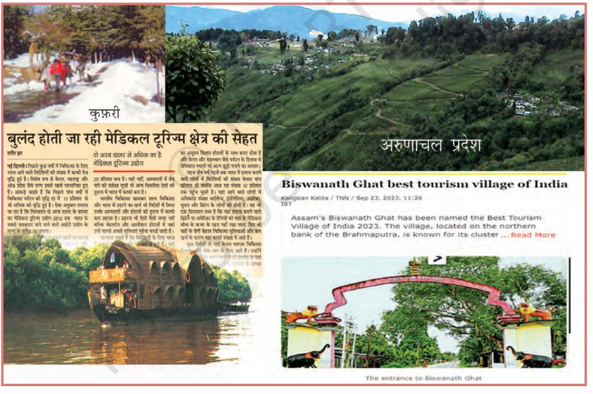

*Prepare a project on the heritage tourism in India.*

***Source:** *Annual Report 2016–17, Ministry of Commerce and Industry, Government of India.*

LIFELINES OF NATIONAL ECONOMY 81

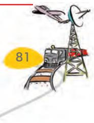

## **EXERCISES EXERCISES EXERCISES EXERCISES EXERCISES**

- **1 .** Multiple choice questions.
	- (i) Which two of the following extreme locations are connected by the eastwest corridor?
		- (a) Mumbai and Nagpur (c) Mumbai and Kolkata
		- (b) Silchar and Porbandar (d) Nagpur and Siligudi
	- (ii) Which mode of transportation reduces trans-shipment losses and delays?
		- (a) Railways (c) Pipeline
		- (b) Roadways (d) Waterways
	- (iii) Which one of the following states is not connected with the H.V.J. pipeline?
		- (a) Madhya Pradesh (c) Gujarat
		- (b) Maharashtra (d) Uttar Pradesh
	- (iv) Which one of the following ports is the deepest land-locked and wellprotected port along the east coast?
		- (a) Chennai (c) Tuticorin
		- (b) Paradwip (d) Vishakhapatnam
	- (v) Which one of the following is the most important modes of transportation in India?
		- (a) Pipeline (c) Roadways
		- (b) Railways (d) Airways
	- (vi) Which one of the following terms is used to describe trade between two or more countries?
		- (a) Internal trade (c) External trade
		- (b) International trade (d) Local trade
- **2 .** Answer the following questions in about 30 words.
	- (i) State any three merits of roadways.
	- (ii) Where and why is rail transport the most convenient means of transportation?
	- (iii) What is the significance of the border roads?
	- (iv) What is meant by trade? What is the difference between international and local trade?
- **3 .** Answer the following questions in about 120 words.
	- (i) Why are the means of transportation and communication called the lifelines of a nation and its economy?
	- (ii) Write a note on the changing nature of the international trade in the last fifteen years.

# **QUIZ DRIVE**

- **1 .** Northern terminal of the North-south corridor.
- **2 .** The headquarter of the southern railway zone.
- **3 .** The rail gauge with a track width of 1.676 m.
- **4 .** A Riverine Port.
- **5 .** Busiest railway junction in Northern India.

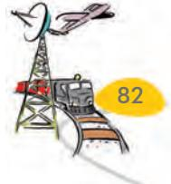

82 CONTEMPORARY INDIA – II

# **ACTIVITY**

| Start your search vertically, horizontally or diagonally and reach various |
| --- |
| destinations across the country! |

| S | H | E | R | S | H | A | H | S | U | R | I | M | A | R | G |
| --- | --- | --- | --- | --- | --- | --- | --- | --- | --- | --- | --- | --- | --- | --- | --- |
| A | R | T | P | R | N | X | E | L | A | T | A | D | L | A | Y |
| J | M | M | X | I | P | O | R | A | Y | M | P | G | H | T | X |
| Y | C | H | E | N | N | N | A | I | I | K | M | C | A | I | M |
| O | D | C | D | A | L | M | C | S | O | T | P | O | R | C | P |
| A | P | T | R | G | S | K | J | M | J | L | E | A | N | E | R |
| R | A | E | T | A | J | P | O | R | M | W | M | A | S | X | O |
| I | L | S | B | R | O | A | D | G | A | U | G | E | L | O | T |
| A | S | N | L | C | M | E | C | U | K | Z | M | A | A | J | E |
| L | M | U | G | H | A | L | S | A | R | A | I | B | S | N | A |
| G | O | E | T | V | R | A | Y | F | T | O | R | E | A | J | M |
| K | Q | A | I | P | M | N | Y | R | Y | A | Y | H | L | I | N |
| Q | K | O | L | K | A | T | A | E | U | I | T | W | B | E | A |
| N | I | T | N | K | D | E | M | O | U | R | P | N | P | J | D |

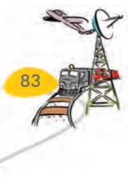

LIFELINES OF NATIONAL ECONOMY 83

