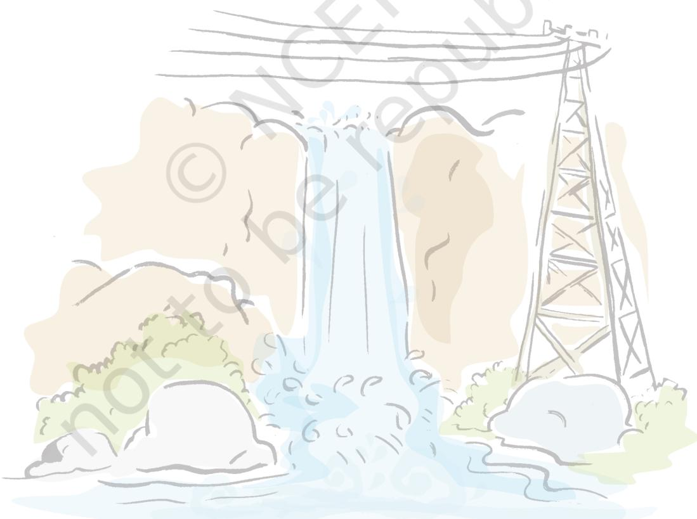

# Appendix-IAppendix-I Appendix-I

#### **Websites you can see**

Bombay Natural History Society: http://www.bnhs.org/ Birding in India and South Asia: http://www.birding.in/ Website of Project Tiger: http://projecttiger.nic.in/ Nature Conservation Foundation: http://www.ncf-india.org/ Wildlife Conservation Society of India: http://www.wildlife.in/ Wildlife Trust of India: http://www.wildlifetrustofindia.org/ Kalpavriksh Environment Action Group: http://www.kalpavriksh.org/ Down to Earth Magazine: http://www.downtoearth.org.in/ Centre for Environment Education, India: http://www.ceeindia.org/cee/index.html World Steel Association: http://www.worldsteel.org

## Appendix-IIAppendix-II Appendix-II

| Steel Plants | Year of Establishment | Collaborating | Location |
| --- | --- | --- | --- |
|  |  | Country |  |
| IISCO | 1870-1913 (Private initially) | (Nationalised | Kulti and |
|  |  | in 1972) | Burnpur (W.B.) |
| TISCO | 1907 (Private ownership) | Jamshedji Tata | Jamshedpur |
|  |  |  | (Jharkhand) |
| VISL | 1923 Private as MISCO | Nationalised later | Bhadravati |
|  |  |  | (Karnataka) |
| Bhilai | 1959 (Public Sector) | Soviet Union | Bhilai (M.P.) |
| Bokaro | 1972 (Public Sector) | Soviet Union | Bokaro |
|  |  |  | (Jharkhand) |
| Durgapur | 1959 (Public Sector) | U.K. | Durgapur (W.B.) |
| Rourkela | — (Public Sector) | Germany | Rourkela |
|  |  |  | (Odisha) |
| Vishakhapatnam | — (Public Sector) | — | Vishakhapatnam |
|  |  |  | Andhra Pradesh |
| Salem | — (Public Sector) | — | Salem (T. Nadu) |
| Vijay Nagar | — Public Sector | — | Karnataka |

**Anticline:** A fold in sedimentary strata that resembles an arch.

**Gross Domestic Product:** It is a monetary measure of the value of goods and services produced within a natural economy at a given period of time. Normally it is one year.

**Gross Value Added (GVA):** The GVA is estimated from GDP by adding subsidies on production and substracting indirect taxes.

**Geologist:** A scientist who studies the composition, structure and history of the earth.

**Geothermal Gradient:** The gradual increase in temperature with depth in the crust. The average is 30 C per kilometer in the upper crust.

**Humus:** Dead and decayed organic matter adds to the fertility of the top soil.

**Igneous Rocks:** Rocks which have solidified from molten magma.

**Manganese Nodules:** A type of sediment scattered on the ocean floor, consisting mainly of manganese and iron, and usually containing small amounts of copper, nickel and cobalt.

**Metamorphic Rocks:** Rocks which were originally igneous or sedimentary, but have changed in character and appearance.

**Oil Trap:** A geological structure that allows for significant amounts of oil and gas to accumulate.

**Rock:** A consolidated mixture of minerals

86 CONTEMPORARY INDIA – II

**Sedimentary Rocks:** Rocks which have been deposited as beds and layers of sediments.

## NOTES

APPENDIX 87

### NOTES

