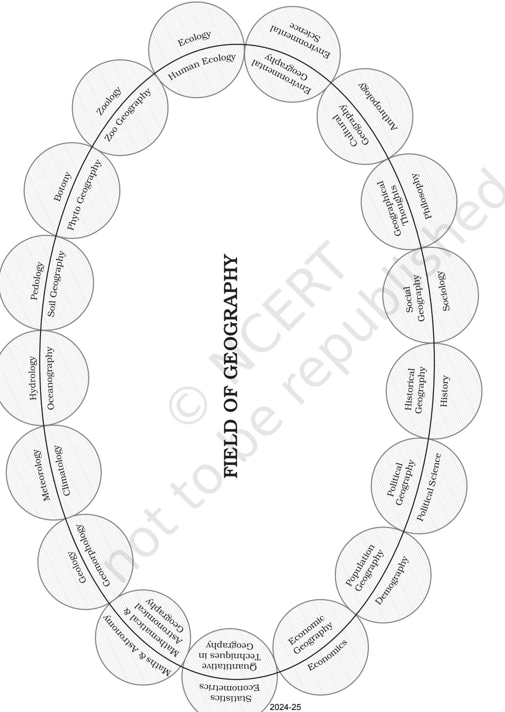
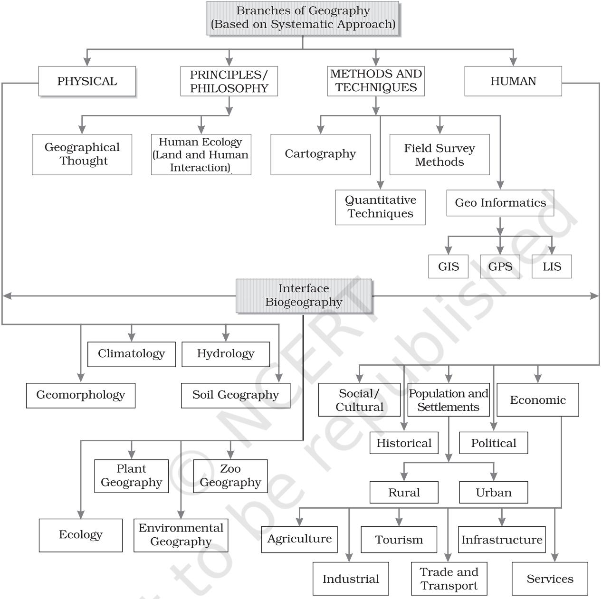
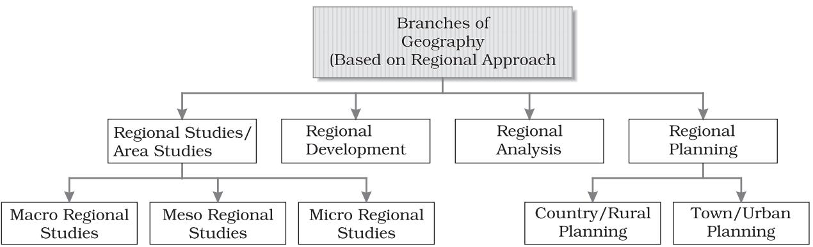

## UNIT

I

# *GEOGRAPHY AS A DISCIPLINE*

*This unit deals with*

- *• Geography as an integrating discipline; as a science of spatial attributes*
- *• Branches of geography; importance of physical geography*

#### CHAPTER

Y ou have studied geography as one of the components of your Social Science course upto the secondary stage. You are already aware of some of the phenomena of geographical nature in the world and its different parts. Now, you will study 'Geography' as an independent subject and learn about the physical environment of the earth, human activities and their interactive relationships. Therefore, a pertinent question you can ask at this stage is — Why should we study geography? We live on the surface of the earth. Our lives are affected by our surroundings in many ways. We depend on the resources to sustain ourselves in the surrounding areas. Primitive societies subsisted on 'natural means of subsistence', i.e. edible plants and animals. With the passage of time, we developed technologies and started producing our food using natural resources such as land, soil and water. We adjusted our food habits and clothing according to the prevailing weather conditions. There are variations in the natural resource base, technological development, adaptation with and modification of physical environment, social organisations and cultural development. As a student of geography, you should be curious to know about all the phenomena which vary over space. You learn about the diverse lands and people. You should also be interested in understanding the changes which have taken place over time. Geography equips you to appreciate diversity and investigate into the causes responsible for creating such variations over time and space. You will develop skills to understand the globe converted into maps and have a visual sense

### GEOGRAPHY AS A DISCIPLINE

of the earth's surface. The understanding and the skills obtained in modern scientific techniques such as GIS and *computer cartography* equip you to meaningfully contribute to the national endeavour for development.

Now the next question which you may like to ask is — What is geography? You know that earth is our home. It is also the home of many other creatures, big and small, which live on the earth and sustain. The earth's surface is not uniform. It has variations in its physical features. There are mountains, hills, valleys, plains, plateaus, oceans, lakes, deserts and wilderness. There are variations in its social and cultural features too. There are villages, cities, roads, railways, ports, markets and many other elements created by human beings across the entire period of their cultural development.

This variation provides a clue to the understanding of the relationship between the physical environment and social/cultural features. The physical environment has provided the stage, on which human societies enacted the drama of their creative skills with the tools and techniques which they invented and evolved in the process of their cultural development. Now, you should be able to attempt the answer of the question posed earlier as to "What is geography"? In very simple words, it can be said that geography is the description of the earth. The term *geography* was first coined by *Eratosthenese*, a Greek scholar (276-194 BC.). The word has been derived from two roots from Greek language *geo* (earth) and *graphos* (description). Put together, they mean description of the earth. The earth has always been seen as the abode of human beings and thus, scholars defined geography as, "the description of the earth as the abode of human beings". You are aware of the fact that reality is always multifaceted and the 'earth' is also multi-dimensional, that is why many disciplines from natural sciences such as geology, pedology, oceanography, botany, zoology and meteorology and a number of sister disciplines in social sciences such as economics, history, sociology, political science, anthropology, etc. study different aspects of the earth's surface. Geography is different from other sciences in its subject matter and methodology but at the same time, it is closely related to other disciplines. Geography derives its data base from all the natural and social sciences and attempts their synthesis.

We have noted that there exist variations over the surface of the earth in its physical as well as cultural environment. A number of phenomena are similar and many are dissimilar. It was, therefore, logical to perceive geography as the study of *areal differentiation*. Thus, geography was perceived to study all those phenomena which vary over space. Geographers do not study only the variations in the phenomena over the earth's surface (space) but also study the associations with the other factors which cause these variations. For example, cropping patterns differ from region to region but this variation in cropping pattern, as a phenomenon, is related to variations in soils, climates, demands in the market, capacity of the farmer to invest and technological inputs available to her/him. Thus, the concern of geography is to find out the causal relationship between any two phenomena or between more than one phenomenon.

A geographer explains the phenomena in a frame of cause and effect relationship, as it does not only help in interpretation but also foresees the phenomena in future.

The geographical phenomena, both the physical and human, are not static but highly dynamic. They change over time as a result of the interactive processes between *ever* *changing earth and untiring and ever-active human beings*. Primitive human societies were directly dependent on their immediate environment. Geography, thus, is concerned with the study of *Nature* and *Human* interactions as an integrated whole. 'Human' is an integral part of 'nature' and 'nature' has the imprints of 'human'. 'Nature' has influenced different aspects of human life. Its imprints can be noticed on food, clothing, shelter and occupation. Human beings have come to terms with nature through adaptation and modification. As you already know, the present society has passed the stage of primitive societies, which were directly dependent on their immediate physical environment for sustenance. Present societies have modified their natural environment by inventing and using technology and thus, have expanded the horizon of their operation by appropriating and utilising the resources provided by nature. With the gradual development of technology, human beings were able to loosen the shackles of their physical environment. Technology helped in reducing the harshness of labour, increased labour efficiency and provided leisure to human beings to attend to the higher needs of life. It also increased the scale of production and the mobility of labour.

The interaction between the physical environment and human beings has been very succinctly described by a poet in the following dialogue between 'human' and 'nature' (God). *You created the soil, I created the cup, you created night, I created the lamp. You created wilderness, hilly terrains and deserts; I created flower beds and gardens*. Human beings have claimed their contribution using natural resources. With the help of technology, human beings moved from the stage of necessity to a stage of freedom. They have put their imprints everywhere and created new possibilities in collaboration with nature. Thus, we now find *humanised nature* and *naturalised human beings* and geography studies this interactive relationship. The space got organised with the help of the means of transportation and communication network. The links (routes) and nodes (settlements of all types and hierarchies) integrated the space and gradually, it got organised. As a social science discipline, geography studies the 'spatial organisation' and 'spatial integration'.

Geography as a discipline is concerned with three sets of questions:

- (i) Some questions are related to the identification of the patterns of natural and cultural features as found over the surface of the earth. These are the questions about *what?*
- (ii) Some questions are related to the distribution of the natural and human/ cultural features over the surface of the earth. These are the questions about *where?*

Taken together, both these questions take care of distributional and locational aspects of the natural and cultural features. These questions provided inventorised information of what features and where located. It was a very popular approach during the colonial period. These two questions did not make geography a scientific discipline till the third question was added.

- (iii) The third question is related to the explanation or the causal relationships between features and the processes and phenomena. This aspect of geography is related to the question, *why?*
 Geography as a discipline is related to space and takes note of spatial characteristics and attributes. It studies the patterns of distribution, location and concentration of phenomena over space and interprets them providing explanations for these patterns. It takes note of the associations and inter relationships between the phenomena over space and interprets them providing explanations for these patterns. It also takes note of the associations and inter-relationships between the phenomena resulting from the dynamic interaction between human beings and their physical environment.

#### GEOGRAPHY AS AN INTEGRATING DISCIPLINE

Geography is a discipline of synthesis. It attempts *spatial synthesis,* and history attempts *temporal synthesis*. Its approach is holistic in nature. It recognises the fact that the world is a system of interdependencies. The present world is being perceived as a global village. The distances have been reduced by better means of transportation increasing accessibility. The audio-visual media and information technology have enriched the data base. Technology has provided better chances of monitoring natural phenomena as well as the economic and social parameters. Geography as an integrating discipline has interface with numerous natural and social sciences. All the sciences, whether natural or social, have one basic objective, of *understanding the reality*. Geography attempts to comprehend the associations of phenomena as related in sections of reality. Figure 1.1 shows the relationship of geography with other sciences. Every discipline, concerned with scientific knowledge is linked with geography as many of their elements vary over space. Geography helps in understanding the reality in totality in its spatial perspective. Geography, thus, not only takes note of the differences in the phenomena from place to place but integrates them holistically which may be different at other places. A geographer is required to have a broad understanding of all the related fields, to be able to logically integrate them. This integration can be understood with some examples. Geography influences historical events. Spatial distance itself has been a very potent factor to alter the course of history of the world. Spatial depth provided defence to many countries, particularly in the last century. In traditional warfare, countries with large size in area, gain time at the cost of space. The defence provided by oceanic expanse around the countries of the new world has protected them from wars being imposed on their soil. If we look at the historical events world over, each one of them can be interpreted geographically.

In India, Himalayas have acted as great barriers and provided protection but the passes provided routes to the migrants and invaders from Central Asia. The sea coast has encouraged contact with people from East and Southeast Asia, Europe and Africa. Navigation technology helped European countries to colonise a number of countries of Asia and Africa, including India as they got accessibility

Figure 1.1 : Geography and its relation with other disciplines

through oceans. The geographical factors have modified the course of history in different parts of the world.

Every geographical phenomenon undergoes change through time and can be explained temporally. The changes in landforms, climate, vegetation, economic activities occupations and cultural developments have followed a definite historical course. Many geographical features result from the decision making process by different institutions at a particular point of time. It is possible to convert time in terms of space and space in terms of time. For example, it can be said that place A is 1,500 km from place B or alternately, it can also be said that place A is two hours away (if one travels by plane) or seventeen hours away (if one travels by a fast moving train). It is for this reason, time is an integral part of geographical studies as the fourth dimension. Please mention other three dimensions?

Figure1.1 amply depicts the linkages of geography with different natural and social sciences. This linkage can be put under two segments.

#### BRANCHES OF GEOGRAPHY

Please study Figure 1.1 for recapitulation. It has very clearly brought out that geography is an interdisciplinary subject of study. The study of every subject is done according to some approach. The major approaches to study geography have been (i) Systematic and (ii) Regional. The systematic geography approach is the same as that of general geography. This approach was introduced by *Alexander Von Humboldt*, a German geographer (1769-1859) while regional geography approach was developed by another German geographer and a contemporary of Humboldt, *Karl Ritter* (1779-1859).

In systematic approach (Figure 1.2), a phenomenon is studied world over as a whole, and then the identification of typologies or spatial patterns is done. For example, if one is interested in studying natural vegetation, the study will be done at the world level as a first step. The typologies such as equatorial rain forests or softwood conical forests or monsoon forests, etc. will be identified, discussed and delimited. In the regional approach, the world is divided into regions at different hierarchical levels and then all the geographical phenomena in a particular region are studied. These regions may be natural, political or designated region. The phenomena in a region are studied in a holistic manner searching for unity in diversity.

Dualism is one of the main characteristics of geography which got introduced from the very beginning. This dualism depended on the aspect emphasised in the study. Earlier scholars laid emphasis on physical geography. But human beings are an integral part of the earth's surface. They are part and parcel of nature. They also have contributed through their cultural development. Thus developed human geography with emphasis on human activities.

#### BRANCHES OF GEOGRAPHY (BASED ON SYSTEMATIC APPROACH)

#### 1. Physical Geography

- (i) *Geomorphology* is devoted to the study of landforms, their evolution and related processes.
- (ii) *Climatology* encompasses the study of structure of atmosphere and elements of weather and climates and climatic types and regions.
- (iii) *Hydrology* studies the realm of water over the surface of the earth including oceans, lakes, rivers and other water bodies and its effect on different life forms including human life and their activities.
- (iv) *Soil Geography* is devoted to study the processes of soil formation, soil types, their fertility status, distribution and use.

#### 2. Human Geography

- (i) *Social/Cultural Geography* encompasses the study of society and its spatial dynamics as well as the cultural elements contributed by the society.

Figure 1.2 : Branches of geography based on systematic approach

- (ii) *Population and Settlement Geography* (Rural and Urban). It studies population growth, distribution, density, sex ratio, migration and occupational structure etc. Settlement geography studies the characteristics of rural and urban settlements.
- (iii) *Economic Geography* studies economic activities of the people including

agriculture, industry, tourism, trade, and transport, infrastructure and services, etc.

- (iv) *Historical Geography* studies the historical processes through which the space gets organised. Every region has undergone some historical experiences before attaining the present day status. The geographical features also

Figure 1.3 : Branches of geography based on regional approach

experience temporal changes and these form the concerns of historical gography.

- (v) *Political Geography* looks at the space from the angle of political events and studies boundaries, space relations between neighbouring political units, delimitation of constituencies, election scenario and develops theoretical *framework* to understand the political behaviour of the population.
#### 3. Biogeography

The interface between physical geography and human geography has lead to the development of Biogeography which includes:

- (i) *Plant Geography* which studies the spatial pattern of natural vegetation in their habitats.
- (ii) *Zoo Geography* which studies the spatial patterns and geographic characteristics of animals and their habitats.
- (iii) *Ecology /Ecosystem* deals with the scientific study of the habitats characteristic of species.
- (iv) *Environmental Geography* concerns world over leading to the realisation of environmental problems such as land gradation, pollution and concerns for conservation has resulted in the introduction of this new branch in geography.

BRANCHES OF GEOGRAPHY BASED ON REGIONAL APPROACH (FIGURE1.3)

- 1. Regional Studies/Area Studies Comprising *Macro, Meso* and *Micro* Regional Studies
- 2. Regional Planning Comprising Country/Rural and Town/ Urban Planning
- 3. Regional Development

#### 4. Regional Analysis

There are two aspects which are common to every discipline, these are:

- (i) Philosophy
	- (a) Geographical Thought
	- (b) Land and Human Interaction/ Human Ecology
- (ii) Methods and Techniques
	- (a) Cartography including Computer Cartography
	- (b) Quantitative Techniques/Statistical Techniques
	- (c) Field Survey Methods
	- (d) Geo-informatics comprising techniques such as Remote Sensing, GIS, GPS, etc.

The above classification gives a comprehensive format of the branches of geography. Generally geography curricula is taught and learnt in this format but this format is not static. Any discipline is bound to grow with new ideas, problems, methods and techniques. For example, what was once manual cartography has now been transformed into computer cartography. Technology has enabled scholars to handle large quantum of data. The internet provides extensive information. Thus, the capacity to attempt analysis has increased tremendously. GIS has further opened vistas of knowledge. GPS has become a handy tool to find out exact locations. Technologies have enhanced the capacity of attempting synthesis with sound theoretical understanding.

You will learn some preliminary aspects of these techniques in your book, *Practical work in Geography – Part I* (NCERT, 2006)*.* You will continue to improve upon your skills and learn about their application.

#### PHYSICAL GEOGRAPHY AND ITS IMPORTANCE

This chapter appears in the book entitled *Fundamentals of Physical Geography*. The contents of the book clearly reflect its scope. It is therefore, appropriate to know the importance of this branch of geography. Physical geography includes the study of lithosphere (landforms, drainage, relief and physiography), atmosphere (its composition, structure, elements and controls of weather and climate; temperature, pressure, winds, precipitation, climatic types, etc.), hydrosphere (oceans, seas, lakes and associated features with water realm) and biosphere ( life forms including human being and macro-organism and their sustaining mechanism, viz. food chain, ecological parameters and ecological balance). Soils are formed through the process of *pedogenesis* and depend upon the parent rocks, climate, biological activity and time. Time provides maturity to soils and helps in the development of soil profiles. Each element is important for human beings. Landforms provide the base on which human activities are located. The plains are utilised for agriculture. Plateaus provide forests and minerals. Mountains provide pastures, forests, tourist spots and are sources of rivers providing water to lowlands. Climate influences our house types, clothing and food habits. The climate has a profound effect on vegetation, cropping pattern, livestock farming and some industries, etc. Human beings have developed technologies which modify climatic elements in a restricted space such as air conditioners and coolers. Temperature and precipitation ensure the density of forests and quality of grassland. In India, monsoonal rainfall sets the agriculture rhythm in motion. Precipitation recharges the *ground water aquifers* which later provides water for agriculture and domestic use. We study oceans which are the store house of resources. Besides fish and other sea-food, oceans are rich in mineral resources. India has developed the technology for collecting manganese nodules from oceanic bed. Soils are renewable resources, which influence a number of economic activities such as agriculture. The fertility of the soil is both naturally determined and culturally induced. Soils also provide the basis for the biosphere accommodating plants, animals and micro organisms.

#### What is Geography?

Geography is concerned with the description and explanation of the areal differentiation of the earth's surface.

*Richard Hartshorne*

Geography studies the differences of phenomena usually related in different parts of the earth's surface.

*Hettner*

The study of physical geography is emerging as a discipline of evaluating and managing natural resources. In order to achieve this objective, it is essential to understand the intricate relationship between physical environment and human beings. Physical environment provides resources, and human beings utilise these resources and ensure their economic and cultural development. Accelerated pace of resource utilisation with the help of modern technology has created ecological imbalance in the world. Hence, a better understanding of physical environment is absolutely essential for sustainable development.

#### EXERCISES

- 1. Multiple choice questions.
	- (i) Which one of the following scholars coined the term 'Geography'?
		- (a) Herodotus (c) Galileo
		- (b) Erathosthenese (d) Aristotle
	- (ii) Which one of the following features can be termed as 'physical feature'?
		- (a) Port (c) Plain
		- (b) Road (d) Water park
	- (iii) Make correct pairs from the following two columns and mark the correct option.

| 1. | Meteorology | A. Population Geography |
| --- | --- | --- |
| 2. | Demography | B. Soil Geography |
| 3. | Sociology | C. Climatology |
| 4. | Pedology | D. Social Geography |
| (a) 1B,2C,3A,4D |  | (c) 1D,2B,3C,4A |

- (b) 1A,2D,3B,4C (d) 1C,2A,3D,4B
- (iv) Which one of the following questions is related to cause-effect relationship?
	- (a) Why (c) What
	- (b) Where (d) When
- (v) Which one of the following disciplines attempts temporal synthesis?

|
|  |

- (b) Geography (d) History
- 2. Answer the following questions in about 30 words.
	- (i) What important cultural features do you observe while going to school? Are they similar or dissimilar? Should they be included in the study of geography or not? If yes, why?
	- (ii) You have seen a tennis ball, a cricket ball, an orange and a pumpkin. Which one amongst these resembles the shape of the earth? Why have you chosen this particular item to describe the shape of the earth?
	- (iii) Do you celebrate *Van Mahotsava* in your school? Why do we plant so many trees? How do the trees maintain ecological balance?
	- (iv) You have seen elephants, deer, earthworms, trees and grasses. Where do they live or grow? What is the name given to this sphere? Can you describe some of the important features of this sphere?
	- (v) How much time do you take to reach your school from your house? Had the school been located across the road from your house, how much time would you have taken to reach school? What is the effect of the distance

between your residence and the school on the time taken in commuting? Can you convert time into space and vice versa?

- 3. Answer the following questions in about 150 words.
	- (i) You observe every day in your surroundings that there is variation in natural as well as cultural phenomena. All the trees are not of the same variety. All the birds and animals you see, are different. All these different elements are found on the earth. Can you now argue that geography is the study of "areal differentiation"?
	- (ii) You have already studied geography, history, civics and economics as parts of social studies. Attempt an integration of these disciplines highlighting their interface.

#### Project Work

Select forest as a natural resource.

- (i) Prepare a map of India showing the distribution of different types of forests.
- (ii) Write about the economic importance of forests for the country.
- (iii) Prepare a historical account of conservation of forests in India with focus on Chipko movements in Rajasthan and Uttaranchal.

