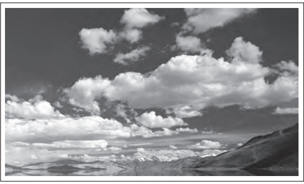
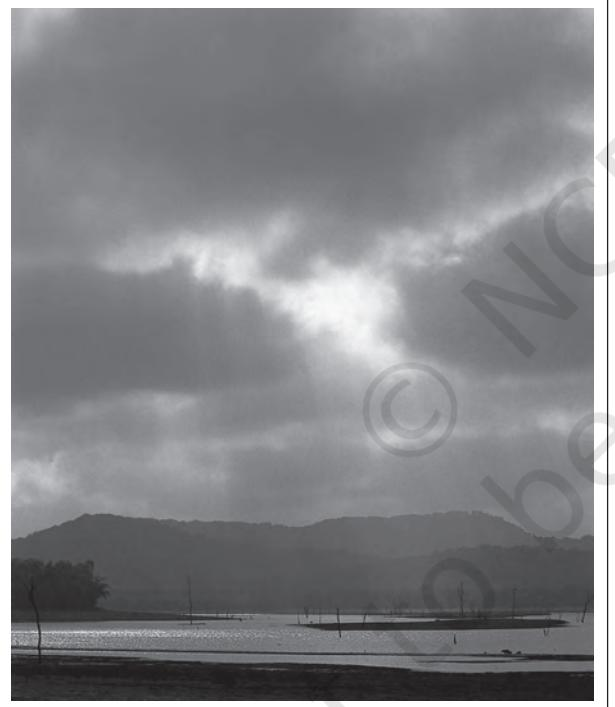

#### CHAPTER

#### Y ou have already learnt that the air contains water vapour. It varies from zero to four per cent by volume of the atmosphere and plays an important role in the weather phenomena. Water is present in the atmosphere in three forms namely – gaseous, liquid and solid. The moisture in the atmosphere is derived from water bodies through evaporation and from plants through transpiration. Thus, there is a continuous exchange of water between the atmosphere, the oceans and the continents through the processes of evaporation, transpiration, condensation and precipitation.

Water vapour present in the air is known as humidity. It is expressed quantitatively in different ways. The actual amount of the water vapour present in the atmosphere is known as the *absolute humidity*. It is the weight of water vapour per unit volume of air and is expressed in terms of grams per cubic metre. The ability of the air to hold water vapour depends entirely on its temperature. The absolute humidity differs from place to place on the surface of the earth. The percentage of moisture present in the atmosphere as compared to its full capacity at a given temperature is known as the *relative humidity*. With the change of air temperature, the capacity to retain moisture increases or decreases and the relative humidity is also affected. It is greater over the oceans and least over the continents.

The air containing moisture to its full capacity at a given temperature is said to be *saturated*. It means that the air at the given temperature is incapable of holding any additional amount of moisture at that stage. The temperature at which saturation occurs in a given sample of air is known as *dew point*.

# **WATER IN THE ATMOSPHERE**

**EVAPORATION AND CONDENSATION**

The amount of water vapour in the atmosphere is added or withdrawn due to evaporation and condensation respectively. Evaporation is a process by which water is transformed from liquid to gaseous state. Heat is the main cause for evaporation. The temperature at which the water starts evaporating is referred to as the *latent heat of vapourisation*.

Increase in temperature increases water absorption and retention capacity of the given parcel of air. Similarly, if the moisture content is low, air has a potentiality of absorbing and retaining moisture. Movement of air replaces the saturated layer with the unsaturated layer. Hence, the greater the movement of air, the greater is the evaporation.

The transformation of water vapour into water is called *condensation*. Condensation is caused by the loss of heat. When moist air is cooled, it may reach a level when its capacity to hold water vapour ceases. Then, the excess water vapour condenses into liquid form. In free air, condensation results from cooling around very small particles termed as hygroscopic condensation nuclei. Particles of dust, smoke and salt from the ocean are particularly good nuclei because they absorb water. Condensation also takes place when the moist air comes in contact with some colder object and it may also take place when the temperature is close to the dew point. Condensation, therefore, depends upon the amount of cooling and the relative humidity of the air. Condensation is influenced by the volume of air, temperature, pressure and humidity. Condensation takes place: (i) when the temperature of the air is reduced to dew point with its volume remaining constant; (ii) when both the volume and the temperature are reduced; (iv) when moisture is added to the air through evaporation. However, the most favourable condition for condensation is the decrease in air temperature.

After condensation the water vapour or the moisture in the atmosphere takes one of the following forms — dew, frost, fog and clouds. Forms of condensation can be classified on the basis of temperature and location. Condensation takes place when the dew point is lower than the freezing point as well as higher than the freezing point.

## **Dew**

When the moisture is deposited in the form of water droplets on cooler surfaces of solid objects (rather than nuclei in air above the surface) such as stones, grass blades and plant leaves, it is known as *dew*. The ideal conditions for its formation are clear sky, calm air, high relative humidity, and cold and long nights. For the formation of dew, it is necessary that the dew point is above the freezing point.

## **Frost**

Frost forms on cold surfaces when condensation takes place below freezing point (00C), i.e. the dew point is at or below the freezing point. The excess moisture is deposited in the form of minute ice crystals instead of water droplets. The ideal conditions for the formation of white frost are the same as those for the formation of dew, except that the air temperature must be at or below the freezing point.

#### **Fog and Mist**

When the temperature of an air mass containing a large quantity of water vapour falls all of a sudden, condensation takes place within itself on fine dust particles. So, the *fog* is a cloud with its base at or very near to the ground. Because of the fog and mist, the visibility becomes poor to zero. In urban and industrial centres smoke provides plenty of nuclei which help the formation of fog and mist. Such a condition when fog is mixed with smoke, is described as *smog*. The only difference between the mist and fog is that mist contains more moisture than the fog. In mist each nuceli contains a thicker layer of moisture. Mists are frequent over mountains as the rising warm air up the slopes meets a cold surface. Fogs are drier than mist and they are prevalent where warm currents of air come in contact with cold currents. Fogs are mini clouds in which condensation takes place around nuclei provided by the dust, smoke, and the salt particles.

# **Clouds**

Cloud is a mass of minute water droplets or tiny crystals of ice formed by the condensation of the water vapour in free air at considerable elevations. As the clouds are formed at some height over the surface of the earth, they take various shapes. According to their height, expanse, density and transparency or opaqueness clouds are grouped under four types : (i) cirrus; (ii) cumulus; (iii) stratus; (iv) nimbus.

## *Cirrus*

Cirrus clouds are formed at high altitudes (8,000 - 12,000m). They are thin and detatched clouds having a feathery appearance. They are always white in colour.

## *Cumulus*

Cumulus clouds look like cotton wool. They are generally formed at a height of 4,000 - 7,000 m. They exist in patches and can be seen scattered here and there. They have a flat base.

#### *Stratus*

As their name implies, these are layered clouds covering large portions of the sky. These clouds are generally formed either due to loss of heat or the mixing of air masses with different temperatures.

### *Nimbus*

Nimbus clouds are black or dark gray. They form at middle levels or very near to the surface of the earth. These are extremely dense and opaque to the rays of the sun. Sometimes, the clouds are so low that they seem to touch the ground. Nimbus clouds are shapeless masses of thick vapour.

**Figure 10.1**

**Figure 10.2**

Identify these cloud types which are shown in Figure 10.1 and 10.2.

A combination of these four basic types can give rise to the following types of clouds: *high clouds* – cirrus, cirrostratus, cirrocumulus; *middle clouds* – altostratus and altocumulus; *low clouds* – stratocumulus and nimbostratus and *clouds with extensive vertical development* – cumulus and cumulonimbus.

# **Precipitation**

The process of continuous condensation in free air helps the condensed particles to grow in size. When the resistance of the air fails to hold them against the force of gravity, they fall on to the earth's surface. So after the condensation of water vapour, the release of moisture is known as *precipitation*. This may take place in liquid or solid form. The precipitation in the form of water is called *rainfall*, when the temperature is lower than the 00C, precipitation takes place in the form of fine flakes of snow and is called *snowfall*. Moisture is released in the form of hexagonal crystals. These crystals form flakes of snow. Besides rain and snow, other forms of precipitation are *sleet* and *hail*, though the latter are limited in occurrence and are sporadic in both time and space.

*Sleet* is frozen raindrops and refrozen melted snow-water. When a layer of air with the temperature above freezing point overlies a subfreezing layer near the ground, precipitation takes place in the form of sleet. Raindrops, which leave the warmer air, encounter the colder air below. As a result, they solidify and reach the ground as small pellets of ice not bigger than the raindrops from which they are formed.

Sometimes, drops of rain after being released by the clouds become solidified into small rounded solid pieces of ice and which reach the surface of the earth are called *hailstones*. These are formed by the rainwater passing through the colder layers. Hailstones have several concentric layers of ice one over the other.

# **Types of Rainfall**

On the basis of origin, rainfall may be classified into three main types – the convectional, orographic or relief and the cyclonic or frontal.

# *Convectional Rain*

The, air on being heated, becomes light and rises up in convection currents. As it rises, it expands and loses heat and consequently, condensation takes place and cumulous clouds are formed. With thunder and lightening, heavy rainfall takes place but this does not last long. Such rain is common in the summer or in the hotter part of the day. It is very common in the equatorial regions and interior parts of the continents, particularly in the northern hemisphere.

#### *Orographic Rain*

When the saturated air mass comes across a mountain, it is forced to ascend and as it rises, it expands; the temperature falls, and the moisture is condensed. The chief characteristic of this sort of rain is that the windward slopes receive greater rainfall. After giving rain on the windward side, when these winds reach the other slope, they descend, and their temperature rises. Then their capacity to take in moisture increases and hence, these leeward slopes remain rainless and dry. The area situated on the leeward side, which gets less rainfall is known as the *rain-shadow area*. It is also known as the *relief rain*.

#### *Cyclonic Rain*

You have already read about extra tropical cyclones and cyclonic rain in Chapter 9. Please consult Chapter 9 to understand cyclonic rainfall.

#### **World Distribution of Rainfall**

Different places on the earth's surface receive different amounts of rainfall in a year and that too in different seasons.

In general, as we proceed from the equator towards the poles, rainfall goes on decreasing steadily. The coastal areas of the world receive greater amounts of rainfall than the interior of the continents. The rainfall is more over the oceans than on the landmasses of the world because of being great sources of water. Between the latitudes 350 and 400 N and S of the equator, the rain is heavier on the eastern coasts and goes on decreasing towards the west. But, between 450 and 650 N and S of equator, due to the westerlies, the rainfall is first received on the western margins of the continents and it goes on decreasing towards the east. Wherever mountains run parallel to the coast, the rain is greater on the coastal plain, on the windward side and it decreases towards the leeward side.

On the basis of the total amount of annual precipitation, major precipitation regimes of the world are identified as follows.

The equatorial belt, the windward slopes of the mountains along the western coasts in the cool temperate zone and the coastal areas of the monsoon land receive heavy rainfall of over 200 cm per annum. Interior continental areas receive moderate rainfall varying from 100 - 200 cm per annum. The coastal areas of the continents receive moderate amount of rainfall. The central parts of the tropical land and the eastern and interior parts of the temperate lands receive rainfall varying between 50 - 100 cm per annum. Areas lying in the rain shadow zone of the interior of the continents and high latitudes receive very low rainfall-less than 50 cm per annum. Seasonal distribution of rainfall provides an important aspect to judge its effectiveness. In some regions rainfall is distributed evenly throughout the year such as in the equatorial belt and in the western parts of cool temperate regions.

#### **EXERCISES**

- 1. Multiple choice questions.
	- (i) Which one of the following is the most important constituent of the atmosphere for human beings?
		- (a) Water vapour (c) Dust particle
		- (b) Nitrogen (d) Oxygen

- (ii) Which one of the following process is responsible for transforming liquid into vapour?
	- (a) Condensation (c) Evaporation
	- (b) Transpiration (d) Precipitation
- (iii) The air that contains moisture to its full capacity :
	- (a) Relative humidity (c) Absolute humidity
	- (b) Specific humidity (d) Saturated air
- (iv) Which one of the following is the highest cloud in the sky?
	- (a) Cirrus (c) Nimbus
	- (b) Stratus (d) Cumulus
- 2. Answer the following questions in about 30 words.
	- (i) Name the three types of precipitation.
	- (ii) Explain relative humidity.
	- (iii) Why does the amount of water vapour decreases rapidly with altitude?
	- (iv) How are clouds formed? Classify them.
- 3. Answer the following questions in about 150 words.
	- (i) Discuss the salient features of the world distribution of precipitation.
	- (ii) What are forms of condensation? Describe the process of dew and frost formation.

#### **Project Work**

Browse through the newspaper from 1st June to 31st December and note the news about extreme rainfall in different parts of the country.

