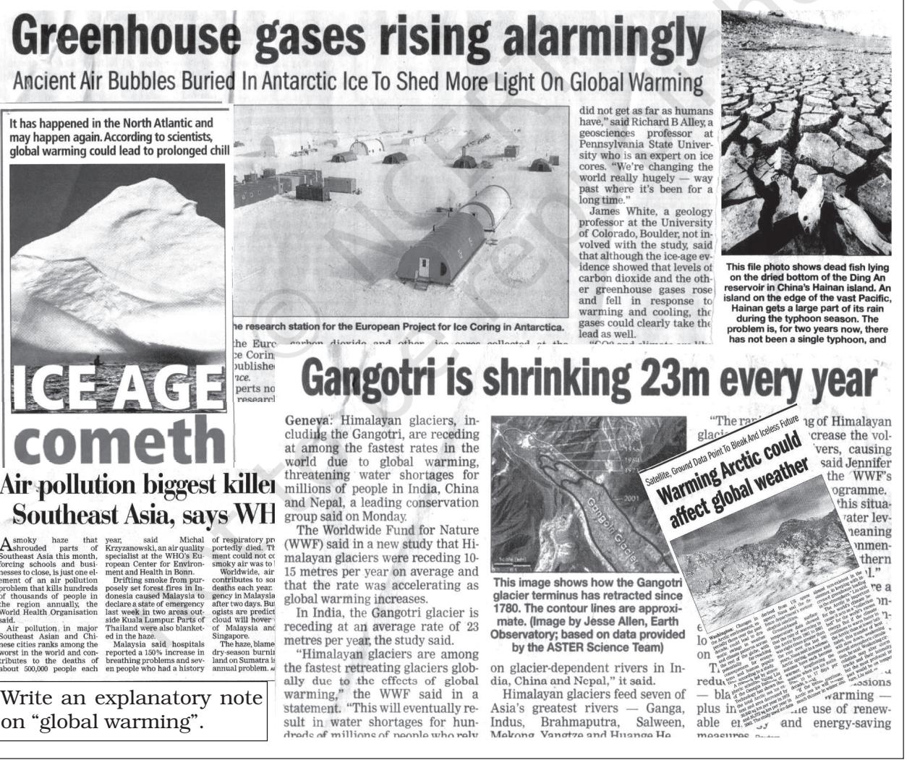

# **WORLD CLIMATE AND CLIMATE CHANGE**

CHAPTER

T he world climate can be studied by organising information and data on climate and synthesising them in smaller units for easy understanding, description and analysis. Three broad approaches have been adopted for classifying climate. They are empirical, genetic and applied. Empirical classification is based on observed data, particularly on temperature and precipitation. Genetic classification attempts to organise climates according to their causes. Applied classification is for specific purpose.

# **KOEPPE N'S SCHEME OF CLASSIFICATION OF CLIMATE**

The most widely used classification of climate is the empirical climate classification scheme developed by V. Koeppen. Koeppen identified a close relationship between the distribution of vegetation and climate. He selected certain values of temperature and precipitation and related them to the distribution of vegetation and used these values for classifying the climates. It is an empirical classification based on mean annual and mean monthly temperature and precipitation data. He introduced the use of capital and small letters to designate climatic groups and types. Although developed in 1918 and modified over a period of time, Koeppen's scheme is still popular and in use.

Koeppen recognised five major climatic groups, four of them are based on temperature and one on precipitation. Table 11.1 lists the climatic groups and their characteristics according to Koeppen. The capital letters : A,C, D and E delineate humid climates and B dry climates.

The climatic groups are subdivided into types, designated by small letters, based on seasonality of precipitation and temperature characteristics. The seasons of dryness are indicated by the small letters : f, m, w and s, where f corresponds to no dry season,

| Group | Characteristics |
| --- | --- |
| A - Tropical | Average temperature of the coldest month is 18° C or higher |
| B - Dry Climates | Potential evaporation exceeds precipitation |
| C - Warm Temperate | The average temperature of the coldest month of the (Mid-latitude) climates years is higher than minus 3°C but below 18°C |
| D - Cold Snow Forest Climates | The average temperature of the coldest month is minus 3° C or below |
| E - Cold Climates | Average temperature for all months is below 10° C |
| H - High Land | Cold due to elevation |

**Table 11.1 : Climatic Groups According to Koeppen**

m - monsoon climate, w- winter dry season and s - summer dry season. The small letters a, b, c and d refer to the degree of severity of temperature. The B- Dry Climates are subdivided using the capital letters S for steppe or semi-arid and W for deserts. The climatic types are listed in Table 11.2. The distribution of climatic groups and types is shown in Table 11.1.

islands of East Indies. Significant amount of rainfall occurs in every month of the year as thunder showers in the afternoon. The temperature is uniformly high and the annual range of temperature is negligible. The maximum temperature on any day is around 30°C while the minimum temperature is around 20°C. Tropical evergreen forests with dense canopy cover and large biodiversity are found in this climate.

| Group | Type | Letter Code | Characteristics |
| --- | --- | --- | --- |
| A-Tropical Humid Climate | Tropical wet | Af | No dry season |
|  | Tropical monsoon | Am | Monsoonal, short dry season |
|  | Tropical wet and dry | Aw | Winter dry season |
| B-Dry Climate | Subtropical steppe | BSh | Low-latitude semi arid or dry |
|  | Subtropical desert | BWh | Low-latitude arid or dry |
|  | Mid-latitude steppe | BSk | Mid-latitude semi arid or dry |
|  | Mid-latitude desert | BWk | Mid-latitude arid or dry |
| C-Warm | Humid subtropical | Cfa | No dry season, warm summer |
| temperate (Mid latitude) Climates | Mediterranean | Cs | Dry hot summer |
|  | Marine west coast | Cfb | No dry season, warm and cool summer |
| D-Cold Snow | Humid continental | Df | No dry season, severe winter |
| forest Climates | Subarctic | Dw | Winter dry and very severe |
| E-Cold Climates | Tundra | ET | No true summer |
|  | Polar ice cap | EF | Perennial ice |
| H-Highland | Highland | H | Highland with snow cover |

**Table 11.2 : Climatic Types According to Koeppen**

# **Group A : Tropical Humid Climates**

Tropical humid climates exist between Tropic of Cancer and Tropic of Capricorn. The sun being overhead throughout the year and the presence of Inter Tropical Convergence Zone (ITCZ) make the climate hot and humid. Annual range of temperature is very low and annual rainfall is high. The tropical group is divided into three types, namely (i) Af- Tropical wet climate; (ii) Am - Tropical monsoon climate; (iii) Aw- Tropical wet and dry climate.

## *Tropical Wet Climate (Af)*

Tropical wet climate is found near the equator. The major areas are the Amazon Basin in South America, western equatorial Africa and the

# *Tropical Monsoon Climate (Am)*

Tropical monsoon climate (Am) is found over the Indian sub-continent, North Eastern part of South America and Northern Australia. Heavy rainfall occurs mostly in summer. Winter is dry. The detailed climatic account of this climatic type is given in the book on *India: Physical Environment*.

### *Tropical Wet and Dry Climate (Aw)*

Tropical wet and dry climate occurs north and south of Af type climate regions. It borders with dry climate on the western part of the continent and Cf or Cw on the eastern part. Extensive Aw climate is found to the north and south of the Amazon forest in Brazil and adjoining parts of Bolivia and Paraguay in South America, Sudan and south of Central Africa. The annual rainfall in this climate is considerably less than that in Af and Am climate types and is variable also. The wet season is shorter and the dry season is longer with the drought being more severe. Temperature is high throughout the year and diurnal ranges of temperature are the greatest in the dry season. Deciduous forest and tree-shredded grasslands occur in this climate.

#### **Dry Climates : B**

Dry climates are characterised by very low rainfall that is not adequate for the growth of plants. These climates cover a very large area of the planet extending over large latitudes from 15° - 60° north and south of the equator. At low latitudes, from 15° - 30°, they occur in the area of subtropical high where subsidence and inversion of temperature do not produce rainfall. On the western margin of the continents, adjoining the cold current, particularly over the west coast of South America, they extend more equatorwards and occur on the coast land. In middle latitudes, from 35° - 60° north and south of equator, they are confined to the interior of continents where maritime-humid winds do not reach and to areas often surrounded by mountains.

Dry climates are divided into steppe or semi-arid climate (BS) and desert climate (BW). They are further subdivided as subtropical steppe (BSh) and subtropical desert (BWh) at latitudes from 15° - 35° and mid-latitude steppe (BSk) and mid-latitude desert (BWk) at latitudes between 35° - 60°.

#### *Subtropical Steppe (BSh) and Subtropical Desert (BWh) Climates*

Subtropical steppe (BSh) and subtropical desert (BWh) have common precipitation and temperature characteristics. Located in the transition zone between humid and dry climates, subtropical steppe receives slightly more rainfall than the desert, adequate enough for the growth of sparse grasslands. The rainfall in both the climates is highly variable. The variability in the rainfall affects the life in the steppe much more than in the desert, more often causing famine. Rain occurs in short intense thundershowers in deserts and is ineffective in building soil moisture. *Fog* is common in coastal deserts bordering cold currents. Maximum temperature in the summer is very high. The highest shade temperature of 58° C was recorded at *Al Aziziyah*, Libya on 13 September 1922. The annual and diurnal ranges of temperature are also high.

#### *Warm Temperate (Mid-Latitude) Climates-C*

Warm temperate (mid-latitude) climates extend from 30° - 50° of latitude mainly on the eastern and western margins of continents. These climates generally have warm summers with mild winters. They are grouped into four types: (i) Humid subtropical, i.e. dry in winter and hot in summer (Cwa); (ii) Mediterranean (Cs); (iii) Humid subtropical, i.e. no dry season and mild winter (Cfa); (iv) Marine west coast climate (Cfb).

#### *Humid Subtropical Climate (Cwa)*

Humid subtropical climate occurs poleward of Tropic of Cancer and Capricorn, mainly in North Indian plains and South China interior plains. The climate is similar to Aw climate except that the temperature in winter is warm.

#### *Mediterranean Climate (Cs)*

As the name suggests, Mediterranean climate occurs around Mediterranean sea, along the west coast of continents in subtropical latitudes between 30° - 40° latitudes e.g. — Central California, Central Chile, along the coast in south eastern and south western Australia. These areas come under the influence of sub tropical high in summer and westerly wind in winter. Hence, the climate is characterised by hot, dry summer and mild, rainy winter. Monthly average temperature in summer is around 25° C and in winter below 10°C. The annual precipitation ranges between 35 - 90 cm.

#### *Humid Subtropical (Cfa) Climate*

Humid subtropical climate lies on the eastern parts of the continent in subtropical latitudes. In this region the air masses are generally unstable and cause rainfall throughout the year. They occur in eastern United States of America, southern and eastern China,

southern Japan, northeastern Argentina, coastal south Africa and eastern coast of Australia. The annual averages of precipitation vary from 75-150 cm. Thunderstorms in summer and frontal precipitation in winter are common. Mean monthly temperature in summer is around 27°C, and in winter it varies from 5°-12° C. The daily range of temperature is small.

## *Marine West Coast Climate (Cfb)*

Marine west coast climate is located poleward from the Mediterranean climate on the west coast of the continents. The main areas are: Northwestern Europe, west coast of North America, north of California, southern Chile, southeastern Australia and New Zealand. Due to marine influence, the temperature is moderate and in winter, it is warmer than for its latitude. The mean temperature in summer months ranges from 15°-20°C and in winter 4°-10°C. The annual and daily ranges of temperature are small. Precipitation occurs throughout the year. Precipitation varies greatly from 50-250cm.

# **Cold Snow Forest Climates (D)**

Cold snow forest climates occur in the large continental area in the northern hemisphere between 40°-70° north latitudes in Europe, Asia and North America. Cold snow forest climates are divided into two types: (i) Df- cold climate with humid winter; (ii) Dw- cold climate with dry winter. The severity of winter is more pronounced in higher latitudes.

### *Cold Climate with Humid Winters (Df)*

Cold climate with humid winter occurs poleward of marine west coast climate and mid latitude steppe. The winters are cold and snowy. The frost free season is short. The annual ranges of temperature are large. The weather changes are abrupt and short. Poleward, the winters are more severe.

### *Cold Climate with Dry Winters (Dw)*

Cold climate with dry winter occurs mainly over Northeastern Asia. The development of pronounced winter anti cyclone and its weakening in summer sets in monsoon like reversal of wind in this region. Poleward summer temperatures are lower and winter temperatures are extremely low with many locations experiencing below freezing point temperatures for up to seven months in a year. Precipitation occurs in summer. The annual precipitation is low from 12-15 cm.

### **Polar Climates (E)**

Polar climates exist poleward beyond 70° latitude. Polar climates consist of two types: (i) Tundra (ET); (ii) Ice Cap (EF).

### *Tundra Climate (ET)*

The tundra climate (ET) is so called after the types of vegetation, like low growing mosses, lichens and flowering plants. This is the region of permafrost where the sub soil is permanently frozen. The short growing season and water logging support only low growing plants. During summer, the tundra regions have very long duration of day light.

### *Ice Cap Climate (EF)*

The ice cap climate (EF) occurs over interior Greenland and Antartica. Even in summer, the temperature is below freezing point. This area receives very little precipitation. The snow and ice get accumulated and the mounting pressure causes the deformation of the ice sheets and they break. They move as icebergs that float in the Arctic and Antarctic waters. Plateau Station , Antarctica ,79°S, portray this climate.

### **Highland Climates (H)**

Highland climates are governed by topography. In high mountains, large changes in mean temperature occur over short distances. Precipitation types and intensity also vary spatially across high lands. There is vertical zonation of layering of climatic types with elevation in the mountain environment.

#### **CLIMATE CHANGE**

The earlier chapters on climate summarised our understanding of climate as it prevails now. The type of climate we experience now might be prevailing over the last 10,000 years with minor and occasionally wide fluctuations. The planet earth has witnessed many variations in climate since the beginning. Geological records show alteration of glacial and inter-glacial periods. The geomorphological features, especially in high altitudes and high latitudes, exhibit traces of advances and retreats of glaciers. The sediment deposits in glacial lakes also reveal the occurrence of warm and cold periods. The rings in the trees provide clues about wet and dry periods. Historical records describe the vagaries in climate. All these evidences indicate that change in climate is a natural and continuous process.

India also witnessed alternate wet and dry periods. Archaeological findings show that the Rajasthan desert experienced wet and cool climate around 8,000 B.C. The period 3,000- 1,700 B.C. had higher rainfall. From about 2,000-1,700 B.C., this region was the centre of the Harappan civilisation. Dry conditions accentuated since then.

In the geological past, the earth was warm some 500-300 million years ago, through the Cambrian, Ordovician and Silurian periods. During the Pleistocene epoch, glacial and inter-glacial periods occurred, the last major peak glacial period was about 18,000 years ago. The present inter-glacial period started 10,000 years ago.

#### **Climate in the recent past**

Variability in climate occurs all the time. The nineties decade of the last century witnessed extreme weather events. The 1990s recorded the warmest temperature of the century and some of the worst floods around the world. The worst devastating drought in the Sahel region, south of the Sahara desert, from 1967-1977 is one such variability. During the 1930s, severe drought occurred in southwestern Great Plains of the United States, described as the *dust bowl*. Historical records of crop yield or crop failures, of floods and migration of people tell about the effects of changing climate. A number of times Europe witnessed warm, wet, cold and dry periods, the significant episodes were the warm and dry conditions in the tenth and eleventh centuries, when the Vikings settled in Greenland. Europe witnessed "Little Ice Age" from 1550 to about 1850. From about 1885-1940 world temperature showed an upward trend. After 1940, the rate of increase in temperature slowed down.

#### **Causes of Climate Change**

The causes for climate change are many. They can be grouped into astronomical and terrestrial causes. The astronomical causes are the changes in solar output associated with sunspot activities. Sunspots are dark and cooler patches on the sun which increase and decrease in a cyclical manner. According to some meteorologists, when the number of sunspots increase, cooler and wetter weather and greater storminess occur. A decrease in sunspot numbers is associated with warm and drier conditions. Yet, these findings are not statistically significant.

An another astronomical theory is Millankovitch oscillations, which infer cycles in the variations in the earth's orbital characteristics around the sun, the wobbling of the earth and the changes in the earth's axial tilt. All these alter the amount of insolation received from the sun, which in turn, might have a bearing on the climate.

Volcanism is considered as another cause for climate change. Volcanic eruption throws up lots of aerosols into the atmosphere. These aerosols remain in the atmosphere for a considerable period of time reducing the sun's radiation reaching the Earth's surface. After the recent Pinatoba and El Cion volcanic eruptions, the average temperature of the earth fell to some extent for some years.

The most important anthropogenic effect on the climate is the increasing trend in the concentration of greenhouse gases in the atmosphere which is likely to cause global warming.

### **Global Warming**

Due to the presence of greenhouse gases, the atmosphere is behaving like a *greenhouse*. The atmosphere also transmits the incoming solar radiation but absorbs the vast majority of long wave radiation emitted upwards by the earth's surface. The gases that absorb long wave radiation are called greenhouse gases. The processes that warm the atmosphere are often collectively referred to as the *greenhouse effect*.

> The term *greenhouse* is derived from the analogy to a greenhouse used in cold areas for preserving heat. *A greenhouse* is made up of glass. The glass which is transparent to incoming short wave solar radiation is opaque to outgoing long wave radiation. The glass, therefore, allows in more radiation and prevents the long wave radiation going outside the glass house, causing the temperature inside the glasshouse structure warmer than outside. When you enter a car or a bus, during summers, where windows are closed, you feel more heat than outside. Likewise during winter the vehicles with closed doors and windows remain warmer than the temperature outside. This is another example of the greenhouse effect.

### *Greenhouse Gases(GHGs)*

The primary GHGs of concern today are carbon dioxide (CO2 ), Chlorofluorocarbons (CFCs), methane (CH4 ), nitrous oxide (N2O) and ozone (O3 ). Some other gases such as nitric oxide (NO) and carbon monoxide (CO) easily react with GHGs and affect their concentration in the atmosphere.

The effectiveness of any given GHG molecule will depend on the magnitude of the increase in its concentration, its life time in the atmosphere and the wavelength of radiation that it absorbs. The chlorofluorocarbons (CFCs) are highly effective. *Ozone* which absorbs ultra violet radiation in the stratosphere is very effective in absorbing terrestrial radiation when it is present in the lower troposphere. Another important point to be noted is that the more time the GHG molecule remains in the atmosphere, the longer it will take for earth's atmospheric system to recover from any change brought about by the latter.

The *largest concentration* of GHGs in the atmosphere is *carbon dioxide*. The emission of CO2 comes mainly from fossil fuel combustion (oil, gas and coal). Forests and oceans are the sinks for the carbon dioxide. Forests use CO2 in their growth. So, deforestation due to changes in land use, also increases the concentration of Co2 . The time taken for atmospheric CO2 to adjust to changes in sources to sinks is 20-50 years. It is rising at about 0.5 per cent annually. Doubling of concentration of CO2 over pre-industrial level is used as an index for estimating the changes in climate in climatic models.

Chlorofluorocarbons (CFCs) are products of human activity. *Ozone* occurs in the stratosphere where ultra-violet rays convert oxygen into ozone. Thus, ultra violet rays do not reach the earth's surface. The CFCs which drift into the stratosphere destroy the ozone. Large depletion of ozone occurs over Antarctica. *The* depletion *of ozone concentration in the* stratosphere is called the *ozone hole*. This allows the ultra violet rays to pass through the troposphere.

International efforts have been initiated for reducing the emission of GHGs into the atmosphere. The most important one is the *Kyoto protocol* proclaimed in 1997. This protocol went into effect in 2005, ratified by 141 nations. Kyoto protocol bounds the 35 industrialised countries to reduce their emissions by the year 2012 to 5 per cent less than the levels prevalent in the year 1990.

The increasing trend in the concentration of GHGs in the atmosphere may, in the long run, warm up the earth. Once the global warming sets in, it will be difficult to reverse it. The effect of global warming may not be uniform everywhere. Nevertheless, the adverse effect due to global warming will adversely affect the life supporting system. Rise in the sea level due to melting of glaciers and ice-caps and thermal expansion of the sea may inundate large parts of the coastal area and islands, leading to social problems. This is another cause for serious concern for the world community. Efforts have already been initiated to control the emission of GHGs and to arrest the trend towards global warming. Let us hope the world community responds to this challenge and adopts a lifestyle that leaves behind a livable world for the generations to come.

One of the major concerns of the world today is global warming. Let us look at how much the planet has warmed up from the temperature records.

The annual average near -surface air temperature of the world is approximately 14oC.

An increasing trend in temperature was discernible in the 20th century. The greatest warming of the 20th century was during the two periods, 1901-44 and 1977-99. Over each of these two periods, global temperatures rose by about 0.4oC. In between, there was a slight cooling, which was more marked in the Northern Hemisphere.

The globally averaged annual mean temperature at the end of the 20th century was about 0.6oC above that recorded at the end of the 19th century. The seven warmest years during the 1856-2000 were recorded in the last decade. The year 1998 was the warmest year, probably not only for the 20th century but also for the whole millennium.

#### **EXERCISES**

- 1. Multiple choice questions.
	- (i) Which one of the following is suitable for Koeppen's "A" type of climate?
		- (a) High rainfall in all the months
		- (b) Mean monthly temperature of the coldest month more than freezing point
		- (c) Mean monthly temperature of all the months more than 18o C
		- (d) Average temperature for all the months below 10° C
	- (ii) Koeppen's system of classification of climates can be termed as :
		- (a) Applied (b) Systematic (c) Genetic (d) Empirical
	- (iii) Most of the Indian Peninsula will be grouped according to Koeppen's system under:
		- (a) "Af" (b) "BSh" (c) "Cfb" (d) "Am"
	- (iv) Which one of the following years is supposed to have recorded the warmest temperature the world over?
		- (a) 1990 (b) 1998 (c) 1885 (d) 1950
	- (v) Which one of the following groups of four climates represents humid conditions?
		- (a) A—B—C—E
		- (b) A—C—D—E
		- (c) B—C—D—E
		- (d) A—C—D—F
- 2. Answer the following questions in about 30 words.
	- (i) Which two climatic variables are used by Koeppen for classification of the climate?
	- (ii) How is the "genetic" system of classification different from the "empirical one"?
	- (iii) Which types of climates have very low range of temperature?
	- (iv) What type of climatic conditions would prevail if the sun spots increase?
- 3. Answer the following questions in about 150 words.
	- (i) Make a comparison of the climatic conditions between the "A" and "B" types of climate.
	- (ii) What type of vegetation would you find in the "C" and "A" type(s) of climate?
	- (iii) What do you understand by the term "Greenhouse Gases"? Make a list of greenhouse gases.

#### **Project Work**

Collect information about Kyoto declaration related to global climate changes.

