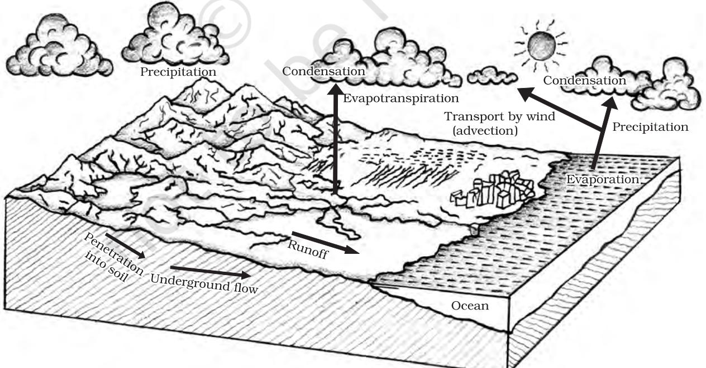
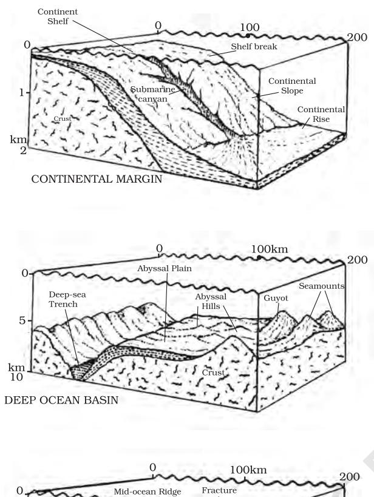
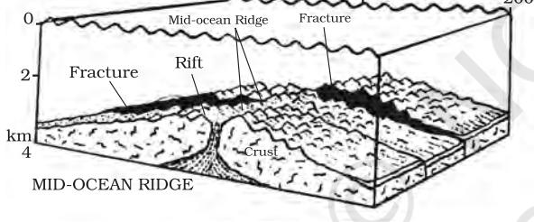
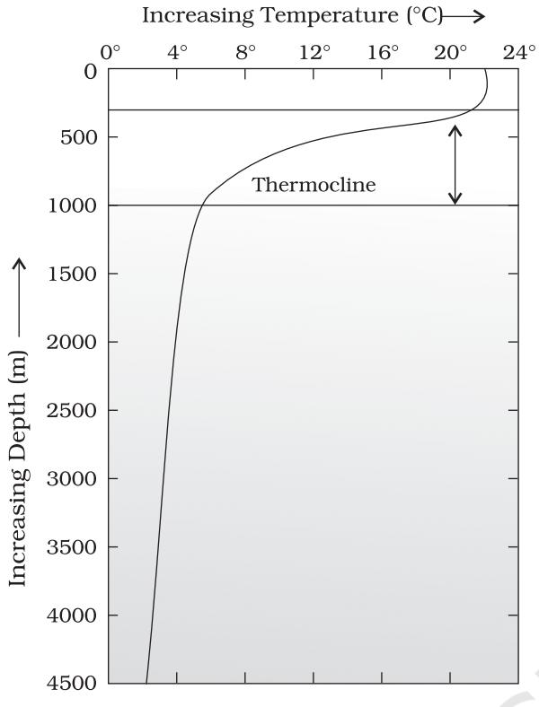
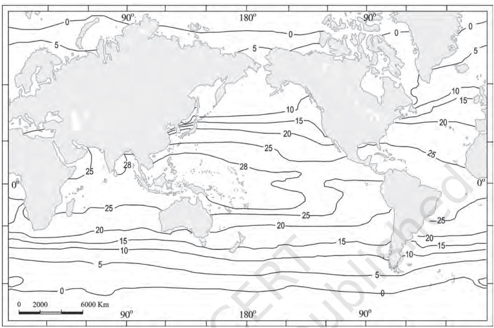
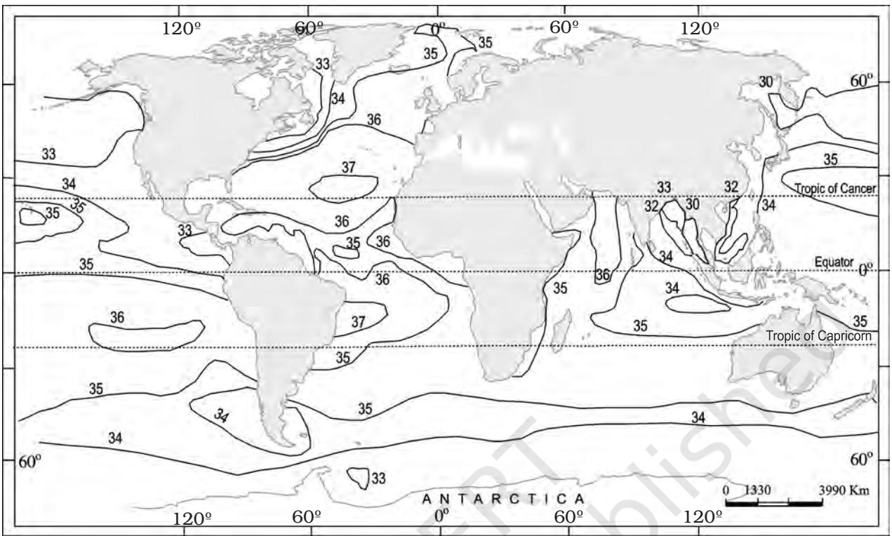

# **UNIT V**

### **WATER (OCEANS)**

*This unit deals with*

- *• Hydrological Cycle*
- *• Oceans submarine relief; distribution of temperature and salinity; movements of ocean water-waves, tides and currents*

#### CHAPTER

## **WATER (OCEANS)**

C an we think of life without water? It is said that the water is life. Water is an essential component of all life forms that exist over the surface of the earth. The creatures on the earth are lucky that it is a water planet, otherwise we all would have no existence. Water is a rare commodity in our solar system. There is no water on the sun or anywhere else in the solar system. The earth, fortunately has an abundant supply of water on its surface. Hence, our planet is called the *'Blue Planet'.*

#### **HYDROLOGICAL CYCLE**

Water is a cyclic resource. It can be used and re-used. Water also undergoes a cycle from the ocean to land and land to ocean. The hydrological cycle describes the movement of water on, in, and above the earth. The water cycle has been working for billions of years and all the life on earth depends on it. Next to air, water is the most important element required for the existence of life on earth. The distribution of water on earth is quite uneven. Many locations have plenty of water while others have very limited quantity. The *hydrological cycle*, is the circulation of water within the earth's hydrosphere in different forms i.e. the liquid, solid and the gaseous phases. It also refers to the continuous exchange of water between the oceans,

**Figure 12.1 : Hydrological Cycle**

| Components | Processes |
| --- | --- |
| Water storage | Evaporation |
| in oceans | Evapotranspiration |
|  | Sublimation |
| Water in the | Condensation |
| atmosphere | Precipitation |
| Water storage in | Snowmelt runoff |
| ice and snow | to streams |
| Surface runoff | Stream flow freshwater |
|  | storage infiltration |
| Groundwater storage | Groundwater |
|  | discharge springs |

**Table 12.1 : Components and Processes of the Water Cycle**

atmosphere, landsurface and subsurface and the organisms.

About 71 per cent of the planetary water is found in the oceans. The remaining is held as freshwater in glaciers and icecaps, groundwater sources, lakes, soil moisture, atmosphere, streams and within life. Nearly 59 per cent of the water that falls on land returns to the atmosphere through evaporation from over the oceans as well as from other places. The remainder runs-off on the surface, infiltrates into the ground or a part of it becomes glacier.

It is to be noted that the renewable water on the earth is constant while the demand is increasing tremendously. This leads to water crisis in different parts of the world — spatially and temporally. The pollution of river waters has further aggravated the crisis. How can you intervene in improving the water quality and augmenting the available quantity of water?

#### **RELIEF OF THE OCEAN FLOOR**

The oceans are confined to the great depressions of the earth's outer layer. In this section, we shall see the nature of the ocean basins of the earth and their topography. The oceans, unlike the continents, merge so naturally into one another that it is hard to demarcate them. The geographers have divided the oceanic part of the earth into five oceans, namely the Pacific, the Atlantic, the Indian, Southern ocean and the Arctic. The various seas, bays, gulfs and other inlets are parts of these four large oceans.

A major portion of the ocean floor is found between 3-6 km below the sea level. The 'land' under the waters of the oceans, that is, the ocean floor exhibits complex and varied features as those observed over the land (Figure 12.2). The floors of the oceans are rugged with the world's largest mountain ranges, deepest trenches and the largest plains. These features are formed, like those of the continents, by the factors of tectonic, volcanic and depositional processes.

#### **Divisions of the Ocean Floors**

The ocean floors can be divided into four major divisions: (i) the Continental Shelf; (ii) the Continental Slope; (iii) the Deep Sea Plain; (iv) the Oceanic Deeps. Besides, these divisions there are also major and minor relief features in the ocean floors like ridges, hills, sea mounts, guyots, trenches, canyons, etc.

#### *Continental Shelf*

The continental shelf is the extended margin of each continent occupied by relatively shallow seas and gulfs. It is the shallowest part of the ocean showing an average gradient of 1° or even less. The shelf typically ends at a very steep slope, called the shelf break.

The width of the continental shelves vary from one ocean to another. The average width of continental shelves is about 80 km. The shelves are almost absent or very narrow along some of the margins like the coasts of Chile, the west coast of Sumatra, etc. On the contrary, the Siberian shelf in the Arctic Ocean, the largest in the world, stretches to 1,500 km in width. The depth of the shelves also varies. It may be as shallow as 30 m in some areas while in some areas it is as deep as 600 m.

The continental shelves are covered with variable thicknesses of sediments brought down by rivers, glaciers, wind, from the land and distributed by waves and currents. Massive sedimentary deposits received over a long time by the continental shelves, become the source of fossil fuels.

**Figure 12.2 : Relief features of ocean floors**

#### *Continental Slope*

The continental slope connects the continental shelf and the ocean basins. It begins where the bottom of the continental shelf sharply drops off into a steep slope. The gradient of the slope region varies between 2-5°. The depth of the slope region varies between 200 and 3,000 m. The slope boundary indicates the end of the continents. Canyons and trenches are observed in this region.

#### *Deep Sea Plain*

Deep sea plains are gently sloping areas of the ocean basins. These are the flattest and smoothest regions of the world. The depths vary between 3,000 and 6,000m. These plains are covered with fine-grained sediments like clay and silt.

#### *Oceanic Deeps or Trenches*

These areas are the deepest parts of the oceans. The trenches are relatively steep sided, narrow basins. They are some 3-5 km deeper than the surrounding ocean floor. They occur at the bases of continental slopes and along island arcs and are associated with active volcanoes and strong earthquakes. That is why they are very significant in the study of plate movements. As many as 57 deeps have been explored so far; of which 32 are in the Pacific Ocean; 19 in the Atlantic Ocean and 6 in the Indian Ocean.

#### **Minor Relief Features**

Apart from the above mentioned major relief features of the ocean floor, some minor but significant features predominate in different parts of the oceans.

#### *Mid-Oceanic Ridges*

A mid-oceanic ridge is composed of two chains of mountains separated by a large depression. The mountain ranges can have peaks as high as 2,500 m and some even reach above the ocean's surface. Iceland, a part of the mid-Atlantic Ridge, is an example.

#### *Seamount*

It is a mountain with pointed summits, rising from the seafloor that does not reach the surface of the ocean. Seamounts are volcanic in origin. These can be 3,000-4,500 m tall. The Emperor seamount, an extension of the Hawaiian Islands in the Pacific Ocean, is a good example.

#### *Submarine Canyons*

These are deep valleys, some comparable to the Grand Canyon of the Colorado river. They are sometimes found cutting across the continental shelves and slopes, often extending from the mouths of large rivers. The Hudson Canyon is the best known submarine canyon in the world.

#### *Guyots*

It is a flat topped seamount. They show evidences of gradual subsidence through stages to become flat topped submerged mountains. It is estimated that more than 10,000 seamounts and guyots exist in the Pacific Ocean alone.

#### *Atoll*

These are low islands found in the tropical oceans consisting of coral reefs surrounding a central depression. It may be a part of the sea (lagoon), or sometimes form enclosing a body of fresh, brackish, or highly saline water.

#### **TEMPERATURE OF OCEAN WATERS**

This section deals with the spatial and vertical variations of temperature in various oceans. Ocean waters get heated up by the solar energy just as land. The process of heating and cooling of the oceanic water is slower than land.

#### **Factors Affecting Temperature Distribution**

The factors which affect the distribution of temperature of ocean water are :

- (i) *Latitude* : the temperature of surface water decreases from the equator towards the poles because the amount of insolation decreases poleward.
- (ii) *Unequal distribution of land and water* : the oceans in the northern hemisphere receive more heat due to their contact with larger extent of land than the oceans in the southern hemisphere.
- (iii) *Prevailing wind* : the winds blowing from the land towards the oceans drive warm surface water away form the coast resulting in the upwelling of cold water from below. It results into the longitudinal variation in the temperature. Contrary to this, the onshore winds pile up warm water near the coast and this raises the temperature.

- (iv) *Ocean currents* : warm ocean currents raise the temperature in cold areas while the cold currents decrease the temperature in warm ocean areas. Gulf stream (warm current) raises the temperature near the eastern coast of North America and the West Coast of Europe while the Labrador current (cold current) lowers the temperature near the north-east coast of North America.
All these factors influence the temperature of the ocean currents locally. The enclosed seas in the low latitudes record relatively higher temperature than the open seas; whereas the enclosed seas in the high latitudes have lower temperature than the open seas.

#### **Horizontal and Vertical Distribution of Temperature**

The temperature-depth profile for the ocean water shows how the temperature decreases with the increasing depth. The profile shows a boundary region between the surface waters of the ocean and the deeper layers. The boundary usually begins around 100 - 400 m below the sea surface and extends several hundred of metres downward (Figure 12.3). This boundary region, from where there is a rapid decrease of temperature, is called the *thermocline*. About 90 per cent of the total volume of water is found below the thermocline in the deep ocean. In this zone, temperatures approach 0° C.

The temperature structure of oceans over middle and low latitudes can be described as a three-layer system from surface to the bottom.

The *first layer* represents the top layer of warm oceanic water and it is about 500m thick with temperatures ranging between 20° and 25° C. This layer, within the tropical region, is present throughout the year but in mid latitudes it develops only during summer.

The *second layer* called the thermocline layer lies below the first layer and is characterised by rapid decrease in temperature with increasing depth. The thermocline is 500 -1,000 m thick.

The *third layer* is very cold and extends upto the deep ocean floor. In the Arctic and

**Figure 12.3 : Thermocline**

Antartic circles, the surface water temperatures are close to 0° C and so the temperature change with the depth is very slight. Here, only one layer of cold water exists, which extends from surface to deep ocean floor.

The average temperature of surface water of the oceans is about 27°C and it gradually decreases from the equator towards the poles. The rate of decrease of temperature with increasing latitude is generally 0.5°C per latitude. The average temperature is around 22°C at 20° latitudes, 14° C at 40° latitudes and 0° C near poles. The oceans in the northern hemisphere record relatively higher temperature than in the southern hemisphere. The highest temperature is not recorded at the equator but slightly towards north of it. The average annual temperatures for the northern and southern hemisphere are around 19° C and 16° C respectively. This variation is due to the unequal distribution of land and water in the northern and southern hemispheres. Figure 12.4 shows the spatial pattern of surface temperature of the oceans.

It is a well known fact that the maximum temperature of the oceans is always at their surfaces because they directly receive the heat from the sun and the heat is transmitted to the lower sections of the oceans through the process of convection. It results into decrease of temperature with the increasing depth, but the rate of decrease is not uniform throughout. The temperature falls very rapidly up to the depth of 200 m and thereafter, the rate of decrease of temperature is slowed down.

#### **SALINITY OF OCEAN WATERS**

All waters in nature, whether rain water or ocean water, contain dissolved mineral salts. Salinity is the term used to define the total content of dissolved salts in sea water (Table 12.4). It is calculated as the amount of salt (in gm) dissolved in 1,000 gm (1 kg) of seawater. It is usually expressed as parts per thousand (o/oo ) or ppt. Salinity is an important property of sea water. Salinity of 24.7 o/oo has been considered as the upper limit to demarcate 'brackish water'.

Factors affecting ocean salinity are mentioned below:

- (i) The salinity of water in the surface layer of oceans depend mainly on evaporation and precipitation.
- (ii) Surface salinity is greatly influenced in coastal regions by the fresh water flow from rivers, and in polar regions by the processes of freezing and thawing of ice.
- (iii) Wind, also influences salinity of an area by transferring water to other areas.
- (iv) The ocean currents contribute to the salinity variations. Salinity, temperature and density of water are interrelated. Hence, any change in the temperature or density influences the salinity of water in an area.

Highest salinity in water bodies Lake Van in Turkey (330 o/oo ), Dead Sea (238 o/oo ), Great Salt Lake (220 o/oo )

**Figure 12.4 : Spatial pattern of surface temperature (°C) of the oceans**

#### **HORIZONTAL DISTRIBUTION OF SALINITY**

The salinity for normal open ocean ranges between 33o/oo and 37 o/oo . In the land locked Red Sea, it is as high as 41o/oo , while in the estuaries and the Arctic, the salinity fluctuates from 0 - 35 o/oo , seasonally. In hot and dry regions, where evaporation is high, the salinity sometimes reaches to 70 o/oo .

The salinity variation in the Pacific Ocean is mainly due to its shape and larger areal extent. Salinity decreases from 35 o/oo - 31 o/oo on the western parts of the northern hemisphere because of the influx of melted water from the Arctic region. In the same way, after 15° - 20° south, it decreases to 33 o/oo .

The average salinity of the Atlantic Ocean is around 36 o/oo. The highest salinity is recorded between 15° and 20° latitudes. Maximum salinity (37 o/oo ) is observed between 20° N and 30° N and 20° W - 60° W. It gradually decreases towards the north. The North Sea, in spite of its location in higher latitudes, records higher salinity due to more saline water brought by the North Atlantic Drift. Baltic Sea records low salinity due to influx of river waters in large quantity. The Mediterranean Sea records higher salinity due to high evaporation. Salinity is, however, very low in Black Sea due to enormous fresh water influx by rivers. See the atlas to find out the rivers joining Black Sea.

The average salinity of the Indian Ocean is 35 o/oo. The low salinity trend is observed in the Bay of Bengal due to influx of river water. On the contrary, the Arabian Sea shows higher salinity due to high evaporation and low influx of fresh water. Figure 12.5 shows the salinity of the World's oceans.

#### **Vertical Distribution of Salinity**

Salinity changes with depth, but the way it changes depends upon the location of the

**Figure12.5 : Surface salinity of the World's Oceans**

sea. Salinity at the surface increases by the loss of water to ice or evaporation, or decreased by the input of fresh waters, such as from the rivers. Salinity at depth is very much fixed, because there is no way that water is 'lost', or the salt is 'added.' There is a marked difference in the salinity between the surface zones and the deep zones of the oceans. The lower salinity water rests above the higher salinity dense water. Salinity, generally, increases with depth and there is a distinct zone called the *halocline***,** where salinity increases sharply. Other factors being constant, increasing salinity of seawater causes its density to increase. High salinity seawater, generally, sinks below the lower salinity water. This leads to stratification by salinity.

#### **EXERCISES**

- 1. Multiple choice questions.
	- (i) Identify the element which is not a part of the hydrological cycle
		- (a) Evaporation (c) Precipitation
		- (b) Hydration (d) Condensation
	- (ii) The average depth of continental slope varies between
		- (a) 2–20m (c) 20–200m
		- (b) 200–2,000m (d) 2,000–20,000m
- (iii) Which one of the following is not a minor relief feature in the oceans:
	- (a) Seamount (c) Oceanic Deep
	- (b) Atoll (d) Guyot
- (iv) Salinity is expressed as the amount of salt in grams dissolved in sea water per
	- (a) 10 gm (c) 100 gm
	- (b) 1,000 gm (d) 10,000 gm
- (v) Which one of the following is the smallest ocean:
	- (a) Indian Ocean (c) Atlantic Ocean
	- (b) Arctic Ocean (d) Pacific Ocean
- 2. Answer the following questions in about 30 words.
	- (i) Why do we call the earth a Blue Planet?
	- (ii) What is a continental margin?
	- (iii) List out the deepest trenches of various oceans.
	- (iv) What is a thermocline?
	- (v) When you move into the ocean what thermal layers would you encounter? Why the temperature varies with depth?
	- (vi) What is salinity of sea water?
- 3. Answer the following questions in about 150 words.
	- (i) How are various elements of the hydrological cycle interrelated?
	- (ii) Examine the factors that influence the temperature distribution of the oceans.

#### **Project Work**

- (i) Consult the atlas and show ocean floor relief on the outline of the world map.
- (ii) Identify the areas of mid oceanic ridges from the Indian Ocean.

